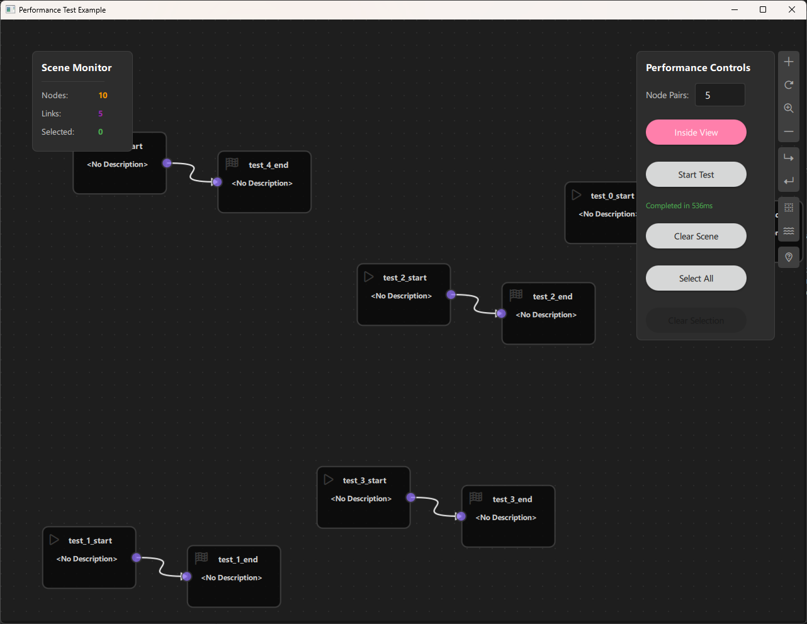

# Performance Analyzer Example

## Overview

The Performance Analyzer Example is a benchmarking and stress-testing tool designed to evaluate NodeLink's performance under various load conditions. This example allows you to create large numbers of nodes and links programmatically, measure operation times, and monitor system performance metrics. It's an essential tool for developers who want to understand NodeLink's scalability, optimize their applications, or test the framework's limits.


---

## a. Purpose and Use Cases

### Purpose

The Performance Analyzer Example demonstrates:

1. **Performance Benchmarking**: Measure NodeLink's performance when handling large numbers of nodes and links.

2. **Stress Testing**: Test the framework's limits by creating thousands of nodes and connections.

3. **Batch Operations**: Create multiple nodes and links efficiently using batch creation methods.

4. **Performance Monitoring**: Real-time monitoring of scene statistics (node count, link count, selection count).

5. **Operation Timing**: Measure execution time for critical operations like node creation, selection, and scene clearing.

6. **Scalability Analysis**: Understand how NodeLink performs with different scene sizes and configurations.

### Use Cases

- **Framework Development**: Test NodeLink's performance during development and optimization
- **Performance Optimization**: Identify bottlenecks and optimize node/link creation and management
- **Stress Testing**: Verify that NodeLink can handle large-scale scenes without performance degradation
- **Benchmarking**: Compare performance across different versions or configurations
- **Capacity Planning**: Determine maximum scene sizes for production applications
- **Debugging**: Identify performance issues in custom node-based applications

### Example Scenarios

- **Mass Node Creation**: Create 100, 1000, or 10000 node pairs and measure creation time
- **Selection Performance**: Test selection/deselection performance with large scenes
- **Scene Clearing**: Measure time to clear large scenes
- **Viewport Testing**: Test performance when nodes are spawned inside vs. across the entire scene
- **Memory Profiling**: Monitor memory usage with different scene sizes

### Real-World Applications

- **Large-Scale Visualizations**: Test performance for applications with many nodes (data visualization, network diagrams)
- **Complex Workflows**: Benchmark performance for workflow builders with hundreds of steps
- **Real-Time Applications**: Ensure smooth performance for applications requiring frequent updates
- **Production Planning**: Determine optimal scene sizes for production deployments

 <!-- TODO: Insert diagram showing different use cases -->

---

## b. Node Types Explained

The Performance Analyzer Example implements two simple node types designed for performance testing rather than functional complexity.

### 1. Start Node (`StartNode`)

**Purpose**: A simple node with an output port, used as the starting point in node pairs for performance testing.

**Type ID**: `CSpecs.NodeType.StartNode` (0)

**Properties**:
- Contains a single output port
- Minimal implementation for performance testing
- Acts as the source node in test pairs

**Ports**:
- **Output Port**: (Right side) - Emits data to connected End nodes

**Properties**:
- `guiConfig.width`: 100 pixels
- `guiConfig.height`: 100 pixels
- `guiConfig.color`: Gray (#444444)

**Behavior**:
- Simple node with minimal overhead
- Designed for fast creation and rendering
- Used in pairs with End nodes for link testing

**Visual Appearance**:
- Icon: Play button (Font Awesome \uf04b)
- Color: Gray (#444)
- Size: 100x100 pixels (fixed)

**Usage**: Created programmatically in batches for performance testing.

 <!-- TODO: Insert screenshot of Start node -->

---

### 2. End Node (`EndNode`)

**Purpose**: A simple node with an input port, used as the endpoint in node pairs for performance testing.

**Type ID**: `CSpecs.NodeType.EndNode` (1)

**Properties**:
- Contains a single input port
- Minimal implementation for performance testing
- Acts as the destination node in test pairs

**Ports**:
- **Input Port**: (Left side) - Receives data from connected Start nodes

**Properties**:
- `guiConfig.width`: 100 pixels
- `guiConfig.height`: 100 pixels
- `guiConfig.color`: Gray (#444444)

**Behavior**:
- Simple node with minimal overhead
- Designed for fast creation and rendering
- Used in pairs with Start nodes for link testing

**Visual Appearance**:
- Icon: Stop button (Font Awesome \uf11e)
- Color: Gray (#444)
- Size: 100x100 pixels (fixed)

**Usage**: Created programmatically in batches for performance testing.

 <!-- TODO: Insert screenshot of End node -->

---

### Node Pair Structure

For performance testing, nodes are created in pairs:
- **Start Node**: Output port on the right
- **End Node**: Input port on the left
- **Link**: Connects Start output to End input

This simple structure allows testing:
- Node creation performance
- Link creation performance
- Scene rendering performance
- Selection performance

 <!-- TODO: Insert screenshot showing a Start-End node pair with link -->

---

### Node Type Summary Table

| Node Type | Type ID | Input Ports | Output Ports | Purpose |
|-----------|---------|-------------|--------------|---------|
| Start | 0 | 0 | 1 | Source node for testing |
| End | 1 | 1 | 0 | Destination node for testing |

---

## c. Step-by-Step Building Guide

This guide will walk you through building the Performance Analyzer Example from scratch, explaining each component and how they work together.

### Prerequisites

- Qt 6.2.4 or later (Qt 6.10.0 recommended)
- CMake 3.1.0 or later
- C++ compiler with C++14 support (MSVC 2019/2022 on Windows)
- NodeLink framework built and installed
- QtQuickStream module built and installed

### Step 1: Project Setup

#### 1.1 Create Project Structure

Create the following directory structure:

```
performanceAnalyzer/
├── CMakeLists.txt
├── main.cpp
├── Main.qml
└── resources/
    ├── Core/
    ├── View/
    └── fonts/
```

#### 1.2 Configure CMakeLists.txt

Create `CMakeLists.txt` with the following configuration:

```cmake
cmake_minimum_required(VERSION 3.1.0)
set(MODULE_NAME PerformanceAnalyzer)

set(CMAKE_AUTOMOC ON)
set(CMAKE_CXX_STANDARD_REQUIRED ON)

find_package(QT NAMES Qt6 Qt5 COMPONENTS Core Gui QuickControls2 REQUIRED)
find_package(Qt${QT_VERSION_MAJOR} COMPONENTS Core Gui QuickControls2 REQUIRED)

list(APPEND QML_IMPORT_PATH ${CMAKE_BINARY_DIR}/qml)

# Create executable
qt_add_executable(${MODULE_NAME} main.cpp)

# Set CSpecs as singleton
set_source_files_properties(
    resources/Core/CSpecs.qml
    PROPERTIES
        QT_QML_SINGLETON_TYPE True
)

# Define QML module
qt_add_qml_module(${MODULE_NAME}
    URI ${MODULE_NAME}
    VERSION 1.0
    QML_FILES
        Main.qml
        resources/Core/CSpecs.qml
        resources/Core/StartNode.qml
        resources/Core/EndNode.qml
        resources/Core/PerformanceScene.qml
        resources/View/PerformanceAnalyzerView.qml
    RESOURCES
        resources/fonts/Font\ Awesome\ 6\ Pro-Thin-100.otf
        resources/fonts/Font\ Awesome\ 6\ Pro-Solid-900.otf
        resources/fonts/Font\ Awesome\ 6\ Pro-Regular-400.otf
        resources/fonts/Font\ Awesome\ 6\ Pro-Light-300.otf
)

target_include_directories(${MODULE_NAME} PUBLIC
    Qt${QT_VERSION_MAJOR}::QuickControls2)

target_link_libraries(${MODULE_NAME} PRIVATE
    Qt${QT_VERSION_MAJOR}::Core
    Qt${QT_VERSION_MAJOR}::Gui
    Qt${QT_VERSION_MAJOR}::QuickControls2
    NodeLinkplugin
    QtQuickStreamplugin
)
```

**Key Points**:
- Links to `NodeLinkplugin` and `QtQuickStreamplugin`
- Sets `CSpecs.qml` as a singleton for global access
- Includes Font Awesome fonts for icons

---

### Step 2: Create Specifications (CSpecs.qml)

Create `resources/Core/CSpecs.qml` - a singleton that defines node type constants:

```qml
pragma Singleton
import QtQuick

QtObject {
    enum NodeType {
        StartNode = 0,
        EndNode = 1
    }
}
```

**Purpose**: Provides type-safe constants for node types used in performance testing.

---

### Step 3: Create Node Types

#### 3.1 StartNode.qml

Create `resources/Core/StartNode.qml`:

```qml
import QtQuick
import NodeLink

Node {
    type: CSpecs.NodeType.StartNode
    nodeData: I_NodeData {}

    guiConfig.width: 100
    guiConfig.height: 100

    Component.onCompleted: addPorts();

    onCloneFrom: function (baseNode) {
        nodeData.data = null;
    }

    function addPorts() {
        let _port1 = NLCore.createPort();
        _port1.portType = NLSpec.PortType.Output
        _port1.portSide = NLSpec.PortPositionSide.Right
        _port1.enable = true
        addPort(_port1);
    }
}
```

**Key Features**:
- Single output port on the right side
- Fixed size (100x100) for consistent performance
- Minimal implementation for fast creation

---

#### 3.2 EndNode.qml

Create `resources/Core/EndNode.qml`:

```qml
import QtQuick
import NodeLink

Node {
    type: CSpecs.NodeType.EndNode
    nodeData: I_NodeData {}

    guiConfig.width: 100
    guiConfig.height: 100

    Component.onCompleted: addPorts();

    onCloneFrom: function (baseNode) {
        nodeData.data = null;
    }

    function addPorts() {
        let _port1 = NLCore.createPort();
        _port1.portType = NLSpec.PortType.Input
        _port1.portSide = NLSpec.PortPositionSide.Left
        _port1.enable = false
        addPort(_port1);
    }
}
```

**Key Features**:
- Single input port on the left side
- Fixed size (100x100) for consistent performance
- Minimal implementation for fast creation

---

### Step 4: Create the Scene

#### 4.1 PerformanceScene.qml

Create `resources/Core/PerformanceScene.qml` - the main scene with batch creation methods:

```qml
import QtQuick
import NodeLink
import PerformanceAnalyzer
import QtQuickStream

Scene {
    id: scene

    nodeRegistry: NLNodeRegistry {
        _qsRepo: scene._qsRepo
        imports: ["PerformanceAnalyzer"]
        defaultNode: CSpecs.NodeType.StartNode
        
        nodeTypes: [
            CSpecs.NodeType.StartNode = "StartNode",
            CSpecs.NodeType.EndNode = "EndNode"
        ];
        
        nodeNames: [
            CSpecs.NodeType.StartNode = "Start",
            CSpecs.NodeType.EndNode = "End"
        ];
        
        nodeIcons: [
            CSpecs.NodeType.StartNode = "\uf04b",
            CSpecs.NodeType.EndNode = "\uf11e"
        ];
        
        nodeColors: [
            CSpecs.NodeType.StartNode = "#444",
            CSpecs.NodeType.EndNode = "#444"
        ];
    }

    selectionModel: SelectionModel {
        existObjects: [...Object.keys(nodes), ...Object.keys(links)]
    }

    property UndoCore _undoCore: UndoCore {
        scene: scene
    }

    // Batch link creation for performance
    function createLinks(linkDataArray) {
        if (!linkDataArray || linkDataArray.length === 0) {
            return;
        }

        var addedLinks = [];

        for (var i = 0; i < linkDataArray.length; i++) {
            var linkData = linkDataArray[i];

            // Validate the link can be created
            if (!canLinkNodes(linkData.portA, linkData.portB)) {
                console.warn("Cannot create link between " + linkData.portA + " and " + linkData.portB);
                continue;
            }

            var nodeX = linkData.nodeA
            var nodeY = linkData.nodeB

            // Update children and parents
            nodeX.children[nodeY._qsUuid] = nodeY;
            nodeX.childrenChanged();

            nodeY.parents[nodeX._qsUuid] = nodeX;
            nodeY.parentsChanged();

            // Create the link object
            var obj = NLCore.createLink();
            obj.inputPort = findPort(linkData.portA);
            obj.outputPort = findPort(linkData.portB);
            obj._qsRepo = sceneActiveRepo;

            // Add to local administration
            links[obj._qsUuid] = obj;
            addedLinks.push(obj);
        }

        if (addedLinks.length > 0) {
            linksChanged();
            linksAdded(addedLinks);
        }
    }

    // Batch node pair creation for performance testing
    function createPairNodes(pairs) {
        // pairs format: [{xPos, yPos, nodeName}, {xPos, yPos, nodeName}, ...]
        var nodesToAdd = []
        var linksToCreate = []
        if (!pairs || pairs.length === 0) return;

        // Pre-allocate arrays for better performance
        nodesToAdd.length = pairs.length * 2;
        linksToCreate.length = pairs.length;

        var nodeIndex = 0;

        for (var i = 0; i < pairs.length; i++) {
            var pair = pairs[i]

            // Create start node
            var startNode = NLCore.createNode()
            startNode.type = CSpecs.NodeType.StartNode
            startNode._qsRepo = scene?._qsRepo ?? NLCore.defaultRepo
            startNode.title = pair.nodeName + "_start"
            startNode.guiConfig.position.x = pair.xPos
            startNode.guiConfig.position.y = pair.yPos
            startNode.guiConfig.color = "#444444"
            startNode.guiConfig.width = 150
            startNode.guiConfig.height = 100

            var outputPort = NLCore.createPort()
            outputPort.portType = NLSpec.PortType.Output
            outputPort.portSide = NLSpec.PortPositionSide.Right
            startNode.addPort(outputPort)

            // Create end node
            var endNode = NLCore.createNode()
            endNode.type = CSpecs.NodeType.EndNode
            endNode._qsRepo = scene?._qsRepo ?? NLCore.defaultRepo
            endNode.title = pair.nodeName + "_end"
            endNode.guiConfig.position.x = pair.xPos + 230
            endNode.guiConfig.position.y = pair.yPos + 30
            endNode.guiConfig.color = "#444444"
            endNode.guiConfig.width = 150
            endNode.guiConfig.height = 100

            var inputPort = NLCore.createPort()
            inputPort.portType = NLSpec.PortType.Input
            inputPort.portSide = NLSpec.PortPositionSide.Left
            endNode.addPort(inputPort)

            nodesToAdd[nodeIndex++] = startNode;
            nodesToAdd[nodeIndex++] = endNode;

            linksToCreate[i] = {
                nodeA: startNode,
                nodeB: endNode,
                portA: outputPort._qsUuid,
                portB: inputPort._qsUuid,
            };
        }

        // Add all nodes at once
        addNodes(nodesToAdd, false)

        // Create all links at once
        createLinks(linksToCreate)
    }

    // Clear scene efficiently
    function clearScene() {
        console.time("Scene_clear")
        gc()  // Garbage collection
        scene.selectionModel.clear()
        var nodeIds = Object.keys(nodes)
        scene.deleteNodes(nodeIds)
        links = []
        console.timeEnd("Scene_clear")
    }
}
```

**Key Features**:
- **Batch Creation**: `createPairNodes()` creates multiple node pairs efficiently
- **Batch Linking**: `createLinks()` creates multiple links in one operation
- **Performance Optimized**: Pre-allocates arrays and minimizes function calls
- **Scene Clearing**: Efficient scene clearing with garbage collection

**Performance Optimizations**:
1. Pre-allocated arrays for nodes and links
2. Batch node addition using `addNodes()`
3. Batch link creation using `createLinks()`
4. Minimal validation during batch operations
5. Garbage collection before clearing

 <!-- TODO: Insert diagram showing scene structure and batch operations -->

---

### Step 5: Create Views

#### 5.1 PerformanceAnalyzerView.qml

Create `resources/View/PerformanceAnalyzerView.qml` - main view container:

```qml
import QtQuick
import QtQuick.Controls
import QtQuick.Layouts
import NodeLink
import QtQuickStream
import PerformanceAnalyzer

Item {
    id: view
    property PerformanceScene scene: null

    property SceneSession sceneSession: SceneSession {
        enabledOverview: false;
        doNodesNeedImage: false
    }

    // Nodes Scene (flickable canvas)
    NodesScene {
        id: nodesScene
        anchors.fill: parent
        scene: view.scene
        sceneSession: view.sceneSession
        sceneContent: NodesRect {
            scene: view.scene
            sceneSession: view.sceneSession
        }
    }

    // Side menu for adding nodes
    SideMenu {
        scene: view.scene
        sceneSession: view.sceneSession
        anchors.right: parent.right
        anchors.rightMargin: 45
        anchors.top: parent.top
        anchors.topMargin: 50
    }
}
```

**Key Features**:
- **NodesScene**: Provides the scrollable canvas for nodes
- **SideMenu**: Allows manual node addition (for testing)
- **SceneSession**: Manages view state and interactions

---

### Step 6: Create Main Application

#### 6.1 main.cpp

Create `main.cpp`:

```cpp
#include <QtGui/QGuiApplication>
#include <QQmlApplicationEngine>
#include <QQuickStyle>

int main(int argc, char* argv[])
{
    QGuiApplication app(argc, argv);
    QQmlApplicationEngine engine;

    QQuickStyle::setStyle("Material");
    engine.addImportPath(":/");

    const QUrl url(u"qrc:/PerformanceAnalyzer/Main.qml"_qs);
    QObject::connect(&engine, &QQmlApplicationEngine::objectCreated,
                     &app, [url](QObject *obj, const QUrl &objUrl) {
        if (!obj && url == objUrl)
            QCoreApplication::exit(-1);
    }, Qt::QueuedConnection);
    engine.load(url);

    return app.exec();
}
```

---

#### 6.2 Main.qml

Create `Main.qml` - the main application with performance controls:

```qml
import QtQuick
import QtQuickStream
import QtQuick.Controls
import NodeLink
import PerformanceAnalyzer

ApplicationWindow {
    id: window

    visible: true
    width: 1280
    height: 960
    title: qsTr("Performance Test Example")
    color: "#1e1e1e"

    property PerformanceScene scene: null
    property int nodeCount: 100
    property bool spawnInsideView: true

    Component.onCompleted: {
        NLCore.defaultRepo = NLCore.createDefaultRepo(["QtQuickStream", "PerformanceAnalyzer"])
        NLCore.defaultRepo.initRootObject("PerformanceScene")
        window.scene = Qt.binding(function() {
            return NLCore.defaultRepo.qsRootObject
        })
    }

    PerformanceAnalyzerView {
        id: view
        scene: window.scene
        anchors.fill: parent
    }

    property var startTime

    BusyIndicator {
        id: busyIndicator
        running: false
        anchors.centerIn: parent
    }

    // Select all nodes function with timing
    function selectAll() {
        busyIndicator.running = true
        statusText.text = "Selecting..."
        statusText.color = "#FF9800"

        Qt.callLater(function () {
            const startTime = Date.now()
            console.log("(" + Object.keys(scene.nodes).length + ") Nodes, (" +
                        Object.keys(scene.links).length + ") Links and (" +
                        Object.keys(scene.containers).length + ") Containers to select")

            scene.selectionModel.selectAll(scene.nodes, [], scene.containers)

            const elapsed = Date.now() - startTime
            console.log("Selected items:", Object.keys(scene.selectionModel.selectedModel).length)
            console.log("Time elapsed:", elapsed, "ms")
            statusText.text = "Selected all items (" + elapsed + "ms)"
            statusText.color = "#4CAF50"
            busyIndicator.running = false
        })
    }

    // Keyboard shortcut for select all
    Shortcut {
        sequence: "Ctrl+A"
        onActivated: selectAll()
    }

    // Performance Controls Panel
    Rectangle {
        anchors.right: view.right
        anchors.top: view.top
        anchors.topMargin: 50
        anchors.rightMargin: 50
        width: 220
        height: 460
        color: "#2d2d2d"
        border.color: "#3e3e3e"
        radius: 8
        z: 10

        Column {
            anchors.fill: parent
            anchors.margins: 15
            spacing: 15

            Text {
                text: "Performance Controls"
                color: "#ffffff"
                font.bold: true
                font.pixelSize: 16
            }

            // Node pair count input
            Row {
                spacing: 10
                width: parent.width - 30

                Text {
                    text: "Node Pairs:"
                    color: "#cccccc"
                    anchors.verticalCenter: parent.verticalCenter
                    font.pixelSize: 14
                }

                TextField {
                    id: nodePairInput
                    width: 80
                    text: "100"
                    validator: IntValidator { bottom: 1; top: 10000 }
                    color: "#ffffff"
                    background: Rectangle {
                        color: "#1e1e1e"
                        border.color: "#3e3e3e"
                        radius: 4
                    }
                }
            }

            // Spawn mode toggle
            Button {
                id: spawnModeButton
                width: parent.width - 30
                checkable: true
                checked: spawnInsideView
                text: checked ? "Inside View" : "Across Scene"
                onToggled: spawnInsideView = checked
                highlighted: true
            }

            // Start test button
            Button {
                id: startButton
                text: "Start Test"
                width: parent.width - 30
                onClicked: {
                    if (!nodePairInput.acceptableInput) {
                        statusText.text = "Enter a value between 1 and 10000"
                        statusText.color = "#F44336"
                        return
                    }
                    nodeCount = parseInt(nodePairInput.text)
                    timer.running = true
                    startTime = Date.now()
                    statusText.text = "Creating " + nodeCount + " pairs..."
                    statusText.color = "#4CAF50"
                    enabled = false
                    busyIndicator.running = true
                }
            }

            // Status text
            Text {
                id: statusText
                text: "Ready"
                color: "#cccccc"
                font.pixelSize: 12
                width: parent.width - 30
                wrapMode: Text.WordWrap
            }

            // Clear scene button
            Button {
                text: "Clear Scene"
                width: parent.width - 30
                onClicked: {
                    scene.clearScene()
                    statusText.text = "Scene cleared"
                    statusText.color = "#cccccc"
                }
            }

            // Select all button
            Button {
                text: "Select All"
                width: parent.width - 30
                enabled: scene?.nodes ? Object.keys(scene.nodes).length > 0 : false
                onClicked: selectAll()
            }

            // Clear selection button
            Button {
                text: "Clear Selection"
                width: parent.width - 30
                enabled: scene?.selectionModel ? Object.keys(scene.selectionModel.selectedModel).length > 0 : false
                onClicked: {
                    const startTime = Date.now()
                    console.log("Items to deselect:", Object.keys(scene.selectionModel.selectedModel).length)
                    scene.selectionModel.clear()
                    const elapsed = Date.now() - startTime
                    console.log("Time elapsed:", elapsed, "ms")
                    statusText.text = `Cleared selection (${elapsed}ms)`
                    statusText.color = "#FF9800"
                }
            }
        }
    }

    // Scene Monitor Panel
    Rectangle {
        anchors.left: view.left
        anchors.top: view.top
        anchors.topMargin: 50
        anchors.leftMargin: 50
        width: 160
        height: 160
        color: "#2d2d2d"
        border.color: "#3e3e3e"
        radius: 8
        z: 10

        Column {
            anchors.fill: parent
            anchors.margins: 15
            spacing: 12

            Text {
                text: "Scene Monitor"
                color: "#ffffff"
                font.bold: true
                font.pixelSize: 16
            }

            Rectangle {
                width: parent.width - 30
                height: 1
                color: "#3e3e3e"
            }

            // Node count
            Row {
                spacing: 10
                Text {
                    text: "Nodes:"
                    color: "#cccccc"
                    font.pixelSize: 13
                    width: 80
                }
                Text {
                    id: nodeCountText
                    text: "0"
                    color: "#FF9800"
                    font.pixelSize: 13
                    font.bold: true
                }
            }

            // Link count
            Row {
                spacing: 10
                Text {
                    text: "Links:"
                    color: "#cccccc"
                    font.pixelSize: 13
                    width: 80
                }
                Text {
                    id: linkCountText
                    text: "0"
                    color: "#9C27B0"
                    font.pixelSize: 13
                    font.bold: true
                }
            }

            // Selected count
            Row {
                spacing: 10
                Text {
                    text: "Selected:"
                    color: "#cccccc"
                    font.pixelSize: 13
                    width: 80
                }
                Text {
                    id: selectedCountText
                    text: "0"
                    color: "#4CAF50"
                    font.pixelSize: 13
                    font.bold: true
                }
            }
        }
    }

    // Helper function for random positioning
    function randBetween(min, max) {
        return Math.random() * (max - min) + min;
    }

    // Node creation timer
    Timer {
        id: timer
        interval: 1
        running: false
        repeat: false
        onTriggered: {
            // Create all node pairs in one batch
            var pairs = []
            var guiCfg = scene.sceneGuiConfig
            const invZoom = 1 / guiCfg.zoomFactor
            const left = guiCfg.contentX * invZoom
            const top = guiCfg.contentY * invZoom
            const right = left + guiCfg.sceneViewWidth * invZoom - 380
            const bottom = top + guiCfg.sceneViewHeight * invZoom - 130

            for (let i = 0; i < nodeCount; ++i) {
                const xPos = spawnInsideView ? randBetween(left, right)
                                             : Math.random() * guiCfg.contentWidth
                const yPos = spawnInsideView ? randBetween(top, bottom)
                                             : Math.random() * guiCfg.contentHeight

                pairs.push({ xPos, yPos, nodeName: "test_" + i })
            }

            scene.createPairNodes(pairs)

            var elapsedTime = Date.now() - startTime
            statusText.text = "Completed in " + elapsedTime + "ms"
            statusText.color = "#4CAF50"
            console.log("Elapsed time: " + elapsedTime + "ms")
            startButton.enabled = true
            busyIndicator.running = false
            running = false
        }
    }

    // Node monitoring timer (updates every 500ms)
    Timer {
        interval: 500
        running: true
        repeat: true
        onTriggered: {
            updateNodesInfo()
        }
    }

    // Update monitoring information
    function updateNodesInfo() {
        if (scene) {
            nodeCountText.text = Object.keys(scene.nodes).length
            linkCountText.text = Object.keys(scene.links).length
            selectedCountText.text = Object.keys(scene.selectionModel?.selectedModel).length ?? 0
        }
    }

    // Load Font Awesome fonts
    FontLoader { source: "qrc:/PerformanceAnalyzer/resources/fonts/Font Awesome 6 Pro-Thin-100.otf" }
    FontLoader { source: "qrc:/PerformanceAnalyzer/resources/fonts/Font Awesome 6 Pro-Solid-900.otf" }
    FontLoader { source: "qrc:/PerformanceAnalyzer/resources/fonts/Font Awesome 6 Pro-Regular-400.otf" }
    FontLoader { source: "qrc:/PerformanceAnalyzer/resources/fonts/Font Awesome 6 Pro-Light-300.otf" }
}
```

**Key Features**:
- **Performance Controls**: Panel for configuring and starting tests
- **Scene Monitor**: Real-time statistics display
- **Batch Creation**: Creates all node pairs in one operation
- **Timing**: Measures and displays operation times
- **Spawn Modes**: Inside viewport or across entire scene


---

### Step 7: Build and Run

#### 7.1 Configure Build

1. Create a build directory:
   ```bash
   mkdir build
   cd build
   ```

2. Configure with CMake:
   ```bash
   cmake .. -DCMAKE_PREFIX_PATH=<Qt_Install_Path>
   ```

3. Build the project:
   ```bash
   cmake --build .
   ```

#### 7.2 Run the Application

Run the executable:
```bash
./PerformanceAnalyzer  # Linux/Mac
PerformanceAnalyzer.exe  # Windows
```

---

### Step 8: Using the Performance Analyzer

#### Basic Usage

1. **Configure Test**:
   - Enter number of node pairs (1-10000)
   - Choose spawn mode: "Inside View" or "Across Scene"
   - Click "Start Test"

2. **Monitor Performance**:
   - Watch the Scene Monitor for real-time statistics
   - Check console for detailed timing information
   - Status text shows operation completion time

3. **Test Operations**:
   - **Select All**: Select all nodes/links (Ctrl+A)
   - **Clear Selection**: Deselect all items
   - **Clear Scene**: Remove all nodes and links

#### Performance Testing Scenarios

**Scenario 1: Small Scale (100 pairs)**
- Node Pairs: 100
- Expected: Fast creation (< 100ms)
- Use Case: Testing basic functionality

**Scenario 2: Medium Scale (1000 pairs)**
- Node Pairs: 1000
- Expected: Moderate creation time (< 1000ms)
- Use Case: Testing typical application loads

**Scenario 3: Large Scale (5000 pairs)**
- Node Pairs: 5000
- Expected: Longer creation time (< 5000ms)
- Use Case: Stress testing

**Scenario 4: Extreme Scale (10000 pairs)**
- Node Pairs: 10000
- Expected: Maximum creation time
- Use Case: Finding performance limits


#### Interpreting Results

**Creation Time**:
- Measures time to create nodes, ports, and links
- Includes batch operations
- Displayed in milliseconds

**Selection Time**:
- Measures time to select all items
- Includes nodes, links, and containers
- Displayed in milliseconds

**Scene Statistics**:
- **Nodes**: Total number of nodes in scene
- **Links**: Total number of links in scene
- **Selected**: Number of currently selected items

#### Performance Tips

1. **Batch Operations**: Always use batch creation methods for multiple nodes
2. **Spawn Mode**: "Inside View" is faster than "Across Scene"
3. **Clear Before Test**: Clear scene before running new tests for accurate timing
4. **Monitor Memory**: Watch memory usage with large scenes
5. **Console Logging**: Check console for detailed performance metrics

---

## Architecture Overview

### Component Hierarchy

```
PerformanceScene (Scene)
├── NodeRegistry (defines node types)
├── SelectionModel (manages selection)
├── UndoCore (undo/redo support)
└── Batch Operations
    ├── createPairNodes() (batch node creation)
    └── createLinks() (batch link creation)

Main Window
├── PerformanceAnalyzerView (canvas)
│   ├── NodesScene
│   └── SideMenu
├── Performance Controls Panel
│   ├── Node pair input
│   ├── Spawn mode toggle
│   ├── Start test button
│   └── Operation buttons
└── Scene Monitor Panel
    ├── Node count
    ├── Link count
    └── Selected count
```

### Performance Optimizations

1. **Pre-allocated Arrays**: Arrays are pre-sized to avoid resizing
2. **Batch Operations**: Multiple nodes/links created in single operations
3. **Minimal Validation**: Reduced validation during batch creation
4. **Efficient Clearing**: Garbage collection before scene clearing
5. **Lazy Updates**: UI updates only when necessary

 <!-- TODO: Insert comprehensive architecture diagram -->

---

## Key Concepts

### Batch Creation

Instead of creating nodes one by one, batch creation:
- Creates all nodes in memory first
- Adds them to the scene in one operation
- Creates all links in one operation
- Significantly faster than individual creation

### Performance Metrics

Key metrics to monitor:
- **Creation Time**: Time to create nodes and links
- **Selection Time**: Time to select/deselect items
- **Clear Time**: Time to clear the scene
- **Memory Usage**: Memory consumed by the scene
- **Frame Rate**: Rendering performance

### Spawn Modes

**Inside View**:
- Nodes created only in visible viewport
- Faster rendering
- Better for testing viewport performance

**Across Scene**:
- Nodes created across entire scene
- Tests scene-wide performance
- Better for testing scalability

---

## Extending the Performance Analyzer

### Adding New Metrics

To add new performance metrics:

1. Add monitoring code in `Main.qml`:
   ```qml
   function measureOperation() {
       const startTime = Date.now()
       // Perform operation
       const elapsed = Date.now() - startTime
       console.log("Operation time:", elapsed, "ms")
   }
   ```

2. Add UI elements to display metrics

3. Update monitoring timer to refresh metrics

### Custom Node Types

To test with custom node types:

1. Add node types to `CSpecs.qml`
2. Create node QML files
3. Register in `PerformanceScene.qml`
4. Modify `createPairNodes()` to use custom types

### Performance Profiling

Integrate with profiling tools:
- Qt Creator Profiler
- Chrome DevTools (for QML)
- Custom performance counters
- Memory profilers

---

## Troubleshooting

### Common Issues

1. **Slow Creation**:
   - Reduce node count
   - Use "Inside View" mode
   - Check for memory issues
   - Verify batch operations are used

2. **High Memory Usage**:
   - Clear scene regularly
   - Monitor memory with profiling tools
   - Reduce node count if needed

3. **UI Freezing**:
   - Use `Qt.callLater()` for heavy operations
   - Break operations into smaller chunks
   - Show busy indicator during operations

4. **Inaccurate Timing**:
   - Clear scene before each test
   - Close other applications
   - Run multiple tests and average results

### Debug Tips

- Enable console logging for detailed metrics
- Use `console.time()` and `console.timeEnd()` for timing
- Monitor memory with system tools
- Check QML profiler for rendering issues
- Verify batch operations are actually batching

---

## Performance Benchmarks

### Typical Performance (Reference)

These are example benchmarks - actual performance depends on hardware:

| Node Pairs | Nodes | Links | Creation Time | Selection Time |
|------------|-------|-------|---------------|----------------|
| 100 | 200 | 100 | ~50ms | ~10ms |
| 500 | 1000 | 500 | ~200ms | ~50ms |
| 1000 | 2000 | 1000 | ~400ms | ~100ms |
| 5000 | 10000 | 5000 | ~2000ms | ~500ms |
| 10000 | 20000 | 10000 | ~4000ms | ~1000ms |

**Note**: These are approximate values and will vary based on:
- Hardware specifications
- Operating system
- Qt version
- NodeLink optimizations

---

## Conclusion

The Performance Analyzer Example provides essential tools for:
- **Benchmarking**: Measure NodeLink's performance
- **Optimization**: Identify performance bottlenecks
- **Testing**: Verify framework scalability
- **Development**: Test during framework development

Key takeaways:
- **Batch Operations**: Always use batch methods for multiple items
- **Performance Monitoring**: Real-time statistics help identify issues
- **Scalability**: NodeLink can handle large scenes efficiently
- **Optimization**: Pre-allocation and batching significantly improve performance

This example serves as a foundation for:
- Performance testing in custom applications
- Benchmarking framework improvements
- Stress testing production applications
- Capacity planning for large-scale deployments

For more examples, see the other examples in the NodeLink repository.


