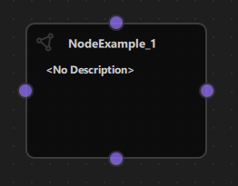

# Simple NodeLink Example

## Overview

The Simple NodeLink Example is the most basic example demonstrating how to get started with NodeLink. This minimal example shows the fundamental concepts of creating nodes, connecting them, and using basic NodeLink features like save/load, copy/paste, and cloning. It's the perfect starting point for developers new to NodeLink who want to understand the core framework concepts before building more complex applications.


---

## a. Purpose and Use Cases

### Purpose

The Simple NodeLink Example demonstrates:

1. **Basic Node Creation**: Shows how to create a simple custom node with ports.

2. **Port Configuration**: Demonstrates how to add ports to nodes in different positions (top, bottom, left, right).

3. **Node Registry Setup**: Illustrates how to register node types in the node registry.

4. **Scene Management**: Shows basic scene creation and management using NodeLink's Scene component.

5. **Save/Load Functionality**: Demonstrates how to save and load scenes using QtQuickStream.

6. **Copy/Paste Operations**: Shows how to copy and paste nodes using keyboard shortcuts.

7. **Node Cloning**: Demonstrates how to clone selected nodes.

8. **Basic UI Integration**: Shows how to integrate NodeLink with a Qt Quick application.

### Use Cases

- **Learning Tool**: Perfect starting point for developers new to NodeLink
- **Template Project**: Use as a template for creating new NodeLink applications
- **Quick Prototyping**: Rapidly prototype node-based interfaces
- **Framework Introduction**: Understand core NodeLink concepts and architecture
- **Testing**: Test NodeLink features in a minimal environment
- **Customization Base**: Start with this example and add custom functionality

### Example Scenarios

- **First NodeLink Project**: Create your first NodeLink application
- **Understanding Ports**: Learn how ports work and how to configure them
- **Scene Persistence**: Learn how to save and load node graphs
- **Node Operations**: Practice copying, pasting, and cloning nodes
- **Custom Node Development**: Use as a base for creating custom node types

### Real-World Applications

- **Learning Projects**: Educational projects to understand NodeLink
- **Prototype Development**: Quick prototypes before building full applications
- **Framework Testing**: Test NodeLink features and capabilities
- **Custom Application Foundation**: Starting point for building custom node-based applications

 <!-- TODO: Insert diagram showing different use cases -->

---

## b. Node Types Explained

The Simple NodeLink Example implements one basic node type designed to demonstrate fundamental NodeLink concepts.

### Node Example (`NodeExample`)

**Purpose**: A simple example node that demonstrates how to create a custom node with ports on all four sides.

**Type ID**: `0`

**Properties**:
- Contains four ports, one on each side (top, bottom, left, right)
- All ports are bidirectional (InAndOut type)
- Minimal implementation to show basic node structure

**Ports**:
- **Top Port**: InAndOut type (Top side)
- **Bottom Port**: InAndOut type (Bottom side)
- **Left Port**: InAndOut type (Left side)
- **Right Port**: InAndOut type (Right side)

**Port Types**:
- `InAndOut`: Bidirectional port that can act as both input and output
- Ports can be connected to other ports regardless of direction

**Properties**:
- `type`: Set to `0` (node type identifier)
- Default node appearance and behavior from NodeLink base classes

**Behavior**:
- Can be connected to other nodes via any of its four ports
- Supports all standard NodeLink operations (select, move, delete, clone)
- No custom logic - purely for demonstration purposes

**Visual Appearance**:
- Icon: Document icon (Font Awesome \ue4e2)
- Color: Gray (#444)
- Default NodeLink node styling

**Usage**: 
- Add nodes using the side menu
- Connect nodes by dragging from one port to another
- Use standard NodeLink operations (select, move, delete, clone)

 <!-- TODO: Insert screenshot of NodeExample with ports visible -->

**Code Implementation**:
```qml
Node {
    type: 0

    Component.onCompleted: addPorts();

    function addPorts() {
        let _port1 = NLCore.createPort();
        let _port2 = NLCore.createPort();
        let _port3 = NLCore.createPort();
        let _port4 = NLCore.createPort();

        _port1.portType = NLSpec.PortType.InAndOut
        _port1.portSide = NLSpec.PortPositionSide.Top

        _port2.portType = NLSpec.PortType.InAndOut
        _port2.portSide = NLSpec.PortPositionSide.Bottom

        _port3.portType = NLSpec.PortType.InAndOut
        _port3.portSide = NLSpec.PortPositionSide.Left

        _port4.portType = NLSpec.PortType.InAndOut
        _port4.portSide = NLSpec.PortPositionSide.Right

        addPort(_port1);
        addPort(_port2);
        addPort(_port3);
        addPort(_port4);
    }
}
```

---

### Container Node

The example also includes support for Container nodes (from NodeLink core), which allow grouping nodes together.

**Type ID**: `1`

**Properties**:
- Groups multiple nodes together
- Can contain other nodes and containers
- Provides organizational structure for complex scenes

**Visual Appearance**:
- Icon: Folder icon (Font Awesome \uf247)
- Color: Primary color from NLStyle

---

### Node Type Summary Table

| Node Type | Type ID | Ports | Port Type | Purpose |
|-----------|---------|-------|-----------|---------|
| NodeExample | 0 | 4 (all sides) | InAndOut | Basic example node |
| Container | 1 | N/A | N/A | Node grouping |

---

## c. Step-by-Step Building Guide

This guide will walk you through building the Simple NodeLink Example from scratch, explaining each component and how they work together.

### Prerequisites

- Qt 6.2.4 or later (Qt 6.10.0 recommended)
- CMake 3.1.0 or later
- C++ compiler with C++14 support (MSVC 2019/2022 on Windows)
- NodeLink framework built and installed
- QtQuickStream module built and installed

### Step 1: Project Setup

#### 1.1 Create Project Structure

Create the following directory structure:

```
simpleNodeLink/
├── CMakeLists.txt
├── main.cpp
├── main.qml
└── NodeExample.qml
```

#### 1.2 Configure CMakeLists.txt

Create `CMakeLists.txt` with the following configuration:

```cmake
cmake_minimum_required(VERSION 3.1.0)

set(CMAKE_AUTOMOC ON)
set(CMAKE_CXX_STANDARD_REQUIRED ON)

# Configure Qt
find_package(QT NAMES Qt6 Qt5 COMPONENTS Core Gui QuickControls2 REQUIRED)
find_package(Qt${QT_VERSION_MAJOR} COMPONENTS Core Gui QuickControls2 REQUIRED)

set(QML_IMPORT_PATH ${CMAKE_BINARY_DIR}/qml/NodeLink/resources/View)
set(QT_QML_OUTPUT_DIRECTORY ${CMAKE_BINARY_DIR}/qml)

# Create executable
qt_add_executable(SimpleNodeLink main.cpp)

# Define QML module
qt_add_qml_module(SimpleNodeLink
    URI "SimpleNodeLink"
    VERSION 1.0
    QML_FILES
        main.qml
        NodeExample.qml
)

target_include_directories(SimpleNodeLink PUBLIC
    Qt${QT_VERSION_MAJOR}::QuickControls2)

target_link_libraries(SimpleNodeLink PRIVATE
    Qt${QT_VERSION_MAJOR}::Core
    Qt${QT_VERSION_MAJOR}::Gui
    Qt${QT_VERSION_MAJOR}::QuickControls2
    NodeLinkplugin
    QtQuickStreamplugin
)
```

**Key Points**:
- Links to `NodeLinkplugin` and `QtQuickStreamplugin`
- Sets QML import paths for NodeLink resources
- Minimal QML files (just main.qml and NodeExample.qml)

---

### Step 2: Create Node Example

#### 2.1 NodeExample.qml

Create `NodeExample.qml` - a simple example node:

```qml
import QtQuick
import NodeLink

Node {
    type: 0

    Component.onCompleted: addPorts();

    function addPorts() {
        let _port1 = NLCore.createPort();
        let _port2 = NLCore.createPort();
        let _port3 = NLCore.createPort();
        let _port4 = NLCore.createPort();

        _port1.portType = NLSpec.PortType.InAndOut
        _port1.portSide = NLSpec.PortPositionSide.Top

        _port2.portType = NLSpec.PortType.InAndOut
        _port2.portSide = NLSpec.PortPositionSide.Bottom

        _port3.portType = NLSpec.PortType.InAndOut
        _port3.portSide = NLSpec.PortPositionSide.Left

        _port4.portType = NLSpec.PortType.InAndOut
        _port4.portSide = NLSpec.PortPositionSide.Right

        addPort(_port1);
        addPort(_port2);
        addPort(_port3);
        addPort(_port4);
    }
}
```

**Key Features**:
- Inherits from `Node` base class
- Sets `type` to `0` (node type identifier)
- Adds four ports in `addPorts()` function
- All ports are bidirectional (InAndOut)
- Ports positioned on all four sides

---

### Step 3: Create Main Application

#### 3.1 main.cpp

Create `main.cpp`:

```cpp
#include <QtGui/QGuiApplication>
#include <QQmlApplicationEngine>
#include <QQuickStyle>

int main(int argc, char* argv[])
{
    QGuiApplication app(argc, argv);
    QQmlApplicationEngine engine;

    QQuickStyle::setStyle("Material");
    engine.addImportPath(":/");

    const QUrl url(u"qrc:/SimpleNodeLink/main.qml"_qs);
    QObject::connect(&engine, &QQmlApplicationEngine::objectCreated,
                     &app, [url](QObject *obj, const QUrl &objUrl) {
        if (!obj && url == objUrl)
            QCoreApplication::exit(-1);
    }, Qt::QueuedConnection);
    engine.load(url);

    return app.exec();
}
```

---

#### 3.2 main.qml

Create `main.qml` - the main application with scene setup and controls:

```qml
import QtQuick
import QtQuickStream
import QtQuick.Dialogs
import QtQuick.Controls
import NodeLink

Window {
    id: window

    // Scene property (will be overridden by load)
    property Scene scene: Scene { }

    // Node registry setup
    property NLNodeRegistry nodeRegistry: NLNodeRegistry {
        _qsRepo: NLCore.defaultRepo
        imports: ["SimpleNodeLink", "NodeLink"];
        defaultNode: 0
    }

    width: 1280
    height: 960
    visible: true
    title: qsTr("Simple NodeLink Example")
    color: "#1e1e1e"

    Material.theme: Material.Dark
    Material.accent: "#4890e2"

    Component.onCompleted: {
        // Prepare node registry
        var nodeType = 0;
        nodeRegistry.nodeTypes[nodeType] = "NodeExample";
        nodeRegistry.nodeNames[nodeType] = "NodeExample";
        nodeRegistry.nodeIcons[nodeType] = "\ue4e2";
        nodeRegistry.nodeColors[nodeType] = "#444";

        // Register Container node type
        nodeRegistry.nodeTypes[nodeType + 1] = "Container";
        nodeRegistry.nodeNames[nodeType + 1] = "Container";
        nodeRegistry.nodeIcons[nodeType + 1] = "\uf247";
        nodeRegistry.nodeColors[nodeType + 1] = NLStyle.primaryColor;

        // Initialize QtQuickStream repository
        NLCore.defaultRepo = NLCore.createDefaultRepo(["QtQuickStream", "NodeLink", "SimpleNodeLink"])
        NLCore.defaultRepo.initRootObject("Scene");

        // Set registry to scene
        window.scene = Qt.binding(function() { 
            return NLCore.defaultRepo.qsRootObject;
        });
        window.scene.nodeRegistry = Qt.binding(function() { 
            return window.nodeRegistry;
        });
    }

    // Main view
    NLView {
        id: view
        scene: window.scene
        anchors.fill: parent
    }

    // Save/Load controls
    Rectangle {
        anchors.left: parent.left
        anchors.bottom: parent.bottom
        anchors.margins: 10
        width: 400
        height: 40
        color: "#b0aeab"

        Button {
            text: "Save"
            width: 150
            anchors.left: parent.left
            anchors.margins: 20
            anchors.verticalCenter: parent.verticalCenter
            background: Rectangle {
                radius: 5
                color: "#6899e3"
            }
            onClicked: {
                saveDialog.visible = true
            }
        }

        Button {
            text: "Load"
            anchors.right: parent.right
            anchors.margins: 20
            anchors.verticalCenter: parent.verticalCenter
            width: 150
            background: Rectangle {
                radius: 5
                color: "#eb5e65"
            }
            onClicked: loadDialog.visible = true
        }
    }

    // Save dialog
    FileDialog {
        id: saveDialog
        currentFile: "QtQuickStream.QQS.json"
        fileMode: FileDialog.SaveFile
        nameFilters: [ "QtQuickStream Files (*.QQS.json)" ]
        onAccepted: {
            NLCore.defaultRepo.saveToFile(saveDialog.currentFile);
        }
    }

    // Load dialog
    FileDialog {
        id: loadDialog
        currentFile: "QtQuickStream.QQS.json"
        fileMode: FileDialog.OpenFile
        nameFilters: [ "QtQuickStream Files (*.QQS.json)" ]
        onAccepted: {
            NLCore.defaultRepo.clearObjects();
            NLCore.defaultRepo.loadFromFile(loadDialog.currentFile);
        }
    }

    // Keyboard shortcuts
    Shortcut {
        sequence: "Ctrl+C"
        onActivated: {
            view.copyNodes();
        }
    }

    Shortcut {
        sequence: "Ctrl+V"
        onActivated: {
            view.pasteNodes()
        }
    }

    Shortcut {
        sequence: "Ctrl+A"
        onActivated: scene?.selectionModel.selectAll(
            scene.nodes, scene.links, scene.containers
        );
    }

    Shortcut {
        sequence: "Ctrl+D"
        onActivated: {
            var copiedNodes = ({});
            var copiedContainers = ({});
            Object.keys(scene?.selectionModel.selectedModel ?? []).forEach(key => {
                if (Object.keys(scene.nodes).includes(key)) {
                    var copiedNode = scene?.cloneNode(key);
                    copiedNodes[copiedNode._qsUuid] = copiedNode;
                }
                if (Object.keys(scene?.containers).includes(key)) {
                    var copiedContainer = scene?.cloneContainer(key);
                    copiedContainers[copiedContainer._qsUuid] = copiedContainer;
                }
            });
            scene?.selectionModel.selectAll(copiedNodes, ({}), copiedContainers);
        }
    }
}
```

**Key Features**:
- **Scene Setup**: Creates a Scene using QtQuickStream
- **Node Registry**: Registers NodeExample and Container node types
- **NLView**: Main view component for displaying the node graph
- **Save/Load**: File dialogs for saving and loading scenes
- **Keyboard Shortcuts**: Copy, paste, select all, and clone operations


---

### Step 4: Build and Run

#### 4.1 Configure Build

1. Create a build directory:
   ```bash
   mkdir build
   cd build
   ```

2. Configure with CMake:
   ```bash
   cmake .. -DCMAKE_PREFIX_PATH=<Qt_Install_Path>
   ```

3. Build the project:
   ```bash
   cmake --build .
   ```

#### 4.2 Run the Application

Run the executable:
```bash
./SimpleNodeLink  # Linux/Mac
SimpleNodeLink.exe  # Windows
```

---

### Step 5: Using the Simple NodeLink Example

#### Basic Usage

1. **Add Nodes**: 
   - Click the side menu (right side)
   - Select "NodeExample" to add a node
   - Nodes appear on the canvas

2. **Connect Nodes**:
   - Click and drag from one port to another
   - A link will be created between the ports
   - Ports can connect in any direction (InAndOut type)

3. **Move Nodes**:
   - Click and drag nodes to move them
   - Selected nodes can be moved together

4. **Select Nodes**:
   - Click on a node to select it
   - Drag to select multiple nodes
   - Use Ctrl+A to select all

5. **Delete Nodes**:
   - Select nodes and press Delete key
   - Or use the context menu

#### Save and Load

1. **Save Scene**:
   - Click the "Save" button (bottom left)
   - Choose a location and filename
   - Scene is saved as `.QQS.json` file

2. **Load Scene**:
   - Click the "Load" button (bottom left)
   - Select a previously saved `.QQS.json` file
   - Scene is loaded and displayed

#### Keyboard Shortcuts

- **Ctrl+C**: Copy selected nodes
- **Ctrl+V**: Paste copied nodes
- **Ctrl+A**: Select all nodes and links
- **Ctrl+D**: Clone selected nodes
- **Delete**: Delete selected nodes


---

## Architecture Overview

### Component Hierarchy

```
Main Window
├── Scene (QtQuickStream)
│   ├── NodeRegistry (defines node types)
│   ├── SelectionModel (manages selection)
│   ├── Nodes (NodeExample instances)
│   ├── Links (connections between nodes)
│   └── Containers (node groups)
├── NLView (main view component)
│   ├── NodesScene (canvas)
│   └── SideMenu (add nodes)
└── Save/Load Controls
    ├── Save Button
    └── Load Button
```

### Data Flow

```
User Action
    ↓
NLView (handles interaction)
    ↓
Scene (manages nodes/links)
    ↓
QtQuickStream (persistence)
```

 <!-- TODO: Insert comprehensive architecture diagram -->

---

## Key Concepts

### Node Creation

Nodes are created by:
1. Defining a QML component that inherits from `Node`
2. Setting a unique `type` identifier
3. Adding ports in `Component.onCompleted`
4. Registering in the node registry

### Port Types

- **Input**: Can only receive connections
- **Output**: Can only send connections
- **InAndOut**: Bidirectional - can both send and receive

### Port Positions

- **Top**: Port on the top side of the node
- **Bottom**: Port on the bottom side
- **Left**: Port on the left side
- **Right**: Port on the right side

### Scene Persistence

Scenes are saved/loaded using QtQuickStream:
- **Save**: Serializes all nodes, links, and containers to JSON
- **Load**: Deserializes from JSON and recreates the scene
- **Format**: `.QQS.json` (QtQuickStream JSON format)

---

## Extending the Simple Example

### Adding Custom Node Types

To add a new node type:

1. **Create Node QML File**:
   ```qml
   // MyCustomNode.qml
   import QtQuick
   import NodeLink

   Node {
       type: 1  // Unique type ID
       Component.onCompleted: addPorts();
       function addPorts() {
           // Add your ports here
       }
   }
   ```

2. **Register in main.qml**:
   ```qml
   nodeRegistry.nodeTypes[1] = "MyCustomNode";
   nodeRegistry.nodeNames[1] = "My Custom Node";
   nodeRegistry.nodeIcons[1] = "\uf123";  // Font Awesome icon
   nodeRegistry.nodeColors[1] = "#FF5733";
   ```

3. **Add to CMakeLists.txt**:
   ```cmake
   QML_FILES
       main.qml
       NodeExample.qml
       MyCustomNode.qml
   ```

### Adding Custom Logic

To add custom behavior to nodes:

1. **Add Properties**:
   ```qml
   Node {
       property string myData: "Hello"
       // ...
   }
   ```

2. **Add Functions**:
   ```qml
   Node {
       function doSomething() {
           console.log("Doing something");
       }
   }
   ```

3. **Handle Events**:
   ```qml
   Node {
       onSomeEvent: {
           // Handle event
       }
   }
   ```

### Customizing Appearance

Modify node appearance:
- **Size**: Set `guiConfig.width` and `guiConfig.height`
- **Color**: Set `guiConfig.color`
- **Icon**: Change icon in node registry
- **Custom View**: Create custom NodeView component

---

## Troubleshooting

### Common Issues

1. **Nodes Not Appearing**:
   - Check node registry registration
   - Verify QML file is included in CMakeLists.txt
   - Check console for import errors

2. **Ports Not Visible**:
   - Verify `addPorts()` is called in `Component.onCompleted`
   - Check port properties are set correctly
   - Ensure ports are added to the node

3. **Save/Load Not Working**:
   - Check file permissions
   - Verify QtQuickStream is properly linked
   - Check console for error messages

4. **Shortcuts Not Working**:
   - Ensure window has focus
   - Check for conflicting shortcuts
   - Verify scene is properly initialized

### Debug Tips

- Enable console logging: `console.log("Debug message")`
- Check QML errors in console
- Verify all imports are correct
- Test node creation step by step
- Check NodeLink documentation for API details

---

## Next Steps

After understanding this simple example, you can:

1. **Explore Other Examples**:
   - Calculator Example: Learn about data flow
   - Chatbot Example: Learn about pattern matching
   - Logic Circuit Example: Learn about complex node logic
   - Performance Analyzer: Learn about optimization

2. **Build Custom Applications**:
   - Start with this example as a template
   - Add your own node types
   - Implement custom logic
   - Create domain-specific applications

3. **Learn Advanced Features**:
   - Custom node views
   - Complex data types
   - Undo/redo system
   - Container nesting
   - Custom link types

---

## Conclusion

The Simple NodeLink Example provides a minimal, clean introduction to NodeLink framework. Key takeaways:

- **Basic Setup**: How to set up a NodeLink application
- **Node Creation**: How to create custom nodes with ports
- **Scene Management**: How to work with scenes
- **Persistence**: How to save and load scenes
- **Operations**: Basic node operations (copy, paste, clone)

This example serves as the foundation for:
- Learning NodeLink concepts
- Building custom node-based applications
- Understanding the framework architecture
- Prototyping new ideas

For more advanced examples, see the other examples in the NodeLink repository.


