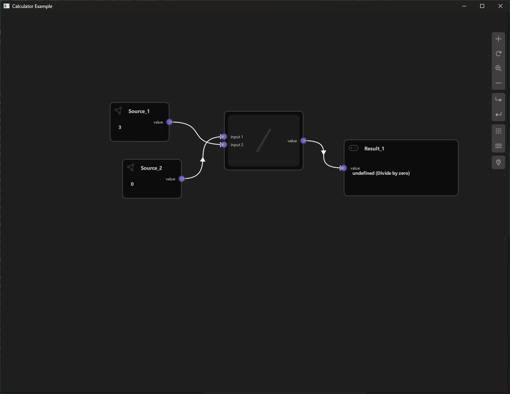

# Calculator Example

## Overview

The Calculator Example is a visual node-based calculator application built with NodeLink and Qt Quick. It demonstrates how to create a functional node graph system where users can connect different types of nodes to perform mathematical calculations. This example serves as an excellent introduction to building custom node-based applications using the NodeLink framework.




---

## a. Purpose and Use Cases

### Purpose

The Calculator Example demonstrates:

1. **Node-Based Data Flow**: Shows how data flows through a network of connected nodes, where each node performs a specific operation or holds a value.

2. **Custom Node Types**: Illustrates how to define and implement custom node types with specific behaviors, ports, and data handling.

3. **Real-Time Updates**: Demonstrates automatic data propagation through the node graph when connections are made, modified, or removed.

4. **Visual Programming**: Provides a visual interface for building mathematical expressions without writing code.

5. **Scene Management**: Shows how to manage a scene with multiple nodes, links, and their relationships.

### Use Cases

- **Educational Tool**: Learn how to build node-based applications with NodeLink
- **Prototyping**: Quickly prototype mathematical workflows or data processing pipelines
- **Visual Expression Builder**: Create complex mathematical expressions visually
- **Framework Demonstration**: Showcase NodeLink capabilities to potential users or developers
- **Custom Application Foundation**: Use as a starting point for building more complex node-based applications

### Example Scenarios

- **Simple Calculations**: Connect Source nodes to operation nodes to perform basic arithmetic
- **Complex Expressions**: Build multi-step calculations like `(a + b) * (c - d) / e`
- **Data Flow Visualization**: Understand how data propagates through a node network
- **Interactive Learning**: Experiment with different node connections and observe results in real-time

---

## b. Node Types Explained

The Calculator Example implements six distinct node types, each serving a specific role in the calculation pipeline.

### 1. Source Node (`SourceNode`)

**Purpose**: Provides input values for calculations.

**Type ID**: `CSpecs.NodeType.Source` (0)

**Properties**:
- Contains a single output port named "value"
- Users can directly edit the numeric value in the node
- Acts as the starting point for data flow

**Ports**:
- **Output Port**: "value" (Right side) - Emits the numeric value entered by the user

**Usage**: 
- Place Source nodes to input numbers into your calculation
- Connect the output port to operation nodes or Result nodes
- Edit the value by clicking on the node and typing a number

**Example**: A Source node with value `5` outputs `5` through its output port.

---

### 2. Additive Node (`AdditiveNode`)

**Purpose**: Performs addition of two input values.

**Type ID**: `CSpecs.NodeType.Additive` (1)

**Properties**:
- Inherits from `OperationNode`
- Has two input ports and one output port
- Performs: `output = input1 + input2`

**Ports**:
- **Input Port 1**: "input 1" (Left side)
- **Input Port 2**: "input 2" (Left side)
- **Output Port**: "value" (Right side) - Emits the sum of the two inputs

**Behavior**:
- Waits for both inputs to be connected and have valid data
- Automatically calculates the result when both inputs are available
- Outputs `null` if either input is missing

**Example**: 
- Input 1: `3`, Input 2: `7` → Output: `10`

---

### 3. Multiplier Node (`MultiplierNode`)

**Purpose**: Performs multiplication of two input values.

**Type ID**: `CSpecs.NodeType.Multiplier` (2)

**Properties**:
- Inherits from `OperationNode`
- Has two input ports and one output port
- Performs: `output = input1 * input2`

**Ports**:
- **Input Port 1**: "input 1" (Left side)
- **Input Port 2**: "input 2" (Left side)
- **Output Port**: "value" (Right side) - Emits the product of the two inputs

**Behavior**:
- Requires both inputs to be connected and have valid data
- Calculates result automatically when both inputs are available

**Example**:
- Input 1: `4`, Input 2: `6` → Output: `24`

---

### 4. Subtraction Node (`SubtractionNode`)

**Purpose**: Performs subtraction of two input values.

**Type ID**: `CSpecs.NodeType.Subtraction` (3)

**Properties**:
- Inherits from `OperationNode`
- Has two input ports and one output port
- Performs: `output = input1 - input2`

**Ports**:
- **Input Port 1**: "input 1" (Left side)
- **Input Port 2**: "input 2" (Left side)
- **Output Port**: "value" (Right side) - Emits the difference of the two inputs

**Behavior**:
- Subtracts the second input from the first input
- Requires both inputs to be connected

**Example**:
- Input 1: `10`, Input 2: `3` → Output: `7`

---

### 5. Division Node (`DivisionNode`)

**Purpose**: Performs division of two input values.

**Type ID**: `CSpecs.NodeType.Division` (4)

**Properties**:
- Inherits from `OperationNode`
- Has two input ports and one output port
- Performs: `output = input1 / input2`

**Ports**:
- **Input Port 1**: "input 1" (Left side)
- **Input Port 2**: "input 2" (Left side)
- **Output Port**: "value" (Right side) - Emits the quotient of the two inputs

**Behavior**:
- Divides the first input by the second input
- Handles division by zero: outputs `"undefined (Divide by zero)"` if the second input is `0`
- Requires both inputs to be connected

**Example**:
- Input 1: `20`, Input 2: `4` → Output: `5`
- Input 1: `10`, Input 2: `0` → Output: `"undefined (Divide by zero)"`

---

### 6. Result Node (`ResultNode`)

**Purpose**: Displays the final result of a calculation.

**Type ID**: `CSpecs.NodeType.Result` (5)

**Properties**:
- Contains a single input port
- Displays the value received from connected nodes
- Read-only (cannot be edited directly)

**Ports**:
- **Input Port**: "value" (Left side) - Receives the calculated result

**Behavior**:
- Displays whatever value is connected to its input port
- Updates automatically when the input value changes
- Resets to `null` when cloned or when the input connection is removed

**Usage**:
- Connect the output of any node (Source or Operation) to a Result node to view the final value
- Useful for displaying intermediate or final results in complex calculations

**Example**: 
- Connect a Source node with value `42` → Result displays `42`
- Connect an Additive node output → Result displays the sum

---

### Node Type Summary Table

| Node Type | Type ID | Input Ports | Output Ports | Operation |
|-----------|---------|-------------|--------------|-----------|
| Source | 0 | 0 | 1 | Provides input value |
| Additive | 1 | 2 | 1 | Addition (+) |
| Multiplier | 2 | 2 | 1 | Multiplication (×) |
| Subtraction | 3 | 2 | 1 | Subtraction (-) |
| Division | 4 | 2 | 1 | Division (/) |
| Result | 5 | 1 | 0 | Displays result |

---

## c. Step-by-Step Building Guide

This guide will walk you through building the Calculator Example from scratch, explaining each component and how they work together.

### Prerequisites

- Qt 6.2.4 or later (Qt 6.10.0 recommended)
- CMake 3.1.0 or later
- C++ compiler with C++14 support (MSVC 2019/2022 on Windows)
- NodeLink framework built and installed
- QtQuickStream module built and installed

### Step 1: Project Setup

#### 1.1 Create Project Structure

Create the following directory structure:

```
calculator/
├── CMakeLists.txt
├── main.cpp
├── main.qml
└── resources/
    ├── Core/
    └── View/
    └── fonts/
```

#### 1.2 Configure CMakeLists.txt

Create `CMakeLists.txt` with the following configuration:

```cmake
cmake_minimum_required(VERSION 3.1.0)

set(CMAKE_AUTOMOC ON)
set(CMAKE_CXX_STANDARD_REQUIRED ON)

# Configure Qt
find_package(QT NAMES Qt6 Qt5 COMPONENTS Core Gui QuickControls2 REQUIRED)
find_package(Qt${QT_VERSION_MAJOR} COMPONENTS Core Gui QuickControls2 REQUIRED)

list(APPEND QML_IMPORT_PATH ${CMAKE_BINARY_DIR}/qml)

# Create executable
qt_add_executable(Calculator main.cpp)

# Set CSpecs as singleton
set_source_files_properties(
    resources/Core/CSpecs.qml
    PROPERTIES
        QT_QML_SINGLETON_TYPE True
)

# Define QML module
qt_add_qml_module(Calculator
    URI "Calculator"
    VERSION 1.0
    QML_FILES
        main.qml
        resources/Core/CSpecs.qml
        resources/Core/SourceNode.qml
        resources/Core/OperationNode.qml
        resources/Core/ResultNode.qml
        resources/Core/AdditiveNode.qml
        resources/Core/MultiplierNode.qml
        resources/Core/SubtractionNode.qml
        resources/Core/DivisionNode.qml
        resources/Core/CalculatorScene.qml
        resources/Core/OperationNodeData.qml
        resources/View/CalculatorView.qml
        resources/View/CalculatorNodeView.qml
    RESOURCES
        resources/fonts/Font\ Awesome\ 6\ Pro-Thin-100.otf
        resources/fonts/Font\ Awesome\ 6\ Pro-Solid-900.otf
        resources/fonts/Font\ Awesome\ 6\ Pro-Regular-400.otf
        resources/fonts/Font\ Awesome\ 6\ Pro-Light-300.otf
)

target_include_directories(Calculator PUBLIC
    Qt${QT_VERSION_MAJOR}::QuickControls2)

target_link_libraries(Calculator PRIVATE
    Qt${QT_VERSION_MAJOR}::Core
    Qt${QT_VERSION_MAJOR}::Gui
    Qt${QT_VERSION_MAJOR}::QuickControls2
    NodeLinkplugin
    QtQuickStreamplugin
)
```

**Key Points**:
- Links to `NodeLinkplugin` and `QtQuickStreamplugin`
- Sets `CSpecs.qml` as a singleton for global access
- Includes Font Awesome fonts for icons

---

### Step 2: Create Specifications (CSpecs.qml)

Create `resources/Core/CSpecs.qml` - a singleton that defines node type constants:

```qml
pragma Singleton

import QtQuick

QtObject {
    enum NodeType {
        Source      = 0,
        Additive    = 1,
        Multiplier  = 2,
        Subtraction = 3,
        Division    = 4,
        Result      = 5,
        Operation   = 6,
        Unknown     = 99
    }

    enum OperationType {
        Additive     = 0,
        Multiplier   = 1,
        Subtraction  = 2,
        Division     = 3,
        Unknown = 99
    }
}
```

**Purpose**: Provides type-safe constants for node types used throughout the application.

---

### Step 3: Create Node Data Models

#### 3.1 OperationNodeData.qml

Create `resources/Core/OperationNodeData.qml` - data model for operation nodes:

```qml
import QtQuick
import NodeLink

I_NodeData {
    property var inputFirst:  null
    property var inputSecond: null
}
```

**Purpose**: Extends `I_NodeData` to store two input values for binary operations.

---

### Step 4: Create Base Node Types

#### 4.1 SourceNode.qml

Create `resources/Core/SourceNode.qml`:

```qml
import QtQuick
import NodeLink

Node {
    type: CSpecs.NodeType.Source
    nodeData: I_NodeData {}
    
    guiConfig.autoSize: true
    guiConfig.width: 150
    guiConfig.height: 100

    Component.onCompleted: addPorts();

    function addPorts() {
        let _port1 = NLCore.createPort();
        _port1.portType = NLSpec.PortType.Output
        _port1.portSide = NLSpec.PortPositionSide.Right
        _port1.title    = "value";
        addPort(_port1);
    }
}
```

**Key Features**:
- Single output port on the right side
- Auto-sized node with fixed dimensions
- Users can edit the value directly in the node view

---

#### 4.2 OperationNode.qml (Base Class)

Create `resources/Core/OperationNode.qml` - base class for all operation nodes:

```qml
import QtQuick
import NodeLink

Node {
    property int operationType: CSpecs.OperationType.Additive
    
    type: CSpecs.NodeType.Operation
    nodeData: OperationNodeData {}
    
    guiConfig.autoSize: false
    guiConfig.minWidth: 150
    guiConfig.minHeight: 80
    guiConfig.baseContentWidth: 120

    Component.onCompleted: addPorts();

    function addPorts() {
        let _port1 = NLCore.createPort();
        let _port2 = NLCore.createPort();
        let _port3 = NLCore.createPort();

        _port1.portType = NLSpec.PortType.Input
        _port1.portSide = NLSpec.PortPositionSide.Left
        _port1.enable   = false;
        _port1.title    = "input 1";

        _port2.portType = NLSpec.PortType.Input
        _port2.portSide = NLSpec.PortPositionSide.Left
        _port2.enable   = false;
        _port2.title    = "input 2";

        _port3.portType = NLSpec.PortType.Output
        _port3.portSide = NLSpec.PortPositionSide.Right
        _port3.title    = "value";

        addPort(_port1);
        addPort(_port2);
        addPort(_port3);
    }
}
```

**Key Features**:
- Two input ports (left side) and one output port (right side)
- Uses `OperationNodeData` to store input values
- Base class for all arithmetic operations

---

#### 4.3 ResultNode.qml

Create `resources/Core/ResultNode.qml`:

```qml
import QtQuick
import NodeLink

Node {
    type: CSpecs.NodeType.Result
    nodeData: I_NodeData {}
    
    guiConfig.autoSize: true
    guiConfig.width: 150
    guiConfig.height: 100

    Component.onCompleted: addPorts();

    onCloneFrom: function (baseNode) {
        nodeData.data = null;
    }

    function addPorts() {
        let _port1 = NLCore.createPort();
        _port1.portType = NLSpec.PortType.Input
        _port1.portSide = NLSpec.PortPositionSide.Left
        _port1.enable   = false;
        _port1.title    = "value";
        addPort(_port1);
    }
}
```

**Key Features**:
- Single input port (left side)
- Resets data when cloned
- Read-only display of results

---

### Step 5: Create Specific Operation Nodes

#### 5.1 AdditiveNode.qml

Create `resources/Core/AdditiveNode.qml`:

```qml
import QtQuick
import Calculator

OperationNode {
    operationType: CSpecs.OperationType.Additive

    function updataData() {
        if (!nodeData.inputFirst || !nodeData.inputSecond) {
            nodeData.data = null;
            return;
        }
        var input1 = parseFloat(nodeData.inputFirst);
        var input2 = parseFloat(nodeData.inputSecond)
        nodeData.data = input1 + input2;
    }
}
```

**Key Features**:
- Inherits from `OperationNode`
- Implements `updataData()` to perform addition
- Validates inputs before calculation

---

#### 5.2 MultiplierNode.qml

Create `resources/Core/MultiplierNode.qml`:

```qml
import QtQuick
import Calculator

OperationNode {
    operationType: CSpecs.OperationType.Multiplier

    function updataData() {
        if (!nodeData.inputFirst || !nodeData.inputSecond) {
            nodeData.data = null;
            return;
        }
        var input1 = parseFloat(nodeData.inputFirst);
        var input2 = parseFloat(nodeData.inputSecond)
        nodeData.data = input1 * input2;
    }
}
```

---

#### 5.3 SubtractionNode.qml

Create `resources/Core/SubtractionNode.qml`:

```qml
import QtQuick
import Calculator

OperationNode {
    operationType: CSpecs.OperationType.Subtraction

    function updataData() {
        if (!nodeData.inputFirst || !nodeData.inputSecond) {
            nodeData.data = null;
            return;
        }
        var input1 = parseFloat(nodeData.inputFirst);
        var input2 = parseFloat(nodeData.inputSecond)
        nodeData.data = input1 - input2;
    }
}
```

---

#### 5.4 DivisionNode.qml

Create `resources/Core/DivisionNode.qml`:

```qml
import QtQuick
import Calculator

OperationNode {
    operationType: CSpecs.OperationType.Division

    function updataData() {
        if (!nodeData.inputFirst || !nodeData.inputSecond) {
            nodeData.data = null;
            return;
        }
        var input1 = parseFloat(nodeData.inputFirst);
        var input2 = parseFloat(nodeData.inputSecond)
        if (input2 !== 0)
            nodeData.data = input1 / input2;
        else
            nodeData.data = "undefined (Divide by zero)"
    }
}
```

**Key Features**:
- Includes division-by-zero handling
- Returns error message for invalid operations

---

### Step 6: Create the Scene

#### 6.1 CalculatorScene.qml

Create `resources/Core/CalculatorScene.qml` - the main scene that manages nodes and links:

```qml
import QtQuick
import QtQuick.Controls
import NodeLink
import Calculator

I_Scene {
    id: scene

    nodeRegistry: NLNodeRegistry {
        _qsRepo: scene._qsRepo
        imports: ["Calculator"]
        defaultNode: CSpecs.NodeType.Source
        
        nodeTypes: [
            CSpecs.NodeType.Source      = "SourceNode",
            CSpecs.NodeType.Additive    = "AdditiveNode",
            CSpecs.NodeType.Multiplier  = "MultiplierNode",
            CSpecs.NodeType.Subtraction = "SubtractionNode",
            CSpecs.NodeType.Division    = "DivisionNode",
            CSpecs.NodeType.Result      = "ResultNode"
        ];
        
        nodeNames: [
            CSpecs.NodeType.Source      = "Source",
            CSpecs.NodeType.Additive    = "Additive",
            CSpecs.NodeType.Multiplier  = "Multiplier",
            CSpecs.NodeType.Subtraction = "Subtraction",
            CSpecs.NodeType.Division    = "Division",
            CSpecs.NodeType.Result      = "Result"
        ];
        
        nodeIcons: [
            CSpecs.NodeType.Source      = "\ue4e2",
            CSpecs.NodeType.Additive    = "+",
            CSpecs.NodeType.Multiplier  = "\uf00d",
            CSpecs.NodeType.Subtraction = "-",
            CSpecs.NodeType.Division    = "/",
            CSpecs.NodeType.Result      = "\uf11b",
        ];
        
        nodeColors: [
            CSpecs.NodeType.Source     = "#444",
            CSpecs.NodeType.Additive    = "#444",
            CSpecs.NodeType.Multiplier  = "#444",
            CSpecs.NodeType.Subtraction = "#444",
            CSpecs.NodeType.Division    = "#444",
            CSpecs.NodeType.Result      = "#444",
        ];
    }

    selectionModel: SelectionModel {
        existObjects: [...Object.keys(nodes), ...Object.keys(links)]
    }

    property UndoCore _undoCore: UndoCore {
        scene: scene
    }

    // Update node data when links/nodes change
    onLinkRemoved: _upateDataTimer.start();
    onNodeRemoved: _upateDataTimer.start();
    onLinkAdded:   updateData();

    property Timer _upateDataTimer: Timer {
        repeat: false
        running: false
        interval: 1
        onTriggered: scene.updateData();
    }

    // Create a node with specific type and position
    function createCustomizeNode(nodeType: int, xPos: real, yPos: real): string {
        var title = nodeRegistry.nodeNames[nodeType] + "_" + 
                   (Object.values(scene.nodes).filter(node => node.type === nodeType).length + 1);
        return createSpecificNode(nodeRegistry.imports, nodeType,
                                 nodeRegistry.nodeTypes[nodeType],
                                 nodeRegistry.nodeColors[nodeType],
                                 title, xPos, yPos);
    }

    // Link validation and creation
    function linkNodes(portA: string, portB: string) {
        if (!canLinkNodes(portA, portB)) {
            console.error("[Scene] Cannot link Nodes");
            return;
        }
        let link = Object.values(links).find(conObj =>
            conObj.inputPort._qsUuid === portA &&
            conObj.outputPort._qsUuid === portB);
        if (link === undefined)
            createLink(portA, portB);
    }

    // Validation rules for linking
    function canLinkNodes(portA: string, portB: string): bool {
        // ... (validation logic - see source file)
        return true;
    }

    // Update all node data based on connections
    function updateData() {
        var notReadyLinks = [];
        
        // Initialize node data
        Object.values(nodes).forEach(node => {
            switch (node.type) {
                case CSpecs.NodeType.Additive:
                case CSpecs.NodeType.Multiplier:
                case CSpecs.NodeType.Subtraction:
                case CSpecs.NodeType.Division: {
                    node.nodeData.data = null;
                    node.nodeData.inputFirst = null;
                    node.nodeData.inputSecond = null;
                } break;
                case CSpecs.NodeType.Result: {
                    node.nodeData.data = null;
                } break;
            }
        });

        // Process links and update data
        Object.values(links).forEach(link => {
            // ... (data propagation logic)
        });

        // Handle nodes waiting for multiple inputs
        while (notReadyLinks.length > 0) {
            // ... (process remaining links)
        }
    }

    // Update specific node data
    function upadateNodeData(upstreamNode: Node, downStreamNode: Node) {
        switch (downStreamNode.type) {
            case CSpecs.NodeType.Additive:
            case CSpecs.NodeType.Multiplier:
            case CSpecs.NodeType.Subtraction:
            case CSpecs.NodeType.Division: {
                if (!downStreamNode.nodeData.inputFirst)
                    downStreamNode.nodeData.inputFirst = upstreamNode.nodeData.data;
                else if (!downStreamNode.nodeData.inputSecond)
                    downStreamNode.nodeData.inputSecond = upstreamNode.nodeData.data;
                downStreamNode.updataData();
            } break;
            case CSpecs.NodeType.Result: {
                downStreamNode.nodeData.data = upstreamNode.nodeData.data;
            } break;
        }
    }
}
```

**Key Features**:
- **Node Registry**: Defines all available node types, names, icons, and colors
- **Link Validation**: Ensures valid connections (no cycles, single input per port, etc.)
- **Data Propagation**: Automatically updates node values when connections change
- **Undo Support**: Integrated undo/redo functionality

**Data Flow Logic**:
1. When a link is added/removed, `updateData()` is called
2. All operation nodes are reset
3. Data flows from Source nodes through operation nodes
4. Operation nodes wait for both inputs before calculating
5. Results propagate to connected nodes

---

### Step 7: Create Views

#### 7.1 CalculatorNodeView.qml

Create `resources/View/CalculatorNodeView.qml` - custom view for displaying nodes:

```qml
import QtQuick
import QtQuick.Controls
import NodeLink
import Calculator

NodeView {
    id: nodeView

    contentItem: Item {
        id: mainContentItem
        property bool iconOnly: ((node?.operationType ?? -1) > -1) ||
                                nodeView.isNodeMinimal
        
        // Header with icon and title
        Item {
            id: titleItem
            anchors.left: parent.left
            anchors.right: parent.right
            anchors.top: parent.top
            anchors.margins: 12
            visible: !mainContentItem.iconOnly
            height: 20

            Text {
                id: iconText
                font.family: NLStyle.fontType.font6Pro
                font.pixelSize: 20
                anchors.left: parent.left
                anchors.verticalCenter: parent.verticalCenter
                text: scene.nodeRegistry.nodeIcons[node.type]
                color: node.guiConfig.color
            }

            NLTextArea {
                id: titleTextArea
                anchors.right: parent.right
                anchors.left: iconText.right
                anchors.verticalCenter: parent.verticalCenter
                anchors.leftMargin: 5
                height: 40
                readOnly: !nodeView.edit
                placeholderText: qsTr("Enter title")
                color: NLStyle.primaryTextColor
                text: node.title
                onTextChanged: {
                    if (node && node.title !== text)
                        node.title = text;
                }
            }
        }

        // Value display/input field
        NLTextField {
            id: textArea
            anchors.top: titleItem.bottom
            anchors.right: parent.right
            anchors.bottom: parent.bottom
            anchors.left: parent.left
            anchors.margins: 12
            anchors.topMargin: 5
            visible: !mainContentItem.iconOnly
            placeholderText: qsTr("Number")
            color: NLStyle.primaryTextColor
            text: node?.nodeData?.data
            readOnly: !nodeView.edit || (node.type === CSpecs.NodeType.Result)
            validator: DoubleValidator {}
            onTextChanged: {
                if (node && (node.nodeData?.data ?? "") !== text) {
                    if (node.type === CSpecs.NodeType.Source) {
                        node.nodeData.data = text;
                        scene.updateData();
                    }
                }
            }
        }

        // Minimal view (icon only at low zoom)
        Rectangle {
            id: minimalRectangle
            anchors.fill: parent
            anchors.margins: 10
            color: mainContentItem.iconOnly ? "#282828" : "transparent"
            radius: NLStyle.radiusAmount.nodeView

            Text {
                font.family: NLStyle.fontType.font6Pro
                font.pixelSize: 60
                anchors.centerIn: parent
                text: scene.nodeRegistry.nodeIcons[node.type]
                color: node.guiConfig.color
                visible: mainContentItem.iconOnly
            }
        }
    }
}
```

**Key Features**:
- **Editable Title**: Users can rename nodes
- **Value Display**: Shows node data (read-only for Result, editable for Source)
- **Minimal Mode**: Shows icon only when zoomed out
- **Validation**: Uses `DoubleValidator` for numeric input

---

#### 7.2 CalculatorView.qml

Create `resources/View/CalculatorView.qml` - main view container:

```qml
import QtQuick
import QtQuick.Controls
import NodeLink
import QtQuickStream
import Calculator

Item {
    id: view
    property CalculatorScene scene

    property SceneSession sceneSession: SceneSession {
        enabledOverview: false;
        doNodesNeedImage: false
    }

    // Nodes Scene (flickable canvas)
    NodesScene {
        id: nodesScene
        anchors.fill: parent
        scene: view.scene
        sceneSession: view.sceneSession
        sceneContent: NodesRect {
            scene: view.scene
            sceneSession: view.sceneSession
            nodeViewComponent: Qt.createComponent("CalculatorNodeView.qml")
        }
    }

    // Side menu for adding nodes
    SideMenu {
        scene: view.scene
        sceneSession: view.sceneSession
        anchors.right: parent.right
        anchors.rightMargin: 45
        anchors.top: parent.top
        anchors.topMargin: 50
    }
}
```

**Key Features**:
- **NodesScene**: Provides the scrollable canvas for nodes
- **SideMenu**: Allows users to add new nodes to the scene
- **SceneSession**: Manages view state and interactions

---

### Step 8: Create Main Application

#### 8.1 main.cpp

Create `main.cpp`:

```cpp
#include <QtGui/QGuiApplication>
#include <QQmlApplicationEngine>
#include <QQuickStyle>

int main(int argc, char* argv[])
{
    QGuiApplication app(argc, argv);
    QQmlApplicationEngine engine;

    // Set Material style
    QQuickStyle::setStyle("Material");

    // Import all items into QML engine
    engine.addImportPath(":/");

    const QUrl url(u"qrc:/Calculator/main.qml"_qs);
    QObject::connect(&engine, &QQmlApplicationEngine::objectCreated,
                     &app, [url](QObject *obj, const QUrl &objUrl) {
        if (!obj && url == objUrl)
            QCoreApplication::exit(-1);
    }, Qt::QueuedConnection);
    engine.load(url);

    return app.exec();
}
```

**Key Features**:
- Uses Material design style
- Loads QML resources from the Calculator module
- Standard Qt Quick application setup

---

#### 8.2 main.qml

Create `main.qml`:

```qml
import QtQuick
import QtQuick.Dialogs
import QtQuick.Controls

import QtQuickStream
import NodeLink
import Calculator

Window {
    id: window
    property CalculatorScene scene: null

    width: 1280
    height: 960
    visible: true
    title: qsTr("Calculator Example")
    color: "#1e1e1e"

    Material.theme: Material.Dark
    Material.accent: "#4890e2"

    Component.onCompleted: {
        // Create root object
        NLCore.defaultRepo = NLCore.createDefaultRepo(["QtQuickStream", "Calculator"])
        NLCore.defaultRepo.initRootObject("CalculatorScene");
        window.scene = Qt.binding(function() { 
            return NLCore.defaultRepo.qsRootObject;
        });
    }

    // Load Font Awesome fonts
    FontLoader { source: "qrc:/Calculator/resources/fonts/Font Awesome 6 Pro-Thin-100.otf" }
    FontLoader { source: "qrc:/Calculator/resources/fonts/Font Awesome 6 Pro-Solid-900.otf" }
    FontLoader { source: "qrc:/Calculator/resources/fonts/Font Awesome 6 Pro-Regular-400.otf" }
    FontLoader { source: "qrc:/Calculator/resources/fonts/Font Awesome 6 Pro-Light-300.otf" }

    // Main view
    CalculatorView {
        id: view
        scene: window.scene
        anchors.fill: parent
    }
}
```

**Key Features**:
- **Dark Theme**: Material Dark theme with custom accent color
- **Scene Initialization**: Creates the CalculatorScene using QtQuickStream
- **Font Loading**: Loads Font Awesome icons
- **Full-Screen View**: CalculatorView fills the window

---

### Step 9: Build and Run

#### 9.1 Configure Build

1. Create a build directory:
   ```bash
   mkdir build
   cd build
   ```

2. Configure with CMake:
   ```bash
   cmake .. -DCMAKE_PREFIX_PATH=<Qt_Install_Path>
   ```

3. Build the project:
   ```bash
   cmake --build .
   ```

#### 9.2 Run the Application

Run the executable:
```bash
./Calculator  # Linux/Mac
Calculator.exe  # Windows
```

---

### Step 10: Using the Calculator

#### Basic Usage

1. **Add Nodes**: Click the side menu to add nodes (Source, Additive, Multiplier, etc.)

2. **Set Values**: 
   - Click on a Source node
   - Type a number in the value field
   - Press Enter or click outside

3. **Connect Nodes**:
   - Click and drag from an output port (right side)
   - Release on an input port (left side)
   - A link will be created if the connection is valid

4. **View Results**:
   - Connect operation nodes to a Result node
   - The Result node displays the calculated value
   - Values update automatically when inputs change

#### Example Calculation: (5 + 3) × 2

1. Add two Source nodes, set values to `5` and `3`
2. Add an Additive node
3. Connect Source (5) → Additive input 1
4. Connect Source (3) → Additive input 2
5. Add a Source node with value `2`
6. Add a Multiplier node
7. Connect Additive output → Multiplier input 1
8. Connect Source (2) → Multiplier input 2
9. Add a Result node
10. Connect Multiplier output → Result input
11. Result displays `16`

---

## Architecture Overview

### Data Flow

```
Source Node → Operation Node → Result Node
     ↓              ↓
  (value)    (input1, input2)
              ↓ (calculate)
            (result)
```

### Component Hierarchy

```
CalculatorScene (I_Scene)
├── NodeRegistry (defines node types)
├── SelectionModel (manages selection)
├── UndoCore (undo/redo support)
└── Nodes & Links
    ├── SourceNode
    ├── OperationNodes (Additive, Multiplier, etc.)
    └── ResultNode

CalculatorView
├── NodesScene (canvas)
│   └── NodesRect (renders nodes)
│       └── CalculatorNodeView (custom node UI)
└── SideMenu (add nodes)
```

---

## Key Concepts

### Ports

- **Input Ports**: Receive data from other nodes (left side)
- **Output Ports**: Send data to other nodes (right side)
- **Port Rules**: 
  - Each input port can only have one connection
  - Output ports can connect to multiple inputs
  - Cannot create cycles in the graph

### Data Propagation

1. **Source nodes** provide initial values
2. **Operation nodes** wait for both inputs before calculating
3. **Results** propagate downstream automatically
4. **Updates** trigger when:
   - Links are added/removed
   - Source node values change
   - Nodes are deleted

### Node Lifecycle

1. **Creation**: Node created via `createCustomizeNode()`
2. **Initialization**: Ports added in `Component.onCompleted`
3. **Connection**: Links established via `linkNodes()`
4. **Update**: Data calculated in `updataData()`
5. **Deletion**: Cleanup handled by scene

---

## Extending the Calculator

### Adding New Operations

To add a new operation (e.g., Power/Exponentiation):

1. **Add to CSpecs.qml**:
   ```qml
   enum NodeType {
       // ... existing types
       Power = 6
   }
   ```

2. **Create PowerNode.qml**:
   ```qml
   import QtQuick
   import Calculator

   OperationNode {
       operationType: CSpecs.OperationType.Power
       function updataData() {
           if (!nodeData.inputFirst || !nodeData.inputSecond) {
               nodeData.data = null;
               return;
           }
           var base = parseFloat(nodeData.inputFirst);
           var exponent = parseFloat(nodeData.inputSecond);
           nodeData.data = Math.pow(base, exponent);
       }
   }
   ```

3. **Register in CalculatorScene.qml**:
   ```qml
   nodeTypes: [
       // ... existing
       CSpecs.NodeType.Power = "PowerNode"
   ]
   ```

### Customizing Appearance

- **Node Colors**: Modify `nodeColors` in `CalculatorScene.qml`
- **Node Icons**: Change `nodeIcons` (Font Awesome codes)
- **Node Sizes**: Adjust `guiConfig` properties in node definitions
- **View Styling**: Modify `CalculatorNodeView.qml` for custom UI

---

## Troubleshooting

### Common Issues

1. **Nodes not updating**: Check that `updateData()` is called after link changes
2. **Invalid connections**: Verify `canLinkNodes()` validation logic
3. **Division by zero**: Handled in `DivisionNode.qml` - displays error message
4. **Missing fonts**: Ensure Font Awesome fonts are in `resources/fonts/`

### Debug Tips

- Enable console logging in `CalculatorScene.qml`
- Check node data with: `console.log(node.nodeData.data)`
- Verify port connections: `console.log(link.inputPort, link.outputPort)`

---

## Conclusion

The Calculator Example demonstrates the core concepts of building node-based applications with NodeLink:

- **Custom Node Types**: Define specialized nodes for your domain
- **Data Flow**: Implement automatic data propagation
- **Visual Interface**: Create intuitive node views
- **Scene Management**: Handle nodes, links, and their relationships

Use this example as a foundation for building more complex node-based applications such as:
- Visual programming languages
- Data processing pipelines
- Workflow builders
- Shader editors
- Logic circuit simulators

For more examples, see the other examples in the NodeLink repository.


