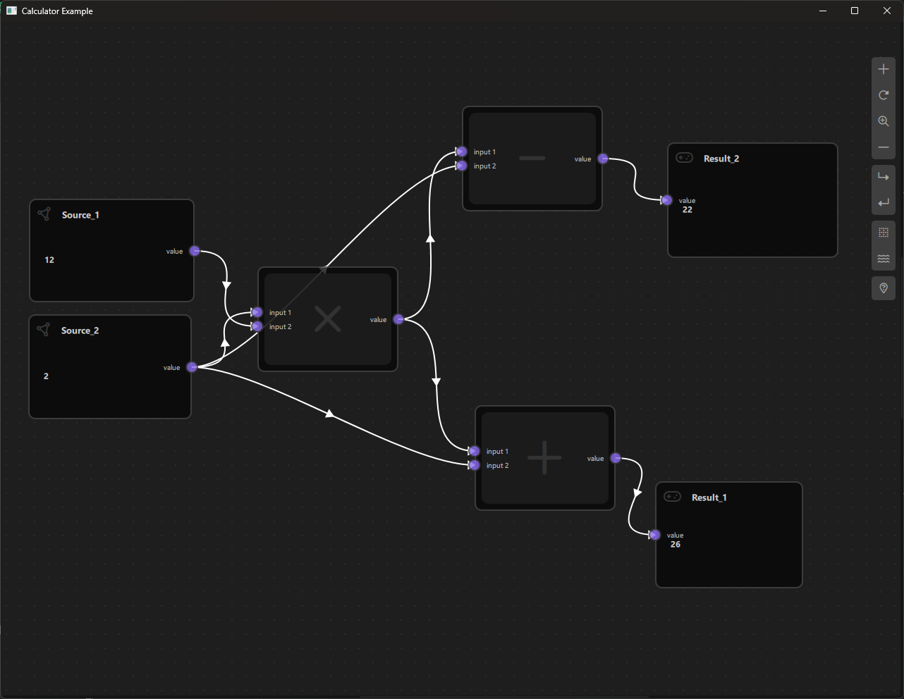
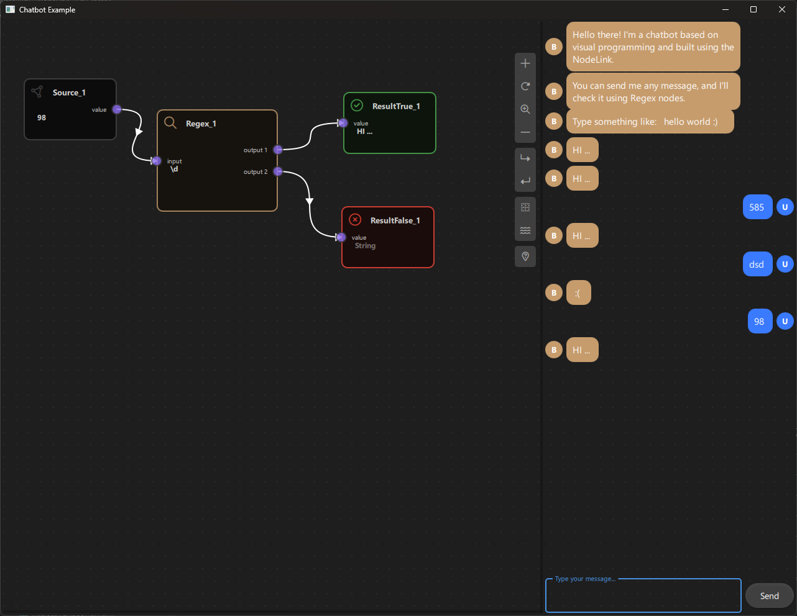

# Project Overview

## Quick Start
Get started with NodeLink Qt/QML by exploring our core library and example projects.

[](https://github.com/Roniasoft/NodeLink)


### Core Library

The NodeLink core library provides a robust framework for building node-based applications. It includes:

* A modular, MVC (Model-View-Controller) architecture
* A customizable node system with support for various data types
* A powerful signal-slot system for node interactions
* Extensive Qt/QML integration for seamless UI development

### Usage

The Nodelink library is a tool that can be used to connect different components within a system or application. To use this library, one can refer to the examples provided within the library and follow the instructions accordingly. The examples provided serve as a guide and demonstrate how to connect different nodes and manipulate data between them.

### Examples

We provide several example projects to demonstrate the capabilities of NodeLink:

* **Calculator**: A basic calculator built using NodeLink, showcasing its ability to create complex node networks.
* **Logic Circuits**: A digital logic circuit simulator, highlighting NodeLink's support for custom node behaviors.
* **Chatbot**: A simple chatbot example, demonstrating NodeLink's integration with Qt/QML for UI development.
* **Image Processing**: An image processing pipeline built using NodeLink, showcasing its ability to handle complex data flows.

## What is NodeLink?

NodeLink is a Qt/QML-based framework for building node-based applications. It follows the Model-View-Controller (MVC) architecture, providing a clear separation of concerns and a modular design.

* **Model**: Represents the data and business logic of the application.
* **View**: Handles the UI rendering and user interactions.
* **Controller**: Manages the interactions between the Model and View.

This architecture allows for a high degree of customization and flexibility, making NodeLink suitable for a wide range of applications.

## Key Features

Here are some of the key features that make NodeLink a powerful tool for building node-based applications:

* **Modular Node System**: Create custom nodes with specific behaviors and interactions.
* **Signal-Slot System**: Enable complex node interactions using a powerful signal-slot system.
* **Qt/QML Integration**: Seamlessly integrate NodeLink with Qt/QML for UI development.
* **Customizable**: Highly customizable architecture and node system.
* **Extensive Documentation**: Comprehensive documentation and example projects.

## Installation Guide - Create Your First Custom Node in 10 Minutes
### Overview

This guide will walk you through installing NodeLink and creating your first custom node in just 10 minutes. By the end of this tutorial, you'll have a working NodeLink application with a custom "HelloWorld" node that you can create, connect, and interact with.

---

### Prerequisites

Before you begin, ensure you have the following installed:

#### Required Software

1. **Qt Framework** (Version 6.2.4 or higher)
   - Download from: [Qt Official Website](https://www.qt.io/download)
   - Required modules:
     - Qt Quick
     - Qt Quick Controls 2
     - Qt QML
     - Qt Quick Layouts

2. **CMake** (Version 3.8 or higher, recommended: 3.20+)
   - Download from: [CMake Official Website](https://cmake.org/download/)
   - Or install via package manager:
     ```bash
     # Ubuntu/Debian
     sudo apt-get install cmake
     
     # macOS (Homebrew)
     brew install cmake
     
     # Windows
     # Download installer from cmake.org
     ```

3. **C++ Compiler**
   - **Linux**: GCC ≥ 7.0 or Clang ≥ 7.0
   - **Windows**: MSVC 2019 (Visual Studio 2019) or MinGW
   - **macOS**: Apple Clang (Xcode Command Line Tools)

4. **Git** (Version 2.20 or higher)
   - Download from: [Git Official Website](https://git-scm.com/downloads)

#### Optional Tools

- **Qt Creator** (Recommended IDE for Qt/QML development)
  - Download from: [Qt Official Website](https://www.qt.io/download)
- **Visual Studio Code** with Qt/QML extensions (Alternative IDE)

---

### Installation

#### Step 1: Clone the Repository

Open a terminal/command prompt and run:

```bash
# Clone with submodules (recommended)
git clone --recursive https://github.com/Roniasoft/NodeLink.git
cd NodeLink
```

If you already cloned without `--recursive`:

```bash
git submodule update --init --recursive
```

#### Step 2: Build NodeLink

##### Option A: Command Line (Linux/macOS)

```bash
# Create build directory
mkdir build
cd build

# Configure with CMake
cmake .. -DCMAKE_BUILD_TYPE=Release

# Build (use -j flag for parallel compilation)
make -j$(nproc)  # Linux
# or
make -j$(sysctl -n hw.ncpu)  # macOS
```

##### Option B: Qt Creator

1. Open Qt Creator
2. Select **File → Open File or Project**
3. Navigate to NodeLink directory and select `CMakeLists.txt`
4. Click **Configure Project**
5. Select your Qt version and compiler
6. Click **Build → Build All** (or press `Ctrl+B` / `Cmd+B`)

##### Option C: Windows (Visual Studio)

```powershell
# Create build directory
mkdir build
cd build

# Configure with CMake (adjust generator if needed)
cmake .. -G "Visual Studio 17 2022" -A x64

# Build
cmake --build . --config Release
```

#### Step 3: Verify Installation

After building, verify that the examples compile successfully:

```bash
# Run simpleNodeLink example
cd build/examples/simpleNodeLink
./SimpleNodeLink  # Linux/macOS
# or
SimpleNodeLink.exe  # Windows
```

If the example runs and shows a NodeLink window, installation is successful!

---

### Quick Start: Your First Custom Node

In this section, we'll create a simple "HelloWorld" node that displays a message. This will take approximately 10 minutes.

#### What We'll Build

A custom node that:
- Has an input port and an output port
- Takes a text input
- Appends "Hello, " to the input
- Outputs the result

#### Project Structure

We'll create a minimal example project:

```
HelloNodeLink/
├── CMakeLists.txt
├── main.cpp
├── main.qml
└── HelloWorldNode.qml
```

---

#### Step-by-Step Tutorial

##### Step 1: Create Project Directory (1 minute)

Create a new directory for your project:

```bash
mkdir HelloNodeLink
cd HelloNodeLink
```

##### Step 2: Create main.cpp (1 minute)

Create `main.cpp`:

```cpp
#include <QGuiApplication>
#include <QQmlApplicationEngine>
#include <QtQuickControls2/QQuickStyle>

int main(int argc, char *argv[])
{
    QGuiApplication app(argc, argv);
    
    // Set Material style
    QQuickStyle::setStyle("Material");
    
    QQmlApplicationEngine engine;
    const QUrl url(QStringLiteral("qrc:/HelloNodeLink/main.qml"));
    
    QObject::connect(&engine, &QQmlApplicationEngine::objectCreated,
                     &app, [url](QObject *obj, const QUrl &objUrl) {
        if (!obj && url == objUrl)
            QCoreApplication::exit(-1);
    }, Qt::QueuedConnection);
    
    engine.load(url);
    
    return app.exec();
}
```

##### Step 3: Create HelloWorldNode.qml (2 minutes)

Create `HelloWorldNode.qml`:

```qml
import QtQuick
import NodeLink

Node {
    // Set unique type identifier
    type: 0

    // Configure node data
    nodeData: I_NodeData {}

    // Configure GUI
    guiConfig.width: 200
    guiConfig.height: 120
    guiConfig.color: "#4A90E2"

    // Custom property for input text
    property string inputText: ""

    // Add ports when node is created
    Component.onCompleted: addPorts();

    // Update output when input changes
    onInputTextChanged: {
        if (inputText.length > 0) {
            nodeData.data = "Hello, " + inputText;
        } else {
            nodeData.data = "";
        }
    }

    // Function to add ports
    function addPorts() {
        // Input port (left side)
        let inputPort = NLCore.createPort();
        inputPort.portType = NLSpec.PortType.Input;
        inputPort.portSide = NLSpec.PortPositionSide.Left;
        inputPort.title = "Input";
        inputPort.color = "#4A90E2";
        addPort(inputPort);

        // Output port (right side)
        let outputPort = NLCore.createPort();
        outputPort.portType = NLSpec.PortType.Output;
        outputPort.portSide = NLSpec.PortPositionSide.Right;
        outputPort.title = "Output";
        outputPort.color = "#7ED321";
        addPort(outputPort);
    }

    // Handle data from connected nodes
    function processInput() {
        // This will be called by the scene when data flows
        var inputPort = findPortByPortSide(NLSpec.PortPositionSide.Left);
        if (inputPort) {
            // Get data from connected node (simplified - actual implementation depends on your scene)
            // For now, we'll use the inputText property
            if (nodeData.input !== undefined && nodeData.input !== null) {
                inputText = String(nodeData.input);
            }
        }
    }
}
```

##### Step 4: Create main.qml (3 minutes)

Create `main.qml`:

```qml
import QtQuick
import QtQuickStream
import QtQuick.Controls
import NodeLink

Window {
    id: window

    // Scene property (will be overridden by load)
    property Scene scene: Scene { }

    // Node registry setup
    property NLNodeRegistry nodeRegistry: NLNodeRegistry {
        _qsRepo: NLCore.defaultRepo
        imports: ["HelloNodeLink", "NodeLink"]
        defaultNode: 0
    }

    width: 1280
    height: 960
    visible: true
    title: qsTr("Hello NodeLink - Your First Custom Node")
    color: "#1e1e1e"

    Material.theme: Material.Dark
    Material.accent: "#4890e2"

    Component.onCompleted: {
        // Register HelloWorldNode
        var nodeType = 0;
        nodeRegistry.nodeTypes[nodeType] = "HelloWorldNode";
        nodeRegistry.nodeNames[nodeType] = "Hello World";
        nodeRegistry.nodeIcons[nodeType] = "\uf075";  // Font Awesome comment icon
        nodeRegistry.nodeColors[nodeType] = "#4A90E2";

        // Initialize QtQuickStream repository
        NLCore.defaultRepo = NLCore.createDefaultRepo(["QtQuickStream", "NodeLink", "HelloNodeLink"])
        NLCore.defaultRepo.initRootObject("Scene");

        // Set registry to scene
        window.scene = Qt.binding(function() { 
            return NLCore.defaultRepo.qsRootObject;
        });
        window.scene.nodeRegistry = Qt.binding(function() { 
            return window.nodeRegistry;
        });
    }

    // Main view
    NLView {
        id: view
        scene: window.scene
        anchors.fill: parent
    }

    // Instructions label
    Rectangle {
        anchors.top: parent.top
        anchors.left: parent.left
        anchors.margins: 20
        width: 300
        height: 150
        color: "#2d2d2d"
        radius: 5
        border.color: "#4890e2"
        border.width: 1

        Column {
            anchors.fill: parent
            anchors.margins: 10
            spacing: 5

            Text {
                text: "Instructions:"
                color: "#ffffff"
                font.bold: true
                font.pixelSize: 14
            }

            Text {
                text: "1. Right-click to create nodes"
                color: "#cccccc"
                font.pixelSize: 12
            }

            Text {
                text: "2. Drag from ports to connect"
                color: "#cccccc"
                font.pixelSize: 12
            }

            Text {
                text: "3. Your HelloWorld node is ready!"
                color: "#7ED321"
                font.pixelSize: 12
            }
        }
    }
}
```

##### Step 5: Create CMakeLists.txt (2 minutes)

Create `CMakeLists.txt`:

```cmake
cmake_minimum_required(VERSION 3.16)

# Require C++17
set(CMAKE_CXX_STANDARD 17)
set(CMAKE_CXX_STANDARD_REQUIRED ON)
set(CMAKE_AUTOMOC ON)

# Configure Qt
find_package(QT NAMES Qt6 Qt5 COMPONENTS Core Gui QuickControls2 REQUIRED)
find_package(Qt${QT_VERSION_MAJOR} COMPONENTS Core Gui QuickControls2 REQUIRED)

# Set QML import path
set(QML_IMPORT_PATH ${CMAKE_BINARY_DIR}/qml/NodeLink/resources/View)
set(QT_QML_OUTPUT_DIRECTORY ${CMAKE_BINARY_DIR}/qml)

# Add NodeLink as subdirectory (adjust path to your NodeLink installation)
# Option 1: If NodeLink is in parent directory
add_subdirectory(../NodeLink NodeLink)

# Option 2: If NodeLink is installed system-wide, use find_package instead
# find_package(NodeLink REQUIRED)

# Create executable
qt_add_executable(HelloNodeLink main.cpp)

# Define QML module
qt_add_qml_module(HelloNodeLink
    URI "HelloNodeLink"
    VERSION 1.0

    QML_FILES
        main.qml
        HelloWorldNode.qml

    SOURCES
)

# Include directories
target_include_directories(HelloNodeLink PUBLIC
    Qt${QT_VERSION_MAJOR}::QuickControls2)

# Link libraries
target_link_libraries(HelloNodeLink PRIVATE
    Qt${QT_VERSION_MAJOR}::Core
    Qt${QT_VERSION_MAJOR}::Gui
    Qt${QT_VERSION_MAJOR}::QuickControls2
    NodeLinkplugin
    QtQuickStreamplugin
)

# Debug definitions
target_compile_definitions(HelloNodeLink
    PRIVATE $<$<OR:$<CONFIG:Debug>,$<CONFIG:RelWithDebInfo>>:QT_QML_DEBUG>)
```

**Important**: Adjust the `add_subdirectory` path to point to your NodeLink installation directory.

##### Step 6: Build and Run (1 minute)

###### Using Command Line:

```bash
# Create build directory
mkdir build
cd build

# Configure
cmake ..

# Build
cmake --build . --config Release

# Run
./HelloNodeLink  # Linux/macOS
# or
HelloNodeLink.exe  # Windows
```

###### Using Qt Creator:

1. Open `CMakeLists.txt` in Qt Creator
2. Configure the project
3. Build (Ctrl+B / Cmd+B)
4. Run (Ctrl+R / Cmd+R)

---

#### Testing Your Node

##### Test 1: Create a Node

1. **Right-click** anywhere in the scene
2. You should see a context menu with "Hello World" option
3. Click it to create a HelloWorld node
4. The node should appear with:
   - Blue color (#4A90E2)
   - Input port on the left
   - Output port on the right

##### Test 2: Verify Ports

1. Hover over the **left port** - it should highlight (this is the input)
2. Hover over the **right port** - it should highlight (this is the output)

##### Test 3: Connect Nodes (Optional)

If you want to test connections, you'll need to create a source node first. For now, the HelloWorld node is ready to use!

##### Expected Result

**Screenshot of the example after running the program:**



You should see:
- ✅ A NodeLink window with dark theme
- ✅ Instructions in the top-left corner
- ✅ Ability to create HelloWorld nodes via right-click
- ✅ Nodes with input and output ports

---

#### Next Steps

Congratulations! You've created your first custom node. Here's what you can do next:

##### 1. Explore the Examples

Check out the provided examples in the `examples/` directory:
- **simpleNodeLink**: Basic node operations
- **calculator**: Mathematical operations
- **chatbot**: Rule-based conversations
- **logicCircuit**: Digital logic gates
- **visionLink**: Image processing

##### 2. Enhance Your HelloWorld Node

Try these improvements:

###### Add a Text Input Field

```qml
// In HelloWorldNode.qml, add a custom view
// Create HelloWorldNodeView.qml
import QtQuick
import QtQuick.Controls

Rectangle {
    property var node
    
    TextField {
        anchors.centerIn: parent
        placeholderText: "Enter text..."
        onTextChanged: {
            if (node) {
                node.inputText = text;
            }
        }
    }
}
```

###### Add Multiple Inputs

```qml
function addPorts() {
    // First input
    let input1 = NLCore.createPort();
    input1.portType = NLSpec.PortType.Input;
    input1.portSide = NLSpec.PortPositionSide.Left;
    input1.title = "Name";
    addPort(input1);

    // Second input
    let input2 = NLCore.createPort();
    input2.portType = NLSpec.PortType.Input;
    input2.portSide = NLSpec.PortPositionSide.Left;
    input2.title = "Greeting";
    addPort(input2);

    // Output
    let output = NLCore.createPort();
    output.portType = NLSpec.PortType.Output;
    output.portSide = NLSpec.PortPositionSide.Right;
    output.title = "Result";
    addPort(output);
}
```

##### 3. Learn More

- Read the [Custom Node Creation Guide](CustomNodeCreation.md) for detailed documentation
- Check the [Undo/Redo System](UndoRedoSystem.md) documentation
- Explore example README files in `examples/` directories

##### 4. Create More Complex Nodes

Try creating:
- **MathNode**: Performs calculations
- **StringNode**: String manipulation
- **ConditionNode**: Conditional logic
- **LoopNode**: Iteration operations

---

### Troubleshooting

#### Problem: "Module not found" Error

**Solution**: 
- Check that `imports` in `nodeRegistry` includes your module name
- Verify `CMakeLists.txt` URI matches the import name
- Ensure QML files are listed in `QML_FILES` in CMakeLists.txt

```qml
// main.qml
imports: ["HelloNodeLink", "NodeLink"]  // Must match URI in CMakeLists.txt
```

```cmake
# CMakeLists.txt
qt_add_qml_module(HelloNodeLink
    URI "HelloNodeLink"  # Must match import name
    ...
)
```

#### Problem: Node Doesn't Appear in Context Menu

**Solution**:
- Verify node is registered in `Component.onCompleted`
- Check that `nodeRegistry.nodeTypes[0]` matches your QML file name
- Ensure scene has the registry assigned

```qml
Component.onCompleted: {
    nodeRegistry.nodeTypes[0] = "HelloWorldNode";  // Must match HelloWorldNode.qml
    // ...
    scene.nodeRegistry = nodeRegistry;  // Must assign registry
}
```

#### Problem: Ports Not Showing

**Solution**:
- Ensure `addPorts()` is called in `Component.onCompleted`
- Verify ports are added with `addPort(port)`
- Check port type and side are set

```qml
Component.onCompleted: addPorts();  // Must call this

function addPorts() {
    let port = NLCore.createPort();
    port.portType = NLSpec.PortType.Input;  // Must set type
    port.portSide = NLSpec.PortPositionSide.Left;  // Must set side
    addPort(port);  // Must add to node
}
```

#### Problem: Build Errors

**Solution**:
- Check Qt version (must be 6.2.4+)
- Verify CMake version (must be 3.8+)
- Ensure NodeLink is built before building your project
- Check that all required Qt modules are installed

```bash
# Verify Qt version
qmake --version

# Verify CMake version
cmake --version

# Rebuild NodeLink first
cd NodeLink/build
cmake ..
cmake --build .
```

#### Problem: Application Crashes on Startup

**Solution**:
- Check console for error messages
- Verify all QML files are in the correct location
- Ensure imports are correct
- Check that NodeLink plugins are linked

```cmake
# CMakeLists.txt must link plugins
target_link_libraries(HelloNodeLink PRIVATE
    NodeLinkplugin      # Must include
    QtQuickStreamplugin # Must include
    ...
)
```

#### Problem: Can't Find NodeLink Directory

**Solution**:
- If NodeLink is installed system-wide, use `find_package`:

```cmake
find_package(NodeLink REQUIRED)
target_link_libraries(HelloNodeLink PRIVATE NodeLink::NodeLink)
```

- If NodeLink is in a subdirectory, adjust the path:

```cmake
add_subdirectory(/path/to/NodeLink NodeLink)
```

#### Getting Help

If you encounter issues not covered here:

1. **Check the Examples**: Look at working examples in `examples/` directory
2. **Read Documentation**: See [Custom Node Creation Guide](CustomNodeCreation.md)
3. **GitHub Issues**: Report bugs or ask questions on [GitHub Issues](https://github.com/Roniasoft/NodeLink/issues)
4. **Community**: Check for community discussions and solutions

---

### Summary

In this 10-minute tutorial, you've:

✅ Installed NodeLink  
✅ Created your first custom node (HelloWorldNode)  
✅ Set up a complete project structure  
✅ Built and ran your application  
✅ Learned the basics of node creation  

#### Key Takeaways

1. **Node Structure**: Every node needs a `type`, `nodeData`, `guiConfig`, and `ports`
2. **Registration**: Nodes must be registered in `NLNodeRegistry` with type, name, icon, and color
3. **Ports**: Created using `NLCore.createPort()` and added with `addPort()`
4. **Build System**: CMake configuration links NodeLink plugins and registers QML files

#### What's Next?

- Explore more advanced features in the [Custom Node Creation Guide]
- Build more complex nodes with data processing
- Create custom node views and UI components
- Integrate with C++ backends for performance-critical operations

Happy node building! 🎉

 

## Screenshots / Example Projects

Here are some screenshots and example projects to give you an idea of what NodeLink can do:

* **Calculator Example**: [Screenshot](images/Calculator.png)
* **Chatbot Example**: [Screenshot](images/ChatBot.png)
* **Logic Circuits Example**: [Screenshot](images/LogicCircuit.png)
* **Performance Analyzer Example**: [Screenshot](images/PerformanceAnalyzer.png)
* **Simple NodeLink Example**: [Screenshot](images/SimpleNode.png)
* **VisonLink Example**: [Screenshot](images/VisionLink.png)

These examples demonstrate the capabilities of NodeLink and provide a starting point for your own projects.


# Core Concepts & Components

## Architecture Overview

### MVC Pattern Explanation

NodeLink follows a **Model-View-Controller (MVC)** architecture pattern with some variations adapted for QML/Qt Quick. This document explains the architecture, separation of concerns, and how components interact.

---

### Architecture Overview

#### High-Level Structure

```
┌─────────────────────────────────────────────────────────┐
│                    Application Layer                    │
│  (Your custom nodes, scenes, and application logic)     │
└─────────────────────────────────────────────────────────┘
                          │
                          ▼
┌─────────────────────────────────────────────────────────┐
│                    View Layer (View)                    │
│  NLView → NodesScene → NodeView, LinkView, PortView     │
│  (Visual representation and user interaction)           │
└─────────────────────────────────────────────────────────┘
                          │
                          ▼
┌─────────────────────────────────────────────────────────┐
│              Controller/Coordinator Layer               │
│  SceneSession, UndoCore, NLView                         │
│  (Coordinates between Model and View)                   │
└─────────────────────────────────────────────────────────┘
                          │
                          ▼
┌─────────────────────────────────────────────────────────┐
│                    Model Layer (Core)                   │
│  Scene, Node, Link, Port, Container, SelectionModel     │
│  (Data models and business logic)                       │
└─────────────────────────────────────────────────────────┘
                          │
                          ▼
┌─────────────────────────────────────────────────────────┐
│                  Persistence Layer                      │
│  QtQuickStream (QSRepository, QSSerializer)             │
│  (Serialization and storage)                            │
└─────────────────────────────────────────────────────────┘
```

#### Directory Structure

```
resources/
├── Core/          # Model Layer
│   ├── Scene.qml
│   ├── Node.qml
│   ├── Link.qml
│   ├── Port.qml
│   ├── Container.qml
│   ├── SelectionModel.qml
│   └── ...
│
└── View/          # View Layer
    ├── NLView.qml
    ├── NodesScene.qml
    ├── NodeView.qml
    ├── LinkView.qml
    ├── PortView.qml
    ├── SceneSession.qml
    └── ...
```

---

### MVC Pattern in NodeLink

#### Traditional MVC vs NodeLink MVC

**Traditional MVC**:
- **Model**: Data and business logic
- **View**: User interface
- **Controller**: Handles user input and updates Model/View

**NodeLink MVC**:
- **Model (Core)**: Data models, business logic, scene management
- **View (View)**: Visual components, rendering, user interaction
- **Controller/Coordinator**: SceneSession, UndoCore, NLView coordinate between Model and View

#### Key Differences

1. **QML Property Binding**: Views automatically update when models change (declarative)
2. **Signal/Slot Communication**: Models emit signals, views react via Connections
3. **SceneSession**: Acts as a ViewModel/Controller hybrid managing view state
4. **Separation**: Clear separation between data (Core) and presentation (View)

---

### Model Layer (Core)

#### Purpose

The Model layer contains all data structures, business logic, and scene management. Models are **data-only** and have no knowledge of how they're displayed.

#### Core Components

##### Scene (`resources/Core/Scene.qml`)

The root model managing all nodes, links, and containers:

```qml
// resources/Core/Scene.qml
I_Scene {
    // Data properties
    property var nodes: ({})           // Map<UUID, Node>
    property var links: ({})           // Map<UUID, Link>
    property var containers: ({})      // Map<UUID, Container>
    
    // Business logic
    function addNode(node) { ... }
    function deleteNode(uuid) { ... }
    function linkNodes(portA, portB) { ... }
    function unlinkNodes(portA, portB) { ... }
    
    // Signals
    signal nodeAdded(Node node)
    signal nodeRemoved(Node node)
    signal linkAdded(Link link)
    signal linkRemoved(Link link)
}
```

**Responsibilities**:
- Manage collection of nodes, links, containers
- Provide business logic (add, delete, link, unlink)
- Emit signals when data changes
- No UI/rendering logic

##### Node (`resources/Core/Node.qml`)

Represents a single node in the graph:

```qml
// resources/Core/Node.qml
I_Node {
    // Data properties
    property string title: "<No Title>"
    property int type: 0
    property var ports: ({})           // Map<UUID, Port>
    property var children: ({})        // Map<UUID, Node>
    property var parents: ({})         // Map<UUID, Node>
    
    // Configuration
    property NodeGuiConfig guiConfig: NodeGuiConfig { ... }
    property I_NodeData nodeData: null
    
    // Business logic
    function addPort(port) { ... }
    function deletePort(port) { ... }
    
    // Signals
    signal portAdded(var portId)
    signal nodeCompleted()
}
```

**Responsibilities**:
- Store node data (title, type, ports)
- Manage parent/child relationships
- Provide node-specific logic
- No visual representation

##### Link (`resources/Core/Link.qml`)

Represents a connection between two ports:

```qml
// resources/Core/Link.qml
QSObject {
    // Data properties
    property Port inputPort: null
    property Port outputPort: null
    property var controlPoints: []
    property int direction: NLSpec.LinkDirection.LeftToRight
    
    // Configuration
    property LinkGUIConfig guiConfig: LinkGUIConfig { ... }
}
```

**Responsibilities**:
- Store connection data (ports, control points)
- Manage link properties
- No visual representation

##### Port (`resources/Core/Port.qml`)

Represents a connection point on a node:

```qml
// resources/Core/Port.qml
QSObject {
    // Data properties
    property Node node: null           // Parent node
    property int portType: NLSpec.PortType.Input
    property int portSide: NLSpec.PortPositionSide.Left
    property string title: ""
    property string color: "white"
    property bool enable: true
    
    // Computed position (set by view)
    property vector2d _position: Qt.vector2d(0, 0)
}
```

**Responsibilities**:
- Store port data (type, side, title)
- Reference parent node
- No visual representation

##### SelectionModel (`resources/Core/SelectionModel.qml`)

Manages selected objects:

```qml
// resources/Core/SelectionModel.qml
QtObject {
    // Data properties
    property var selectedModel: ({})   // Map<UUID, Object>
    property var existObjects: []      // All object UUIDs
    
    // Business logic
    function selectNode(node) { ... }
    function clear() { ... }
    function isSelected(uuid) { ... }
    
    // Signals
    signal selectedObjectChanged()
}
```

**Responsibilities**:
- Track selected nodes, links, containers
- Provide selection logic
- Emit signals when selection changes
- No visual representation

#### Model Characteristics

1. **Data-Only**: Models contain no QML visual elements (Rectangle, Item, etc.)
2. **Business Logic**: Models contain functions for manipulating data
3. **Signals**: Models emit signals when data changes
4. **Serializable**: Models inherit from `QSObject` for serialization
5. **No View Dependencies**: Models don't import or reference View components

---

### View Layer (View)

#### Purpose

The View layer contains all visual components that render the models. Views are **presentation-only** and react to model changes.

#### View Components

##### NLView (`resources/View/NLView.qml`)

The main view component that coordinates the entire UI:

```qml
// resources/View/NLView.qml
Item {
    property Scene scene
    property SceneSession sceneSession: SceneSession {}
    
    // Main scene view
    Loader {
        sourceComponent: nodesScene
    }
    
    // Overview
    NodesOverview {
        scene: view.scene
        sceneSession: view.sceneSession
    }
    
    // Side menu
    SideMenu {
        scene: view.scene
        sceneSession: view.sceneSession
    }
}
```

**Responsibilities**:
- Compose main UI (scene, overview, menu)
- Coordinate between components
- Handle copy/paste operations

##### NodesScene (`resources/View/NodesScene.qml`)

The main canvas showing nodes and links:

```qml
// resources/View/NodesScene.qml
I_NodesScene {
    property Scene scene
    property SceneSession sceneSession
    
    // Background
    background: SceneViewBackground {}
    
    // Nodes and links container
    NodesRect {
        scene: flickable.scene
        sceneSession: flickable.sceneSession
    }
    
    // Handle keyboard events
    Keys.onDeletePressed: {
        scene.deleteSelectedObjects()
    }
}
```

**Responsibilities**:
- Provide scrollable canvas
- Handle keyboard input
- Manage zoom/pan
- Contain NodesRect for nodes/links

##### NodeView (`resources/View/NodeView.qml`)

Visual representation of a Node:

```qml
// resources/View/NodeView.qml
InteractiveNodeView {
    property var node              // Model reference
    property I_Scene scene
    property SceneSession sceneSession
    
    // Visual properties bound to model
    x: node.guiConfig.position.x
    y: node.guiConfig.position.y
    width: node.guiConfig.width
    height: node.guiConfig.height
    color: node.guiConfig.color
    
    // Selection state bound to model
    property bool isSelected: scene.selectionModel.isSelected(node._qsUuid)
    
    // User interaction
    MouseArea {
        onClicked: {
            scene.selectionModel.selectNode(node)
        }
        onPositionChanged: {
            // Update model position
            node.guiConfig.position.x += deltaX
            node.guiConfig.position.y += deltaY
        }
    }
}
```

**Responsibilities**:
- Render node visually (Rectangle, text, etc.)
- Handle user interaction (click, drag)
- Update model when user interacts
- React to model changes (property binding)

##### LinkView (`resources/View/LinkView.qml`)

Visual representation of a Link:

```qml
// resources/View/LinkView.qml
Canvas {
    property var link              // Model reference
    property I_Scene scene
    property SceneSession sceneSession
    
    // Visual properties bound to model
    property vector2d inputPos: link.inputPort._position
    property vector2d outputPos: link.outputPort._position
    property bool isSelected: scene.selectionModel.isSelected(link._qsUuid)
    
    // Paint link
    onPaint: {
        var context = getContext("2d")
        LinkPainter.createLink(context, inputPos, outputPos, ...)
    }
}
```

**Responsibilities**:
- Render link visually (Canvas, Bezier curves)
- React to model changes (port positions, selection)
- Handle link-specific rendering

##### PortView (`resources/View/PortView.qml`)

Visual representation of a Port:

```qml
// resources/View/PortView.qml
Rectangle {
    property Port port             // Model reference
    property var node              // Parent node view
    
    // Visual properties bound to model
    color: port.color
    visible: port.enable
    
    // Update model position
    Component.onCompleted: {
        port._position = Qt.vector2d(x, y)
    }
}
```

**Responsibilities**:
- Render port visually (circle, rectangle)
- Update model position when moved
- Handle port interaction (hover, click)

#### View Characteristics

1. **Visual Only**: Views contain QML visual elements (Rectangle, Canvas, etc.)
2. **Property Binding**: Views bind to model properties for automatic updates
3. **User Interaction**: Views handle mouse/keyboard events
4. **Model Updates**: Views update models when user interacts
5. **Reactive**: Views automatically update when models change

---

### Controller/Coordinator Layer

#### Purpose

The Controller/Coordinator layer bridges the Model and View layers, managing state, coordinating operations, and handling complex interactions.

#### Controller Components

##### SceneSession (`resources/View/SceneSession.qml`)

Manages view state and coordinates between model and view:

```qml
// resources/View/SceneSession.qml
QtObject {
    // View state (not saved)
    property bool connectingMode: false
    property bool isShiftModifierPressed: false
    property bool isCtrlPressed: false
    property bool isRubberBandMoving: false
    property bool isSceneEditable: true
    
    // View configuration
    property ZoomManager zoomManager: ZoomManager {}
    property var portsVisibility: ({})
    property var linkColorOverrideMap: ({})
    
    // Signals
    signal sceneForceFocus
    signal marqueeSelectionStart(var mouse)
    signal updateMarqueeSelection(var mouse)
}
```

**Responsibilities**:
- Manage view state (selection mode, connecting mode, etc.)
- Coordinate zoom/pan operations
- Handle view-specific settings (port visibility, link colors)
- Provide signals for view coordination
- **Not serialized** (temporary state)

##### UndoCore (`resources/Core/Undo/UndoCore.qml`)

Manages undo/redo operations:

```qml
// resources/Core/Undo/UndoCore.qml
QtObject {
    property Scene scene
    property UndoStack undoStack: UndoStack {}
    
    // Observer pattern
    property UndoNodeObserver nodeObserver: UndoNodeObserver {}
    property UndoLinkObserver linkObserver: UndoLinkObserver {}
    property UndoSceneObserver sceneObserver: UndoSceneObserver {}
}
```

**Responsibilities**:
- Track model changes via observers
- Create commands for undo/redo
- Execute undo/redo operations
- Coordinate between model and view during undo/redo

##### NLView (`resources/View/NLView.qml`)

Main coordinator component:

```qml
// resources/View/NLView.qml
Item {
    property Scene scene
    property SceneSession sceneSession: SceneSession {}
    
    // Coordinate copy/paste
    function copyNodes() {
        // Copy from model
        var selectedNodes = Object.values(scene.selectionModel.selectedModel)
        // Store in NLCore
        NLCore._copiedNodes = selectedNodes
    }
    
    function pasteNodes() {
        // Create new nodes from copied data
        // Add to scene
        scene.addNodes(newNodes, false)
    }
}
```

**Responsibilities**:
- Coordinate between scene (model) and views
- Handle complex operations (copy/paste, clone)
- Manage component lifecycle
- Bridge model and view layers

#### Controller Characteristics

1. **State Management**: Controllers manage view state and temporary data
2. **Coordination**: Controllers coordinate between models and views
3. **Complex Operations**: Controllers handle multi-step operations
4. **No Direct Rendering**: Controllers don't render UI directly
5. **Business Logic**: Controllers contain coordination logic

---

### Data Flow

#### Model → View Flow

**Property Binding** (Automatic):

```qml
// View automatically updates when model changes
NodeView {
    x: node.guiConfig.position.x      // Bound to model
    y: node.guiConfig.position.y      // Bound to model
    color: node.guiConfig.color       // Bound to model
}
```

**Signal/Slot** (Reactive):

```qml
// View reacts to model signals
Connections {
    target: scene
    function onNodeAdded(node) {
        // Create view for new node
        createNodeView(node)
    }
}
```

#### View → Model Flow

**Direct Property Updates**:

```qml
// View updates model when user interacts
MouseArea {
    onPositionChanged: {
        // Update model position
        node.guiConfig.position.x += deltaX
        node.guiConfig.position.y += deltaY
    }
}
```

**Function Calls**:

```qml
// View calls model functions
MouseArea {
    onClicked: {
        // Call model function
        scene.selectionModel.selectNode(node)
    }
}
```

#### Controller Coordination

**SceneSession Coordinates State**:

```qml
// Controller manages view state
SceneSession {
    property bool connectingMode: false
}

// View reads controller state
NodeView {
    enabled: !sceneSession.connectingMode
}

// Model operation updates controller
Scene {
    function linkNodes(portA, portB) {
        // ... link logic ...
        sceneSession.connectingMode = false  // Update controller
    }
}
```

#### Complete Data Flow Example

**User Drags Node**:

```
1. User drags NodeView (View)
   ↓
2. NodeView.MouseArea.onPositionChanged (View)
   ↓
3. node.guiConfig.position.x += deltaX (Model update)
   ↓
4. NodeView.x property binding updates (View auto-update)
   ↓
5. PortView positions update (View auto-update)
   ↓
6. LinkView repaints (View auto-update)
   ↓
7. UndoCore observer detects change (Controller)
   ↓
8. UndoCore creates command (Controller)
```

---

### Component Hierarchy

#### Model Hierarchy

```
Scene (I_Scene)
├── Node (I_Node)
│   ├── Port
│   ├── NodeGuiConfig
│   └── I_NodeData
├── Link
│   ├── Port (inputPort)
│   ├── Port (outputPort)
│   └── LinkGUIConfig
├── Container
│   ├── Node (contained)
│   └── ContainerGuiConfig
├── SelectionModel
└── SceneGuiConfig
```

#### View Hierarchy

```
NLView
├── NodesScene (I_NodesScene)
│   ├── NodesRect (I_NodesRect)
│   │   ├── NodeView (I_NodeView)
│   │   │   ├── PortView
│   │   │   └── ContentItem (custom)
│   │   ├── LinkView (I_LinkView)
│   │   └── ContainerView
│   └── SceneViewBackground
├── NodesOverview
└── SideMenu
```

#### Controller Hierarchy

```
NLView (Coordinator)
├── SceneSession (View State)
│   └── ZoomManager
└── UndoCore (Undo/Redo)
    ├── UndoStack
    └── Observers
        ├── UndoNodeObserver
        ├── UndoLinkObserver
        └── UndoSceneObserver
```

---

### Separation of Concerns

#### Model Layer Responsibilities

✅ **DO**:
- Store data (properties)
- Provide business logic (functions)
- Emit signals on changes
- Validate operations
- Manage relationships (parent/child)

❌ **DON'T**:
- Render UI
- Handle mouse/keyboard events
- Know about views
- Manage view state
- Import View components

#### View Layer Responsibilities

✅ **DO**:
- Render visual representation
- Handle user interaction
- Update models on user action
- React to model changes
- Manage visual state

❌ **DON'T**:
- Store business data
- Contain business logic
- Know about other views
- Manage undo/redo directly
- Serialize data

#### Controller Layer Responsibilities

✅ **DO**:
- Coordinate between model and view
- Manage view state
- Handle complex operations
- Track changes for undo/redo
- Provide coordination signals

❌ **DON'T**:
- Store business data (use Model)
- Render UI (use View)
- Contain business logic (use Model)
- Directly manipulate views

---

### Key Design Patterns

#### 1. Observer Pattern

Models emit signals, views observe:

```qml
// Model emits signal
Scene {
    signal nodeAdded(Node node)
    
    function addNode(node) {
        nodes[node._qsUuid] = node
        nodeAdded(node)  // Emit signal
    }
}

// View observes
Connections {
    target: scene
    function onNodeAdded(node) {
        createNodeView(node)  // React
    }
}
```

#### 2. Property Binding

Views automatically update when models change:

```qml
// View binds to model
NodeView {
    x: node.guiConfig.position.x  // Auto-updates
    y: node.guiConfig.position.y  // Auto-updates
}
```

#### 3. Factory Pattern

NLCore provides factory functions:

```qml
// Factory creates models
var node = NLCore.createNode()
var port = NLCore.createPort()
var link = NLCore.createLink()
```

#### 4. Command Pattern

Undo/Redo uses commands:

```qml
// Command encapsulates operation
AddNodeCommand {
    node: newNode
    scene: scene
    
    function execute() {
        scene.addNode(node)
    }
    
    function undo() {
        scene.deleteNode(node._qsUuid)
    }
}
```

#### 5. Registry Pattern

NLNodeRegistry maps types to components:

```qml
// Registry maps type to component
NLNodeRegistry {
    nodeTypes: {
        0: "SourceNode",
        1: "AdditiveNode"
    }
    nodeView: "NodeView.qml"
    linkView: "LinkView.qml"
}
```

---

### Example: Adding a Node

#### Step-by-Step Flow

1. **User Action** (View):
   ```qml
   SideMenu {
       Button {
           onClicked: {
               scene.createCustomizeNode(nodeType, x, y)
           }
       }
   }
   ```

2. **Model Operation** (Model):
   ```qml
   Scene {
       function createCustomizeNode(nodeType, xPos, yPos) {
           var node = NLCore.createNode()
           node.type = nodeType
           node.guiConfig.position = Qt.vector2d(xPos, yPos)
           addNode(node)  // Adds to model
       }
   }
   ```

3. **Model Signal** (Model):
   ```qml
   Scene {
       function addNode(node) {
           nodes[node._qsUuid] = node
           nodesChanged()        // Property change signal
           nodeAdded(node)       // Custom signal
       }
   }
   ```

4. **View Reaction** (View):
   ```qml
   I_NodesRect {
       Connections {
           target: scene
           function onNodeAdded(node) {
               // Create view for node
               var view = ObjectCreator.createItem(...)
               _nodeViewMap[node._qsUuid] = view
           }
       }
   }
   ```

5. **View Rendering** (View):
   ```qml
   NodeView {
       node: nodeModel  // Bound to model
       x: node.guiConfig.position.x  // Auto-updates
       y: node.guiConfig.position.y  // Auto-updates
   }
   ```

6. **Controller Tracking** (Controller):
   ```qml
   UndoCore {
       // Observer detects change
       UndoNodeObserver {
           onNodeAdded: {
               // Create command
               var command = AddNodeCommand { ... }
               undoStack.push(command)
           }
       }
   }
   ```

---

### Best Practices

#### Model Layer

1. **Keep Models Pure**: No UI dependencies
2. **Emit Signals**: Notify views of changes
3. **Validate Operations**: Check conditions before modifying
4. **Use Interfaces**: I_Node, I_Scene for extensibility

#### View Layer

1. **Bind to Models**: Use property binding for automatic updates
2. **React to Signals**: Use Connections for event handling
3. **Update Models**: Modify models when user interacts
4. **Keep Views Simple**: Delegate complex logic to controllers

#### Controller Layer

1. **Coordinate, Don't Control**: Guide, don't dictate
2. **Manage State**: Keep view state in controllers
3. **Handle Complexity**: Complex operations belong in controllers
4. **Separate Concerns**: Don't mix model and view logic

---

## main.cpp (Main Application Entry Point)
### Overview

The `main.cpp` file serves as the entry point for the Qt application, responsible for setting up the QML runtime environment and loading the main QML file.

### Class Description

The `main` function is the entry point of the application, and it utilizes the following Qt classes:

* `QGuiApplication`: The main application object, which provides the QML runtime environment.
* `QQmlApplicationEngine`: The QML engine, responsible for loading and executing QML files.

### Properties and Explanations

None.

### Signals

None.

### Functions

* `main(int argc, char* argv[])`: The entry point of the application.
* `QObject::connect()`: Connects the `objectCreated` signal of the `QQmlApplicationEngine` to a lambda function, which handles the case where the QML file fails to load.

### Example Usage in QML

Not applicable, as this file is written in C++.

### Extension/Override Points

To extend or customize the application entry point, you can:

* Override the `QGuiApplication` class to provide custom application-wide functionality.
* Modify the QML engine loading process to use a different QML file or add custom loading logic.

### Caveats or Assumptions

* The QML file `main.qml` is assumed to be located in the `qrc:/ColorTools/` resource path.
* The application uses the `Qt::QueuedConnection` type for signal-slot connections.

### Related Components

* `main.qml`: The main QML file loaded by the application.
* `NodeLinkModel`: The Model component, which provides data and business logic for the application.
* `NodeLinkView`: The View component, which provides the user interface for the application.

### Code Snippets

The following code snippet demonstrates how to load a QML file using the `QQmlApplicationEngine`:
```cpp
QQmlApplicationEngine engine;
const QUrl url(u"qrc:/ColorTools/main.qml"_qs);
engine.load(url);
```
Note that this code snippet is a subset of the `main.cpp` file and is provided for illustrative purposes only.


## main.qml (Main QML Application Window)
### Overview

The `main.qml` file serves as the entry point for the Qt/QML application, defining the main application window and its layout. It demonstrates a simple color wheel application using the NodeLink MVC architecture.

### Architecture

In the context of the NodeLink MVC (Model-View-Controller) architecture, `main.qml` acts as the View, which is responsible for rendering the UI components. The ColorTool and ColorPickerDialog components interact with each other to provide a color selection interface.

### Component Description

The `main.qml` file defines an `ApplicationWindow` with a `Pane` containing a `Column` layout. This layout includes a `ColorTool` component, which provides a color selection interface.

### Properties and Explanations

The following properties are relevant:

* `width` and `height`: Define the size of the application window (1920x1080).
* `visible`: A boolean indicating whether the window is visible (true).
* `title`: The title of the application window ("Color Wheel").

### Signals

No custom signals are defined in this file. However, the following signals are used:

* `onCurrentColorChanged`: Emitted by the `ColorTool` component when the current color changes.
* `onAccepted`: Emitted by the `ColorPickerDialog` component when a color is selected.

### Functions

No custom functions are defined in this file.

### Example Usage in QML

To use this component, simply create a new QML file (e.g., `main.qml`) and paste the provided code. You can then run the application using `qmlscene` or another QML runtime.

### Extension/Override Points

To extend or customize this component, consider the following:

* Override the `ColorTool` component to provide a custom color selection interface.
* Modify the `ColorPickerDialog` component to change the color picker layout or behavior.

### Caveats or Assumptions

The following assumptions are made:

* The `ColorTool` and `ColorPickerDialog` components are defined in separate files and imported correctly.
* The NodeLink MVC architecture is implemented correctly, with the Model and Controller components interacting with the View (this file).

### Related Components

The following components are related:

* `ColorTool`: A custom component providing a color selection interface.
* `ColorPickerDialog`: A custom dialog component for selecting colors.

### Usage Example

```qml
// Create a new QML file (e.g., main.qml) and paste the provided code
import QtQuick
import QtQuick.Controls

ApplicationWindow {
    // ... (paste the code here)
}
```


## NodeExample.qml
### Overview

The `NodeExample.qml` file provides an example implementation of a Node in the NodeLink MVC architecture. This node demonstrates how to create a basic node with multiple ports.

### NodeLink MVC Architecture

In the NodeLink MVC architecture, `NodeExample.qml` serves as a **View** component. It represents a visual node that can be used in a NodeLink diagram. The node is designed to work with the NodeLink **Model** and **Controller** components, which manage the node's data and behavior.

### Component Description

The `NodeExample` component is a QML-based node that inherits from the `Node` type. It has a `type` property set to `0`, which can be used to identify the node type.

### Properties

The following properties are exposed by the `NodeExample` component:

* `type`: An integer property that identifies the node type (set to `0` by default).

### Signals

The `NodeExample` component does not emit any custom signals. However, it inherits signals from the `Node` base type, such as `onClicked` and `onDoubleClicked`.

### Functions

The `NodeExample` component provides the following functions:

* `addPorts()`: A temporary function that creates and adds four ports to the node. This function is called when the component is completed.

### Example Usage in QML

To use the `NodeExample` component in a QML file, simply import the `NodeLink` module and create an instance of the node:
```qml
import NodeLink

NodeExample {
    x: 100
    y: 100
}
```
### Extension/Override Points

To extend or customize the behavior of the `NodeExample` component, you can:

* Override the `addPorts()` function to create custom ports or modify the existing port creation logic.
* Add custom properties or signals to the node.
* Create a new node type by inheriting from `NodeExample` and adding custom features.

### Caveats or Assumptions

The `NodeExample` component assumes that the NodeLink module is properly installed and imported in the QML file. Additionally, the component uses the `NLCore` object to create ports, which is assumed to be available in the NodeLink module.

### Related Components

The `NodeExample` component is related to the following components in the NodeLink module:

* `Node`: The base node type that `NodeExample` inherits from.
* `Port`: The port type that is created and added to the node using the `addPorts()` function.
* `NLCore`: The core object that provides functions for creating ports and other NodeLink-related functionality.


## ImageProcessor.cpp
### Overview

The `ImageProcessor` class provides a set of image processing functions for loading, manipulating, and converting images. It is designed to work seamlessly with the NodeLink MVC architecture, providing a robust and efficient way to handle image-related tasks.

### NodeLink MVC Architecture

In the NodeLink MVC architecture, the `ImageProcessor` class acts as a service provider, offering a range of image processing functions that can be used by the application's controllers and models. By separating image processing logic into a dedicated class, the architecture remains modular and maintainable.

### Class Description

The `ImageProcessor` class is a QObject-based class that provides the following key features:

* Image loading from file paths or URLs
* Application of box blur, brightness, and contrast filters
* Conversion of images to base64 data URLs for use in QML
* Validation of image data

### Properties

The `ImageProcessor` class does not have any properties.

### Signals

The `ImageProcessor` class does not emit any signals.

### Functions

#### Image Loading

* `loadImage(const QString &path)`: Loads an image from a file path or URL and returns it as a QVariant.
* `isValidImage(const QVariant &imageData)`: Checks if a QVariant contains valid image data.

#### Image Filters

* `applyBlur(const QVariant &imageData, qreal radius)`: Applies a box blur filter to an image.
* `applyBrightness(const QVariant &imageData, qreal level)`: Adjusts the brightness of an image.
* `applyContrast(const QVariant &imageData, qreal level)`: Adjusts the contrast of an image.

#### Image Conversion

* `saveToDataUrl(const QVariant &imageData)`: Converts an image to a base64 data URL.

### Example Usage in QML

```qml
import QtQuick 2.12
import QtQuick.Window 2.12

Window {
    visible: true
    width: 640
    height: 480

    ImageProcessor {
        id: imageProcessor
    }

    Image {
        id: image
        source: ""
        anchors.centerIn: parent
    }

    Component.onCompleted: {
        var imageData = imageProcessor.loadImage("path/to/image.jpg")
        if (imageProcessor.isValidImage(imageData)) {
            var blurredImage = imageProcessor.applyBlur(imageData, 5.0)
            var dataUrl = imageProcessor.saveToDataUrl(blurredImage)
            image.source = dataUrl
        }
    }
}
```

### Extension/Override Points

To extend or override the functionality of the `ImageProcessor` class, you can:

* Subclass `ImageProcessor` and override specific functions
* Add new functions to the class to provide additional image processing capabilities

### Caveats or Assumptions

* The `ImageProcessor` class assumes that the input image data is in a format that can be processed by the Qt image classes.
* The class uses a simple box blur algorithm, which may not be suitable for all use cases.

### Related Components

* `QImage`: The Qt image class used by the `ImageProcessor` class to represent and manipulate images.
* `QVariant`: The Qt variant class used by the `ImageProcessor` class to store and pass image data.


## ImageProcessor.h
### Overview

The `ImageProcessorCPP` class provides a set of image loading and processing functions, designed to be used within the NodeLink MVC architecture. It allows for the manipulation of images, including loading, applying effects, and saving.

### NodeLink MVC Architecture

In the NodeLink MVC architecture, `ImageProcessorCPP` serves as a Model component, providing a set of functions for image processing. It can be used by Views (QML components) to load and manipulate images.

### Class Description

The `ImageProcessorCPP` class is a singleton QObject that provides a set of image processing functions. It is designed to be used in QML, with a set of Q_INVOKABLE functions that can be called from QML.

### Properties

None.

### Signals

None.

### Functions

#### Constructors

* `explicit ImageProcessor(QObject *parent = nullptr)`: Constructor for the `ImageProcessorCPP` class.

#### Image Processing Functions

* `Q_INVOKABLE QVariant loadImage(const QString &path)`: Loads an image from a file path and returns it as a QVariant.
* `Q_INVOKABLE QVariant applyBlur(const QVariant &imageData, qreal radius)`: Applies a blur effect to an image.
* `Q_INVOKABLE QVariant applyBrightness(const QVariant &imageData, qreal level)`: Adjusts the brightness of an image.
* `Q_INVOKABLE QVariant applyContrast(const QVariant &imageData, qreal level)`: Adjusts the contrast of an image.
* `Q_INVOKABLE QString saveToDataUrl(const QVariant &imageData)`: Saves an image to a data URL.
* `Q_INVOKABLE bool isValidImage(const QVariant &imageData) const`: Checks if an image is valid.

#### Private Helper Functions

* `QImage variantToImage(const QVariant &imageData) const`: Converts a QVariant to a QImage.
* `QVariant imageToVariant(const QImage &image) const`: Converts a QImage to a QVariant.
* `QImage boxBlur(const QImage &source, int radius)`: Applies a box blur effect to an image.
* `QImage adjustBrightness(const QImage &source, qreal level)`: Adjusts the brightness of an image.
* `QImage adjustContrast(const QImage &source, qreal level)`: Adjusts the contrast of an image.

### Example Usage in QML

```qml
import QtQuick 2.0
import NodeLink 1.0

Item {
    ImageProcessorCPP {
        id: imageProcessor
    }

    Component.onCompleted: {
        var imageData = imageProcessor.loadImage("path/to/image.jpg")
        var blurredImage = imageProcessor.applyBlur(imageData, 10)
        var brightenedImage = imageProcessor.applyBrightness(blurredImage, 1.5)
        var dataUrl = imageProcessor.saveToDataUrl(brightenedImage)
        console.log(dataUrl)
    }
}
```

### Extension/Override Points

To extend or override the functionality of `ImageProcessorCPP`, you can:

* Create a subclass of `ImageProcessorCPP` and override the desired functions.
* Use a different image processing library or algorithm.

### Caveats or Assumptions

* The `ImageProcessorCPP` class assumes that the image data is in a format that can be processed by the Qt image classes.
* The `applyBlur`, `applyBrightness`, and `applyContrast` functions modify the image data in memory, and do not save the changes to disk.

### Related Components

* `ImageView`: A QML component that displays an image.
* `ImageModel`: A data model that stores image data.

## QSCoreCpp.h
### Overview

The `QSCoreCpp` class is the core component of any QtQuickStream application, providing access to the default repository (`defaultRepo`) and a collection of QtQuickStream repositories (`qsRepos`). It serves as a central hub for managing repositories and facilitating communication between them.

### NodeLink MVC Architecture

In the NodeLink MVC architecture, `QSCoreCpp` acts as the **Model** component, responsible for managing the data and business logic of the application. It interacts with the **Controller** and **View** components to provide a seamless user experience.

### Component Description

`QSCoreCpp` is a C++ class that inherits from `QObject`, allowing it to be easily integrated with QML. It provides a set of properties, signals, and functions that enable repository management and communication.

### Properties

The following properties are available:

* `coreId`: A unique identifier for the core component, represented as a string. (READ-ONLY)
* `defaultRepo`: The default repository used by the application, represented as a `QSRepositoryCpp` object. (READ/WRITE)
* `qsRepos`: A collection of QtQuickStream repositories, represented as a `QVariantMap`. (READ-ONLY)

### Signals

The following signals are emitted:

* `defaultRepoChanged()`: Emitted when the `defaultRepo` property changes.
* `qsReposChanged()`: Emitted when the `qsRepos` property changes.
* `sigCreateRepo(const QString &repoId, bool isRemote = false)`: Emitted to create a new repository with the specified ID and remote status.

### Functions

The following functions are available:

* `QSCoreCpp(QObject *parent = nullptr)`: Constructor.
* `getCoreIdStr() const`: Returns the core ID as a string.
* `getDefaultRepo() const`: Returns the default repository.
* `onRepoMessage(const QVariantList &targetIds, const QByteArray &msg)`: Slot function to handle repository messages.
* `onRepoMessageToAll(const QByteArray &msg)`: Slot function to handle repository messages sent to all repositories.
* `addRepo(QSRepositoryCpp *repo)`: Adds a repository to the collection.
* `setDefaultRepo(QSRepositoryCpp* repo)`: Sets the default repository.

### Example Usage in QML

```qml
import QtQuick 2.15
import QtQuickStream 1.0

ApplicationWindow {
    id: window
    visible: true

    // Create a QSCoreCpp instance
    QSCoreCpp {
        id: core
    }

    // Access the default repository
    Component.onCompleted: {
        console.log("Default Repository:", core.defaultRepo)
    }

    // Create a new repository
    Button {
        text: "Create Repository"
        onClicked: core.sigCreateRepo("myRepo")
    }
}
```

### Extension/Override Points

To extend or override the behavior of `QSCoreCpp`, you can:

* Create a subclass of `QSCoreCpp` and override its functions or add new ones.
* Use the `QSRepositoryCpp` class to create custom repository implementations.

### Caveats or Assumptions

* The `QSCoreCpp` class assumes that the `QSRepositoryCpp` class is available and properly configured.
* The `sigCreateRepo` signal is emitted to create a new repository, but the actual creation process is not implemented in `QSCoreCpp`. This should be handled by the application or a custom repository implementation.

### Related Components

* `QSRepositoryCpp`: The repository class used by `QSCoreCpp` to manage data and communication.
* `NodeLink`: The MVC architecture that `QSCoreCpp` is a part of.


## QSObjectCpp.h
### Overview

The `QSObjectCpp` class provides a base class for objects in the NodeLink MVC architecture, offering UUID and JSON serialization functionality. It serves as a foundation for creating serializable objects that can be easily stored, retrieved, and manipulated within the application.

### NodeLink MVC Architecture

In the NodeLink MVC architecture, `QSObjectCpp` acts as a model component, providing a standardized way to represent and manage data. It integrates with the `QSRepositoryCpp` class, which handles data storage and retrieval.

### Component Description

`QSObjectCpp` is a QML-enabled QObject that provides the following key features:

*   **UUID Generation and Management**: Each instance of `QSObjectCpp` is assigned a unique UUID, which can be used for identification and serialization purposes.
*   **JSON Serialization**: The class provides a mechanism for serializing and deserializing its properties to and from JSON format.
*   **Repository Integration**: `QSObjectCpp` instances can be associated with a `QSRepositoryCpp` instance, enabling data storage and retrieval.

### Properties

The following properties are exposed by `QSObjectCpp`:

*   `_qsInterfaceType`: A constant string property representing the interface type of the object.
*   `_qsParent`: A QObject pointer property referencing the parent object.
*   `_qsRepo`: A QSRepositoryCpp pointer property referencing the associated repository.
*   `_qsUuid`: A string property representing the UUID of the object.
*   `qsIsAvailable`: A boolean property indicating the availability of the object.
*   `qsType`: A constant string property representing the type of the object.

### Signals

The following signals are emitted by `QSObjectCpp`:

*   `isAvailableChanged()`: Emitted when the `qsIsAvailable` property changes.
*   `repoChanged()`: Emitted when the `_qsRepo` property changes.
*   `uuidChanged()`: Emitted when the `_qsUuid` property changes.

### Functions

The following functions are provided by `QSObjectCpp`:

*   `getInterfaceMetaObject()`: Returns the QMetaObject associated with the interface type.
*   `getInterfaceType()`: Returns the interface type as a string.
*   `getIsAvailable()`: Returns the availability status of the object.
*   `getRepo()`: Returns the associated repository.
*   `getType()`: Returns the type of the object.
*   `getUuid()`: Returns the UUID of the object.
*   `getUuidStr()`: Returns the UUID as a string.
*   `setIsAvailable(bool)`: Sets the availability status of the object.

### Example Usage in QML

```qml
import QtQuick 2.15
import QtQuick.Window 2.15
import com.example.qsobjectcpp 1.0

Window {
    visible: true
    width: 640
    height: 480

    QSObjectCpp {
        id: obj
        qsType: "exampleType"
        qsIsAvailable: true
        _qsUuid: "123e4567-e89b-12d3-a456-426614174000"
    }

    Component.onCompleted: {
        console.log(obj.qsType) // Output: exampleType
        console.log(obj.qsIsAvailable) // Output: true
        console.log(obj._qsUuid) // Output: 123e4567-e89b-12d3-a456-426614174000
    }
}
```

### Extension/Override Points

To extend or override the behavior of `QSObjectCpp`, you can:

*   Subclass `QSObjectCpp` and add custom properties, functions, or signals.
*   Override the `deriveTypes()` function to customize the type derivation process.

### Caveats or Assumptions

*   **UUID Stability**: Once a repository is set, the UUID of a `QSObjectCpp` instance should not be changed.
*   **Serialization Limitations**: Qt's list\<SomeType> will not deserialize properly.
*   **Private Attributes**: Attributes starting with an underscore (_) will not be serialized or deserialized.

### Related Components

*   `QSRepositoryCpp`: The repository class that integrates with `QSObjectCpp` for data storage and retrieval.

### Future Development

*   **Thread Safety**: Add mutex locking to ensure thread safety.

By following these guidelines and using `QSObjectCpp` as a foundation, you can create robust and serializable objects within the NodeLink MVC architecture.


## QSRepositoryCpp.h
### Overview

The `QSRepositoryCpp` class is a container that stores and manages `QSObjectCpp` instances. It provides functionality for serialization to and from disk and enables other mechanisms such as RPCs.

### NodeLink MVC Architecture

In the NodeLink MVC architecture, `QSRepositoryCpp` serves as a model component. It manages a collection of `QSObjectCpp` instances and provides data binding and notification mechanisms.

### Component Description

`QSRepositoryCpp` is a QML-enabled C++ class that inherits from `QSObjectCpp`. It provides properties, signals, and slots for managing `QSObjectCpp` instances.

### Properties

The following properties are available:

* `qsRootObject`: The root object of the repository.
* `_addedObjects`: A list of added objects.
* `_deletedObjects`: A list of deleted objects.
* `_forwardedRepos`: A list of forwarded repositories.
* `_updatedObjects`: A list of updated objects.
* `_qsObjects`: A map of QSObjects.
* `_isLoading`: A boolean indicating whether the repository is loading.
* `name`: The name of the repository.

### Signals

The following signals are emitted:

* `addedObjectsChanged()`: Emitted when the list of added objects changes.
* `deletedObjectsChanged()`: Emitted when the list of deleted objects changes.
* `forwardedReposChanged()`: Emitted when the list of forwarded repositories changes.
* `updatedObjectsChanged()`: Emitted when the list of updated objects changes.
* `objectAdded(QSObjectCpp *qsObject)`: Emitted when an object is added to the repository.
* `objectDeleted(const QString &uuidStr)`: Emitted when an object is deleted from the repository.
* `isLoadingChanged()`: Emitted when the loading state of the repository changes.
* `nameChanged()`: Emitted when the name of the repository changes.
* `objectsChanged()`: Emitted when the map of QSObjects changes.
* `rootObjectChanged()`: Emitted when the root object of the repository changes.
* `messageReceived(const QString &sourceId, const QByteArray &msg)`: Emitted when a message is received from an RPC.
* `sendMessage(const QVariantList &targetIds, const QByteArray &msg)`: Emitted when a message is sent to a list of targets.
* `sendMessageToAll(const QByteArray &msg)`: Emitted when a message is sent to all targets.

### Functions

The following functions are available:

* `forwardRepo(QSRepositoryCpp *qsRepository)`: Forwards a repository.
* `unforwardRepo(QSRepositoryCpp *qsRepository)`: Unforwards a repository.
* `registerObject(QSObjectCpp *qsObject)`: Registers an object with the repository.
* `unregisterObject(QSObjectCpp *qsObject)`: Unregisters an object with the repository.
* `addObject(const QString &uuidStr, QSObjectCpp *qsObject, bool force = false)`: Adds an object to the repository.
* `clearObjects()`: Clears all objects from the repository.
* `delObject(const QString &uuidStr, bool suppressSignal = false)`: Deletes an object from the repository.

### Example Usage in QML

```qml
import QtQuick 2.15
import NodeLink 1.0

QSRepositoryCpp {
    id: repository
    name: "My Repository"

    // Create and add an object to the repository
    QSObjectCpp {
        id: myObject
        uuid: "my-object-uuid"
    }

    Component.onCompleted: {
        repository.registerObject(myObject)
    }
}
```

### Extension/Override Points

The following points can be extended or overridden:

* `observeObject(QSObjectCpp *qsObject)`: Called when an object is observed by the repository.
* `unobserveObject(QSObjectCpp *qsObject)`: Called when an object is unobserved by the repository.

### Caveats or Assumptions

The following caveats or assumptions should be noted:

* The repository assumes that all objects have a unique UUID.
* The repository does not handle object lifetime; objects must be managed by the application.

### Related Components

The following components are related to `QSRepositoryCpp`:

* `QSObjectCpp`: The base class for all objects managed by the repository.
* `NodeLink`: The NodeLink framework that provides the architecture and infrastructure for building node-based applications.


## QSCore.qml
### Overview

The `QSCore.qml` file provides the core functionality for the QtQuickStream framework. It acts as the central hub for managing repositories and provides essential functions for creating and handling repository objects.

### NodeLink MVC Architecture

In the NodeLink MVC architecture, `QSCore.qml` serves as the **Model** component. It encapsulates the data and business logic related to repository management, providing a bridge between the C++ backend and the QML frontend.

### Component Description

The `QSCore.qml` component is an instance of `QSCoreCpp`, a C++-based QML component that provides the underlying functionality for repository management. This QML component extends the C++ backend with QML-specific functionality and signal handling.

### Properties

The following properties are exposed by the `QSCore.qml` component:

* `id`: The identifier of the core component, set to "core" by default.

### Signals

The `QSCore.qml` component handles the following signal:

* `sigCreateRepo(repoId, isRemote)`: Emitted by the C++ backend to create a new repository. This signal is handled by the `onSigCreateRepo` handler, which calls the `createRepo` function.

### Functions

The `QSCore.qml` component provides the following functions:

#### createDefaultRepo(imports: object)

Creates a new default repository with the specified imports.

* **Parameters:** `imports` (object) - The imports for the new repository.
* **Returns:** The newly created repository object.

#### createRepo(repoId: string, isRemote: bool)

Creates a new repository with the specified ID and remote status.

* **Parameters:**
	+ `repoId` (string) - The ID of the repository.
	+ `isRemote` (bool) - Whether the repository is remote or not.
* **Returns:** The newly created repository object.

### Example Usage in QML

```qml
import QtQuick
import QtQuickStream

Item {
    Component.onCompleted: {
        // Create a new default repository with some imports
        var imports = { "someImport": "someValue" };
        var newRepo = core.createDefaultRepo(imports);
        
        // Create a new repository with a specific ID and remote status
        var repoId = "myRepoId";
        var isRemote = true;
        var customRepo = core.createRepo(repoId, isRemote);
    }
}
```

### Extension/Override Points

To extend or override the functionality of the `QSCore.qml` component, you can:

* Create a custom QML component that inherits from `QSCoreCpp` and provides additional functionality.
* Override the `createRepo` or `createDefaultRepo` functions to provide custom repository creation logic.

### Caveats or Assumptions

* The `QSCore.qml` component assumes that the `QSUtil` singleton has been initialized properly.
* The component relies on the C++ backend to provide the underlying functionality for repository management.

### Related Components

The following components are related to `QSCore.qml`:

* `QSRepository.qml`: Represents a repository object created by the `QSCore.qml` component.
* `QSUtil.qml`: Provides utility functions for the QtQuickStream framework.
* `QSSerializer.qml`: Provides serialization functionality for QtQuickStream objects.


## QSFileIO.qml
### Overview

The `QSFileIO` QML component is a singleton wrapper around the C++-implemented `FileIO` class. It provides a convenient interface for performing file input/output operations within the QtQuickStream framework.

### NodeLink MVC Architecture

In the NodeLink MVC architecture, `QSFileIO` serves as a model component, responsible for encapsulating data access and manipulation logic. It interacts with the C++-implemented `FileIO` class to provide file I/O capabilities.

### Component Description

The `QSFileIO` component is a singleton, meaning only one instance of it exists throughout the application. It acts as a proxy to the underlying `FileIO` C++ class, exposing its functionality through QML.

### Properties

The following properties are available:

* None (all properties are inherited from the `FileIO` class)

### Signals

The following signals are emitted:

* None (all signals are inherited from the `FileIO` class)

### Functions

The following functions are available:

* None (all functions are inherited from the `FileIO` class)

### Example Usage in QML

```qml
import QtQuick 2.0
import QtQuickStream 1.0

Item {
    Component.onCompleted: {
        // Use QSFileIO to read/write files
        QSFileIO.writeFile("example.txt", "Hello, World!")
        var content = QSFileIO.readFile("example.txt")
        console.log(content) // Output: "Hello, World!"
    }
}
```

### Extension/Override Points

To extend or override the behavior of `QSFileIO`, you can:

* Create a custom QML component that inherits from `QSFileIO`
* Implement a custom C++ class that inherits from the underlying `FileIO` class and provides additional functionality

### Caveats or Assumptions

* The `QSFileIO` component assumes that the underlying `FileIO` C++ class is properly implemented and registered with the QtQuickStream framework.
* File I/O operations may be subject to platform-specific limitations and security restrictions.

### Related Components

* `FileIO` (C++ class)
* `NodeLink` (MVC architecture framework)
* `QtQuickStream` (QML framework)

Note: As `QSFileIO` is a singleton wrapper, it does not have a detailed property, signal and function list. For a detailed list, please refer to the `FileIO` C++ class documentation.


## QSObject.qml
### Overview

The `QSObject.qml` provides additional JavaScript/QML helper functionality for managing objects in the NodeLink MVC architecture. It extends the `QSObjectCpp` class with utility functions for adding, removing, and updating elements in containers, as well as setting properties.

### Architecture

In the NodeLink MVC architecture, `QSObject.qml` serves as a utility component that facilitates interactions between the Model, View, and Controller. It provides a set of functions that can be used to manage objects and their relationships, making it easier to implement complex logic in QML.

### Component Description

The `QSObject.qml` component is an extension of `QSObjectCpp` and provides the following features:

*   Signal handling for loaded and removed objects
*   Utility functions for adding, removing, and updating elements in containers
*   Functionality for setting properties on objects

### Properties

The following properties are available:

*   `_qsRepo`: The repository associated with the object
*   `_qsParent`: The parent object

### Signals

The following signals are emitted:

*   `loadedFromStorage()`: Emitted when the object is loaded from storage
*   `removedFromRepo()`: Emitted when the object is removed from the repository

### Functions

The following functions are available:

#### addElement

```qml
function addElement(container, element: QSObject, containerChangedSignal, emit = true)
```

Adds an element to a container and emits the specified signal.

*   `container`: The container to add the element to
*   `element`: The element to add
*   `containerChangedSignal`: The signal to emit when the container changes
*   `emit`: Whether to emit the signal (default: `true`)

#### setElements

```qml
function setElements(container, elements, containerChangedSignal)
```

Adds or removes elements from a container to match the specified elements and emits the specified signal.

*   `container`: The container to update
*   `elements`: The elements to add or remove
*   `containerChangedSignal`: The signal to emit when the container changes

#### removeElement

```qml
function removeElement(container, element: QSObject, containerChangedSignal, emit = true)
```

Removes an element from a container and emits the specified signal.

*   `container`: The container to remove the element from
*   `element`: The element to remove
*   `containerChangedSignal`: The signal to emit when the container changes
*   `emit`: Whether to emit the signal (default: `true`)

#### setProperties

```qml
function setProperties(propertiesMap: object, qsRepo = _qsRepo)
```

Copies all properties from the specified map to the object.

*   `propertiesMap`: The map of properties to set
*   `qsRepo`: The repository to use (default: `_qsRepo`)

### Example Usage in QML

```qml
import QtQuick

Item {
    id: root

    // Create a QSObject instance
    QSObject.qml {
        id: qsObject
    }

    // Define a container and elements
    property var container: ({})
    property var elements: [
        QSObject.qml { id: element1 },
        QSObject.qml { id: element2 }
    ]

    // Add elements to container
    Component.onCompleted: {
        qsObject.addElement(container, element1, onContainerChanged)
        qsObject.addElement(container, element2, onContainerChanged)
    }

    // Handle container changes
    function onContainerChanged() {
        console.log("Container changed")
    }
}
```

### Extension/Override Points

To extend or override the behavior of `QSObject.qml`, you can:

*   Create a custom QML component that extends `QSObject.qml`
*   Override specific functions or signals in your custom component

### Caveats or Assumptions

*   The `QSObject.qml` component assumes that the `QSObjectCpp` class is available and properly configured.
*   The component uses JavaScript and QML features that may not be compatible with all platforms or environments.

### Related Components

*   `QSObjectCpp`: The C++ class that `QSObject.qml` extends
*   `QSSerializer`: The serializer class used by `QSObject.qml` to set properties

By using `QSObject.qml`, you can simplify the management of objects and their relationships in your QML applications, making it easier to implement complex logic and interactions.


## QSRepository.qml
### Overview

The `QSRepository` component serves as a central container for storing and managing `QSObject` instances. It provides functionality for serialization and deserialization to and from disk, enabling features like data persistence and restoration.

### Architecture

Within the NodeLink MVC architecture, `QSRepository` acts as a model component. It interacts with the controller by providing data access and manipulation capabilities, while also notifying the view of changes through signals.

### Component Description

`QSRepository` is a QML component that wraps a C++ implementation (`QSRepositoryCpp`). It manages a collection of `QSObject` instances and provides methods for initializing, serializing, and deserializing the repository.

### Properties

* `_rootkey`: A readonly property representing the root key of the repository (`"root"`).
* `qsRootInterface`: A property storing the interface type of the root object.
* `_allImports`: An internal property containing a list of all imports used for creating objects.
* `_localImports`: A property intended to be set by the concrete application (e.g., `SystemGUI`), providing local imports.
* `imports`: A property set by the system core (e.g., `SystemCore`), listing default imports (`["QtQuickStream"]`).
* `name`: A property reflecting the name of the root object or `"Uninitialized Repo"` if not set.

### Signals

No signals are explicitly declared in this component. However, it reacts to changes in `qsRootObject` and `name` through on-changed handlers.

### Functions

#### Initialization

* `initRootObject(rootObjectType: string)`: Initializes the root object of the repository based on the provided type. It returns `true` if successful.

#### Serialization and Deserialization

* `dumpRepo(serialType: QSSerializer.SerialType)`: Returns a JSON object representing the repository's data, with `QSObject` references replaced by URLs.
* `loadRepo(jsonObjects: object, deleteOldObjects: bool)`: Loads the repository from a JSON object, optionally deleting old objects. Returns `true` if successful.
* `loadQSObjects(jsonObjects: object)`: Loads `QSObject` instances from a JSON object.

#### File Operations

* `loadFromFile(fileName: string)`: Loads the repository from a file.
* `saveToFile(fileName: string)`: Saves the repository to a file.

### Example Usage in QML

```qml
import QtQuick 2.15

Item {
    QSRepository {
        id: repository
        _localImports: ["MyCustomModule"]
        imports: ["QtQuickStream", "MyOtherModule"]

        Component.onCompleted: {
            repository.initRootObject("MyRootObjectType.qml")
            // Use the repository
            repository.saveToFile("myrepo.json")
        }
    }
}
```

### Extension/Override Points

* Concrete applications can extend or override the behavior by setting `_localImports` and providing custom `QSObject` types.
* System cores can modify the default `imports` property to include additional modules.

### Caveats or Assumptions

* The component assumes that `QSObject` types are correctly registered and available in the import list.
* It relies on the `QSSerializer` component for serialization and deserialization operations.

### Related Components

* `QSObject`: The base class for objects managed by the repository.
* `QSSerializer`: Provides serialization and deserialization functionality for `QSObject` instances.
* `NodeLink MVC`: The architectural pattern that `QSRepository` is part of.


## QSSerializer.qml
### Overview

The `QSSerializer` is a singleton QML object responsible for transforming objects from their in-memory form to a format that can be saved or loaded to/from disk. It plays a crucial role in the NodeLink MVC architecture by providing a way to serialize and deserialize QtQuickStream objects.

### NodeLink MVC Architecture

In the NodeLink MVC architecture, the `QSSerializer` acts as a utility component that helps with data persistence and retrieval. It works closely with the `QSRepository` component to resolve object references and handle serialization/deserialization tasks.

### Component Description

The `QSSerializer` component provides a set of functions for serializing and deserializing QtQuickStream objects. It supports two serialization types: `STORAGE` and `NETWORK`, which determine how objects are represented during serialization.

### Properties

* `blackListedPropNames`: A readonly property containing an array of property names that should be excluded from serialization.
* `protoString`: A readonly property representing the protocol string used for QtQuickStream object references.
* `protoStrLen`: A readonly property representing the length of the protocol string.

### Signals

None

### Functions

#### createQSObject

* **Purpose:** Creates a new QtQuickStream object based on its type and imports.
* **Parameters:**
	+ `qsType`: The type of the object to create.
	+ `imports`: An optional array of imports required for the object.
	+ `parent`: The parent object for the newly created object.
* **Returns:** The newly created object.

#### fromQSUrlProps

* **Purpose:** Restores QtQuickStream URLs by object references and handles problematic data types.
* **Parameters:**
	+ `obj`: The object to restore properties for.
	+ `props`: The properties to restore.
	+ `repo`: The QSRepository instance used for resolving object references.
* **Returns:** The object with restored properties.

#### fromQSUrlProp

* **Purpose:** Restores a single QtQuickStream URL by object reference and handles problematic data types.
* **Parameters:**
	+ `objProp`: The property to restore.
	+ `propValue`: The value of the property to restore.
	+ `repo`: The QSRepository instance used for resolving object references.
* **Returns:** The restored property value.

#### getQSProps

* **Purpose:** Returns a map of properties where QtQuickStream objects are replaced by their URLs.
* **Parameters:**
	+ `obj`: The object to serialize properties for.
	+ `serialType`: The serialization type (STORAGE or NETWORK).
* **Returns:** A map of serialized properties.

#### getQSProp

* **Purpose:** Replaces QtQuickStream objects by their URLs during serialization.
* **Parameters:**
	+ `propValue`: The property value to serialize.
	+ `serialType`: The serialization type (STORAGE or NETWORK).
* **Returns:** The serialized property value.

### Helper Functions

* `isPropertyBlackListed`: Returns whether a property should be excluded from serialization.
* `getQSUrl`: Returns a QtQuickStream URL for a given object.
* `isQVector`: Returns whether an object is a Qt vector.
* `isQSObject`: Returns whether an object is a QtQuickStream object.
* `isRegisteredQSObject`: Returns whether an object is a registered QtQuickStream object.
* `resolveQSUrl`: Returns an object reference based on a QtQuickStream URL.

### Example Usage in QML

```qml
import QtQuick 2.15
import QtQuickStream 1.0

Item {
    id: root

    // Create a serializer instance
    QtObject {
        id: serializer
        // Use QSSerializer as a singleton
        function createQSObject(qsType, imports, parent) {
            return QSSerializer.createQSObject(qsType, imports, parent);
        }
    }

    // Serialize an object
    function serializeObject(obj) {
        var props = QSSerializer.getQSProps(obj, QSSerializer.SerialType.STORAGE);
        console.log(props);
    }

    // Deserialize an object
    function deserializeObject(props, repo) {
        var obj = QSSerializer.fromQSUrlProps({}, props, repo);
        console.log(obj);
    }
}
```

### Extension/Override Points

* To add custom serialization logic, override the `getQSProp` function.
* To add custom deserialization logic, override the `fromQSUrlProp` function.

### Caveats or Assumptions

* The `QSSerializer` assumes that QtQuickStream objects have a `_qsUuid` property.
* The `QSSerializer` uses a simple protocol string to identify QtQuickStream URLs.

### Related Components

* `QSRepository`: A component responsible for managing QtQuickStream objects and providing a way to resolve object references.
* `QSObject`: A base class for QtQuickStream objects that provides a `_qsUuid` property and other essential functionality.


## QSObjectCpp.cpp
### Overview

The `QSObjectCpp` class is a base class for objects in the QtQuickStream (QS) framework. It provides a common interface for QS objects, including properties, signals, and functions for managing object metadata and repository registration.

### High-Level Purpose

The `QSObjectCpp` class serves as a foundation for creating QS objects that can be used in QML applications. It provides a standardized way of managing object metadata, such as UUIDs, types, and interfaces, and facilitates registration with a repository.

### NodeLink MVC Architecture

In the NodeLink MVC architecture, `QSObjectCpp` objects play a crucial role as model objects. They represent the data and behavior of a node in the application, and provide a interface for interacting with the node.

### Component or Class Description

The `QSObjectCpp` class is a C++ class that inherits from `QObject`. It provides a set of properties, signals, and functions for managing object metadata and repository registration.

### Properties

The following properties are available:

* `isAvailable`: A boolean indicating whether the object is available.
* `repo`: A pointer to the repository that the object is registered with.
* `uuid`: A UUID that uniquely identifies the object.
* `uuidStr`: A string representation of the UUID.
* `type`: A string representing the type of the object.
* `interfaceType`: A string representing the interface type of the object.

### Signals

The following signals are emitted:

* `isAvailableChanged()`: Emitted when the `isAvailable` property changes.
* `repoChanged()`: Emitted when the `repo` property changes.
* `uuidChanged()`: Emitted when the `uuid` property changes.

### Functions

The following functions are available:

* `getInterfaceMetaObject()`: Returns the most specific superclass that whose name starts with `I_`.
* `getInterfacePropNames()`: Returns a list of property names belonging to the interface of this object.
* `deriveTypes()`: Finds and caches the type and interface type of the object.
* `setRepo(QSRepositoryCpp *newRepo)`: Sets the repository that the object is registered with.
* `setUuidStr(const QString &uuid)`: Sets the UUID of the object.

### Example Usage in QML

```qml
import QtQuick 2.0
import QtQuickStream 1.0

QSObjectCpp {
    id: myObject
    objectName: "MyObject"

    // Accessing properties
    onIsAvailableChanged: console.log("Is available:", isAvailable)
    onRepoChanged: console.log("Repo changed:", repo)
    onUuidChanged: console.log("UUID changed:", uuidStr)

    // Calling functions
    function getInterfacePropNames() {
        return myObject.getInterfacePropNames()
    }
}
```

### Extension/Override Points

To extend or override the behavior of `QSObjectCpp`, you can:

* Subclass `QSObjectCpp` and add custom properties, signals, and functions.
* Override the `deriveTypes()` function to customize the type and interface type derivation process.
* Implement custom repository registration and unregistration logic.

### Caveats or Assumptions

* The `QSObjectCpp` class assumes that the object is registered with a repository.
* The `setUuidStr()` function can only be called if the object is not registered with a repository.

### Related Components

* `QSRepositoryCpp`: The repository class that manages QS objects.
* `QSNodeLink`: The NodeLink class that represents a connection between QS objects.


## QSRepositoryCpp.cpp
### Overview

The `QSRepositoryCpp` class is a C++ implementation of a repository in the NodeLink MVC architecture. It manages a collection of `QSObjectCpp` instances, providing functionality for adding, removing, and updating objects.

### Purpose

The primary purpose of `QSRepositoryCpp` is to serve as a centralized storage and management system for `QSObjectCpp` instances. It provides a way to register, unregister, and forward objects, as well as propagate availability changes to its contained objects.

### NodeLink MVC Architecture

In the NodeLink MVC architecture, `QSRepositoryCpp` acts as a model component, responsible for managing a collection of data objects (`QSObjectCpp` instances). It interacts with other components, such as views and controllers, to provide data access and manipulation functionality.

### Class Description

`QSRepositoryCpp` is a subclass of `QSObjectCpp` and provides the following key features:

*   Manages a collection of `QSObjectCpp` instances
*   Supports adding, removing, and updating objects
*   Propagates availability changes to its contained objects
*   Allows forwarding of objects from other repositories

### Properties

The following properties are available:

*   `addedObjects`: A list of added objects
*   `deletedObjects`: A list of deleted object UUIDs
*   `forwardedRepos`: A list of forwarded repositories
*   `isLoading`: A flag indicating whether the repository is currently loading
*   `name`: The name of the repository
*   `objects`: A map of objects, keyed by their UUIDs
*   `rootObject`: The root object of the repository (not used in this implementation)
*   `updatedObjects`: A list of updated objects

### Signals

The following signals are emitted:

*   `addedObjectsChanged()`: Emitted when the list of added objects changes
*   `deletedObjectsChanged()`: Emitted when the list of deleted object UUIDs changes
*   `forwardedReposChanged()`: Emitted when the list of forwarded repositories changes
*   `objectAdded(QSObjectCpp* qsObject)`: Emitted when an object is added to the repository
*   `objectDeleted(const QString &uuidStr)`: Emitted when an object is removed from the repository
*   `objectsChanged()`: Emitted when the collection of objects changes
*   `updatedObjectsChanged()`: Emitted when the list of updated objects changes

### Functions

The following functions are available:

*   `addObject(const QString &uuidStr, QSObjectCpp *qsObject, bool force = false)`: Adds an object to the repository
*   `clearObjects()`: Removes all objects from the repository
*   `delObject(const QString &uuidStr, bool suppressSignal = false)`: Removes an object from the repository
*   `forwardRepo(QSRepositoryCpp *qsRepository)`: Forwards objects from another repository
*   `onIsAvailableChanged()`: Propagates availability changes to contained objects
*   `onObjectChanged()`: Handles object changes
*   `observeObject(QSObjectCpp *qsObject)`: Connects to object change signals
*   `registerObject(QSObjectCpp *qsObject)`: Registers an object with the repository
*   `unforwardRepo(QSRepositoryCpp *qsRepository)`: Stops forwarding objects from another repository
*   `unobserveObject(QSObjectCpp *qsObject)`: Disconnects from object change signals
*   `unregisterObject(QSObjectCpp *qsObject)`: Unregisters an object from the repository

### Example Usage in QML

```qml
import QtQuick 2.15

Item {
    id: root

    // Create a QSRepositoryCpp instance
    property QSRepositoryCpp repository: QSRepositoryCpp {
        id: repository
    }

    // Register an object with the repository
    Component.onCompleted: {
        var obj = QSObjectCpp {
            id: obj
        }
        repository.registerObject(obj)
    }
}
```

### Extension/Override Points

To extend or override the behavior of `QSRepositoryCpp`, you can:

*   Subclass `QSRepositoryCpp` and override its virtual functions
*   Connect to its signals and handle events as needed

### Caveats or Assumptions

*   This implementation assumes that `QSObjectCpp` instances have a unique UUID.
*   The `isLoading` flag is used to prevent unnecessary signal emissions during loading.

### Related Components

*   `QSObjectCpp`: The object class managed by `QSRepositoryCpp`
*   `NodeLink`: The MVC framework that `QSRepositoryCpp` is part of

## Container.qml
### Overview

The `Container.qml` file defines a QML component that represents a container for grouping items in the NodeLink architecture. This component is a crucial part of the NodeLink Model-View-Controller (MVC) architecture, serving as a model that can hold multiple nodes and containers.

### NodeLink MVC Architecture

In the NodeLink MVC architecture, the `Container` component acts as a model. It manages a collection of nodes and containers, providing methods for adding and removing them. The view components can then bind to the properties of this model to display the contents of the container.

### Component Description

The `Container` component is an instance of `I_Node`, which is a base interface for all nodes in the NodeLink architecture. It has several properties and methods that enable it to manage its contents and notify about changes.

### Properties

*   **`title`**: A string property that represents the name of the container. Default value is "Untitled".
*   **`nodes`**: A var property that holds an object with nodes inside the container, where each key is a unique node ID.
*   **`containersInside`**: A var property that holds an object with containers inside the container, where each key is a unique container ID.
*   **`guiConfig`**: A `ContainerGuiConfig` property that holds the UI configuration for the container.

### Signals

The `Container` component emits the following signals:

*   **`nodesChanged`**: Emitted when the list of nodes inside the container changes.
*   **`containersInsideChanged`**: Emitted when the list of containers inside the container changes.

### Functions

*   **`addNode(node: Node)`**: Adds a node to the container.
*   **`removeNode(node: Node)`**: Removes a node from the container.
*   **`addContainerInside(container: Container)`**: Adds a container to the container.
*   **`removeContainerInside(container: Container)`**: Removes a container from the container.
*   **`onCloneFrom(container)`**: An override function that manages the cloning of containers, enabling each subclass to copy its own properties.

### Example Usage in QML

```qml
import NodeLink

Container {
    id: myContainer
    title: "My Container"

    // Adding nodes
    Component.onCompleted: {
        var node1 = Node {}
        myContainer.addNode(node1)

        var node2 = Node {}
        myContainer.addNode(node2)
    }
}
```

### Extension/Override Points

*   **`onCloneFrom(container)`**: Subclasses can override this function to copy their own properties when cloning a container.

### Caveats or Assumptions

*   The `Container` component assumes that the nodes and containers added to it have a unique `_qsUuid` property.
*   The `guiConfig` property is an instance of `ContainerGuiConfig`, which is not defined in this file. It is assumed to be defined elsewhere in the project.

### Related Components

*   **`I_Node`**: The base interface for all nodes in the NodeLink architecture.
*   **`Node`**: A QML component that represents a node in the NodeLink architecture.
*   **`ContainerGuiConfig`**: A QML component that holds the UI configuration for a container.


## ContainerGuiConfig.qml
### Overview

The `ContainerGuiConfig` QML component provides a configuration object for container GUI elements in the NodeLink framework. It encapsulates properties that define the visual appearance and behavior of a container in the NodeLink scene.

### NodeLink MVC Architecture

In the NodeLink Model-View-Controller (MVC) architecture, `ContainerGuiConfig` serves as a configuration object that can be used by the View components to display container GUI elements. It does not directly interact with the Model or Controller but provides essential data for rendering and user interaction.

### Component Description

`ContainerGuiConfig` is a `QSObject` that aggregates properties related to the GUI configuration of a container. It includes properties for zoom factor, size, color, position, lock status, and title text height.

### Properties

The following properties are available:

* `zoomFactor`: The zoom factor of the container, default is `1.0`.
* `width` and `height`: The width and height of the container, default is `200`.
* `color`: The color of the container, default is `NLStyle.primaryColor`.
* `colorIndex`: The color index of the container, default is `-1`.
* `position`: The position of the container in the scene, default is `Qt.vector2d(0.0, 0.0)`.
* `locked`: A boolean indicating whether the container is locked, default is `false`.
* `containerTextHeight`: The height of the title text, default is `35`.

### Signals

None.

### Functions

None.

### Example Usage in QML

```qml
import QtQuick
import NodeLink

// Create a ContainerGuiConfig object
ContainerGuiConfig {
    id: containerConfig
    zoomFactor: 1.5
    width: 300
    height: 200
    color: "blue"
    position: Qt.vector2d(100, 100)
}

// Use the config object in a NodeLink component
NodeLinkComponent {
    containerGuiConfig: containerConfig
}
```

### Extension/Override Points

To extend or customize the behavior of `ContainerGuiConfig`, you can:

* Create a custom QML component that inherits from `ContainerGuiConfig` and overrides specific properties or adds new ones.
* Use the `ContainerGuiConfig` object as a property in a custom NodeLink component and bind its properties to custom logic.

### Caveats or Assumptions

* The `ContainerGuiConfig` object assumes that it will be used in a NodeLink scene context.
* The `QSObject` base class requires the `Component.onDestruction` handler to unregister the object from the `_qsRepo` when destroyed.

### Related Components

* `NodeLinkComponent`: A NodeLink component that can use the `ContainerGuiConfig` object to display a container GUI element.
* `NLStyle`: A NodeLink style component that provides default colors and styles for NodeLink components.


## ImagesModel.qml
### Overview

The `ImagesModel` component is a QML object that manages a collection of images for a node in the NodeLink MVC architecture. It provides properties and functions to add and delete images, as well as notify listeners of changes to the image collection.

### NodeLink MVC Architecture

In the NodeLink MVC architecture, `ImagesModel` serves as a model component that stores and manages the images associated with a node. It interacts with the controller to provide data and notify listeners of changes.

### Component Description

`ImagesModel` is a `QSObject` that provides the following features:

* Manages a list of image sources
* Allows adding and deleting images
* Notifies listeners of changes to the image collection

### Properties

| Property Name | Type | Description |
| --- | --- | --- |
| `imagesSources` | var | A list of image sources (e.g., base64 encoded strings) |
| `coverImageIndex` | int | The index of the cover image (-1 means no cover image) |

### Signals

| Signal Name | Description |
| --- | --- |
| `imagesSourcesChanged()` | Emitted when the `imagesSources` list changes |

### Functions

| Function Name | Description |
| --- | --- |
| `addImage(base64int)` | Adds an image to the `imagesSources` list |
| `deleteImage(base64int)` | Deletes an image from the `imagesSources` list |

### Example Usage in QML

```qml
import NodeLink 1.0

Node {
    id: node

    // Create an ImagesModel instance
    property ImagesModel imagesModel: ImagesModel {
        id: imagesModel
    }

    // Add an image
    Component.onCompleted: imagesModel.addImage("base64 encoded string")

    // Delete an image
    Button {
        text: "Delete Image"
        onClicked: imagesModel.deleteImage("base64 encoded string")
    }
}
```

### Extension/Override Points

To extend or override the behavior of `ImagesModel`, you can:

* Create a custom model that inherits from `ImagesModel` and overrides its functions
* Use a different data storage mechanism (e.g., a database) to store the image sources

### Caveats or Assumptions

* The `imagesSources` list is not persisted across application restarts
* The `coverImageIndex` property is not validated to ensure it is within the bounds of the `imagesSources` list

### Related Components

* `Node`: The node component that uses `ImagesModel` to manage its images
* `ImageViewer`: A component that displays the images managed by `ImagesModel`


## I_Node.qml
### Overview

The `I_Node` QML component serves as the base interface for all objects within the NodeLink scene. It provides a foundation for node-like objects, defining essential properties, signals, and functions that can be extended or overridden by derived classes.

### NodeLink MVC Architecture

In the NodeLink Model-View-Controller (MVC) architecture, `I_Node` acts as a crucial part of the Model component. It represents the data and behavior of nodes within the scene, providing a blueprint for concrete node implementations. The `I_Node` component interacts with the `NodeLink` module, facilitating the management of node data and behavior.

### Component Description

The `I_Node` component is a `QSObject` that encapsulates the basic characteristics of a node. It includes properties for the node's type and associated data, as well as signals and functions for managing node cloning.

### Properties

* `objectType`: An integer property that specifies the type of the node, defaulting to `NLSpec.ObjectType.Unknown`. This property can be overridden by derived classes to specify a more specific node type.
* `nodeData`: A property of type `I_NodeData` that holds the node's data. This property is initially set to `null` and can be set by derived classes to associate specific data with the node.

### Signals

* `cloneFrom(baseNode: I_Node)`: Emitted when a node is cloned or copied. This signal allows derived classes to implement custom cloning behavior.

### Functions

* `onCloneFrom(baseNode: I_Node)`: A slot function that is automatically called when the `cloneFrom` signal is emitted. It manages the cloning of nodes by copying direct properties from the base node. Derived classes can extend this function to copy their specific properties.

### Example Usage in QML

```qml
import NodeLink

// Create a concrete node component that extends I_Node
Item {
    id: myNode
    objectType: NLSpec.ObjectType.CustomNode
    nodeData: MyNodeData { /* initialize node data */ }

    // Handle cloning
    onCloneFrom: function(baseNode) {
        // Extend the base cloning behavior
        mySpecificProperty = baseNode.mySpecificProperty;
    }
}
```

### Extension/Override Points

* Derived classes can override the `objectType` property to specify a custom node type.
* The `nodeData` property can be set to associate specific data with the node.
* The `onCloneFrom` function can be extended to implement custom cloning behavior for derived classes.

### Caveats or Assumptions

* The `I_Node` component assumes that derived classes will properly implement the `cloneFrom` signal and the `onCloneFrom` function to ensure correct node cloning behavior.
* The component uses the `QSObject` type, which may have specific requirements or limitations.

### Related Components

* `I_NodeData`: The interface for node data, which is used by the `nodeData` property.
* `NLSpec`: The specification module for NodeLink, which defines constants and types used by the `I_Node` component.
* Concrete node components (e.g., `MyNode.qml`): Derived classes that extend the `I_Node` component to implement specific node behavior.


## I_NodeData.qml
### Overview

The `I_NodeData` QML interface serves as the base class for defining node data in the NodeLink architecture. It provides a fundamental structure for node data, allowing for flexibility and extensibility.

### NodeLink MVC Architecture

In the NodeLink Model-View-Controller (MVC) architecture, `I_NodeData` plays a crucial role in the Model component. It acts as a data container and interface for node-specific data, which is then utilized by the Controller to manage node behavior and the View to display node information.

### Component Description

The `I_NodeData` interface is a QSObject that defines a single property for storing node data. This property can hold any type of data, including arrays, maps of objects, or any other QML-supported types.

### Properties

*   **`data`**: A property of type `var` that can store any type of data, including arrays and maps of objects. This allows for flexible and dynamic data storage for node-specific information.

### Signals

None.

### Functions

None.

### Example Usage in QML

```qml
import QtQuick
import NodeLink

// Create an instance of I_NodeData
I_NodeData {
    id: nodeData
    data: { "name": "Example Node", "type": "info" }
}

// Accessing the data property
console.log(nodeData.data.name)  // Outputs: Example Node
```

### Extension/Override Points

To create a custom node data class, you can create a QML object that inherits from `I_NodeData` and adds additional properties or functions as needed. For example:

```qml
// CustomNodeData.qml
import QtQuick
import NodeLink

I_NodeData {
    property string nodeName
    property string nodeType

    // Additional functions or properties can be added here
}
```

### Caveats or Assumptions

*   The `data` property is not restricted to a specific type, which may require careful handling to avoid type-related errors.
*   This interface does not provide any data validation or serialization mechanisms; these may need to be implemented by derived classes.

### Related Components

*   `Node`: The base class for nodes in the NodeLink architecture, which likely utilizes `I_NodeData` for its data storage.
*   `NodeController`: The controller class that manages node behavior and interacts with node data through this interface.

By using the `I_NodeData` interface, developers can ensure consistency and flexibility in node data management within the NodeLink architecture.


## I_Scene.qml
### Overview

The `I_Scene` QML component represents a scene in the NodeLink architecture, responsible for managing nodes, links, and containers. It provides a comprehensive set of properties, signals, and functions to interact with the scene.

### NodeLink MVC Architecture

In the NodeLink MVC (Model-View-Controller) architecture, `I_Scene` serves as the Model component. It manages the data and business logic of the scene, including nodes, links, and containers. The View components, such as `NodeOverview` and `LinkView`, interact with the `I_Scene` model to display and update the scene.

### Component Description

The `I_Scene` component is a `QSObject` that provides a centralized management system for nodes, links, and containers. It maintains a map of nodes, links, and containers, and provides signals and functions to add, remove, and manipulate these objects.

### Properties

* `title`: The title of the scene (string, default: "<Untitled>")
* `nodes`: A map of nodes in the scene (var, default: {})
* `links`: A map of links in the scene (var, default: {})
* `containers`: A map of containers in the scene (var, default: {})
* `selectionModel`: The selection model for the scene (SelectionModel, default: null)
* `nodeRegistry`: The node registry for the scene (NLNodeRegistry, default: null)
* `sceneActiveRepo`: The active repository for the scene (var, default: NLCore.defaultRepo)
* `sceneGuiConfig`: The GUI configuration for the scene (SceneGuiConfig)

### Signals

* `nodeAdded(Node node)`: Emitted when a node is added to the scene
* `nodesAdded(var nodes)`: Emitted when multiple nodes are added to the scene
* `nodeRemoved(Node node)`: Emitted when a node is removed from the scene
* `linkAdded(Link link)`: Emitted when a link is added to the scene
* `linksAdded(var links)`: Emitted when multiple links are added to the scene
* `linkRemoved(Link link)`: Emitted when a link is removed from the scene
* `containerAdded(Container container)`: Emitted when a container is added to the scene
* `containersRemoved(var containers)`: Emitted when multiple containers are removed from the scene
* `containerRemoved(Container container)`: Emitted when a container is removed from the scene
* `copyCalled()`: Emitted when the copy action is triggered
* `pasteCalled()`: Emitted when the paste action is triggered
* `contentMoveRequested(diff: vector2d)`: Emitted when the content move is requested
* `contentResizeRequested(diff: vector2d)`: Emitted when the content resize is requested

### Functions

* `createContainer()`: Creates a new container
* `addContainer(container: Container)`: Adds a container to the scene
* `deleteContainer(containerUUId: string)`: Deletes a container from the scene
* `deleteContainers(containerUUIds: string)`: Deletes multiple containers from the scene
* `isSceneEmpty()`: Checks if the scene is empty
* `addNode(node: Node, autoSelect: bool)`: Adds a node to the scene
* `addNodes(nodeArray: list<Node>, autoSelect: bool)`: Adds multiple nodes to the scene
* `createSpecificNode(imports, nodeType: int, nodeTypeName: string, nodeColor: string, title: string, xPos: real, yPos: real)`: Creates a node with a specific type and position
* `deleteNode(nodeUUId: string)`: Deletes a node from the scene
* `deleteNodes(nodeUUIds: list<string>)`: Deletes multiple nodes from the scene
* `cloneContainer(nodeUuid: string)`: Clones a container
* `cloneNode(nodeUuid: string)`: Clones a node
* `copyScene()`: Copies the scene and returns a new scene
* `createLinks(linkDataArray)`: Creates multiple links
* `createLink(portA: string, portB: string)`: Creates a link between two ports
* `unlinkNodes(portA: string, portB: string)`: Unlinks two ports
* `findNodeId(portId: string)`: Finds the node ID associated with a port ID
* `findNodeByItsId(nodeId: string)`: Finds a node by its ID
* `findNode(portId: string)`: Finds a node associated with a port ID
* `findPort(portId: string)`: Finds a port object
* `deleteSelectedObjects()`: Deletes selected objects (nodes and links)
* `findNodesInContainerItem(containerItem)`: Finds nodes in a container item
* `copyNodes()`: Copies nodes
* `pasteNodes()`: Pastes nodes
* `snappedPosition(position)`: Calculates the snapped position for a given position
* `snapAllNodesToGrid()`: Snaps all nodes and containers to the grid

### Example Usage in QML

```qml
import QtQuick 2.15
import NodeLink 1.0

Item {
    I_Scene {
        id: scene
        title: "My Scene"
        nodeRegistry: NLNodeRegistry {}
        selectionModel: SelectionModel {}
    }

    // Add a node to the scene
    Component.onCompleted: {
        var node = QSSerializer.createQSObject("Node", ["NodeLink"], scene.sceneActiveRepo);
        scene.addNode(node, true);
    }
}
```

### Extension/Override Points

* To extend or override the behavior of the `I_Scene` component, you can create a custom QML component that inherits from `I_Scene` and overrides specific functions or properties.

### Caveats or Assumptions

* The `I_Scene` component assumes that the `nodeRegistry` and `selectionModel` properties are properly initialized before use.
* The `sceneActiveRepo` property is used to store and retrieve data from the scene's repository.

### Related Components

* `NLNodeRegistry`: The node registry component that manages node types and imports.
* `SelectionModel`: The selection model component that manages the selection of nodes and links.
* `SceneGuiConfig`: The GUI configuration component that manages the scene's GUI properties.


## Link.qml
### Overview

The `Link` component represents a connection between two nodes in the NodeLink architecture. It maintains references to the input and output ports, as well as control points for line rendering. This allows for interactive connection selection and manipulation.

### NodeLink MVC Architecture

In the NodeLink Model-View-Controller (MVC) architecture, the `Link` component serves as a model that represents a connection between two nodes. It interacts with the `Port` components, which are part of the node architecture, to establish and manage connections.

### Component Description

The `Link` component inherits from `I_Node` and has the following key features:

*   Maintains references to `inputPort` and `outputPort`
*   Stores an array of `controlPoints` for line rendering
*   Supports different `direction` types (unidirectional, bidirectional)
*   Has a `guiConfig` property for customizing the link's UI appearance

### Properties

The `Link` component has the following properties:

*   `inputPort`: The input port of the link (type: `Port`)
*   `outputPort`: The output port of the link (type: `Port`)
*   `controlPoints`: An array of control points for line rendering (type: `var`)
*   `direction`: The direction of the link (type: `int`, values: `NLSpec.LinkDirection.Unidirectional`, etc.)
*   `guiConfig`: The UI configuration for the link (type: `LinkGUIConfig`)

### Signals

The `Link` component does not emit any custom signals. However, it inherits signals from its base class `I_Node`.

### Functions

The `Link` component has the following functions:

*   `onCloneFrom(baseLink)`: A callback function for handling link GUI configuration when copying and pasting. It sets the properties of the current link's GUI configuration to match the provided base link.

### Example Usage in QML

```qml
import NodeLink

Link {
    id: myLink
    inputPort: Port { }
    outputPort: Port { }
    controlPoints: [ { x: 10, y: 20 }, { x: 30, y: 40 } ]
    direction: NLSpec.LinkDirection.Unidirectional
    guiConfig: LinkGUIConfig { }
}
```

### Extension/Override Points

To extend or customize the behavior of the `Link` component, you can:

*   Override the `onCloneFrom` function to implement custom cloning logic
*   Create a custom `LinkGUIConfig` component to modify the link's UI appearance

### Caveats or Assumptions

*   The `inputPort` and `outputPort` properties are expected to be of type `Port`
*   The `controlPoints` array should contain objects with `x` and `y` properties
*   The `direction` property should be one of the values defined in `NLSpec.LinkDirection`

### Related Components

*   `Port`: Represents a node port that can be connected to a link
*   `Node`: The base component for nodes in the NodeLink architecture
*   `LinkGUIConfig`: A component for customizing the UI appearance of links


## LinkGUIConfig.qml
### Overview

The `LinkGUIConfig` component is a QML object that stores UI-related properties for a link in the NodeLink MVC architecture. It provides a centralized way to manage link-specific settings, such as description, color, style, and type.

### Architecture Integration

In the NodeLink MVC architecture, `LinkGUIConfig` serves as a configuration object for link-related UI components. It is typically used in conjunction with the `Link` model and `LinkView` components to provide a cohesive user interface for link editing and visualization.

### Component Description

The `LinkGUIConfig` component is a `QSObject` that exposes several properties to control the appearance and behavior of a link in the UI.

### Properties

* **`description`**: A string property that stores the link's description. (Default: "")
* **`color`**: A string property that sets the link's color. (Default: "white")
* **`colorIndex`**: An integer property that stores the link's color index. (Default: -1)
* **`style`**: An integer property that sets the link's style, using values from `NLSpec.LinkStyle`. (Default: `NLSpec.LinkStyle.Solid`)
* **`type`**: An integer property that sets the link's type, using values from `NLSpec.LinkType`. (Default: `NLSpec.LinkType.Bezier`)
* **`_isEditableDescription`**: A boolean property that indicates whether the link's description is editable. (Default: `false`)

### Signals

None

### Functions

None

### Example Usage in QML

```qml
import QtQuick

Item {
    LinkGUIConfig {
        id: linkConfig
        description: "Example Link"
        color: "blue"
        style: NLSpec.LinkStyle.Dashed
        type: NLSpec.LinkType.Straight
    }

    // Use linkConfig properties in your UI components
    Text {
        text: linkConfig.description
    }
}
```

### Extension/Override Points

To extend or customize the behavior of `LinkGUIConfig`, you can:

* Create a custom QML component that inherits from `LinkGUIConfig` and adds or overrides properties and functions.
* Use the `_isEditableDescription` property to implement custom editing logic for the link's description.

### Caveats or Assumptions

* The `LinkGUIConfig` component assumes that it will be used in a NodeLink MVC architecture context, where the `Link` model and `LinkView` components are available.
* The component uses `NLSpec.LinkStyle` and `NLSpec.LinkType` enums, which are assumed to be defined elsewhere in the application.

### Related Components

* `Link`: The model component that represents a link in the NodeLink MVC architecture.
* `LinkView`: The view component that displays a link in the UI, using the properties stored in `LinkGUIConfig`.


## NLCore.qml
### Overview

The `NLCore` QML component is a singleton that serves as the core of the NodeLink framework. It is responsible for creating the default repository scene and handling top-level functionalities such as de/serialization and network connectivity.

### NodeLink MVC Architecture

In the NodeLink Model-View-Controller (MVC) architecture, `NLCore` acts as a controller, providing an interface to create and manage scenes, nodes, ports, and links. It interacts with the model (repository) to create and retrieve data.

### Component Description

The `NLCore` component is a subclass of `QSCore` and provides the following key features:

*   Creates scenes, nodes, ports, and links using the `QSSerializer`
*   Manages copied nodes, links, and containers for paste functionality
*   Provides functions for creating scenes, nodes, ports, and links

### Properties

The following properties are exposed by the `NLCore` component:

*   `_internal`: An internal QtObject containing information about the imports used by the component
*   `_copiedNodes`: A dictionary of shallow-copied nodes used for paste functionality
*   `_copiedLinks`: A dictionary of shallow-copied links used for paste functionality
*   `_copiedContainers`: A dictionary of shallow-copied containers used for paste functionality

### Signals

None

### Functions

The following functions are provided by the `NLCore` component:

*   `createScene()`: Creates a new scene object using the `QSSerializer`
*   `createNode()`: Creates a new node object using the `QSSerializer`
*   `createPort(qsRepo = null)`: Creates a new port object using the `QSSerializer`. If `qsRepo` is not provided, it defaults to the `defaultRepo`
*   `createLink()`: Creates a new link object using the `QSSerializer`

### Example Usage in QML

```qml
import NodeLink 1.0

Item {
    id: root

    // Access the NLCore singleton
    property NLCore core: NLCore {}

    // Create a new scene
    Component.onCompleted: {
        var scene = core.createScene()
        console.log("Scene created:", scene)
    }
}
```

### Extension/Override Points

To extend or override the behavior of the `NLCore` component, you can:

*   Create a custom QML component that imports and extends `NLCore`
*   Override the functions provided by `NLCore` to customize their behavior

### Caveats or Assumptions

*   The `NLCore` component assumes that the `QSSerializer` and `defaultRepo` are properly configured and available
*   The component uses shallow copying for nodes, links, and containers, which may not be suitable for all use cases

### Related Components

The following components are related to `NLCore`:

*   `QSSerializer`: Responsible for serializing and deserializing NodeLink objects
*   `Scene`: The scene object created by `NLCore`
*   `Node`: The node object created by `NLCore`
*   `Port`: The port object created by `NLCore`
*   `Link`: The link object created by `NLCore`


## NLNodeRegistry.qml
### Overview

The `NLNodeRegistry` component is a crucial part of the NodeLink MVC architecture, responsible for registering and managing node types, their corresponding views, and other relevant metadata. It acts as a central registry for all node-related information, enabling the creation and customization of nodes within the application.

### Architecture Integration

In the NodeLink MVC architecture, `NLNodeRegistry` plays a key role in the Model layer, providing essential data and configuration for node creation and rendering. It interacts closely with the `NLNode` and `NLLink` components, as well as the `NodeLink` model, to ensure a cohesive and extensible node-based system.

### Component Description

The `NLNodeRegistry` component is a `QSObject` that encapsulates the following key features:

*   Node type registration
*   Node metadata management (names, icons, colors)
*   Default node type configuration
*   View URL management for nodes, links, and containers

### Properties

The following properties are exposed by the `NLNodeRegistry` component:

*   `imports`: A list of imports required to create a node type.
*   `nodeTypes`: A map of node type IDs to their corresponding class names.
*   `nodeNames`: A map of node type IDs to their display names.
*   `nodeIcons`: A map of node type IDs to their icon URLs.
*   `nodeColors`: A map of node type IDs to their color values.
*   `defaultNode`: The ID of the default node type.
*   `nodeView`, `linkView`, `containerView`: URLs for the node, link, and container views, respectively.

### Signals

None.

### Functions

None.

### Example Usage in QML

```qml
import NodeLink

NLNodeRegistry {
    id: nodeRegistry

    // Register node types
    nodeTypes: {
        1: "MyNodeType1",
        2: "MyNodeType2"
    }

    // Configure node metadata
    nodeNames: {
        1: "Node 1",
        2: "Node 2"
    }

    nodeIcons: {
        1: "qrc:/icons/node1.png",
        2: "qrc:/icons/node2.png"
    }

    nodeColors: {
        1: "#FF0000",
        2: "#00FF00"
    }

    // Set default node type
    defaultNode: 1

    // Configure view URLs
    nodeView: "qrc:/views/MyNodeView.qml"
    linkView: "qrc:/views/MyLinkView.qml"
    containerView: "qrc:/views/MyContainerView.qml"
}
```

### Extension/Override Points

To extend or customize the behavior of `NLNodeRegistry`, you can:

*   Subclass `NLNodeRegistry` and override its properties or add new ones.
*   Use the `imports` property to add custom imports for node creation.
*   Provide custom node type registrations, metadata, and view URLs.

### Caveats or Assumptions

*   The `NLNodeRegistry` component assumes that node types are registered with unique IDs.
*   The component uses the `qrc:/` format for registering view URLs; ensure that these URLs are correctly configured in your project's resource file.

### Related Components

*   `NLNode`: Represents a node in the NodeLink graph.
*   `NLLink`: Represents a link between nodes in the NodeLink graph.
*   `NodeLink`: The main model component that manages the node-link graph and interacts with `NLNodeRegistry`.


## NLSpec.qml
### Overview

NLSpec.qml is a singleton QML file that provides a centralized specification for various enumerations and properties used throughout the NodeLink (NL) framework. It serves as a reference point for developers to ensure consistency across the application.

### NodeLink MVC Architecture

In the NodeLink MVC architecture, NLSpec.qml acts as a supporting module that provides essential definitions for the Model, View, and Controller components. It does not directly correspond to a specific MVC component but rather supplements the architecture by offering a unified set of specifications.

### Component Description

NLSpec.qml defines a QtObject with several enumerations and properties that describe various aspects of the NodeLink framework, including:

* Object types
* Selection tool object types
* Port positions on node sides
* Port types for data flow
* Link types
* Link directions
* Link styles
* Node types

### Properties

The following properties are exposed by NLSpec.qml:

* `undo`: A QtObject with a single property `blockObservers`, which is a boolean flag indicating whether observers should be blocked during undo operations.

### Enumerations

The following enumerations are defined in NLSpec.qml:

#### ObjectType

* `Node` (0): Represents a node object.
* `Link` (1): Represents a link object.
* `Container` (2): Represents a container object.
* `Unknown` (99): Represents an unknown object type.

#### SelectionSpecificToolType

* `Node` (0): Selection tool type for single node selection.
* `Link` (1): Selection tool type for single link selection.
* `Any` (2): Selection tool type for single selection with any type.
* `All` (3): Selection tool type for multiple selection with any types.
* `Unknown` (99): Unknown selection tool type.

#### PortPositionSide

* `Top` (0): Port position on the top side of a node.
* `Bottom` (1): Port position on the bottom side of a node.
* `Left` (2): Port position on the left side of a node.
* `Right` (3): Port position on the right side of a node.
* `Unknown` (99): Unknown port position.

#### PortType

* `Input` (0): Input port type.
* `Output` (1): Output port type.
* `InAndOut` (2): Port type that supports both input and output.

#### LinkType

* `Bezier` (0): Bezier curve link type.
* `LLine` (1): L-shaped line link type.
* `Straight` (2): Straight line link type.
* `Unknown` (99): Unknown link type.

#### LinkDirection

* `Nondirectional` (0): Nondirectional link.
* `Unidirectional` (1): Unidirectional link.
* `Bidirectional` (2): Bidirectional link.

#### LinkStyle

* `Solid` (0): Solid line style.
* `Dash` (1): Dashed line style.
* `Dot` (2): Dotted line style.

#### NodeType

* `CustomNode` (98): Custom node type.
* `Unknown` (99): Unknown node type.

### Example Usage in QML

```qml
import NLSpec 1.0

QtObject {
    property int linkType: NLSpec.LinkType.Bezier
    property int nodeType: NLSpec.NodeType.CustomNode

    Component.onCompleted: {
        console.log("Link type:", linkType)
        console.log("Node type:", nodeType)
    }
}
```

### Extension/Override Points

Developers can extend or override the enumerations and properties provided by NLSpec.qml by creating custom QML modules or C++ classes that inherit from the existing types.

### Caveats or Assumptions

* The enumerations and properties defined in NLSpec.qml are intended to be used consistently throughout the NodeLink framework.
* The `undo` property is used to block observers during undo operations, which may have implications for the application's behavior.

### Related Components

* NodeLink Model: Uses NLSpec.qml to define the structure and behavior of nodes and links.
* NodeLink View: Uses NLSpec.qml to render nodes and links according to their types and properties.
* NodeLink Controller: Uses NLSpec.qml to manage the interactions between nodes and links.


## NLUtils.qml
### Overview

The `NLUtils` component is a utility module within the NodeLink framework, providing a set of helper functions and properties to facilitate development and integration with the NodeLink MVC architecture.

### Architecture Integration

In the NodeLink MVC architecture, `NLUtils` serves as a supporting module that can be used across various components, including models, views, and controllers. It does not directly correspond to a specific MVC layer but rather acts as a utility belt, offering functionalities that can be leveraged to simplify development and improve code readability.

### Component Description

`NLUtils` is essentially a QML wrapper around the `NLUtilsCPP` C++ class, which is implemented in C++. This component exposes a set of static utility functions and properties that can be easily accessed and used within QML files.

### Properties

| Property Name | Type | Description |
| --- | --- | --- |
| None | - | `NLUtils` does not expose any properties. It is used solely for its functions. |

### Signals

| Signal Name | Parameters | Description |
| --- | --- | --- |
| None | - | `NLUtils` does not emit any signals. |

### Functions

The following functions are available in `NLUtils`. Note that since `NLUtils` is a wrapper around `NLUtilsCPP`, the actual implementation details are in C++, but they are exposed in a QML-friendly manner.

| Function Name | Parameters | Return Type | Description |
| --- | --- | --- | --- |
| None | - | - | Currently, no functions are directly exposed through `NLUtils.qml`. The actual utility functions are part of the `NLUtilsCPP` class and would be documented separately. |

### Example Usage in QML

```qml
import QtQuick 2.0
import NodeLink 1.0

Item {
    id: root

    // Example usage, assuming a utility function 'exampleFunction' exists in NLUtilsCPP
    // and is properly exposed.
    Component.onCompleted: {
        // NLUtils.exampleFunction(); // Uncomment if exampleFunction is available
    }
}
```

### Extension/Override Points

To extend or override the behavior of `NLUtils`, you would typically work with the `NLUtilsCPP` class, as it contains the core implementation. This might involve:

1. **C++ Implementation**: Modifying or extending the C++ class `NLUtilsCPP` to add new functionalities or modify existing ones.
2. **QML Wrappers**: If additional QML-specific functionality is needed, creating a new QML component that wraps `NLUtils` and adds the required features.

### Caveats or Assumptions

- The actual functionality of `NLUtils` depends on the implementation of `NLUtilsCPP`.
- Usage of `NLUtils` assumes that the NodeLink framework and its dependencies are properly set up and configured.

### Related Components

- `NLUtilsCPP`: The C++ class providing the core implementation of the utility functions.
- [Other NodeLink components]: Depending on the specific functionalities used from `NLUtils`, various other NodeLink components might be relevant, such as models, views, and controllers.


## Node.qml
### Overview

The `Node` QML component is a model that manages node properties, serving as a fundamental building block in the NodeLink MVC architecture. It encapsulates the data and behavior of a node, including its GUI configuration, title, type, children, parents, and ports.

### NodeLink MVC Architecture

In the NodeLink MVC architecture, the `Node` component acts as the Model, which holds the data and business logic of a node. It interacts with the `NodeGuiConfig` component to manage the node's GUI properties and with the `Port` component to manage the node's ports.

### Component Description

The `Node` component is an implementation of the `I_Node` interface and provides the following key features:

*   Manages node properties, such as title, type, children, parents, and ports
*   Handles node cloning and property copying
*   Emits signals for port additions and node completion
*   Provides functions for adding, deleting, and finding ports

### Properties

The `Node` component has the following properties:

*   `guiConfig`: A `NodeGuiConfig` object that manages the node's GUI properties
*   `title`: A string representing the node's title, defaulting to "<No Title>"
*   `type`: An integer representing the node's type, defaulting to 0
*   `children`: A map of child node IDs to actual node objects
*   `parents`: A map of parent node IDs to actual node objects
*   `ports`: A map of port UUIDs to `Port` objects
*   `imagesModel`: An `ImagesModel` object that manages the node's images

### Signals

The `Node` component emits the following signals:

*   `portAdded(var portId)`: Emitted when a new port is added to the node
*   `nodeCompleted()`: Emitted when all node properties are set and the component is completed

### Functions

The `Node` component provides the following functions:

*   `addPort(port: Port)`: Adds a new port to the node's port map
*   `deletePort(port: Port)`: Deletes a port from the node's port map
*   `findPort(portId: string): Port`: Finds a port by its UUID
*   `findPortByPortSide(portSide: int): Port`: Finds a port by its port side

### Example Usage in QML

```qml
import NodeLink

Node {
    id: myNode
    title: "My Node"
    type: 1

    // Add a new port to the node
    function addMyPort() {
        var myPort = Port {}
        myNode.addPort(myPort)
    }

    // Delete a port from the node
    function deleteMyPort(portId) {
        var myPort = myNode.findPort(portId)
        if (myPort) {
            myNode.deletePort(myPort)
        }
    }
}
```

### Extension/Override Points

To extend or override the behavior of the `Node` component, you can:

*   Create a custom node component that inherits from `Node`
*   Override the `onCloneFrom` function to customize node cloning behavior
*   Connect to the `portAdded` and `nodeCompleted` signals to perform custom actions

### Caveats or Assumptions

*   The `Node` component assumes that the `I_Node` interface is implemented correctly
*   The component uses the `_qsRepo` object to manage object registration and destruction

### Related Components

*   `NodeGuiConfig`: Manages the node's GUI properties
*   `Port`: Represents a port in the node's port map
*   `ImagesModel`: Manages the node's images

By using the `Node` QML component, you can create and manage nodes in your NodeLink-based application, leveraging its built-in features and signals to simplify your development process.


## NodeData.qml
### Overview

The `NodeData.qml` file provides a basic implementation of the `I_NodeData` interface, which is a crucial part of the NodeLink Model-View-Controller (MVC) architecture. This component serves as a foundation for representing data associated with nodes in a graph or network.

### NodeLink MVC Architecture

In the NodeLink MVC architecture, `NodeData.qml` acts as the Model component. It encapsulates the data and business logic related to nodes, providing a standardized interface for accessing and manipulating node data. This allows for a clear separation of concerns between the data representation, visualization, and control logic.

### Component Description

The `NodeData.qml` component implements the `I_NodeData` interface, which defines the contract for node data objects. This interface ensures that any node data object provides a consistent set of properties and methods, facilitating interoperability and reuse across the NodeLink framework.

### Properties

The following properties are inherited from the `I_NodeData` interface:

* **id**: A unique identifier for the node data object (not explicitly declared in this file, but assumed to be part of the interface)
* Other properties may be defined in the `I_NodeData` interface or implementing classes

### Signals

No custom signals are defined in this component. However, it may emit signals as specified in the `I_NodeData` interface.

### Functions

No custom functions are defined in this component. However, it must implement the functions specified in the `I_NodeData` interface.

### Example Usage in QML

```qml
import QtQuick
import NodeLink

Node {
    id: exampleNode
    data: NodeData {
        // Access and manipulate node data properties here
    }
}
```

### Extension/Override Points

To extend or customize the behavior of `NodeData.qml`, you can:

* Implement a custom node data class that inherits from `NodeData.qml` and overrides specific properties or functions.
* Provide a custom implementation of the `I_NodeData` interface.

### Caveats or Assumptions

* This component assumes that the `I_NodeData` interface is properly defined and implemented.
* The actual properties, signals, and functions available in this component depend on the definition of the `I_NodeData` interface.

### Related Components

* `I_NodeData`: The interface that defines the contract for node data objects.
* `Node.qml`: A sample node component that uses `NodeData.qml` to represent its data.
* Other NodeLink components that interact with node data objects.


## NodeGuiConfig.qml
### Overview

The `NodeGuiConfig` component is a QML object that stores the UI properties of a node in the NodeLink architecture. It provides a centralized location for managing node-specific properties, such as position, size, color, and opacity.

### NodeLink MVC Architecture

In the NodeLink Model-View-Controller (MVC) architecture, `NodeGuiConfig` serves as a View Configuration object. It provides the necessary properties for rendering a node in the graphical user interface (GUI). The NodeLink Controller updates this object's properties, which in turn are used by the NodeLink View to render the node.

### Component Description

The `NodeGuiConfig` component is a QSObject that stores the UI properties of a node. It is designed to be used as a configuration object for nodes in the NodeLink GUI.

### Properties

The following properties are available:

* `description`: A string describing the node (default: "<No Description>").
* `logoUrl`: A URL pointing to the node's logo image (default: "").
* `position`: A 2D vector representing the node's position in the world (default: Qt.vector2d(0.0, 0.0)).
* `width` and `height`: The node's width and height (default: NLStyle.node.width and NLStyle.node.height).
* `color`: The node's color (default: NLStyle.node.color).
* `colorIndex`: An integer index representing the node's color (default: -1).
* `opacity`: The node's opacity (default: NLStyle.node.opacity).
* `locked`: A boolean indicating whether the node is locked (default: false).
* `autoSize`: A boolean indicating whether the node should auto-size based on its content and port titles (default: true).
* `minWidth` and `minHeight`: The minimum width and height of the node (default: 120 and 80).
* `baseContentWidth`: The base content width of the node (default: 100).

### Signals

None.

### Functions

None.

### Example Usage in QML

```qml
import QtQuick
import NodeLink

Node {
    id: myNode
    config: NodeGuiConfig {
        description: "My Node"
        logoUrl: "qrc:/images/node_logo.png"
        position: Qt.vector2d(100, 100)
        width: 200
        height: 100
        color: "blue"
    }
}
```

### Extension/Override Points

To extend or override the behavior of `NodeGuiConfig`, you can:

* Create a custom QML object that inherits from `NodeGuiConfig` and adds or overrides properties and functions.
* Use a different QML object that provides similar properties and functions.

### Caveats or Assumptions

* The `logoUrl` property currently uses a string to store the image URL. In the future, this may be changed to a byte array to store the image data directly.
* The `NodeGuiConfig` object is automatically unregistered from the `_qsRepo` when it is destroyed.

### Related Components

* `Node`: The Node component that uses `NodeGuiConfig` to store its UI properties.
* `NLStyle`: The NodeLink style object that provides default values for node properties.


## Port.qml
### Overview

The `Port` QML component represents a port in the NodeLink architecture, managing its properties and behavior. It is a crucial part of the NodeLink Model-View-Controller (MVC) architecture, serving as a model that interacts with the view and controller to facilitate the creation and manipulation of nodes and their ports.

### NodeLink MVC Architecture

In the NodeLink MVC architecture, the `Port` component acts as the model. It encapsulates the data and properties of a port, such as its position, type, and enablement. The view (e.g., a QML visual component) binds to the properties of the `Port` model to display the port's information. The controller interacts with the `Port` model to update its properties and respond to user interactions.

### Component Description

The `Port` component is a `QSObject` that manages port properties. It is designed to be used within a node to represent input or output ports.

### Properties

The following properties are exposed by the `Port` component:

* `node`: The parent node of the port.
* `color`: The color of the port (default: "white").
* `portSide`: The side of the node where the port is located (default: `NLSpec.PortPositionSide.Top`).
* `portType`: The type of port (input, output, or both) (default: `NLSpec.PortType.InAndOut`).
* `enable`: A flag indicating whether the port is enabled (default: `true`).
* `_position`: A cached vector2d representing the global position of the port in the UI (initialized to (-1, -1)).
* `title`: The title of the port, which is always visible.
* `_measuredTitleWidth`: The measured width of the title for auto-sizing purposes (initialized to -1).

### Signals

The `Port` component does not emit any signals.

### Functions

The `Port` component does not expose any functions.

### Example Usage in QML

```qml
import NodeLink

Node {
    id: myNode

    Port {
        node: myNode
        title: "Input Port"
        portType: NLSpec.PortType.Input
        portSide: NLSpec.PortPositionSide.Left
    }

    Port {
        node: myNode
        title: "Output Port"
        portType: NLSpec.PortType.Output
        portSide: NLSpec.PortPositionSide.Right
    }
}
```

### Extension/Override Points

To extend or customize the behavior of the `Port` component, you can:

* Create a custom QML component that inherits from `Port` and overrides its properties or behavior.
* Use a `QSObject` to create a custom model that interacts with the `Port` component.

### Caveats or Assumptions

* The `_position` property is cached and may not always reflect the actual position of the port in the UI. Use this property with caution.
* The `_measuredTitleWidth` property is used for auto-sizing and should not be modified directly.

### Related Components

* `Node`: The parent component of the `Port` component, representing a node in the NodeLink architecture.
* `NLSpec`: A specification component that provides constants and enumerations for the NodeLink architecture, such as `PortPositionSide` and `PortType`.


## Scene.qml
### Overview

The `Scene` component is a crucial part of the NodeLink MVC architecture, responsible for managing nodes and links between them. It provides a comprehensive set of properties, functions, and signals to facilitate the creation, manipulation, and interaction of nodes and links within a scene.

### Architecture Integration

In the NodeLink MVC architecture, the `Scene` component serves as the central hub for node and link management. It interacts closely with other components, such as nodes, links, and the undo core, to provide a seamless and intuitive user experience.

### Component Description

The `Scene` component is an instance of `I_Scene` and provides the following key features:

*   Node and link management
*   Undo and redo functionality through the `_undoCore` property
*   Automatic node reordering
*   Customizable node creation
*   Link creation and validation

### Properties

The `Scene` component has the following properties:

*   `selectionModel`: A `SelectionModel` instance that manages the selection of nodes and links in the scene.
*   `_undoCore`: An `UndoCore` instance that provides undo and redo functionality.

### Functions

The `Scene` component provides the following functions:

*   `automaticNodeReorder(nodes, rootId, keepRootPosition)`: Reorders nodes in the scene based on their hierarchy and position.
*   `createCustomizeNode(nodeType, xPos, yPos)`: Creates a custom node with the specified type and position. This function can be overridden in custom scenes.
*   `linkNodes(portA, portB)`: Links two nodes via their ports. This function can be overridden in custom scenes.
*   `canLinkNodes(portA, portB)`: Checks if two nodes can be linked via their ports. This function can be overridden in custom scenes.

### Signals

The `Scene` component does not emit any signals.

### Example Usage in QML

```qml
import QtQuick
import NodeLink

Scene {
    id: myScene

    // Create a custom node
    function createCustomNode() {
        var nodeType = 1; // Node type
        var xPos = 100; // X position
        var yPos = 100; // Y position
        return createCustomizeNode(nodeType, xPos, yPos);
    }

    // Link two nodes
    function linkTwoNodes() {
        var portA = "portA"; // Port A UUID
        var portB = "portB"; // Port B UUID
        linkNodes(portA, portB);
    }
}
```

### Extension/Override Points

The `Scene` component provides several extension and override points:

*   `createCustomizeNode(nodeType, xPos, yPos)`: Can be overridden to create custom nodes.
*   `linkNodes(portA, portB)`: Can be overridden to customize link creation.
*   `canLinkNodes(portA, portB)`: Can be overridden to customize link validation.

### Caveats and Assumptions

The `Scene` component assumes that nodes and links are properly registered and managed within the NodeLink framework. It also assumes that the undo core is properly configured and integrated.

### Related Components

The `Scene` component interacts closely with the following components:

*   `Node`: Represents a node in the scene.
*   `Link`: Represents a link between two nodes.
*   `UndoCore`: Provides undo and redo functionality.
*   `SelectionModel`: Manages the selection of nodes and links in the scene.


## SceneGuiConfig.qml
### Overview

The `SceneGuiConfig` QML component is designed to store and manage the visual properties of a scene within the NodeLink MVC architecture. It provides a centralized location for scene-specific GUI configuration, facilitating the synchronization of visual settings across different parts of the application.

### NodeLink MVC Architecture

In the NodeLink MVC (Model-View-Controller) architecture, `SceneGuiConfig` serves as a supporting model component. It does not directly control the scene's logic but provides essential visual configuration properties that can be observed and bound to by views and controllers. This separation allows for a flexible and decoupled design, enabling easier maintenance and extension of the application's GUI.

### Component Description

`SceneGuiConfig` is a `QSObject` that encapsulates several key visual properties of a scene. These include zoom factors, content dimensions, and positions within a flickable area, as well as scene view dimensions. The component automatically unregisters itself from the `_qsRepo` upon destruction, ensuring proper cleanup.

### Properties

The following properties are exposed by `SceneGuiConfig`:

*   **`zoomFactor`**: A real number representing the current zoom factor of the scene. Defaults to `1.0`.
*   **`contentWidth`** and **`contentHeight`**: Real numbers specifying the width and height of the flickable content in the UI session. Defaults are provided by `NLStyle.scene.defaultContentWidth` and `NLStyle.scene.defaultContentHeight`, respectively.
*   **`contentX`** and **`contentY`**: Real numbers representing the current X and Y positions of the content within the flickable area. Defaults are provided by `NLStyle.scene.defaultContentX` and `NLStyle.scene.defaultContentY`, respectively.
*   **`sceneViewWidth`** and **`sceneViewHeight`**: Real numbers specifying the width and height of the scene view within the flickable area. These properties do not have default values and must be set explicitly.
*   **`_mousePosition`**: A `vector2d` representing the current mouse position within the scene. This is used for operations like pasting based on mouse positions. **Note**: This property is prefixed with an underscore, indicating it is intended for internal use or subclassing.

### Signals

This component does not emit any signals.

### Functions

There are no functions provided by `SceneGuiConfig`.

### Example Usage in QML

```qml
import QtQuick
import NodeLink

// Assuming access to a SceneGuiConfig instance named 'sceneGuiConfig'
SceneGuiConfig {
    id: sceneGuiConfig
    // Example of binding a property
    contentWidth: 800
    contentHeight: 600
    // ...
}

// Usage in another component
Flickable {
    id: flickable
    width: sceneGuiConfig.contentWidth
    height: sceneGuiConfig.contentHeight
    contentX: sceneGuiConfig.contentX
    contentY: sceneGuiConfig.contentY
    // ...
}
```

### Extension/Override Points

To extend or customize the behavior of `SceneGuiConfig`, you can:

*   Subclass `SceneGuiConfig` and add custom properties or functions as needed.
*   Override the `Component.onDestruction` handler if additional cleanup is required.

### Caveats or Assumptions

*   The `_mousePosition` property is currently used for pasting based on mouse positions but is marked for a potential better approach in the future.
*   It is assumed that `_qsRepo` is properly set up and accessible within the context where `SceneGuiConfig` is used.

### Related Components

*   `NLStyle`: Provides default style values used by `SceneGuiConfig`.
*   Other components within the NodeLink MVC architecture that interact with or observe `SceneGuiConfig` for scene GUI configuration.


## SelectionModel.qml
### Overview

The `SelectionModel.qml` component is a crucial part of the NodeLink MVC architecture, responsible for managing the selection of nodes, links, and containers in a scene. It keeps track of the currently selected items and provides methods for selecting, deselecting, and checking the selection status of objects.

### Component Description

The `SelectionModel.qml` component is a QtObject that stores the selection state of nodes, links, and containers in a scene. It provides a centralized way to manage the selection of objects, ensuring that the selection state is consistent across the application.

### Properties

* `selectedModel`: A map of selected objects, where each key is a unique identifier (UUID) and the value is the corresponding model object (Node, Link, or Container).
* `existObjects`: A list of UUIDs of all existing objects in the scene.
* `notifySelectedObject`: A boolean flag that indicates whether the `selectedObjectChanged` signal should be emitted when the selection changes.

### Signals

* `selectedObjectChanged()`: Emitted when the selection changes, indicating that the `selectedModel` property has been updated.

### Functions

* `checkSelectedObjects()`: Checks the selection state of all objects in the scene and updates the `selectedModel` property accordingly. This function is called when the `existObjects` property changes.
* `clear()`: Clears all objects from the selection model.
* `clearAllExcept(qsUuid: string)`: Clears all objects from the selection model except for the one with the specified UUID.
* `remove(qsUuid: string)`: Removes an object from the selection model.
* `selectNode(node: Node)`: Selects a node object and adds it to the selection model.
* `selectContainer(container: Container)`: Selects a container object and adds it to the selection model.
* `selectLink(link: Link)`: Selects a link object and adds it to the selection model.
* `isSelected(qsUuid: string): bool`: Checks whether an object with the specified UUID is selected.
* `lastSelectedObject(objType: int)`: Returns the last selected object of the specified type.
* `selectAll(nodes, links, containers)`: Selects all nodes, links, and containers in the scene.

### Example Usage in QML

```qml
import QtQuick 2.0
import NodeLink 1.0

Item {
    SelectionModel {
        id: selectionModel
    }

    Node {
        id: node1
        _qsUuid: "node1_uuid"
    }

    Node {
        id: node2
        _qsUuid: "node2_uuid"
    }

    // Select node1
    selectionModel.selectNode(node1)

    // Check if node1 is selected
    console.log(selectionModel.isSelected("node1_uuid")) // Output: true

    // Clear selection
    selectionModel.clear()

    // Select all nodes
    selectionModel.selectAll([node1, node2], [], [])
}
```

### Extension/Override Points

The `SelectionModel.qml` component can be extended or overridden by subclassing it and adding custom functionality. For example, you can add additional selection logic or integrate it with other components.

### Caveats or Assumptions

* The `SelectionModel.qml` component assumes that the `existObjects` property is updated whenever objects are added or removed from the scene.
* The component uses the `notifySelectedObject` flag to control whether the `selectedObjectChanged` signal is emitted. This flag should be set to `false` when updating the selection model programmatically to avoid unnecessary signal emissions.

### Related Components

* `Node.qml`: Represents a node object in the scene.
* `Link.qml`: Represents a link object in the scene.
* `Container.qml`: Represents a container object in the scene.

By using the `SelectionModel.qml` component, you can easily manage the selection of objects in your NodeLink-based application, ensuring a consistent and efficient selection mechanism.


## SelectionSpecificTool.qml
### Overview

The `SelectionSpecificTool` component is a QtObject that represents a selection tool button model. It provides a way to create a customizable button that can be used in a menu or toolbar to perform a specific action on a selected node.

### NodeLink MVC Architecture

In the NodeLink MVC architecture, `SelectionSpecificTool` fits into the View category. It is a UI component that displays a button and emits a signal when clicked. The button's visibility and behavior can be controlled through its properties.

### Component Description

The `SelectionSpecificTool` component is a simple QtObject that has a few properties and a signal. It does not have any visual representation on its own and is intended to be used as a model for a button in a menu or toolbar.

### Properties

* `name`: A string property that can be used for debugging purposes. It is optional and defaults to an empty string.
* `icon`: A string property that specifies the icon to be displayed on the button. The icon should be a font character from Font Awesome 6.
* `enable`: A boolean property that controls the visibility of the button. It is optional and defaults to `true`.
* `type`: An integer property that specifies the type of node or link that the tool applies to. It can take one of the following values:
	+ `NLSpec.SelectionSpecificToolType.Any`: The tool applies to any type of node or link.
	+ Other values are not specified in this documentation, but can be found in the `NLSpec` enum.

### Signals

* `clicked(node: I_Node)`: A signal that is emitted when the button is clicked. The signal includes the node that was clicked on.

### Functions

None.

### Example Usage in QML

```qml
import QtQuick
import NodeLink

// Create a SelectionSpecificTool instance
SelectionSpecificTool {
    id: myTool
    name: "My Tool"
    icon: "\uF0A8" // Font Awesome 6 icon
    enable: true
    type: NLSpec.SelectionSpecificToolType.Any

    // Connect to the clicked signal
    onClicked: (node) => {
        console.log("My tool clicked on node:", node)
        // Perform action on node
    }
}
```

### Extension/Override Points

The `SelectionSpecificTool` component can be extended or overridden by creating a custom QML component that inherits from it. This allows developers to add custom properties, signals, or functions to the component.

### Caveats or Assumptions

* The `icon` property assumes that the Font Awesome 6 font is available in the application.
* The `type` property assumes that the `NLSpec` enum is defined and accessible.

### Related Components

* `I_Node`: The interface for nodes in the NodeLink architecture.
* `NLSpec`: The specification for NodeLink enums and constants.


## CommandStack.qml
### Overview

The `CommandStack` component is a QtObject that manages a stack of commands for undo and redo functionality. It is designed to work within the NodeLink MVC architecture.

### NodeLink MVC Architecture

In the NodeLink MVC architecture, the `CommandStack` component serves as a central hub for managing commands that modify the model. It provides a way to record, undo, and redo changes made to the model.

### Component Description

The `CommandStack` component is a QtObject that provides the following features:

*   A stack of undo commands
*   A stack of redo commands
*   Methods for pushing, undoing, and redoing commands
*   Signals for notifying observers of changes to the command stacks

### Properties

The `CommandStack` component has the following properties:

*   `undoStack`: A list of commands that can be undone
*   `redoStack`: A list of commands that can be redone
*   `isValidUndo`: A boolean indicating whether there are commands in the undo stack
*   `isValidRedo`: A boolean indicating whether there are commands in the redo stack
*   `isReplaying`: A boolean indicating whether the command stack is currently replaying commands (i.e., executing undo or redo)

### Signals

The `CommandStack` component emits the following signals:

*   `stacksUpdated()`: Emitted when the undo or redo stacks change
*   `undoRedoDone()`: Emitted when an undo or redo operation is completed

### Functions

The `CommandStack` component provides the following functions:

*   `clearRedo()`: Clears the redo stack
*   `push(cmd, appliedAlready = true)`: Pushes a command onto the undo stack
*   `_finalizePending()`: Finalizes a batch of pending commands
*   `undo()`: Undoes the top command on the undo stack
*   `redo()`: Redoes the top command on the redo stack
*   `resetStacks()`: Resets both the undo and redo stacks

### Example Usage in QML

```qml
import QtQuick
import NodeLink

Item {
    CommandStack {
        id: commandStack
    }

    // Create a command
    var myCommand = {
        undo: function() {
            console.log("Undoing command")
        },
        redo: function() {
            console.log("Redoing command")
        }
    }

    // Push the command onto the stack
    commandStack.push(myCommand)

    // Undo the command
    commandStack.undo()

    // Redo the command
    commandStack.redo()
}
```

### Extension/Override Points

The `CommandStack` component can be extended or overridden by creating a custom command stack component that inherits from `CommandStack`. This allows developers to add custom functionality or modify the existing behavior of the command stack.

### Caveats or Assumptions

The `CommandStack` component assumes that commands have `undo` and `redo` functions that can be called to perform the corresponding actions. It also assumes that commands are objects with `undo` and `redo` properties.

### Related Components

The `CommandStack` component is related to the following components:

*   `NodeLink.Model`: The model component that the command stack interacts with
*   `NodeLink.Controller`: The controller component that uses the command stack to manage changes to the model

## Command Object Structure

A command object should have the following structure:

```javascript
var command = {
    undo: function() {
        // Undo the command
    },
    redo: function() {
        // Redo the command
    }
}
```

This structure allows the command stack to call the `undo` and `redo` functions on the command object to perform the corresponding actions.


## HashCompareString.qml
### Overview

The `HashCompareString` QML component serves as a bridge between QML and the `HashCompareStringCPP` C++ class, facilitating the comparison of strings using hash functions. This singleton component is designed to work within the NodeLink Model-View-Controller (MVC) architecture.

### Architecture Integration

In the NodeLink MVC architecture, `HashCompareString` acts as a model component that provides a QML interface to the `HashCompareStringCPP` C++ class. This allows QML views to interact with the string comparison functionality without directly accessing C++ code.

### Component Description

The `HashCompareString` component is a singleton, meaning only one instance of it can exist throughout the application. It wraps the functionality of `HashCompareStringCPP`, making it accessible from QML.

### Properties

| Property Name | Type | Description |
| --- | --- | --- |
| None | - | This component does not expose any properties. |

### Signals

| Signal Name | Parameters | Description |
| --- | --- | --- |
| None | - | This component does not emit any signals. |

### Functions

| Function Name | Parameters | Return Type | Description |
| --- | --- | --- | --- |
| None | - | - | This component does not expose any functions. |

### Example Usage in QML

```qml
import QtQuick
import NodeLink

Item {
    // Using the singleton instance
    HashCompareString {
        id: hashCompareString
    }
    
    // Example usage (assuming HashCompareStringCPP has a function compareStrings(string, string))
    // Note: Actual usage depends on the implementation of HashCompareStringCPP
    Component.onCompleted: {
        console.log("Comparing strings:", hashCompareString.compareStrings("Hello", "World"))
    }
}
```

### Extension/Override Points

To extend or customize the behavior of `HashCompareString`, you can:

1. **Modify the C++ Backend**: Since `HashCompareString` is a wrapper around `HashCompareStringCPP`, modifications and extensions should be made at the C++ level. This involves altering the `HashCompareStringCPP` class to add new functionality or override existing behavior.

2. **Create a Subclass**: While not directly applicable due to the singleton nature and the fact that it's a QML wrapper, you can create similar components that wrap different C++ classes, providing a similar interface but with different implementations.

### Caveats or Assumptions

- **C++ Implementation**: The functionality of `HashCompareString` is entirely dependent on the implementation of `HashCompareStringCPP`. Any changes or assumptions about the behavior of string comparisons should be validated against the C++ code.

- **Singleton Pattern**: Being a singleton, `HashCompareString` should be used judiciously to avoid tight coupling between different parts of the application.

### Related Components

- `HashCompareStringCPP`: The C++ class that provides the actual string comparison functionality.
- Other NodeLink MVC components that might interact with or depend on string comparison operations.

This documentation provides a comprehensive overview of the `HashCompareString.qml` component, its role within the NodeLink architecture, and how to interact with it from QML.


## UndoContainerGuiObserver.qml
### Overview

The `UndoContainerGuiObserver` is a QML component that observes changes to the properties of a `ContainerGuiConfig` object and pushes undo commands onto a `CommandStack` when changes occur. This component is part of the NodeLink MVC architecture and plays a crucial role in enabling undo/redo functionality for GUI configurations.

### NodeLink MVC Architecture

In the NodeLink MVC architecture, the `UndoContainerGuiObserver` acts as a controller component that listens to changes in the model (`ContainerGuiConfig`) and updates the command stack accordingly. This allows users to undo and redo changes made to the GUI configuration.

### Component Description

The `UndoContainerGuiObserver` is an `Item` component that observes changes to the following properties of the `ContainerGuiConfig` object:

* `position`
* `width`
* `height`
* `color`

When a change is detected, it pushes an undo command onto the `CommandStack`.

### Properties

* `guiConfig`: The `ContainerGuiConfig` object being observed.
* `undoStack`: The `CommandStack` where undo commands are pushed.
* `_cache`: An internal cache object used to store the previous values of the observed properties.

### Signals

None.

### Functions

* `_ensureCache()`: Ensures that the internal cache is initialized with the current values of the observed properties.
* `_positionsEqual(a, b)`: Compares two positions for equality, taking into account floating-point precision issues.
* `_copyPos(p)`: Creates a copy of a position object.
* `pushProp(key, oldV, newV, apply)`: Pushes an undo command onto the `CommandStack` for a change to a specific property.

### Example Usage in QML

```qml
import NodeLink 1.0

Item {
    id: root

    ContainerGuiConfig {
        id: guiConfig
        position: Qt.vector2d(10, 20)
        width: 100
        height: 50
        color: "red"
    }

    CommandStack {
        id: undoStack
    }

    UndoContainerGuiObserver {
        guiConfig: guiConfig
        undoStack: undoStack
    }
}
```

### Extension/Override Points

To extend or override the behavior of the `UndoContainerGuiObserver`, you can:

* Create a custom component that inherits from `UndoContainerGuiObserver` and overrides specific functions or properties.
* Use a different command stack or modify the existing one to suit your needs.

### Caveats or Assumptions

* The `UndoContainerGuiObserver` assumes that the `ContainerGuiConfig` object has the necessary properties (e.g., `position`, `width`, `height`, `color`) and that they are bindable.
* The component uses a simple caching mechanism to store the previous values of the observed properties. This cache is not persisted across sessions.

### Related Components

* `ContainerGuiConfig`: The model object being observed.
* `CommandStack`: The command stack where undo commands are pushed.
* `NodeLink`: The overall framework that this component is part of.


## UndoContainerObserver.qml
### Overview

The `UndoContainerObserver` is a QML component that updates the `UndoStack` when properties of a `Container` change. It plays a crucial role in the NodeLink MVC architecture by providing a way to track and revert changes made to container properties.

### NodeLink MVC Architecture

In the NodeLink MVC architecture, the `UndoContainerObserver` acts as an observer of the `Container` model. When a property of the `Container` changes, the observer creates a `PropertyCommand` and pushes it onto the `UndoStack`. This allows the application to maintain a history of changes and provide undo/redo functionality.

### Component Description

The `UndoContainerObserver` is an `Item` component that observes a `Container` and updates the `UndoStack` accordingly. It has two main properties: `container` and `undoStack`, which are used to track the container being observed and the undo stack being updated.

### Properties

* `container`: The `Container` being observed.
* `undoStack`: The `CommandStack` being updated.

### Signals

None.

### Functions

* `_ensureCache()`: Ensures that the internal cache is initialized with the current container properties.
* `pushProp(targetObj, key, oldV, newV)`: Creates a `PropertyCommand` and pushes it onto the `UndoStack` if the property change is significant.

### Example Usage in QML

```qml
import NodeLink 1.0

Item {
    UndoContainerObserver {
        id: observer
        container: myContainer
        undoStack: myUndoStack
    }

    Container {
        id: myContainer
        title: "My Container"
    }

    CommandStack {
        id: myUndoStack
    }
}
```

### Extension/Override Points

To extend or override the behavior of the `UndoContainerObserver`, you can:

* Create a custom observer component that inherits from `UndoContainerObserver` and overrides its functions.
* Use the `Connections` component to connect to the `container` signals and implement custom logic.

### Caveats or Assumptions

* The `UndoContainerObserver` assumes that the `container` property is a valid `Container` object.
* The observer only tracks changes to the `title` property of the `Container`. Structural changes (e.g., nodes or containers inside) are handled by scene commands.

### Related Components

* `Container`: The model being observed.
* `CommandStack`: The stack being updated with property commands.
* `UndoContainerGuiObserver`: A related observer component that tracks GUI-related changes to the container.
* `PropertyCommand`: The command type used to represent property changes.


## UndoCore.qml
### Overview

The `UndoCore.qml` file provides the core functionality for managing undo and redo operations within the NodeLink MVC architecture. It acts as a central component that coordinates the interaction between the scene, undo/redo stacks, and observers.

### Architecture Integration

In the NodeLink MVC architecture, `UndoCore` plays a crucial role in the Model-View-Controller (MVC) pattern by providing a mechanism for tracking and reverting changes made to the scene. It integrates with the `I_Scene` interface, which represents the scene being managed, and utilizes command-based undo/redo stacks (`CommandStack`) to store and execute commands.

### Component Description

The `UndoCore` component is a `QtObject` that serves as a container for managing undo/redo functionality. It has the following key responsibilities:

*   Hosting the undo/redo stacks (`CommandStack`)
*   Providing an observer (`UndoSceneObserver`) for monitoring scene changes
*   Ensuring integration with the scene (`I_Scene`)

### Properties

The `UndoCore` component has the following properties:

*   `scene`: A required property of type `I_Scene` that represents the scene being managed. **Note:** The type is specified as `I_Scene` to avoid application crashes when using the `Scene` type directly.
*   `undoStack`: A property of type `CommandStack` that represents the undo stack. It is initialized with a default `CommandStack` instance.
*   `undoSceneObserver`: A property of type `UndoSceneObserver` that observes scene changes and interacts with the undo stack.

### Signals

The `UndoCore` component does not emit any signals directly. However, the `undoSceneObserver` property may emit signals related to scene changes.

### Functions

The `UndoCore` component does not provide any functions beyond those inherited from `QtObject`.

### Example Usage in QML

To use the `UndoCore` component in a QML file, you can create an instance and bind its `scene` property to your scene instance:

```qml
import QtQuick
import NodeLink

// Assuming you have a scene instance
I_Scene {
    id: myScene
    // Other properties and children
}

// Create an UndoCore instance
UndoCore {
    id: undoCore
    scene: myScene
}
```

### Extension/Override Points

To extend or customize the behavior of `UndoCore`, you can:

*   Subclass `UndoCore` and override its properties or behavior.
*   Provide a custom `CommandStack` instance to modify the undo/redo stack behavior.
*   Implement a custom `UndoSceneObserver` to handle scene changes differently.

### Caveats or Assumptions

*   The `scene` property must be set to an instance of `I_Scene` to avoid application crashes.
*   The `undoStack` property is initialized with a default `CommandStack` instance, which can be replaced with a custom instance.

### Related Components

The following components are related to `UndoCore`:

*   `I_Scene`: The interface representing the scene being managed.
*   `CommandStack`: The component providing the undo/redo stack functionality.
*   `UndoSceneObserver`: The observer component monitoring scene changes and interacting with the undo stack.


## UndoLinkGuiObserver.qml
### Overview

The `UndoLinkGuiObserver` is a QML component that observes changes to the properties of a `LinkGUIConfig` object and pushes undo commands onto a `CommandStack` when changes occur. This allows for easy implementation of undo/redo functionality in a NodeLink-based application.

### Architecture

The `UndoLinkGuiObserver` fits into the NodeLink MVC architecture as a supporting component that works closely with the `LinkGUIConfig` model and the `CommandStack` controller. It observes changes to the `LinkGUIConfig` properties and pushes undo commands onto the `CommandStack`, which can then be used to undo and redo changes.

### Component Description

The `UndoLinkGuiObserver` is an `Item` component that has the following properties:

* `guiConfig`: The `LinkGUIConfig` object being observed.
* `undoStack`: The `CommandStack` onto which undo commands are pushed.

The component uses a cache to store the previous values of the `LinkGUIConfig` properties, allowing it to compute the old and new values of each property when a change occurs.

### Properties

* `guiConfig`: The `LinkGUIConfig` object being observed. (required)
* `undoStack`: The `CommandStack` onto which undo commands are pushed. (required)
* `_cache`: An internal cache used to store the previous values of the `LinkGUIConfig` properties.

### Signals

None.

### Functions

* `_ensureCache()`: Ensures that the cache is initialized with the current values of the `LinkGUIConfig` properties.
* `_positionsEqual(a, b)`: Compares two positions (objects with `x` and `y` properties) for equality.
* `_copyPos(p)`: Creates a copy of a position object.
* `pushProp(key, oldV, newV, apply)`: Pushes an undo command onto the `CommandStack` for a change to a `LinkGUIConfig` property.

### Example Usage in QML

```qml
import NodeLink 1.0

Item {
    LinkGUIConfig {
        id: guiConfig
    }

    CommandStack {
        id: undoStack
    }

    UndoLinkGuiObserver {
        guiConfig: guiConfig
        undoStack: undoStack
    }
}
```

### Extension/Override Points

The `UndoLinkGuiObserver` can be extended or overridden by creating a custom component that inherits from `UndoLinkGuiObserver` and overrides one or more of its functions.

### Caveats or Assumptions

* The `UndoLinkGuiObserver` assumes that the `LinkGUIConfig` object has properties that can be observed (e.g. `description`, `color`, etc.).
* The `UndoLinkGuiObserver` assumes that the `CommandStack` has a `push` function that can be used to add undo commands.

### Related Components

* `LinkGUIConfig`: The model object being observed by the `UndoLinkGuiObserver`.
* `CommandStack`: The controller that manages the undo/redo stack.
* `NodeLink`: The overall framework that this component is a part of.


## UndoLinkObserver.qml
### Overview

The `UndoLinkObserver` is a QML component that updates the `UndoStack` when properties of a `Link` change. It plays a crucial role in the NodeLink MVC architecture by providing undo and redo functionality for link property changes.

### NodeLink MVC Architecture

In the NodeLink MVC architecture, the `UndoLinkObserver` acts as an observer of the `Link` model. When a `Link` property changes, the observer notifies the `UndoStack`, which stores the changes as commands. These commands can then be used to undo or redo the changes.

### Component Description

The `UndoLinkObserver` is an `Item` component that:

* Observes a `Link` object and its properties
* Updates the `UndoStack` when a `Link` property changes
* Provides a cache to store the previous values of `Link` properties

### Properties

* `link`: The `Link` object being observed
* `undoStack`: The `CommandStack` used to store undo and redo commands
* `_cache`: An internal cache to store the previous values of `Link` properties

### Signals

None

### Functions

* `_ensureCache()`: Ensures that the cache is initialized with the current values of `Link` properties
* `pushProp(targetObj, key, oldV, newV)`: Pushes a command to the `UndoStack` to update a property of the `Link` object

### Example Usage in QML

```qml
import NodeLink

// Create a Link object
Link {
    id: myLink
    title: "My Link"
    type: "input"
}

// Create an UndoStack
CommandStack {
    id: myUndoStack
}

// Create an UndoLinkObserver
UndoLinkObserver {
    link: myLink
    undoStack: myUndoStack
}
```

### Extension/Override Points

To extend or override the behavior of the `UndoLinkObserver`, you can:

* Create a custom observer component that inherits from `UndoLinkObserver`
* Override the `pushProp` function to customize the command creation process
* Add additional observers to handle other types of changes

### Caveats or Assumptions

* The `UndoLinkObserver` assumes that the `Link` object has `title` and `type` properties
* The observer only handles changes to `title` and `type` properties; other properties may require additional observers
* The `UndoStack` must be properly configured to handle the commands pushed by the observer

### Related Components

* `Link`: The model object being observed
* `CommandStack`: The stack that stores undo and redo commands
* `UndoLinkGuiObserver`: A related observer that handles GUI-related changes to the `Link` object


## UndoNodeGuiObserver.qml
### Overview

The `UndoNodeGuiObserver` is a QML component that observes changes to a `NodeGuiConfig` object's properties and pushes undo commands onto a `CommandStack` when changes occur. This component is part of the NodeLink MVC architecture and plays a crucial role in enabling undo/redo functionality for NodeGuiConfig properties.

### NodeLink MVC Architecture

In the NodeLink MVC architecture, the `UndoNodeGuiObserver` acts as a controller component that listens to changes in the `NodeGuiConfig` model and updates the `CommandStack` accordingly. This allows users to undo and redo changes made to NodeGuiConfig properties.

### Component Description

The `UndoNodeGuiObserver` is an `Item` component that observes changes to a `NodeGuiConfig` object's properties and pushes undo commands onto a `CommandStack`. It uses a cache to store the previous values of the properties and compares them with the new values to determine if an undo command should be pushed.

### Properties

* `guiConfig`: The `NodeGuiConfig` object being observed.
* `undoStack`: The `CommandStack` where undo commands are pushed.
* `_cache`: An internal cache object that stores the previous values of the `NodeGuiConfig` properties.

### Signals

None.

### Functions

* `_ensureCache()`: Ensures that the cache is initialized with the current values of the `NodeGuiConfig` properties.
* `_positionsEqual(a, b)`: Compares two `QVector2D` objects for equality.
* `_copyPos(p)`: Creates a copy of a `QVector2D` object.
* `pushProp(key, oldV, newV, apply)`: Pushes an undo command onto the `CommandStack` if the value of a property has changed.

### Example Usage in QML

```qml
import NodeLink 1.0

Item {
    NodeGuiConfig {
        id: nodeConfig
    }

    CommandStack {
        id: commandStack
    }

    UndoNodeGuiObserver {
        guiConfig: nodeConfig
        undoStack: commandStack
    }
}
```

### Extension/Override Points

To extend or override the behavior of the `UndoNodeGuiObserver`, you can:

* Create a custom component that inherits from `UndoNodeGuiObserver` and overrides its functions.
* Use a different cache implementation by replacing the `_cache` property.
* Modify the `pushProp` function to handle custom properties or undo command logic.

### Caveats or Assumptions

* The `UndoNodeGuiObserver` assumes that the `NodeGuiConfig` object has properties that can be observed (e.g., `position`, `width`, `height`, etc.).
* The `UndoNodeGuiObserver` uses a simple cache implementation that stores the previous values of the properties. This cache is not persisted across sessions.

### Related Components

* `NodeGuiConfig`: The model object being observed by the `UndoNodeGuiObserver`.
* `CommandStack`: The stack where undo commands are pushed by the `UndoNodeGuiObserver`.
* `NodeLink`: The overall framework that includes the `UndoNodeGuiObserver` and other related components.


## UndoNodeObserver.qml
### Overview

The `UndoNodeObserver` is a QML component that plays a crucial role in the NodeLink MVC architecture by updating the `UndoStack` when properties of a `Node` change. This allows for efficient undo and redo functionality within the application.

### NodeLink MVC Architecture

In the NodeLink MVC (Model-View-Controller) architecture, `UndoNodeObserver` acts as a bridge between the Model (`Node`) and the Controller (`CommandStack` or `UndoStack`). It observes changes to a `Node`'s properties and pushes corresponding commands onto the `UndoStack`, enabling the tracking of changes for undo and redo operations.

### Component Description

The `UndoNodeObserver` component is designed to be used in conjunction with a `Node` and an `UndoStack`. It listens for changes to the `Node`'s properties (currently `title` and `type`) and creates commands to push onto the `UndoStack` to record these changes.

### Properties

*   **`node`**: The `Node` object being observed for property changes.
*   **`undoStack`**: The `CommandStack` or `UndoStack` where commands are pushed to record changes.
*   **`_cache`**: An internal property used to cache the initial state of the `Node`'s properties.

### Signals

The `UndoNodeObserver` component does not emit any signals directly. However, it reacts to signals emitted by the `Node` object it observes.

### Functions

*   **`_ensureCache()`**: Ensures that the internal cache (`_cache`) is initialized with the current state of the `Node`'s properties. This is called when the component is completed and when properties change.
*   **`pushProp(targetObj, key, oldV, newV)`**: Creates a command to change a property of `targetObj` and pushes it onto the `undoStack`. The command has `undo` and `redo` functions to set the property to `oldV` and `newV`, respectively.

### Example Usage in QML

```qml
import NodeLink 1.0

Item {
    Node {
        id: myNode
        title: "My Node"
        type: "example"
    }

    UndoStack {
        id: myUndoStack
    }

    UndoNodeObserver {
        node: myNode
        undoStack: myUndoStack
    }
}
```

### Extension/Override Points

To extend or customize the behavior of `UndoNodeObserver`, you can:

*   Add observers for additional `Node` properties by following the pattern established with `title` and `type` property change handlers.
*   Modify the command creation process in `pushProp` to suit specific requirements, such as adding more complex logic for certain property types.

### Caveats or Assumptions

*   This component assumes that the `Node` object has `title` and `type` properties, and that these properties are relevant for undo/redo operations.
*   The component uses a simple caching mechanism (`_cache`) to store the initial state of `Node` properties. This might need to be adjusted or expanded for more complex property types or scenarios.

### Related Components

*   `Node`: The model object being observed for changes.
*   `UndoStack`: The controller component managing the stack of undo/redo commands.
*   `UndoNodeGuiObserver`: Another observer component that handles GUI-related aspects of undo/redo for `Node` instances.


## UndoSceneObserver.qml
### Overview

The `UndoSceneObserver` is a QML component that plays a crucial role in integrating the scene model with the command stack, enabling undo functionality within the NodeLink MVC architecture. It acts as an observer, monitoring changes to the scene model and updating the command stack accordingly.

### NodeLink MVC Architecture

In the NodeLink MVC (Model-View-Controller) architecture, `UndoSceneObserver` serves as a bridge between the Model (scene) and the Controller (command stack). It ensures that any changes to the scene model are properly recorded and can be undone or redone through the command stack.

### Component Description

The `UndoSceneObserver` component is an `Item` that requires two properties:

* `scene`: An instance of `I_Scene`, representing the scene model.
* `undoStack`: An instance of `CommandStack`, representing the command stack.

### Properties

| Property | Type | Description | Required |
| --- | --- | --- | --- |
| `scene` | `I_Scene` | The scene model being observed. | Yes |
| `undoStack` | `CommandStack` | The command stack for undo/redo functionality. | Yes |

### Signals

None.

### Functions

None.

### Child Components

The `UndoSceneObserver` component contains three `Repeater` components, each responsible for observing a different aspect of the scene model:

* `UndoNodeObserver`: Observes changes to nodes within the scene.
* `UndoLinkObserver`: Observes changes to links within the scene.
* `UndoContainerObserver`: Observes changes to containers within the scene.

### Example Usage in QML

```qml
import NodeLink

// Assuming you have a scene model and a command stack
Item {
    property I_Scene myScene
    property CommandStack myUndoStack

    UndoSceneObserver {
        scene: myScene
        undoStack: myUndoStack
    }
}
```

### Extension/Override Points

To extend or customize the behavior of `UndoSceneObserver`, you can:

* Create custom observer components (e.g., `UndoNodeObserver`, `UndoLinkObserver`, `UndoContainerObserver`) to handle specific types of scene model changes.
* Modify the `Repeater` components to filter or transform the scene model data before passing it to the observer components.

### Caveats or Assumptions

* The `UndoSceneObserver` assumes that the scene model and command stack are properly initialized and configured.
* The component relies on the `I_Scene` and `CommandStack` interfaces being correctly implemented.

### Related Components

* `I_Scene`: The scene model interface.
* `CommandStack`: The command stack interface.
* `UndoNodeObserver`, `UndoLinkObserver`, `UndoContainerObserver`: Observer components for nodes, links, and containers, respectively.


## UndoStack.qml
### Overview

The `UndoStack` component is responsible for managing undo and redo operations in the NodeLink MVC architecture. It maintains two stacks, one for undo and one for redo, and provides functions for updating, undoing, and redoing actions.

### Architecture

The `UndoStack` component fits into the NodeLink MVC architecture as a supporting component that works closely with the `I_Scene` interface. It uses the `sceneActiveRepo` property to interact with the scene's repository.

### Component Description

The `UndoStack` component is a QtObject that provides the following properties and functions:

### Properties

* `scene`: The target scene, required.
* `isValidRedo`: A boolean indicating whether a redo operation is valid.
* `isValidUndo`: A boolean indicating whether an undo operation is valid.
* `undoStack`: The undo stack, an array of scene models.
* `redoStack`: The redo stack, an array of scene models.
* `sceneActiveRepo`: The active repository of the scene, defaults to `NLCore.defaultRepo`.
* `undoMax`: The maximum size of the undo stack, defaults to 6.

### Signals

* `stacksUpdated()`: Emitted when the undo and redo stacks are updated.
* `undoRedoDone()`: Emitted when an undo or redo operation is completed.
* `updateUndoStack()`: Emitted when the undo stack needs to be updated.

### Functions

* `updateStacks()`: Updates the undo and redo stacks based on the current scene model.
* `redo()`: Performs a redo operation.
* `undo()`: Performs an undo operation.
* `dumpRepo(scene: I_Scene)`: Dumps the scene's repository to a string.
* `setSceneObject(sceneString: string)`: Sets the scene model from a string.
* `resetStacks()`: Resets the undo and redo stacks.

### Example Usage in QML

```qml
import QtQuick
import NodeLink

Item {
    UndoStack {
        id: undoStack
        scene: myScene
    }

    // Perform an undo operation
    function undo() {
        undoStack.undo();
    }

    // Perform a redo operation
    function redo() {
        undoStack.redo();
    }
}
```

### Extension/Override Points

The `UndoStack` component provides several points for extension or override:

* `dumpRepo(scene: I_Scene)`: Can be overridden to provide a custom way of dumping the scene's repository.
* `setSceneObject(sceneString: string)`: Can be overridden to provide a custom way of setting the scene model from a string.

### Caveats or Assumptions

* The `UndoStack` component assumes that the `scene` property is set to a valid `I_Scene` object.
* The `UndoStack` component uses a timer to update the stacks, which may not be suitable for all use cases.

### Related Components

* `I_Scene`: The interface for scenes that interact with the `UndoStack` component.
* `NLCore`: The core module that provides the `defaultRepo` property used by the `UndoStack` component.


## AddContainerCommand.qml
### Overview

The `AddContainerCommand` is a QtObject that represents a command to add a container to a scene in the NodeLink MVC architecture. It provides a way to encapsulate the addition of a container as a command that can be executed, undone, and redone.

### NodeLink MVC Architecture

In the NodeLink MVC architecture, `AddContainerCommand` serves as a command object that interacts with the `I_Scene` interface and a `Container` object. It is typically used in conjunction with a `CommandHistory` to manage the execution, undoing, and redoing of commands.

### Component Description

The `AddContainerCommand` QtObject has the following properties and functions:

#### Properties

* `scene`: The scene to which the container will be added. This property must be set to an object that implements the `I_Scene` interface.
* `container`: The container to be added to the scene.

#### Signals

None

#### Functions

* `redo()`: Executes the command to add the container to the scene.
* `undo()`: Reverts the command to remove the container from the scene.

### Example Usage in QML

```qml
import QtQuick
import NodeLink

// Create a scene that implements I_Scene
I_Scene {
    id: myScene
}

// Create a container
Container {
    id: myContainer
}

// Create an AddContainerCommand
AddContainerCommand {
    id: addCommand
    scene: myScene
    container: myContainer
}

// Execute the command
addCommand.redo()

// Undo the command
addCommand.undo()
```

### Extension/Override Points

To extend or override the behavior of `AddContainerCommand`, you can:

* Create a subclass of `AddContainerCommand` and override the `redo()` and `undo()` functions to provide custom behavior.
* Provide a custom implementation of the `I_Scene` interface to change how containers are added and removed.

### Caveats or Assumptions

* The `AddContainerCommand` assumes that the `scene` property is set to an object that implements the `I_Scene` interface.
* The `AddContainerCommand` assumes that the `container` property is set to a valid `Container` object.

### Related Components

* `I_Scene`: The interface that defines the scene to which containers are added.
* `Container`: The object that represents the container to be added to the scene.
* `CommandHistory`: The component that manages the execution, undoing, and redoing of commands.


## AddNodeCommand.qml
### Overview

The `AddNodeCommand` QML component is a concrete implementation of the Command pattern, specifically designed to add a node to a scene within the NodeLink MVC architecture. This component is essential for managing changes in the scene graph, allowing for easy undo and redo functionality.

### NodeLink MVC Architecture

In the NodeLink MVC (Model-View-Controller) architecture, `AddNodeCommand` serves as a Controller component. It encapsulates the logic required to add a node to the scene model and provides a way to reverse this action (undo). This fits into the broader architecture by enabling the management of scene state changes in a structured and reversible manner.

### Component Description

The `AddNodeCommand` component is a `QtObject` that holds references to a `scene` and a `node`. It provides `redo` and `undo` functions to add and remove the specified node from the scene, respectively.

### Properties

* **scene**: A reference to the scene (`I_Scene`) where the node will be added or removed. This property is essential for executing the add and delete operations.
* **node**: The node (`Node`) that will be added to or removed from the scene. This property directly references the node affected by the command.

### Signals

This component does not emit any signals.

### Functions

* **redo()**: Adds the specified `node` to the `scene`. This method modifies the scene by including the node if both `scene` and `node` properties are valid.
* **undo()**: Removes the specified `node` from the `scene` using its unique identifier (`_qsUuid`). This method reverts the addition of the node to the scene.

### Example Usage in QML

```qml
import QtQuick
import NodeLink

// Assuming you have a scene and a node defined
Item {
    id: root
    property var myScene: // Initialize your scene here
    property var myNode: // Initialize your node here

    Component.onCompleted: {
        var addCommand = Qt.createQmlObject('import NodeLink; AddNodeCommand { scene: root.myScene; node: root.myNode }', root, "AddNodeCommand");
        addCommand.redo(); // Adds the node to the scene
        addCommand.undo(); // Removes the node from the scene
    }
}
```

### Extension/Override Points

To extend or customize the behavior of `AddNodeCommand`, you could:
- Subclass `AddNodeCommand` and override the `redo` and `undo` functions to add custom logic before or after adding/removing a node.
- Implement additional validation or actions in the `redo` and `undo` functions based on specific requirements.

### Caveats or Assumptions

- This component assumes that the `scene` property implements the `I_Scene` interface and provides `addNode` and `deleteNode` functions.
- It assumes that the `node` property has a `_qsUuid` property for identification.

### Related Components

- `I_Scene`: The interface that a scene must implement to work with `AddNodeCommand`.
- `Node`: The type of object that represents a node in the scene.
- Other command classes (e.g., `DeleteNodeCommand`, `MoveNodeCommand`): These classes, similar to `AddNodeCommand`, provide a comprehensive command management system for the scene.


## CreateLinkCommand.qml
### Overview

The `CreateLinkCommand` is a QtObject that represents a command to create a link between two nodes in the NodeLink MVC architecture. It provides a way to encapsulate the creation and deletion of links, making it easier to manage the history of changes in a scene.

### NodeLink MVC Architecture

In the NodeLink MVC architecture, the `CreateLinkCommand` serves as a command object that interacts with the `I_Scene` interface. It is responsible for creating and deleting links between nodes, and it notifies the scene about these changes.

### Component Description

The `CreateLinkCommand` is a QtObject that has the following properties:

* `scene`: The scene in which the link will be created. It must implement the `I_Scene` interface.
* `inputPortUuid`: The UUID of the input port of the link.
* `outputPortUuid`: The UUID of the output port of the link.
* `createdLink`: The link that was created, set after the `redo` function is called.

### Properties

| Property | Type | Description |
| --- | --- | --- |
| scene | var | The scene in which the link will be created. |
| inputPortUuid | string | The UUID of the input port of the link. |
| outputPortUuid | string | The UUID of the output port of the link. |
| createdLink | var | The link that was created, set after the `redo` function is called. |

### Signals

None.

### Functions

#### redo()

The `redo` function creates a link between the input and output ports in the scene. It checks if the scene, input port UUID, and output port UUID are valid before creating the link.

#### undo()

The `undo` function deletes the link between the input and output ports in the scene. It checks if the scene, input port UUID, and output port UUID are valid before deleting the link.

### Example Usage in QML

```qml
import QtQuick
import NodeLink

Item {
    id: root

    // Create a scene
    Scene {
        id: scene
    }

    // Create a CreateLinkCommand
    CreateLinkCommand {
        id: createLinkCommand
        scene: scene
        inputPortUuid: "inputPortUuid"
        outputPortUuid: "outputPortUuid"
    }

    // Create a link
    Button {
        text: "Create Link"
        onClicked: createLinkCommand.redo()
    }

    // Undo the link creation
    Button {
        text: "Undo"
        onClicked: createLinkCommand.undo()
    }
}
```

### Extension/Override Points

To extend or override the behavior of the `CreateLinkCommand`, you can:

* Create a subclass of `CreateLinkCommand` and override the `redo` and `undo` functions.
* Provide a custom implementation of the `I_Scene` interface to change how the command interacts with the scene.

### Caveats or Assumptions

* The `CreateLinkCommand` assumes that the scene implements the `I_Scene` interface.
* The `CreateLinkCommand` does not handle cases where the input or output port UUIDs are invalid.

### Related Components

* `I_Scene`: The interface that the scene must implement to interact with the `CreateLinkCommand`.
* `Link`: The class that represents a link between two nodes in the scene.
* `Scene`: The class that represents a scene in the NodeLink MVC architecture.


## PropertyCommand.qml
### Overview

The `PropertyCommand` QML component is a fundamental building block in the NodeLink MVC architecture, designed to manage property changes on target objects. It encapsulates the logic for setting, undoing, and redoing property modifications, making it an essential part of the application's command history and undo/redo functionality.

### Architecture Integration

In the NodeLink MVC architecture, `PropertyCommand` serves as a command object that encapsulates a specific property change on a model object. It acts as a bridge between the Model and Controller components, allowing for easy tracking and reversal of changes made to the model's properties.

### Component Description

`PropertyCommand` is a QtObject that represents a single command to change a property on a target object. It maintains references to the target object, the property key, and the old and new values of the property. Optionally, a custom applier function can be provided to handle complex property setting logic.

### Properties

* **target**: The object on which the property change will be applied.
* **key**: The name of the property to be modified.
* **oldValue**: The original value of the property before the change.
* **newValue**: The new value of the property after the change.
* **apply**: An optional custom function that takes two arguments, `target` and `value`, to apply the property change. If not provided, the property change is applied directly using `target[key] = value`.

### Signals

None.

### Functions

* **setProp(value)**: Sets the property on the target object to the specified `value`. If a custom applier function is provided, it is called with `target` and `value` as arguments; otherwise, the property is set directly.
* **undo()**: Reverts the property change by calling `setProp(oldValue)`.
* **redo()**: Applies the property change by calling `setProp(newValue)`.

### Example Usage in QML

```qml
import QtQuick 2.0

Item {
    id: root
    property int myProperty: 0

    PropertyCommand {
        id: command
        target: root
        key: "myProperty"
        oldValue: 0
        newValue: 10
    }

    Component.onCompleted: {
        console.log(myProperty) // prints 0
        command.setProp(5)
        console.log(myProperty) // prints 5
        command.undo()
        console.log(myProperty) // prints 0
        command.redo()
        console.log(myProperty) // prints 10
    }
}
```

### Extension/Override Points

To extend or customize the behavior of `PropertyCommand`, you can:

* Provide a custom applier function using the `apply` property.
* Subclass `PropertyCommand` to create specialized command objects for specific use cases.

### Caveats or Assumptions

* The target object must have a property with the same name as the `key` property.
* If a custom applier function is provided, it must handle the property change logic correctly.

### Related Components

* `NodeLinkModel`: The model component that uses `PropertyCommand` to manage property changes.
* `CommandHistory`: The component responsible for managing the command history and undo/redo functionality.


## RemoveContainerCommand.qml
### Overview

The `RemoveContainerCommand` is a QtObject designed to manage the removal and restoration of a container within a scene in the context of the NodeLink MVC architecture. It encapsulates the logic for deleting a container from a scene and provides methods to redo and undo this action.

### NodeLink MVC Architecture

In the NodeLink MVC (Model-View-Controller) architecture, `RemoveContainerCommand` serves as a command object that can be used to manage changes to the model (in this case, the scene and its containers). It acts as a bridge between the controller (which initiates actions) and the model (which manages the data and state), allowing for easy implementation of undo/redo functionality.

### Component Description

The `RemoveContainerCommand` QtObject has the following key characteristics:

- It holds references to the `scene` and the `container` it operates on.
- It provides `redo` and `undo` functions to execute and reverse the removal of the container.

### Properties

| Property  | Type | Description                                                                 |
|-----------|------|-----------------------------------------------------------------------------|
| `scene`   | `var` | A reference to the scene (`I_Scene`) where the container will be removed.   |
| `container`| `var` | The container (`Container`) to be removed from the scene.                   |

### Signals

None.

### Functions

#### redo()

- **Description**: Deletes the specified container from the scene.
- **Parameters**: None.
- **Returns**: None.

#### undo()

- **Description**: Adds the previously deleted container back to the scene.
- **Parameters**: None.
- **Returns**: None.

### Example Usage in QML

```qml
import QtQuick
import NodeLink

// Assuming you have a scene and a container
Item {
    NodeLinkScene {
        id: myScene
    }

    // Create a RemoveContainerCommand
    RemoveContainerCommand {
        id: removeCommand
        scene: myScene
        container: myScene.getContainer("containerId")
    }

    // To remove the container
    Button {
        text: "Remove Container"
        onClicked: removeCommand.redo()
    }

    // To undo the removal
    Button {
        text: "Undo Removal"
        onClicked: removeCommand.undo()
    }
}
```

### Extension/Override Points

To extend or customize the behavior of `RemoveContainerCommand`, you could:

- Override the `redo` and `undo` functions to add additional logic or error handling.
- Add more properties to store custom data related to the removal and restoration process.

### Caveats or Assumptions

- It is assumed that the `scene` and `container` properties are properly set before calling `redo` or `undo`.
- The command does not handle cases where the container does not exist in the scene or where the scene is null.

### Related Components

- `NodeLinkScene`: The scene object that manages containers and provides methods to add and delete containers.
- `Container`: The container object that represents a node within the scene.
- Other command objects (e.g., `AddContainerCommand`) that work in conjunction with `RemoveContainerCommand` to manage changes to the scene.


## RemoveNodeCommand.qml
### Overview
The `RemoveNodeCommand` is a QtObject designed to manage the removal and restoration of nodes within a scene in the NodeLink MVC architecture. It encapsulates the logic for deleting a node and its associated links, as well as undoing these actions to restore the node and its connections.

### NodeLink MVC Architecture Fit
In the NodeLink MVC (Model-View-Controller) architecture, `RemoveNodeCommand` serves as a command object that can be used to execute or undo changes to the model (in this case, the scene and its nodes). It interacts with the `I_Scene` interface to perform node deletion and addition, and it maintains a reference to the affected `Node` and its associated links.

### Component Description
The `RemoveNodeCommand` QtObject has the following key features:
- It holds references to the scene and the node to be removed.
- It stores information about links connected to the node before its removal.
- It provides `redo` and `undo` functions to execute and reverse the removal of the node.

### Properties
| Property | Type | Description |
| --- | --- | --- |
| `scene` | `var` | Reference to the scene (`I_Scene`) where the node exists. |
| `node` | `var` | Reference to the node (`Node`) to be removed. |
| `links` | `var` | A list of objects containing `inputPortUuid` and `outputPortUuid` to restore connections. |

### Signals
None.

### Functions
#### redo()
Deletes the specified node from the scene.

- **Description**: When called, this function removes the node from the scene if both `scene` and `node` are valid.
- **Parameters**: None.
- **Returns**: None.

#### undo()
Adds the removed node back to the scene and restores its connections.

- **Description**: This function adds the node back to the scene and recreates links that were connected to it before its removal.
- **Parameters**: None.
- **Returns**: None.

### Example Usage in QML
```qml
import QtQuick
import NodeLink

// Assuming you have a scene and a node
NodeLink.I_Scene {
    id: myScene
}

NodeLink.Node {
    id: myNode
    scene: myScene
}

// Create RemoveNodeCommand instance
RemoveNodeCommand {
    id: removeCommand
    scene: myScene
    node: myNode
    links: [{inputPortUuid: myNode.inputPorts[0].uuid, outputPortUuid: myNode.outputPorts[0].uuid}]
}

// To remove the node
removeCommand.redo()

// To undo and add the node back
removeCommand.undo()
```

### Extension/Override Points
To extend or customize the behavior of `RemoveNodeCommand`, you could:
- Override the `redo` and `undo` functions to add custom logic before or after node removal and restoration.
- Add additional properties or functions to handle more complex node relationships or scene interactions.

### Caveats or Assumptions
- This command assumes that the node to be removed and its links are properly set before executing `redo` or `undo`.
- It is the user's responsibility to ensure that the scene and node references are valid and that the links list accurately reflects the connections to be restored.

### Related Components
- `I_Scene`: The interface for scenes where nodes are managed.
- `Node`: Represents a node within a scene.
- Other command objects (e.g., `AddNodeCommand`, `CreateLinkCommand`) for comprehensive scene management.


## UnlinkCommand.qml
### Overview

The `UnlinkCommand` QML component is a part of the NodeLink framework, designed to encapsulate the logic for unlinking two nodes within a scene. It adheres to the Command pattern, allowing for the action of unlinking nodes to be executed and then undone.

### NodeLink MVC Architecture

In the NodeLink Model-View-Controller (MVC) architecture, `UnlinkCommand` serves as a Controller component. It acts as an intermediary between the Model (`I_Scene`) and the View, encapsulating the business logic required to unlink nodes. This component is pivotal in managing the state changes within the scene, specifically when nodes are to be disconnected.

### Component Description

The `UnlinkCommand` component is a `QtObject` that encapsulates the functionality to unlink two nodes, identified by their input and output port UUIDs, within a given scene. It maintains references to the scene and the UUIDs of the input and output ports involved in the unlinking process.

### Properties

* **scene**: A reference to the scene (`I_Scene`) where the unlinking operation takes place. This property is essential for executing the unlink command.
* **inputPortUuid**: The UUID of the input port of the node to be unlinked.
* **outputPortUuid**: The UUID of the output port of the node to be unlinked.

### Signals

This component does not emit any signals.

### Functions

* **redo()**: Executes the unlink command. It checks if the scene and both port UUIDs are valid, then calls `scene.unlinkNodes(inputPortUuid, outputPortUuid)` to perform the unlinking.
* **undo()**: Reverses the unlink command. It checks if the scene and both port UUIDs are valid, then calls `scene.createLink(inputPortUuid, outputPortUuid)` to recreate the link between the nodes.

### Example Usage in QML

```qml
import QtQuick
import NodeLink

Item {
    id: root

    // Assuming scene is an I_Scene instance
    property var scene: // initialize your scene here

    UnlinkCommand {
        id: unlinkCmd
        scene: root.scene
        inputPortUuid: "input-port-uuid"
        outputPortUuid: "output-port-uuid"
    }

    // To unlink nodes
    function unlinkNodes() {
        unlinkCmd.redo()
    }

    // To undo unlinking
    function undoUnlink() {
        unlinkCmd.undo()
    }
}
```

### Extension/Override Points

To extend or customize the behavior of `UnlinkCommand`, you can:
- Subclass `UnlinkCommand` and override the `redo()` and `undo()` functions to add custom logic before or after unlinking/relinking nodes.
- Provide a custom implementation of `I_Scene` to change how nodes are unlinked and linked.

### Caveats or Assumptions

- This component assumes that the scene (`I_Scene`) and the port UUIDs are correctly set before executing the `redo()` or `undo()` functions.
- It is the responsibility of the scene implementation to manage the actual unlinking and linking of nodes, including any necessary validation.

### Related Components

- `I_Scene`: The interface for scenes where nodes are managed.
- `LinkCommand`: A command to create links between nodes (if available in the framework).
- Other command classes (e.g., `DeleteNodeCommand`, `CreateNodeCommand`) for comprehensive node and link management within the NodeLink framework.


## ContainerOverview.qml
### Overview

The `ContainerOverview.qml` file provides a QML component for displaying a container's overview in a NodeLink scene. This component is part of the NodeLink MVC architecture and plays a crucial role in visualizing container nodes in an overview.

### NodeLink MVC Architecture

In the NodeLink MVC (Model-View-Controller) architecture, `ContainerOverview.qml` serves as a view component. It is responsible for rendering the visual representation of a container node in the overview. The model provides the data (e.g., node properties), and this component uses that data to display the container's overview. The controller would handle interactions and updates to the model.

### Component Description

The `ContainerOverview` component is a specialized `ContainerView` that displays a container node in an overview. It takes into account the node's properties, such as position, size, and selection state, to render the overview accurately.

### Properties

* **`isSelected`**: A boolean property indicating whether the container node is currently selected. This property is automatically updated based on the scene's selection model.
* **`nodeRectTopLeft`**: A `vector2d` property representing the top-left position of the node's rectangle. This is used for calculating the position of the overview.
* **`overviewScaleFactor`**: A real property representing the scale factor used for mapping the scene to the overview.

### Object Properties

The component's visual properties are dynamically calculated based on the node's GUI configuration and the overview scale factor:

* **`x`**: The x-coordinate of the component, calculated based on the node's position and the overview scale factor.
* **`y`**: The y-coordinate of the component, calculated based on the node's position and the overview scale factor.
* **`width`**: The width of the component, scaled based on the node's width and the overview scale factor.
* **`height`**: The height of the component, scaled based on the node's height and the overview scale factor.
* **`border.color`**: The color of the border, which changes based on the node's locked state and selection state.
* **`border.width`**: The width of the border, which increases when the node is selected.
* **`opacity`**: The opacity of the component, which decreases when the node is not selected.
* **`radius`**: The corner radius of the component, scaled based on the node's view style and the overview scale factor.
* **`isNodeMinimal`**: A boolean property set to `true`, indicating that this is a minimal node view.

### Signals

This component does not emit any custom signals.

### Functions

This component does not have any custom functions.

### Example Usage in QML

```qml
import NodeLink

// Assuming you have a NodeLink scene set up
NodeLinkScene {
    id: scene

    // Create a container node
    ContainerNode {
        id: containerNode
        guiConfig: NodeGuiConfig {
            position: Qt.point(100, 100)
            width: 200
            height: 100
            color: "blue"
        }
    }

    // Use the ContainerOverview component
    ContainerOverview {
        node: containerNode
        scene: scene
        viewProperties: ViewProperties {
            nodeRectTopLeft: Qt.point(0, 0)
            overviewScaleFactor: 0.5
        }
    }
}
```

### Extension/Override Points

To extend or customize the behavior of this component, you can:

* Override the visual properties (e.g., `x`, `y`, `width`, `height`) to provide a custom layout.
* Create a custom `ContainerView` component to change the appearance of the container node.

### Caveats or Assumptions

* This component assumes that the `node` property is a valid `ContainerNode` object.
* The component uses the `scene` property to access the selection model and other scene-related data.

### Related Components

* `ContainerNode.qml`: The model component representing a container node.
* `ContainerView.qml`: The base view component for container nodes.
* `NodeLinkScene.qml`: The main scene component that manages the NodeLink MVC architecture.


## ContainerView.qml
### Overview

The `ContainerView` component is a visual representation of a container in the NodeLink MVC architecture. It provides an interactive node view that can be resized, dragged, and dropped. The component is responsible for managing the container's position, size, and child nodes.

### NodeLink MVC Architecture

In the NodeLink MVC architecture, the `ContainerView` component corresponds to the View layer. It receives data from the Model layer (represented by the `Container` object) and updates the UI accordingly. The component also sends user interactions (e.g., drag and drop) to the Controller layer for processing.

### Component Description

The `ContainerView` component is an instance of `InteractiveNodeView` and provides the following features:

*   Interactive node view with draggable and resizable functionality
*   Display of container title and child nodes
*   Management of container position, size, and child nodes

### Properties

The following properties are exposed by the `ContainerView` component:

*   `container`: The `Container` object associated with this view
*   `isNodeMinimal`: A boolean indicating whether the node is in a minimal state (based on the zoom factor)

### Signals

The `ContainerView` component does not emit any custom signals. However, it inherits signals from its parent `InteractiveNodeView` component.

### Functions

The following functions are provided by the `ContainerView` component:

*   `updateInnerItems()`: Updates the child nodes and containers inside the container
*   `isInsideBound(node)`: Checks if a given node is inside the container bounds

### Example Usage in QML

```qml
import NodeLink

ContainerView {
    id: myContainerView
    container: myContainer
}
```

### Extension/Override Points

To extend or override the behavior of the `ContainerView` component, you can:

*   Override the `updateInnerItems()` function to customize the logic for updating child nodes and containers
*   Override the `isInsideBound(node)` function to customize the logic for checking if a node is inside the container bounds

### Caveats or Assumptions

The following caveats or assumptions apply to the `ContainerView` component:

*   The component assumes that the `container` property is set to a valid `Container` object
*   The component uses the `sceneSession` object to access global scene data (e.g., zoom factor, selection model)

### Related Components

The following components are related to the `ContainerView` component:

*   `Container`: The model object representing a container in the NodeLink MVC architecture
*   `InteractiveNodeView`: The parent component of `ContainerView`, providing interactive node view functionality
*   `NodeLink`: The main module providing the NodeLink MVC architecture and related components


## ImagesFlickable.qml
### Overview

The `ImagesFlickable` component is a QML component designed to display a horizontal list of images associated with a node in the NodeLink MVC architecture. It appears on top of each node that has images.

### Architecture

In the NodeLink MVC architecture, `ImagesFlickable` is a view component that complements the `I_Node` model. It is used to visualize and interact with the images of a node.

### Component Description

The `ImagesFlickable` component is a `Rectangle` that contains a `ListView` with a horizontal orientation. The list displays images from the `imagesModel` of the associated node. Each image is represented by a `Rectangle` delegate that contains an `Image` and several interactive elements.

### Properties

* `scene`: The scene object that this component belongs to.
* `sceneSession`: The current scene session.
* `selectionModel`: The selection model of the scene.
* `selectedItems`: A list of currently selected items.
* `node`: The node that this component is associated with.
* `selectedAlone`: A boolean indicating whether the node is the only selected item.

### Signals

None.

### Functions

None.

### Example Usage in QML

```qml
import NodeLink

// Assuming 'node' is an I_Node object
ImagesFlickable {
    node: node
    scene: myScene
    sceneSession: mySceneSession
}
```

### Extension/Override Points

To extend or customize the behavior of `ImagesFlickable`, you can:

* Override the `ListView` delegate to change the appearance or behavior of individual images.
* Add custom interactive elements to the image delegates.

### Caveats or Assumptions

* The component assumes that the `node` property is an object that conforms to the `I_Node` interface.
* The component uses the `imagesModel` property of the node to retrieve the list of images.

### Related Components

* `I_Node`: The interface for nodes in the NodeLink MVC architecture.
* `ImageViewer`: A component used to display an image in its actual size.
* `NLIconButtonRound`: A custom icon button component used in the image delegates.

### Properties and Explanations

The following properties are used in the component:

* `color`: The background color of the component.
* `radius`: The corner radius of the component.
* `border.width` and `border.color`: The border properties of the component.
* `visible`: A boolean indicating whether the component is visible. It is only visible if the node has images.

The `ListView` has the following properties:

* `orientation`: The orientation of the list (set to `Qt.Horizontal`).
* `model`: The data model for the list (set to `node.imagesModel.imagesSources`).
* `clip`: A boolean indicating whether the list should clip its content.
* `spacing`: The spacing between items in the list.

Each image delegate has the following properties:

* `width` and `height`: The size of the delegate.
* `color`: The background color of the delegate.
* `radius`: The corner radius of the delegate.
* `bgColor`: The background color of the delegate.
* `drawRadius`: The radius used for drawing the rounded rectangle.

The `Image` component has the following properties:

* `source`: The source URL of the image.
* `asynchronous`: A boolean indicating whether the image should be loaded asynchronously.
* `fillMode`: The fill mode of the image (set to `Image.Stretch`).
* `aspectRatio`: The aspect ratio of the image.

The interactive elements (e.g., `MouseArea`, `NLIconButtonRound`) have their own properties and signals, which are not listed here for brevity.


## ImageViewer.qml
### Overview

The `ImageViewer.qml` component is a popup dialog that displays an image with navigation capabilities to view multiple images. It is designed to be used within the NodeLink MVC architecture.

### NodeLink MVC Architecture

In the NodeLink MVC architecture, the `ImageViewer.qml` component serves as a view that can be triggered by a controller to display an image or a series of images. The images are passed to the component as a list of URLs or image sources.

### Component Description

The `ImageViewer.qml` component is a subclass of `NLPopUp`, which provides a basic popup dialog functionality. It contains the following key elements:

* An image display area with a close button
* Navigation buttons (left and right arrows) to view multiple images
* A keyboard navigation mechanism to move between images using the left and right arrow keys

### Properties

The `ImageViewer.qml` component has the following properties:

* `images`: A list of image sources (URLs or QImage) to be displayed in the popup.
* `shownImage`: The currently displayed image source.

### Signals

The `ImageViewer.qml` component does not emit any signals.

### Functions

The `ImageViewer.qml` component does not have any explicit functions. However, it uses the following functions:

* `close()`: Closes the popup dialog.

### Example Usage in QML

```qml
import QtQuick
import NodeLink

ApplicationWindow {
    id: window
    visible: true

    // Create a list of image sources
    property var imageSources: [
        "image1.jpg",
        "image2.png",
        "image3.bmp"
    ]

    // Create an instance of the ImageViewer component
    ImageViewer {
        id: imageViewer
        images: window.imageSources
        shownImage: imageSources[0]
    }

    // Button to trigger the image viewer
    Button {
        text: "Show Image Viewer"
        onClicked: {
            imageViewer.open()
        }
    }
}
```

### Extension/Override Points

To extend or override the behavior of the `ImageViewer.qml` component, you can:

* Override the `images` property to provide a custom list of image sources.
* Override the `shownImage` property to provide a custom initial image source.
* Add custom navigation logic by modifying the `onClicked` handlers of the navigation buttons.

### Caveats or Assumptions

The `ImageViewer.qml` component assumes that the image sources provided in the `images` list are valid and can be displayed. It also assumes that the `NLPopUp` and `NLIconButtonRound` components are available in the NodeLink library.

### Related Components

The `ImageViewer.qml` component is related to the following components:

* `NLPopUp`: The base popup dialog component.
* `NLIconButtonRound`: The round icon button component used for navigation.
* `NodeLink`: The NodeLink library that provides the MVC architecture and related components.


## InteractiveNodeView.qml
### Overview

The `InteractiveNodeView` component is a QML view that represents a node in a NodeLink scene. It provides interactive functionality for node resizing, selection, and deletion.

### NodeLink MVC Architecture

In the NodeLink MVC architecture, `InteractiveNodeView` serves as the View component. It is responsible for rendering the node's visual representation and handling user interactions. The Model component is represented by the `node` property, which provides access to the node's data and configuration. The Controller component is not explicitly defined in this QML file, but it is assumed to be handled by the surrounding NodeLink framework.

### Component Description

The `InteractiveNodeView` component is a QML component that extends the `I_NodeView` interface. It provides a visual representation of a node in a NodeLink scene, complete with interactive resizing, selection, and deletion functionality.

### Properties

The following properties are exposed by the `InteractiveNodeView` component:

* `isSelected`: A boolean indicating whether the node is currently selected.
* `isResizable`: A boolean indicating whether the node is resizable.
* `isNodeEditable`: A boolean indicating whether the node is editable.
* `autoSize`: A boolean indicating whether the node should automatically adjust its size.
* `minWidth` and `minHeight`: The minimum width and height of the node.
* `baseContentWidth`: The base content width of the node.
* `calculatedMinWidth` and `calculatedMinHeight`: The calculated minimum width and height of the node.
* `topBorderContainsMouse`, `bottomBorderContainsMouse`, `leftBorderContainsMouse`, and `rightBorderContainsMouse`: Booleans indicating whether the mouse is currently over the corresponding border.

### Signals

The `InteractiveNodeView` component does not emit any signals.

### Functions

The `InteractiveNodeView` component provides the following functions:

* `dimensionChanged(containsNothing)`: A function that handles dimension changes and updates the node's selection state accordingly.

### Example Usage in QML

```qml
import NodeLink

NodeLinkScene {
    id: scene

    // ...

    InteractiveNodeView {
        node: myNode
        scene: scene
        sceneSession: scene.session
    }
}
```

### Extension/Override Points

To extend or override the behavior of the `InteractiveNodeView` component, you can:

* Create a custom QML component that extends `InteractiveNodeView` and overrides its properties or functions as needed.
* Use the `node` property to access the underlying node data and configuration, and modify its behavior accordingly.

### Caveats or Assumptions

The `InteractiveNodeView` component assumes that it is used within a NodeLink scene, and that the `node` property is set to a valid node object. It also assumes that the `scene` and `sceneSession` properties are set to valid objects.

### Related Components

The following components are related to `InteractiveNodeView`:

* `I_NodeView`: The interface that `InteractiveNodeView` extends.
* `NodeLinkScene`: The scene component that manages the NodeLink model and provides the context for `InteractiveNodeView`.
* `PortView`: A component that represents a port on a node, used by `InteractiveNodeView` to display node ports.


## I_LinkView.qml
### Overview

The `I_LinkView` component is a QML interface class that displays links as Bezier curves. It is a crucial part of the NodeLink MVC architecture, responsible for rendering the visual representation of links between nodes.

### NodeLink MVC Architecture

In the NodeLink MVC architecture, `I_LinkView` serves as the View component for links. It receives data from the Model (`Link`) and updates its visual representation accordingly. The component interacts with the Controller through the `scene`, `sceneSession`, and `viewProperties` properties.

### Component Description

`I_LinkView` is a `Canvas` component that displays a link as a Bezier curve. It provides a customizable visual representation of a link, including its color, style, and type.

### Properties

* `scene`: The scene object that contains the link.
* `sceneSession`: The scene session object that provides additional context for the link.
* `viewProperties`: An object that encompasses view properties not included in the scene or scene session.
* `link`: The main link model.
* `inputPort`: The input port of the link.
* `outputPort`: The output port of the link.
* `isSelected`: A boolean indicating whether the link is selected.
* `inputPos`: The position of the input port.
* `outputPos`: The position of the output port.
* `linkMidPoint`: The midpoint of the link.
* `outputPortSide`: The side of the output port.
* `linkColor`: The color of the link.
* `topLeftX`, `topLeftY`, `bottomRightX`, `bottomRightY`: The bounding box coordinates of the link.

### Signals

None.

### Functions

* `preparePainter()`: Prepares the painter and requests a repaint of the canvas.
* `safePoints()`: Returns the control points of the link as an array.

### Example Usage in QML

```qml
import QtQuick 2.15
import NodeLink 1.0

Item {
    I_LinkView {
        id: linkView
        scene: myScene
        sceneSession: mySceneSession
        link: myLink
    }

    // ...
}
```

### Extension/Override Points

To extend or override the behavior of `I_LinkView`, you can:

* Create a custom `LinkPainter` script to modify the link rendering.
* Override the `preparePainter()` function to add custom logic.
* Create a custom `BasicLinkCalculator` script to modify the control point calculation.

### Caveats or Assumptions

* The link is assumed to be a Bezier curve.
* The input and output ports are assumed to have valid positions.

### Related Components

* `Link`: The model class that represents a link.
* `Port`: The model class that represents a port.
* `Scene`: The model class that represents a scene.
* `SceneSession`: The model class that represents a scene session.

### Usage Guidelines

* Use `I_LinkView` to display links between nodes in your NodeLink-based application.
* Customize the appearance of links by modifying the `linkColor`, `style`, and `type` properties.
* Extend or override the behavior of `I_LinkView` as needed to fit your specific use case.


## I_NodesRect.qml
### Overview

The `I_NodesRect` QML component is an interface class responsible for displaying nodes within a scene. It plays a crucial role in the NodeLink MVC (Model-View-Controller) architecture by acting as the view for nodes, links, and containers.

### NodeLink MVC Architecture

In the NodeLink MVC architecture, `I_NodesRect` serves as the view component. It receives updates from the model (scene and scene session) and displays the nodes, links, and containers accordingly. The controller (not shown in this component) would typically interact with the model and update the view through signals and properties.

### Component Description

The `I_NodesRect` component is an `Item` that fills its parent area. It has several properties that define its behavior and child components.

### Properties

*   **scene**: The scene object that this view is associated with.
*   **sceneSession**: The current session of the scene.
*   **viewProperties**: A QtObject that encompasses view-specific properties not included in the scene or scene session.
*   **nodeViewUrl**, **linkViewUrl**, **containerViewUrl**: URLs for the default node, link, and container views, respectively. These are retrieved from the scene's node registry.
*   **nodeViewComponent**, **linkViewComponent**, **containerViewComponent**: Components created from the respective view URLs.
*   **_nodeViewMap**, **_linkViewMap**, **_containerViewMap**: Internal maps to store created node, link, and container views.

### Signals

This component does not emit any signals. Instead, it listens to signals from the scene object to update its child components.

### Functions

There are no explicit functions defined in this component. However, it uses several functions from the `ObjectCreator` class to create node, link, and container views.

### Example Usage in QML

```qml
import NodeLink

I_NodesRect {
    id: nodesRect
    scene: myScene
    sceneSession: mySceneSession
    viewProperties: myViewProperties
}
```

### Extension/Override Points

To extend or customize the behavior of `I_NodesRect`, you can:

*   Override the `nodeViewUrl`, `linkViewUrl`, or `containerViewUrl` properties to use custom view components.
*   Provide a custom `viewProperties` object to configure the view.
*   Create a subclass of `I_NodesRect` to add additional functionality.

### Caveats or Assumptions

*   This component assumes that the scene and scene session objects are properly set up and provide the necessary signals and properties.
*   The component uses the `ObjectCreator` class to create views, which might have its own set of assumptions and requirements.

### Related Components

*   `I_Scene`: The scene object that this view is associated with.
*   `SceneSession`: The current session of the scene.
*   `Node`, `Link`, `Container`: Model objects that are displayed by this view.
*   `ObjectCreator`: A utility class used to create node, link, and container views.


## I_NodesScene.qml
### Overview

The `I_NodesScene` QML component represents the abstract base for a nodes scene in the NodeLink architecture. It provides a Flickable area for displaying nodes and links, along with properties and functionality for managing the scene's layout and user interactions.

### NodeLink MVC Architecture

In the NodeLink Model-View-Controller (MVC) architecture, `I_NodesScene` serves as the View component. It is responsible for rendering the scene's contents, handling user input, and updating the scene's layout in response to user interactions.

### Component Description

The `I_NodesScene` component is a Flickable area that displays the scene's contents, including nodes and links. It provides properties for customizing the scene's background, foreground, and contents.

### Properties

* `scene`: The main model containing information about all nodes and links. (type: `I_Scene`, default: `null`)
* `sceneSession`: The scene session containing information about scene states (UI related). (type: `SceneSession`, default: `null`)
* `background`: The scene background component. (type: `Component`, default: `null`)
* `sceneContent`: The scene contents component (nodes/links). (type: `Component`, default: `null`)
* `foreground`: The scene foreground component. (type: `Component`, default: `null`)
* `isFlickStarted`: A flag indicating whether a flick process has started. (type: `bool`, default: `false`)

### Signals

* `onFlickStarted`: Emitted when a flick process starts.
* `onMovementEnded`: Emitted when the user stops moving the Flickable area.

### Functions

* None

### Example Usage in QML

```qml
import NodeLink

I_NodesScene {
    id: nodesScene
    scene: myScene // assuming myScene is an I_Scene object
    sceneSession: mySceneSession // assuming mySceneSession is a SceneSession object
    background: Rectangle { color: "lightgray" }
    sceneContent: MySceneContentComponent {} // assuming MySceneContentComponent is a QML component
    foreground: MyForegroundComponent {} // assuming MyForegroundComponent is a QML component
}
```

### Extension/Override Points

* To customize the scene's layout or behavior, you can override the `onContentXChanged` and `onContentYChanged` handlers.
* To add custom functionality when the flick process starts or ends, you can connect to the `onFlickStarted` and `onMovementEnded` signals.

### Caveats or Assumptions

* The `I_NodesScene` component assumes that the `scene` property is an instance of `I_Scene`.
* The component uses the `NLStyle` singleton to access style-related constants.

### Related Components

* `I_Scene`: The main model containing information about all nodes and links.
* `SceneSession`: The scene session containing information about scene states (UI related).
* `MySceneContentComponent`: A custom QML component for rendering the scene's contents.
* `MyForegroundComponent`: A custom QML component for rendering the scene's foreground.


## I_NodeView.qml
### Overview

The `I_NodeView` QML component is an abstract representation of a node view in the NodeLink MVC architecture. It provides a basic structure for displaying node properties and serves as a base for more specific node view implementations.

### NodeLink MVC Architecture

In the NodeLink MVC architecture, `I_NodeView` is a view component that corresponds to a node in the model. It receives updates from the model through the `node` and `scene` properties and displays the node's properties accordingly. The `I_NodeView` component is part of the view layer, while the `I_Scene` and `SceneSession` components are part of the model layer.

### Component Description

The `I_NodeView` component is a `Rectangle` that displays the node's properties, such as position, size, color, and border style. It also provides a content area for displaying custom node content.

### Properties

The following properties are exposed by the `I_NodeView` component:

* `node`: The current node (or container) being displayed.
* `scene`: The main model containing information about all nodes/links.
* `sceneSession`: The scene session associated with the node.
* `viewProperties`: An object containing view properties that are not included in the scene or scene session.
* `contentItem`: A component that defines the content of the node.
* `scaleFactor`: A scale factor to rescale the node view.
* `positionMapped`: The correct position of the node based on the zoom point and zoom factor.
* `isContainer`: A boolean indicating whether the node is a container or not.

### Signals

The `I_NodeView` component does not emit any signals.

### Functions

The `I_NodeView` component does not provide any functions.

### Example Usage in QML

```qml
import NodeLink

I_NodeView {
    node: myNode
    scene: myScene
    sceneSession: mySceneSession
    contentItem: MyNodeContent {}
}
```

### Extension/Override Points

To create a custom node view, you can override the `I_NodeView` component and provide a custom implementation for the `contentItem` property. You can also bind to the `node` and `scene` properties to access additional node and scene data.

### Caveats or Assumptions

The `I_NodeView` component assumes that the `node` and `scene` properties are valid and non-null. It also assumes that the `contentItem` property is a valid QML component.

### Related Components

The following components are related to `I_NodeView`:

* `I_Scene`: The main model containing information about all nodes/links.
* `SceneSession`: The scene session associated with a node.
* `Node`: The data model representing a node in the NodeLink architecture.

### Usage Guidelines

When using the `I_NodeView` component, ensure that you provide valid `node` and `scene` properties. You can customize the appearance of the node view by binding to the `node` and `scene` properties and providing a custom `contentItem` component.

### Best Practices

* Always provide valid `node` and `scene` properties to ensure correct rendering of the node view.
* Use the `contentItem` property to provide custom node content.
* Bind to the `node` and `scene` properties to access additional node and scene data.


## LinkView.qml
### Overview

The `LinkView` component is a QML view that manages link children using the `I_LinkView` interface, specifically implementing a Bezier curve. It provides a visual representation of a link in the NodeLink MVC architecture.

### NodeLink MVC Architecture

In the NodeLink MVC architecture, `LinkView` is a view component that corresponds to a link model. It receives updates from the model and displays the link's properties, such as its description and color.

### Component Description

The `LinkView` component is an instance of `I_LinkView` and provides the following features:

*   Displays a link's description and allows editing it when in edit mode
*   Handles deletion of the link
*   Provides visual feedback for selection and focus

### Properties

The following properties are exposed by the `LinkView` component:

*   `z`: The z-order of the link view, which is set to 10 when the link is selected and 1 otherwise
*   `isSelected`: A boolean indicating whether the link is currently selected
*   `link`: The link model associated with this view
*   `sceneSession`: The scene session that this link view belongs to

### Signals

The `LinkView` component emits the following signals:

*   None

### Functions

The `LinkView` component provides the following functions:

*   None

### Example Usage in QML

To use the `LinkView` component in QML, you can simply import the `NodeLink` module and create an instance of `LinkView`:

```qml
import NodeLink

LinkView {
    id: linkView
    link: someLinkModel
    sceneSession: someSceneSession
}
```

### Extension/Override Points

To extend or override the behavior of the `LinkView` component, you can:

*   Create a custom component that inherits from `LinkView`
*   Override specific properties or functions of the `LinkView` component

### Caveats or Assumptions

The following caveats or assumptions apply to the `LinkView` component:

*   The link model associated with this view must provide a `guiConfig` property with a `description` and a `_isEditableDescription` property
*   The scene session must provide a `selectionModel` and an `isShiftModifierPressed` property

### Related Components

The following components are related to `LinkView`:

*   `I_LinkView`: The interface that `LinkView` implements
*   `LinkModel`: The model that `LinkView` is associated with
*   `SceneSession`: The scene session that `LinkView` belongs to
*   `NLTextArea`: The text area component used to display the link's description
*   `ConfirmPopUp`: The popup component used to confirm deletion of the link

### Properties Reference

#### Object Properties

| Property Name | Type | Description |
| --- | --- | --- |
| z | int | The z-order of the link view |
| isSelected | bool | A boolean indicating whether the link is currently selected |

#### Child Components

The following child components are used by `LinkView`:

*   `delTimer`: A timer used to delay deletion of the link
*   `deletePopup`: A popup used to confirm deletion of the link
*   `infoPopup`: A popup used to display information when the scene is not editable
*   `descriptionIcon`: A text component used to display an icon when the link has a description but is not in edit mode
*   `descriptionText`: A text area component used to display and edit the link's description

### Key Handling

The `LinkView` component handles the following key presses:

*   Delete: Deletes the selected link and node

### Focus Handling

The `LinkView` component handles focus as follows:

*   When the link is selected, it forces active focus
*   When the description text area is focused, it selects the link and makes the description editable

### Visual Feedback

The `LinkView` component provides visual feedback as follows:

*   When the link is selected, its z-order is increased and it displays a description text area
*   When the link has a description but is not in edit mode, it displays a description icon

## NodesRectOverview.qml
### Overview

The `NodesRectOverview.qml` component provides a user interface for an overview of a node rectangle in the NodeLink architecture. It serves as a visual representation of a node rectangle in a reduced scale, allowing users to navigate and understand the overall layout of nodes and links.

### NodeLink MVC Architecture

In the NodeLink Model-View-Controller (MVC) architecture, `NodesRectOverview.qml` acts as a View component. It displays the overview of node rectangles and provides properties and signals to interact with the Model and Controller. Specifically, it fits into the architecture as follows:

*   Model: The data model for nodes and links is assumed to be provided by the NodeLink architecture.
*   View: `NodesRectOverview.qml` is responsible for rendering the overview of node rectangles.
*   Controller: The controller is expected to manage the interaction between the Model and View, updating properties and handling user input.

### Component Description

The `NodesRectOverview.qml` component inherits from `I_NodesRect`, an interface or base component provided by the NodeLink architecture. It defines an overview of a node rectangle, including its top-left position and a scale factor for mapping between the scene and overview.

### Properties

The following properties are exposed by the `NodesRectOverview.qml` component:

*   `nodeRectTopLeft`: A `vector2d` property representing the top-left position of the node rectangle.
*   `overviewScaleFactor`: A `real` property representing the scale factor used for mapping between the scene and overview. A minimum value of 1.0 is used to avoid complications in link drawings.

Additionally, the component exposes the following object properties:

*   `nodeViewUrl`: A URL string referencing the QML component used to display node views in the overview (`NodeViewOverview.qml`).
*   `linkViewUrl`: A URL string referencing the QML component used to display link views in the overview (`LinkViewOverview.qml`).
*   `containerViewUrl`: A URL string referencing the QML component used to display container views in the overview (`ContainerOverview.qml`).
*   `viewProperties`: A `QtObject` containing properties that can be used by the node, link, and container views:
    *   `nodeRectTopLeft`: The top-left position of the node rectangle.
    *   `overviewScaleFactor`: The scale factor used for mapping between the scene and overview.

### Signals

No signals are explicitly declared in the provided code.

### Functions

No functions are explicitly declared in the provided code.

### Example Usage in QML

To use the `NodesRectOverview.qml` component in a QML file, you can import it and create an instance:

```qml
import NodeLink

NodesRectOverview {
    id: overview

    nodeRectTopLeft: Qt.vector2d(100, 100)
    overviewScaleFactor: 1.5

    // Access viewProperties
    console.log(overview.viewProperties.nodeRectTopLeft)
    console.log(overview.viewProperties.overviewScaleFactor)
}
```

### Extension/Override Points

To extend or override the behavior of `NodesRectOverview.qml`, you can:

*   Create a custom QML component that inherits from `I_NodesRect` and provides a different implementation.
*   Override the `nodeViewUrl`, `linkViewUrl`, or `containerViewUrl` properties to use custom view components.
*   Add custom properties or functions to the `viewProperties` object.

### Caveats or Assumptions

The following assumptions are made:

*   The NodeLink architecture provides a data model for nodes and links.
*   The `I_NodesRect` interface or base component is defined and implemented correctly.

### Related Components

The following components are related to `NodesRectOverview.qml`:

*   `NodeViewOverview.qml`: The QML component used to display node views in the overview.
*   `LinkViewOverview.qml`: The QML component used to display link views in the overview.
*   `ContainerOverview.qml`: The QML component used to display container views in the overview.
*   `I_NodesRect`: The interface or base component that `NodesRectOverview.qml` inherits from.


## SceneViewBackground.qml
### Overview

The `SceneViewBackground.qml` component is responsible for drawing the background of a scene in the NodeLink application. It utilizes a C++-based background grid component, `BackgroundGridsCPP`, to render a customizable grid pattern.

### NodeLink MVC Architecture

In the NodeLink Model-View-Controller (MVC) architecture, `SceneViewBackground.qml` serves as a view component that displays the background of the scene. It interacts with the application's style and configuration to determine the appearance of the background grid.

### Component Description

The `SceneViewBackground.qml` component is a QML-based view that leverages the `BackgroundGridsCPP` C++ component to draw the background grid. It exposes properties to customize the grid's appearance and inherits behavior from its C++ counterpart.

### Properties

The following properties are exposed by the `SceneViewBackground.qml` component:

* `spacing`: The spacing between grid lines, retrieved from the application's style (`NLStyle.backgroundGrid.spacing`).
* `opacity`: The opacity of the background grid, also retrieved from the application's style (`NLStyle.backgroundGrid.opacity`).

### Signals

None.

### Functions

None.

### Example Usage in QML

To use the `SceneViewBackground.qml` component in a QML file, simply import the necessary modules and instantiate the component:
```qml
import QtQuick
import NodeLink

SceneViewBackground {
    // No additional properties need to be set, as they are retrieved from the application's style
}
```
### Extension/Override Points

To customize the appearance or behavior of the `SceneViewBackground.qml` component, you can:

* Override the `spacing` or `opacity` properties to use custom values.
* Create a custom C++ component that inherits from `BackgroundGridsCPP` and provides additional features or customization options.

### Caveats or Assumptions

* The `SceneViewBackground.qml` component assumes that the `NLStyle` object is properly configured and provides the necessary style settings for the background grid.
* The component relies on the `BackgroundGridsCPP` C++ component to perform the actual rendering of the grid.

### Related Components

* `BackgroundGridsCPP`: The C++ component responsible for rendering the background grid.
* `NLStyle`: The application's style object that provides configuration settings for the background grid.

## HorizontalScrollBar.qml
### Overview

The `HorizontalScrollBar` component is a customized `ScrollBar` designed to provide a horizontal scrolling indicator with a specific visual style. It is intended to be used within the NodeLink MVC architecture to provide a consistent user experience.

### Architecture Integration

In the NodeLink MVC architecture, the `HorizontalScrollBar` component serves as a view component, responsible for rendering the horizontal scrolling indicator. It can be used in conjunction with `NodeLink` views to provide a seamless user experience.

### Component Description

The `HorizontalScrollBar` component is a subclass of `ScrollBar` from `QtQuick.Controls`. It customizes the appearance of the scroll bar to have a horizontal orientation with a specific height and opacity.

### Properties

The following properties are inherited from `ScrollBar` and can be used to customize the behavior of the `HorizontalScrollBar` component:

* `orientation`: The orientation of the scroll bar. For horizontal scroll bars, this property should be set to `Qt.Horizontal` (default).
* `position`: The current position of the scroll bar.
* `size`: The size of the scroll bar handle.

The component also defines the following properties:

* `height`: The height of the scroll bar (set to 4 by default).
* `opacity`: The opacity of the scroll bar (set to 0.3 by default).

### Signals

The `HorizontalScrollBar` component does not define any custom signals. It inherits signals from `ScrollBar`, including:

* `onPositionChanged`: Emitted when the position of the scroll bar changes.

### Functions

The `HorizontalScrollBar` component does not define any custom functions. It inherits functions from `ScrollBar`, including:

* `setPosition(qreal position)`: Sets the position of the scroll bar.

### Example Usage in QML

```qml
import QtQuick
import QtQuick.Controls

ApplicationWindow {
    id: window
    width: 800
    height: 600

    Flickable {
        id: flickable
        width: window.width
        height: window.height
        contentWidth: 1000
        HorizontalScrollBar {
            parent: flickable
            anchors.bottom: flickable.bottom
            anchors.left: flickable.left
            anchors.right: flickable.right
        }
    }
}
```

### Extension/Override Points

To customize the appearance or behavior of the `HorizontalScrollBar` component, you can override the following components:

* `background`: The background rectangle of the scroll bar.

### Caveats or Assumptions

* The `HorizontalScrollBar` component assumes that it will be used within a `Flickable` or similar component that provides scrolling behavior.
* The component's visual style is designed to be subtle and non-intrusive. If you need a more prominent scroll bar, you may need to adjust the component's properties or create a custom variant.

### Related Components

* `VerticalScrollBar`: A similar component for vertical scrolling indicators.
* `NodeLink`: The main view component in the NodeLink MVC architecture.

## NLRepeater.qml
### Overview

The `NLRepeater` component is a custom QML component designed to manage model overlays by converting JavaScript arrays to a `ListModel`. This enables intelligent control of model changes, making it a crucial part of the NodeLink MVC architecture.

### NodeLink MVC Architecture

In the NodeLink MVC (Model-View-Controller) architecture, `NLRepeater` serves as a bridge between the model and view components. It allows for dynamic management of model data, enabling efficient updates and manipulation of the data displayed in the view.

### Component Description

`NLRepeater` is a QML component that extends the built-in `Repeater` component. It provides a temporary model (`repeaterModel`) for connection to the repeater, enabling intelligent control of model changes.

### Properties

* `repeaterModel`: A `ListModel` property that serves as a temporary model for the repeater. This property is used to intelligently control model changes.

### Signals

None

### Functions

* `addElement(qsObj)`: Adds an element to the `repeaterModel`. This function takes a JavaScript object (`qsObj`) as an argument and appends it to the model.
* `removeElement(qsObj)`: Removes an element from the `repeaterModel`. This function takes a JavaScript object (`qsObj`) as an argument and removes the corresponding element from the model based on its `_qsUuid` property.

### Example Usage in QML

```qml
import NodeLink 1.0

NLRepeater {
    id: repeater

    // Example usage of addElement function
    Component.onCompleted: {
        repeater.addElement({"name": "Item 1", "_qsUuid": "uuid1"});
        repeater.addElement({"name": "Item 2", "_qsUuid": "uuid2"});
    }

    // Example usage of removeElement function
    Button {
        text: "Remove Item 1"
        onClicked: repeater.removeElement({"name": "Item 1", "_qsUuid": "uuid1"});
    }

    // Delegate example
    delegate: Rectangle {
        text: qsObj.name
    }
}
```

### Extension/Override Points

To extend or customize the behavior of `NLRepeater`, you can:

* Override the `addElement` and `removeElement` functions to provide custom logic for adding and removing elements from the model.
* Create a custom delegate to display the data in the model.

### Caveats or Assumptions

* The `NLRepeater` component assumes that the JavaScript objects being added to the model have a `_qsUuid` property, which is used for identification and removal of elements.
* The component uses a `ListModel` to manage the data, which may have performance implications for large datasets.

### Related Components

* `NodeLink`: The main NodeLink module, which provides the foundation for the MVC architecture.
* `ListModel`: The built-in QML `ListModel` component, which is used by `NLRepeater` to manage the data.

## NLToolTip.qml
### Overview

The `NLToolTip` component is a custom tooltip designed for the NodeLink framework. It provides a customizable tooltip with a sleek and modern design.

### NodeLink MVC Architecture

In the NodeLink MVC architecture, `NLToolTip` is a view component that can be used to display additional information about nodes or other graphical elements. It does not interact directly with the model or controller, but rather serves as a visual aid to enhance the user experience.

### Component Description

`NLToolTip` is a QML component that extends the built-in `ToolTip` control from Qt Quick Controls. It provides a custom background and content item, allowing for a high degree of customization.

### Properties

The following properties are available:

* `text`: The text to be displayed in the tooltip. (Default: "This button does cool things")
* `delay`: The delay in milliseconds before the tooltip is shown. (Default: 200)

### Signals

None

### Functions

None

### Example Usage in QML

```qml
import QtQuick
import NodeLink

Item {
    ToolTip {
        text: "Hello World"
    }
    NLToolTip {
        text: "This is a custom tooltip"
        delay: 500
        visible: true
    }
}
```

### Extension/Override Points

To extend or customize the behavior of `NLToolTip`, you can override the following components:

* `background`: The background rectangle of the tooltip. You can modify its properties, such as `color` or `radius`, to change the appearance.
* `contentItem`: The text item that displays the tooltip text. You can modify its properties, such as `font` or `color`, to change the appearance.

### Caveats or Assumptions

* The `exit` transition is set to an empty transition to fix the fade effect on the tooltip. This means that the tooltip will disappear immediately when the mouse leaves the target item.

### Related Components

* `NodeLink`: The main NodeLink framework component.
* `NLStyle`: A style component that provides constants for NodeLink's visual design.

### Best Practices

* Use `NLToolTip` to provide additional information about nodes or other graphical elements in your NodeLink application.
* Customize the `text` and `delay` properties to suit your application's needs.
* Override the `background` and `contentItem` components to match your application's visual design.


## SideMenuButtonGroup.qml
### Overview

The `SideMenuButtonGroup` component is a customizable button group designed for the side menu in the NodeLink application. It provides a container for a collection of buttons, allowing for a flexible and organized way to present menu options.

### NodeLink MVC Architecture

In the NodeLink Model-View-Controller (MVC) architecture, the `SideMenuButtonGroup` component serves as a View component. It is responsible for rendering a group of buttons in the side menu, which is likely controlled by a Controller that manages the application's menu logic.

### Component Description

The `SideMenuButtonGroup` component is a `Rectangle` that contains a `ColumnLayout` of buttons. It provides a default property `contents` to add buttons or other components to the group.

### Properties

* `contents`: A default property alias that allows adding buttons or other components to the group.
* `layout`: A property alias that references the internal `ColumnLayout` component.

### Object Properties

* `radius`: The corner radius of the rectangle, set to `NLStyle.radiusAmount.itemButton`.
* `height`: The height of the rectangle, automatically set to the implicit height of the `ColumnLayout`.
* `width`: The width of the rectangle, set to 34.
* `border.color`: The color of the rectangle's border, set to "#3f3f3f".
* `color`: The background color of the rectangle, set to "#3f3f3f".

### Signals

None.

### Functions

None.

### Example Usage in QML

```qml
import QtQuick
import NodeLink

SideMenuButtonGroup {
    // Add buttons to the group
    contents: [
        Button { text: "Button 1" },
        Button { text: "Button 2" },
        Button { text: "Button 3" }
    ]
}
```

### Extension/Override Points

To extend or customize the `SideMenuButtonGroup` component, you can:

* Add custom buttons or components to the `contents` property.
* Override the `layout` property to use a different layout component.
* Modify the rectangle's properties (e.g., `radius`, `width`, `height`) to change its appearance.

### Caveats or Assumptions

* The `SideMenuButtonGroup` component assumes that it will be used within a NodeLink application.
* The component uses the `NLStyle` object to access style-related properties (e.g., `radiusAmount.itemButton`).

### Related Components

* `NodeLink`: The main NodeLink module.
* `NLStyle`: The style-related object used by NodeLink components.
* `Button`: The standard Qt Quick button component used within the `SideMenuButtonGroup`.


## TextIcon.qml
### Overview

The `TextIcon` component is a simple QML text component designed to display FontAwesome icons. It provides a straightforward way to show icons in a NodeLink application, leveraging the power of FontAwesome for consistent and scalable iconography.

### Architecture Integration

In the context of the NodeLink MVC (Model-View-Controller) architecture, the `TextIcon` component primarily serves as a view component. It can be used within various views to display icons, enhancing the user interface with visual elements that are consistent across the application.

### Component Description

The `TextIcon` component extends the base `Text` component from QtQuick, customizing it to display FontAwesome icons. It sets specific properties to ensure that the text is rendered as a FontAwesome icon, centered both horizontally and vertically.

### Properties

The following properties are defined or inherited by the `TextIcon` component:

* **font.family**: Set to `"Font Awesome 6 Pro"` to use FontAwesome icons.
* **horizontalAlignment**: Set to `Qt.AlignHCenter` to center the icon horizontally.
* **verticalAlignment**: Set to `Qt.AlignVCenter` to center the icon vertically.
* **font.weight**: Set to `900` for FontAwesome icons.

Additionally, it inherits all properties from the `Text` component, such as `text`, `font`, `color`, etc., which can be used to customize the appearance and content of the icon.

### Signals

The `TextIcon` component does not define any custom signals. It inherits signals from the `Text` component, such as `onLinkActivated`.

### Functions

No custom functions are defined in the `TextIcon` component. It relies on the functions provided by the `Text` component.

### Example Usage in QML

```qml
import QtQuick 2.15
import NodeLink 1.0

Item {
    TextIcon {
        text: "\uF0A8" // Example FontAwesome icon code
        font.pixelSize: 24
        color: "blue"
    }
}
```

### Extension/Override Points

To extend or customize the `TextIcon` component, you can:

* Override the `font.family` property to use a different font.
* Change the `text` property to display a different icon.
* Modify the `font.weight`, `font.pixelSize`, and `color` properties for different visual effects.

### Caveats or Assumptions

* The `TextIcon` component assumes that the FontAwesome font is available and properly configured in the application.
* The component uses Unicode characters to represent FontAwesome icons, so ensure that your QML environment supports Unicode.

### Related Components

* `IconButton`: A button component that can use `TextIcon` for its icon.
* `NodeIcon`: A specialized icon component for nodes in the NodeLink application.

By using the `TextIcon` component, you can easily integrate FontAwesome icons into your NodeLink application, enhancing the user interface with a wide range of scalable and customizable icons.


## VerticalScrollBar.qml
### Overview

The `VerticalScrollBar` component is a customized vertical scrollbar designed for use in NodeLink-based user interfaces. It provides a compact and translucent scrollbar that can be easily integrated into various QML-based applications.

### Architecture

In the context of the NodeLink MVC architecture, the `VerticalScrollBar` component serves as a view component, primarily responsible for rendering the scrollbar and handling user interactions. It does not directly interact with the model or controller but can be used in conjunction with NodeLink's view components to provide a seamless user experience.

### Component Description

The `VerticalScrollBar` component is a subclass of `QtQuick.Controls.ScrollBar`, customized to provide a vertical scrollbar with a specific appearance.

### Properties

The following properties are relevant to the `VerticalScrollBar` component:

* `width`: The width of the scrollbar, set to **4** pixels by default.
* `opacity`: The overall opacity of the scrollbar, set to **0.3** by default.

The `background` property is also used, which is a child component of type `Rectangle`:

* `color`: The background color of the scrollbar, set to **"black"** by default.
* `width`: The width of the background rectangle, set to **4** pixels by default.
* `opacity`: The opacity of the background rectangle, set to **0.8** by default.

### Signals

The `VerticalScrollBar` component does not emit any custom signals. It inherits signals from the base `ScrollBar` component, such as `onPositionChanged`.

### Functions

No custom functions are provided by the `VerticalScrollBar` component. It relies on the functions inherited from the base `ScrollBar` component.

### Example Usage in QML

```qml
import QtQuick
import QtQuick.Controls

ApplicationWindow {
    id: window
    width: 800
    height: 600

    Flickable {
        id: flickable
        width: parent.width
        height: parent.height
        contentWidth: width
        contentHeight: 1000 // Example content height

        VerticalScrollBar {
            id: scrollBar
            parent: flickable
            anchors.right: parent.right
            anchors.top: parent.top
            anchors.bottom: parent.bottom
            orientation: Qt.Vertical
            policy: ScrollBar.AlwaysOn
        }

        // Your content here
        Rectangle {
            anchors.fill: parent
            color: "lightblue"
        }
    }
}
```

### Extension/Override Points

To extend or customize the behavior of the `VerticalScrollBar` component, you can:

* Override the `background` component to change its appearance.
* Bind to the `position` property to react to changes in the scrollbar's position.

### Caveats or Assumptions

* The `VerticalScrollBar` component assumes it will be used within a `Flickable` or similar component that provides scrolling behavior.
* The appearance of the scrollbar is designed to be compact and subtle; adjust properties as needed to fit your application's visual style.

### Related Components

* `HorizontalScrollBar.qml`: A similar component for horizontal scrollbars.
* `NodeLinkView.qml`: A view component that can utilize the `VerticalScrollBar` component for navigation.

## NLButton.qml
### Overview

The `NLButton` component is a customizable button designed for use within the NodeLink MVC architecture. It extends the `NLBaseButton` component, adding a simple text object as its content.

### Architecture Integration

In the NodeLink MVC architecture, `NLButton` serves as a view component, primarily used in the presentation layer. It can be utilized in various contexts where a standard button with text content is required.

### Component Description

`NLButton` is a QML component that inherits from `NLBaseButton`. It features a text-based content item, making it suitable for scenarios where a button with textual content is needed.

### Properties

The following properties are available:

* `font.bold`: A boolean indicating whether the button text should be bold. Default is `false`.
* `font.pixelSize`: The size of the button text in pixels, calculated as `height * 0.6` by default.
* `text`: The text to be displayed on the button.

### Signals

`NLButton` does not emit any custom signals. It inherits signals from `NLBaseButton` and `QtQuick.Controls.Button`.

### Functions

No custom functions are provided by `NLButton`. It relies on the functions inherited from `NLBaseButton` and `QtQuick.Controls.Button`.

### Example Usage in QML

```qml
import QtQuick 2.0

Row {
    NLButton {
        text: "Click Me"
        onClicked: console.log("Button clicked")
    }
    NLButton {
        text: "Disabled Button"
        enabled: false
    }
}
```

### Extension/Override Points

To extend or customize `NLButton`, consider the following:

* Override the `contentItem` to use a different type of content, such as an icon or a custom component.
* Modify the `font` properties to change the appearance of the button text.
* Use the `NLBaseButton` properties and functions to further customize the button's behavior.

### Caveats or Assumptions

* The component assumes that the `Roboto` font family is available. If not, the text will use a default font.
* The button's text color changes based on its enabled state.

### Related Components

* `NLBaseButton`: The base button component from which `NLButton` inherits.
* `QtQuick.Controls.Button`: The Qt Quick Controls button component that `NLBaseButton` is based on.


## NLIconButtonRound.qml
### Overview

The `NLIconButtonRound` is a QML component that represents a round button with an icon as its content. It extends the `NLIconButton` component and provides a simplified way to create round buttons with a uniform size.

### NodeLink MVC Architecture

The `NLIconButtonRound` component fits into the NodeLink MVC architecture as a view component, specifically designed to display a round button with an icon. It can be used in various parts of the application where a round button is required.

### Component Description

The `NLIconButtonRound` component is a round button with an icon as its content. It has a single property `size` that determines both the width and height of the button, making it easy to use and size.

### Properties

* `size`: An integer property that determines the size of the button (width and height). Default value is 100.
* `backColor`: The background color of the button. Default value is "blue".
* `textColor`: The color of the icon. Default value is "white".
* `radius`: The radius of the button. Automatically calculated as half of the width.
* `iconPixelSize`: The size of the icon. Calculated as 55% of the button's height.

### Signals

The `NLIconButtonRound` component does not emit any custom signals. It inherits signals from its parent `NLIconButton` component.

### Functions

The `NLIconButtonRound` component does not have any custom functions. It inherits functions from its parent `NLIconButton` component.

### Example Usage in QML

```qml
import QtQuick
import QtQuick.Controls

Item {
    NLIconButtonRound {
        id: button
        size: 50
        anchors.centerIn: parent
    }
}
```

### Extension/Override Points

To extend or customize the `NLIconButtonRound` component, you can:

* Override the `backColor` and `textColor` properties to change the button's appearance.
* Provide a custom icon using the `icon` property inherited from `NLIconButton`.
* Override the `iconPixelSize` property to change the icon's size.

### Caveats or Assumptions

* The `NLIconButtonRound` component assumes that the `NLIconButton` component is available in the project.
* The component uses a simple calculation to determine the `radius` and `iconPixelSize` properties, which may not be suitable for all use cases.

### Related Components

* `NLIconButton`: The parent component of `NLIconButtonRound`, providing common functionality for icon buttons.
* Other button components in the NodeLink project, such as `NLButton` and `NLIconButton`.

## NLSideMenuButton.qml
### Overview

The `NLSideMenuButton` component is a specialized button designed for use in side menus, providing a consistent and visually appealing interface element. It extends the `NLIconButton` component, inheriting its core functionality while adding specific properties tailored for side menu buttons.

### NodeLink MVC Architecture

In the NodeLink MVC (Model-View-Controller) architecture, `NLSideMenuButton` serves as a view component. It is intended to be used within the application's UI, specifically in the side menu section, to provide users with interactive buttons that can be used for navigation or actions.

### Component Description

`NLSideMenuButton` is a QML component that represents a side menu button. It inherits from `NLIconButton` and customizes its appearance and behavior for a side menu context. The component is designed to display an icon and text, with a hover and checked state that changes its text color.

### Properties

The following properties are exposed by `NLSideMenuButton`:

* **textColor**: The color of the button's text. It dynamically changes based on the button's state (hovered or checked).
* **iconPixelSize**: The size of the icon displayed on the button, set to 19 pixels by default.
* **checkable**: A boolean property inherited from `NLIconButton`, set to `true` to allow the button to be checkable.

### Signals

`NLSideMenuButton` does not emit any custom signals. It relies on the signals inherited from `NLIconButton` and possibly its base QML types.

### Functions

This component does not introduce any new functions beyond those inherited from `NLIconButton` and its base types.

### Example Usage in QML

```qml
import QtQuick 2.0

Row {
    NLSideMenuButton {
        icon.source: "icon1.png"
        text: "Menu Item 1"
    }
    NLSideMenuButton {
        icon.source: "icon2.png"
        text: "Menu Item 2"
    }
}
```

### Extension/Override Points

To extend or customize the behavior of `NLSideMenuButton`, you can:

* Override the `textColor` property to provide a custom color logic.
* Change the `iconPixelSize` property to adjust the icon size according to your design requirements.
* Modify the `checkable` property or add custom logic to handle button check states.

### Caveats or Assumptions

* This component assumes that the `NLIconButton` component is properly styled and functional.
* The hover and checked states' appearance relies on the theme or styling applied to the application.

### Related Components

* `NLIconButton`: The base component providing the core button functionality with an icon.
* `NodeLink`: The main application component that integrates various UI elements, including side menus.

## HelpersView.qml
### Overview

The `HelpersView` component is a crucial part of the NodeLink MVC architecture, responsible for managing and displaying helper classes. It acts as a container for various helper views, providing a centralized location for rendering scene-related assistance.

### Architecture Integration

In the NodeLink MVC architecture, `HelpersView` fits into the View layer, working closely with the `I_Scene` and `SceneSession` models. It receives updates from these models and reacts accordingly, ensuring a seamless user experience.

### Component Description

The `HelpersView` component is an `Item` that fills its parent area. It serves as a host for two primary helper views:

*   `SelectionHelperView`: handles selection-related helpers, such as rubber bands.
*   `LinkHelperView`: displays user connection curves.

### Properties

The following properties are exposed by `HelpersView`:

*   `scene`: an instance of `I_Scene`, which represents the main model containing information about all nodes and links in the scene.
*   `sceneSession`: an instance of `SceneSession`, which holds information about the scene's state, including UI-related data.

### Signals

None.

### Functions

None.

### Example Usage in QML

To use `HelpersView` in a QML file, simply import the necessary modules and create an instance of the component:

```qml
import QtQuick
import NodeLink

Item {
    // ...
    HelpersView {
        scene: myScene
        sceneSession: mySceneSession
        anchors.fill: parent
    }
    // ...
}
```

### Extension/Override Points

To extend or customize the behavior of `HelpersView`, consider the following:

*   Create custom helper views by adding new child components to `HelpersView`.
*   Override the `z` property to adjust the stacking order of `HelpersView` in relation to other components.

### Caveats or Assumptions

*   The `scene` and `sceneSession` properties are expected to be valid instances of `I_Scene` and `SceneSession`, respectively.
*   The component assumes that its parent provides a sufficient area for it to fill.

### Related Components

The following components are closely related to `HelpersView`:

*   `I_Scene`: the main model for nodes and links.
*   `SceneSession`: the model for scene state and UI-related data.
*   `SelectionHelperView`: handles selection-related helpers.
*   `LinkHelperView`: displays user connection curves.

## ConfirmPopup.qml
### Overview

The `ConfirmPopup.qml` component is a customizable popup dialog used to confirm user actions. It provides a simple way to display a confirmation message to the user, allowing them to either accept or cancel the action.

### NodeLink MVC Architecture

In the NodeLink MVC architecture, the `ConfirmPopup.qml` component serves as a view, responsible for displaying the confirmation dialog to the user. It receives input from the controller and emits signals to notify the controller of the user's response.

### Component Description

The `ConfirmPopup.qml` component is an `Item` that displays a confirmation dialog with a message, two buttons (accept and cancel), and optional custom content.

### Properties

| Property Name | Type | Description |
| --- | --- | --- |
| `message` | string | The confirmation message to display to the user. |
| `acceptButtonText` | string | The text to display on the accept button. Default is "OK". |
| `cancelButtonText` | string | The text to display on the cancel button. Default is "Cancel". |
| `showAcceptButton` | bool | Whether to show the accept button. Default is `true`. |
| `showCancelButton` | bool | Whether to show the cancel button. Default is `true`. |

### Signals

| Signal Name | Description |
| --- | --- |
| `accepted()` | Emitted when the user accepts the confirmation. |
| `canceled()` | Emitted when the user cancels the confirmation. |

### Functions

| Function Name | Description |
| --- | --- |
| `open()` | Opens the confirmation dialog. |
| `close()` | Closes the confirmation dialog. |

### Example Usage in QML

```qml
import QtQuick 2.12

ApplicationWindow {
    id: window
    visible: true

    ConfirmPopup {
        id: confirmPopup
        message: "Are you sure you want to delete this item?"
        onAccepted: console.log("Confirmed")
        onCanceled: console.log("Canceled")
    }

    Button {
        text: "Show Confirm Popup"
        onClicked: confirmPopup.open()
    }
}
```

### Extension/Override Points

To customize the appearance or behavior of the `ConfirmPopup.qml` component, you can override the following:

* The `content` property to add custom content to the dialog.
* The `acceptButton` and `cancelButton` properties to customize the buttons.

### Caveats or Assumptions

* The `ConfirmPopup.qml` component assumes that it will be used within a QML context that provides a valid `Window` or `ApplicationWindow`.
* The component does not handle keyboard navigation or accessibility features.

### Related Components

* `MessageDialog.qml`: A similar dialog component for displaying messages to the user.
* `NodeLinkController`: The controller class that interacts with the `ConfirmPopup.qml` component.

## HashCompareStringCPP.cpp
### Overview

The `HashCompareStringCPP` class is a Qt-based utility class designed to compare two string models by generating their hash values using the MD5 algorithm. This class fits into the NodeLink MVC architecture as a supporting utility component, providing a specific functionality that can be used across various models.

### Purpose and Architecture Fit

The primary purpose of `HashCompareStringCPP` is to enable efficient and secure comparison of string models. By utilizing hash values, it avoids direct string-to-string comparisons, which can be beneficial in scenarios where strings are large or when performance is critical. In the context of the NodeLink MVC architecture, this class serves as a tool that can be leveraged by model components to compare string data securely and efficiently.

### Class Description

The `HashCompareStringCPP` class is a subclass of `QObject`, allowing it to integrate seamlessly into Qt and QML applications. It provides a single public function for comparing two string models.

### Properties

None.

### Signals

None.

### Functions

#### `bool compareStringModels(QString strModelFirst, QString strModelSecound)`

Compares two string models by generating their MD5 hash values and checking if they are equal.

- **Parameters:**
  - `strModelFirst`: The first string model to compare.
  - `strModelSecound`: The second string model to compare.
- **Returns:** `true` if the hash values of both string models are equal, `false` otherwise.

### Example Usage in QML

To use `HashCompareStringCPP` in QML, you need to create an instance of it in C++ and expose it to the QML context. Here's a basic example:

```cpp
// In main.cpp or where your QML context is set up
#include "HashCompareStringCPP.h"

int main(int argc, char *argv[]) {
    // ...
    HashCompareStringCPP hashComparator;
    QQmlApplicationEngine engine;
    engine.rootContext()->setContextProperty("hashComparator", &hashComparator);
    // ...
}
```

Then, in your QML:

```qml
import QtQuick 2.15

Item {
    function compareStrings(str1, str2) {
        return hashComparator.compareStringModels(str1, str2)
    }

    // Example usage
    onCompleted: console.log("Are strings equal?", compareStrings("Hello", "Hello"))
}
```

### Extension/Override Points

- To use a different hashing algorithm, you can modify the `algorithm` variable in the `compareStringModels` function or make it a parameter of the function.
- For more complex comparison logic, consider subclassing `HashCompareStringCPP` and overriding the `compareStringModels` function.

### Caveats or Assumptions

- This class uses the MD5 hashing algorithm, which is considered fast but not cryptographically secure for all purposes. Choose a different algorithm if security is a concern.
- The comparison is case-sensitive and considers the string's encoding.

### Related Components

- `QCryptographicHash`: The Qt class used for generating hash values.
- Other utility classes within the NodeLink MVC architecture that might leverage `HashCompareStringCPP` for data comparison.

## NLUtilsCPP.cpp
### Overview

The `NLUtilsCPP` class provides a set of utility functions for common tasks, such as converting image URLs to base64-encoded strings and key sequences to human-readable strings. This class is part of the NodeLink MVC architecture and serves as a supporting component for various NodeLink features.

### NodeLink MVC Architecture

In the NodeLink MVC architecture, `NLUtilsCPP` acts as a utility class that provides helper functions for other components. It does not directly interact with the Model or View but instead offers a set of reusable functions that can be used throughout the application.

### Class Description

The `NLUtilsCPP` class is a QObject-based class that provides the following functionality:

* Conversion of image URLs to base64-encoded strings
* Conversion of key sequences to human-readable strings

### Properties

The `NLUtilsCPP` class does not have any properties.

### Signals

The `NLUtilsCPP` class does not emit any signals.

### Functions

#### `imageURLToImageString(QString url)`

* **Purpose:** Converts an image URL to a base64-encoded string.
* **Parameters:**
	+ `url`: The URL of the image to convert.
* **Return Value:** A base64-encoded string representing the image, or an empty string if the conversion fails.

#### `keySequenceToString(int keySequence)`

* **Purpose:** Converts a key sequence to a human-readable string.
* **Parameters:**
	+ `keySequence`: The key sequence to convert, represented as a QKeySequence::StandardKey value.
* **Return Value:** A human-readable string representing the key sequence.

### Example Usage in QML

To use the `NLUtilsCPP` class in QML, you need to create an instance of the class and expose it to the QML context. Here's an example:

```qml
import QtQuick 2.12
import NodeLink 1.0

Item {
    id: root

    // Create an instance of NLUtilsCPP
    property NLUtilsCPP utils: NLUtilsCPP {}

    // Convert an image URL to a base64-encoded string
    property string imageString: utils.imageURLToImageString("path/to/image.png")

    // Convert a key sequence to a human-readable string
    property string keySequenceString: utils.keySequenceToString(QKeySequence.Copy)
}
```

### Extension/Override Points

To extend or override the functionality of the `NLUtilsCPP` class, you can:

* Subclass `NLUtilsCPP` and add new functions or override existing ones.
* Use the `NLUtilsCPP` class as a starting point and create a new utility class with similar functionality.

### Caveats or Assumptions

* The `imageURLToImageString` function assumes that the provided URL points to a file that can be read. If the file cannot be read, an empty string is returned.
* The `keySequenceToString` function uses the QKeySequence::NativeText format to generate the human-readable string.

### Related Components

The `NLUtilsCPP` class is related to other NodeLink components, such as:

* `NLImageViewer`: A component that displays images and may use the `imageURLToImageString` function to convert image URLs to base64-encoded strings.
* `NLShortcutManager`: A component that manages keyboard shortcuts and may use the `keySequenceToString` function to generate human-readable strings for shortcut keys.


## NLUtilsCPP.h
### Overview

The `NLUtilsCPP` class provides a set of utility functions for converting and processing data in the NodeLink application. It is designed to be used in conjunction with the NodeLink MVC architecture, providing a bridge between C++ and QML.

### NodeLink MVC Architecture

In the NodeLink MVC architecture, `NLUtilsCPP` serves as a utility class that provides functionality to the Model or Controller components. It does not directly interact with the View, but rather provides functions that can be used by the Model or Controller to process data.

### Class Description

The `NLUtilsCPP` class is a QObject-based class that provides two utility functions: `imageURLToImageString` and `keySequenceToString`. These functions can be invoked from QML using the `Q_INVOKABLE` macro.

### Properties

None.

### Signals

None.

### Functions

#### `imageURLToImageString(QString url)`

*   **Description:** Reads an image file and converts it to a QString (UTF8).
*   **Parameters:**
    *   `url`: The URL of the image file to read.
*   **Return Value:** A QString representing the image data in UTF8 format.

#### `keySequenceToString(int keySequence)`

*   **Description:** Converts a QKeySequence::StandardKey to a QString.
*   **Parameters:**
    *   `keySequence`: The QKeySequence::StandardKey to convert.
*   **Return Value:** A QString representing the key sequence.

### Example Usage in QML

```qml
import QtQuick 2.15
import NodeLink 1.0

Item {
    id: root

    // Create an instance of NLUtilsCPP
    property NLUtilsCPP utils: NLUtilsCPP {}

    // Convert an image URL to a string
    property string imageString: utils.imageURLToImageString("path/to/image.png")

    // Convert a key sequence to a string
    property string keySequenceString: utils.keySequenceToString(Qt.Key_A)
}
```

### Extension/Override Points

To extend or override the functionality of `NLUtilsCPP`, you can:

*   Subclass `NLUtilsCPP` and add new functions or override existing ones.
*   Use a different utility class that provides similar functionality.

### Caveats or Assumptions

*   The `imageURLToImageString` function assumes that the image file can be read and converted to a QString.
*   The `keySequenceToString` function assumes that the QKeySequence::StandardKey is valid.

### Related Components

*   `NLModel`: The Model component that uses `NLUtilsCPP` to process data.
*   `NLController`: The Controller component that uses `NLUtilsCPP` to process data.

### Registration

The `NLUtilsCPP` class is registered with the QML engine using the `QML_ELEMENT` macro. To use this class in QML, ensure that the NodeLink module is imported.

### Notes

*   The `QML_SINGLETON` macro is currently commented out, indicating that `NLUtilsCPP` is not intended to be used as a singleton. If you need to use it as a singleton, uncomment this macro.


# Examples

## Calculator Example

### Overview

The Calculator Example is a visual node-based calculator application built with NodeLink and Qt Quick. It demonstrates how to create a functional node graph system where users can connect different types of nodes to perform mathematical calculations. This example serves as an excellent introduction to building custom node-based applications using the NodeLink framework.


---

### a. Purpose and Use Cases

#### Purpose

The Calculator Example demonstrates:

1. **Node-Based Data Flow**: Shows how data flows through a network of connected nodes, where each node performs a specific operation or holds a value.

2. **Custom Node Types**: Illustrates how to define and implement custom node types with specific behaviors, ports, and data handling.

3. **Real-Time Updates**: Demonstrates automatic data propagation through the node graph when connections are made, modified, or removed.

4. **Visual Programming**: Provides a visual interface for building mathematical expressions without writing code.

5. **Scene Management**: Shows how to manage a scene with multiple nodes, links, and their relationships.

#### Use Cases

- **Educational Tool**: Learn how to build node-based applications with NodeLink
- **Prototyping**: Quickly prototype mathematical workflows or data processing pipelines
- **Visual Expression Builder**: Create complex mathematical expressions visually
- **Framework Demonstration**: Showcase NodeLink capabilities to potential users or developers
- **Custom Application Foundation**: Use as a starting point for building more complex node-based applications

#### Example Scenarios

- **Simple Calculations**: Connect Source nodes to operation nodes to perform basic arithmetic
- **Complex Expressions**: Build multi-step calculations like `(a + b) * (c - d) / e`
- **Data Flow Visualization**: Understand how data propagates through a node network
- **Interactive Learning**: Experiment with different node connections and observe results in real-time

---

### b. Node Types Explained

The Calculator Example implements six distinct node types, each serving a specific role in the calculation pipeline.

#### 1. Source Node (`SourceNode`)

**Purpose**: Provides input values for calculations.

**Type ID**: `CSpecs.NodeType.Source` (0)

**Properties**:
- Contains a single output port named "value"
- Users can directly edit the numeric value in the node
- Acts as the starting point for data flow

**Ports**:
- **Output Port**: "value" (Right side) - Emits the numeric value entered by the user

**Usage**: 
- Place Source nodes to input numbers into your calculation
- Connect the output port to operation nodes or Result nodes
- Edit the value by clicking on the node and typing a number

**Example**: A Source node with value `5` outputs `5` through its output port.

---

#### 2. Additive Node (`AdditiveNode`)

**Purpose**: Performs addition of two input values.

**Type ID**: `CSpecs.NodeType.Additive` (1)

**Properties**:
- Inherits from `OperationNode`
- Has two input ports and one output port
- Performs: `output = input1 + input2`

**Ports**:
- **Input Port 1**: "input 1" (Left side)
- **Input Port 2**: "input 2" (Left side)
- **Output Port**: "value" (Right side) - Emits the sum of the two inputs

**Behavior**:
- Waits for both inputs to be connected and have valid data
- Automatically calculates the result when both inputs are available
- Outputs `null` if either input is missing

**Example**: 
- Input 1: `3`, Input 2: `7` → Output: `10`

---

#### 3. Multiplier Node (`MultiplierNode`)

**Purpose**: Performs multiplication of two input values.

**Type ID**: `CSpecs.NodeType.Multiplier` (2)

**Properties**:
- Inherits from `OperationNode`
- Has two input ports and one output port
- Performs: `output = input1 * input2`

**Ports**:
- **Input Port 1**: "input 1" (Left side)
- **Input Port 2**: "input 2" (Left side)
- **Output Port**: "value" (Right side) - Emits the product of the two inputs

**Behavior**:
- Requires both inputs to be connected and have valid data
- Calculates result automatically when both inputs are available

**Example**:
- Input 1: `4`, Input 2: `6` → Output: `24`

---

#### 4. Subtraction Node (`SubtractionNode`)

**Purpose**: Performs subtraction of two input values.

**Type ID**: `CSpecs.NodeType.Subtraction` (3)

**Properties**:
- Inherits from `OperationNode`
- Has two input ports and one output port
- Performs: `output = input1 - input2`

**Ports**:
- **Input Port 1**: "input 1" (Left side)
- **Input Port 2**: "input 2" (Left side)
- **Output Port**: "value" (Right side) - Emits the difference of the two inputs

**Behavior**:
- Subtracts the second input from the first input
- Requires both inputs to be connected

**Example**:
- Input 1: `10`, Input 2: `3` → Output: `7`

---

#### 5. Division Node (`DivisionNode`)

**Purpose**: Performs division of two input values.

**Type ID**: `CSpecs.NodeType.Division` (4)

**Properties**:
- Inherits from `OperationNode`
- Has two input ports and one output port
- Performs: `output = input1 / input2`

**Ports**:
- **Input Port 1**: "input 1" (Left side)
- **Input Port 2**: "input 2" (Left side)
- **Output Port**: "value" (Right side) - Emits the quotient of the two inputs

**Behavior**:
- Divides the first input by the second input
- Handles division by zero: outputs `"undefined (Divide by zero)"` if the second input is `0`
- Requires both inputs to be connected

**Example**:
- Input 1: `20`, Input 2: `4` → Output: `5`
- Input 1: `10`, Input 2: `0` → Output: `"undefined (Divide by zero)"`

---

#### 6. Result Node (`ResultNode`)

**Purpose**: Displays the final result of a calculation.

**Type ID**: `CSpecs.NodeType.Result` (5)

**Properties**:
- Contains a single input port
- Displays the value received from connected nodes
- Read-only (cannot be edited directly)

**Ports**:
- **Input Port**: "value" (Left side) - Receives the calculated result

**Behavior**:
- Displays whatever value is connected to its input port
- Updates automatically when the input value changes
- Resets to `null` when cloned or when the input connection is removed

**Usage**:
- Connect the output of any node (Source or Operation) to a Result node to view the final value
- Useful for displaying intermediate or final results in complex calculations

**Example**: 
- Connect a Source node with value `42` → Result displays `42`
- Connect an Additive node output → Result displays the sum

---

#### Node Type Summary Table

| Node Type | Type ID | Input Ports | Output Ports | Operation |
|-----------|---------|-------------|--------------|-----------|
| Source | 0 | 0 | 1 | Provides input value |
| Additive | 1 | 2 | 1 | Addition (+) |
| Multiplier | 2 | 2 | 1 | Multiplication (×) |
| Subtraction | 3 | 2 | 1 | Subtraction (-) |
| Division | 4 | 2 | 1 | Division (/) |
| Result | 5 | 1 | 0 | Displays result |

---

### c. Step-by-Step Building Guide

This guide will walk you through building the Calculator Example from scratch, explaining each component and how they work together.

#### Prerequisites

- Qt 6.2.4 or later (Qt 6.10.0 recommended)
- CMake 3.1.0 or later
- C++ compiler with C++14 support (MSVC 2019/2022 on Windows)
- NodeLink framework built and installed
- QtQuickStream module built and installed

#### Step 1: Project Setup

##### 1.1 Create Project Structure

Create the following directory structure:

```
calculator/
├── CMakeLists.txt
├── main.cpp
├── main.qml
└── resources/
    ├── Core/
    └── View/
    └── fonts/
```

##### 1.2 Configure CMakeLists.txt

Create `CMakeLists.txt` with the following configuration:

```cmake
cmake_minimum_required(VERSION 3.1.0)

set(CMAKE_AUTOMOC ON)
set(CMAKE_CXX_STANDARD_REQUIRED ON)

# Configure Qt
find_package(QT NAMES Qt6 Qt5 COMPONENTS Core Gui QuickControls2 REQUIRED)
find_package(Qt${QT_VERSION_MAJOR} COMPONENTS Core Gui QuickControls2 REQUIRED)

list(APPEND QML_IMPORT_PATH ${CMAKE_BINARY_DIR}/qml)

# Create executable
qt_add_executable(Calculator main.cpp)

# Set CSpecs as singleton
set_source_files_properties(
    resources/Core/CSpecs.qml
    PROPERTIES
        QT_QML_SINGLETON_TYPE True
)

# Define QML module
qt_add_qml_module(Calculator
    URI "Calculator"
    VERSION 1.0
    QML_FILES
        main.qml
        resources/Core/CSpecs.qml
        resources/Core/SourceNode.qml
        resources/Core/OperationNode.qml
        resources/Core/ResultNode.qml
        resources/Core/AdditiveNode.qml
        resources/Core/MultiplierNode.qml
        resources/Core/SubtractionNode.qml
        resources/Core/DivisionNode.qml
        resources/Core/CalculatorScene.qml
        resources/Core/OperationNodeData.qml
        resources/View/CalculatorView.qml
        resources/View/CalculatorNodeView.qml
    RESOURCES
        resources/fonts/Font\ Awesome\ 6\ Pro-Thin-100.otf
        resources/fonts/Font\ Awesome\ 6\ Pro-Solid-900.otf
        resources/fonts/Font\ Awesome\ 6\ Pro-Regular-400.otf
        resources/fonts/Font\ Awesome\ 6\ Pro-Light-300.otf
)

target_include_directories(Calculator PUBLIC
    Qt${QT_VERSION_MAJOR}::QuickControls2)

target_link_libraries(Calculator PRIVATE
    Qt${QT_VERSION_MAJOR}::Core
    Qt${QT_VERSION_MAJOR}::Gui
    Qt${QT_VERSION_MAJOR}::QuickControls2
    NodeLinkplugin
    QtQuickStreamplugin
)
```

**Key Points**:
- Links to `NodeLinkplugin` and `QtQuickStreamplugin`
- Sets `CSpecs.qml` as a singleton for global access
- Includes Font Awesome fonts for icons

---

#### Step 2: Create Specifications (CSpecs.qml)

Create `resources/Core/CSpecs.qml` - a singleton that defines node type constants:

```qml
pragma Singleton

import QtQuick

QtObject {
    enum NodeType {
        Source      = 0,
        Additive    = 1,
        Multiplier  = 2,
        Subtraction = 3,
        Division    = 4,
        Result      = 5,
        Operation   = 6,
        Unknown     = 99
    }

    enum OperationType {
        Additive     = 0,
        Multiplier   = 1,
        Subtraction  = 2,
        Division     = 3,
        Unknown = 99
    }
}
```

**Purpose**: Provides type-safe constants for node types used throughout the application.

---

#### Step 3: Create Node Data Models

##### 3.1 OperationNodeData.qml

Create `resources/Core/OperationNodeData.qml` - data model for operation nodes:

```qml
import QtQuick
import NodeLink

I_NodeData {
    property var inputFirst:  null
    property var inputSecond: null
}
```

**Purpose**: Extends `I_NodeData` to store two input values for binary operations.

---

#### Step 4: Create Base Node Types

##### 4.1 SourceNode.qml

Create `resources/Core/SourceNode.qml`:

```qml
import QtQuick
import NodeLink

Node {
    type: CSpecs.NodeType.Source
    nodeData: I_NodeData {}
    
    guiConfig.autoSize: true
    guiConfig.width: 150
    guiConfig.height: 100

    Component.onCompleted: addPorts();

    function addPorts() {
        let _port1 = NLCore.createPort();
        _port1.portType = NLSpec.PortType.Output
        _port1.portSide = NLSpec.PortPositionSide.Right
        _port1.title    = "value";
        addPort(_port1);
    }
}
```

**Key Features**:
- Single output port on the right side
- Auto-sized node with fixed dimensions
- Users can edit the value directly in the node view

---

##### 4.2 OperationNode.qml (Base Class)

Create `resources/Core/OperationNode.qml` - base class for all operation nodes:

```qml
import QtQuick
import NodeLink

Node {
    property int operationType: CSpecs.OperationType.Additive
    
    type: CSpecs.NodeType.Operation
    nodeData: OperationNodeData {}
    
    guiConfig.autoSize: false
    guiConfig.minWidth: 150
    guiConfig.minHeight: 80
    guiConfig.baseContentWidth: 120

    Component.onCompleted: addPorts();

    function addPorts() {
        let _port1 = NLCore.createPort();
        let _port2 = NLCore.createPort();
        let _port3 = NLCore.createPort();

        _port1.portType = NLSpec.PortType.Input
        _port1.portSide = NLSpec.PortPositionSide.Left
        _port1.enable   = false;
        _port1.title    = "input 1";

        _port2.portType = NLSpec.PortType.Input
        _port2.portSide = NLSpec.PortPositionSide.Left
        _port2.enable   = false;
        _port2.title    = "input 2";

        _port3.portType = NLSpec.PortType.Output
        _port3.portSide = NLSpec.PortPositionSide.Right
        _port3.title    = "value";

        addPort(_port1);
        addPort(_port2);
        addPort(_port3);
    }
}
```

**Key Features**:
- Two input ports (left side) and one output port (right side)
- Uses `OperationNodeData` to store input values
- Base class for all arithmetic operations

---

##### 4.3 ResultNode.qml

Create `resources/Core/ResultNode.qml`:

```qml
import QtQuick
import NodeLink

Node {
    type: CSpecs.NodeType.Result
    nodeData: I_NodeData {}
    
    guiConfig.autoSize: true
    guiConfig.width: 150
    guiConfig.height: 100

    Component.onCompleted: addPorts();

    onCloneFrom: function (baseNode) {
        nodeData.data = null;
    }

    function addPorts() {
        let _port1 = NLCore.createPort();
        _port1.portType = NLSpec.PortType.Input
        _port1.portSide = NLSpec.PortPositionSide.Left
        _port1.enable   = false;
        _port1.title    = "value";
        addPort(_port1);
    }
}
```

**Key Features**:
- Single input port (left side)
- Resets data when cloned
- Read-only display of results

---

#### Step 5: Create Specific Operation Nodes

##### 5.1 AdditiveNode.qml

Create `resources/Core/AdditiveNode.qml`:

```qml
import QtQuick
import Calculator

OperationNode {
    operationType: CSpecs.OperationType.Additive

    function updataData() {
        if (!nodeData.inputFirst || !nodeData.inputSecond) {
            nodeData.data = null;
            return;
        }
        var input1 = parseFloat(nodeData.inputFirst);
        var input2 = parseFloat(nodeData.inputSecond)
        nodeData.data = input1 + input2;
    }
}
```

**Key Features**:
- Inherits from `OperationNode`
- Implements `updataData()` to perform addition
- Validates inputs before calculation

---

##### 5.2 MultiplierNode.qml

Create `resources/Core/MultiplierNode.qml`:

```qml
import QtQuick
import Calculator

OperationNode {
    operationType: CSpecs.OperationType.Multiplier

    function updataData() {
        if (!nodeData.inputFirst || !nodeData.inputSecond) {
            nodeData.data = null;
            return;
        }
        var input1 = parseFloat(nodeData.inputFirst);
        var input2 = parseFloat(nodeData.inputSecond)
        nodeData.data = input1 * input2;
    }
}
```

---

##### 5.3 SubtractionNode.qml

Create `resources/Core/SubtractionNode.qml`:

```qml
import QtQuick
import Calculator

OperationNode {
    operationType: CSpecs.OperationType.Subtraction

    function updataData() {
        if (!nodeData.inputFirst || !nodeData.inputSecond) {
            nodeData.data = null;
            return;
        }
        var input1 = parseFloat(nodeData.inputFirst);
        var input2 = parseFloat(nodeData.inputSecond)
        nodeData.data = input1 - input2;
    }
}
```

---

##### 5.4 DivisionNode.qml

Create `resources/Core/DivisionNode.qml`:

```qml
import QtQuick
import Calculator

OperationNode {
    operationType: CSpecs.OperationType.Division

    function updataData() {
        if (!nodeData.inputFirst || !nodeData.inputSecond) {
            nodeData.data = null;
            return;
        }
        var input1 = parseFloat(nodeData.inputFirst);
        var input2 = parseFloat(nodeData.inputSecond)
        if (input2 !== 0)
            nodeData.data = input1 / input2;
        else
            nodeData.data = "undefined (Divide by zero)"
    }
}
```

**Key Features**:
- Includes division-by-zero handling
- Returns error message for invalid operations

---

#### Step 6: Create the Scene

##### 6.1 CalculatorScene.qml

Create `resources/Core/CalculatorScene.qml` - the main scene that manages nodes and links:

```qml
import QtQuick
import QtQuick.Controls
import NodeLink
import Calculator

I_Scene {
    id: scene

    nodeRegistry: NLNodeRegistry {
        _qsRepo: scene._qsRepo
        imports: ["Calculator"]
        defaultNode: CSpecs.NodeType.Source
        
        nodeTypes: [
            CSpecs.NodeType.Source      = "SourceNode",
            CSpecs.NodeType.Additive    = "AdditiveNode",
            CSpecs.NodeType.Multiplier  = "MultiplierNode",
            CSpecs.NodeType.Subtraction = "SubtractionNode",
            CSpecs.NodeType.Division    = "DivisionNode",
            CSpecs.NodeType.Result      = "ResultNode"
        ];
        
        nodeNames: [
            CSpecs.NodeType.Source      = "Source",
            CSpecs.NodeType.Additive    = "Additive",
            CSpecs.NodeType.Multiplier  = "Multiplier",
            CSpecs.NodeType.Subtraction = "Subtraction",
            CSpecs.NodeType.Division    = "Division",
            CSpecs.NodeType.Result      = "Result"
        ];
        
        nodeIcons: [
            CSpecs.NodeType.Source      = "\ue4e2",
            CSpecs.NodeType.Additive    = "+",
            CSpecs.NodeType.Multiplier  = "\uf00d",
            CSpecs.NodeType.Subtraction = "-",
            CSpecs.NodeType.Division    = "/",
            CSpecs.NodeType.Result      = "\uf11b",
        ];
        
        nodeColors: [
            CSpecs.NodeType.Source     = "#444",
            CSpecs.NodeType.Additive    = "#444",
            CSpecs.NodeType.Multiplier  = "#444",
            CSpecs.NodeType.Subtraction = "#444",
            CSpecs.NodeType.Division    = "#444",
            CSpecs.NodeType.Result      = "#444",
        ];
    }

    selectionModel: SelectionModel {
        existObjects: [...Object.keys(nodes), ...Object.keys(links)]
    }

    property UndoCore _undoCore: UndoCore {
        scene: scene
    }

    // Update node data when links/nodes change
    onLinkRemoved: _upateDataTimer.start();
    onNodeRemoved: _upateDataTimer.start();
    onLinkAdded:   updateData();

    property Timer _upateDataTimer: Timer {
        repeat: false
        running: false
        interval: 1
        onTriggered: scene.updateData();
    }

    // Create a node with specific type and position
    function createCustomizeNode(nodeType: int, xPos: real, yPos: real): string {
        var title = nodeRegistry.nodeNames[nodeType] + "_" + 
                   (Object.values(scene.nodes).filter(node => node.type === nodeType).length + 1);
        return createSpecificNode(nodeRegistry.imports, nodeType,
                                 nodeRegistry.nodeTypes[nodeType],
                                 nodeRegistry.nodeColors[nodeType],
                                 title, xPos, yPos);
    }

    // Link validation and creation
    function linkNodes(portA: string, portB: string) {
        if (!canLinkNodes(portA, portB)) {
            console.error("[Scene] Cannot link Nodes");
            return;
        }
        let link = Object.values(links).find(conObj =>
            conObj.inputPort._qsUuid === portA &&
            conObj.outputPort._qsUuid === portB);
        if (link === undefined)
            createLink(portA, portB);
    }

    // Validation rules for linking
    function canLinkNodes(portA: string, portB: string): bool {
        // ... (validation logic - see source file)
        return true;
    }

    // Update all node data based on connections
    function updateData() {
        var notReadyLinks = [];
        
        // Initialize node data
        Object.values(nodes).forEach(node => {
            switch (node.type) {
                case CSpecs.NodeType.Additive:
                case CSpecs.NodeType.Multiplier:
                case CSpecs.NodeType.Subtraction:
                case CSpecs.NodeType.Division: {
                    node.nodeData.data = null;
                    node.nodeData.inputFirst = null;
                    node.nodeData.inputSecond = null;
                } break;
                case CSpecs.NodeType.Result: {
                    node.nodeData.data = null;
                } break;
            }
        });

        // Process links and update data
        Object.values(links).forEach(link => {
            // ... (data propagation logic)
        });

        // Handle nodes waiting for multiple inputs
        while (notReadyLinks.length > 0) {
            // ... (process remaining links)
        }
    }

    // Update specific node data
    function upadateNodeData(upstreamNode: Node, downStreamNode: Node) {
        switch (downStreamNode.type) {
            case CSpecs.NodeType.Additive:
            case CSpecs.NodeType.Multiplier:
            case CSpecs.NodeType.Subtraction:
            case CSpecs.NodeType.Division: {
                if (!downStreamNode.nodeData.inputFirst)
                    downStreamNode.nodeData.inputFirst = upstreamNode.nodeData.data;
                else if (!downStreamNode.nodeData.inputSecond)
                    downStreamNode.nodeData.inputSecond = upstreamNode.nodeData.data;
                downStreamNode.updataData();
            } break;
            case CSpecs.NodeType.Result: {
                downStreamNode.nodeData.data = upstreamNode.nodeData.data;
            } break;
        }
    }
}
```

**Key Features**:
- **Node Registry**: Defines all available node types, names, icons, and colors
- **Link Validation**: Ensures valid connections (no cycles, single input per port, etc.)
- **Data Propagation**: Automatically updates node values when connections change
- **Undo Support**: Integrated undo/redo functionality

**Data Flow Logic**:
1. When a link is added/removed, `updateData()` is called
2. All operation nodes are reset
3. Data flows from Source nodes through operation nodes
4. Operation nodes wait for both inputs before calculating
5. Results propagate to connected nodes

---

#### Step 7: Create Views

##### 7.1 CalculatorNodeView.qml

Create `resources/View/CalculatorNodeView.qml` - custom view for displaying nodes:

```qml
import QtQuick
import QtQuick.Controls
import NodeLink
import Calculator

NodeView {
    id: nodeView

    contentItem: Item {
        id: mainContentItem
        property bool iconOnly: ((node?.operationType ?? -1) > -1) ||
                                nodeView.isNodeMinimal
        
        // Header with icon and title
        Item {
            id: titleItem
            anchors.left: parent.left
            anchors.right: parent.right
            anchors.top: parent.top
            anchors.margins: 12
            visible: !mainContentItem.iconOnly
            height: 20

            Text {
                id: iconText
                font.family: NLStyle.fontType.font6Pro
                font.pixelSize: 20
                anchors.left: parent.left
                anchors.verticalCenter: parent.verticalCenter
                text: scene.nodeRegistry.nodeIcons[node.type]
                color: node.guiConfig.color
            }

            NLTextArea {
                id: titleTextArea
                anchors.right: parent.right
                anchors.left: iconText.right
                anchors.verticalCenter: parent.verticalCenter
                anchors.leftMargin: 5
                height: 40
                readOnly: !nodeView.edit
                placeholderText: qsTr("Enter title")
                color: NLStyle.primaryTextColor
                text: node.title
                onTextChanged: {
                    if (node && node.title !== text)
                        node.title = text;
                }
            }
        }

        // Value display/input field
        NLTextField {
            id: textArea
            anchors.top: titleItem.bottom
            anchors.right: parent.right
            anchors.bottom: parent.bottom
            anchors.left: parent.left
            anchors.margins: 12
            anchors.topMargin: 5
            visible: !mainContentItem.iconOnly
            placeholderText: qsTr("Number")
            color: NLStyle.primaryTextColor
            text: node?.nodeData?.data
            readOnly: !nodeView.edit || (node.type === CSpecs.NodeType.Result)
            validator: DoubleValidator {}
            onTextChanged: {
                if (node && (node.nodeData?.data ?? "") !== text) {
                    if (node.type === CSpecs.NodeType.Source) {
                        node.nodeData.data = text;
                        scene.updateData();
                    }
                }
            }
        }

        // Minimal view (icon only at low zoom)
        Rectangle {
            id: minimalRectangle
            anchors.fill: parent
            anchors.margins: 10
            color: mainContentItem.iconOnly ? "#282828" : "transparent"
            radius: NLStyle.radiusAmount.nodeView

            Text {
                font.family: NLStyle.fontType.font6Pro
                font.pixelSize: 60
                anchors.centerIn: parent
                text: scene.nodeRegistry.nodeIcons[node.type]
                color: node.guiConfig.color
                visible: mainContentItem.iconOnly
            }
        }
    }
}
```

**Key Features**:
- **Editable Title**: Users can rename nodes
- **Value Display**: Shows node data (read-only for Result, editable for Source)
- **Minimal Mode**: Shows icon only when zoomed out
- **Validation**: Uses `DoubleValidator` for numeric input

---

##### 7.2 CalculatorView.qml

Create `resources/View/CalculatorView.qml` - main view container:

```qml
import QtQuick
import QtQuick.Controls
import NodeLink
import QtQuickStream
import Calculator

Item {
    id: view
    property CalculatorScene scene

    property SceneSession sceneSession: SceneSession {
        enabledOverview: false;
        doNodesNeedImage: false
    }

    // Nodes Scene (flickable canvas)
    NodesScene {
        id: nodesScene
        anchors.fill: parent
        scene: view.scene
        sceneSession: view.sceneSession
        sceneContent: NodesRect {
            scene: view.scene
            sceneSession: view.sceneSession
            nodeViewComponent: Qt.createComponent("CalculatorNodeView.qml")
        }
    }

    // Side menu for adding nodes
    SideMenu {
        scene: view.scene
        sceneSession: view.sceneSession
        anchors.right: parent.right
        anchors.rightMargin: 45
        anchors.top: parent.top
        anchors.topMargin: 50
    }
}
```

**Key Features**:
- **NodesScene**: Provides the scrollable canvas for nodes
- **SideMenu**: Allows users to add new nodes to the scene
- **SceneSession**: Manages view state and interactions

---

#### Step 8: Create Main Application

##### 8.1 main.cpp

Create `main.cpp`:

```cpp
#include <QtGui/QGuiApplication>
#include <QQmlApplicationEngine>
#include <QQuickStyle>

int main(int argc, char* argv[])
{
    QGuiApplication app(argc, argv);
    QQmlApplicationEngine engine;

    // Set Material style
    QQuickStyle::setStyle("Material");

    // Import all items into QML engine
    engine.addImportPath(":/");

    const QUrl url(u"qrc:/Calculator/main.qml"_qs);
    QObject::connect(&engine, &QQmlApplicationEngine::objectCreated,
                     &app, [url](QObject *obj, const QUrl &objUrl) {
        if (!obj && url == objUrl)
            QCoreApplication::exit(-1);
    }, Qt::QueuedConnection);
    engine.load(url);

    return app.exec();
}
```

**Key Features**:
- Uses Material design style
- Loads QML resources from the Calculator module
- Standard Qt Quick application setup

---

##### 8.2 main.qml

Create `main.qml`:

```qml
import QtQuick
import QtQuick.Dialogs
import QtQuick.Controls

import QtQuickStream
import NodeLink
import Calculator

Window {
    id: window
    property CalculatorScene scene: null

    width: 1280
    height: 960
    visible: true
    title: qsTr("Calculator Example")
    color: "#1e1e1e"

    Material.theme: Material.Dark
    Material.accent: "#4890e2"

    Component.onCompleted: {
        // Create root object
        NLCore.defaultRepo = NLCore.createDefaultRepo(["QtQuickStream", "Calculator"])
        NLCore.defaultRepo.initRootObject("CalculatorScene");
        window.scene = Qt.binding(function() { 
            return NLCore.defaultRepo.qsRootObject;
        });
    }

    // Load Font Awesome fonts
    FontLoader { source: "qrc:/Calculator/resources/fonts/Font Awesome 6 Pro-Thin-100.otf" }
    FontLoader { source: "qrc:/Calculator/resources/fonts/Font Awesome 6 Pro-Solid-900.otf" }
    FontLoader { source: "qrc:/Calculator/resources/fonts/Font Awesome 6 Pro-Regular-400.otf" }
    FontLoader { source: "qrc:/Calculator/resources/fonts/Font Awesome 6 Pro-Light-300.otf" }

    // Main view
    CalculatorView {
        id: view
        scene: window.scene
        anchors.fill: parent
    }
}
```

**Key Features**:
- **Dark Theme**: Material Dark theme with custom accent color
- **Scene Initialization**: Creates the CalculatorScene using QtQuickStream
- **Font Loading**: Loads Font Awesome icons
- **Full-Screen View**: CalculatorView fills the window

---

#### Step 9: Build and Run

##### 9.1 Configure Build

1. Create a build directory:
   ```bash
   mkdir build
   cd build
   ```

2. Configure with CMake:
   ```bash
   cmake .. -DCMAKE_PREFIX_PATH=<Qt_Install_Path>
   ```

3. Build the project:
   ```bash
   cmake --build .
   ```

##### 9.2 Run the Application

Run the executable:
```bash
./Calculator  # Linux/Mac
Calculator.exe  # Windows
```

---

#### Step 10: Using the Calculator

##### Basic Usage

1. **Add Nodes**: Click the side menu to add nodes (Source, Additive, Multiplier, etc.)

2. **Set Values**: 
   - Click on a Source node
   - Type a number in the value field
   - Press Enter or click outside

3. **Connect Nodes**:
   - Click and drag from an output port (right side)
   - Release on an input port (left side)
   - A link will be created if the connection is valid

4. **View Results**:
   - Connect operation nodes to a Result node
   - The Result node displays the calculated value
   - Values update automatically when inputs change

##### Example Calculation: (5 + 3) × 2

1. Add two Source nodes, set values to `5` and `3`
2. Add an Additive node
3. Connect Source (5) → Additive input 1
4. Connect Source (3) → Additive input 2
5. Add a Source node with value `2`
6. Add a Multiplier node
7. Connect Additive output → Multiplier input 1
8. Connect Source (2) → Multiplier input 2
9. Add a Result node
10. Connect Multiplier output → Result input
11. Result displays `16`

---

### Architecture Overview

#### Data Flow

```
Source Node → Operation Node → Result Node
     ↓              ↓
  (value)    (input1, input2)
              ↓ (calculate)
            (result)
```

#### Component Hierarchy

```
CalculatorScene (I_Scene)
├── NodeRegistry (defines node types)
├── SelectionModel (manages selection)
├── UndoCore (undo/redo support)
└── Nodes & Links
    ├── SourceNode
    ├── OperationNodes (Additive, Multiplier, etc.)
    └── ResultNode

CalculatorView
├── NodesScene (canvas)
│   └── NodesRect (renders nodes)
│       └── CalculatorNodeView (custom node UI)
└── SideMenu (add nodes)
```

---

### Key Concepts

#### Ports

- **Input Ports**: Receive data from other nodes (left side)
- **Output Ports**: Send data to other nodes (right side)
- **Port Rules**: 
  - Each input port can only have one connection
  - Output ports can connect to multiple inputs
  - Cannot create cycles in the graph

#### Data Propagation

1. **Source nodes** provide initial values
2. **Operation nodes** wait for both inputs before calculating
3. **Results** propagate downstream automatically
4. **Updates** trigger when:
   - Links are added/removed
   - Source node values change
   - Nodes are deleted

#### Node Lifecycle

1. **Creation**: Node created via `createCustomizeNode()`
2. **Initialization**: Ports added in `Component.onCompleted`
3. **Connection**: Links established via `linkNodes()`
4. **Update**: Data calculated in `updataData()`
5. **Deletion**: Cleanup handled by scene

---

### Extending the Calculator

#### Adding New Operations

To add a new operation (e.g., Power/Exponentiation):

1. **Add to CSpecs.qml**:
   ```qml
   enum NodeType {
       // ... existing types
       Power = 6
   }
   ```

2. **Create PowerNode.qml**:
   ```qml
   import QtQuick
   import Calculator

   OperationNode {
       operationType: CSpecs.OperationType.Power
       function updataData() {
           if (!nodeData.inputFirst || !nodeData.inputSecond) {
               nodeData.data = null;
               return;
           }
           var base = parseFloat(nodeData.inputFirst);
           var exponent = parseFloat(nodeData.inputSecond);
           nodeData.data = Math.pow(base, exponent);
       }
   }
   ```

3. **Register in CalculatorScene.qml**:
   ```qml
   nodeTypes: [
       // ... existing
       CSpecs.NodeType.Power = "PowerNode"
   ]
   ```

#### Customizing Appearance

- **Node Colors**: Modify `nodeColors` in `CalculatorScene.qml`
- **Node Icons**: Change `nodeIcons` (Font Awesome codes)
- **Node Sizes**: Adjust `guiConfig` properties in node definitions
- **View Styling**: Modify `CalculatorNodeView.qml` for custom UI

---

### Troubleshooting

#### Common Issues

1. **Nodes not updating**: Check that `updateData()` is called after link changes
2. **Invalid connections**: Verify `canLinkNodes()` validation logic
3. **Division by zero**: Handled in `DivisionNode.qml` - displays error message
4. **Missing fonts**: Ensure Font Awesome fonts are in `resources/fonts/`

#### Debug Tips

- Enable console logging in `CalculatorScene.qml`
- Check node data with: `console.log(node.nodeData.data)`
- Verify port connections: `console.log(link.inputPort, link.outputPort)`

---

### Conclusion

The Calculator Example demonstrates the core concepts of building node-based applications with NodeLink:

- **Custom Node Types**: Define specialized nodes for your domain
- **Data Flow**: Implement automatic data propagation
- **Visual Interface**: Create intuitive node views
- **Scene Management**: Handle nodes, links, and their relationships

Use this example as a foundation for building more complex node-based applications such as:
- Visual programming languages
- Data processing pipelines
- Workflow builders
- Shader editors
- Logic circuit simulators

For more examples, see the other examples in the NodeLink repository.

## Chatbot Example

### Overview

The Chatbot Example demonstrates how to build an interactive chatbot application using NodeLink's visual node-based programming system. Unlike traditional chatbots that rely on hardcoded logic, this example shows how to create a rule-based chatbot using regular expressions (Regex) and visual node connections. Users can define conversation patterns visually by connecting nodes, making it easy to design and modify chatbot behavior without writing complex code.



---

### a. Purpose and Use Cases

#### Purpose

The Chatbot Example demonstrates:

1. **Visual Rule-Based Chatbots**: Shows how to create chatbots using visual node graphs instead of traditional programming approaches.

2. **Pattern Matching with Regex**: Illustrates how to use regular expressions to match user input and trigger appropriate responses.

3. **Conditional Response Logic**: Demonstrates branching logic where different responses are triggered based on pattern matching results.

4. **Interactive User Interface**: Combines a node-based editor with a real-time chat interface, allowing users to see their chatbot in action.

5. **Real-Time Data Flow**: Shows how user input flows through the node graph, gets processed, and generates responses in real-time.

6. **Dual Output Nodes**: Demonstrates nodes with multiple output ports for conditional branching (true/false paths).

#### Use Cases

- **Educational Tool**: Learn how to build rule-based chatbots and understand pattern matching concepts
- **Prototyping**: Quickly prototype chatbot logic and test conversation flows
- **Visual Bot Builder**: Create chatbots without writing code, ideal for non-programmers
- **Pattern Testing**: Test regular expressions and see their effects immediately
- **Framework Demonstration**: Showcase NodeLink's capabilities for building interactive applications
- **Custom Application Foundation**: Use as a starting point for building more complex conversational interfaces

#### Example Scenarios

- **Simple Greeting Bot**: Respond to greetings like "hello", "hi", "hey" with friendly messages
- **Keyword-Based Responses**: Trigger responses based on specific keywords in user messages
- **Pattern Recognition**: Match complex patterns like email addresses, phone numbers, or custom formats
- **Multi-Path Conversations**: Create branching conversations that respond differently based on input patterns
- **Interactive Testing**: Test chatbot behavior in real-time while building the node graph

#### Real-World Applications

- **Customer Support Bots**: Create simple rule-based support chatbots
- **FAQ Systems**: Build question-answering systems based on pattern matching
- **Form Validation**: Use regex patterns to validate user input
- **Content Filtering**: Filter or categorize messages based on patterns
- **Educational Games**: Create interactive learning experiences with pattern-based responses

 <!-- TODO: Insert diagram showing different use cases -->

---

### b. Node Types Explained

The Chatbot Example implements four distinct node types, each serving a specific role in the chatbot's decision-making process.

#### 1. Source Node (`SourceNode`)

**Purpose**: Receives and stores user input messages from the chat interface.

**Type ID**: `CSpecs.NodeType.Source` (0)

**Properties**:
- Contains a single output port named "value"
- Receives text input from the chat interface
- Acts as the entry point for all user messages
- Can be manually edited for testing purposes

**Ports**:
- **Output Port**: "value" (Right side) - Emits the user's message text

**Behavior**:
- Automatically receives messages when users type in the chat box
- The message text is stored in `nodeData.data`
- When data changes, it triggers the scene's `updateData()` function
- Can be manually edited by clicking on the node and typing

**Visual Appearance**:
- Icon: Document/Text icon (Font Awesome)
- Color: Gray (#444)
- Size: 150x100 pixels

**Usage Example**:
- User types "hello world" in chat → Source node receives "hello world"
- Source node outputs "hello world" to connected nodes

 <!-- TODO: Insert screenshot of Source node -->

---

#### 2. Regex Node (`RegexNode`)

**Purpose**: Matches user input against a regular expression pattern and routes the result through two different output ports.

**Type ID**: `CSpecs.NodeType.Regex` (1)

**Properties**:
- Has one input port and two output ports
- Contains a regular expression pattern in `nodeData.data`
- Performs case-insensitive pattern matching
- Routes results through "output 1" (match found) or "output 2" (no match)

**Ports**:
- **Input Port**: "input" (Left side) - Receives text to match against the pattern
- **Output Port 1**: "output 1" (Right side) - Emits when pattern matches (FOUND)
- **Output Port 2**: "output 2" (Right side) - Emits when pattern doesn't match (NOT_FOUND)

**Properties**:
- `inputFirst`: Stores the input text to match
- `matchedPattern`: Contains "FOUND" or "NOT_FOUND" based on match result
- `nodeData.data`: Contains the regular expression pattern (e.g., "hello|hi|hey")

**Behavior**:
1. Receives input text from the connected upstream node
2. Creates a case-insensitive RegExp from `nodeData.data`
3. Tests the input against the pattern
4. Sets `matchedPattern` to "FOUND" or "NOT_FOUND"
5. Routes the result through the appropriate output port

**Regular Expression Examples**:
- `"hello|hi|hey"` - Matches any of these greetings
- `"\\d+"` - Matches one or more digits
- `"[a-zA-Z]+"` - Matches one or more letters
- `"^hello"` - Matches "hello" at the start of the string
- `"world$"` - Matches "world" at the end of the string

**Visual Appearance**:
- Icon: Search icon (Font Awesome \uf002)
- Color: Brown/Tan (#C69C6D)
- Size: 150x100 pixels

**Usage Example**:
- Pattern: `"hello|hi"`
- Input: "hello world" → Matches → `matchedPattern = "FOUND"` → Routes to output 1
- Input: "goodbye" → No match → `matchedPattern = "NOT_FOUND"` → Routes to output 2

 <!-- TODO: Insert screenshot of Regex node with pattern and connections -->

**Code Implementation**:
```qml
function updataData() {
    if (!inputFirst) {
        return
    }
    var re = new RegExp(nodeData.data, "i")  // 'i' flag for case-insensitive
    var found = re.test(inputFirst)
    matchedPattern = found ? "FOUND" : "NOT_FOUND"
}
```

---

#### 3. Result True Node (`ResultTrueNode`)

**Purpose**: Displays a response message when a pattern match is found (FOUND).

**Type ID**: `CSpecs.NodeType.ResultTrue` (2)

**Properties**:
- Contains a single input port
- Displays response text when triggered
- Automatically sends the response to the chat interface
- Read-only (cannot be edited directly)

**Ports**:
- **Input Port**: "value" (Left side) - Receives data from Regex node's output 1

**Behavior**:
- Should be connected to Regex node's "output 1" port
- When triggered, checks if the upstream Regex node has `matchedPattern === "FOUND"`
- If true, sets `nodeData.data` to "HI ..." (or custom response)
- Emits `botResponse` signal to display the message in the chat box
- If the pattern didn't match, sets data to empty string

**Visual Appearance**:
- Icon: Checkmark/Circle icon (Font Awesome \uf058)
- Color: Green (#4caf50) - indicates positive/successful match
- Size: 150x100 pixels

**Usage Example**:
- Regex node matches "hello" → Routes to ResultTrue node
- ResultTrue node displays "HI ..." in chat
- User sees the bot's response

 <!-- TODO: Insert screenshot of ResultTrue node -->

**Code Implementation**:
```qml
// In ChatbotScene.qml
case CSpecs.NodeType.ResultTrue: {
    downStreamNode.nodeData.data = (upstreamNode.matchedPattern === "FOUND") ? "HI ..." : "";
    botResponse(downStreamNode.nodeData.data)
} break;
```

---

#### 4. Result False Node (`ResultFalseNode`)

**Purpose**: Displays a response message when a pattern match is not found (NOT_FOUND).

**Type ID**: `CSpecs.NodeType.ResultFalse` (3)

**Properties**:
- Contains a single input port
- Displays response text when no pattern matches
- Automatically sends the response to the chat interface
- Read-only (cannot be edited directly)

**Ports**:
- **Input Port**: "value" (Left side) - Receives data from Regex node's output 2

**Behavior**:
- Should be connected to Regex node's "output 2" port
- When triggered, checks if the upstream Regex node has `matchedPattern === "NOT_FOUND"`
- If true, sets `nodeData.data` to " :( " (or custom response)
- Emits `botResponse` signal to display the message in the chat box
- If the pattern matched, sets data to empty string

**Visual Appearance**:
- Icon: X-mark/Circle icon (Font Awesome \uf057)
- Color: Red (#f44336) - indicates no match/failure
- Size: 150x100 pixels

**Usage Example**:
- Regex node doesn't match user input → Routes to ResultFalse node
- ResultFalse node displays " :( " in chat
- User sees the bot's "I don't understand" response

 <!-- TODO: Insert screenshot of ResultFalse node -->

**Code Implementation**:
```qml
// In ChatbotScene.qml
case CSpecs.NodeType.ResultFalse: {
    downStreamNode.nodeData.data = (upstreamNode.matchedPattern === "NOT_FOUND") ? " :( " : "";
    botResponse(downStreamNode.nodeData.data)
} break;
```

---

#### Node Type Summary Table

| Node Type | Type ID | Input Ports | Output Ports | Purpose | Color |
|-----------|---------|-------------|--------------|---------|-------|
| Source | 0 | 0 | 1 | Receives user input | Gray (#444) |
| Regex | 1 | 1 | 2 | Pattern matching | Brown (#C69C6D) |
| ResultTrue | 2 | 1 | 0 | Response on match | Green (#4caf50) |
| ResultFalse | 3 | 1 | 0 | Response on no match | Red (#f44336) |

---

#### Data Flow Architecture

The chatbot follows a simple but powerful data flow pattern:

```
User Input (Chat Box)
    ↓
Source Node (stores message)
    ↓
Regex Node (pattern matching)
    ├─→ [Match Found] → ResultTrue Node → Chat Response ("HI ...")
    └─→ [No Match] → ResultFalse Node → Chat Response (" :( ")
```

 <!-- TODO: Insert diagram showing data flow through nodes -->

---

### c. Step-by-Step Building Guide

This guide will walk you through building the Chatbot Example from scratch, explaining each component and how they work together.

#### Prerequisites

- Qt 6.2.4 or later (Qt 6.10.0 recommended)
- CMake 3.1.0 or later
- C++ compiler with C++14 support (MSVC 2019/2022 on Windows)
- NodeLink framework built and installed
- QtQuickStream module built and installed
- Basic understanding of regular expressions (helpful but not required)

#### Step 1: Project Setup

##### 1.1 Create Project Structure

Create the following directory structure:

```
chatbot/
├── CMakeLists.txt
├── main.cpp
├── main.qml
└── resources/
    ├── Core/
    ├── View/
    └── fonts/
```

##### 1.2 Configure CMakeLists.txt

Create `CMakeLists.txt` with the following configuration:

```cmake
cmake_minimum_required(VERSION 3.1.0)

set(CMAKE_AUTOMOC ON)
set(CMAKE_CXX_STANDARD_REQUIRED ON)

# Configure Qt
find_package(QT NAMES Qt6 Qt5 COMPONENTS Core Gui QuickControls2 REQUIRED)
find_package(Qt${QT_VERSION_MAJOR} COMPONENTS Core Gui QuickControls2 REQUIRED)

list(APPEND QML_IMPORT_PATH ${CMAKE_BINARY_DIR}/qml)

# Create executable
qt_add_executable(Chatbot main.cpp)

# Set CSpecs as singleton
set_source_files_properties(
    resources/Core/CSpecs.qml
    PROPERTIES
        QT_QML_SINGLETON_TYPE True
)

# Define QML module
qt_add_qml_module(Chatbot
    URI "Chatbot"
    VERSION 1.0
    QML_FILES
        main.qml
        resources/Core/CSpecs.qml
        resources/Core/ChatbotScene.qml
        resources/Core/SourceNode.qml
        resources/Core/RegexNode.qml
        resources/Core/ResultTrueNode.qml
        resources/Core/ResultFalseNode.qml
        resources/Core/OperationNode.qml
        resources/Core/OperationNodeData.qml
        resources/Core/Chatbox.qml
        resources/View/ChatbotView.qml
        resources/View/ChatbotNodeView.qml
    RESOURCES
        resources/fonts/Font\ Awesome\ 6\ Pro-Thin-100.otf
        resources/fonts/Font\ Awesome\ 6\ Pro-Solid-900.otf
        resources/fonts/Font\ Awesome\ 6\ Pro-Regular-400.otf
        resources/fonts/Font\ Awesome\ 6\ Pro-Light-300.otf
)

target_include_directories(Chatbot PUBLIC
    Qt${QT_VERSION_MAJOR}::QuickControls2)

target_link_libraries(Chatbot PRIVATE
    Qt${QT_VERSION_MAJOR}::Core
    Qt${QT_VERSION_MAJOR}::Gui
    Qt${QT_VERSION_MAJOR}::QuickControls2
    NodeLinkplugin
    QtQuickStreamplugin
)
```

**Key Points**:
- Links to `NodeLinkplugin` and `QtQuickStreamplugin`
- Sets `CSpecs.qml` as a singleton for global access
- Includes Font Awesome fonts for icons
- Includes `Chatbox.qml` for the chat interface

---

#### Step 2: Create Specifications (CSpecs.qml)

Create `resources/Core/CSpecs.qml` - a singleton that defines node type constants:

```qml
pragma Singleton

import QtQuick

QtObject {
    enum NodeType {
        Source       = 0,
        Regex        = 1,
        ResultTrue   = 2,
        ResultFalse  = 3,
        Unknown      = 99
    }

    enum OperationType {
        Operation    = 0,
        Regex        = 1,
        Unknown      = 99
    }
}
```

**Purpose**: Provides type-safe constants for node types used throughout the application.

---

#### Step 3: Create Node Data Models

##### 3.1 OperationNodeData.qml

Create `resources/Core/OperationNodeData.qml` - data model for operation nodes:

```qml
import QtQuick
import NodeLink

I_NodeData {
    property var inputFirst: null
}
```

**Purpose**: Extends `I_NodeData` to store input value for regex operations.

---

#### Step 4: Create Base Node Types

##### 4.1 SourceNode.qml

Create `resources/Core/SourceNode.qml`:

```qml
import QtQuick
import NodeLink

Node {
    type: CSpecs.NodeType.Source
    nodeData: I_NodeData {}
    guiConfig.width: 150
    guiConfig.height: 100

    Component.onCompleted: addPorts();

    function addPorts() {
        let _port1 = NLCore.createPort();
        _port1.portType = NLSpec.PortType.Output
        _port1.portSide = NLSpec.PortPositionSide.Right
        _port1.title    = "value";
        addPort(_port1);
    }
}
```

**Key Features**:
- Single output port on the right side
- Receives user messages from the chat interface
- Fixed size node (150x100)

---

##### 4.2 RegexNode.qml

Create `resources/Core/RegexNode.qml` - the core pattern matching node:

```qml
import QtQuick
import NodeLink
import Chatbot

Node {
    type: CSpecs.NodeType.Regex
    nodeData: I_NodeData {}
    property var inputFirst: null
    property var matchedPattern: null
    guiConfig.width: 150
    guiConfig.height: 100

    Component.onCompleted: addPorts();

    function addPorts() {
        let _port1 = NLCore.createPort();
        let _port2 = NLCore.createPort();
        let _port3 = NLCore.createPort();

        _port1.portType = NLSpec.PortType.Input
        _port1.portSide = NLSpec.PortPositionSide.Left
        _port1.enable   = false;
        _port1.title    = "input";

        _port2.portType = NLSpec.PortType.Output
        _port2.portSide = NLSpec.PortPositionSide.Right
        _port2.title    = "output 1";

        _port3.portType = NLSpec.PortType.Output
        _port3.portSide = NLSpec.PortPositionSide.Right
        _port3.title    = "output 2";

        addPort(_port1);
        addPort(_port2);
        addPort(_port3);
    }

    function updataData() {
        if (!inputFirst) {
            return
        }

        var re = new RegExp(nodeData.data, "i")  // Case-insensitive
        var found = re.test(inputFirst)
        matchedPattern = found ? "FOUND" : "NOT_FOUND"
    }
}
```

**Key Features**:
- One input port (left) and two output ports (right)
- Stores regex pattern in `nodeData.data`
- Performs case-insensitive matching
- Sets `matchedPattern` property for downstream nodes to check

---

##### 4.3 ResultTrueNode.qml

Create `resources/Core/ResultTrueNode.qml`:

```qml
import QtQuick
import NodeLink

Node {
    type: CSpecs.NodeType.ResultTrue
    nodeData: I_NodeData {}
    guiConfig.width: 150
    guiConfig.height: 100

    Component.onCompleted: addPorts();

    onCloneFrom: function (baseNode) {
        nodeData.data = null;
    }

    function addPorts() {
        let _port1 = NLCore.createPort();
        _port1.portType = NLSpec.PortType.Input
        _port1.portSide = NLSpec.PortPositionSide.Left
        _port1.enable   = false;
        _port1.title    = "value";
        addPort(_port1);
    }
}
```

**Key Features**:
- Single input port (left side)
- Connected to Regex node's "output 1"
- Resets data when cloned

---

##### 4.4 ResultFalseNode.qml

Create `resources/Core/ResultFalseNode.qml`:

```qml
import QtQuick
import NodeLink

Node {
    type: CSpecs.NodeType.ResultFalse
    nodeData: I_NodeData {}
    guiConfig.width: 150
    guiConfig.height: 100

    Component.onCompleted: addPorts();

    onCloneFrom: function (baseNode) {
        nodeData.data = null;
    }

    function addPorts() {
        let _port1 = NLCore.createPort();
        _port1.portType = NLSpec.PortType.Input
        _port1.portSide = NLSpec.PortPositionSide.Left
        _port1.enable   = false;
        _port1.title    = "value";
        addPort(_port1);
    }
}
```

**Key Features**:
- Single input port (left side)
- Connected to Regex node's "output 2"
- Resets data when cloned

---

#### Step 5: Create the Chat Interface

##### 5.1 Chatbox.qml

Create `resources/Core/Chatbox.qml` - the chat interface component:

```qml
import QtQuick
import QtQuick.Controls
import QtQuick.Layouts

Item {
    id: chatBox
    width: parent ? parent.width : 400
    height: parent ? parent.height : 300

    signal userMessageSent(string message)

    ListModel {
        id: messagesModel
    }

    ColumnLayout {
        anchors.fill: parent
        spacing: 12

        // Message list with scroll view
        ScrollView {
            id: scrollView
            Layout.fillWidth: true
            Layout.fillHeight: true
            clip: true

            Column {
                id: messageList
                width: scrollView.width
                spacing: 10

                Repeater {
                    model: messagesModel

                    delegate: Item {
                        width: parent.width
                        implicitHeight: bubble.implicitHeight + dynamicSpacing
                        property int dynamicSpacing: Math.max(36, messageText.lineCount * 24)

                        Row {
                            width: parent.width
                            spacing: 6
                            anchors.margins: 8
                            layoutDirection: model.isUser ? Qt.RightToLeft : Qt.LeftToRight

                            // Avatar
                            Rectangle {
                                width: 28
                                height: 28
                                radius: 14
                                color: model.isUser ? "#3A7AFE" : "#C69C6D"
                                anchors.verticalCenter: parent.verticalCenter

                                Text {
                                    anchors.centerIn: parent
                                    text: model.isUser ? "U" : "B"
                                    color: "white"
                                    font.bold: true
                                    font.pointSize: 10
                                }
                            }

                            // Message bubble
                            Rectangle {
                                id: bubble
                                color: model.isUser ? "#3A7AFE" : "#C69C6D"
                                radius: 12
                                width: Math.min(parent.width * 0.7, messageText.implicitWidth + 24)
                                height: messageText.paintedHeight + 20

                                Text {
                                    id: messageText
                                    text: model.text
                                    color: "white"
                                    wrapMode: Text.WordWrap
                                    font.pointSize: 11
                                    anchors.margins: 10
                                    anchors.fill: parent
                                    width: bubble.width - 20
                                }
                            }
                        }
                    }
                }
            }
        }

        // Input field and send button
        RowLayout {
            Layout.fillWidth: true
            spacing: 6

            TextField {
                id: inputField
                Layout.fillWidth: true
                placeholderText: "Type your message..."
                font.pointSize: 10
                onAccepted: sendMessage()
            }

            Button {
                text: "Send"
                onClicked: sendMessage()
            }
        }
    }

    Component.onCompleted: {
        // Welcome messages
        messagesModel.append({ text: "Hello there! I'm a chatbot based on visual programming and built using the NodeLink.", isUser: false })
        messagesModel.append({ text: "You can send me any message, and I'll check it using Regex nodes.", isUser: false })
        messagesModel.append({ text: "Type something like:   hello world :)   ", isUser: false })
        Qt.callLater(scrollToBottom)
    }

    function scrollToBottom() {
        if (scrollView.flickableItem) {
            scrollView.flickableItem.contentY =
                Math.max(0, scrollView.flickableItem.contentHeight - scrollView.flickableItem.height);
        }
    }

    function sendMessage() {
        if (inputField.text.trim().length === 0)
            return

        let msg = inputField.text.trim()
        inputField.text = ""

        messagesModel.append({ text: msg, isUser: true })
        chatBox.userMessageSent(msg)
        Qt.callLater(scrollToBottom)
    }

    function addMessage(text, fromUser) {
        if (text && text.trim() !== "") {
            messagesModel.append({ text: text, isUser: fromUser })
            Qt.callLater(scrollToBottom)
        }
    }
}
```

**Key Features**:
- **Message List**: Displays chat history with user and bot messages
- **Scroll View**: Auto-scrolls to bottom when new messages arrive
- **Input Field**: Text field for user input with Enter key support
- **Send Button**: Button to send messages
- **Welcome Messages**: Shows introductory messages on startup
- **Signal**: Emits `userMessageSent` signal when user sends a message

 <!-- TODO: Insert screenshot of the chat interface -->

---

#### Step 6: Create the Scene

##### 6.1 ChatbotScene.qml

Create `resources/Core/ChatbotScene.qml` - the main scene that manages nodes, links, and bot responses:

```qml
import QtQuick
import QtQuick.Controls
import NodeLink
import Chatbot

I_Scene {
    id: scene

    nodeRegistry: NLNodeRegistry {
        _qsRepo: scene._qsRepo
        imports: ["Chatbot"]
        defaultNode: CSpecs.NodeType.Source
        
        nodeTypes: [
            CSpecs.NodeType.Source      = "SourceNode",
            CSpecs.NodeType.Regex       = "RegexNode",
            CSpecs.NodeType.ResultTrue  = "ResultTrueNode",
            CSpecs.NodeType.ResultFalse = "ResultFalseNode"
        ];
        
        nodeNames: [
            CSpecs.NodeType.Source      = "Source",
            CSpecs.NodeType.Regex       = "Regex",
            CSpecs.NodeType.ResultTrue  = "ResultTrue",
            CSpecs.NodeType.ResultFalse = "ResultFalse"
        ];
        
        nodeIcons: [
            CSpecs.NodeType.Source      = "\ue4e2",
            CSpecs.NodeType.Regex       = "\uf002",
            CSpecs.NodeType.ResultTrue  = "\uf058",
            CSpecs.NodeType.ResultFalse = "\uf057"
        ];
        
        nodeColors: [
            CSpecs.NodeType.Source      = "#444",
            CSpecs.NodeType.Regex       = "#C69C6D",
            CSpecs.NodeType.ResultTrue  = "#4caf50",
            CSpecs.NodeType.ResultFalse = "#f44336"
        ];
    }

    selectionModel: SelectionModel {
        existObjects: [...Object.keys(nodes), ...Object.keys(links)]
    }

    property UndoCore _undoCore: UndoCore {
        scene: scene
    }

    // Update node data when links/nodes change
    onLinkRemoved: _upateDataTimer.start();
    onNodeRemoved: _upateDataTimer.start();
    onLinkAdded:   updateData();

    property Timer _upateDataTimer: Timer {
        repeat: false
        running: false
        interval: 1
        onTriggered: scene.updateData();
    }

    // Signal to send bot response to chat
    signal botResponse(string text)

    // Create a node with specific type and position
    function createCustomizeNode(nodeType: int, xPos: real, yPos: real): string {
        var title = nodeRegistry.nodeNames[nodeType] + "_" + 
                   (Object.values(scene.nodes).filter(node => node.type === nodeType).length + 1);
        return createSpecificNode(nodeRegistry.imports, nodeType,
                                 nodeRegistry.nodeTypes[nodeType],
                                 nodeRegistry.nodeColors[nodeType],
                                 title, xPos, yPos);
    }

    // Link validation and creation (similar to Calculator example)
    function linkNodes(portA: string, portB: string) {
        if (!canLinkNodes(portA, portB)) {
            console.error("[Scene] Cannot link Nodes");
            return;
        }
        let link = Object.values(links).find(conObj =>
            conObj.inputPort._qsUuid === portA &&
            conObj.outputPort._qsUuid === portB);
        if (link === undefined)
            createLink(portA, portB);
    }

    function canLinkNodes(portA: string, portB: string): bool {
        // Validation logic (same as Calculator example)
        // ... (see source file for full implementation)
        return true;
    }

    // Update all node data based on connections
    function updateData() {
        var notReadyLinks = [];
        
        // Initialize result nodes
        Object.values(nodes).forEach(node => {
            switch (node.type) {
                case CSpecs.NodeType.ResultTrue:
                case CSpecs.NodeType.ResultFalse: {
                    node.nodeData.data = null;
                } break;
            }
        });

        // Process links and update data
        Object.values(links).forEach(link => {
            var portA = link.inputPort._qsUuid;
            var portB = link.outputPort._qsUuid;

            var upstreamNode   = findNode(portA);
            var downStreamNode = findNode(portB);

            // Find nodes with valid data that connected to upstreamNode
            var upstreamNodeLinks = Object.values(links).filter(linkObj => {
                var node = findNode(linkObj.outputPort._qsUuid);
                var inputNode = findNode(linkObj.inputPort._qsUuid);
                if (node._qsUuid === upstreamNode._qsUuid) {
                    if(inputNode.nodeData.data) {
                        return linkObj
                    }
                }
            });

            if (!upstreamNode.nodeData.data &&
                upstreamNode.type !== CSpecs.NodeType.Source) {
                if (upstreamNodeLinks.length > 1)
                    notReadyLinks.push(link);
                return;
            }

            upadateNodeData(upstreamNode, downStreamNode);
        });

        // Handle nodes waiting for multiple inputs
        while (notReadyLinks.length > 0) {
            notReadyLinks.forEach((link, index) => {
                var portA = link.inputPort._qsUuid;
                var portB = link.outputPort._qsUuid;

                var upstreamNode   = findNode(portA);
                var downStreamNode = findNode(portB);

                var upstreamNodeLinks = Object.values(links).filter(linkObj => 
                    findNodeId(linkObj.outputPort._qsUuid) === upstreamNode._qsUuid);

                if (upstreamNode.nodeData.data) {
                    notReadyLinks.splice(index, 1);
                }

                upadateNodeData(upstreamNode, downStreamNode);
            });
        }
    }

    // Update specific node data
    function upadateNodeData(upstreamNode: Node, downStreamNode: Node) {
        switch (downStreamNode.type) {
            case CSpecs.NodeType.Regex: {
                downStreamNode.inputFirst = upstreamNode.nodeData.data;
                downStreamNode.updataData();
            } break;

            case CSpecs.NodeType.ResultTrue: {
                downStreamNode.nodeData.data = (upstreamNode.matchedPattern === "FOUND") ? "HI ..." : "";
                botResponse(downStreamNode.nodeData.data)
            } break;
            
            case CSpecs.NodeType.ResultFalse: {
                downStreamNode.nodeData.data = (upstreamNode.matchedPattern === "NOT_FOUND") ? " :( " : "";
                botResponse(downStreamNode.nodeData.data)
            } break;
        }
    }
}
```

**Key Features**:
- **Node Registry**: Defines all available node types with colors and icons
- **Link Validation**: Ensures valid connections
- **Data Propagation**: Automatically updates node values when connections change
- **Bot Response Signal**: Emits `botResponse` signal to send messages to chat
- **Conditional Logic**: Checks `matchedPattern` to determine which response to send

**Data Flow Logic**:
1. User sends message → Source node receives it
2. Source node outputs to Regex node
3. Regex node matches pattern and sets `matchedPattern`
4. ResultTrue/ResultFalse nodes check `matchedPattern`
5. Appropriate response is sent via `botResponse` signal
6. Chat interface displays the response

 <!-- TODO: Insert diagram showing scene structure -->

---

#### Step 7: Create Views

##### 7.1 ChatbotNodeView.qml

Create `resources/View/ChatbotNodeView.qml` - custom view for displaying nodes:

```qml
import QtQuick
import QtQuick.Controls
import NodeLink
import Chatbot

NodeView {
    id: nodeView

    contentItem: Item {
        id: mainContentItem
        property bool iconOnly: ((node?.operationType ?? -1) > -1) ||
                                nodeView.isNodeMinimal
        
        // Header with icon and title
        Item {
            id: titleItem
            anchors.left: parent.left
            anchors.right: parent.right
            anchors.top: parent.top
            anchors.margins: 12
            visible: !mainContentItem.iconOnly
            height: 20

            Text {
                id: iconText
                font.family: NLStyle.fontType.font6Pro
                font.pixelSize: 20
                anchors.left: parent.left
                anchors.verticalCenter: parent.verticalCenter
                text: scene.nodeRegistry.nodeIcons[node.type]
                color: node.guiConfig.color
            }

            NLTextArea {
                id: titleTextArea
                anchors.right: parent.right
                anchors.left: iconText.right
                anchors.verticalCenter: parent.verticalCenter
                anchors.leftMargin: 5
                height: 40
                readOnly: !nodeView.edit
                placeholderText: qsTr("Enter title")
                color: NLStyle.primaryTextColor
                text: node.title
                onTextChanged: {
                    if (node && node.title !== text)
                        node.title = text;
                }
            }
        }

        // Value display/input field
        NLTextField {
            id: textArea
            anchors.top: titleItem.bottom
            anchors.right: parent.right
            anchors.bottom: parent.bottom
            anchors.left: parent.left
            anchors.margins: 12
            anchors.topMargin: 5
            visible: !mainContentItem.iconOnly
            placeholderText: qsTr("String")
            color: NLStyle.primaryTextColor
            text: node?.nodeData?.data
            readOnly: !nodeView.edit || 
                     (node.type === CSpecs.NodeType.ResultTrue) || 
                     (node.type === CSpecs.NodeType.ResultFalse)
            wrapMode: TextEdit.WrapAnywhere
            onTextChanged: {
                if (node && (node.nodeData?.data ?? "") !== text) {
                    if (node.type === CSpecs.NodeType.Source || 
                        node.type === CSpecs.NodeType.Regex) {
                        node.nodeData.data = text;
                        scene.updateData();
                    }
                }
            }
        }

        // Minimal view (icon only at low zoom)
        Rectangle {
            id: minimalRectangle
            anchors.fill: parent
            anchors.margins: 10
            color: mainContentItem.iconOnly ? "#282828" : "transparent"
            radius: NLStyle.radiusAmount.nodeView

            Text {
                font.family: NLStyle.fontType.font6Pro
                font.pixelSize: 60
                anchors.centerIn: parent
                text: scene.nodeRegistry.nodeIcons[node.type]
                color: node.guiConfig.color
                visible: mainContentItem.iconOnly
            }
        }
    }
}
```

**Key Features**:
- **Editable Title**: Users can rename nodes
- **Value Display**: Shows node data (editable for Source/Regex, read-only for Results)
- **Minimal Mode**: Shows icon only when zoomed out
- **String Input**: Accepts text input for Source and Regex nodes

---

##### 7.2 ChatbotView.qml

Create `resources/View/ChatbotView.qml` - main view container:

```qml
import QtQuick
import QtQuick.Controls
import NodeLink
import QtQuickStream
import Chatbot

Item {
    id: view
    property ChatbotScene scene

    property SceneSession sceneSession: SceneSession {
        enabledOverview: false;
        doNodesNeedImage: false
    }

    // Nodes Scene (flickable canvas)
    NodesScene {
        id: nodesScene
        anchors.fill: parent
        scene: view.scene
        sceneSession: view.sceneSession
        sceneContent: NodesRect {
            scene: view.scene
            sceneSession: view.sceneSession
            nodeViewComponent: Qt.createComponent("ChatbotNodeView.qml")
        }
    }

    // Side menu for adding nodes
    SideMenu {
        scene: view.scene
        sceneSession: view.sceneSession
        anchors.right: parent.right
        anchors.rightMargin: 45
        anchors.top: parent.top
        anchors.topMargin: 50
    }
}
```

**Key Features**:
- **NodesScene**: Provides the scrollable canvas for nodes
- **SideMenu**: Allows users to add new nodes to the scene
- **SceneSession**: Manages view state and interactions

---

#### Step 8: Create Main Application

##### 8.1 main.cpp

Create `main.cpp`:

```cpp
#include <QtGui/QGuiApplication>
#include <QQmlApplicationEngine>
#include <QQuickStyle>

int main(int argc, char* argv[])
{
    QGuiApplication app(argc, argv);
    QQmlApplicationEngine engine;

    // Set Material style
    QQuickStyle::setStyle("Material");

    // Import all items into QML engine
    engine.addImportPath(":/");

    const QUrl url(u"qrc:/Chatbot/main.qml"_qs);
    QObject::connect(&engine, &QQmlApplicationEngine::objectCreated,
                     &app, [url](QObject *obj, const QUrl &objUrl) {
        if (!obj && url == objUrl)
            QCoreApplication::exit(-1);
    }, Qt::QueuedConnection);
    engine.load(url);

    return app.exec();
}
```

---

##### 8.2 main.qml

Create `main.qml`:

```qml
import QtQuick
import QtQuick.Dialogs
import QtQuick.Controls
import QtQuick.Layouts

import QtQuickStream
import NodeLink
import Chatbot

Window {
    id: window
    property ChatbotScene scene: null

    width: 1280
    height: 960
    visible: true
    title: qsTr("Chatbot Example")
    color: "#1e1e1e"

    Material.theme: Material.Dark
    Material.accent: "#4890e2"

    Component.onCompleted: {
        // Create root object
        NLCore.defaultRepo = NLCore.createDefaultRepo(["QtQuickStream", "Chatbot"])
        NLCore.defaultRepo.initRootObject("ChatbotScene");
        window.scene = Qt.binding(function() { 
            return NLCore.defaultRepo.qsRootObject;
        });

        // Connect bot response signal to chat box
        Qt.callLater(() => {
            if (window.scene) {
                window.scene.botResponse.connect(function(msg) {
                    chatBox.addMessage(msg, false)
                })
            }
        })
    }

    // Load Font Awesome fonts
    FontLoader { source: "qrc:/Chatbot/resources/fonts/Font Awesome 6 Pro-Thin-100.otf" }
    FontLoader { source: "qrc:/Chatbot/resources/fonts/Font Awesome 6 Pro-Solid-900.otf" }
    FontLoader { source: "qrc:/Chatbot/resources/fonts/Font Awesome 6 Pro-Regular-400.otf" }
    FontLoader { source: "qrc:/Chatbot/resources/fonts/Font Awesome 6 Pro-Light-300.otf" }

    // Main layout: Node view (left) and Chat box (right)
    RowLayout {
        anchors.fill: parent
        spacing: 4
        anchors.margins: 4

        // Node-based view (left)
        ChatbotView {
            id: view
            scene: window.scene
            Layout.fillWidth: true
            Layout.fillHeight: true
        }

        // Chat box (right)
        Chatbox {
            id: chatBox
            Layout.preferredWidth: 400
            Layout.fillHeight: true
            onUserMessageSent: {
                // Find Source node and update it with user message
                let sourceNode = Object.values(window.scene.nodes).find(n => n.type === 0)
                if (sourceNode) {
                    sourceNode.nodeData.data = message
                    window.scene.updateData()
                }
            }
        }
    }
}
```

**Key Features**:
- **Dark Theme**: Material Dark theme with custom accent color
- **Scene Initialization**: Creates the ChatbotScene using QtQuickStream
- **Signal Connection**: Connects bot response signal to chat box
- **Split Layout**: Node editor on left, chat interface on right
- **Message Handling**: Updates Source node when user sends a message


---

#### Step 9: Build and Run

##### 9.1 Configure Build

1. Create a build directory:
   ```bash
   mkdir build
   cd build
   ```

2. Configure with CMake:
   ```bash
   cmake .. -DCMAKE_PREFIX_PATH=<Qt_Install_Path>
   ```

3. Build the project:
   ```bash
   cmake --build .
   ```

##### 9.2 Run the Application

Run the executable:
```bash
./Chatbot  # Linux/Mac
Chatbot.exe  # Windows
```

---

#### Step 10: Using the Chatbot

##### Basic Usage

1. **Add Nodes**: 
   - Click the side menu to add nodes
   - You'll need at least: 1 Source, 1 Regex, 1 ResultTrue, 1 ResultFalse

2. **Configure Regex Node**:
   - Click on the Regex node
   - Type a regular expression pattern (e.g., `"hello|hi|hey"`)
   - Press Enter or click outside

3. **Connect Nodes**:
   - Connect Source output → Regex input
   - Connect Regex "output 1" → ResultTrue input
   - Connect Regex "output 2" → ResultFalse input

4. **Test the Chatbot**:
   - Type a message in the chat box (right side)
   - If the message matches the regex pattern, you'll see "HI ..."
   - If it doesn't match, you'll see " :( "

 <!-- TODO: Insert screenshot showing connected nodes -->

##### Example: Greeting Bot

**Setup**:
1. Add a Source node
2. Add a Regex node, set pattern to: `"hello|hi|hey|greetings"`
3. Add a ResultTrue node
4. Add a ResultFalse node

**Connections**:
- Source → Regex (input)
- Regex (output 1) → ResultTrue
- Regex (output 2) → ResultFalse

**Test**:
- User: "hello" → Bot: "HI ..."
- User: "hi there" → Bot: "HI ..."
- User: "goodbye" → Bot: " :( "

##### Example: Number Detection

**Setup**:
1. Add a Source node
2. Add a Regex node, set pattern to: `"\\d+"` (matches one or more digits)
3. Add ResultTrue and ResultFalse nodes
4. Connect as above

**Test**:
- User: "123" → Bot: "HI ..."
- User: "abc" → Bot: " :( "
- User: "I have 5 apples" → Bot: "HI ..." (contains digits)

##### Example: Email Pattern

**Setup**:
1. Regex pattern: `"[a-zA-Z0-9._%+-]+@[a-zA-Z0-9.-]+\\.[a-zA-Z]{2,}"`

**Test**:
- User: "test@example.com" → Bot: "HI ..."
- User: "not an email" → Bot: " :( "


---

### Architecture Overview

#### Component Hierarchy

```
ChatbotScene (I_Scene)
├── NodeRegistry (defines node types)
├── SelectionModel (manages selection)
├── UndoCore (undo/redo support)
└── Nodes & Links
    ├── SourceNode (user input)
    ├── RegexNode (pattern matching)
    ├── ResultTrueNode (match response)
    └── ResultFalseNode (no-match response)

Main Window
├── ChatbotView (left side)
│   ├── NodesScene (canvas)
│   │   └── NodesRect (renders nodes)
│   │       └── ChatbotNodeView (custom node UI)
│   └── SideMenu (add nodes)
└── Chatbox (right side)
    ├── Message List (scrollable)
    └── Input Field + Send Button
```

#### Data Flow

```
User Types Message
    ↓
Chatbox emits userMessageSent signal
    ↓
Source Node receives message (nodeData.data)
    ↓
Source Node outputs to Regex Node
    ↓
Regex Node matches pattern
    ├─→ [Match] → matchedPattern = "FOUND" → ResultTrue → "HI ..."
    └─→ [No Match] → matchedPattern = "NOT_FOUND" → ResultFalse → " :( "
    ↓
botResponse signal emitted
    ↓
Chatbox displays response
```

 <!-- TODO: Insert comprehensive architecture diagram -->

---

### Key Concepts

#### Regular Expressions (Regex)

Regular expressions are patterns used to match character combinations in strings. The chatbot uses JavaScript's RegExp object.

**Common Patterns**:
- `"hello"` - Exact match
- `"hello|hi"` - Matches "hello" OR "hi"
- `"\\d+"` - One or more digits
- `"[a-z]+"` - One or more lowercase letters
- `"^start"` - Starts with "start"
- `"end$"` - Ends with "end"
- `".*"` - Any characters (wildcard)

**Flags**:
- `"i"` - Case-insensitive (used in the chatbot)

#### Dual Output Ports

The Regex node has two output ports to enable conditional branching:
- **Output 1**: Triggered when pattern matches
- **Output 2**: Triggered when pattern doesn't match

This allows the chatbot to respond differently based on whether the pattern matched.

#### Signal-Based Communication

The chatbot uses Qt signals to communicate between components:
- `userMessageSent`: Chatbox → Source Node
- `botResponse`: Scene → Chatbox

This decouples the components and makes the system more flexible.

---

### Extending the Chatbot

#### Adding Custom Response Messages

Modify `ChatbotScene.qml` to change response messages:

```qml
case CSpecs.NodeType.ResultTrue: {
    downStreamNode.nodeData.data = (upstreamNode.matchedPattern === "FOUND") 
        ? "Great! I understood that!" : "";
    botResponse(downStreamNode.nodeData.data)
} break;
```

#### Adding Multiple Regex Patterns

You can chain multiple Regex nodes:

1. Source → Regex1 (pattern: "hello")
2. Regex1 (output 1) → Regex2 (pattern: "world")
3. Regex2 (output 1) → ResultTrue

This creates an AND condition: message must match both patterns.

#### Adding New Node Types

To add a new node type (e.g., "KeywordNode"):

1. **Add to CSpecs.qml**:
   ```qml
   enum NodeType {
       // ... existing
       Keyword = 4
   }
   ```

2. **Create KeywordNode.qml**:
   ```qml
   Node {
       type: CSpecs.NodeType.Keyword
       // ... implementation
   }
   ```

3. **Register in ChatbotScene.qml**:
   ```qml
   nodeTypes: [
       // ... existing
       CSpecs.NodeType.Keyword = "KeywordNode"
   ]
   ```

#### Customizing Chat Interface

Modify `Chatbox.qml` to:
- Change colors and styling
- Add emoji support
- Add message timestamps
- Add user avatars
- Add typing indicators

---

### Troubleshooting

#### Common Issues

1. **No Response from Bot**:
   - Check that nodes are properly connected
   - Verify Regex pattern is correct
   - Ensure Source node receives the message

2. **Regex Not Matching**:
   - Test your regex pattern in an online regex tester
   - Remember the pattern is case-insensitive
   - Check for special characters that need escaping

3. **Multiple Responses**:
   - Ensure only one Source node is connected
   - Check that Result nodes are connected to correct Regex outputs

4. **Chat Not Updating**:
   - Verify `botResponse` signal is connected
   - Check that `addMessage` function is called

#### Debug Tips

- Enable console logging in `ChatbotScene.qml`
- Check node data: `console.log(node.nodeData.data)`
- Verify pattern matching: `console.log(regexNode.matchedPattern)`
- Check signal connections: `console.log("Signal connected:", scene.botResponse)`

---

### Regular Expression Reference

#### Basic Patterns

| Pattern | Matches | Example |
|---------|---------|---------|
| `"hello"` | Exact string | "hello" |
| `"hello\|hi"` | Either string | "hello" or "hi" |
| `"\\d"` | Single digit | "5" |
| `"\\d+"` | One or more digits | "123" |
| `"[a-z]"` | Single lowercase letter | "a" |
| `"[A-Z]+"` | One or more uppercase letters | "HELLO" |
| `"."` | Any single character | "a", "1", "!" |
| `".*"` | Any characters | "anything" |

#### Special Characters

| Character | Meaning |
|-----------|---------|
| `^` | Start of string |
| `$` | End of string |
| `\|` | OR operator |
| `+` | One or more |
| `*` | Zero or more |
| `?` | Zero or one |
| `\\` | Escape character |

#### Common Use Cases

- **Email**: `"[a-zA-Z0-9._%+-]+@[a-zA-Z0-9.-]+\\.[a-zA-Z]{2,}"`
- **Phone**: `"\\d{3}-\\d{3}-\\d{4}"`
- **URL**: `"https?://[^\\s]+"`
- **Greeting**: `"hello\|hi\|hey\|greetings"`

---

### Conclusion

The Chatbot Example demonstrates how to build interactive, rule-based chatbots using NodeLink's visual programming system. Key takeaways:

- **Visual Rule Definition**: Create chatbot logic without writing complex code
- **Pattern Matching**: Use regular expressions for flexible input matching
- **Conditional Logic**: Branch responses based on pattern matching results
- **Real-Time Interaction**: See chatbot responses immediately as you build
- **Extensible Design**: Easy to add new node types and behaviors

This example serves as a foundation for building more sophisticated conversational interfaces, such as:
- Multi-turn conversations
- Context-aware responses
- Natural language processing integration
- Database-backed responses
- Multi-language support

For more examples, see the other examples in the NodeLink repository.


## Logic Circuit Example

### Overview

The Logic Circuit Example demonstrates how to build a visual digital logic circuit simulator using NodeLink. This example allows users to create, connect, and test digital logic gates (AND, OR, NOT) in a visual node-based interface. Users can toggle input switches and observe how signals propagate through the circuit in real-time, making it an excellent tool for learning digital logic, designing circuits, and understanding boolean algebra.


---

### a. Purpose and Use Cases

#### Purpose

The Logic Circuit Example demonstrates:

1. **Visual Circuit Design**: Create digital logic circuits using a visual node-based interface without writing code.

2. **Real-Time Signal Propagation**: Observe how boolean signals (true/false) flow through gates and update outputs instantly.

3. **Standard Logic Gates**: Implement fundamental logic gates (AND, OR, NOT) with their standard symbols and truth tables.

4. **Interactive Input/Output**: Toggle input switches and see immediate results on output indicators.

5. **Educational Tool**: Learn digital logic concepts, boolean algebra, and circuit design principles visually.

6. **Gate Symbol Rendering**: Display logic gates using standard digital circuit symbols drawn with Canvas.

#### Use Cases

- **Educational Tool**: Teach digital logic, boolean algebra, and circuit design to students
- **Circuit Prototyping**: Quickly prototype and test logic circuits before implementation
- **Learning Tool**: Understand how logic gates work and how signals propagate
- **Truth Table Verification**: Test and verify truth tables for various gate combinations
- **Circuit Design**: Design and test combinational logic circuits
- **Framework Demonstration**: Showcase NodeLink's capabilities for building interactive simulators

#### Example Scenarios

- **Basic Gate Testing**: Test individual gates (AND, OR, NOT) with different input combinations
- **Combinational Circuits**: Build circuits like half-adders, full-adders, or multiplexers
- **Boolean Expression Implementation**: Convert boolean expressions into visual circuits
- **Signal Propagation**: Observe how signals flow through complex circuits
- **Interactive Learning**: Experiment with different circuit configurations and see results immediately

#### Real-World Applications

- **Digital Electronics Education**: Teach students about digital circuits and logic gates
- **Circuit Design Tools**: Prototype logic circuits before hardware implementation
- **Boolean Logic Visualization**: Visualize boolean expressions and their evaluation
- **Hardware Design**: Design and test logic for FPGAs, microcontrollers, or custom chips
- **Troubleshooting**: Debug logic circuits by visualizing signal flow

 <!-- TODO: Insert diagram showing different use cases -->

---

### b. Node Types Explained

The Logic Circuit Example implements five distinct node types, each representing a fundamental component of digital logic circuits.

#### 1. Input Node (`InputNode`)

**Purpose**: Provides boolean input values (ON/OFF) to the circuit through an interactive toggle switch.

**Type ID**: `LSpecs.NodeType.Input` (0)

**Properties**:
- Contains a single output port
- Has an interactive toggle switch that can be clicked
- Outputs `true` (ON) or `false` (OFF) boolean values
- Acts as the starting point for all signals in the circuit

**Ports**:
- **Output Port**: (Right side) - Emits the current state (true/false)

**Properties**:
- `nodeData.currentState`: Boolean value representing ON (true) or OFF (false)
- `nodeData.output`: Output value (same as currentState)
- `nodeData.displayValue`: String representation ("ON" or "OFF")

**Behavior**:
- Initializes to OFF (false) state
- Clicking the switch toggles between ON and OFF
- When toggled, updates the circuit by calling `scene.updateLogic()`
- Visual indicator shows green for ON, gray for OFF

**Visual Appearance**:
- Icon: Lightning bolt (⚡)
- Toggle Switch: Rounded rectangle with ON/OFF text
- Color: Green (#A6E3A1) when ON, Gray (#585B70) when OFF
- Interactive: Clickable to toggle state

**Usage Example**:
- Click Input node → Toggles from OFF to ON
- Output port emits `true`
- Connected gates receive the signal

 <!-- TODO: Insert screenshot of Input node with toggle switch -->

**Truth Table**:
| Input State | Output |
|-------------|--------|
| OFF | false |
| ON | true |

---

#### 2. AND Gate (`AndNode`)

**Purpose**: Performs logical AND operation - output is true only when both inputs are true.

**Type ID**: `LSpecs.NodeType.AND` (1)

**Properties**:
- Has two input ports and one output port
- Implements boolean AND logic: `output = inputA && inputB`
- Uses standard AND gate symbol (flat left side, curved right side)

**Ports**:
- **Input Port A**: (Left side, top)
- **Input Port B**: (Left side, bottom)
- **Output Port**: (Right side)

**Properties**:
- `nodeData.inputA`: First input value (boolean or null)
- `nodeData.inputB`: Second input value (boolean or null)
- `nodeData.output`: Result of AND operation (boolean or null)

**Behavior**:
- Waits for both inputs to be connected and have valid values
- Calculates: `output = inputA && inputB`
- Output is `null` if either input is missing
- Updates automatically when inputs change

**Visual Appearance**:
- Icon: AND symbol (∧)
- Gate Symbol: Standard AND gate shape (flat left, curved right)
- Drawn using Canvas with white fill and black border
- Color: Black border (#000000)

**Usage Example**:
- Input A: true, Input B: true → Output: true
- Input A: true, Input B: false → Output: false
- Input A: false, Input B: true → Output: false
- Input A: false, Input B: false → Output: false

 <!-- TODO: Insert screenshot of AND gate with connections -->

**Truth Table**:
| Input A | Input B | Output |
|---------|---------|--------|
| false | false | false |
| false | true | false |
| true | false | false |
| true | true | true |

**Code Implementation**:
```qml
function updateData() {
    if (nodeData.inputA !== null && nodeData.inputB !== null) {
        nodeData.output = nodeData.inputA && nodeData.inputB;
    } else {
        nodeData.output = null;
    }
}
```

---

#### 3. OR Gate (`OrNode`)

**Purpose**: Performs logical OR operation - output is true when at least one input is true.

**Type ID**: `LSpecs.NodeType.OR` (2)

**Properties**:
- Has two input ports and one output port
- Implements boolean OR logic: `output = inputA || inputB`
- Uses standard OR gate symbol (curved shape on both sides)

**Ports**:
- **Input Port A**: (Left side, top)
- **Input Port B**: (Left side, bottom)
- **Output Port**: (Right side)

**Properties**:
- `nodeData.inputA`: First input value (boolean or null)
- `nodeData.inputB`: Second input value (boolean or null)
- `nodeData.output`: Result of OR operation (boolean or null)

**Behavior**:
- Waits for both inputs to be connected and have valid values
- Calculates: `output = inputA || inputB`
- Output is `null` if either input is missing
- Updates automatically when inputs change

**Visual Appearance**:
- Icon: OR symbol (∨)
- Gate Symbol: Standard OR gate shape (curved on both sides)
- Drawn using Canvas with white fill and black border
- Color: Black border (#000000)

**Usage Example**:
- Input A: true, Input B: true → Output: true
- Input A: true, Input B: false → Output: true
- Input A: false, Input B: true → Output: true
- Input A: false, Input B: false → Output: false

 <!-- TODO: Insert screenshot of OR gate with connections -->

**Truth Table**:
| Input A | Input B | Output |
|---------|---------|--------|
| false | false | false |
| false | true | true |
| true | false | true |
| true | true | true |

**Code Implementation**:
```qml
function updateData() {
    if (nodeData.inputA !== null && nodeData.inputB !== null) {
        nodeData.output = nodeData.inputA || nodeData.inputB;
    } else {
        nodeData.output = null;
    }
}
```

---

#### 4. NOT Gate (`NotNode`)

**Purpose**: Performs logical NOT operation (inversion) - output is the opposite of the input.

**Type ID**: `LSpecs.NodeType.NOT` (3)

**Properties**:
- Has one input port and one output port
- Implements boolean NOT logic: `output = !inputA`
- Uses standard NOT gate symbol (triangle with bubble)

**Ports**:
- **Input Port**: (Left side)
- **Output Port**: (Right side)

**Properties**:
- `nodeData.inputA`: Input value (boolean or null)
- `nodeData.output`: Result of NOT operation (boolean or null)

**Behavior**:
- Waits for input to be connected and have a valid value
- Calculates: `output = !inputA`
- Output is `null` if input is missing
- Updates automatically when input changes

**Visual Appearance**:
- Icon: NOT symbol (~)
- Gate Symbol: Triangle pointing right with a bubble (circle) on the output
- Drawn using Canvas with white fill and black border
- Color: Black border (#000000)

**Usage Example**:
- Input: true → Output: false
- Input: false → Output: true

 <!-- TODO: Insert screenshot of NOT gate with connections -->

**Truth Table**:
| Input | Output |
|-------|--------|
| false | true |
| true | false |

**Code Implementation**:
```qml
function updateData() {
    if (nodeData.inputA !== null) {
        nodeData.output = !nodeData.inputA;
    } else {
        nodeData.output = null;
    }
}
```

---

#### 5. Output Node (`OutputNode`)

**Purpose**: Displays the final result of the logic circuit as a visual indicator (lamp).

**Type ID**: `LSpecs.NodeType.Output` (4)

**Properties**:
- Contains a single input port
- Displays the boolean value received from connected gates
- Shows visual indicator: Green (ON), Red (OFF), or Gray (UNDEFINED)

**Ports**:
- **Input Port**: (Left side) - Receives the calculated result

**Properties**:
- `nodeData.inputA`: Input value from connected gate (boolean or null)
- `nodeData.displayValue`: String representation ("ON", "OFF", or "UNDEFINED")
- `nodeData.statusColor`: Color for the indicator (green, red, or gray)

**Behavior**:
- Receives input from connected gate or node
- Displays "ON" (green) when input is `true`
- Displays "OFF" (red) when input is `false`
- Displays "UNDEFINED" (gray) when input is `null` or not connected
- Updates automatically when input changes

**Visual Appearance**:
- Icon: Circle (○)
- Indicator: Circular lamp with colored inner circle
- Colors:
  - Green (#4CAF50) for ON (true)
  - Red (#F44336) for OFF (false)
  - Gray (#9E9E9E) for UNDEFINED (null)
- Smooth color transitions when state changes

**Usage Example**:
- Connected to AND gate output → Shows result of AND operation
- Connected to OR gate output → Shows result of OR operation
- Not connected → Shows "UNDEFINED" (gray)

 <!-- TODO: Insert screenshot of Output node showing different states -->

**Display States**:
| Input Value | Display | Color |
|-------------|---------|-------|
| true | "ON" | Green (#4CAF50) |
| false | "OFF" | Red (#F44336) |
| null | "UNDEFINED" | Gray (#9E9E9E) |

**Code Implementation**:
```qml
function updateDisplay(value) {
    if (value === null) {
        nodeData.displayValue = "UNDEFINED";
    } else {
        nodeData.displayValue = value ? "ON" : "OFF";
    }
    nodeData.statusColor = getStatusColor(value);
}

function getStatusColor(value) {
    if (value === null) return "#9E9E9E"; // Gray
    return value ? "#4CAF50" : "#F44336"; // Green or Red
}
```

---

#### Node Type Summary Table

| Node Type | Type ID | Input Ports | Output Ports | Operation | Symbol |
|-----------|---------|-------------|--------------|-----------|--------|
| Input | 0 | 0 | 1 | Provides boolean input | ⚡ |
| AND | 1 | 2 | 1 | Logical AND (∧) | ∧ |
| OR | 2 | 2 | 1 | Logical OR (∨) | ∨ |
| NOT | 3 | 1 | 1 | Logical NOT (~) | ~ |
| Output | 4 | 1 | 0 | Displays result | ○ |

---

#### Data Flow Architecture

The logic circuit follows a signal propagation pattern:

```
Input Node (ON/OFF)
    ↓
Logic Gates (AND/OR/NOT)
    ↓
Output Node (Visual Indicator)
```

Signals propagate through the circuit in real-time, updating all downstream gates and outputs automatically.

 <!-- TODO: Insert diagram showing signal propagation through gates -->

---

### c. Step-by-Step Building Guide

This guide will walk you through building the Logic Circuit Example from scratch, explaining each component and how they work together.

#### Prerequisites

- Qt 6.2.4 or later (Qt 6.10.0 recommended)
- CMake 3.1.0 or later
- C++ compiler with C++14 support (MSVC 2019/2022 on Windows)
- NodeLink framework built and installed
- QtQuickStream module built and installed
- Basic understanding of boolean logic (helpful but not required)

#### Step 1: Project Setup

##### 1.1 Create Project Structure

Create the following directory structure:

```
logicCircuit/
├── CMakeLists.txt
├── main.cpp
├── main.qml
└── resources/
    ├── Core/
    ├── View/
    └── fonts/
```

##### 1.2 Configure CMakeLists.txt

Create `CMakeLists.txt` with the following configuration:

```cmake
cmake_minimum_required(VERSION 3.1.0)

set(MODULE_NAME LogicCircuit)

set(CMAKE_AUTOMOC ON)
set(CMAKE_CXX_STANDARD_REQUIRED ON)

# Configure Qt
find_package(QT NAMES Qt6 Qt5 COMPONENTS Core Gui QuickControls2 REQUIRED)
find_package(Qt${QT_VERSION_MAJOR} COMPONENTS Core Gui QuickControls2 REQUIRED)

list(APPEND QML_IMPORT_PATH ${CMAKE_BINARY_DIR}/qml)

# Create executable
qt_add_executable(${MODULE_NAME} main.cpp)

# Set LSpecs as singleton
set_source_files_properties(
    resources/Core/LSpecs.qml
    PROPERTIES
        QT_QML_SINGLETON_TYPE True
)

# Define QML module
qt_add_qml_module(${MODULE_NAME}
    URI "LogicCircuit"
    VERSION 1.0
    QML_FILES
        main.qml
        resources/Core/LSpecs.qml
        resources/Core/LogicCircuitScene.qml
        resources/Core/InputNode.qml
        resources/Core/LogicNode.qml
        resources/Core/AndNode.qml
        resources/Core/OrNode.qml
        resources/Core/NotNode.qml
        resources/Core/OutputNode.qml
        resources/Core/LogicNodeData.qml
        resources/View/LogicCircuitView.qml
        resources/View/LogicCircuitNodeView.qml
    RESOURCES
        resources/fonts/Font\ Awesome\ 6\ Pro-Thin-100.otf
        resources/fonts/Font\ Awesome\ 6\ Pro-Solid-900.otf
        resources/fonts/Font\ Awesome\ 6\ Pro-Regular-400.otf
        resources/fonts/Font\ Awesome\ 6\ Pro-Light-300.otf
)

target_include_directories(${MODULE_NAME} PUBLIC
    Qt${QT_VERSION_MAJOR}::QuickControls2)

target_link_libraries(${MODULE_NAME} PRIVATE
    Qt${QT_VERSION_MAJOR}::Core
    Qt${QT_VERSION_MAJOR}::Gui
    Qt${QT_VERSION_MAJOR}::QuickControls2
    NodeLinkplugin
    QtQuickStreamplugin
)
```

**Key Points**:
- Links to `NodeLinkplugin` and `QtQuickStreamplugin`
- Sets `LSpecs.qml` as a singleton for global access
- Includes Font Awesome fonts for icons
- Includes `LogicNode.qml` as a base class

---

#### Step 2: Create Specifications (LSpecs.qml)

Create `resources/Core/LSpecs.qml` - a singleton that defines node type constants:

```qml
pragma Singleton
import QtQuick

QtObject {
    enum NodeType {
        Input   = 0,
        AND     = 1,
        OR      = 2,
        NOT     = 3,
        Output  = 4,
        Logic   = 5,
        Unknown = 99
    }

    enum OperationType {
        AND     = 0,
        OR      = 1,
        NOT     = 2,
        Unknown = 99
    }

    enum BooleanState {
        FALSE = 0,
        TRUE  = 1,
        UNDEFINED = 2
    }
}
```

**Purpose**: Provides type-safe constants for node types, operations, and boolean states.

---

#### Step 3: Create Node Data Models

##### 3.1 LogicNodeData.qml

Create `resources/Core/LogicNodeData.qml` - data model for logic nodes:

```qml
import QtQuick
import NodeLink

I_NodeData {
    // Input values for logic gates
    property var inputA: null
    property var inputB: null

    // Output value
    property var output: null

    // For InputNode: current state (true=ON, false=OFF)
    property bool currentState: false

    // For display purposes
    property string displayValue: "OFF"

    // Status color for visualization (used by OutputNode)
    property color statusColor: "#9E9E9E"
}
```

**Purpose**: Extends `I_NodeData` to store input/output values and display information for logic gates.

---

#### Step 4: Create Base Node Type

##### 4.1 LogicNode.qml

Create `resources/Core/LogicNode.qml` - base class for all logic nodes:

```qml
import QtQuick
import NodeLink
import LogicCircuit

Node {
    id: root
    property int nodeType: LSpecs.NodeType.AND

    type: LSpecs.NodeType.Logic
    nodeData: LogicNodeData {}

    property var logicScene: null

    guiConfig.autoSize: false
    guiConfig.minWidth: 20
    guiConfig.minHeight: 20

    Component.onCompleted: {
        addPorts();
    }

    function addPorts() {
        if (nodeType == LSpecs.NodeType.OR || nodeType == LSpecs.NodeType.AND) {
            addPortsInput();
            addPortsInput();
            addPortsOutput();
        } else if (nodeType == LSpecs.NodeType.Input) {
            addPortsOutput();
        } else if (nodeType == LSpecs.NodeType.Output) {
            addPortsInput();
        } else if (nodeType == LSpecs.NodeType.NOT) {
            addPortsInput();
            addPortsOutput();
        }
    }

    function addPortsInput() {
        let inputPort = NLCore.createPort();
        inputPort.portType = NLSpec.PortType.Input;
        inputPort.portSide = NLSpec.PortPositionSide.Left;
        inputPort.title = "";
        addPort(inputPort);
    }

    function addPortsOutput() {
        let outputPort = NLCore.createPort();
        outputPort.portType = NLSpec.PortType.Output;
        outputPort.portSide = NLSpec.PortPositionSide.Right;
        outputPort.title = "";
        addPort(outputPort);
    }
}
```

**Key Features**:
- Base class for all logic nodes
- Dynamically adds ports based on node type
- AND/OR gates: 2 inputs, 1 output
- NOT gate: 1 input, 1 output
- Input node: 1 output
- Output node: 1 input

---

#### Step 5: Create Specific Node Types

##### 5.1 InputNode.qml

Create `resources/Core/InputNode.qml`:

```qml
import QtQuick
import NodeLink
import LogicCircuit

LogicNode {
    nodeType: LSpecs.NodeType.Input

    Component.onCompleted: {
        nodeData.currentState = false;
        nodeData.output = false;
        nodeData.displayValue = "OFF";
    }

    function toggleState() {
        nodeData.currentState = !nodeData.currentState;
        nodeData.output = nodeData.currentState;
        nodeData.displayValue = nodeData.currentState ? "ON" : "OFF";

        // Update the entire circuit
        var mainScene = _qsRepo ? _qsRepo.qsRootObject : null;
        if (mainScene && mainScene.updateLogic) {
            mainScene.updateLogic();
        }
    }
}
```

**Key Features**:
- Toggleable switch for ON/OFF state
- Updates circuit when toggled
- Initializes to OFF state

---

##### 5.2 AndNode.qml

Create `resources/Core/AndNode.qml`:

```qml
import QtQuick
import NodeLink
import LogicCircuit

LogicNode {
    nodeType: LSpecs.NodeType.AND

    function updateData() {
        if (nodeData.inputA !== null && nodeData.inputB !== null) {
            nodeData.output = nodeData.inputA && nodeData.inputB;
        } else {
            nodeData.output = null;
        }
    }
}
```

**Key Features**:
- Implements AND logic: `output = inputA && inputB`
- Returns null if inputs are incomplete

---

##### 5.3 OrNode.qml

Create `resources/Core/OrNode.qml`:

```qml
import QtQuick
import NodeLink
import LogicCircuit

LogicNode {
    nodeType: LSpecs.NodeType.OR

    function updateData() {
        if (nodeData.inputA !== null && nodeData.inputB !== null) {
            nodeData.output = nodeData.inputA || nodeData.inputB;
        } else {
            nodeData.output = null;
        }
    }
}
```

**Key Features**:
- Implements OR logic: `output = inputA || inputB`
- Returns null if inputs are incomplete

---

##### 5.4 NotNode.qml

Create `resources/Core/NotNode.qml`:

```qml
import QtQuick
import NodeLink
import LogicCircuit

LogicNode {
    nodeType: LSpecs.NodeType.NOT

    function updateData() {
        if (nodeData.inputA !== null) {
            nodeData.output = !nodeData.inputA;
        } else {
            nodeData.output = null;
        }
    }
}
```

**Key Features**:
- Implements NOT logic: `output = !inputA`
- Returns null if input is missing

---

##### 5.5 OutputNode.qml

Create `resources/Core/OutputNode.qml`:

```qml
import QtQuick
import NodeLink
import LogicCircuit

LogicNode {
    nodeType: LSpecs.NodeType.Output

    property color undefinedColor: "#9E9E9E"
    property color offColor: "#F44336"
    property color onColor: "#4CAF50"

    Component.onCompleted: {
        guiConfig.color = "#2A2A2A";
        updateDisplay(nodeData.inputA);
    }

    function updateDisplay(value) {
        if (value === null) {
            nodeData.displayValue = "UNDEFINED";
        } else {
            nodeData.displayValue = value ? "ON" : "OFF";
        }
        nodeData.statusColor = getStatusColor(value);
    }

    function getStatusColor(value) {
        if (value === null) return undefinedColor;
        return value ? onColor : offColor;
    }

    function updateData() {
        updateDisplay(nodeData.inputA);
    }
}
```

**Key Features**:
- Displays input value as colored indicator
- Green for ON, Red for OFF, Gray for UNDEFINED
- Smooth color transitions

---

#### Step 6: Create the Scene

##### 6.1 LogicCircuitScene.qml

Create `resources/Core/LogicCircuitScene.qml` - the main scene that manages nodes, links, and signal propagation:

```qml
import QtQuick
import QtQuick.Controls
import NodeLink
import LogicCircuit

I_Scene {
    id: scene

    property color borderColor: "#000000"

    nodeRegistry: NLNodeRegistry {
        _qsRepo: scene._qsRepo
        imports: ["LogicCircuit"]
        defaultNode: LSpecs.NodeType.Input
        
        nodeTypes: [
            LSpecs.NodeType.Input   = "InputNode",
            LSpecs.NodeType.AND     = "AndNode",
            LSpecs.NodeType.OR      = "OrNode",
            LSpecs.NodeType.NOT     = "NotNode",
            LSpecs.NodeType.Output  = "OutputNode"
        ]
        
        nodeNames: [
            LSpecs.NodeType.Input   = "Input",
            LSpecs.NodeType.AND     = "AND Gate",
            LSpecs.NodeType.OR      = "OR Gate",
            LSpecs.NodeType.NOT     = "NOT Gate",
            LSpecs.NodeType.Output  = "Output"
        ]
        
        nodeIcons: [
            LSpecs.NodeType.Input   = "⚡",
            LSpecs.NodeType.AND     = "∧",
            LSpecs.NodeType.OR      = "∨",
            LSpecs.NodeType.NOT     = "~",
            LSpecs.NodeType.Output  = "○"
        ]
        
        nodeColors: [
            LSpecs.NodeType.Input   = borderColor,
            LSpecs.NodeType.AND     = borderColor,
            LSpecs.NodeType.OR      = borderColor,
            LSpecs.NodeType.NOT     = borderColor,
            LSpecs.NodeType.Output  = borderColor
        ]
    }

    selectionModel: SelectionModel {
        existObjects: [...Object.keys(nodes), ...Object.keys(links)]
    }

    property UndoCore _undoCore: UndoCore {
        scene: scene
    }

    // Update logic when connections change
    onLinkRemoved: updateLogic();
    onNodeRemoved: updateLogic();
    onLinkAdded: updateLogic();

    function createCustomizeNode(nodeType, xPos, yPos) {
        var title = nodeRegistry.nodeNames[nodeType] + "_" +
                   (Object.values(scene.nodes).filter(node => node.type === nodeType).length + 1);
        return createSpecificNode(nodeRegistry.imports, nodeType,
                                 nodeRegistry.nodeTypes[nodeType],
                                 nodeRegistry.nodeColors[nodeType],
                                 title, xPos, yPos);
    }

    // Update all logic in the circuit
    function updateLogic() {
        // Reset all operation nodes
        Object.values(nodes).forEach(node => {
            if (node.type === LSpecs.NodeType.AND ||
                node.type === LSpecs.NodeType.OR ||
                node.type === LSpecs.NodeType.NOT) {
                node.nodeData.inputA = null;
                node.nodeData.inputB = null;
                node.nodeData.output = null;
            }
            if (node.type === LSpecs.NodeType.Output) {
                node.nodeData.inputA = null;
                node.nodeData.displayValue = "UNDEFINED";
            }
        });

        // Track connections to prevent same upstream node connecting to multiple inputs
        var connectionMap = {};

        // Propagate values through the circuit (iterative approach)
        var maxIterations = 999;
        var changed = true;

        for (var i = 0; i < maxIterations && changed; i++) {
            changed = false;

            Object.values(links).forEach(link => {
                var upstreamNode = findNode(link.inputPort._qsUuid);
                var downstreamNode = findNode(link.outputPort._qsUuid);

                if (upstreamNode && downstreamNode && upstreamNode.nodeData.output !== null) {
                    var connectionKey = downstreamNode._qsUuid + "_" + upstreamNode._qsUuid;

                    // Handle 2-input gates (AND, OR)
                    if (downstreamNode.type === LSpecs.NodeType.AND ||
                        downstreamNode.type === LSpecs.NodeType.OR) {
                        
                        if (downstreamNode.nodeData.inputA === null && !connectionMap[connectionKey + "_A"]) {
                            downstreamNode.nodeData.inputA = upstreamNode.nodeData.output;
                            connectionMap[connectionKey + "_A"] = true;
                            changed = true;
                        } else if (downstreamNode.nodeData.inputB === null && !connectionMap[connectionKey + "_B"]) {
                            // Ensure inputB comes from a different node than inputA
                            var inputAUpstream = null;
                            Object.keys(connectionMap).forEach(key => {
                                if (key.startsWith(downstreamNode._qsUuid) && key.endsWith("_A")) {
                                    var upstreamId = key.split("_")[1];
                                    inputAUpstream = upstreamId;
                                }
                            });

                            if (inputAUpstream !== upstreamNode._qsUuid) {
                                downstreamNode.nodeData.inputB = upstreamNode.nodeData.output;
                                connectionMap[connectionKey + "_B"] = true;
                                changed = true;
                            }
                        }

                    // Handle single-input gates (NOT, Output)
                    } else if (downstreamNode.type === LSpecs.NodeType.NOT ||
                              downstreamNode.type === LSpecs.NodeType.Output) {
                        if (downstreamNode.nodeData.inputA === null) {
                            downstreamNode.nodeData.inputA = upstreamNode.nodeData.output;
                            changed = true;
                        }
                    }

                    // Update downstream node if it has all required inputs
                    if (downstreamNode.updateData) {
                        var canUpdate = false;
                        switch(downstreamNode.type) {
                            case LSpecs.NodeType.AND:
                            case LSpecs.NodeType.OR:
                                canUpdate = (downstreamNode.nodeData.inputA !== null &&
                                           downstreamNode.nodeData.inputB !== null);
                                break;
                            case LSpecs.NodeType.NOT:
                            case LSpecs.NodeType.Output:
                                canUpdate = (downstreamNode.nodeData.inputA !== null);
                                break;
                        }

                        if (canUpdate) {
                            downstreamNode.updateData();
                        }
                    }
                }
            });
        }
    }

    // Link validation
    function linkNodes(portA, portB) {
        if (canLinkNodes(portA, portB)) {
            createLink(portA, portB);
            updateLogic();
        }
    }

    function canLinkNodes(portA, portB) {
        if (portA.length === 0 || portB.length === 0) return false;

        var portAObj = findPort(portA);
        var portBObj = findPort(portB);

        if (portAObj.portType !== NLSpec.PortType.Output) return false;
        if (portBObj.portType !== NLSpec.PortType.Input) return false;

        // Prevent duplicate links
        var sameLinks = Object.values(links).filter(link =>
            link.inputPort._qsUuid === portA && link.outputPort._qsUuid === portB);
        if (sameLinks.length > 0) return false;

        // Input port can only have one connection
        var portBObjLinks = Object.values(links).filter(link =>
            link.outputPort._qsUuid === portB);
        if (portBObjLinks.length > 0) return false;

        // Prevent self-connection
        var nodeA = findNodeId(portA);
        var nodeB = findNodeId(portB);
        if (nodeA === nodeB) return false;

        return true;
    }
}
```

**Key Features**:
- **Node Registry**: Defines all gate types with symbols and colors
- **Signal Propagation**: Iterative algorithm that propagates signals through the circuit
- **Connection Management**: Prevents same upstream node from connecting to multiple inputs of same gate
- **Real-Time Updates**: Updates all gates when connections or inputs change

**Signal Propagation Algorithm**:
1. Reset all gate inputs/outputs
2. Iteratively propagate signals from inputs to outputs
3. For each link, if upstream has output, set downstream input
4. Update downstream gate if all inputs are ready
5. Repeat until no more changes occur (or max iterations)

 <!-- TODO: Insert diagram showing scene structure and signal propagation -->

---

#### Step 7: Create Views

##### 7.1 LogicCircuitNodeView.qml

Create `resources/View/LogicCircuitNodeView.qml` - custom view that renders gate symbols:

```qml
import QtQuick
import QtQuick.Controls
import NodeLink
import LogicCircuit

NodeView {
    id: nodeView

    // Remove default rectangle background
    color: "transparent"
    border.width: 0
    radius: 0
    isResizable: false

    contentItem: Item {
        // Input Node: Toggle switch
        Rectangle {
            anchors.centerIn: parent
            visible: node.type === LSpecs.NodeType.Input
            width: Math.min(44, parent.width * 0.8)
            height: Math.min(22, parent.height * 0.4)
            radius: height / 2
            color: node.nodeData.currentState ? "#A6E3A1" : "#585B70"
            border.color: Qt.darker(color, 1.2)
            border.width: 1

            Text {
                anchors.centerIn: parent
                text: node.nodeData.currentState ? "ON" : "OFF"
                color: "#1E1E2E"
                font.bold: true
                font.pixelSize: Math.max(8, parent.height * 0.4)
            }

            MouseArea {
                anchors.fill: parent
                cursorShape: Qt.PointingHandCursor
                onClicked: node.toggleState && node.toggleState()
            }
        }

        // Output Node: Lamp indicator
        Rectangle {
            anchors.centerIn: parent
            visible: node.type === LSpecs.NodeType.Output
            width: Math.min(30, parent.width * 0.6)
            height: Math.min(30, parent.height * 0.6)
            radius: width / 2
            color: "white"
            border.color: "#2A2A2A"
            border.width: 2

            Rectangle {
                anchors.centerIn: parent
                width: parent.width * 0.6
                height: parent.height * 0.6
                radius: width / 2
                color: node.nodeData ? node.nodeData.statusColor : "#9E9E9E"

                Behavior on color {
                    ColorAnimation { duration: 200 }
                }
            }
        }

        // Gate symbols (AND, OR, NOT) using Canvas
        Loader {
            id: gateLoader
            anchors.fill: parent
            sourceComponent: {
                switch (node.type) {
                case LSpecs.NodeType.AND:  return andGate
                case LSpecs.NodeType.OR:   return orGate
                case LSpecs.NodeType.NOT:  return notGate
                default: return null
                }
            }
        }

        // AND Gate Component
        Component {
            id: andGate
            Canvas {
                anchors.fill: parent
                onPaint: {
                    var ctx = getContext("2d");
                    ctx.reset();
                    ctx.clearRect(0, 0, width, height);

                    ctx.fillStyle = "white";
                    ctx.strokeStyle = "black";
                    ctx.lineWidth = 2;

                    var margin = width * 0.05;
                    var leftX = margin;
                    var topY = margin;
                    var bottomY = height - margin;
                    var centerY = height / 2;
                    var radius = (height - 2 * margin) / 2;
                    var flatRightX = width - margin - radius;

                    ctx.beginPath();
                    ctx.moveTo(leftX, topY);
                    ctx.lineTo(flatRightX, topY);
                    ctx.arc(flatRightX, centerY, radius, -Math.PI/2, Math.PI/2, false);
                    ctx.lineTo(leftX, bottomY);
                    ctx.closePath();
                    ctx.fill();
                    ctx.stroke();
                }
                onWidthChanged: requestPaint()
                onHeightChanged: requestPaint()
            }
        }

        // OR Gate Component
        Component {
            id: orGate
            Canvas {
                anchors.fill: parent
                onPaint: {
                    var ctx = getContext("2d");
                    ctx.reset();
                    ctx.clearRect(0, 0, width, height);

                    ctx.fillStyle = "white";
                    ctx.strokeStyle = "black";
                    ctx.lineWidth = 2;

                    var margin = width * 0.05;
                    var leftX = margin;
                    var rightX = width - margin;
                    var topY = margin;
                    var bottomY = height - margin;
                    var midY = height / 2;

                    ctx.beginPath();
                    ctx.moveTo(leftX, topY);
                    ctx.quadraticCurveTo(rightX, topY, rightX, midY);
                    ctx.quadraticCurveTo(rightX, bottomY, leftX, bottomY);
                    ctx.quadraticCurveTo(leftX + (width * 0.3), midY, leftX, topY);
                    ctx.closePath();
                    ctx.fill();
                    ctx.stroke();
                }
                onWidthChanged: requestPaint()
                onHeightChanged: requestPaint()
            }
        }

        // NOT Gate Component
        Component {
            id: notGate
            Canvas {
                anchors.fill: parent
                onPaint: {
                    var ctx = getContext("2d");
                    ctx.reset();
                    ctx.clearRect(0, 0, width, height);

                    ctx.fillStyle = "white";
                    ctx.strokeStyle = "black";
                    ctx.lineWidth = 2;

                    var margin = width * 0.05;
                    var leftX = margin;
                    var topY = margin;
                    var bottomY = height - margin;
                    var midY = height / 2;
                    var triangleRight = width - margin - (width * 0.2);
                    var bubbleRadius = Math.min(6, height * 0.1);

                    // Triangle
                    ctx.beginPath();
                    ctx.moveTo(leftX, topY);
                    ctx.lineTo(triangleRight, midY);
                    ctx.lineTo(leftX, bottomY);
                    ctx.closePath();
                    ctx.fill();
                    ctx.stroke();

                    // Bubble
                    ctx.beginPath();
                    ctx.arc(triangleRight + bubbleRadius * 1.5, midY, bubbleRadius, 0, Math.PI * 2);
                    ctx.fill();
                    ctx.stroke();
                }
                onWidthChanged: requestPaint()
                onHeightChanged: requestPaint()
            }
        }
    }
}
```

**Key Features**:
- **Gate Symbols**: Renders standard logic gate symbols using Canvas
- **Input Switch**: Interactive toggle switch for Input nodes
- **Output Lamp**: Colored indicator for Output nodes
- **No Background**: Transparent background to show only gate symbols

 <!-- TODO: Insert screenshot showing all gate symbols -->

---

##### 7.2 LogicCircuitView.qml

Create `resources/View/LogicCircuitView.qml` - main view container:

```qml
import QtQuick
import QtQuick.Controls
import NodeLink
import QtQuickStream
import LogicCircuit

Item {
    id: view
    property LogicCircuitScene scene

    property SceneSession sceneSession: SceneSession {
        enabledOverview: false
        doNodesNeedImage: false
    }

    // Nodes Scene (flickable canvas)
    NodesScene {
        id: nodesScene
        anchors.fill: parent
        scene: view.scene
        sceneSession: view.sceneSession
        sceneContent: NodesRect {
            scene: view.scene
            sceneSession: view.sceneSession
            nodeViewComponent: Qt.createComponent("LogicCircuitNodeView.qml")
        }
    }

    // Side menu for adding nodes
    SideMenu {
        scene: view.scene
        sceneSession: view.sceneSession
        anchors.right: parent.right
        anchors.rightMargin: 45
        anchors.top: parent.top
        anchors.topMargin: 50
    }
}
```

**Key Features**:
- **NodesScene**: Provides the scrollable canvas for gates
- **SideMenu**: Allows users to add new gates to the circuit
- **SceneSession**: Manages view state and interactions

---

#### Step 8: Create Main Application

##### 8.1 main.cpp

Create `main.cpp`:

```cpp
#include <QtGui/QGuiApplication>
#include <QQmlApplicationEngine>
#include <QQuickStyle>

int main(int argc, char* argv[])
{
    QGuiApplication app(argc, argv);
    QQmlApplicationEngine engine;

    QQuickStyle::setStyle("Material");
    engine.addImportPath(":/");

    const QUrl url(u"qrc:/LogicCircuit/main.qml"_qs);
    QObject::connect(&engine, &QQmlApplicationEngine::objectCreated,
                     &app, [url](QObject *obj, const QUrl &objUrl) {
        if (!obj && url == objUrl)
            QCoreApplication::exit(-1);
    }, Qt::QueuedConnection);
    engine.load(url);

    return app.exec();
}
```

---

##### 8.2 main.qml

Create `main.qml`:

```qml
import QtQuick
import QtQuick.Dialogs
import QtQuick.Controls

import QtQuickStream
import NodeLink
import LogicCircuit

Window {
    id: window
    property LogicCircuitScene scene: null

    width: 1280
    height: 960
    visible: true
    title: qsTr("Logic Circuit Example")
    color: "#1e1e1e"

    Material.theme: Material.Dark
    Material.accent: "#4890e2"

    Component.onCompleted: {
        NLCore.defaultRepo = NLCore.createDefaultRepo(["QtQuickStream", "LogicCircuit"])
        NLCore.defaultRepo.initRootObject("LogicCircuitScene");
        window.scene = Qt.binding(function() { 
            return NLCore.defaultRepo.qsRootObject;
        });
    }

    // Load Font Awesome fonts
    FontLoader { source: "qrc:/LogicCircuit/resources/fonts/Font Awesome 6 Pro-Thin-100.otf" }
    FontLoader { source: "qrc:/LogicCircuit/resources/fonts/Font Awesome 6 Pro-Solid-900.otf" }
    FontLoader { source: "qrc:/LogicCircuit/resources/fonts/Font Awesome 6 Pro-Regular-400.otf" }
    FontLoader { source: "qrc:/LogicCircuit/resources/fonts/Font Awesome 6 Pro-Light-300.otf" }

    // Main view
    LogicCircuitView {
        id: view
        scene: window.scene
        anchors.fill: parent
    }
}
```

**Key Features**:
- **Dark Theme**: Material Dark theme with custom accent color
- **Scene Initialization**: Creates the LogicCircuitScene using QtQuickStream
- **Full-Screen View**: LogicCircuitView fills the window


---

#### Step 9: Build and Run

##### 9.1 Configure Build

1. Create a build directory:
   ```bash
   mkdir build
   cd build
   ```

2. Configure with CMake:
   ```bash
   cmake .. -DCMAKE_PREFIX_PATH=<Qt_Install_Path>
   ```

3. Build the project:
   ```bash
   cmake --build .
   ```

##### 9.2 Run the Application

Run the executable:
```bash
./LogicCircuit  # Linux/Mac
LogicCircuit.exe  # Windows
```

---

#### Step 10: Using the Logic Circuit

##### Basic Usage

1. **Add Nodes**: 
   - Click the side menu to add gates
   - You'll need: Input nodes, Logic gates (AND/OR/NOT), Output nodes

2. **Connect Gates**:
   - Click and drag from an output port (right side)
   - Release on an input port (left side)
   - A link will be created if the connection is valid

3. **Toggle Inputs**:
   - Click on Input nodes to toggle between ON and OFF
   - The circuit updates automatically

4. **Observe Outputs**:
   - Output nodes show the result:
     - Green = ON (true)
     - Red = OFF (false)
     - Gray = UNDEFINED (not connected or invalid)

 <!-- TODO: Insert screenshot showing connected gates -->

##### Example: Simple AND Circuit

**Setup**:
1. Add two Input nodes
2. Add one AND gate
3. Add one Output node

**Connections**:
- Input 1 → AND (input A)
- Input 2 → AND (input B)
- AND → Output

**Test**:
- Both Inputs ON → Output: Green (ON)
- One Input OFF → Output: Red (OFF)
- Both Inputs OFF → Output: Red (OFF)

##### Example: OR Circuit

**Setup**:
1. Add two Input nodes
2. Add one OR gate
3. Add one Output node

**Connections**:
- Input 1 → OR (input A)
- Input 2 → OR (input B)
- OR → Output

**Test**:
- At least one Input ON → Output: Green (ON)
- Both Inputs OFF → Output: Red (OFF)

##### Example: NOT Circuit

**Setup**:
1. Add one Input node
2. Add one NOT gate
3. Add one Output node

**Connections**:
- Input → NOT
- NOT → Output

**Test**:
- Input ON → Output: Red (OFF) - inverted
- Input OFF → Output: Green (ON) - inverted

##### Example: Complex Circuit (A AND (B OR C))

**Setup**:
1. Add three Input nodes (A, B, C)
2. Add one OR gate
3. Add one AND gate
4. Add one Output node

**Connections**:
- Input B → OR (input A)
- Input C → OR (input B)
- Input A → AND (input A)
- OR → AND (input B)
- AND → Output

**Test**:
- A=ON, B=ON, C=OFF → Output: Green (ON)
- A=ON, B=OFF, C=ON → Output: Green (ON)
- A=OFF, B=ON, C=ON → Output: Red (OFF)
- A=ON, B=OFF, C=OFF → Output: Red (OFF)


---

### Architecture Overview

#### Component Hierarchy

```
LogicCircuitScene (I_Scene)
├── NodeRegistry (defines gate types)
├── SelectionModel (manages selection)
├── UndoCore (undo/redo support)
└── Nodes & Links
    ├── InputNode (toggle switches)
    ├── Logic Gates (AND, OR, NOT)
    └── OutputNode (visual indicators)

LogicCircuitView
├── NodesScene (canvas)
│   └── NodesRect (renders gates)
│       └── LogicCircuitNodeView (custom gate UI)
└── SideMenu (add gates)
```

#### Signal Propagation

The circuit uses an iterative propagation algorithm:

1. **Reset Phase**: All gate inputs/outputs are reset to null
2. **Propagation Phase**: 
   - For each link, if upstream has output, set downstream input
   - Update downstream gate if all inputs are ready
   - Repeat until no more changes occur
3. **Update Phase**: All gates calculate their outputs based on inputs

This ensures signals propagate correctly through the circuit, even with complex topologies.

 <!-- TODO: Insert comprehensive architecture diagram -->

---

### Key Concepts

#### Boolean Logic

The circuit implements fundamental boolean operations:

- **AND**: Output is true only when both inputs are true
- **OR**: Output is true when at least one input is true
- **NOT**: Output is the inverse of the input

#### Signal Propagation

Signals flow from Input nodes through gates to Output nodes:
- Input nodes provide boolean values (true/false)
- Gates process inputs and produce outputs
- Output nodes display the final result

#### Gate Symbols

Gates are rendered using standard digital circuit symbols:
- **AND**: Flat left side, curved right side
- **OR**: Curved on both sides
- **NOT**: Triangle with bubble on output

#### Connection Rules

- Each input port can only have one connection
- Output ports can connect to multiple inputs
- Cannot create cycles (prevents infinite loops)
- Cannot connect a node to itself

---

### Extending the Logic Circuit

#### Adding New Gates

To add a new gate (e.g., NAND, NOR, XOR):

1. **Add to LSpecs.qml**:
   ```qml
   enum NodeType {
       // ... existing
       NAND = 5,
       NOR = 6,
       XOR = 7
   }
   ```

2. **Create NandNode.qml**:
   ```qml
   import QtQuick
   import NodeLink
   import LogicCircuit

   LogicNode {
       nodeType: LSpecs.NodeType.NAND

       function updateData() {
           if (nodeData.inputA !== null && nodeData.inputB !== null) {
               nodeData.output = !(nodeData.inputA && nodeData.inputB);
           } else {
               nodeData.output = null;
           }
       }
   }
   ```

3. **Add Canvas Component** in LogicCircuitNodeView.qml for the symbol

4. **Register in LogicCircuitScene.qml**

#### Customizing Gate Appearance

- Modify Canvas drawing code in `LogicCircuitNodeView.qml`
- Change colors in `OutputNode.qml`
- Adjust sizes in `LogicNode.qml` guiConfig

#### Adding Truth Table Display

Create a component that shows the truth table for selected gates:
- Display all input combinations
- Show corresponding outputs
- Update in real-time as inputs change

---

### Troubleshooting

#### Common Issues

1. **Output Shows UNDEFINED**:
   - Check that all inputs are connected
   - Verify gates have all required inputs
   - Ensure Input nodes are toggled ON/OFF

2. **Signals Not Propagating**:
   - Check for cycles in the circuit
   - Verify connections are valid
   - Ensure gates have all inputs connected

3. **Gate Not Updating**:
   - Toggle an Input node to trigger update
   - Check that connections are properly established
   - Verify gate has all required inputs

4. **Visual Issues**:
   - Gate symbols not rendering: Check Canvas code
   - Colors not updating: Verify statusColor property
   - Ports not visible: Check port creation code

#### Debug Tips

- Enable console logging in `LogicCircuitScene.qml`
- Check node data: `console.log(node.nodeData.output)`
- Verify connections: `console.log(link.inputPort, link.outputPort)`
- Monitor signal propagation: Add logs in `updateLogic()`

---

### Truth Tables Reference

#### AND Gate
| A | B | Output |
|---|---|--------|
| 0 | 0 | 0 |
| 0 | 1 | 0 |
| 1 | 0 | 0 |
| 1 | 1 | 1 |

#### OR Gate
| A | B | Output |
|---|---|--------|
| 0 | 0 | 0 |
| 0 | 1 | 1 |
| 1 | 0 | 1 |
| 1 | 1 | 1 |

#### NOT Gate
| A | Output |
|---|--------|
| 0 | 1 |
| 1 | 0 |

#### Common Combinations

**NAND (NOT AND)**: `!(A && B)`
| A | B | Output |
|---|---|--------|
| 0 | 0 | 1 |
| 0 | 1 | 1 |
| 1 | 0 | 1 |
| 1 | 1 | 0 |

**NOR (NOT OR)**: `!(A || B)`
| A | B | Output |
|---|---|--------|
| 0 | 0 | 1 |
| 0 | 1 | 0 |
| 1 | 0 | 0 |
| 1 | 1 | 0 |

**XOR (Exclusive OR)**: `(A && !B) || (!A && B)`
| A | B | Output |
|---|---|--------|
| 0 | 0 | 0 |
| 0 | 1 | 1 |
| 1 | 0 | 1 |
| 1 | 1 | 0 |

---

### Conclusion

The Logic Circuit Example demonstrates how to build an interactive digital logic simulator using NodeLink. Key takeaways:

- **Visual Circuit Design**: Create logic circuits without writing code
- **Real-Time Simulation**: See signal propagation instantly
- **Standard Symbols**: Use industry-standard gate symbols
- **Educational Value**: Learn digital logic concepts visually
- **Extensible Design**: Easy to add new gates and features

This example serves as a foundation for building more sophisticated circuit simulators, such as:
- Sequential logic circuits (flip-flops, registers)
- Arithmetic circuits (adders, multipliers)
- Memory circuits
- Complex digital systems

For more examples, see the other examples in the NodeLink repository.


## Performance Analyzer Example

### Overview

The Performance Analyzer Example is a benchmarking and stress-testing tool designed to evaluate NodeLink's performance under various load conditions. This example allows you to create large numbers of nodes and links programmatically, measure operation times, and monitor system performance metrics. It's an essential tool for developers who want to understand NodeLink's scalability, optimize their applications, or test the framework's limits.


---

### a. Purpose and Use Cases

#### Purpose

The Performance Analyzer Example demonstrates:

1. **Performance Benchmarking**: Measure NodeLink's performance when handling large numbers of nodes and links.

2. **Stress Testing**: Test the framework's limits by creating thousands of nodes and connections.

3. **Batch Operations**: Create multiple nodes and links efficiently using batch creation methods.

4. **Performance Monitoring**: Real-time monitoring of scene statistics (node count, link count, selection count).

5. **Operation Timing**: Measure execution time for critical operations like node creation, selection, and scene clearing.

6. **Scalability Analysis**: Understand how NodeLink performs with different scene sizes and configurations.

#### Use Cases

- **Framework Development**: Test NodeLink's performance during development and optimization
- **Performance Optimization**: Identify bottlenecks and optimize node/link creation and management
- **Stress Testing**: Verify that NodeLink can handle large-scale scenes without performance degradation
- **Benchmarking**: Compare performance across different versions or configurations
- **Capacity Planning**: Determine maximum scene sizes for production applications
- **Debugging**: Identify performance issues in custom node-based applications

#### Example Scenarios

- **Mass Node Creation**: Create 100, 1000, or 10000 node pairs and measure creation time
- **Selection Performance**: Test selection/deselection performance with large scenes
- **Scene Clearing**: Measure time to clear large scenes
- **Viewport Testing**: Test performance when nodes are spawned inside vs. across the entire scene
- **Memory Profiling**: Monitor memory usage with different scene sizes

#### Real-World Applications

- **Large-Scale Visualizations**: Test performance for applications with many nodes (data visualization, network diagrams)
- **Complex Workflows**: Benchmark performance for workflow builders with hundreds of steps
- **Real-Time Applications**: Ensure smooth performance for applications requiring frequent updates
- **Production Planning**: Determine optimal scene sizes for production deployments

 <!-- TODO: Insert diagram showing different use cases -->

---

### b. Node Types Explained

The Performance Analyzer Example implements two simple node types designed for performance testing rather than functional complexity.

#### 1. Start Node (`StartNode`)

**Purpose**: A simple node with an output port, used as the starting point in node pairs for performance testing.

**Type ID**: `CSpecs.NodeType.StartNode` (0)

**Properties**:
- Contains a single output port
- Minimal implementation for performance testing
- Acts as the source node in test pairs

**Ports**:
- **Output Port**: (Right side) - Emits data to connected End nodes

**Properties**:
- `guiConfig.width`: 100 pixels
- `guiConfig.height`: 100 pixels
- `guiConfig.color`: Gray (#444444)

**Behavior**:
- Simple node with minimal overhead
- Designed for fast creation and rendering
- Used in pairs with End nodes for link testing

**Visual Appearance**:
- Icon: Play button (Font Awesome \uf04b)
- Color: Gray (#444)
- Size: 100x100 pixels (fixed)

**Usage**: Created programmatically in batches for performance testing.

 <!-- TODO: Insert screenshot of Start node -->

---

#### 2. End Node (`EndNode`)

**Purpose**: A simple node with an input port, used as the endpoint in node pairs for performance testing.

**Type ID**: `CSpecs.NodeType.EndNode` (1)

**Properties**:
- Contains a single input port
- Minimal implementation for performance testing
- Acts as the destination node in test pairs

**Ports**:
- **Input Port**: (Left side) - Receives data from connected Start nodes

**Properties**:
- `guiConfig.width`: 100 pixels
- `guiConfig.height`: 100 pixels
- `guiConfig.color`: Gray (#444444)

**Behavior**:
- Simple node with minimal overhead
- Designed for fast creation and rendering
- Used in pairs with Start nodes for link testing

**Visual Appearance**:
- Icon: Stop button (Font Awesome \uf11e)
- Color: Gray (#444)
- Size: 100x100 pixels (fixed)

**Usage**: Created programmatically in batches for performance testing.

 <!-- TODO: Insert screenshot of End node -->

---

#### Node Pair Structure

For performance testing, nodes are created in pairs:
- **Start Node**: Output port on the right
- **End Node**: Input port on the left
- **Link**: Connects Start output to End input

This simple structure allows testing:
- Node creation performance
- Link creation performance
- Scene rendering performance
- Selection performance

 <!-- TODO: Insert screenshot showing a Start-End node pair with link -->

---

#### Node Type Summary Table

| Node Type | Type ID | Input Ports | Output Ports | Purpose |
|-----------|---------|-------------|--------------|---------|
| Start | 0 | 0 | 1 | Source node for testing |
| End | 1 | 1 | 0 | Destination node for testing |

---

### c. Step-by-Step Building Guide

This guide will walk you through building the Performance Analyzer Example from scratch, explaining each component and how they work together.

#### Prerequisites

- Qt 6.2.4 or later (Qt 6.10.0 recommended)
- CMake 3.1.0 or later
- C++ compiler with C++14 support (MSVC 2019/2022 on Windows)
- NodeLink framework built and installed
- QtQuickStream module built and installed

#### Step 1: Project Setup

##### 1.1 Create Project Structure

Create the following directory structure:

```
performanceAnalyzer/
├── CMakeLists.txt
├── main.cpp
├── Main.qml
└── resources/
    ├── Core/
    ├── View/
    └── fonts/
```

##### 1.2 Configure CMakeLists.txt

Create `CMakeLists.txt` with the following configuration:

```cmake
cmake_minimum_required(VERSION 3.1.0)
set(MODULE_NAME PerformanceAnalyzer)

set(CMAKE_AUTOMOC ON)
set(CMAKE_CXX_STANDARD_REQUIRED ON)

find_package(QT NAMES Qt6 Qt5 COMPONENTS Core Gui QuickControls2 REQUIRED)
find_package(Qt${QT_VERSION_MAJOR} COMPONENTS Core Gui QuickControls2 REQUIRED)

list(APPEND QML_IMPORT_PATH ${CMAKE_BINARY_DIR}/qml)

# Create executable
qt_add_executable(${MODULE_NAME} main.cpp)

# Set CSpecs as singleton
set_source_files_properties(
    resources/Core/CSpecs.qml
    PROPERTIES
        QT_QML_SINGLETON_TYPE True
)

# Define QML module
qt_add_qml_module(${MODULE_NAME}
    URI ${MODULE_NAME}
    VERSION 1.0
    QML_FILES
        Main.qml
        resources/Core/CSpecs.qml
        resources/Core/StartNode.qml
        resources/Core/EndNode.qml
        resources/Core/PerformanceScene.qml
        resources/View/PerformanceAnalyzerView.qml
    RESOURCES
        resources/fonts/Font\ Awesome\ 6\ Pro-Thin-100.otf
        resources/fonts/Font\ Awesome\ 6\ Pro-Solid-900.otf
        resources/fonts/Font\ Awesome\ 6\ Pro-Regular-400.otf
        resources/fonts/Font\ Awesome\ 6\ Pro-Light-300.otf
)

target_include_directories(${MODULE_NAME} PUBLIC
    Qt${QT_VERSION_MAJOR}::QuickControls2)

target_link_libraries(${MODULE_NAME} PRIVATE
    Qt${QT_VERSION_MAJOR}::Core
    Qt${QT_VERSION_MAJOR}::Gui
    Qt${QT_VERSION_MAJOR}::QuickControls2
    NodeLinkplugin
    QtQuickStreamplugin
)
```

**Key Points**:
- Links to `NodeLinkplugin` and `QtQuickStreamplugin`
- Sets `CSpecs.qml` as a singleton for global access
- Includes Font Awesome fonts for icons

---

#### Step 2: Create Specifications (CSpecs.qml)

Create `resources/Core/CSpecs.qml` - a singleton that defines node type constants:

```qml
pragma Singleton
import QtQuick

QtObject {
    enum NodeType {
        StartNode = 0,
        EndNode = 1
    }
}
```

**Purpose**: Provides type-safe constants for node types used in performance testing.

---

#### Step 3: Create Node Types

##### 3.1 StartNode.qml

Create `resources/Core/StartNode.qml`:

```qml
import QtQuick
import NodeLink

Node {
    type: CSpecs.NodeType.StartNode
    nodeData: I_NodeData {}

    guiConfig.width: 100
    guiConfig.height: 100

    Component.onCompleted: addPorts();

    onCloneFrom: function (baseNode) {
        nodeData.data = null;
    }

    function addPorts() {
        let _port1 = NLCore.createPort();
        _port1.portType = NLSpec.PortType.Output
        _port1.portSide = NLSpec.PortPositionSide.Right
        _port1.enable = true
        addPort(_port1);
    }
}
```

**Key Features**:
- Single output port on the right side
- Fixed size (100x100) for consistent performance
- Minimal implementation for fast creation

---

##### 3.2 EndNode.qml

Create `resources/Core/EndNode.qml`:

```qml
import QtQuick
import NodeLink

Node {
    type: CSpecs.NodeType.EndNode
    nodeData: I_NodeData {}

    guiConfig.width: 100
    guiConfig.height: 100

    Component.onCompleted: addPorts();

    onCloneFrom: function (baseNode) {
        nodeData.data = null;
    }

    function addPorts() {
        let _port1 = NLCore.createPort();
        _port1.portType = NLSpec.PortType.Input
        _port1.portSide = NLSpec.PortPositionSide.Left
        _port1.enable = false
        addPort(_port1);
    }
}
```

**Key Features**:
- Single input port on the left side
- Fixed size (100x100) for consistent performance
- Minimal implementation for fast creation

---

#### Step 4: Create the Scene

##### 4.1 PerformanceScene.qml

Create `resources/Core/PerformanceScene.qml` - the main scene with batch creation methods:

```qml
import QtQuick
import NodeLink
import PerformanceAnalyzer
import QtQuickStream

Scene {
    id: scene

    nodeRegistry: NLNodeRegistry {
        _qsRepo: scene._qsRepo
        imports: ["PerformanceAnalyzer"]
        defaultNode: CSpecs.NodeType.StartNode
        
        nodeTypes: [
            CSpecs.NodeType.StartNode = "StartNode",
            CSpecs.NodeType.EndNode = "EndNode"
        ];
        
        nodeNames: [
            CSpecs.NodeType.StartNode = "Start",
            CSpecs.NodeType.EndNode = "End"
        ];
        
        nodeIcons: [
            CSpecs.NodeType.StartNode = "\uf04b",
            CSpecs.NodeType.EndNode = "\uf11e"
        ];
        
        nodeColors: [
            CSpecs.NodeType.StartNode = "#444",
            CSpecs.NodeType.EndNode = "#444"
        ];
    }

    selectionModel: SelectionModel {
        existObjects: [...Object.keys(nodes), ...Object.keys(links)]
    }

    property UndoCore _undoCore: UndoCore {
        scene: scene
    }

    // Batch link creation for performance
    function createLinks(linkDataArray) {
        if (!linkDataArray || linkDataArray.length === 0) {
            return;
        }

        var addedLinks = [];

        for (var i = 0; i < linkDataArray.length; i++) {
            var linkData = linkDataArray[i];

            // Validate the link can be created
            if (!canLinkNodes(linkData.portA, linkData.portB)) {
                console.warn("Cannot create link between " + linkData.portA + " and " + linkData.portB);
                continue;
            }

            var nodeX = linkData.nodeA
            var nodeY = linkData.nodeB

            // Update children and parents
            nodeX.children[nodeY._qsUuid] = nodeY;
            nodeX.childrenChanged();

            nodeY.parents[nodeX._qsUuid] = nodeX;
            nodeY.parentsChanged();

            // Create the link object
            var obj = NLCore.createLink();
            obj.inputPort = findPort(linkData.portA);
            obj.outputPort = findPort(linkData.portB);
            obj._qsRepo = sceneActiveRepo;

            // Add to local administration
            links[obj._qsUuid] = obj;
            addedLinks.push(obj);
        }

        if (addedLinks.length > 0) {
            linksChanged();
            linksAdded(addedLinks);
        }
    }

    // Batch node pair creation for performance testing
    function createPairNodes(pairs) {
        // pairs format: [{xPos, yPos, nodeName}, {xPos, yPos, nodeName}, ...]
        var nodesToAdd = []
        var linksToCreate = []
        if (!pairs || pairs.length === 0) return;

        // Pre-allocate arrays for better performance
        nodesToAdd.length = pairs.length * 2;
        linksToCreate.length = pairs.length;

        var nodeIndex = 0;

        for (var i = 0; i < pairs.length; i++) {
            var pair = pairs[i]

            // Create start node
            var startNode = NLCore.createNode()
            startNode.type = CSpecs.NodeType.StartNode
            startNode._qsRepo = scene?._qsRepo ?? NLCore.defaultRepo
            startNode.title = pair.nodeName + "_start"
            startNode.guiConfig.position.x = pair.xPos
            startNode.guiConfig.position.y = pair.yPos
            startNode.guiConfig.color = "#444444"
            startNode.guiConfig.width = 150
            startNode.guiConfig.height = 100

            var outputPort = NLCore.createPort()
            outputPort.portType = NLSpec.PortType.Output
            outputPort.portSide = NLSpec.PortPositionSide.Right
            startNode.addPort(outputPort)

            // Create end node
            var endNode = NLCore.createNode()
            endNode.type = CSpecs.NodeType.EndNode
            endNode._qsRepo = scene?._qsRepo ?? NLCore.defaultRepo
            endNode.title = pair.nodeName + "_end"
            endNode.guiConfig.position.x = pair.xPos + 230
            endNode.guiConfig.position.y = pair.yPos + 30
            endNode.guiConfig.color = "#444444"
            endNode.guiConfig.width = 150
            endNode.guiConfig.height = 100

            var inputPort = NLCore.createPort()
            inputPort.portType = NLSpec.PortType.Input
            inputPort.portSide = NLSpec.PortPositionSide.Left
            endNode.addPort(inputPort)

            nodesToAdd[nodeIndex++] = startNode;
            nodesToAdd[nodeIndex++] = endNode;

            linksToCreate[i] = {
                nodeA: startNode,
                nodeB: endNode,
                portA: outputPort._qsUuid,
                portB: inputPort._qsUuid,
            };
        }

        // Add all nodes at once
        addNodes(nodesToAdd, false)

        // Create all links at once
        createLinks(linksToCreate)
    }

    // Clear scene efficiently
    function clearScene() {
        console.time("Scene_clear")
        gc()  // Garbage collection
        scene.selectionModel.clear()
        var nodeIds = Object.keys(nodes)
        scene.deleteNodes(nodeIds)
        links = []
        console.timeEnd("Scene_clear")
    }
}
```

**Key Features**:
- **Batch Creation**: `createPairNodes()` creates multiple node pairs efficiently
- **Batch Linking**: `createLinks()` creates multiple links in one operation
- **Performance Optimized**: Pre-allocates arrays and minimizes function calls
- **Scene Clearing**: Efficient scene clearing with garbage collection

**Performance Optimizations**:
1. Pre-allocated arrays for nodes and links
2. Batch node addition using `addNodes()`
3. Batch link creation using `createLinks()`
4. Minimal validation during batch operations
5. Garbage collection before clearing

 <!-- TODO: Insert diagram showing scene structure and batch operations -->

---

#### Step 5: Create Views

##### 5.1 PerformanceAnalyzerView.qml

Create `resources/View/PerformanceAnalyzerView.qml` - main view container:

```qml
import QtQuick
import QtQuick.Controls
import QtQuick.Layouts
import NodeLink
import QtQuickStream
import PerformanceAnalyzer

Item {
    id: view
    property PerformanceScene scene: null

    property SceneSession sceneSession: SceneSession {
        enabledOverview: false;
        doNodesNeedImage: false
    }

    // Nodes Scene (flickable canvas)
    NodesScene {
        id: nodesScene
        anchors.fill: parent
        scene: view.scene
        sceneSession: view.sceneSession
        sceneContent: NodesRect {
            scene: view.scene
            sceneSession: view.sceneSession
        }
    }

    // Side menu for adding nodes
    SideMenu {
        scene: view.scene
        sceneSession: view.sceneSession
        anchors.right: parent.right
        anchors.rightMargin: 45
        anchors.top: parent.top
        anchors.topMargin: 50
    }
}
```

**Key Features**:
- **NodesScene**: Provides the scrollable canvas for nodes
- **SideMenu**: Allows manual node addition (for testing)
- **SceneSession**: Manages view state and interactions

---

#### Step 6: Create Main Application

##### 6.1 main.cpp

Create `main.cpp`:

```cpp
#include <QtGui/QGuiApplication>
#include <QQmlApplicationEngine>
#include <QQuickStyle>

int main(int argc, char* argv[])
{
    QGuiApplication app(argc, argv);
    QQmlApplicationEngine engine;

    QQuickStyle::setStyle("Material");
    engine.addImportPath(":/");

    const QUrl url(u"qrc:/PerformanceAnalyzer/Main.qml"_qs);
    QObject::connect(&engine, &QQmlApplicationEngine::objectCreated,
                     &app, [url](QObject *obj, const QUrl &objUrl) {
        if (!obj && url == objUrl)
            QCoreApplication::exit(-1);
    }, Qt::QueuedConnection);
    engine.load(url);

    return app.exec();
}
```

---

##### 6.2 Main.qml

Create `Main.qml` - the main application with performance controls:

```qml
import QtQuick
import QtQuickStream
import QtQuick.Controls
import NodeLink
import PerformanceAnalyzer

ApplicationWindow {
    id: window

    visible: true
    width: 1280
    height: 960
    title: qsTr("Performance Test Example")
    color: "#1e1e1e"

    property PerformanceScene scene: null
    property int nodeCount: 100
    property bool spawnInsideView: true

    Component.onCompleted: {
        NLCore.defaultRepo = NLCore.createDefaultRepo(["QtQuickStream", "PerformanceAnalyzer"])
        NLCore.defaultRepo.initRootObject("PerformanceScene")
        window.scene = Qt.binding(function() {
            return NLCore.defaultRepo.qsRootObject
        })
    }

    PerformanceAnalyzerView {
        id: view
        scene: window.scene
        anchors.fill: parent
    }

    property var startTime

    BusyIndicator {
        id: busyIndicator
        running: false
        anchors.centerIn: parent
    }

    // Select all nodes function with timing
    function selectAll() {
        busyIndicator.running = true
        statusText.text = "Selecting..."
        statusText.color = "#FF9800"

        Qt.callLater(function () {
            const startTime = Date.now()
            console.log("(" + Object.keys(scene.nodes).length + ") Nodes, (" +
                        Object.keys(scene.links).length + ") Links and (" +
                        Object.keys(scene.containers).length + ") Containers to select")

            scene.selectionModel.selectAll(scene.nodes, [], scene.containers)

            const elapsed = Date.now() - startTime
            console.log("Selected items:", Object.keys(scene.selectionModel.selectedModel).length)
            console.log("Time elapsed:", elapsed, "ms")
            statusText.text = "Selected all items (" + elapsed + "ms)"
            statusText.color = "#4CAF50"
            busyIndicator.running = false
        })
    }

    // Keyboard shortcut for select all
    Shortcut {
        sequence: "Ctrl+A"
        onActivated: selectAll()
    }

    // Performance Controls Panel
    Rectangle {
        anchors.right: view.right
        anchors.top: view.top
        anchors.topMargin: 50
        anchors.rightMargin: 50
        width: 220
        height: 460
        color: "#2d2d2d"
        border.color: "#3e3e3e"
        radius: 8
        z: 10

        Column {
            anchors.fill: parent
            anchors.margins: 15
            spacing: 15

            Text {
                text: "Performance Controls"
                color: "#ffffff"
                font.bold: true
                font.pixelSize: 16
            }

            // Node pair count input
            Row {
                spacing: 10
                width: parent.width - 30

                Text {
                    text: "Node Pairs:"
                    color: "#cccccc"
                    anchors.verticalCenter: parent.verticalCenter
                    font.pixelSize: 14
                }

                TextField {
                    id: nodePairInput
                    width: 80
                    text: "100"
                    validator: IntValidator { bottom: 1; top: 10000 }
                    color: "#ffffff"
                    background: Rectangle {
                        color: "#1e1e1e"
                        border.color: "#3e3e3e"
                        radius: 4
                    }
                }
            }

            // Spawn mode toggle
            Button {
                id: spawnModeButton
                width: parent.width - 30
                checkable: true
                checked: spawnInsideView
                text: checked ? "Inside View" : "Across Scene"
                onToggled: spawnInsideView = checked
                highlighted: true
            }

            // Start test button
            Button {
                id: startButton
                text: "Start Test"
                width: parent.width - 30
                onClicked: {
                    if (!nodePairInput.acceptableInput) {
                        statusText.text = "Enter a value between 1 and 10000"
                        statusText.color = "#F44336"
                        return
                    }
                    nodeCount = parseInt(nodePairInput.text)
                    timer.running = true
                    startTime = Date.now()
                    statusText.text = "Creating " + nodeCount + " pairs..."
                    statusText.color = "#4CAF50"
                    enabled = false
                    busyIndicator.running = true
                }
            }

            // Status text
            Text {
                id: statusText
                text: "Ready"
                color: "#cccccc"
                font.pixelSize: 12
                width: parent.width - 30
                wrapMode: Text.WordWrap
            }

            // Clear scene button
            Button {
                text: "Clear Scene"
                width: parent.width - 30
                onClicked: {
                    scene.clearScene()
                    statusText.text = "Scene cleared"
                    statusText.color = "#cccccc"
                }
            }

            // Select all button
            Button {
                text: "Select All"
                width: parent.width - 30
                enabled: scene?.nodes ? Object.keys(scene.nodes).length > 0 : false
                onClicked: selectAll()
            }

            // Clear selection button
            Button {
                text: "Clear Selection"
                width: parent.width - 30
                enabled: scene?.selectionModel ? Object.keys(scene.selectionModel.selectedModel).length > 0 : false
                onClicked: {
                    const startTime = Date.now()
                    console.log("Items to deselect:", Object.keys(scene.selectionModel.selectedModel).length)
                    scene.selectionModel.clear()
                    const elapsed = Date.now() - startTime
                    console.log("Time elapsed:", elapsed, "ms")
                    statusText.text = `Cleared selection (${elapsed}ms)`
                    statusText.color = "#FF9800"
                }
            }
        }
    }

    // Scene Monitor Panel
    Rectangle {
        anchors.left: view.left
        anchors.top: view.top
        anchors.topMargin: 50
        anchors.leftMargin: 50
        width: 160
        height: 160
        color: "#2d2d2d"
        border.color: "#3e3e3e"
        radius: 8
        z: 10

        Column {
            anchors.fill: parent
            anchors.margins: 15
            spacing: 12

            Text {
                text: "Scene Monitor"
                color: "#ffffff"
                font.bold: true
                font.pixelSize: 16
            }

            Rectangle {
                width: parent.width - 30
                height: 1
                color: "#3e3e3e"
            }

            // Node count
            Row {
                spacing: 10
                Text {
                    text: "Nodes:"
                    color: "#cccccc"
                    font.pixelSize: 13
                    width: 80
                }
                Text {
                    id: nodeCountText
                    text: "0"
                    color: "#FF9800"
                    font.pixelSize: 13
                    font.bold: true
                }
            }

            // Link count
            Row {
                spacing: 10
                Text {
                    text: "Links:"
                    color: "#cccccc"
                    font.pixelSize: 13
                    width: 80
                }
                Text {
                    id: linkCountText
                    text: "0"
                    color: "#9C27B0"
                    font.pixelSize: 13
                    font.bold: true
                }
            }

            // Selected count
            Row {
                spacing: 10
                Text {
                    text: "Selected:"
                    color: "#cccccc"
                    font.pixelSize: 13
                    width: 80
                }
                Text {
                    id: selectedCountText
                    text: "0"
                    color: "#4CAF50"
                    font.pixelSize: 13
                    font.bold: true
                }
            }
        }
    }

    // Helper function for random positioning
    function randBetween(min, max) {
        return Math.random() * (max - min) + min;
    }

    // Node creation timer
    Timer {
        id: timer
        interval: 1
        running: false
        repeat: false
        onTriggered: {
            // Create all node pairs in one batch
            var pairs = []
            var guiCfg = scene.sceneGuiConfig
            const invZoom = 1 / guiCfg.zoomFactor
            const left = guiCfg.contentX * invZoom
            const top = guiCfg.contentY * invZoom
            const right = left + guiCfg.sceneViewWidth * invZoom - 380
            const bottom = top + guiCfg.sceneViewHeight * invZoom - 130

            for (let i = 0; i < nodeCount; ++i) {
                const xPos = spawnInsideView ? randBetween(left, right)
                                             : Math.random() * guiCfg.contentWidth
                const yPos = spawnInsideView ? randBetween(top, bottom)
                                             : Math.random() * guiCfg.contentHeight

                pairs.push({ xPos, yPos, nodeName: "test_" + i })
            }

            scene.createPairNodes(pairs)

            var elapsedTime = Date.now() - startTime
            statusText.text = "Completed in " + elapsedTime + "ms"
            statusText.color = "#4CAF50"
            console.log("Elapsed time: " + elapsedTime + "ms")
            startButton.enabled = true
            busyIndicator.running = false
            running = false
        }
    }

    // Node monitoring timer (updates every 500ms)
    Timer {
        interval: 500
        running: true
        repeat: true
        onTriggered: {
            updateNodesInfo()
        }
    }

    // Update monitoring information
    function updateNodesInfo() {
        if (scene) {
            nodeCountText.text = Object.keys(scene.nodes).length
            linkCountText.text = Object.keys(scene.links).length
            selectedCountText.text = Object.keys(scene.selectionModel?.selectedModel).length ?? 0
        }
    }

    // Load Font Awesome fonts
    FontLoader { source: "qrc:/PerformanceAnalyzer/resources/fonts/Font Awesome 6 Pro-Thin-100.otf" }
    FontLoader { source: "qrc:/PerformanceAnalyzer/resources/fonts/Font Awesome 6 Pro-Solid-900.otf" }
    FontLoader { source: "qrc:/PerformanceAnalyzer/resources/fonts/Font Awesome 6 Pro-Regular-400.otf" }
    FontLoader { source: "qrc:/PerformanceAnalyzer/resources/fonts/Font Awesome 6 Pro-Light-300.otf" }
}
```

**Key Features**:
- **Performance Controls**: Panel for configuring and starting tests
- **Scene Monitor**: Real-time statistics display
- **Batch Creation**: Creates all node pairs in one operation
- **Timing**: Measures and displays operation times
- **Spawn Modes**: Inside viewport or across entire scene


---

#### Step 7: Build and Run

##### 7.1 Configure Build

1. Create a build directory:
   ```bash
   mkdir build
   cd build
   ```

2. Configure with CMake:
   ```bash
   cmake .. -DCMAKE_PREFIX_PATH=<Qt_Install_Path>
   ```

3. Build the project:
   ```bash
   cmake --build .
   ```

##### 7.2 Run the Application

Run the executable:
```bash
./PerformanceAnalyzer  # Linux/Mac
PerformanceAnalyzer.exe  # Windows
```

---

#### Step 8: Using the Performance Analyzer

##### Basic Usage

1. **Configure Test**:
   - Enter number of node pairs (1-10000)
   - Choose spawn mode: "Inside View" or "Across Scene"
   - Click "Start Test"

2. **Monitor Performance**:
   - Watch the Scene Monitor for real-time statistics
   - Check console for detailed timing information
   - Status text shows operation completion time

3. **Test Operations**:
   - **Select All**: Select all nodes/links (Ctrl+A)
   - **Clear Selection**: Deselect all items
   - **Clear Scene**: Remove all nodes and links

##### Performance Testing Scenarios

**Scenario 1: Small Scale (100 pairs)**
- Node Pairs: 100
- Expected: Fast creation (< 100ms)
- Use Case: Testing basic functionality

**Scenario 2: Medium Scale (1000 pairs)**
- Node Pairs: 1000
- Expected: Moderate creation time (< 1000ms)
- Use Case: Testing typical application loads

**Scenario 3: Large Scale (5000 pairs)**
- Node Pairs: 5000
- Expected: Longer creation time (< 5000ms)
- Use Case: Stress testing

**Scenario 4: Extreme Scale (10000 pairs)**
- Node Pairs: 10000
- Expected: Maximum creation time
- Use Case: Finding performance limits


##### Interpreting Results

**Creation Time**:
- Measures time to create nodes, ports, and links
- Includes batch operations
- Displayed in milliseconds

**Selection Time**:
- Measures time to select all items
- Includes nodes, links, and containers
- Displayed in milliseconds

**Scene Statistics**:
- **Nodes**: Total number of nodes in scene
- **Links**: Total number of links in scene
- **Selected**: Number of currently selected items

##### Performance Tips

1. **Batch Operations**: Always use batch creation methods for multiple nodes
2. **Spawn Mode**: "Inside View" is faster than "Across Scene"
3. **Clear Before Test**: Clear scene before running new tests for accurate timing
4. **Monitor Memory**: Watch memory usage with large scenes
5. **Console Logging**: Check console for detailed performance metrics

---

### Architecture Overview

#### Component Hierarchy

```
PerformanceScene (Scene)
├── NodeRegistry (defines node types)
├── SelectionModel (manages selection)
├── UndoCore (undo/redo support)
└── Batch Operations
    ├── createPairNodes() (batch node creation)
    └── createLinks() (batch link creation)

Main Window
├── PerformanceAnalyzerView (canvas)
│   ├── NodesScene
│   └── SideMenu
├── Performance Controls Panel
│   ├── Node pair input
│   ├── Spawn mode toggle
│   ├── Start test button
│   └── Operation buttons
└── Scene Monitor Panel
    ├── Node count
    ├── Link count
    └── Selected count
```

#### Performance Optimizations

1. **Pre-allocated Arrays**: Arrays are pre-sized to avoid resizing
2. **Batch Operations**: Multiple nodes/links created in single operations
3. **Minimal Validation**: Reduced validation during batch creation
4. **Efficient Clearing**: Garbage collection before scene clearing
5. **Lazy Updates**: UI updates only when necessary

 <!-- TODO: Insert comprehensive architecture diagram -->

---

### Key Concepts

#### Batch Creation

Instead of creating nodes one by one, batch creation:
- Creates all nodes in memory first
- Adds them to the scene in one operation
- Creates all links in one operation
- Significantly faster than individual creation

#### Performance Metrics

Key metrics to monitor:
- **Creation Time**: Time to create nodes and links
- **Selection Time**: Time to select/deselect items
- **Clear Time**: Time to clear the scene
- **Memory Usage**: Memory consumed by the scene
- **Frame Rate**: Rendering performance

#### Spawn Modes

**Inside View**:
- Nodes created only in visible viewport
- Faster rendering
- Better for testing viewport performance

**Across Scene**:
- Nodes created across entire scene
- Tests scene-wide performance
- Better for testing scalability

---

### Extending the Performance Analyzer

#### Adding New Metrics

To add new performance metrics:

1. Add monitoring code in `Main.qml`:
   ```qml
   function measureOperation() {
       const startTime = Date.now()
       // Perform operation
       const elapsed = Date.now() - startTime
       console.log("Operation time:", elapsed, "ms")
   }
   ```

2. Add UI elements to display metrics

3. Update monitoring timer to refresh metrics

#### Custom Node Types

To test with custom node types:

1. Add node types to `CSpecs.qml`
2. Create node QML files
3. Register in `PerformanceScene.qml`
4. Modify `createPairNodes()` to use custom types

#### Performance Profiling

Integrate with profiling tools:
- Qt Creator Profiler
- Chrome DevTools (for QML)
- Custom performance counters
- Memory profilers

---

### Troubleshooting

#### Common Issues

1. **Slow Creation**:
   - Reduce node count
   - Use "Inside View" mode
   - Check for memory issues
   - Verify batch operations are used

2. **High Memory Usage**:
   - Clear scene regularly
   - Monitor memory with profiling tools
   - Reduce node count if needed

3. **UI Freezing**:
   - Use `Qt.callLater()` for heavy operations
   - Break operations into smaller chunks
   - Show busy indicator during operations

4. **Inaccurate Timing**:
   - Clear scene before each test
   - Close other applications
   - Run multiple tests and average results

#### Debug Tips

- Enable console logging for detailed metrics
- Use `console.time()` and `console.timeEnd()` for timing
- Monitor memory with system tools
- Check QML profiler for rendering issues
- Verify batch operations are actually batching

---

### Performance Benchmarks

#### Typical Performance (Reference)

These are example benchmarks - actual performance depends on hardware:

| Node Pairs | Nodes | Links | Creation Time | Selection Time |
|------------|-------|-------|---------------|----------------|
| 100 | 200 | 100 | ~50ms | ~10ms |
| 500 | 1000 | 500 | ~200ms | ~50ms |
| 1000 | 2000 | 1000 | ~400ms | ~100ms |
| 5000 | 10000 | 5000 | ~2000ms | ~500ms |
| 10000 | 20000 | 10000 | ~4000ms | ~1000ms |

**Note**: These are approximate values and will vary based on:
- Hardware specifications
- Operating system
- Qt version
- NodeLink optimizations

---

### Conclusion

The Performance Analyzer Example provides essential tools for:
- **Benchmarking**: Measure NodeLink's performance
- **Optimization**: Identify performance bottlenecks
- **Testing**: Verify framework scalability
- **Development**: Test during framework development

Key takeaways:
- **Batch Operations**: Always use batch methods for multiple items
- **Performance Monitoring**: Real-time statistics help identify issues
- **Scalability**: NodeLink can handle large scenes efficiently
- **Optimization**: Pre-allocation and batching significantly improve performance

This example serves as a foundation for:
- Performance testing in custom applications
- Benchmarking framework improvements
- Stress testing production applications
- Capacity planning for large-scale deployments

For more examples, see the other examples in the NodeLink repository.


## Simple NodeLink Example

### Overview

The Simple NodeLink Example is the most basic example demonstrating how to get started with NodeLink. This minimal example shows the fundamental concepts of creating nodes, connecting them, and using basic NodeLink features like save/load, copy/paste, and cloning. It's the perfect starting point for developers new to NodeLink who want to understand the core framework concepts before building more complex applications.


---

### a. Purpose and Use Cases

#### Purpose

The Simple NodeLink Example demonstrates:

1. **Basic Node Creation**: Shows how to create a simple custom node with ports.

2. **Port Configuration**: Demonstrates how to add ports to nodes in different positions (top, bottom, left, right).

3. **Node Registry Setup**: Illustrates how to register node types in the node registry.

4. **Scene Management**: Shows basic scene creation and management using NodeLink's Scene component.

5. **Save/Load Functionality**: Demonstrates how to save and load scenes using QtQuickStream.

6. **Copy/Paste Operations**: Shows how to copy and paste nodes using keyboard shortcuts.

7. **Node Cloning**: Demonstrates how to clone selected nodes.

8. **Basic UI Integration**: Shows how to integrate NodeLink with a Qt Quick application.

#### Use Cases

- **Learning Tool**: Perfect starting point for developers new to NodeLink
- **Template Project**: Use as a template for creating new NodeLink applications
- **Quick Prototyping**: Rapidly prototype node-based interfaces
- **Framework Introduction**: Understand core NodeLink concepts and architecture
- **Testing**: Test NodeLink features in a minimal environment
- **Customization Base**: Start with this example and add custom functionality

#### Example Scenarios

- **First NodeLink Project**: Create your first NodeLink application
- **Understanding Ports**: Learn how ports work and how to configure them
- **Scene Persistence**: Learn how to save and load node graphs
- **Node Operations**: Practice copying, pasting, and cloning nodes
- **Custom Node Development**: Use as a base for creating custom node types

#### Real-World Applications

- **Learning Projects**: Educational projects to understand NodeLink
- **Prototype Development**: Quick prototypes before building full applications
- **Framework Testing**: Test NodeLink features and capabilities
- **Custom Application Foundation**: Starting point for building custom node-based applications

 <!-- TODO: Insert diagram showing different use cases -->

---

### b. Node Types Explained

The Simple NodeLink Example implements one basic node type designed to demonstrate fundamental NodeLink concepts.

#### Node Example (`NodeExample`)

**Purpose**: A simple example node that demonstrates how to create a custom node with ports on all four sides.

**Type ID**: `0`

**Properties**:
- Contains four ports, one on each side (top, bottom, left, right)
- All ports are bidirectional (InAndOut type)
- Minimal implementation to show basic node structure

**Ports**:
- **Top Port**: InAndOut type (Top side)
- **Bottom Port**: InAndOut type (Bottom side)
- **Left Port**: InAndOut type (Left side)
- **Right Port**: InAndOut type (Right side)

**Port Types**:
- `InAndOut`: Bidirectional port that can act as both input and output
- Ports can be connected to other ports regardless of direction

**Properties**:
- `type`: Set to `0` (node type identifier)
- Default node appearance and behavior from NodeLink base classes

**Behavior**:
- Can be connected to other nodes via any of its four ports
- Supports all standard NodeLink operations (select, move, delete, clone)
- No custom logic - purely for demonstration purposes

**Visual Appearance**:
- Icon: Document icon (Font Awesome \ue4e2)
- Color: Gray (#444)
- Default NodeLink node styling

**Usage**: 
- Add nodes using the side menu
- Connect nodes by dragging from one port to another
- Use standard NodeLink operations (select, move, delete, clone)

 <!-- TODO: Insert screenshot of NodeExample with ports visible -->

**Code Implementation**:
```qml
Node {
    type: 0

    Component.onCompleted: addPorts();

    function addPorts() {
        let _port1 = NLCore.createPort();
        let _port2 = NLCore.createPort();
        let _port3 = NLCore.createPort();
        let _port4 = NLCore.createPort();

        _port1.portType = NLSpec.PortType.InAndOut
        _port1.portSide = NLSpec.PortPositionSide.Top

        _port2.portType = NLSpec.PortType.InAndOut
        _port2.portSide = NLSpec.PortPositionSide.Bottom

        _port3.portType = NLSpec.PortType.InAndOut
        _port3.portSide = NLSpec.PortPositionSide.Left

        _port4.portType = NLSpec.PortType.InAndOut
        _port4.portSide = NLSpec.PortPositionSide.Right

        addPort(_port1);
        addPort(_port2);
        addPort(_port3);
        addPort(_port4);
    }
}
```

---

#### Container Node

The example also includes support for Container nodes (from NodeLink core), which allow grouping nodes together.

**Type ID**: `1`

**Properties**:
- Groups multiple nodes together
- Can contain other nodes and containers
- Provides organizational structure for complex scenes

**Visual Appearance**:
- Icon: Folder icon (Font Awesome \uf247)
- Color: Primary color from NLStyle

---

#### Node Type Summary Table

| Node Type | Type ID | Ports | Port Type | Purpose |
|-----------|---------|-------|-----------|---------|
| NodeExample | 0 | 4 (all sides) | InAndOut | Basic example node |
| Container | 1 | N/A | N/A | Node grouping |

---

### c. Step-by-Step Building Guide

This guide will walk you through building the Simple NodeLink Example from scratch, explaining each component and how they work together.

#### Prerequisites

- Qt 6.2.4 or later (Qt 6.10.0 recommended)
- CMake 3.1.0 or later
- C++ compiler with C++14 support (MSVC 2019/2022 on Windows)
- NodeLink framework built and installed
- QtQuickStream module built and installed

#### Step 1: Project Setup

##### 1.1 Create Project Structure

Create the following directory structure:

```
simpleNodeLink/
├── CMakeLists.txt
├── main.cpp
├── main.qml
└── NodeExample.qml
```

##### 1.2 Configure CMakeLists.txt

Create `CMakeLists.txt` with the following configuration:

```cmake
cmake_minimum_required(VERSION 3.1.0)

set(CMAKE_AUTOMOC ON)
set(CMAKE_CXX_STANDARD_REQUIRED ON)

# Configure Qt
find_package(QT NAMES Qt6 Qt5 COMPONENTS Core Gui QuickControls2 REQUIRED)
find_package(Qt${QT_VERSION_MAJOR} COMPONENTS Core Gui QuickControls2 REQUIRED)

set(QML_IMPORT_PATH ${CMAKE_BINARY_DIR}/qml/NodeLink/resources/View)
set(QT_QML_OUTPUT_DIRECTORY ${CMAKE_BINARY_DIR}/qml)

# Create executable
qt_add_executable(SimpleNodeLink main.cpp)

# Define QML module
qt_add_qml_module(SimpleNodeLink
    URI "SimpleNodeLink"
    VERSION 1.0
    QML_FILES
        main.qml
        NodeExample.qml
)

target_include_directories(SimpleNodeLink PUBLIC
    Qt${QT_VERSION_MAJOR}::QuickControls2)

target_link_libraries(SimpleNodeLink PRIVATE
    Qt${QT_VERSION_MAJOR}::Core
    Qt${QT_VERSION_MAJOR}::Gui
    Qt${QT_VERSION_MAJOR}::QuickControls2
    NodeLinkplugin
    QtQuickStreamplugin
)
```

**Key Points**:
- Links to `NodeLinkplugin` and `QtQuickStreamplugin`
- Sets QML import paths for NodeLink resources
- Minimal QML files (just main.qml and NodeExample.qml)

---

#### Step 2: Create Node Example

##### 2.1 NodeExample.qml

Create `NodeExample.qml` - a simple example node:

```qml
import QtQuick
import NodeLink

Node {
    type: 0

    Component.onCompleted: addPorts();

    function addPorts() {
        let _port1 = NLCore.createPort();
        let _port2 = NLCore.createPort();
        let _port3 = NLCore.createPort();
        let _port4 = NLCore.createPort();

        _port1.portType = NLSpec.PortType.InAndOut
        _port1.portSide = NLSpec.PortPositionSide.Top

        _port2.portType = NLSpec.PortType.InAndOut
        _port2.portSide = NLSpec.PortPositionSide.Bottom

        _port3.portType = NLSpec.PortType.InAndOut
        _port3.portSide = NLSpec.PortPositionSide.Left

        _port4.portType = NLSpec.PortType.InAndOut
        _port4.portSide = NLSpec.PortPositionSide.Right

        addPort(_port1);
        addPort(_port2);
        addPort(_port3);
        addPort(_port4);
    }
}
```

**Key Features**:
- Inherits from `Node` base class
- Sets `type` to `0` (node type identifier)
- Adds four ports in `addPorts()` function
- All ports are bidirectional (InAndOut)
- Ports positioned on all four sides

---

#### Step 3: Create Main Application

##### 3.1 main.cpp

Create `main.cpp`:

```cpp
#include <QtGui/QGuiApplication>
#include <QQmlApplicationEngine>
#include <QQuickStyle>

int main(int argc, char* argv[])
{
    QGuiApplication app(argc, argv);
    QQmlApplicationEngine engine;

    QQuickStyle::setStyle("Material");
    engine.addImportPath(":/");

    const QUrl url(u"qrc:/SimpleNodeLink/main.qml"_qs);
    QObject::connect(&engine, &QQmlApplicationEngine::objectCreated,
                     &app, [url](QObject *obj, const QUrl &objUrl) {
        if (!obj && url == objUrl)
            QCoreApplication::exit(-1);
    }, Qt::QueuedConnection);
    engine.load(url);

    return app.exec();
}
```

---

##### 3.2 main.qml

Create `main.qml` - the main application with scene setup and controls:

```qml
import QtQuick
import QtQuickStream
import QtQuick.Dialogs
import QtQuick.Controls
import NodeLink

Window {
    id: window

    // Scene property (will be overridden by load)
    property Scene scene: Scene { }

    // Node registry setup
    property NLNodeRegistry nodeRegistry: NLNodeRegistry {
        _qsRepo: NLCore.defaultRepo
        imports: ["SimpleNodeLink", "NodeLink"];
        defaultNode: 0
    }

    width: 1280
    height: 960
    visible: true
    title: qsTr("Simple NodeLink Example")
    color: "#1e1e1e"

    Material.theme: Material.Dark
    Material.accent: "#4890e2"

    Component.onCompleted: {
        // Prepare node registry
        var nodeType = 0;
        nodeRegistry.nodeTypes[nodeType] = "NodeExample";
        nodeRegistry.nodeNames[nodeType] = "NodeExample";
        nodeRegistry.nodeIcons[nodeType] = "\ue4e2";
        nodeRegistry.nodeColors[nodeType] = "#444";

        // Register Container node type
        nodeRegistry.nodeTypes[nodeType + 1] = "Container";
        nodeRegistry.nodeNames[nodeType + 1] = "Container";
        nodeRegistry.nodeIcons[nodeType + 1] = "\uf247";
        nodeRegistry.nodeColors[nodeType + 1] = NLStyle.primaryColor;

        // Initialize QtQuickStream repository
        NLCore.defaultRepo = NLCore.createDefaultRepo(["QtQuickStream", "NodeLink", "SimpleNodeLink"])
        NLCore.defaultRepo.initRootObject("Scene");

        // Set registry to scene
        window.scene = Qt.binding(function() { 
            return NLCore.defaultRepo.qsRootObject;
        });
        window.scene.nodeRegistry = Qt.binding(function() { 
            return window.nodeRegistry;
        });
    }

    // Main view
    NLView {
        id: view
        scene: window.scene
        anchors.fill: parent
    }

    // Save/Load controls
    Rectangle {
        anchors.left: parent.left
        anchors.bottom: parent.bottom
        anchors.margins: 10
        width: 400
        height: 40
        color: "#b0aeab"

        Button {
            text: "Save"
            width: 150
            anchors.left: parent.left
            anchors.margins: 20
            anchors.verticalCenter: parent.verticalCenter
            background: Rectangle {
                radius: 5
                color: "#6899e3"
            }
            onClicked: {
                saveDialog.visible = true
            }
        }

        Button {
            text: "Load"
            anchors.right: parent.right
            anchors.margins: 20
            anchors.verticalCenter: parent.verticalCenter
            width: 150
            background: Rectangle {
                radius: 5
                color: "#eb5e65"
            }
            onClicked: loadDialog.visible = true
        }
    }

    // Save dialog
    FileDialog {
        id: saveDialog
        currentFile: "QtQuickStream.QQS.json"
        fileMode: FileDialog.SaveFile
        nameFilters: [ "QtQuickStream Files (*.QQS.json)" ]
        onAccepted: {
            NLCore.defaultRepo.saveToFile(saveDialog.currentFile);
        }
    }

    // Load dialog
    FileDialog {
        id: loadDialog
        currentFile: "QtQuickStream.QQS.json"
        fileMode: FileDialog.OpenFile
        nameFilters: [ "QtQuickStream Files (*.QQS.json)" ]
        onAccepted: {
            NLCore.defaultRepo.clearObjects();
            NLCore.defaultRepo.loadFromFile(loadDialog.currentFile);
        }
    }

    // Keyboard shortcuts
    Shortcut {
        sequence: "Ctrl+C"
        onActivated: {
            view.copyNodes();
        }
    }

    Shortcut {
        sequence: "Ctrl+V"
        onActivated: {
            view.pasteNodes()
        }
    }

    Shortcut {
        sequence: "Ctrl+A"
        onActivated: scene?.selectionModel.selectAll(
            scene.nodes, scene.links, scene.containers
        );
    }

    Shortcut {
        sequence: "Ctrl+D"
        onActivated: {
            var copiedNodes = ({});
            var copiedContainers = ({});
            Object.keys(scene?.selectionModel.selectedModel ?? []).forEach(key => {
                if (Object.keys(scene.nodes).includes(key)) {
                    var copiedNode = scene?.cloneNode(key);
                    copiedNodes[copiedNode._qsUuid] = copiedNode;
                }
                if (Object.keys(scene?.containers).includes(key)) {
                    var copiedContainer = scene?.cloneContainer(key);
                    copiedContainers[copiedContainer._qsUuid] = copiedContainer;
                }
            });
            scene?.selectionModel.selectAll(copiedNodes, ({}), copiedContainers);
        }
    }
}
```

**Key Features**:
- **Scene Setup**: Creates a Scene using QtQuickStream
- **Node Registry**: Registers NodeExample and Container node types
- **NLView**: Main view component for displaying the node graph
- **Save/Load**: File dialogs for saving and loading scenes
- **Keyboard Shortcuts**: Copy, paste, select all, and clone operations

 <!-- TODO: Main Application Layout -->
---

#### Step 4: Build and Run

##### 4.1 Configure Build

1. Create a build directory:
   ```bash
   mkdir build
   cd build
   ```

2. Configure with CMake:
   ```bash
   cmake .. -DCMAKE_PREFIX_PATH=<Qt_Install_Path>
   ```

3. Build the project:
   ```bash
   cmake --build .
   ```

##### 4.2 Run the Application

Run the executable:
```bash
./SimpleNodeLink  # Linux/Mac
SimpleNodeLink.exe  # Windows
```

---

#### Step 5: Using the Simple NodeLink Example

##### Basic Usage

1. **Add Nodes**: 
   - Click the side menu (right side)
   - Select "NodeExample" to add a node
   - Nodes appear on the canvas

2. **Connect Nodes**:
   - Click and drag from one port to another
   - A link will be created between the ports
   - Ports can connect in any direction (InAndOut type)

3. **Move Nodes**:
   - Click and drag nodes to move them
   - Selected nodes can be moved together

4. **Select Nodes**:
   - Click on a node to select it
   - Drag to select multiple nodes
   - Use Ctrl+A to select all

5. **Delete Nodes**:
   - Select nodes and press Delete key
   - Or use the context menu

##### Save and Load

1. **Save Scene**:
   - Click the "Save" button (bottom left)
   - Choose a location and filename
   - Scene is saved as `.QQS.json` file

2. **Load Scene**:
   - Click the "Load" button (bottom left)
   - Select a previously saved `.QQS.json` file
   - Scene is loaded and displayed

##### Keyboard Shortcuts

- **Ctrl+C**: Copy selected nodes
- **Ctrl+V**: Paste copied nodes
- **Ctrl+A**: Select all nodes and links
- **Ctrl+D**: Clone selected nodes
- **Delete**: Delete selected nodes

---

### Architecture Overview

#### Component Hierarchy

```
Main Window
├── Scene (QtQuickStream)
│   ├── NodeRegistry (defines node types)
│   ├── SelectionModel (manages selection)
│   ├── Nodes (NodeExample instances)
│   ├── Links (connections between nodes)
│   └── Containers (node groups)
├── NLView (main view component)
│   ├── NodesScene (canvas)
│   └── SideMenu (add nodes)
└── Save/Load Controls
    ├── Save Button
    └── Load Button
```

#### Data Flow

```
User Action
    ↓
NLView (handles interaction)
    ↓
Scene (manages nodes/links)
    ↓
QtQuickStream (persistence)
```

 <!-- TODO: Insert comprehensive architecture diagram -->

---

### Key Concepts

#### Node Creation

Nodes are created by:
1. Defining a QML component that inherits from `Node`
2. Setting a unique `type` identifier
3. Adding ports in `Component.onCompleted`
4. Registering in the node registry

#### Port Types

- **Input**: Can only receive connections
- **Output**: Can only send connections
- **InAndOut**: Bidirectional - can both send and receive

#### Port Positions

- **Top**: Port on the top side of the node
- **Bottom**: Port on the bottom side
- **Left**: Port on the left side
- **Right**: Port on the right side

#### Scene Persistence

Scenes are saved/loaded using QtQuickStream:
- **Save**: Serializes all nodes, links, and containers to JSON
- **Load**: Deserializes from JSON and recreates the scene
- **Format**: `.QQS.json` (QtQuickStream JSON format)

---

### Extending the Simple Example

#### Adding Custom Node Types

To add a new node type:

1. **Create Node QML File**:
   ```qml
   // MyCustomNode.qml
   import QtQuick
   import NodeLink

   Node {
       type: 1  // Unique type ID
       Component.onCompleted: addPorts();
       function addPorts() {
           // Add your ports here
       }
   }
   ```

2. **Register in main.qml**:
   ```qml
   nodeRegistry.nodeTypes[1] = "MyCustomNode";
   nodeRegistry.nodeNames[1] = "My Custom Node";
   nodeRegistry.nodeIcons[1] = "\uf123";  // Font Awesome icon
   nodeRegistry.nodeColors[1] = "#FF5733";
   ```

3. **Add to CMakeLists.txt**:
   ```cmake
   QML_FILES
       main.qml
       NodeExample.qml
       MyCustomNode.qml
   ```

#### Adding Custom Logic

To add custom behavior to nodes:

1. **Add Properties**:
   ```qml
   Node {
       property string myData: "Hello"
       // ...
   }
   ```

2. **Add Functions**:
   ```qml
   Node {
       function doSomething() {
           console.log("Doing something");
       }
   }
   ```

3. **Handle Events**:
   ```qml
   Node {
       onSomeEvent: {
           // Handle event
       }
   }
   ```

#### Customizing Appearance

Modify node appearance:
- **Size**: Set `guiConfig.width` and `guiConfig.height`
- **Color**: Set `guiConfig.color`
- **Icon**: Change icon in node registry
- **Custom View**: Create custom NodeView component

---

### Troubleshooting

#### Common Issues

1. **Nodes Not Appearing**:
   - Check node registry registration
   - Verify QML file is included in CMakeLists.txt
   - Check console for import errors

2. **Ports Not Visible**:
   - Verify `addPorts()` is called in `Component.onCompleted`
   - Check port properties are set correctly
   - Ensure ports are added to the node

3. **Save/Load Not Working**:
   - Check file permissions
   - Verify QtQuickStream is properly linked
   - Check console for error messages

4. **Shortcuts Not Working**:
   - Ensure window has focus
   - Check for conflicting shortcuts
   - Verify scene is properly initialized

#### Debug Tips

- Enable console logging: `console.log("Debug message")`
- Check QML errors in console
- Verify all imports are correct
- Test node creation step by step
- Check NodeLink documentation for API details

---

### Next Steps

After understanding this simple example, you can:

1. **Explore Other Examples**:
   - Calculator Example: Learn about data flow
   - Chatbot Example: Learn about pattern matching
   - Logic Circuit Example: Learn about complex node logic
   - Performance Analyzer: Learn about optimization

2. **Build Custom Applications**:
   - Start with this example as a template
   - Add your own node types
   - Implement custom logic
   - Create domain-specific applications

3. **Learn Advanced Features**:
   - Custom node views
   - Complex data types
   - Undo/redo system
   - Container nesting
   - Custom link types

---

### Conclusion

The Simple NodeLink Example provides a minimal, clean introduction to NodeLink framework. Key takeaways:

- **Basic Setup**: How to set up a NodeLink application
- **Node Creation**: How to create custom nodes with ports
- **Scene Management**: How to work with scenes
- **Persistence**: How to save and load scenes
- **Operations**: Basic node operations (copy, paste, clone)

This example serves as the foundation for:
- Learning NodeLink concepts
- Building custom node-based applications
- Understanding the framework architecture
- Prototyping new ideas

For more advanced examples, see the other examples in the NodeLink repository.


## VisionLink Example

### Overview

The VisionLink Example demonstrates how to build a visual image processing application using NodeLink. This example allows users to create image processing pipelines by connecting nodes that load, process, and display images. It showcases how to integrate C++ image processing code with QML nodes, handle image data flow through the node graph, and create interactive controls for real-time image manipulation. Perfect for learning how to build domain-specific node-based applications with custom data types and processing logic.


---

### a. Purpose and Use Cases

#### Purpose

The VisionLink Example demonstrates:

1. **Image Processing Pipelines**: Create visual pipelines for processing images using connected nodes.

2. **C++/QML Integration**: Shows how to integrate C++ image processing code with QML node-based interfaces.

3. **Custom Data Types**: Demonstrates handling complex data types (images) through the node graph.

4. **Real-Time Processing**: Process images in real-time as parameters change or images are loaded.

5. **Interactive Controls**: Provides sliders and controls for adjusting processing parameters interactively.

6. **Image Visualization**: Displays images directly in nodes for visual feedback.

7. **Data Flow Management**: Handles complex data propagation through processing chains.

#### Use Cases

- **Image Editing Tools**: Build custom image editing applications with visual workflows
- **Photo Processing**: Create photo processing pipelines for batch operations
- **Computer Vision**: Prototype computer vision algorithms visually
- **Educational Tool**: Learn image processing concepts through visual programming
- **Prototyping**: Quickly prototype image processing workflows
- **Custom Filters**: Create and test custom image filters and effects

#### Example Scenarios

- **Basic Image Processing**: Load an image, apply blur, adjust brightness, and view the result
- **Multi-Step Pipelines**: Chain multiple operations (blur → brightness → contrast)
- **Parameter Tuning**: Adjust processing parameters in real-time and see immediate results
- **Image Comparison**: Process the same image with different parameters side-by-side
- **Workflow Design**: Design reusable image processing workflows

#### Real-World Applications

- **Photo Editing Software**: Build custom photo editing tools
- **Image Filter Apps**: Create Instagram-like filter applications
- **Scientific Image Processing**: Process microscopy or medical images
- **Artistic Tools**: Create digital art processing tools
- **Quality Control**: Automated image quality enhancement pipelines

 <!-- TODO: Insert diagram showing different use cases -->

---

### b. Node Types Explained

The VisionLink Example implements five node types, each serving a specific role in the image processing pipeline.

#### 1. Image Input Node (`ImageInputNode`)

**Purpose**: Loads image files from disk and provides them to the processing pipeline.

**Type ID**: `CSpecs.NodeType.ImageInput` (0)

**Properties**:
- Contains a single output port
- Loads images from file system
- Displays image preview in the node
- Acts as the starting point for image processing pipelines

**Ports**:
- **Output Port**: (Right side) - Emits the loaded image data

**Properties**:
- `imagePath`: String path to the loaded image file
- `nodeData.data`: QImage object containing the loaded image

**Behavior**:
- Click "Load Image" button to open file dialog
- Supports common image formats (PNG, JPG, JPEG, BMP)
- Displays image preview in the node
- When image is loaded, triggers scene update to propagate to connected nodes
- Image data is stored as QImage object

**Visual Appearance**:
- Icon: Upload icon (Font Awesome \uf093)
- Color: Gray (#444)
- Size: 250x220 pixels
- Shows image preview when loaded
- "Load Image" button at the bottom

**Usage Example**:
- Click "Load Image" → Select image file → Image loads and displays
- Image is available at output port for connected nodes

 <!-- TODO: Insert screenshot of ImageInputNode with loaded image -->

**Code Implementation**:
```qml
function loadImage(path) {
    imagePath = path;
    var loadedImage = ImageProcessor.loadImage(path);
    if (ImageProcessor.isValidImage(loadedImage)) {
        nodeData.data = loadedImage;
    } else {
        nodeData.data = null;
    }
}
```

---

#### 2. Blur Operation Node (`BlurOperationNode`)

**Purpose**: Applies blur effect to input images using a configurable blur radius.

**Type ID**: `CSpecs.NodeType.Blur` (2)

**Properties**:
- Has one input port and one output port
- Applies box blur algorithm to images
- Configurable blur radius (0.0 to 20.0)

**Ports**:
- **Input Port**: (Left side) - Receives image to blur
- **Output Port**: (Right side) - Emits blurred image

**Properties**:
- `blurRadius`: Real value (0.0 to 20.0) controlling blur intensity
- `nodeData.input`: Input image data
- `nodeData.data`: Processed blurred image

**Behavior**:
- Waits for input image to be connected
- Applies blur using box blur algorithm (implemented in C++)
- Updates output when blur radius changes
- Shows status indicator (✓ Blurred or Waiting...)

**Visual Appearance**:
- Icon: Blur icon (Font Awesome \uf1fc)
- Color: Purple (#9013FE)
- Size: 250x70 pixels (expands based on content)
- Slider control for blur radius
- Status text showing processing state

**Usage Example**:
- Connect ImageInput output → Blur input
- Adjust blur radius slider (0-20)
- Output shows blurred image

 <!-- TODO: Insert screenshot of BlurOperationNode with controls -->

**Code Implementation**:
```qml
function updataData() {
    if (!nodeData.input) {
        nodeData.data = null;
        return;
    }
    var inputImage = nodeData.input;
    if (!ImageProcessor.isValidImage(inputImage)) {
        nodeData.data = null;
        return;
    }
    var blurredImage = ImageProcessor.applyBlur(inputImage, blurRadius);
    nodeData.data = blurredImage;
}
```

---

#### 3. Brightness Operation Node (`BrightnessOperationNode`)

**Purpose**: Adjusts the brightness of input images.

**Type ID**: `CSpecs.NodeType.Brightness` (3)

**Properties**:
- Has one input port and one output port
- Adjusts image brightness by adding/subtracting from pixel values
- Configurable brightness level (-1.0 to 1.0)

**Ports**:
- **Input Port**: (Left side) - Receives image to adjust
- **Output Port**: (Right side) - Emits brightness-adjusted image

**Properties**:
- `brightnessLevel`: Real value (-1.0 to 1.0) where 0 = normal, negative = darker, positive = brighter
- `nodeData.input`: Input image data
- `nodeData.data`: Processed image with adjusted brightness

**Behavior**:
- Waits for input image to be connected
- Adjusts brightness by modifying RGB values
- Updates output when brightness level changes
- Shows status indicator (✓ Adjusted or Waiting...)

**Visual Appearance**:
- Icon: Sun/Brightness icon (Font Awesome \uf185)
- Color: Orange (#F5A623)
- Size: 250x70 pixels (expands based on content)
- Slider control for brightness level (-1.0 to 1.0)
- Status text showing processing state

**Usage Example**:
- Connect ImageInput output → Brightness input
- Adjust brightness slider (-1.0 to 1.0)
- Output shows brighter or darker image

 <!-- TODO: Insert screenshot of BrightnessOperationNode with controls -->

**Code Implementation**:
```qml
function updataData() {
    if (!nodeData.input) {
        nodeData.data = null;
        return;
    }
    var inputImage = nodeData.input;
    if (!ImageProcessor.isValidImage(inputImage)) {
        nodeData.data = null;
        return;
    }
    var processedImage = ImageProcessor.applyBrightness(inputImage, brightnessLevel);
    nodeData.data = processedImage;
}
```

---

#### 4. Contrast Operation Node (`ContrastOperationNode`)

**Purpose**: Adjusts the contrast of input images.

**Type ID**: `CSpecs.NodeType.Contrast` (4)

**Properties**:
- Has one input port and one output port
- Adjusts image contrast by scaling pixel values around midpoint
- Configurable contrast level (-1.0 to 1.0)

**Ports**:
- **Input Port**: (Left side) - Receives image to adjust
- **Output Port**: (Right side) - Emits contrast-adjusted image

**Properties**:
- `contrastLevel`: Real value (-1.0 to 1.0) where 0 = normal, negative = less contrast, positive = more contrast
- `nodeData.input`: Input image data
- `nodeData.data`: Processed image with adjusted contrast

**Behavior**:
- Waits for input image to be connected
- Adjusts contrast using formula: `newValue = factor * (oldValue - 128) + 128`
- Updates output when contrast level changes
- Shows status indicator (✓ Enhanced or Waiting...)

**Visual Appearance**:
- Icon: Contrast/Eye icon (Font Awesome \uf042)
- Color: Pink (#E91E63)
- Size: 250x70 pixels (expands based on content)
- Slider control for contrast level (-1.0 to 1.0)
- Status text showing processing state

**Usage Example**:
- Connect ImageInput output → Contrast input
- Adjust contrast slider (-1.0 to 1.0)
- Output shows image with adjusted contrast

 <!-- TODO: Insert screenshot of ContrastOperationNode with controls -->

**Code Implementation**:
```qml
function updataData() {
    if (!nodeData.input) {
        nodeData.data = null;
        return;
    }
    var inputImage = nodeData.input;
    if (!ImageProcessor.isValidImage(inputImage)) {
        nodeData.data = null;
        return;
    }
    var processedImage = ImageProcessor.applyContrast(inputImage, contrastLevel);
    nodeData.data = processedImage;
}
```

---

#### 5. Image Result Node (`ImageResultNode`)

**Purpose**: Displays the final processed image result.

**Type ID**: `CSpecs.NodeType.ImageResult` (1)

**Properties**:
- Contains a single input port
- Displays processed images for visual feedback
- Read-only display node

**Ports**:
- **Input Port**: (Left side) - Receives processed image to display

**Properties**:
- `nodeData.data`: QImage object to display

**Behavior**:
- Receives image from connected operation node
- Converts QImage to data URL for display
- Updates automatically when input image changes
- Shows "No Image" when no input is connected

**Visual Appearance**:
- Icon: Image/Photo icon (Font Awesome \uf03e)
- Color: Gray (#444)
- Size: 250x220 pixels
- Displays image preview with aspect ratio preserved
- Shows status text when no image is available

**Usage Example**:
- Connect any operation node output → ImageResult input
- ImageResult displays the processed image
- Useful for viewing final results or intermediate steps

 <!-- TODO: Insert screenshot of ImageResultNode displaying processed image -->

**Display Behavior**:
- Converts QImage to base64 data URL
- Displays image using QML Image component
- Preserves aspect ratio
- Shows loading/error states

---

#### Node Type Summary Table

| Node Type | Type ID | Input Ports | Output Ports | Operation | Color |
|-----------|---------|-------------|--------------|-----------|-------|
| ImageInput | 0 | 0 | 1 | Load image from file | Gray (#444) |
| ImageResult | 1 | 1 | 0 | Display image | Gray (#444) |
| Blur | 2 | 1 | 1 | Apply blur effect | Purple (#9013FE) |
| Brightness | 3 | 1 | 1 | Adjust brightness | Orange (#F5A623) |
| Contrast | 4 | 1 | 1 | Adjust contrast | Pink (#E91E63) |

---

#### Data Flow Architecture

The image processing follows a pipeline pattern:

```
Image Input Node (loads image)
    ↓
Operation Nodes (Blur/Brightness/Contrast)
    ↓
Image Result Node (displays result)
```

Images flow through the pipeline as QImage objects, processed by C++ code for performance.

 <!-- TODO: Insert diagram showing image data flow through nodes -->

---

### c. Step-by-Step Building Guide

This guide will walk you through building the VisionLink Example from scratch, explaining each component and how they work together.

#### Prerequisites

- Qt 6.2.4 or later (Qt 6.10.0 recommended)
- CMake 3.1.0 or later
- C++ compiler with C++14 support (MSVC 2019/2022 on Windows)
- NodeLink framework built and installed
- QtQuickStream module built and installed
- Basic understanding of C++/QML integration

#### Step 1: Project Setup

##### 1.1 Create Project Structure

Create the following directory structure:

```
visionLink/
├── CMakeLists.txt
├── main.cpp
├── main.qml
├── ImageProcessor.h
├── ImageProcessor.cpp
└── resources/
    ├── Core/
    ├── View/
    └── fonts/
```

##### 1.2 Configure CMakeLists.txt

Create `CMakeLists.txt` with the following configuration:

```cmake
cmake_minimum_required(VERSION 3.1.0)

set(CMAKE_AUTOMOC ON)
set(CMAKE_CXX_STANDARD_REQUIRED ON)

# Configure Qt
find_package(QT NAMES Qt6 Qt5 COMPONENTS Core Gui QuickControls2 REQUIRED)
find_package(Qt${QT_VERSION_MAJOR} COMPONENTS Core Gui QuickControls2 REQUIRED)

list(APPEND QML_IMPORT_PATH ${CMAKE_BINARY_DIR}/qml)

# Create executable
qt_add_executable(VisionLink main.cpp)

# Set singletons
set_source_files_properties(
    resources/Core/CSpecs.qml
    resources/Core/ImageProcessor.qml
    PROPERTIES
        QT_QML_SINGLETON_TYPE True
)

# Define QML module
qt_add_qml_module(VisionLink
    URI "VisionLink"
    VERSION 1.0
    QML_FILES
        main.qml
        resources/Core/CSpecs.qml
        resources/Core/ImageProcessor.qml
        resources/Core/VisionLinkScene.qml
        resources/Core/ImageInputNode.qml
        resources/Core/ImageResultNode.qml
        resources/Core/OperationNode.qml
        resources/Core/OperationNodeData.qml
        resources/Core/BlurOperationNode.qml
        resources/Core/BrightnessOperationNode.qml
        resources/Core/ContrastOperationNode.qml
        resources/View/VisionLinkView.qml
        resources/View/VisionLinkNodeView.qml
    SOURCES
        ImageProcessor.h
        ImageProcessor.cpp
    RESOURCES
        resources/fonts/Font\ Awesome\ 6\ Pro-Thin-100.otf
        resources/fonts/Font\ Awesome\ 6\ Pro-Solid-900.otf
        resources/fonts/Font\ Awesome\ 6\ Pro-Regular-400.otf
        resources/fonts/Font\ Awesome\ 6\ Pro-Light-300.otf
)

target_include_directories(VisionLink PUBLIC
    Qt${QT_VERSION_MAJOR}::QuickControls2)

target_link_libraries(VisionLink PRIVATE
    Qt${QT_VERSION_MAJOR}::Core
    Qt${QT_VERSION_MAJOR}::Gui
    Qt${QT_VERSION_MAJOR}::QuickControls2
    NodeLinkplugin
    QtQuickStreamplugin
)
```

**Key Points**:
- Links to `NodeLinkplugin` and `QtQuickStreamplugin`
- Sets `CSpecs.qml` and `ImageProcessor.qml` as singletons
- Includes C++ source files for image processing
- Includes Font Awesome fonts for icons

---

#### Step 2: Create C++ Image Processor

##### 2.1 ImageProcessor.h

Create `ImageProcessor.h` - C++ header for image processing:

```cpp
#ifndef IMAGEPROCESSOR_H
#define IMAGEPROCESSOR_H

#include <QObject>
#include <QImage>
#include <QString>
#include <QUrl>
#include <QVariant>
#include <QQmlEngine>
#include <QJSEngine>

class ImageProcessor : public QObject
{
    Q_OBJECT
    QML_NAMED_ELEMENT(ImageProcessorCPP)
    QML_SINGLETON

public:
    explicit ImageProcessor(QObject *parent = nullptr);
    
    static ImageProcessor* create(QQmlEngine *qmlEngine, QJSEngine *jsEngine)
    {
        Q_UNUSED(jsEngine);
        return new ImageProcessor(qmlEngine);
    }

    Q_INVOKABLE QVariant loadImage(const QString &path);
    Q_INVOKABLE QVariant applyBlur(const QVariant &imageData, qreal radius);
    Q_INVOKABLE QVariant applyBrightness(const QVariant &imageData, qreal level);
    Q_INVOKABLE QVariant applyContrast(const QVariant &imageData, qreal level);
    Q_INVOKABLE QString saveToDataUrl(const QVariant &imageData);
    Q_INVOKABLE bool isValidImage(const QVariant &imageData) const;

private:
    QImage variantToImage(const QVariant &imageData) const;
    QVariant imageToVariant(const QImage &image) const;
    QImage boxBlur(const QImage &source, int radius);
    QImage adjustBrightness(const QImage &source, qreal level);
    QImage adjustContrast(const QImage &source, qreal level);
};

#endif // IMAGEPROCESSOR_H
```

**Key Features**:
- QML singleton accessible from QML
- Methods for loading and processing images
- Helper methods for QVariant/QImage conversion
- Image processing algorithms (blur, brightness, contrast)

---

##### 2.2 ImageProcessor.cpp

Create `ImageProcessor.cpp` - C++ implementation (see source file for full implementation).

**Key Algorithms**:

1. **Box Blur**: Two-pass blur (horizontal then vertical) for performance
2. **Brightness**: Adds/subtracts value from RGB channels
3. **Contrast**: Scales pixel values around midpoint (128)

**Key Features**:
- Handles file:// URL cleanup
- Ensures detached image copies for memory safety
- Converts images to data URLs for QML display
- Validates image data

---

#### Step 3: Create QML Image Processor Wrapper

##### 3.1 ImageProcessor.qml

Create `resources/Core/ImageProcessor.qml` - QML wrapper for C++ processor:

```qml
pragma Singleton

import QtQuick
import VisionLink

QtObject {
    function loadImage(path) {
        return ImageProcessorCPP.loadImage(path);
    }
    
    function applyBlur(imageData, radius) {
        return ImageProcessorCPP.applyBlur(imageData, radius);
    }
    
    function applyBrightness(imageData, level) {
        return ImageProcessorCPP.applyBrightness(imageData, level);
    }
    
    function applyContrast(imageData, level) {
        return ImageProcessorCPP.applyContrast(imageData, level);
    }
    
    function saveToDataUrl(imageData) {
        return ImageProcessorCPP.saveToDataUrl(imageData);
    }
    
    function isValidImage(imageData) {
        return ImageProcessorCPP.isValidImage(imageData);
    }
}
```

**Purpose**: Provides a clean QML interface to C++ image processing functions.

---

#### Step 4: Create Specifications

##### 4.1 CSpecs.qml

Create `resources/Core/CSpecs.qml`:

```qml
pragma Singleton
import QtQuick

QtObject {
    enum NodeType {
        ImageInput      = 0,
        ImageResult     = 1,
        Blur            = 2,
        Brightness      = 3,
        Contrast        = 4,
        Operation       = 5,
        Unknown         = 99
    }

    enum OperationType {
        Blur            = 0,
        Brightness      = 1,
        Contrast        = 2,
        Unknown         = 99
    }
}
```

---

#### Step 5: Create Node Data Models

##### 5.1 OperationNodeData.qml

Create `resources/Core/OperationNodeData.qml`:

```qml
import QtQuick
import NodeLink

I_NodeData {
    property var input: null
}
```

**Purpose**: Stores input image data for operation nodes.

---

#### Step 6: Create Base Node Types

##### 6.1 OperationNode.qml

Create `resources/Core/OperationNode.qml` - base class for operation nodes:

```qml
import QtQuick
import NodeLink

Node {
    property int operationType: CSpecs.OperationType.Blur
    
    type: CSpecs.NodeType.Operation
    nodeData: OperationNodeData {}
    
    guiConfig.width: 250
    guiConfig.height: 70

    Component.onCompleted: addPorts();

    function addPorts() {
        let _port1 = NLCore.createPort();
        let _port2 = NLCore.createPort();

        _port1.portType = NLSpec.PortType.Input
        _port1.portSide = NLSpec.PortPositionSide.Left
        _port1.enable = false;

        _port2.portType = NLSpec.PortType.Output
        _port2.portSide = NLSpec.PortPositionSide.Right

        addPort(_port1);
        addPort(_port2);
    }
}
```

---

#### Step 7: Create Specific Operation Nodes

##### 7.1 BlurOperationNode.qml

Create `resources/Core/BlurOperationNode.qml`:

```qml
import QtQuick
import NodeLink
import VisionLink

OperationNode {
    operationType: CSpecs.OperationType.Blur
    type: CSpecs.NodeType.Blur
    
    property real blurRadius: 5.0

    function updataData() {
        if (!nodeData.input) {
            nodeData.data = null;
            return;
        }
        var inputImage = nodeData.input;
        if (!ImageProcessor.isValidImage(inputImage)) {
            nodeData.data = null;
            return;
        }
        var blurredImage = ImageProcessor.applyBlur(inputImage, blurRadius);
        nodeData.data = blurredImage;
    }
}
```

---

##### 7.2 BrightnessOperationNode.qml

Create `resources/Core/BrightnessOperationNode.qml`:

```qml
import QtQuick
import NodeLink
import VisionLink

OperationNode {
    operationType: CSpecs.OperationType.Brightness
    type: CSpecs.NodeType.Brightness
    
    property real brightnessLevel: 0.0

    function updataData() {
        if (!nodeData.input) {
            nodeData.data = null;
            return;
        }
        var inputImage = nodeData.input;
        if (!ImageProcessor.isValidImage(inputImage)) {
            nodeData.data = null;
            return;
        }
        var processedImage = ImageProcessor.applyBrightness(inputImage, brightnessLevel);
        nodeData.data = processedImage;
    }
}
```

---

##### 7.3 ContrastOperationNode.qml

Create `resources/Core/ContrastOperationNode.qml`:

```qml
import QtQuick
import NodeLink
import VisionLink

OperationNode {
    operationType: CSpecs.OperationType.Contrast
    type: CSpecs.NodeType.Contrast
    
    property real contrastLevel: 0.0

    function updataData() {
        if (!nodeData.input) {
            nodeData.data = null;
            return;
        }
        var inputImage = nodeData.input;
        if (!ImageProcessor.isValidImage(inputImage)) {
            nodeData.data = null;
            return;
        }
        var processedImage = ImageProcessor.applyContrast(inputImage, contrastLevel);
        nodeData.data = processedImage;
    }
}
```

---

#### Step 8: Create Input and Result Nodes

##### 8.1 ImageInputNode.qml

Create `resources/Core/ImageInputNode.qml`:

```qml
import QtQuick
import NodeLink

Node {
    type: CSpecs.NodeType.ImageInput
    nodeData: I_NodeData {}
    
    guiConfig.width: 250
    guiConfig.height: 220
    
    property string imagePath: ""

    Component.onCompleted: addPorts();

    onCloneFrom: function (baseNode) {
        nodeData.data = null;
        imagePath = "";
    }

    function addPorts() {
        let _port1 = NLCore.createPort();
        _port1.portType = NLSpec.PortType.Output
        _port1.portSide = NLSpec.PortPositionSide.Right
        addPort(_port1);
    }

    function loadImage(path) {
        imagePath = path;
        var loadedImage = ImageProcessor.loadImage(path);
        if (ImageProcessor.isValidImage(loadedImage)) {
            nodeData.data = loadedImage;
        } else {
            nodeData.data = null;
        }
    }
}
```

---

##### 8.2 ImageResultNode.qml

Create `resources/Core/ImageResultNode.qml`:

```qml
import QtQuick
import NodeLink

Node {
    type: CSpecs.NodeType.ImageResult
    nodeData: I_NodeData {}
    
    guiConfig.width: 250
    guiConfig.height: 220

    Component.onCompleted: addPorts();

    onCloneFrom: function (baseNode) {
        nodeData.data = null;
    }

    function addPorts() {
        let _port1 = NLCore.createPort();
        _port1.portType = NLSpec.PortType.Input
        _port1.portSide = NLSpec.PortPositionSide.Left
        addPort(_port1);
    }
}
```

---

#### Step 9: Create the Scene

##### 9.1 VisionLinkScene.qml

Create `resources/Core/VisionLinkScene.qml` - the main scene with image data propagation:

```qml
import QtQuick
import QtQuick.Controls
import NodeLink
import VisionLink

I_Scene {
    id: scene

    nodeRegistry: NLNodeRegistry {
        _qsRepo: scene._qsRepo
        imports: ["VisionLink"]
        defaultNode: CSpecs.NodeType.ImageInput
        
        nodeTypes: [
            CSpecs.NodeType.ImageInput = "ImageInputNode",
            CSpecs.NodeType.ImageResult = "ImageResultNode",
            CSpecs.NodeType.Blur = "BlurOperationNode",
            CSpecs.NodeType.Brightness = "BrightnessOperationNode",
            CSpecs.NodeType.Contrast = "ContrastOperationNode"
        ];
        
        nodeNames: [
            CSpecs.NodeType.ImageInput = "Image Input",
            CSpecs.NodeType.ImageResult = "Image Result",
            CSpecs.NodeType.Blur = "Blur",
            CSpecs.NodeType.Brightness = "Brightness",
            CSpecs.NodeType.Contrast = "Contrast"
        ];
        
        nodeIcons: [
            CSpecs.NodeType.ImageInput = "\uf093",
            CSpecs.NodeType.ImageResult = "\uf03e",
            CSpecs.NodeType.Blur = "\uf1fc",
            CSpecs.NodeType.Brightness = "\uf185",
            CSpecs.NodeType.Contrast = "\uf042"
        ];
        
        nodeColors: [
            CSpecs.NodeType.ImageInput = "#444",
            CSpecs.NodeType.ImageResult = "#444",
            CSpecs.NodeType.Blur = "#9013FE",
            CSpecs.NodeType.Brightness = "#F5A623",
            CSpecs.NodeType.Contrast = "#E91E63"
        ];
    }

    selectionModel: SelectionModel {
        existObjects: [...Object.keys(nodes), ...Object.keys(links)]
    }

    property UndoCore _undoCore: UndoCore {
        scene: scene
    }

    onLinkRemoved: _upateDataTimer.start();
    onNodeRemoved: _upateDataTimer.start();
    onLinkAdded: updateData();

    property Timer _upateDataTimer: Timer {
        repeat: false
        running: false
        interval: 1
        onTriggered: scene.updateData();
    }

    function createCustomizeNode(nodeType, xPos, yPos) {
        var title = nodeRegistry.nodeNames[nodeType] + "_" + 
                   (Object.values(scene.nodes).filter(node => node.type === nodeType).length + 1);
        return createSpecificNode(nodeRegistry.imports, nodeType,
                                 nodeRegistry.nodeTypes[nodeType],
                                 nodeRegistry.nodeColors[nodeType],
                                 title, xPos, yPos);
    }

    // Update all node data with iterative propagation
    function updateData() {
        // Reset operation and result nodes
        Object.values(nodes).forEach(node => {
            switch (node.type) {
                case CSpecs.NodeType.Blur:
                case CSpecs.NodeType.Brightness:
                case CSpecs.NodeType.Contrast: {
                    node.nodeData.data = null;
                    node.nodeData.input = null;
                } break;
                case CSpecs.NodeType.ImageResult: {
                    node.nodeData.data = null;
                } break;
            }
        });

        // Iterative propagation algorithm
        var allLinks = Object.values(links);
        var remainingLinks = allLinks.slice();
        var maxIterations = 100;
        var iteration = 0;
        
        while (remainingLinks.length > 0 && iteration < maxIterations) {
            iteration++;
            var linksProcessedThisIteration = [];
            var linksStillWaiting = [];
            
            remainingLinks.forEach(function(link) {
                var portA = link.inputPort._qsUuid;
                var portB = link.outputPort._qsUuid;
                var upstreamNode = findNode(portA);
                var downStreamNode = findNode(portB);
                
                var upstreamHasData = upstreamNode.nodeData.data !== null && 
                                     upstreamNode.nodeData.data !== undefined;
                
                if (upstreamNode.type === CSpecs.NodeType.ImageInput) {
                    upstreamHasData = true;
                }
                
                if (upstreamHasData) {
                    upadateNodeData(upstreamNode, downStreamNode);
                    linksProcessedThisIteration.push(link);
                } else {
                    linksStillWaiting.push(link);
                }
            });
            
            remainingLinks = linksStillWaiting;
            
            if (linksProcessedThisIteration.length === 0) {
                break;
            }
        }
    }

    // Update data from a specific node (for parameter changes)
    function updateDataFromNode(startingNode) {
        if (startingNode.type === CSpecs.NodeType.Blur ||
            startingNode.type === CSpecs.NodeType.Brightness ||
            startingNode.type === CSpecs.NodeType.Contrast) {
            startingNode.updataData();
        }
        
        // Propagate to downstream nodes
        var nodesToUpdate = [startingNode];
        var processedNodes = [];
        var maxIterations = 100;
        var iteration = 0;
        
        while (nodesToUpdate.length > 0 && iteration < maxIterations) {
            iteration++;
            var currentNode = nodesToUpdate.shift();
            processedNodes.push(currentNode._qsUuid);
            
            var downstreamLinks = Object.values(links).filter(function(link) {
                var upstreamNodeId = findNodeId(link.inputPort._qsUuid);
                return upstreamNodeId === currentNode._qsUuid;
            });
                        
            downstreamLinks.forEach(function(link) {
                var portB = link.outputPort._qsUuid;
                var downStreamNode = findNode(portB);
                upadateNodeData(currentNode, downStreamNode);
                
                if (processedNodes.indexOf(downStreamNode._qsUuid) === -1) {
                    nodesToUpdate.push(downStreamNode);
                }
            });
        }
    }

    // Update specific node data
    function upadateNodeData(upstreamNode, downStreamNode) {
        switch (downStreamNode.type) {
            case CSpecs.NodeType.Blur:
            case CSpecs.NodeType.Brightness:
            case CSpecs.NodeType.Contrast: {
                downStreamNode.nodeData.input = upstreamNode.nodeData.data;
                downStreamNode.updataData();
            } break;
            case CSpecs.NodeType.ImageResult: {
                downStreamNode.nodeData.data = upstreamNode.nodeData.data;
            } break;
        }
    }

    // Link validation (same as other examples)
    function linkNodes(portA, portB) {
        if (!canLinkNodes(portA, portB)) {
            console.error("[Scene] Cannot link Nodes");
            return;
        }
        let link = Object.values(links).find(conObj =>
            conObj.inputPort._qsUuid === portA &&
            conObj.outputPort._qsUuid === portB);
        if (link === undefined)
            createLink(portA, portB);
    }

    function canLinkNodes(portA, portB) {
        // Validation logic (see source file)
        return true;
    }
}
```

**Key Features**:
- **Iterative Propagation**: Handles complex image data flow
- **Parameter Updates**: `updateDataFromNode()` for real-time parameter changes
- **Image Data Handling**: Properly propagates QImage objects through the graph

 <!-- TODO: Insert diagram showing scene structure and data flow -->

---

#### Step 10: Create Views

##### 10.1 VisionLinkNodeView.qml

Create `resources/View/VisionLinkNodeView.qml` - custom view with image display and controls (see source file for full implementation).

**Key Features**:
- **Dynamic Components**: Different views for each node type
- **Image Display**: Shows image previews in ImageInput and ImageResult nodes
- **Interactive Controls**: Sliders for operation parameters
- **Status Indicators**: Shows processing state
- **Minimal Mode**: Icon-only view when zoomed out

---

##### 10.2 VisionLinkView.qml

Create `resources/View/VisionLinkView.qml`:

```qml
import QtQuick
import QtQuick.Controls
import NodeLink
import QtQuickStream
import VisionLink

Item {
    id: view
    property VisionLinkScene scene

    property SceneSession sceneSession: SceneSession {
        enabledOverview: false;
        doNodesNeedImage: false
    }

    NodesScene {
        id: nodesScene
        anchors.fill: parent
        scene: view.scene
        sceneSession: view.sceneSession
        sceneContent: NodesRect {
            scene: view.scene
            sceneSession: view.sceneSession
            nodeViewComponent: Qt.createComponent("VisionLinkNodeView.qml")
        }
    }

    SideMenu {
        scene: view.scene
        sceneSession: view.sceneSession
        anchors.right: parent.right
        anchors.rightMargin: 45
        anchors.top: parent.top
        anchors.topMargin: 50
    }
}
```

---

#### Step 11: Create Main Application

##### 11.1 main.cpp

Create `main.cpp`:

```cpp
#include <QtGui/QGuiApplication>
#include <QQmlApplicationEngine>
#include <QQuickStyle>

int main(int argc, char* argv[])
{
    QGuiApplication app(argc, argv);
    QQmlApplicationEngine engine;

    QQuickStyle::setStyle("Material");
    engine.addImportPath(":/");

    const QUrl url(u"qrc:/VisionLink/main.qml"_qs);
    QObject::connect(&engine, &QQmlApplicationEngine::objectCreated,
                     &app, [url](QObject *obj, const QUrl &objUrl) {
        if (!obj && url == objUrl)
            QCoreApplication::exit(-1);
    }, Qt::QueuedConnection);
    engine.load(url);

    return app.exec();
}
```

---

##### 11.2 main.qml

Create `main.qml`:

```qml
import QtQuick
import QtQuick.Dialogs
import QtQuick.Controls
import QtQuickStream
import NodeLink
import VisionLink

Window {
    id: window
    property VisionLinkScene scene: null

    width: 1280
    height: 960
    visible: true
    title: qsTr("VisionLink Example")
    color: "#1e1e1e"

    Material.theme: Material.Dark
    Material.accent: "#4890e2"

    Component.onCompleted: {
        NLCore.defaultRepo = NLCore.createDefaultRepo(["QtQuickStream", "VisionLink"])
        NLCore.defaultRepo.initRootObject("VisionLinkScene");
        window.scene = Qt.binding(function() { 
            return NLCore.defaultRepo.qsRootObject;
        });
    }

    FontLoader { source: "qrc:/VisionLink/resources/fonts/Font Awesome 6 Pro-Thin-100.otf" }
    FontLoader { source: "qrc:/VisionLink/resources/fonts/Font Awesome 6 Pro-Solid-900.otf" }
    FontLoader { source: "qrc:/VisionLink/resources/fonts/Font Awesome 6 Pro-Regular-400.otf" }
    FontLoader { source: "qrc:/VisionLink/resources/fonts/Font Awesome 6 Pro-Light-300.otf" }

    VisionLinkView {
        id: view
        scene: window.scene
        anchors.fill: parent
    }
}
```


---

#### Step 12: Build and Run

##### 12.1 Configure Build

1. Create a build directory:
   ```bash
   mkdir build
   cd build
   ```

2. Configure with CMake:
   ```bash
   cmake .. -DCMAKE_PREFIX_PATH=<Qt_Install_Path>
   ```

3. Build the project:
   ```bash
   cmake --build .
   ```

##### 12.2 Run the Application

Run the executable:
```bash
./VisionLink  # Linux/Mac
VisionLink.exe  # Windows
```

---

#### Step 13: Using VisionLink

##### Basic Usage

1. **Load Image**:
   - Add an ImageInput node
   - Click "Load Image" button
   - Select an image file

2. **Apply Operations**:
   - Add operation nodes (Blur, Brightness, Contrast)
   - Connect ImageInput output → Operation input
   - Adjust sliders to change parameters
   - See real-time updates

3. **View Results**:
   - Add ImageResult node
   - Connect operation output → ImageResult input
   - View processed image

##### Example: Blur Pipeline

**Setup**:
1. Add ImageInput node → Load image
2. Add Blur node
3. Add ImageResult node

**Connections**:
- ImageInput → Blur
- Blur → ImageResult

**Usage**:
- Adjust blur radius slider
- See blurred result in ImageResult node

##### Example: Multi-Step Pipeline

**Setup**:
1. ImageInput → Blur → Brightness → Contrast → ImageResult

**Usage**:
- Adjust any operation parameter
- See final result in ImageResult
- All downstream nodes update automatically


---

### Architecture Overview

#### Component Hierarchy

```
VisionLinkScene (I_Scene)
├── NodeRegistry (defines node types)
├── SelectionModel (manages selection)
├── UndoCore (undo/redo support)
└── Nodes & Links
    ├── ImageInputNode (loads images)
    ├── OperationNodes (Blur, Brightness, Contrast)
    └── ImageResultNode (displays results)

ImageProcessor (C++ Singleton)
├── loadImage() (loads from file)
├── applyBlur() (box blur algorithm)
├── applyBrightness() (brightness adjustment)
├── applyContrast() (contrast adjustment)
└── saveToDataUrl() (converts to base64)

Main Window
├── VisionLinkView
│   ├── NodesScene (canvas)
│   │   └── NodesRect (renders nodes)
│   │       └── VisionLinkNodeView (custom node UI)
│   └── SideMenu (add nodes)
```

#### Data Flow

```
Image File
    ↓
ImageInputNode (loads QImage)
    ↓
OperationNode (processes QImage)
    ↓
ImageResultNode (displays QImage)
```

Images flow as QImage objects through the pipeline, processed by C++ for performance.

 <!-- TODO: Insert comprehensive architecture diagram -->

---

### Key Concepts

#### C++/QML Integration

- **QML Singleton**: C++ class registered as QML singleton
- **QVariant Transfer**: Images transferred as QVariant containing QImage
- **Memory Management**: Detached copies ensure proper memory handling
- **Data URLs**: Images converted to base64 data URLs for QML display

#### Image Processing

- **Box Blur**: Two-pass blur algorithm (horizontal + vertical)
- **Brightness**: Adds/subtracts value from RGB channels
- **Contrast**: Scales pixel values around midpoint

#### Data Propagation

- **Iterative Algorithm**: Handles complex processing chains
- **Parameter Updates**: Real-time updates when parameters change
- **Validation**: Checks for valid images before processing

---

### Extending VisionLink

#### Adding New Operations

To add a new operation (e.g., Grayscale):

1. **Add to CSpecs.qml**:
   ```qml
   enum NodeType {
       // ... existing
       Grayscale = 5
   }
   ```

2. **Add C++ Method** in ImageProcessor:
   ```cpp
   Q_INVOKABLE QVariant applyGrayscale(const QVariant &imageData);
   ```

3. **Create GrayscaleOperationNode.qml**:
   ```qml
   OperationNode {
       operationType: CSpecs.OperationType.Grayscale
       type: CSpecs.NodeType.Grayscale
       function updataData() {
           // Implementation
       }
   }
   ```

4. **Register in VisionLinkScene.qml**

5. **Add View Component** in VisionLinkNodeView.qml

#### Performance Optimization

- Use C++ for heavy processing
- Cache processed images when possible
- Optimize blur algorithm (use GPU if available)
- Reduce image resolution for previews

---

### Troubleshooting

#### Common Issues

1. **Images Not Loading**:
   - Check file path format
   - Verify image format is supported
   - Check file permissions

2. **Processing Slow**:
   - Large images take longer
   - Consider downscaling for preview
   - Optimize C++ algorithms

3. **Images Not Displaying**:
   - Check data URL conversion
   - Verify QImage is valid
   - Check console for errors

4. **Parameters Not Updating**:
   - Verify `updateDataFromNode()` is called
   - Check slider value changes
   - Ensure scene update is triggered

#### Debug Tips

- Enable console logging
- Check image validity: `ImageProcessor.isValidImage()`
- Verify data propagation: `console.log(node.nodeData.data)`
- Monitor memory usage with large images

---

### Conclusion

The VisionLink Example demonstrates how to build sophisticated image processing applications with NodeLink. Key takeaways:

- **C++ Integration**: Use C++ for performance-critical operations
- **Complex Data Types**: Handle images and other complex data through nodes
- **Real-Time Processing**: Update results as parameters change
- **Visual Feedback**: Display images directly in nodes
- **Extensible Design**: Easy to add new operations and effects

This example serves as a foundation for building:
- Professional image editing tools
- Computer vision applications
- Scientific image processing
- Artistic image manipulation tools
- Automated image processing pipelines

For more examples, see the other examples in the NodeLink repository.


# API Reference

## Overview

This document provides a comprehensive reference for all QML components, properties, functions, and signals available in the NodeLink framework. Use this reference to understand the API structure and how to interact with NodeLink components programmatically.

---

## QML Components Reference

### Scene

**Location**: `resources/Core/Scene.qml`  
**Inherits**: `I_Scene`  
**Purpose**: The main scene component that manages all nodes, links, and containers in the visual programming environment.

#### Where to Use

**Scene** is used in the following contexts:

1. **Main Application Window** (`main.qml`):
   - Declare as a property in your main Window
   - Initialize with QtQuickStream repository
   - Connect to NLView for rendering

   ```qml
   // examples/simpleNodeLink/main.qml
   Window {
       property Scene scene: Scene { }
       
       Component.onCompleted: {
           NLCore.defaultRepo = NLCore.createDefaultRepo(["QtQuickStream", "NodeLink", "MyApp"])
           NLCore.defaultRepo.initRootObject("Scene");
           window.scene = Qt.binding(function() { 
               return NLCore.defaultRepo.qsRootObject;
           });
       }
   }
   ```

2. **Custom Scene Classes**:
   - Inherit from `Scene` or `I_Scene` for custom behavior
   - Override `createCustomizeNode()` for custom node creation
   - Override `linkNodes()` and `canLinkNodes()` for custom validation
   - Implement data flow logic (e.g., `updateData()`)

   ```qml
   // examples/calculator/resources/Core/CalculatorScene.qml
   I_Scene {
       function createCustomizeNode(nodeType: int, xPos: real, yPos: real): string {
           // Custom node creation logic
       }
       
       function updateData() {
           // Data flow calculation logic
       }
   }
   ```

3. **Event Handlers**:
   - Connect to signals (`nodeAdded`, `linkAdded`, etc.) for UI updates
   - Handle data flow when connections change
   - Manage undo/redo operations

   ```qml
   Connections {
       target: scene
       function onLinkAdded(link) {
           updateData();  // Recalculate data flow
       }
   }
   ```

4. **Node Management**:
   - Create, delete, and clone nodes programmatically
   - Manage node selection
   - Organize nodes with containers

**Use Cases**:
- **Calculator Example**: Manages mathematical operations and data flow
- **Logic Circuit Example**: Handles signal propagation through logic gates
- **VisionLink Example**: Manages image processing pipeline
- **Chatbot Example**: Manages conversation flow with regex matching
- **Simple NodeLink Example**: Basic node creation and connection management

#### Properties

##### `title: string`
Scene title/name.

**Default**: `"<Untitled>"`

**Example**:
```qml
scene.title = "My Calculator Scene"
```

##### `nodes: var`
Map of all nodes in the scene. Key is node UUID, value is Node object.

**Type**: `map<UUID, Node>`

**Example**:
```qml
// Iterate over all nodes
Object.values(scene.nodes).forEach(function(node) {
    console.log("Node:", node.title);
});

// Get node by UUID
var myNode = scene.nodes[nodeUuid];
```

##### `links: var`
Map of all links in the scene. Key is link UUID, value is Link object.

**Type**: `map<UUID, Link>`

**Example**:
```qml
// Iterate over all links
Object.values(scene.links).forEach(function(link) {
    console.log("Link from", link.inputPort.title, "to", link.outputPort.title);
});
```

##### `containers: var`
Map of all containers in the scene. Key is container UUID, value is Container object.

**Type**: `map<UUID, Container>`

**Example**:
```qml
// Get all containers
Object.values(scene.containers).forEach(function(container) {
    console.log("Container:", container.title);
});
```

##### `selectionModel: SelectionModel`
Selection model for managing selected objects in the scene.

**Example**:
```qml
// Select a node
scene.selectionModel.selectNode(node);

// Clear selection
scene.selectionModel.clear();

// Get selected objects
var selected = scene.selectionModel.selectedModel;
```

##### `nodeRegistry: NLNodeRegistry`
Registry containing all registered node types, names, icons, and colors.

**Example**:
```qml
// Access node registry
var nodeType = scene.nodeRegistry.nodeTypes[0];
var nodeName = scene.nodeRegistry.nodeNames[0];
```

##### `sceneGuiConfig: SceneGuiConfig`
GUI configuration for the scene (background, grid, etc.).

**Example**:
```qml
scene.sceneGuiConfig.backgroundColor = "#1e1e1e";
```

#### Signals

##### `nodeAdded(Node node)`
Emitted when a node is added to the scene.

**Example**:
```qml
Connections {
    target: scene
    function onNodeAdded(node) {
        console.log("Node added:", node.title);
    }
}
```

##### `nodesAdded(var nodes)`
Emitted when multiple nodes are added at once.

**Parameter**: Array of Node objects

##### `nodeRemoved(Node node)`
Emitted when a node is removed from the scene.

##### `linkAdded(Link link)`
Emitted when a link is created between two ports.

**Example**:
```qml
Connections {
    target: scene
    function onLinkAdded(link) {
        console.log("Link created from", link.inputPort.title, "to", link.outputPort.title);
        // Update node data
        updateData();
    }
}
```

##### `linksAdded(var links)`
Emitted when multiple links are added at once.

##### `linkRemoved(Link link)`
Emitted when a link is removed from the scene.

##### `containerAdded(Container container)`
Emitted when a container is added to the scene.

##### `containerRemoved(Container container)`
Emitted when a container is removed from the scene.

##### `copyCalled()`
Emitted when copy operation is triggered (e.g., Ctrl+C).

##### `pasteCalled()`
Emitted when paste operation is triggered (e.g., Ctrl+V).

#### Functions

##### `createCustomizeNode(nodeType: int, xPos: real, yPos: real): string`
Creates a new node of the specified type at the given position.

**Parameters**:
- `nodeType`: Integer identifier for the node type (must be registered in nodeRegistry)
- `xPos`: X coordinate in scene space
- `yPos`: Y coordinate in scene space

**Returns**: UUID string of the created node, or `null` if creation failed

**Example**:
```qml
// Create a Source node at position (100, 200)
var nodeUuid = scene.createCustomizeNode(CSpecs.NodeType.Source, 100, 200);
```

**Note**: This function should be overridden in custom Scene implementations to customize node creation logic.

##### `addNode(node: Node, autoSelect: bool): Node`
Adds an existing node to the scene.

**Parameters**:
- `node`: Node object to add
- `autoSelect`: If `true`, automatically selects the node after adding

**Returns**: The added Node object

**Example**:
```qml
var newNode = NLCore.createNode();
newNode.title = "My Node";
newNode.type = 0;
scene.addNode(newNode, true);  // Add and select
```

##### `addNodes(nodeArray: list<Node>, autoSelect: bool)`
Adds multiple nodes to the scene at once.

**Parameters**:
- `nodeArray`: Array of Node objects
- `autoSelect`: If `true`, selects the last added node

**Example**:
```qml
var nodes = [node1, node2, node3];
scene.addNodes(nodes, false);
```

##### `deleteNode(nodeUUId: string)`
Deletes a node from the scene by UUID.

**Parameters**:
- `nodeUUId`: UUID string of the node to delete

**Example**:
```qml
scene.deleteNode(node._qsUuid);
```

**Note**: This also removes all links connected to the node.

##### `deleteNodes(nodeUUIds: list<string>)`
Deletes multiple nodes from the scene.

**Parameters**:
- `nodeUUIds`: Array of node UUID strings

##### `createLink(portA: string, portB: string): Link`
Creates a link between two ports.

**Parameters**:
- `portA`: UUID of the output port (source)
- `portB`: UUID of the input port (destination)

**Returns**: Created Link object

**Example**:
```qml
// Get ports from nodes
var outputPort = sourceNode.findPortByPortSide(NLSpec.PortPositionSide.Right);
var inputPort = targetNode.findPortByPortSide(NLSpec.PortPositionSide.Left);

// Create link
var link = scene.createLink(outputPort._qsUuid, inputPort._qsUuid);
```

##### `linkNodes(portA: string, portB: string)`
Links two nodes via their ports with validation.

**Parameters**:
- `portA`: UUID of the output port (upstream)
- `portB`: UUID of the input port (downstream)

**Example**:
```qml
scene.linkNodes(outputPortUuid, inputPortUuid);
```

**Note**: This function validates the link using `canLinkNodes()` before creating it. Override this function in custom Scene implementations to add custom validation logic.

##### `canLinkNodes(portA: string, portB: string): bool`
Checks if two ports can be linked.

**Parameters**:
- `portA`: UUID of the first port
- `portB`: UUID of the second port

**Returns**: `true` if the ports can be linked, `false` otherwise

**Validation Rules**:
- Ports must exist
- PortA must be an output port (or InAndOut)
- PortB must be an input port (or InAndOut)
- Ports must belong to different nodes
- Link must not already exist
- Input port can only have one connection

**Example**:
```qml
if (scene.canLinkNodes(portA, portB)) {
    scene.linkNodes(portA, portB);
} else {
    console.error("Cannot link these ports");
}
```

##### `unlinkNodes(portA: string, portB: string)`
Removes a link between two ports.

**Parameters**:
- `portA`: UUID of the output port
- `portB`: UUID of the input port

**Example**:
```qml
scene.unlinkNodes(outputPortUuid, inputPortUuid);
```

##### `findNode(portId: string): Node`
Finds the node that contains the specified port.

**Parameters**:
- `portId`: UUID of the port

**Returns**: Node object, or `null` if not found

**Example**:
```qml
var node = scene.findNode(portUuid);
if (node) {
    console.log("Found node:", node.title);
}
```

##### `findNodeId(portId: string): string`
Finds the UUID of the node that contains the specified port.

**Parameters**:
- `portId`: UUID of the port

**Returns**: Node UUID string, or empty string if not found

##### `findNodeByItsId(nodeId: string): Node`
Finds a node by its UUID.

**Parameters**:
- `nodeId`: UUID of the node

**Returns**: Node object, or `undefined` if not found

**Example**:
```qml
var node = scene.findNodeByItsId(nodeUuid);
```

##### `findPort(portId: string): Port`
Finds a port object by its UUID.

**Parameters**:
- `portId`: UUID of the port

**Returns**: Port object, or `null` if not found

**Example**:
```qml
var port = scene.findPort(portUuid);
if (port) {
    console.log("Port title:", port.title);
}
```

##### `cloneNode(nodeUuid: string): Node`
Clones (duplicates) a node.

**Parameters**:
- `nodeUuid`: UUID of the node to clone

**Returns**: Cloned Node object

**Example**:
```qml
var clonedNode = scene.cloneNode(originalNode._qsUuid);
// Cloned node is positioned 50 pixels to the right and down
```

**Note**: The cloned node is automatically positioned 50 pixels offset from the original.

##### `createContainer(): Container`
Creates a new empty container.

**Returns**: New Container object

**Example**:
```qml
var container = scene.createContainer();
container.title = "My Container";
scene.addContainer(container);
```

##### `addContainer(container: Container): Container`
Adds a container to the scene.

**Parameters**:
- `container`: Container object to add

**Returns**: The added Container object

##### `deleteContainer(containerUUId: string)`
Deletes a container from the scene.

**Parameters**:
- `containerUUId`: UUID of the container to delete

##### `deleteSelectedObjects()`
Deletes all currently selected objects (nodes, links, containers).

**Example**:
```qml
// Select some objects
scene.selectionModel.selectNode(node1);
scene.selectionModel.selectNode(node2);

// Delete all selected
scene.deleteSelectedObjects();
```

##### `isSceneEmpty(): bool`
Checks if the scene is empty (no nodes, links, or containers).

**Returns**: `true` if scene is empty, `false` otherwise

**Example**:
```qml
if (scene.isSceneEmpty()) {
    console.log("Scene is empty");
}
```

##### `snappedPosition(position: vector2d): vector2d`
Calculates a snapped position based on grid spacing.

**Parameters**:
- `position`: Original position vector

**Returns**: Snapped position vector

**Example**:
```qml
var snapped = scene.snappedPosition(Qt.vector2d(123, 456));
// Returns position snapped to grid
```

##### `snapAllNodesToGrid()`
Snaps all nodes and containers to the grid.

**Example**:
```qml
scene.snapAllNodesToGrid();
```

##### `automaticNodeReorder(nodes: var, rootId: string, keepRootPosition: bool)`
Automatically reorders nodes based on their connections.

**Parameters**:
- `nodes`: Map of nodes to reorder (subset of scene.nodes)
- `rootId`: UUID of the root node (starting point)
- `keepRootPosition`: If `true`, keeps the root node at its current position

**Example**:
```qml
// Reorder selected nodes
var selectedNodes = {};
Object.keys(scene.selectionModel.selectedModel).forEach(function(uuid) {
    if (scene.nodes[uuid]) {
        selectedNodes[uuid] = scene.nodes[uuid];
    }
});

var rootId = Object.keys(selectedNodes)[0];
scene.automaticNodeReorder(selectedNodes, rootId, true);
```

##### `copyScene(): Scene`
Creates a copy of the entire scene with all nodes, links, and containers.

**Returns**: New Scene object with copied content

**Example**:
```qml
var copiedScene = scene.copyScene();
// Use copiedScene for paste operation
```

##### `findNodesInContainerItem(containerItem): var`
Finds all nodes and containers that are inside a container's bounds.

**Parameters**:
- `containerItem`: Container item with x, y, width, height properties

**Returns**: Array of Node and Container objects

**Example**:
```qml
var items = scene.findNodesInContainerItem({
    x: 100,
    y: 100,
    width: 300,
    height: 200
});
```

---

### Node

**Location**: `resources/Core/Node.qml`  
**Inherits**: `I_Node`  
**Purpose**: Represents a node in the visual programming scene. Nodes are the main building blocks that can be connected via ports.

#### Where to Use

**Node** is used in the following contexts:

1. **Custom Node Definitions** (`.qml` files):
   - Create custom node types by inheriting from `Node`
   - Define node-specific properties and behavior
   - Add ports in `Component.onCompleted`

   ```qml
   // examples/calculator/resources/Core/SourceNode.qml
   Node {
       type: CSpecs.NodeType.Source
       nodeData: I_NodeData {}
       
       Component.onCompleted: addPorts();
       
       function addPorts() {
           let port = NLCore.createPort();
           port.portType = NLSpec.PortType.Output;
           port.portSide = NLSpec.PortPositionSide.Right;
           addPort(port);
       }
   }
   ```

2. **Scene Node Management**:
   - Access nodes through `scene.nodes` map
   - Iterate over nodes for data processing
   - Find nodes by UUID or port

   ```qml
   // In Scene or custom logic
   Object.values(scene.nodes).forEach(function(node) {
       if (node.type === CSpecs.NodeType.Source) {
           // Process source nodes
       }
   });
   ```

3. **Data Flow Processing**:
   - Access node data through `node.nodeData`
   - Read from parent nodes via `node.parents`
   - Write to child nodes via `node.children`

   ```qml
   // examples/calculator/resources/Core/CalculatorScene.qml
   function updateData() {
       Object.values(scene.nodes).forEach(function(node) {
           // Get data from parent nodes
           Object.values(node.parents).forEach(function(parent) {
               node.nodeData.input = parent.nodeData.data;
           });
           // Process node data
           node.calculate();
       });
   }
   ```

4. **Node Creation**:
   - Create nodes programmatically using `NLCore.createNode()`
   - Create nodes via scene's `createCustomizeNode()`
   - Clone existing nodes

   ```qml
   // Programmatic node creation
   var node = NLCore.createNode();
   node.type = 0;
   node.title = "My Node";
   scene.addNode(node, true);
   ```

**Use Cases**:
- **SourceNode** (Calculator): Provides input values
- **OperationNode** (Calculator): Performs mathematical operations
- **InputNode/OutputNode** (Logic Circuit): Handles signal input/output
- **ImageInputNode** (VisionLink): Loads and provides image data
- **RegexNode** (Chatbot): Matches patterns in text

#### Properties

##### `type: int`
Unique integer identifier for the node type. Must match a type registered in `nodeRegistry`.

**Example**:
```qml
Node {
    type: CSpecs.NodeType.Source  // 0
}
```

##### `title: string`
Display name of the node.

**Default**: `"<No Title>"`

**Example**:
```qml
node.title = "Source Node 1"
```

##### `guiConfig: NodeGuiConfig`
GUI configuration object containing visual properties (position, size, color, etc.).

**See**: [NodeGuiConfig](#nodeguiconfig)

**Example**:
```qml
node.guiConfig.position = Qt.vector2d(100, 200);
node.guiConfig.width = 200;
node.guiConfig.height = 150;
node.guiConfig.color = "#4A90E2";
```

##### `nodeData: I_NodeData`
Data storage object for the node. Can be `I_NodeData` or a custom subclass.

**See**: [NodeData](#nodedata)

**Example**:
```qml
node.nodeData = I_NodeData {}
node.nodeData.data = "some value"
```

##### `ports: var`
Map of all ports belonging to this node. Key is port UUID, value is Port object.

**Type**: `map<UUID, Port>`

**Example**:
```qml
// Iterate over ports
Object.values(node.ports).forEach(function(port) {
    console.log("Port:", port.title, "Type:", port.portType);
});

// Get port by UUID
var port = node.ports[portUuid];
```

##### `children: var`
Map of child nodes (nodes connected to this node's output ports). Key is node UUID, value is Node object.

**Type**: `map<UUID, Node>`

**Example**:
```qml
// Iterate over children
Object.values(node.children).forEach(function(child) {
    console.log("Child node:", child.title);
});
```

##### `parents: var`
Map of parent nodes (nodes connected to this node's input ports). Key is node UUID, value is Node object.

**Type**: `map<UUID, Node>`

**Example**:
```qml
// Check if node has parents
if (Object.keys(node.parents).length > 0) {
    console.log("Node has", Object.keys(node.parents).length, "parents");
}
```

##### `imagesModel: ImagesModel`
Model for managing node images/icons.

**Example**:
```qml
node.imagesModel.addImage("qrc:/icons/my-icon.png");
```

#### Signals

##### `portAdded(var portId)`
Emitted when a port is added to the node.

**Parameter**: UUID string of the added port

**Example**:
```qml
Connections {
    target: node
    function onPortAdded(portId) {
        console.log("Port added:", portId);
    }
}
```

##### `nodeCompleted()`
Emitted after the node's `Component.onCompleted` signal. Indicates that all node properties have been set.

**Example**:
```qml
Connections {
    target: node
    function onNodeCompleted() {
        console.log("Node setup complete:", node.title);
        // Perform initialization tasks
    }
}
```

##### `cloneFrom(baseNode: I_Node)`
Signal emitted when the node is being cloned. Handle this signal to customize cloning behavior.

**Example**:
```qml
Node {
    onCloneFrom: function(baseNode) {
        // Copy base properties (done automatically)
        title = baseNode.title;
        type = baseNode.type;
        
        // Custom cloning logic
        myCustomProperty = baseNode.myCustomProperty;
        
        // Reset node-specific data
        nodeData.data = null;
    }
}
```

#### Functions

##### `addPort(port: Port)`
Adds a port to the node.

**Parameters**:
- `port`: Port object to add

**Example**:
```qml
function addPorts() {
    let inputPort = NLCore.createPort();
    inputPort.portType = NLSpec.PortType.Input;
    inputPort.portSide = NLSpec.PortPositionSide.Left;
    inputPort.title = "Input";
    addPort(inputPort);
    
    let outputPort = NLCore.createPort();
    outputPort.portType = NLSpec.PortType.Output;
    outputPort.portSide = NLSpec.PortPositionSide.Right;
    outputPort.title = "Output";
    addPort(outputPort);
}
```

##### `deletePort(port: Port)`
Removes a port from the node.

**Parameters**:
- `port`: Port object to remove

**Example**:
```qml
var port = node.findPort(portUuid);
if (port) {
    node.deletePort(port);
}
```

##### `findPort(portId: string): Port`
Finds a port by its UUID.

**Parameters**:
- `portId`: UUID string of the port

**Returns**: Port object, or `null` if not found

**Example**:
```qml
var port = node.findPort(portUuid);
if (port) {
    console.log("Found port:", port.title);
}
```

##### `findPortByPortSide(portSide: int): Port`
Finds a port by its side position.

**Parameters**:
- `portSide`: Port side constant (see `NLSpec.PortPositionSide`)

**Returns**: Port object, or `null` if not found

**Example**:
```qml
// Find left input port
var inputPort = node.findPortByPortSide(NLSpec.PortPositionSide.Left);

// Find right output port
var outputPort = node.findPortByPortSide(NLSpec.PortPositionSide.Right);
```

---

### Port

**Location**: `resources/Core/Port.qml`  
**Inherits**: `QSObject`  
**Purpose**: Represents a connection point on a node. Ports allow nodes to send and receive data through links.

#### Where to Use

**Port** is used in the following contexts:

1. **Node Port Definition** (`addPorts()` function):
   - Create ports when node is initialized
   - Define port types (Input, Output, InAndOut)
   - Set port positions (Top, Bottom, Left, Right)
   - Configure port appearance (title, color)

   ```qml
   // examples/simpleNodeLink/NodeExample.qml
   Node {
       Component.onCompleted: addPorts();
       
       function addPorts() {
           let inputPort = NLCore.createPort();
           inputPort.portType = NLSpec.PortType.Input;
           inputPort.portSide = NLSpec.PortPositionSide.Left;
           inputPort.title = "Input";
           addPort(inputPort);
       }
   }
   ```

2. **Link Creation**:
   - Get ports from nodes to create links
   - Validate port compatibility before linking
   - Access port UUIDs for link creation

   ```qml
   // Create link between two ports
   var sourcePort = sourceNode.findPortByPortSide(NLSpec.PortPositionSide.Right);
   var targetPort = targetNode.findPortByPortSide(NLSpec.PortPositionSide.Left);
   scene.createLink(sourcePort._qsUuid, targetPort._qsUuid);
   ```

3. **Data Flow**:
   - Identify which ports are connected
   - Determine data flow direction
   - Access connected nodes through ports

   ```qml
   // Find connected nodes through ports
   Object.values(node.ports).forEach(function(port) {
       if (port.portType === NLSpec.PortType.Input) {
           // Find links connected to this input port
           var link = findLinkByInputPort(port._qsUuid);
           if (link) {
               var sourceNode = scene.findNode(link.inputPort._qsUuid);
               // Get data from source node
           }
       }
   });
   ```

4. **Port Validation**:
   - Check port types before linking
   - Validate port compatibility
   - Ensure proper data flow direction

   ```qml
   // examples/calculator/resources/Core/CalculatorScene.qml
   function canLinkNodes(portA: string, portB: string): bool {
       var portAObj = findPort(portA);
       var portBObj = findPort(portB);
       
       // Input port cannot be source
       if (portAObj.portType === NLSpec.PortType.Input)
           return false;
       // Output port cannot be destination
       if (portBObj.portType === NLSpec.PortType.Output)
           return false;
       
       return true;
   }
   ```

**Use Cases**:
- **Input Ports**: Receive data from other nodes (e.g., OperationNode inputs)
- **Output Ports**: Send data to other nodes (e.g., SourceNode output)
- **Bidirectional Ports**: Can both send and receive (e.g., NodeExample ports)
- **Port Validation**: Ensure correct connections in calculator, logic circuit examples

#### Properties

##### `node: var`
Reference to the parent node that owns this port.

**Example**:
```qml
var parentNode = port.node;
console.log("Port belongs to:", parentNode.title);
```

##### `portType: int`
Type of the port (Input, Output, or InAndOut).

**Values**:
- `NLSpec.PortType.Input` (0): Can only receive connections
- `NLSpec.PortType.Output` (1): Can only send connections
- `NLSpec.PortType.InAndOut` (2): Can both send and receive

**Example**:
```qml
port.portType = NLSpec.PortType.Input;
```

##### `portSide: int`
Position of the port on the node (Top, Bottom, Left, Right).

**Values**:
- `NLSpec.PortPositionSide.Top` (0)
- `NLSpec.PortPositionSide.Bottom` (1)
- `NLSpec.PortPositionSide.Left` (2)
- `NLSpec.PortPositionSide.Right` (3)

**Example**:
```qml
port.portSide = NLSpec.PortPositionSide.Left;  // Left side
```

##### `title: string`
Display name of the port.

**Default**: `""`

**Example**:
```qml
port.title = "Input Value";
```

##### `color: string`
Color of the port (hex format).

**Default**: `"white"`

**Example**:
```qml
port.color = "#4A90E2";  // Blue
```

##### `enable: bool`
Whether the port is enabled (can be connected).

**Default**: `true`

**Example**:
```qml
port.enable = false;  // Disable port (grayed out)
```

##### `_position: vector2d`
Cached global position of the port in the UI. Set by the view layer.

**Default**: `Qt.vector2d(-1, -1)`

**Note**: This is an internal property used by the view for rendering. Do not set manually.

##### `_measuredTitleWidth: real`
Measured width of the port title for auto-sizing. Set by the view layer.

**Default**: `-1`

**Note**: Internal property used for layout calculations.

#### Usage Example

```qml
// Create and configure a port
function addPorts() {
    let inputPort = NLCore.createPort();
    inputPort.portType = NLSpec.PortType.Input;
    inputPort.portSide = NLSpec.PortPositionSide.Left;
    inputPort.title = "Input";
    inputPort.color = "#4A90E2";
    inputPort.enable = true;
    addPort(inputPort);
    
    let outputPort = NLCore.createPort();
    outputPort.portType = NLSpec.PortType.Output;
    outputPort.portSide = NLSpec.PortPositionSide.Right;
    outputPort.title = "Output";
    outputPort.color = "#7ED321";
    addPort(outputPort);
}
```

---

### Link

**Location**: `resources/Core/Link.qml`  
**Inherits**: `I_Node`  
**Purpose**: Represents a connection between two ports, allowing data to flow from one node to another.

#### Where to Use

**Link** is used in the following contexts:

1. **Link Creation** (via Scene):
   - Create links between nodes programmatically
   - Handle link creation in custom scenes
   - Validate links before creation

   ```qml
   // examples/calculator/resources/Core/CalculatorScene.qml
   function linkNodes(portA: string, portB: string) {
       if (!canLinkNodes(portA, portB)) {
           return;
       }
       createLink(portA, portB);
   }
   ```

2. **Data Flow Processing**:
   - Iterate over links to process data flow
   - Access source and target nodes through links
   - Update node data based on connections

   ```qml
   // Process data through links
   Object.values(scene.links).forEach(function(link) {
       var sourceNode = scene.findNode(link.inputPort._qsUuid);
       var targetNode = scene.findNode(link.outputPort._qsUuid);
       
       // Transfer data from source to target
       targetNode.nodeData.input = sourceNode.nodeData.data;
   });
   ```

3. **Link Management**:
   - Remove links when nodes are deleted
   - Clone links when copying nodes
   - Validate link existence

   ```qml
   // Remove link
   scene.unlinkNodes(outputPortUuid, inputPortUuid);
   
   // Check if link exists
   var existingLink = Object.values(scene.links).find(function(link) {
       return link.inputPort._qsUuid === portA && 
              link.outputPort._qsUuid === portB;
   });
   ```

4. **Link Visualization**:
   - Configure link appearance (color, style, type)
   - Set link direction (unidirectional, bidirectional)
   - Customize link path (Bezier, L-shape, straight)

   ```qml
   // Configure link appearance
   link.guiConfig.color = "#4890e2";
   link.guiConfig.linkType = NLSpec.LinkType.Bezier;
   link.direction = NLSpec.LinkDirection.Unidirectional;
   ```

**Use Cases**:
- **Calculator Example**: Connects Source → Operation → Result nodes for data flow
- **Logic Circuit Example**: Connects logic gates for signal propagation
- **VisionLink Example**: Connects image processing nodes in pipeline
- **Chatbot Example**: Connects Regex nodes for pattern matching flow

#### Properties

##### `inputPort: Port`
The input port (destination) of the link. This is the port that receives data.

**Note**: Despite the name, `inputPort` in a Link actually refers to the **output port** (source) of the source node. This is a naming convention from the link's perspective.

**Example**:
```qml
var sourcePort = link.inputPort;  // Actually the output port of source node
console.log("Source port:", sourcePort.title);
```

##### `outputPort: Port`
The output port (source) of the link. This is the port that sends data.

**Note**: Despite the name, `outputPort` in a Link actually refers to the **input port** (destination) of the target node.

**Example**:
```qml
var targetPort = link.outputPort;  // Actually the input port of target node
console.log("Target port:", targetPort.title);
```

**Important**: The naming can be confusing. In practice:
- `link.inputPort` = source node's output port (where data comes from)
- `link.outputPort` = target node's input port (where data goes to)

##### `controlPoints: var`
Array of control points for the link's path (for Bezier curves, L-shapes, etc.).

**Type**: `array<vector2d>`

**Example**:
```qml
link.controlPoints = [
    Qt.vector2d(100, 100),
    Qt.vector2d(200, 150),
    Qt.vector2d(300, 100)
];
```

##### `direction: int`
Direction of the link (Unidirectional, Bidirectional, Nondirectional).

**Values**:
- `NLSpec.LinkDirection.Nondirectional` (0)
- `NLSpec.LinkDirection.Unidirectional` (1): One-way data flow (default)
- `NLSpec.LinkDirection.Bidirectional` (2): Two-way data flow

**Default**: `NLSpec.LinkDirection.Unidirectional`

**Example**:
```qml
link.direction = NLSpec.LinkDirection.Unidirectional;
```

##### `guiConfig: LinkGUIConfig`
GUI configuration for the link (color, style, width, etc.).

**Example**:
```qml
link.guiConfig.color = "#4890e2";
link.guiConfig.width = 2;
link.guiConfig.linkType = NLSpec.LinkType.Bezier;
```

#### Signals

##### `cloneFrom(baseLink: I_Node)`
Signal emitted when the link is being cloned.

**Example**:
```qml
Link {
    onCloneFrom: function(baseLink) {
        // Copy GUI config
        guiConfig.setProperties(baseLink.guiConfig);
    }
}
```

#### Usage Example

```qml
// Create a link between two ports
var link = scene.createLink(outputPortUuid, inputPortUuid);

// Configure link appearance
link.guiConfig.color = "#4890e2";
link.guiConfig.width = 2;
link.guiConfig.linkType = NLSpec.LinkType.Bezier;
link.direction = NLSpec.LinkDirection.Unidirectional;
```

---

### Container

**Location**: `resources/Core/Container.qml`  
**Inherits**: `I_Node`  
**Purpose**: A container that can group multiple nodes and containers together visually.

#### Where to Use

**Container** is used in the following contexts:

1. **Node Organization**:
   - Group related nodes together visually
   - Organize complex scenes into logical sections
   - Create hierarchical structures with nested containers

   ```qml
   // Create container for grouping nodes
   var container = scene.createContainer();
   container.title = "Math Operations";
   container.guiConfig.position = Qt.vector2d(100, 100);
   container.guiConfig.width = 500;
   container.guiConfig.height = 300;
   scene.addContainer(container);
   ```

2. **Scene Management**:
   - Add nodes to containers for organization
   - Find nodes within container bounds
   - Manage container hierarchy

   ```qml
   // Find nodes inside container
   var items = scene.findNodesInContainerItem({
       x: container.guiConfig.position.x,
       y: container.guiConfig.position.y,
       width: container.guiConfig.width,
       height: container.guiConfig.height
   });
   
   // Add nodes to container
   items.forEach(function(node) {
       container.addNode(node);
   });
   ```

3. **UI Organization**:
   - Visually group related functionality
   - Create collapsible sections
   - Organize large node graphs

   ```qml
   // examples/simpleNodeLink/main.qml
   // Container is registered as a node type
   nodeRegistry.nodeTypes[1] = "Container";
   nodeRegistry.nodeNames[1] = "Container";
   ```

4. **Nested Structures**:
   - Create containers inside containers
   - Build hierarchical organization
   - Manage complex scene structures

   ```qml
   // Add nested container
   var parentContainer = scene.createContainer();
   var childContainer = scene.createContainer();
   parentContainer.addContainerInside(childContainer);
   ```

**Use Cases**:
- **Simple NodeLink Example**: Basic container support for node grouping
- **Complex Scenes**: Organize large numbers of nodes into logical groups
- **Modular Design**: Group related functionality together
- **Visual Organization**: Improve scene readability and navigation

#### Properties

##### `title: string`
Display name of the container.

**Default**: `"Untitled"`

**Example**:
```qml
container.title = "My Container Group";
```

##### `nodes: var`
Map of nodes inside this container.

**Type**: `map<UUID, Node>`

**Example**:
```qml
// Add node to container
container.addNode(node);

// Iterate over nodes in container
Object.values(container.nodes).forEach(function(node) {
    console.log("Node in container:", node.title);
});
```

##### `containersInside: var`
Map of containers inside this container (nested containers).

**Type**: `map<UUID, Container>`

**Example**:
```qml
// Add nested container
container.addContainerInside(nestedContainer);
```

##### `guiConfig: ContainerGuiConfig`
GUI configuration for the container (position, size, color, etc.).

**Example**:
```qml
container.guiConfig.position = Qt.vector2d(100, 100);
container.guiConfig.width = 500;
container.guiConfig.height = 300;
container.guiConfig.color = "#2d2d2d";
```

#### Functions

##### `addNode(node: Node)`
Adds a node to the container.

**Parameters**:
- `node`: Node object to add

**Example**:
```qml
container.addNode(node);
```

##### `removeNode(node: Node)`
Removes a node from the container.

**Parameters**:
- `node`: Node object to remove

##### `addContainerInside(container: Container)`
Adds a nested container inside this container.

**Parameters**:
- `container`: Container object to add

##### `removeContainerInside(container: Container)`
Removes a nested container from this container.

#### Usage Example

```qml
// Create container
var container = scene.createContainer();
container.title = "Math Operations";
container.guiConfig.position = Qt.vector2d(100, 100);
container.guiConfig.width = 400;
container.guiConfig.height = 300;

// Add nodes to container
container.addNode(addNode);
container.addNode(multiplyNode);
container.addNode(subtractNode);

// Add to scene
scene.addContainer(container);
```

---

## Core Utilities

### NLCore

**Location**: `resources/Core/NLCore.qml`  
**Type**: Singleton (`pragma Singleton`)  
**Purpose**: Factory functions for creating NodeLink objects and managing the default repository.

#### Where to Use

**NLCore** is used in the following contexts:

1. **Object Creation** (Factory Functions):
   - Create nodes, ports, and links programmatically
   - Use in custom node definitions
   - Create objects for testing or batch operations

   ```qml
   // examples/calculator/resources/Core/SourceNode.qml
   function addPorts() {
       let port = NLCore.createPort();  // Create port
       port.portType = NLSpec.PortType.Output;
       addPort(port);
   }
   
   // examples/PerformanceAnalyzer - Batch node creation
   var startNode = NLCore.createNode();
   startNode.type = CSpecs.NodeType.StartNode;
   ```

2. **Repository Initialization** (`main.qml`):
   - Initialize QtQuickStream repository
   - Set up default repository for serialization
   - Configure repository with required imports

   ```qml
   // examples/simpleNodeLink/main.qml
   Component.onCompleted: {
       NLCore.defaultRepo = NLCore.createDefaultRepo([
           "QtQuickStream", 
           "NodeLink", 
           "SimpleNodeLink"
       ]);
       NLCore.defaultRepo.initRootObject("Scene");
   }
   ```

3. **Scene Creation**:
   - Create new scenes programmatically
   - Initialize scene objects
   - Set up scene hierarchy

   ```qml
   // Create scene
   var newScene = NLCore.createScene();
   newScene.title = "New Scene";
   ```

4. **Link Creation**:
   - Create links between ports
   - Programmatically connect nodes

   ```qml
   // Create link object
   var link = NLCore.createLink();
   link.inputPort = sourcePort;
   link.outputPort = targetPort;
   ```

**Use Cases**:
- **Node Definitions**: Create ports in `addPorts()` functions
- **Main Application**: Initialize repository in `Component.onCompleted`
- **Batch Operations**: Create multiple nodes/links programmatically
- **Testing**: Create test objects for unit testing
- **Performance Testing**: Create large numbers of nodes for benchmarks

#### Properties

##### `defaultRepo: QSRepo`
Default QtQuickStream repository used for serialization/deserialization.

**Example**:
```qml
// Initialize default repo
NLCore.defaultRepo = NLCore.createDefaultRepo(["QtQuickStream", "NodeLink", "MyApp"]);
NLCore.defaultRepo.initRootObject("Scene");
```

#### Functions

##### `createScene(): Scene`
Creates a new Scene object.

**Returns**: New Scene object

**Example**:
```qml
var scene = NLCore.createScene();
scene.title = "My Scene";
```

##### `createNode(): Node`
Creates a new Node object.

**Returns**: New Node object

**Example**:
```qml
var node = NLCore.createNode();
node.title = "My Node";
node.type = 0;
```

##### `createPort(qsRepo: QSRepo = null): Port`
Creates a new Port object.

**Parameters**:
- `qsRepo`: Optional repository. If not provided, uses `defaultRepo`

**Returns**: New Port object

**Example**:
```qml
var port = NLCore.createPort();
port.portType = NLSpec.PortType.Input;
port.portSide = NLSpec.PortPositionSide.Left;
port.title = "Input";
```

##### `createLink(): Link`
Creates a new Link object.

**Returns**: New Link object

**Example**:
```qml
var link = NLCore.createLink();
link.inputPort = sourcePort;
link.outputPort = targetPort;
```

---

### NLSpec

**Location**: `resources/Core/NLSpec.qml`  
**Type**: Singleton (`pragma Singleton`)  
**Purpose**: Contains enums and constants used throughout NodeLink.

#### Where to Use

**NLSpec** is used throughout NodeLink for type checking and configuration:

1. **Port Configuration**:
   - Set port types (Input, Output, InAndOut)
   - Set port positions (Top, Bottom, Left, Right)

   ```qml
   // examples/simpleNodeLink/NodeExample.qml
   port.portType = NLSpec.PortType.InAndOut;
   port.portSide = NLSpec.PortPositionSide.Left;
   ```

2. **Link Configuration**:
   - Set link types (Bezier, LLine, Straight)
   - Set link directions (Unidirectional, Bidirectional)
   - Set link styles (Solid, Dash, Dot)

   ```qml
   link.guiConfig.linkType = NLSpec.LinkType.Bezier;
   link.direction = NLSpec.LinkDirection.Unidirectional;
   link.guiConfig.linkStyle = NLSpec.LinkStyle.Solid;
   ```

3. **Object Type Checking**:
   - Identify object types (Node, Link, Container)
   - Filter objects by type
   - Validate object types

   ```qml
   // examples/calculator/resources/Core/CalculatorScene.qml
   if (item.objectType === NLSpec.ObjectType.Node) {
       // Handle node
   } else if (item.objectType === NLSpec.ObjectType.Link) {
       // Handle link
   }
   ```

4. **Undo/Redo Control**:
   - Block observers during undo/redo operations
   - Prevent re-recording of changes

   ```qml
   // Block observers during undo
   NLSpec.undo.blockObservers = true;
   // Perform undo operation
   undoStack.undo();
   NLSpec.undo.blockObservers = false;
   ```

5. **Selection Tool Configuration**:
   - Configure selection behavior
   - Set selection tool types

   ```qml
   selectionTool.toolType = NLSpec.SelectionSpecificToolType.Node;
   ```

**Use Cases**:
- **All Node Definitions**: Port type and position configuration
- **Link Creation**: Link type and direction configuration
- **Scene Management**: Object type identification and filtering
- **Undo/Redo System**: Observer blocking during replay
- **Selection System**: Tool type configuration

#### Enums

##### `ObjectType`
Type of object in the scene.

- `Node` (0)
- `Link` (1)
- `Container` (2)
- `Unknown` (99)

**Example**:
```qml
if (item.objectType === NLSpec.ObjectType.Node) {
    console.log("This is a node");
}
```

##### `PortPositionSide`
Position of a port on a node.

- `Top` (0)
- `Bottom` (1)
- `Left` (2)
- `Right` (3)
- `Unknown` (99)

**Example**:
```qml
port.portSide = NLSpec.PortPositionSide.Left;
```

##### `PortType`
Type of port (data flow direction).

- `Input` (0): Can only receive connections
- `Output` (1): Can only send connections
- `InAndOut` (2): Can both send and receive

**Example**:
```qml
port.portType = NLSpec.PortType.Input;
```

##### `LinkType`
Visual style of the link.

- `Bezier` (0): Bezier curve
- `LLine` (1): L-shaped line with one control point
- `Straight` (2): Straight line
- `Unknown` (99)

**Example**:
```qml
link.guiConfig.linkType = NLSpec.LinkType.Bezier;
```

##### `LinkDirection`
Direction of data flow in the link.

- `Nondirectional` (0)
- `Unidirectional` (1): One-way (default)
- `Bidirectional` (2): Two-way

**Example**:
```qml
link.direction = NLSpec.LinkDirection.Unidirectional;
```

##### `LinkStyle`
Line style of the link.

- `Solid` (0)
- `Dash` (1)
- `Dot` (2)

**Example**:
```qml
link.guiConfig.linkStyle = NLSpec.LinkStyle.Dash;
```

##### `SelectionSpecificToolType`
Type of selection tool.

- `Node` (0): Select single node
- `Link` (1): Select single link
- `Any` (2): Select single object of any type
- `All` (3): Select multiple objects of any type
- `Unknown` (99)

#### Properties

##### `undo.blockObservers: bool`
Flag to block observers during undo/redo operations.

**Default**: `false`

**Example**:
```qml
// Block observers during undo
NLSpec.undo.blockObservers = true;
// Perform undo operation
NLSpec.undo.blockObservers = false;
```

---

## Supporting Components

### NodeGuiConfig

**Location**: `resources/Core/NodeGuiConfig.qml`  
**Purpose**: Stores GUI-related properties for nodes.

#### Where to Use

**NodeGuiConfig** is used in the following contexts:

1. **Node Definition** (Custom Node `.qml` files):
   - Set initial node size and position
   - Configure node appearance (color, opacity)
   - Enable/disable auto-sizing

   ```qml
   // examples/calculator/resources/Core/SourceNode.qml
   Node {
       guiConfig.width: 150
       guiConfig.height: 100
       guiConfig.color: "#4A90E2"
       guiConfig.autoSize: true
   }
   ```

2. **Node Creation** (Programmatic):
   - Set node position when creating
   - Configure appearance
   - Set locked state

   ```qml
   // examples/PerformanceAnalyzer
   var node = NLCore.createNode();
   node.guiConfig.position = Qt.vector2d(100, 200);
   node.guiConfig.width = 200;
   node.guiConfig.height = 150;
   node.guiConfig.color = "#444444";
   ```

3. **Node Manipulation**:
   - Move nodes programmatically
   - Resize nodes
   - Change appearance dynamically

   ```qml
   // Move node
   node.guiConfig.position = Qt.vector2d(newX, newY);
   
   // Resize node
   node.guiConfig.width = 300;
   node.guiConfig.height = 200;
   
   // Change color
   node.guiConfig.color = "#FF5733";
   ```

4. **Auto-Sizing Configuration**:
   - Enable automatic sizing based on content
   - Set minimum dimensions
   - Configure base content width

   ```qml
   // examples/calculator/resources/Core/OperationNode.qml
   guiConfig.autoSize: false
   guiConfig.minWidth: 150
   guiConfig.minHeight: 80
   guiConfig.baseContentWidth: 120
   ```

5. **Node Locking**:
   - Lock nodes to prevent movement
   - Protect important nodes from accidental changes

   ```qml
   // Lock node
   node.guiConfig.locked = true;
   ```

**Use Cases**:
- **All Custom Nodes**: Initial size and appearance configuration
- **Node Creation**: Position and appearance setup
- **Layout Management**: Programmatic node positioning
- **Auto-Sizing**: Dynamic node sizing based on content
- **Node Protection**: Locking critical nodes

#### Properties

##### `position: vector2d`
Position of the node in scene coordinates.

**Default**: `Qt.vector2d(0.0, 0.0)`

**Example**:
```qml
node.guiConfig.position = Qt.vector2d(100, 200);
```

##### `width: int`
Width of the node in pixels.

**Default**: `NLStyle.node.width`

**Example**:
```qml
node.guiConfig.width = 200;
```

##### `height: int`
Height of the node in pixels.

**Default**: `NLStyle.node.height`

**Example**:
```qml
node.guiConfig.height = 150;
```

##### `color: string`
Background color of the node (hex format).

**Default**: `NLStyle.node.color`

**Example**:
```qml
node.guiConfig.color = "#4A90E2";
```

##### `opacity: real`
Opacity of the node (0.0 to 1.0).

**Default**: `NLStyle.node.opacity`

**Example**:
```qml
node.guiConfig.opacity = 0.8;
```

##### `locked: bool`
Whether the node is locked (cannot be moved).

**Default**: `false`

**Example**:
```qml
node.guiConfig.locked = true;  // Lock node
```

##### `autoSize: bool`
Whether the node automatically sizes based on content and port titles.

**Default**: `true`

**Example**:
```qml
node.guiConfig.autoSize = false;  // Fixed size
```

##### `minWidth: int`
Minimum width when auto-sizing.

**Default**: `120`

##### `minHeight: int`
Minimum height when auto-sizing.

**Default**: `80`

##### `baseContentWidth: int`
Base content width for auto-sizing calculations.

**Default**: `100`

##### `description: string`
Description text for the node.

**Default**: `"<No Description>"`

**Example**:
```qml
node.guiConfig.description = "This node performs addition";
```

##### `logoUrl: string`
URL or path to the node's icon/logo.

**Default**: `""`

**Example**:
```qml
node.guiConfig.logoUrl = "qrc:/icons/add-icon.png";
```

##### `colorIndex: int`
Index for color selection (used with color palettes).

**Default**: `-1`

---

### NodeData

**Location**: `resources/Core/NodeData.qml`  
**Inherits**: `I_NodeData`  
**Purpose**: Base class for storing node data.

#### Where to Use

**NodeData** is used in the following contexts:

1. **Node Definition** (Custom Node `.qml` files):
   - Assign nodeData to nodes
   - Use base `I_NodeData` or create custom subclasses
   - Store node-specific data

   ```qml
   // examples/calculator/resources/Core/SourceNode.qml
   Node {
       nodeData: I_NodeData {}
       
       property real value: 0.0
       onValueChanged: {
           nodeData.data = value;
       }
   }
   ```

2. **Custom NodeData Classes**:
   - Create type-safe data storage
   - Define specific properties for node types
   - Implement data validation

   ```qml
   // examples/calculator/resources/Core/OperationNodeData.qml
   I_NodeData {
       property var input1: null
       property var input2: null
       property var output: null
   }
   
   // Usage in OperationNode
   Node {
       nodeData: OperationNodeData {}
       
       function calculate() {
           if (nodeData.input1 && nodeData.input2) {
               nodeData.output = nodeData.input1 + nodeData.input2;
               nodeData.data = nodeData.output;
           }
       }
   }
   ```

3. **Data Flow Processing** (Scene):
   - Read data from source nodes
   - Write data to target nodes
   - Process data through node graph

   ```qml
   // examples/calculator/resources/Core/CalculatorScene.qml
   function updateData() {
       Object.values(scene.nodes).forEach(function(node) {
           // Get input from connected nodes
           Object.values(node.parents).forEach(function(parent) {
               node.nodeData.input = parent.nodeData.data;
           });
           // Process node
           if (node.calculate) {
               node.calculate();
           }
       });
   }
   ```

4. **Data Storage**:
   - Store calculation results
   - Store input values
   - Store intermediate processing data

   ```qml
   // Store data
   node.nodeData.data = "result";
   
   // Store complex objects
   node.nodeData.data = {
       value: 100,
       timestamp: Date.now()
   };
   ```

**Use Cases**:
- **Calculator Example**: Store numeric values and calculation results
- **Logic Circuit Example**: Store boolean signal states
- **VisionLink Example**: Store image data and processing results
- **Chatbot Example**: Store text data and pattern matching results
- **All Custom Nodes**: Store node-specific data and state

#### Properties

##### `data: var`
Generic data storage property. Can hold any type of data.

**Default**: `null`

**Example**:
```qml
// Store simple value
node.nodeData.data = 42;

// Store object
node.nodeData.data = {
    value: 100,
    name: "test"
};

// Store array
node.nodeData.data = [1, 2, 3];
```

#### Custom NodeData

You can create custom NodeData classes for type-safe data handling:

```qml
// MyNodeData.qml
import QtQuick
import NodeLink

I_NodeData {
    property var input1: null
    property var input2: null
    property var output: null
    property int operation: 0
}

// Usage in Node
Node {
    nodeData: MyNodeData {}
    
    function calculate() {
        if (nodeData.input1 && nodeData.input2) {
            nodeData.output = nodeData.input1 + nodeData.input2;
            nodeData.data = nodeData.output;
        }
    }
}
```

---

### NLNodeRegistry

**Location**: `resources/Core/NLNodeRegistry.qml`  
**Purpose**: Registry for managing all available node types in the application.

#### Where to Use

**NLNodeRegistry** is used in the following contexts:

1. **Main Application Initialization** (`main.qml`):
   - Declare as a property in main Window
   - Register all node types in `Component.onCompleted`
   - Assign to scene after initialization

   ```qml
   // examples/simpleNodeLink/main.qml
   Window {
       property NLNodeRegistry nodeRegistry: NLNodeRegistry {
           _qsRepo: NLCore.defaultRepo
           imports: ["SimpleNodeLink", "NodeLink"]
           defaultNode: 0
       }
       
       Component.onCompleted: {
           // Register node types
           nodeRegistry.nodeTypes[0] = "NodeExample";
           nodeRegistry.nodeNames[0] = "NodeExample";
           nodeRegistry.nodeIcons[0] = "\ue4e2";
           nodeRegistry.nodeColors[0] = "#444";
           
           // Assign to scene
           scene.nodeRegistry = nodeRegistry;
       }
   }
   ```

2. **Custom Scene Classes**:
   - Define registry as part of scene
   - Register node types specific to the scene
   - Configure default node type

   ```qml
   // examples/calculator/resources/Core/CalculatorScene.qml
   I_Scene {
       nodeRegistry: NLNodeRegistry {
           _qsRepo: scene._qsRepo
           imports: ["Calculator"]
           defaultNode: CSpecs.NodeType.Source
           
           nodeTypes: [
               CSpecs.NodeType.Source = "SourceNode",
               CSpecs.NodeType.Operation = "OperationNode"
           ];
           // ... nodeNames, nodeIcons, nodeColors
       }
   }
   ```

3. **Node Creation**:
   - Scene uses registry to create nodes
   - Registry maps node type IDs to QML component names
   - Registry provides metadata (name, icon, color)

   ```qml
   // Scene uses registry to create nodes
   function createCustomizeNode(nodeType: int, xPos: real, yPos: real): string {
       var qsType = nodeRegistry.nodeTypes[nodeType];  // Get component name
       var nodeColor = nodeRegistry.nodeColors[nodeType];  // Get color
       // Create node using registry information
   }
   ```

4. **UI Display**:
   - Side menu uses registry to show available node types
   - Context menu uses registry for node creation
   - Node palette displays registered nodes

   ```qml
   // Side menu iterates over registry
   Object.keys(nodeRegistry.nodeTypes).forEach(function(typeId) {
       var nodeName = nodeRegistry.nodeNames[typeId];
       var nodeIcon = nodeRegistry.nodeIcons[typeId];
       // Display in menu
   });
   ```

**Use Cases**:
- **All Examples**: Register node types in main.qml or custom Scene
- **Calculator Example**: Registers Source, Operation, Result nodes
- **Logic Circuit Example**: Registers Input, AND, OR, NOT, Output nodes
- **VisionLink Example**: Registers ImageInput, Blur, Brightness, Contrast, ImageResult nodes
- **Chatbot Example**: Registers Source, Regex, ResultTrue, ResultFalse nodes
- **Simple NodeLink Example**: Registers NodeExample and Container

#### Properties

##### `imports: var`
Array of QML module imports required to create nodes.

**Type**: `array<string>`

**Example**:
```qml
nodeRegistry.imports = ["MyApp", "NodeLink"];
```

##### `nodeTypes: var`
Map of node type IDs to QML component names.

**Type**: `map<int, string>`

**Example**:
```qml
nodeRegistry.nodeTypes[0] = "SourceNode";
nodeRegistry.nodeTypes[1] = "OperationNode";
```

##### `nodeNames: var`
Map of node type IDs to display names.

**Type**: `map<int, string>`

**Example**:
```qml
nodeRegistry.nodeNames[0] = "Source";
nodeRegistry.nodeNames[1] = "Operation";
```

##### `nodeIcons: var`
Map of node type IDs to icon characters (Font Awesome Unicode).

**Type**: `map<int, string>`

**Example**:
```qml
nodeRegistry.nodeIcons[0] = "\uf1c0";  // Font Awesome file icon
nodeRegistry.nodeIcons[1] = "\uf0ad";  // Font Awesome cog icon
```

##### `nodeColors: var`
Map of node type IDs to color strings (hex format).

**Type**: `map<int, string>`

**Example**:
```qml
nodeRegistry.nodeColors[0] = "#4A90E2";  // Blue
nodeRegistry.nodeColors[1] = "#F5A623";  // Orange
```

##### `defaultNode: int`
Default node type to create when no type is specified.

**Default**: `0`

**Example**:
```qml
nodeRegistry.defaultNode = CSpecs.NodeType.Source;
```

##### `nodeView: string`
Path to custom node view component (optional).

**Default**: `"NodeView.qml"`

##### `linkView: string`
Path to custom link view component (optional).

**Default**: `"LinkView.qml"`

##### `containerView: string`
Path to custom container view component (optional).

**Default**: `"ContainerView.qml"`

#### Usage Example

```qml
property NLNodeRegistry nodeRegistry: NLNodeRegistry {
    _qsRepo: NLCore.defaultRepo
    imports: ["MyApp", "NodeLink"]
    defaultNode: 0
}

Component.onCompleted: {
    // Register Source Node
    nodeRegistry.nodeTypes[0] = "SourceNode";
    nodeRegistry.nodeNames[0] = "Source";
    nodeRegistry.nodeIcons[0] = "\uf1c0";
    nodeRegistry.nodeColors[0] = "#4A90E2";
    
    // Register Operation Node
    nodeRegistry.nodeTypes[1] = "OperationNode";
    nodeRegistry.nodeNames[1] = "Operation";
    nodeRegistry.nodeIcons[1] = "\uf0ad";
    nodeRegistry.nodeColors[1] = "#F5A623";
    
    // Assign to scene
    scene.nodeRegistry = nodeRegistry;
}
```

---

## Common Usage Patterns

### Creating and Adding a Node

```qml
// 1. Create node
var node = NLCore.createNode();
node.title = "My Node";
node.type = 0;
node.guiConfig.position = Qt.vector2d(100, 200);
node.guiConfig.width = 200;
node.guiConfig.height = 150;
node.guiConfig.color = "#4A90E2";

// 2. Add ports
let inputPort = NLCore.createPort();
inputPort.portType = NLSpec.PortType.Input;
inputPort.portSide = NLSpec.PortPositionSide.Left;
inputPort.title = "Input";
node.addPort(inputPort);

let outputPort = NLCore.createPort();
outputPort.portType = NLSpec.PortType.Output;
outputPort.portSide = NLSpec.PortPositionSide.Right;
outputPort.title = "Output";
node.addPort(outputPort);

// 3. Add to scene
scene.addNode(node, true);  // true = auto-select
```

### Creating a Link Between Nodes

```qml
// Get ports
var sourceNode = scene.nodes[sourceNodeUuid];
var targetNode = scene.nodes[targetNodeUuid];

var outputPort = sourceNode.findPortByPortSide(NLSpec.PortPositionSide.Right);
var inputPort = targetNode.findPortByPortSide(NLSpec.PortPositionSide.Left);

// Validate and create link
if (scene.canLinkNodes(outputPort._qsUuid, inputPort._qsUuid)) {
    scene.linkNodes(outputPort._qsUuid, inputPort._qsUuid);
}
```

### Iterating Over Scene Objects

```qml
// Iterate over all nodes
Object.values(scene.nodes).forEach(function(node) {
    console.log("Node:", node.title, "Type:", node.type);
    
    // Iterate over node's ports
    Object.values(node.ports).forEach(function(port) {
        console.log("  Port:", port.title, "Type:", port.portType);
    });
    
    // Check children
    if (Object.keys(node.children).length > 0) {
        console.log("  Has", Object.keys(node.children).length, "children");
    }
});

// Iterate over all links
Object.values(scene.links).forEach(function(link) {
    var sourceNode = scene.findNode(link.inputPort._qsUuid);
    var targetNode = scene.findNode(link.outputPort._qsUuid);
    console.log("Link:", sourceNode.title, "->", targetNode.title);
});
```

### Handling Scene Events

```qml
Connections {
    target: scene
    
    function onNodeAdded(node) {
        console.log("Node added:", node.title);
        // Update UI, validate, etc.
    }
    
    function onLinkAdded(link) {
        console.log("Link created");
        // Update data flow, recalculate, etc.
        updateData();
    }
    
    function onNodeRemoved(node) {
        console.log("Node removed:", node.title);
        // Cleanup, update UI, etc.
    }
}
```

---

## Type Definitions

### UUID
String identifier used throughout NodeLink for uniquely identifying objects.

**Format**: Generated by QtQuickStream (QSObject)

**Example**: `"550e8400-e29b-41d4-a716-446655440000"`

### vector2d
Qt vector2d type representing 2D coordinates.

**Example**: `Qt.vector2d(100, 200)`

---

## Notes

1. **UUIDs**: All objects in NodeLink have a `_qsUuid` property (from QtQuickStream) that uniquely identifies them.

2. **Repository**: NodeLink uses QtQuickStream for serialization. Objects must be created with a repository (`_qsRepo`) to be serializable.

3. **Signals**: Most operations emit signals that can be connected to for UI updates and data flow management.

4. **Undo/Redo**: NodeLink has built-in undo/redo support. Operations are automatically recorded when not in replay mode.

5. **Thread Safety**: NodeLink components are not thread-safe. All operations should be performed on the main UI thread.

---


## C++ Classes

### ObjectCreator

**Location**: `include/NodeLink/Core/objectcreator.h`  
**Source**: `Source/Core/objectcreator.cpp`  
**QML Name**: `ObjectCreator`  
**Type**: QML Singleton  
**Inherits**: `QObject`  
**Purpose**: Factory class for creating QML components programmatically with caching for improved performance.

#### Where to Use

**ObjectCreator** is used in the following contexts:

1. **Dynamic Component Creation** (View Layer):
   - Create node views dynamically from QML components
   - Create link views dynamically
   - Create container views dynamically
   - Batch creation of multiple items for performance

   ```qml
   // resources/View/I_NodesRect.qml
   // Create multiple node views at once
   var result = ObjectCreator.createItems(
       "node",           // Property name
       nodeArray,        // Array of node objects
       root,             // Parent item
       nodeViewUrl,      // Component URL
       baseProperties    // Base properties for all items
   );
   
   var createdItems = result.items;
   var needsPropertySet = result.needsPropertySet;
   ```

2. **Single Item Creation**:
   - Create individual QML items programmatically
   - Set initial properties during creation

   ```qml
   // Create a single item
   var result = ObjectCreator.createItem(
       parentItem,       // Parent QQuickItem
       componentUrl,     // URL to QML component
       properties        // Initial properties map
   );
   
   var item = result.item;
   var needsPropertySet = result.needsPropertySet;
   ```

3. **Performance Optimization**:
   - Component caching for faster subsequent creations
   - Batch operations for creating multiple items efficiently
   - Asynchronous component loading

**Use Cases**:
- **Node View Creation**: Dynamically create NodeView components for each node in the scene
- **Link View Creation**: Create LinkView components for connections
- **Container View Creation**: Create ContainerView components for containers
- **Batch Operations**: Create multiple views at once for better performance

#### Public Methods

##### `createItem(parentItem: QQuickItem, componentUrl: string, properties: QVariantMap): QVariantMap`

Creates a single QML item from a component URL.

**Parameters**:
- `parentItem`: Parent QQuickItem for the created item
- `componentUrl`: URL string to the QML component file
- `properties`: QVariantMap of initial properties to set on the created item

**Returns**: QVariantMap with:
- `item`: QVariant containing the created QQuickItem (or null if creation failed)
- `needsPropertySet`: Boolean indicating if properties need to be set manually (Qt < 6.2.4)

**Example**:
```qml
var result = ObjectCreator.createItem(
    parentItem,
    "qrc:/MyApp/MyComponent.qml",
    {
        "property1": value1,
        "property2": value2
    }
);

if (result.item) {
    var createdItem = result.item;
    // Use created item
}
```

**Note**: For Qt 6.2.4+, properties are set automatically during creation. For older versions, you may need to set properties manually if `needsPropertySet` is `true`.

##### `createItems(name: string, itemArray: QVariantList, parentItem: QQuickItem, componentUrl: string, baseProperties: QVariantMap): QVariantMap`

Creates multiple QML items from the same component in a batch operation.

**Parameters**:
- `name`: Property name to set for each item in the array
- `itemArray`: QVariantList of objects to create items for
- `parentItem`: Parent QQuickItem for all created items
- `componentUrl`: URL string to the QML component file
- `baseProperties`: QVariantMap of base properties applied to all items

**Returns**: QVariantMap with:
- `items`: QVariantList of created QQuickItem objects
- `needsPropertySet`: Boolean indicating if properties need to be set manually

**Example**:
```qml
// Create node views for multiple nodes
var nodeArray = Object.values(scene.nodes);
var result = ObjectCreator.createItems(
    "node",                    // Property name
    nodeArray,                 // Array of node objects
    nodesRect,                 // Parent item
    "qrc:/NodeLink/NodeView.qml",  // Component URL
    {                          // Base properties
        "scene": scene,
        "sceneSession": sceneSession
    }
);

var createdViews = result.items;
createdViews.forEach(function(view) {
    // Process each created view
});
```

**Performance**: This method is optimized for batch creation and includes component caching. Use this instead of multiple `createItem()` calls for better performance.

#### Private Methods

##### `getOrCreateComponent(componentUrl: string): QQmlComponent*`

Internal method that caches components for reuse. Components are cached in a QHash for fast subsequent access.

**Note**: This is a private method and cannot be called directly from QML.

#### Implementation Details

- **Component Caching**: Components are cached in `m_components` QHash to avoid reloading
- **Asynchronous Loading**: Components are loaded asynchronously for better performance
- **Memory Management**: Created items use `QQmlEngine::JavaScriptOwnership` for proper cleanup
- **Qt Version Compatibility**: Handles differences between Qt 5 and Qt 6 for property setting

---

### HashCompareStringCPP

**Location**: `include/NodeLink/Core/HashCompareStringCPP.h`  
**Source**: `Source/Core/HashCompareStringCPP.cpp`  
**QML Name**: `HashCompareString`  
**Type**: QML Singleton  
**Inherits**: `QObject`  
**Purpose**: Provides efficient string comparison using MD5 hashing for comparing UUID strings and other identifiers.

#### Where to Use

**HashCompareStringCPP** is used in the following contexts:

1. **UUID Comparison** (Scene Link Validation):
   - Compare port UUIDs when checking for duplicate links
   - Compare node UUIDs when validating connections
   - Efficient comparison of string identifiers

   ```qml
   // resources/Core/Scene.qml
   function canLinkNodes(portA: string, portB: string): bool {
       // Check for duplicate links
       var sameLinks = Object.values(links).filter(link =>
           HashCompareString.compareStringModels(link.inputPort._qsUuid, portA) &&
           HashCompareString.compareStringModels(link.outputPort._qsUuid, portB));
       
       if (sameLinks.length > 0)
           return false;
       
       // Compare node UUIDs
       var nodeA = findNodeId(portA);
       var nodeB = findNodeId(portB);
       if (HashCompareString.compareStringModels(nodeA, nodeB))
           return false;  // Same node
   }
   ```

2. **Link Validation**:
   - Check if a link already exists between two ports
   - Validate port connections
   - Prevent duplicate connections

   ```qml
   // Check for existing link
   var existingLink = Object.values(links).find(link =>
       HashCompareString.compareStringModels(link.inputPort._qsUuid, portA) &&
       HashCompareString.compareStringModels(link.outputPort._qsUuid, portB)
   );
   ```

3. **Performance-Critical Comparisons**:
   - When comparing many strings (e.g., iterating over all links)
   - UUID comparisons in validation loops
   - String identity checks

**Use Cases**:
- **Calculator Example**: Validates links and prevents duplicates
- **Logic Circuit Example**: Validates gate connections
- **VisionLink Example**: Validates image processing pipeline connections
- **Chatbot Example**: Validates conversation flow connections
- **All Scene Implementations**: Link validation and UUID comparison

#### Public Methods

##### `compareStringModels(strModelFirst: string, strModelSecond: string): bool`

Compares two strings using MD5 hash comparison for efficient equality checking.

**Parameters**:
- `strModelFirst`: First string to compare
- `strModelSecond`: Second string to compare

**Returns**: `true` if strings are equal (same MD5 hash), `false` otherwise

**Example**:
```qml
// Compare UUIDs
var port1Uuid = port1._qsUuid;
var port2Uuid = port2._qsUuid;

if (HashCompareString.compareStringModels(port1Uuid, port2Uuid)) {
    console.log("Ports have the same UUID");
}

// Check for duplicate link
var isDuplicate = Object.values(links).some(function(link) {
    return HashCompareString.compareStringModels(link.inputPort._qsUuid, portA) &&
           HashCompareString.compareStringModels(link.outputPort._qsUuid, portB);
});
```

**Performance**: Uses MD5 hashing for efficient comparison, especially useful when comparing many strings in loops.

**Algorithm**: 
1. Computes MD5 hash of both strings
2. Compares the hash values
3. Returns `true` if hashes match (strings are equal)

---

### BackgroundGridsCPP

**Location**: `include/NodeLink/View/BackgroundGridsCPP.h`  
**Source**: `Source/View/BackgroundGridsCPP.cpp`  
**QML Name**: `BackgroundGridsCPP`  
**Type**: QML Element  
**Inherits**: `QQuickItem`  
**Purpose**: High-performance background grid rendering using Qt's Scene Graph (QSG) for GPU-accelerated rendering.

#### Where to Use

**BackgroundGridsCPP** is used in the following contexts:

1. **Scene Background** (View Layer):
   - Render background grid in the scene view
   - Provide visual reference for node positioning
   - Support snap-to-grid functionality

   ```qml
   // resources/View/SceneViewBackground.qml
   BackgroundGridsCPP {
       anchors.fill: parent
       spacing: NLStyle.backgroundGrid.spacing
   }
   ```

2. **Grid Visualization**:
   - Display grid points or lines in the scene
   - Provide visual feedback for alignment
   - Support zoom-aware grid rendering

   ```qml
   // Custom grid configuration
   BackgroundGridsCPP {
       id: backgroundGrid
       anchors.fill: parent
       spacing: 20  // Grid spacing in pixels
       
       onSpacingChanged: {
           console.log("Grid spacing changed to:", spacing);
       }
   }
   ```

3. **Performance-Critical Rendering**:
   - When rendering large scenes with many grid points
   - When grid needs to update frequently
   - When smooth scrolling/zooming is required

**Use Cases**:
- **All NodeLink Views**: Background grid in scene canvas
- **Zoom Operations**: Grid updates when zooming
- **Snap-to-Grid**: Visual feedback for grid snapping
- **Large Scenes**: Efficient rendering of grid for large canvases

#### Properties

##### `spacing: int`

Grid spacing in pixels. Determines the distance between grid points.

**Default**: `0` (grid disabled)

**Access**: Read/Write

**Signal**: `spacingChanged()` emitted when spacing changes

**Example**:
```qml
BackgroundGridsCPP {
    spacing: 20  // 20 pixels between grid points
}
```

**Note**: Setting spacing to `0` or negative value disables grid rendering.

#### Signals

##### `spacingChanged()`

Emitted when the `spacing` property changes.

**Example**:
```qml
BackgroundGridsCPP {
    onSpacingChanged: {
        console.log("Grid spacing:", spacing);
    }
}
```

#### Implementation Details

- **Scene Graph Rendering**: Uses `QQuickItem::updatePaintNode()` for GPU-accelerated rendering
- **Triangle-Based Grid**: Renders grid as series of small triangles for efficient GPU rendering
- **Automatic Updates**: Grid automatically updates when spacing or item size changes
- **Performance**: Optimized for rendering thousands of grid points efficiently
- **Memory Efficient**: Only allocates geometry when spacing > 0 and item has valid size

**Rendering Algorithm**:
1. Calculates number of grid points based on spacing and item size
2. Creates triangle geometry for each grid point (2x2 pixel squares)
3. Uses QSGFlatColorMaterial for rendering
4. Updates geometry only when spacing or size changes

---

### NLUtilsCPP

**Location**: `Utils/NLUtilsCPP.h`  
**Source**: `Utils/NLUtilsCPP.cpp`  
**QML Name**: `NLUtilsCPP`  
**Type**: QML Element  
**Inherits**: `QObject`  
**Purpose**: Utility functions for common operations like image conversion and key sequence formatting.

#### Where to Use

**NLUtilsCPP** is used in the following contexts:

1. **Image Processing**:
   - Convert image files to base64 strings
   - Convert image URLs to data strings
   - Prepare images for QML Image components

   ```qml
   // Convert image file to base64 string
   var imageString = NLUtilsCPP.imageURLToImageString("file:///path/to/image.png");
   // Use in Image component
   Image {
       source: "data:image/png;base64," + imageString
   }
   ```

2. **Key Sequence Formatting**:
   - Format keyboard shortcuts for display
   - Convert QKeySequence::StandardKey to readable string
   - Display shortcuts in UI

   ```qml
   // Format key sequence for display
   var keyString = NLUtilsCPP.keySequenceToString(QKeySequence.Copy);
   // Result: "Ctrl + C" (platform-specific)
   ```

**Use Cases**:
- **Image Handling**: Converting images for display in QML
- **UI Display**: Formatting keyboard shortcuts in menus and tooltips
- **File Operations**: Reading and converting image files

#### Public Methods

##### `imageURLToImageString(url: string): string`

Reads an image file and converts it to a base64-encoded string.

**Parameters**:
- `url`: File path or URL to the image file (supports `file://` URLs)

**Returns**: Base64-encoded string of the image data, or empty string on failure

**Example**:
```qml
// Load image from file
var imagePath = fileDialog.selectedFile;
var base64String = NLUtilsCPP.imageURLToImageString(imagePath);

// Use in Image component
Image {
    source: "data:image/png;base64," + base64String
}
```

**Error Handling**: Returns empty string if file cannot be opened or read.

##### `keySequenceToString(keySequence: int): string`

Converts a QKeySequence::StandardKey integer to a formatted string representation.

**Parameters**:
- `keySequence`: Integer value from QKeySequence::StandardKey enum

**Returns**: Formatted string with platform-specific key sequence (e.g., "Ctrl + C", "Cmd + C")

**Example**:
```qml
// Format standard key sequences
var copyKey = NLUtilsCPP.keySequenceToString(QKeySequence.Copy);
// Result: "Ctrl + C" (Windows/Linux) or "Cmd + C" (macOS)

var pasteKey = NLUtilsCPP.keySequenceToString(QKeySequence.Paste);
// Result: "Ctrl + V" (Windows/Linux) or "Cmd + V" (macOS)

// Display in UI
Text {
    text: "Copy: " + copyKey
}
```

**Format**: Keys are separated by " + " (space, plus, space) for readability.

**Platform Support**: Returns platform-specific key representations (Ctrl on Windows/Linux, Cmd on macOS).

---

### Common Usage Patterns

#### Creating Multiple Node Views

```qml
// Batch create node views for better performance
function onNodesAdded(nodeArray) {
    var result = ObjectCreator.createItems(
        "node",
        nodeArray,
        nodesRect,
        "qrc:/NodeLink/NodeView.qml",
        {
            "scene": scene,
            "sceneSession": sceneSession
        }
    );
    
    // Handle property setting for older Qt versions
    if (result.needsPropertySet) {
        for (var i = 0; i < result.items.length; i++) {
            result.items[i].node = nodeArray[i];
        }
    }
}
```

#### Validating Links with Hash Comparison

```qml
// Check if link already exists
function linkExists(portA, portB) {
    return Object.values(links).some(function(link) {
        return HashCompareString.compareStringModels(link.inputPort._qsUuid, portA) &&
               HashCompareString.compareStringModels(link.outputPort._qsUuid, portB);
    });
}
```

#### Custom Grid Configuration

```qml
BackgroundGridsCPP {
    id: grid
    anchors.fill: parent
    spacing: 25
    
    onSpacingChanged: {
        console.log("Grid spacing:", spacing);
    }
}

// Change grid spacing dynamically
function setGridSpacing(newSpacing) {
    grid.spacing = newSpacing;
}
```

#### Image Loading and Display

```qml
// Load and display image
function loadImage(imagePath) {
    var base64 = NLUtilsCPP.imageURLToImageString(imagePath);
    if (base64) {
        imageComponent.source = "data:image/png;base64," + base64;
    } else {
        console.error("Failed to load image:", imagePath);
    }
}
```

---

### Performance Considerations

#### ObjectCreator

- **Component Caching**: Components are cached after first use, making subsequent creations much faster
- **Batch Operations**: Use `createItems()` instead of multiple `createItem()` calls for better performance
- **Asynchronous Loading**: Components are loaded asynchronously to avoid blocking the UI thread

#### HashCompareStringCPP

- **MD5 Hashing**: Uses MD5 for efficient comparison, especially beneficial when comparing many strings
- **Use for UUIDs**: Optimized for comparing UUID strings and identifiers
- **Avoid for Short Strings**: For very short strings (< 10 characters), direct comparison may be faster

#### BackgroundGridsCPP

- **GPU Acceleration**: Uses Qt Scene Graph for hardware-accelerated rendering
- **Efficient Geometry**: Only updates geometry when spacing or size changes
- **Large Scenes**: Handles thousands of grid points efficiently

#### NLUtilsCPP

- **File I/O**: Image loading is synchronous, consider using async operations for large files
- **Base64 Encoding**: Base64 strings are larger than binary data (~33% overhead)

---

### Thread Safety

**Important**: All C++ classes in NodeLink are **not thread-safe**. All operations should be performed on the main UI thread (QML thread). Attempting to use these classes from background threads will result in undefined behavior.

---

## Configuration Options

### Configuration Options-

### NLStyle - Global Style Settings

**Location**: `resources/View/NLStyle.qml`  
**Type**: Singleton (`pragma Singleton`)  
**Purpose**: Global style settings and theme configuration for the entire NodeLink application.

#### Where to Use

**NLStyle** is used throughout NodeLink for consistent styling:

1. **View Components**: All view components reference NLStyle for colors, sizes, fonts
2. **Default Values**: GUI config objects use NLStyle for default values
3. **Theme Customization**: Modify NLStyle to change the entire application theme

**Example**:
```qml
// Accessing style properties
Rectangle {
    color: NLStyle.primaryBackgroundColor
    border.color: NLStyle.primaryBorderColor
    Text {
        color: NLStyle.primaryTextColor
        font.family: NLStyle.fontType.roboto
    }
}
```

#### Color Properties

##### `primaryColor: string`
Primary accent color used throughout the application.

**Default**: `"#4890e2"` (Blue)

**Example**:
```qml
Rectangle {
    color: NLStyle.primaryColor
}
```

##### `primaryTextColor: string`
Primary text color for readable text on dark backgrounds.

**Default**: `"white"`

**Example**:
```qml
Text {
    color: NLStyle.primaryTextColor
}
```

##### `primaryBackgroundColor: string`
Primary background color for the application.

**Default**: `"#1e1e1e"` (Dark gray)

**Example**:
```qml
Window {
    color: NLStyle.primaryBackgroundColor
}
```

##### `primaryBorderColor: string`
Primary border color for UI elements.

**Default**: `"#363636"` (Medium gray)

**Example**:
```qml
Rectangle {
    border.color: NLStyle.primaryBorderColor
    border.width: 1
}
```

##### `backgroundGray: string`
Secondary background color for panels and containers.

**Default**: `"#2A2A2A"`

**Example**:
```qml
Rectangle {
    color: NLStyle.backgroundGray
}
```

##### `primaryRed: string`
Primary red color for errors and warnings.

**Default**: `"#8b0000"` (Dark red)

**Example**:
```qml
Rectangle {
    color: NLStyle.primaryRed  // Error indicator
}
```

#### Node Style Properties

##### `node: QtObject`
Object containing default node styling properties.

**Properties**:
- `width: real` - Default node width (default: `200`)
- `height: real` - Default node height (default: `150`)
- `opacity: real` - Default node opacity (default: `1.0`)
- `defaultOpacity: real` - Opacity for unselected nodes (default: `0.8`)
- `selectedOpacity: real` - Opacity for selected nodes (default: `0.8`)
- `overviewFontSize: int` - Font size in overview mode (default: `60`)
- `borderWidth: int` - Node border width (default: `2`)
- `fontSizeTitle: int` - Font size for node title (default: `10`)
- `fontSize: int` - Font size for node content (default: `9`)
- `color: string` - Default node color (default: `"pink"`)
- `borderLockColor: string` - Border color for locked nodes (default: `"gray"`)

**Example**:
```qml
Node {
    guiConfig.width: NLStyle.node.width
    guiConfig.height: NLStyle.node.height
    guiConfig.color: NLStyle.node.color
}
```

#### Port View Properties

##### `portView: QtObject`
Object containing port view styling properties.

**Properties**:
- `size: int` - Port size in pixels (default: `18`)
- `borderSize: int` - Port border width (default: `2`)
- `fontSize: double` - Port label font size (default: `10`)

**Example**:
```qml
Rectangle {
    width: NLStyle.portView.size
    height: NLStyle.portView.size
    border.width: NLStyle.portView.borderSize
}
```

#### Scene Properties

##### `scene: QtObject`
Object containing scene dimension properties.

**Properties**:
- `maximumContentWidth: real` - Maximum scene width (default: `12000`)
- `maximumContentHeight: real` - Maximum scene height (default: `12000`)
- `defaultContentWidth: real` - Default scene width (default: `4000`)
- `defaultContentHeight: real` - Default scene height (default: `4000`)
- `defaultContentX: real` - Default scene X position (default: `1500`)
- `defaultContentY: real` - Default scene Y position (default: `1500`)

**Example**:
```qml
Flickable {
    contentWidth: NLStyle.scene.defaultContentWidth
    contentHeight: NLStyle.scene.defaultContentHeight
}
```

#### Background Grid Properties

##### `backgroundGrid: QtObject`
Object containing background grid styling properties.

**Properties**:
- `spacing: int` - Grid spacing in pixels (default: `20`)
- `opacity: double` - Grid opacity (default: `0.65`)

**Example**:
```qml
BackgroundGridsCPP {
    spacing: NLStyle.backgroundGrid.spacing
    opacity: NLStyle.backgroundGrid.opacity
}
```

#### Radius Properties

##### `radiusAmount: QtObject`
Object containing border radius values for different UI elements.

**Properties**:
- `nodeOverview: double` - Radius for node overview (default: `20`)
- `blockerNode: double` - Radius for blocker nodes (default: `10`)
- `confirmPopup: double` - Radius for confirmation popups (default: `10`)
- `nodeView: double` - Radius for node views (default: `10`)
- `linkView: double` - Radius for link views (default: `5`)
- `itemButton: double` - Radius for item buttons (default: `5`)
- `toolTip: double` - Radius for tooltips (default: `4`)

**Example**:
```qml
Rectangle {
    radius: NLStyle.radiusAmount.nodeView
}
```

#### Font Properties

##### `fontType: QtObject`
Object containing font family names.

**Properties**:
- `roboto: string` - Roboto font family (default: `"Roboto"`)
- `font6Pro: string` - Font Awesome 6 Pro font family (default: `"Font Awesome 6 Pro"`)

**Example**:
```qml
Text {
    font.family: NLStyle.fontType.roboto
    text: "Hello"
}

Text {
    font.family: NLStyle.fontType.font6Pro
    text: "\uf04b"  // Font Awesome icon
}
```

#### Icon Arrays

##### `nodeIcons: var`
Array of Font Awesome icon characters for different node types.

**Default**: `["\ue4e2", "\uf04b", "\uf54b", "\ue57f", "\uf2db", "\uf04b"]`

**Example**:
```qml
Text {
    font.family: NLStyle.fontType.font6Pro
    text: NLStyle.nodeIcons[0]  // General node icon
}
```

##### `nodeColors: var`
Array of color strings for different node types.

**Default**: `["#444", "#333", "#3D9798", "#625192", "#9D9E57", "#333"]`

**Example**:
```qml
Rectangle {
    color: NLStyle.nodeColors[0]  // General node color
}
```

##### `linkDirectionIcon: var`
Array of Font Awesome icons for link directions.

**Default**: `["\ue404", "\ue4c1", "\uf07e"]` (Nondirectional, Unidirectional, Bidirectional)

##### `linkStyleIcon: var`
Array of Font Awesome icons for link styles.

**Default**: `["\uf111", "\uf1ce", "\ue105"]` (Solid, Dash, Dot)

##### `linkTypeIcon: var`
Array of icons/characters for link types.

**Default**: `["\uf899", "L", "/"]` (Bezier, LLine, Straight)

#### Global Settings

##### `snapEnabled: bool`
Global flag to enable/disable snap-to-grid functionality.

**Default**: `false`

**Access**: Read/Write

**Example**:
```qml
// Enable snap to grid
NLStyle.snapEnabled = true;

// Check if snap is enabled
if (NLStyle.snapEnabled) {
    // Snap node to grid
    node.guiConfig.position = snapToGrid(position);
}
```

---

### NodeGuiConfig - Node Configuration

**Location**: `resources/Core/NodeGuiConfig.qml`  
**Type**: QSObject  
**Purpose**: Stores GUI-related properties for individual nodes.

#### Where to Use

**NodeGuiConfig** is accessed through `node.guiConfig`:

```qml
// In node definition
Node {
    guiConfig.width: 200
    guiConfig.height: 150
    guiConfig.color: "#4A90E2"
}

// Programmatically
node.guiConfig.position = Qt.vector2d(100, 200);
node.guiConfig.width = 300;
```

#### Properties

##### `description: string`
Description text for the node.

**Default**: `"<No Description>"`

**Example**:
```qml
node.guiConfig.description = "This node performs addition";
```

##### `logoUrl: string`
URL or path to the node's icon/logo image.

**Default**: `""`

**Example**:
```qml
node.guiConfig.logoUrl = "qrc:/icons/add-icon.png";
```

##### `position: vector2d`
Position of the node in scene coordinates.

**Default**: `Qt.vector2d(0.0, 0.0)`

**Example**:
```qml
node.guiConfig.position = Qt.vector2d(100, 200);
```

##### `width: int`
Width of the node in pixels.

**Default**: `NLStyle.node.width` (200)

**Example**:
```qml
node.guiConfig.width = 250;
```

##### `height: int`
Height of the node in pixels.

**Default**: `NLStyle.node.height` (150)

**Example**:
```qml
node.guiConfig.height = 180;
```

##### `color: string`
Background color of the node (hex format).

**Default**: `NLStyle.node.color` ("pink")

**Example**:
```qml
node.guiConfig.color = "#4A90E2";  // Blue
```

##### `colorIndex: int`
Index for color selection (used with color palettes).

**Default**: `-1` (no color index)

**Example**:
```qml
node.guiConfig.colorIndex = 3;  // Use color from palette index 3
```

##### `opacity: real`
Opacity of the node (0.0 to 1.0).

**Default**: `NLStyle.node.opacity` (1.0)

**Example**:
```qml
node.guiConfig.opacity = 0.8;  // 80% opacity
```

##### `locked: bool`
Whether the node is locked (cannot be moved).

**Default**: `false`

**Example**:
```qml
node.guiConfig.locked = true;  // Lock node
```

##### `autoSize: bool`
Whether the node automatically sizes based on content and port titles.

**Default**: `true`

**Example**:
```qml
node.guiConfig.autoSize = false;  // Fixed size
```

##### `minWidth: int`
Minimum width when auto-sizing is enabled.

**Default**: `120`

**Example**:
```qml
node.guiConfig.minWidth = 150;
```

##### `minHeight: int`
Minimum height when auto-sizing is enabled.

**Default**: `80`

**Example**:
```qml
node.guiConfig.minHeight = 100;
```

##### `baseContentWidth: int`
Base content width for auto-sizing calculations (space for operation/image in the middle).

**Default**: `100`

**Example**:
```qml
node.guiConfig.baseContentWidth = 120;
```

#### Usage Example

```qml
// Create and configure a node
var node = NLCore.createNode();
node.title = "My Node";
node.guiConfig.position = Qt.vector2d(100, 200);
node.guiConfig.width = 200;
node.guiConfig.height = 150;
node.guiConfig.color = "#4A90E2";
node.guiConfig.opacity = 0.9;
node.guiConfig.autoSize = true;
node.guiConfig.minWidth = 150;
node.guiConfig.minHeight = 100;
node.guiConfig.locked = false;
```

---

### LinkGUIConfig - Link Configuration

**Location**: `resources/Core/LinkGUIConfig.qml`  
**Type**: QSObject  
**Purpose**: Stores GUI-related properties for links.

#### Where to Use

**LinkGUIConfig** is accessed through `link.guiConfig`:

```qml
// Configure link appearance
link.guiConfig.color = "#4890e2";
link.guiConfig.style = NLSpec.LinkStyle.Dash;
link.guiConfig.type = NLSpec.LinkType.Bezier;
```

#### Properties

##### `description: string`
Description text for the link.

**Default**: `""`

**Example**:
```qml
link.guiConfig.description = "Data flow connection";
```

##### `color: string`
Color of the link (hex format).

**Default**: `"white"`

**Example**:
```qml
link.guiConfig.color = "#4890e2";  // Blue
```

##### `colorIndex: int`
Index for color selection (used with color palettes).

**Default**: `-1` (no color index)

**Example**:
```qml
link.guiConfig.colorIndex = 2;
```

##### `style: int`
Line style of the link (see `NLSpec.LinkStyle` enum).

**Default**: `NLSpec.LinkStyle.Solid` (0)

**Values**:
- `NLSpec.LinkStyle.Solid` (0) - Solid line
- `NLSpec.LinkStyle.Dash` (1) - Dashed line
- `NLSpec.LinkStyle.Dot` (2) - Dotted line

**Example**:
```qml
link.guiConfig.style = NLSpec.LinkStyle.Dash;
```

##### `type: int`
Visual type of the link (see `NLSpec.LinkType` enum).

**Default**: `NLSpec.LinkType.Bezier` (0)

**Values**:
- `NLSpec.LinkType.Bezier` (0) - Bezier curve
- `NLSpec.LinkType.LLine` (1) - L-shaped line
- `NLSpec.LinkType.Straight` (2) - Straight line

**Example**:
```qml
link.guiConfig.type = NLSpec.LinkType.Bezier;
```

##### `_isEditableDescription: bool`
Internal flag for handling editable description (not typically used directly).

**Default**: `false`

#### Usage Example

```qml
// Create and configure a link
var link = scene.createLink(outputPortUuid, inputPortUuid);
link.guiConfig.color = "#4890e2";
link.guiConfig.style = NLSpec.LinkStyle.Solid;
link.guiConfig.type = NLSpec.LinkType.Bezier;
link.guiConfig.description = "Connection from Source to Target";
```

---

### ContainerGuiConfig - Container Configuration

**Location**: `resources/Core/ContainerGuiConfig.qml`  
**Type**: QSObject  
**Purpose**: Stores GUI-related properties for containers.

#### Where to Use

**ContainerGuiConfig** is accessed through `container.guiConfig`:

```qml
// Configure container appearance
container.guiConfig.width = 500;
container.guiConfig.height = 300;
container.guiConfig.color = "#2d2d2d";
```

#### Properties

##### `zoomFactor: real`
Zoom factor for the container (used for nested zooming).

**Default**: `1.0`

**Example**:
```qml
container.guiConfig.zoomFactor = 1.5;  // 150% zoom
```

##### `width: real`
Width of the container in pixels.

**Default**: `200`

**Example**:
```qml
container.guiConfig.width = 500;
```

##### `height: real`
Height of the container in pixels.

**Default**: `200`

**Example**:
```qml
container.guiConfig.height = 300;
```

##### `color: string`
Background color of the container (hex format).

**Default**: `NLStyle.primaryColor` ("#4890e2")

**Example**:
```qml
container.guiConfig.color = "#2d2d2d";  // Dark gray
```

##### `colorIndex: int`
Index for color selection (used with color palettes).

**Default**: `-1` (no color index)

**Example**:
```qml
container.guiConfig.colorIndex = 1;
```

##### `position: vector2d`
Position of the container in scene coordinates.

**Default**: `Qt.vector2d(0.0, 0.0)`

**Example**:
```qml
container.guiConfig.position = Qt.vector2d(100, 100);
```

##### `locked: bool`
Whether the container is locked (cannot be moved).

**Default**: `false`

**Example**:
```qml
container.guiConfig.locked = true;
```

##### `containerTextHeight: int`
Height of the container title text area.

**Default**: `35`

**Example**:
```qml
container.guiConfig.containerTextHeight = 40;
```

#### Usage Example

```qml
// Create and configure a container
var container = scene.createContainer();
container.title = "My Container";
container.guiConfig.position = Qt.vector2d(100, 100);
container.guiConfig.width = 500;
container.guiConfig.height = 300;
container.guiConfig.color = "#2d2d2d";
container.guiConfig.locked = false;
```

---

### SceneGuiConfig - Scene Configuration

**Location**: `resources/Core/SceneGuiConfig.qml`  
**Type**: QSObject  
**Purpose**: Stores GUI-related properties for the scene view.

#### Where to Use

**SceneGuiConfig** is accessed through `scene.sceneGuiConfig`:

```qml
// Configure scene view
scene.sceneGuiConfig.contentWidth = 5000;
scene.sceneGuiConfig.contentHeight = 5000;
scene.sceneGuiConfig.zoomFactor = 1.0;
```

#### Properties

##### `zoomFactor: real`
Current zoom factor of the scene view.

**Default**: `1.0`

**Example**:
```qml
scene.sceneGuiConfig.zoomFactor = 1.5;  // 150% zoom
```

##### `contentWidth: real`
Width of the scrollable content area.

**Default**: `NLStyle.scene.defaultContentWidth` (4000)

**Example**:
```qml
scene.sceneGuiConfig.contentWidth = 5000;
```

##### `contentHeight: real`
Height of the scrollable content area.

**Default**: `NLStyle.scene.defaultContentHeight` (4000)

**Example**:
```qml
scene.sceneGuiConfig.contentHeight = 5000;
```

##### `contentX: real`
Horizontal scroll position of the scene view.

**Default**: `NLStyle.scene.defaultContentX` (1500)

**Example**:
```qml
scene.sceneGuiConfig.contentX = 2000;
```

##### `contentY: real`
Vertical scroll position of the scene view.

**Default**: `NLStyle.scene.defaultContentY` (1500)

**Example**:
```qml
scene.sceneGuiConfig.contentY = 2000;
```

##### `sceneViewWidth: real`
Width of the visible scene view area.

**Default**: `undefined` (set by view)

**Example**:
```qml
var viewWidth = scene.sceneGuiConfig.sceneViewWidth;
```

##### `sceneViewHeight: real`
Height of the visible scene view area.

**Default**: `undefined` (set by view)

**Example**:
```qml
var viewHeight = scene.sceneGuiConfig.sceneViewHeight;
```

##### `_mousePosition: vector2d`
Internal property storing mouse position in scene coordinates (used for paste operations).

**Default**: `Qt.vector2d(0.0, 0.0)`

**Note**: This is an internal property and typically not set directly.

#### Usage Example

```qml
// Configure scene view
scene.sceneGuiConfig.contentWidth = 6000;
scene.sceneGuiConfig.contentHeight = 6000;
scene.sceneGuiConfig.contentX = 2000;
scene.sceneGuiConfig.contentY = 2000;
scene.sceneGuiConfig.zoomFactor = 1.0;
```

---

### NLSpec - Enums and Constants

**Location**: `resources/Core/NLSpec.qml`  
**Type**: Singleton (`pragma Singleton`)  
**Purpose**: Contains enums and constants used throughout NodeLink.

#### Where to Use

**NLSpec** is used for type checking and configuration throughout NodeLink:

```qml
// Port configuration
port.portType = NLSpec.PortType.Input;
port.portSide = NLSpec.PortPositionSide.Left;

// Link configuration
link.guiConfig.type = NLSpec.LinkType.Bezier;
link.direction = NLSpec.LinkDirection.Unidirectional;
```

#### Enums

##### `ObjectType`
Type of object in the scene.

**Values**:
- `Node` (0) - Node object
- `Link` (1) - Link object
- `Container` (2) - Container object
- `Unknown` (99) - Unknown object type

**Example**:
```qml
if (item.objectType === NLSpec.ObjectType.Node) {
    console.log("This is a node");
}
```

##### `SelectionSpecificToolType`
Type of selection tool.

**Values**:
- `Node` (0) - Select single node
- `Link` (1) - Select single link
- `Any` (2) - Select single object of any type
- `All` (3) - Select multiple objects of any type
- `Unknown` (99) - Unknown tool type

**Example**:
```qml
selectionTool.toolType = NLSpec.SelectionSpecificToolType.Node;
```

##### `PortPositionSide`
Position of a port on a node.

**Values**:
- `Top` (0) - Top side
- `Bottom` (1) - Bottom side
- `Left` (2) - Left side
- `Right` (3) - Right side
- `Unknown` (99) - Unknown position

**Example**:
```qml
port.portSide = NLSpec.PortPositionSide.Left;
```

##### `PortType`
Type of port (data flow direction).

**Values**:
- `Input` (0) - Can only receive connections
- `Output` (1) - Can only send connections
- `InAndOut` (2) - Can both send and receive

**Example**:
```qml
port.portType = NLSpec.PortType.Input;
```

##### `LinkType`
Visual style of the link.

**Values**:
- `Bezier` (0) - Bezier curve
- `LLine` (1) - L-shaped line with one control point
- `Straight` (2) - Straight line
- `Unknown` (99) - Unknown link type

**Example**:
```qml
link.guiConfig.type = NLSpec.LinkType.Bezier;
```

##### `LinkDirection`
Direction of data flow in the link.

**Values**:
- `Nondirectional` (0) - No specific direction
- `Unidirectional` (1) - One-way data flow (default)
- `Bidirectional` (2) - Two-way data flow

**Example**:
```qml
link.direction = NLSpec.LinkDirection.Unidirectional;
```

##### `LinkStyle`
Line style of the link.

**Values**:
- `Solid` (0) - Solid line
- `Dash` (1) - Dashed line
- `Dot` (2) - Dotted line

**Example**:
```qml
link.guiConfig.style = NLSpec.LinkStyle.Dash;
```

##### `NodeType`
Node type identifiers.

**Values**:
- `CustomNode` (98) - Custom node type
- `Unknown` (99) - Unknown node type

**Note**: Most node types are defined in application-specific spec files (e.g., `CSpecs.qml`).

#### Properties

##### `undo.blockObservers: bool`
Flag to block observers during undo/redo operations.

**Default**: `false`

**Access**: Read/Write

**Example**:
```qml
// Block observers during undo
NLSpec.undo.blockObservers = true;
// Perform undo operation
undoStack.undo();
// Unblock observers
NLSpec.undo.blockObservers = false;
```

---

### Common Configuration Patterns

#### Customizing Node Appearance

```qml
// In node definition
Node {
    guiConfig.width: 250
    guiConfig.height: 180
    guiConfig.color: "#4A90E2"
    guiConfig.opacity: 0.9
    guiConfig.autoSize: true
    guiConfig.minWidth: 150
    guiConfig.minHeight: 100
}
```

#### Customizing Link Appearance

```qml
// Configure link
link.guiConfig.color = "#4890e2";
link.guiConfig.style = NLSpec.LinkStyle.Solid;
link.guiConfig.type = NLSpec.LinkType.Bezier;
link.direction = NLSpec.LinkDirection.Unidirectional;
```

#### Customizing Container Appearance

```qml
// Configure container
container.guiConfig.width = 600;
container.guiConfig.height = 400;
container.guiConfig.color = "#2d2d2d";
container.guiConfig.position = Qt.vector2d(200, 200);
```

#### Theming the Application

```qml
// Modify NLStyle for custom theme
// Note: NLStyle properties are readonly, so you would need to modify the source file
// or create a custom style object

// Access style properties
Rectangle {
    color: NLStyle.primaryBackgroundColor
    border.color: NLStyle.primaryBorderColor
    Text {
        color: NLStyle.primaryTextColor
        font.family: NLStyle.fontType.roboto
    }
}
```

#### Port Configuration

```qml
// Create and configure port
var port = NLCore.createPort();
port.portType = NLSpec.PortType.Input;
port.portSide = NLSpec.PortPositionSide.Left;
port.title = "Input Value";
port.color = "#4A90E2";
port.enable = true;
```

---

### Best Practices

1. **Use NLStyle for Defaults**: Always use NLStyle properties for default values to maintain consistency.

2. **Consistent Colors**: Use the color palette from NLStyle (`primaryColor`, `primaryTextColor`, etc.) for consistent theming.

3. **Auto-Sizing**: Enable `autoSize` for nodes that need to adapt to content, but set appropriate `minWidth` and `minHeight`.

4. **Link Styling**: Use Bezier curves for most links, L-lines for simple connections, and straight lines sparingly.

5. **Port Positioning**: Follow conventions: Input ports on the left, Output ports on the right, Top/Bottom for special cases.

6. **Scene Dimensions**: Use `NLStyle.scene` defaults for initial scene size, but allow users to expand as needed.


## Styling Guide: Customizing Appearance (Understanding the Styling System)

NodeLink uses a hierarchical styling system:

1. **NLStyle** - Global style singleton with default values
2. **GUI Config Objects** - Per-object configuration (NodeGuiConfig, LinkGUIConfig, etc.)
3. **Node Registry** - Node type-specific colors and icons
4. **View Components** - QML components that render the visual elements

### Styling Layers

```
NLStyle (Global Defaults)
    ↓
Node Registry (Type-specific defaults)
    ↓
GUI Config (Per-object configuration)
    ↓
View Components (Rendering)
```

---

### Customizing Global Theme

#### Modifying NLStyle

**Note**: NLStyle properties are `readonly`, so you have two options:

1. **Modify the source file** (`resources/View/NLStyle.qml`) for permanent changes
2. **Create a custom style object** for application-specific styling

#### Option 1: Modifying NLStyle Source

Edit `resources/View/NLStyle.qml`:

```qml
QtObject {
    // Change primary color
    readonly property string primaryColor: "#FF5733"  // Orange theme
    
    // Change background colors
    readonly property string primaryBackgroundColor: "#0a0a0a"  // Darker background
    readonly property string primaryTextColor: "#ffffff"  // White text
    
    // Change node defaults
    readonly property QtObject node: QtObject {
        property real width: 250  // Larger default width
        property real height: 180  // Larger default height
        property string color: "#4A90E2"  // Blue default
    }
    
    // Change port view size
    readonly property QtObject portView: QtObject {
        property int size: 20  // Larger ports
        property int borderSize: 3
    }
}
```

#### Option 2: Creating a Custom Style Object

Create a custom style object in your application:

```qml
// MyCustomStyle.qml
pragma Singleton
import QtQuick

QtObject {
    // Override or extend NLStyle
    property string customPrimaryColor: "#FF5733"
    property string customAccentColor: "#33C3F0"
    
    // Custom color palette
    readonly property var colorPalette: [
        "#FF5733",  // Orange
        "#33C3F0",  // Blue
        "#9B59B6",  // Purple
        "#2ECC71"   // Green
    ]
}
```

#### Setting Window Theme

In your `main.qml`:

```qml
import QtQuick.Controls

Window {
    id: window
    
    // Set window background
    color: NLStyle.primaryBackgroundColor
    
    // Set Material theme (if using Material style)
    Material.theme: Material.Dark
    Material.accent: NLStyle.primaryColor
    
    // Or use custom colors
    Material.accent: "#FF5733"  // Custom accent
}
```

---

### Customizing Node Appearance

#### Setting Node Colors

##### Method 1: In Node Definition

```qml
// SourceNode.qml
import QtQuick
import NodeLink

Node {
    type: 0
    
    // Set default appearance
    guiConfig.width: 200
    guiConfig.height: 150
    guiConfig.color: "#4A90E2"  // Blue
    guiConfig.opacity: 0.9
    
    Component.onCompleted: addPorts();
}
```

##### Method 2: In Node Registry

```qml
// main.qml
Component.onCompleted: {
    // Register node with custom color
    nodeRegistry.nodeTypes[0] = "SourceNode";
    nodeRegistry.nodeNames[0] = "Source";
    nodeRegistry.nodeIcons[0] = "\uf1c0";
    nodeRegistry.nodeColors[0] = "#4A90E2";  // Custom color
}
```

##### Method 3: Programmatically

```qml
// Create and style node
var node = NLCore.createNode();
node.type = 0;
node.guiConfig.color = "#FF5733";  // Orange
node.guiConfig.width = 250;
node.guiConfig.height = 180;
node.guiConfig.opacity = 0.95;
```

#### Node Size Configuration

```qml
Node {
    // Fixed size
    guiConfig.width: 250
    guiConfig.height: 180
    guiConfig.autoSize: false
    
    // OR auto-sizing with constraints
    guiConfig.autoSize: true
    guiConfig.minWidth: 150
    guiConfig.minHeight: 100
    guiConfig.baseContentWidth: 120
}
```

#### Node Opacity and Locking

```qml
Node {
    // Set opacity
    guiConfig.opacity: 0.8  // 80% opacity
    
    // Lock node (prevents movement)
    guiConfig.locked: true
}
```

#### Custom Node Icons

```qml
// In node registry
nodeRegistry.nodeIcons[0] = "\uf1c0";  // Font Awesome file icon
nodeRegistry.nodeIcons[1] = "\uf0ad";  // Font Awesome cog icon
nodeRegistry.nodeIcons[2] = "\uf1b3";  // Font Awesome cube icon

// Or use custom image
Node {
    guiConfig.logoUrl: "qrc:/icons/my-custom-icon.png"
}
```

#### Node Border Styling

Node borders are controlled by `NLStyle.node.borderWidth` and `NLStyle.node.borderLockColor`:

```qml
// In NLStyle.qml
readonly property QtObject node: QtObject {
    property int borderWidth: 3  // Thicker border
    property string borderLockColor: "#FF0000"  // Red for locked nodes
}
```

---

### Customizing Link Appearance

#### Link Colors

```qml
// Create link with custom color
var link = scene.createLink(outputPortUuid, inputPortUuid);
link.guiConfig.color = "#4890e2";  // Blue link
```

#### Link Styles

```qml
// Solid line
link.guiConfig.style = NLSpec.LinkStyle.Solid;

// Dashed line
link.guiConfig.style = NLSpec.LinkStyle.Dash;

// Dotted line
link.guiConfig.style = NLSpec.LinkStyle.Dot;
```

#### Link Types

```qml
// Bezier curve (smooth, curved)
link.guiConfig.type = NLSpec.LinkType.Bezier;

// L-shaped line (with control point)
link.guiConfig.type = NLSpec.LinkType.LLine;

// Straight line
link.guiConfig.type = NLSpec.LinkType.Straight;
```

#### Link Direction

```qml
// Unidirectional (one-way, default)
link.direction = NLSpec.LinkDirection.Unidirectional;

// Bidirectional (two-way)
link.direction = NLSpec.LinkDirection.Bidirectional;

// Nondirectional
link.direction = NLSpec.LinkDirection.Nondirectional;
```

#### Complete Link Styling Example

```qml
// Create and style a link
var link = scene.createLink(outputPortUuid, inputPortUuid);
link.guiConfig.color = "#4890e2";
link.guiConfig.style = NLSpec.LinkStyle.Solid;
link.guiConfig.type = NLSpec.LinkType.Bezier;
link.direction = NLSpec.LinkDirection.Unidirectional;
link.guiConfig.description = "Data flow connection";
```

---

### Customizing Container Appearance

#### Container Colors and Sizes

```qml
// Create and style container
var container = scene.createContainer();
container.title = "My Container";
container.guiConfig.width = 600;
container.guiConfig.height = 400;
container.guiConfig.color = "#2d2d2d";  // Dark gray
container.guiConfig.position = Qt.vector2d(100, 100);
```

#### Container Locking

```qml
// Lock container
container.guiConfig.locked = true;
```

#### Container Text Height

```qml
// Adjust title area height
container.guiConfig.containerTextHeight = 40;
```

---

### Customizing Scene Appearance

#### Scene Background

```qml
// In main.qml
Window {
    color: NLStyle.primaryBackgroundColor  // Dark background
    
    // Or custom color
    color: "#0a0a0a"  // Very dark
}
```

#### Background Grid

```qml
// In SceneViewBackground.qml or custom component
BackgroundGridsCPP {
    spacing: 25  // Larger grid spacing
    opacity: 0.5  // More transparent
}

// Or use NLStyle defaults
BackgroundGridsCPP {
    spacing: NLStyle.backgroundGrid.spacing  // 20
    opacity: NLStyle.backgroundGrid.opacity  // 0.65
}
```

#### Scene Dimensions

```qml
// Configure scene view size
scene.sceneGuiConfig.contentWidth = 6000;
scene.sceneGuiConfig.contentHeight = 6000;
scene.sceneGuiConfig.contentX = 2000;
scene.sceneGuiConfig.contentY = 2000;
```

#### Snap to Grid

```qml
// Enable snap to grid globally
NLStyle.snapEnabled = true;

// Use in node positioning
if (NLStyle.snapEnabled) {
    var snappedPos = scene.snappedPosition(position);
    node.guiConfig.position = snappedPos;
}
```

---

### Customizing Port Appearance

#### Port Colors

```qml
// Create port with custom color
var port = NLCore.createPort();
port.portType = NLSpec.PortType.Input;
port.portSide = NLSpec.PortPositionSide.Left;
port.title = "Input";
port.color = "#4A90E2";  // Blue port
```

#### Port Size

Port size is controlled globally by `NLStyle.portView.size`:

```qml
// In NLStyle.qml
readonly property QtObject portView: QtObject {
    property int size: 20  // Larger ports (default: 18)
    property int borderSize: 3  // Thicker border (default: 2)
    property double fontSize: 12  // Larger font (default: 10)
}
```

#### Port Enable/Disable

```qml
// Disable port (grayed out, cannot connect)
port.enable = false;

// Enable port
port.enable = true;
```

---

### Color Schemes and Themes

#### Dark Theme (Default)

```qml
// Dark theme colors
readonly property string primaryBackgroundColor: "#1e1e1e"
readonly property string primaryTextColor: "white"
readonly property string primaryBorderColor: "#363636"
readonly property string backgroundGray: "#2A2A2A"
```

#### Light Theme

```qml
// Light theme colors
readonly property string primaryBackgroundColor: "#f5f5f5"
readonly property string primaryTextColor: "#333333"
readonly property string primaryBorderColor: "#cccccc"
readonly property string backgroundGray: "#e0e0e0"
```

#### Custom Color Palette

Create a color palette for your application:

```qml
// ColorPalette.qml
pragma Singleton
import QtQuick

QtObject {
    // Primary colors
    readonly property string primary: "#4890e2"
    readonly property string secondary: "#FF5733"
    readonly property string accent: "#33C3F0"
    
    // Semantic colors
    readonly property string success: "#2ECC71"
    readonly property string warning: "#F39C12"
    readonly property string error: "#E74C3C"
    readonly property string info: "#3498DB"
    
    // Neutral colors
    readonly property string dark: "#1e1e1e"
    readonly property string light: "#f5f5f5"
    readonly property string gray: "#95a5a6"
    
    // Node type colors
    readonly property var nodeColors: [
        "#4A90E2",  // Source nodes
        "#F5A623",  // Operation nodes
        "#7ED321",  // Result nodes
        "#BD10E0",  // Special nodes
        "#50E3C2"   // Utility nodes
    ]
}
```

#### Using Color Palette

```qml
// In node definitions
Node {
    guiConfig.color: ColorPalette.nodeColors[0]  // Use palette color
}

// In links
link.guiConfig.color = ColorPalette.primary;

// In containers
container.guiConfig.color = ColorPalette.secondary;
```

#### Color by Node Type

```qml
// Register nodes with type-specific colors
Component.onCompleted: {
    // Source nodes - Blue
    nodeRegistry.nodeColors[CSpecs.NodeType.Source] = "#4A90E2";
    
    // Operation nodes - Orange
    nodeRegistry.nodeColors[CSpecs.NodeType.Operation] = "#F5A623";
    
    // Result nodes - Green
    nodeRegistry.nodeColors[CSpecs.NodeType.Result] = "#7ED321";
}
```

---

### Font Customization

#### Available Fonts

NodeLink uses two main font families:

1. **Roboto** - For text content
2. **Font Awesome 6 Pro** - For icons

#### Using Fonts

```qml
// Text with Roboto
Text {
    font.family: NLStyle.fontType.roboto
    font.pointSize: 12
    text: "Node Title"
}

// Icon with Font Awesome
Text {
    font.family: NLStyle.fontType.font6Pro
    font.pointSize: 16
    text: "\uf04b"  // Font Awesome icon
}
```

#### Font Sizes

Node font sizes are controlled by `NLStyle.node`:

```qml
// In NLStyle.qml
readonly property QtObject node: QtObject {
    property int fontSizeTitle: 12  // Title font size (default: 10)
    property int fontSize: 11  // Content font size (default: 9)
}
```

#### Custom Fonts

To use custom fonts:

1. **Add font file** to your resources:
   ```qml
   // In main.qml
   FontLoader {
       source: "qrc:/fonts/MyCustomFont.ttf"
   }
   ```

2. **Use in NLStyle**:
   ```qml
   readonly property QtObject fontType: QtObject {
       readonly property string roboto: "Roboto"
       readonly property string font6Pro: "Font Awesome 6 Pro"
       readonly property string custom: "MyCustomFont"  // Your font
   }
   ```

3. **Use in components**:
   ```qml
   Text {
       font.family: NLStyle.fontType.custom
       text: "Custom Font Text"
   }
   ```

---

### Best Practices

#### 1. Consistency

- Use `NLStyle` properties for default values to maintain consistency
- Create a color palette and use it throughout your application
- Use consistent node colors for similar node types

#### 2. Accessibility

- Ensure sufficient contrast between text and background colors
- Use colors that are distinguishable for colorblind users
- Provide visual feedback for interactive elements

#### 3. Performance

- Avoid changing styles dynamically in loops
- Use `autoSize` for nodes that need to adapt, but set appropriate min/max constraints
- Cache style values if used frequently

### 4. Theming

- Create theme objects for different color schemes
- Allow users to switch themes if needed
- Store theme preferences in settings

#### 5. Customization Levels

- **Global**: Modify `NLStyle` for application-wide changes
- **Type-specific**: Use node registry colors for node type styling
- **Instance-specific**: Use `guiConfig` for individual object styling

#### 6. Color Selection

- Use a limited color palette (5-7 main colors)
- Use semantic colors (success, error, warning) consistently
- Test colors in both light and dark themes

---

### Complete Styling Example

Here's a complete example of a styled NodeLink application:

```qml
// main.qml
import QtQuick
import QtQuick.Controls
import NodeLink

Window {
    id: window
    
    // Window styling
    width: 1280
    height: 960
    color: "#1e1e1e"  // Dark background
    Material.theme: Material.Dark
    Material.accent: "#4890e2"
    
    property Scene scene: Scene { }
    property NLNodeRegistry nodeRegistry: NLNodeRegistry {
        _qsRepo: NLCore.defaultRepo
        imports: ["MyApp", "NodeLink"]
        defaultNode: 0
    }
    
    Component.onCompleted: {
        // Register nodes with custom colors
        nodeRegistry.nodeTypes[0] = "SourceNode";
        nodeRegistry.nodeNames[0] = "Source";
        nodeRegistry.nodeIcons[0] = "\uf1c0";
        nodeRegistry.nodeColors[0] = "#4A90E2";  // Blue
        
        nodeRegistry.nodeTypes[1] = "OperationNode";
        nodeRegistry.nodeNames[1] = "Operation";
        nodeRegistry.nodeIcons[1] = "\uf0ad";
        nodeRegistry.nodeColors[1] = "#F5A623";  // Orange
        
        // Initialize scene
        NLCore.defaultRepo = NLCore.createDefaultRepo(["QtQuickStream", "NodeLink", "MyApp"])
        NLCore.defaultRepo.initRootObject("Scene");
        window.scene = Qt.binding(function() { 
            return NLCore.defaultRepo.qsRootObject;
        });
        window.scene.nodeRegistry = nodeRegistry;
    }
    
    // Main view
    NLView {
        id: view
        scene: window.scene
        anchors.fill: parent
    }
}
```

```qml
// SourceNode.qml
import QtQuick
import NodeLink

Node {
    type: 0
    
    // Custom styling
    guiConfig.width: 200
    guiConfig.height: 150
    guiConfig.color: "#4A90E2"  // Blue
    guiConfig.opacity: 0.9
    guiConfig.autoSize: true
    guiConfig.minWidth: 150
    guiConfig.minHeight: 100
    
    Component.onCompleted: addPorts();
    
    function addPorts() {
        let port = NLCore.createPort();
        port.portType = NLSpec.PortType.Output;
        port.portSide = NLSpec.PortPositionSide.Right;
        port.title = "Output";
        port.color = "#4A90E2";  // Match node color
        addPort(port);
    }
}
```

---

### Troubleshooting

#### Colors Not Applying

- Check that you're setting `guiConfig.color` after the node is created
- Verify node registry colors are set in `Component.onCompleted`
- Ensure colors are in hex format: `"#RRGGBB"`

#### Fonts Not Loading

- Verify font files are included in resources (`.qrc` file)
- Check font family name matches the actual font name
- Use `FontLoader` to load fonts before using them

#### Styles Not Updating

- `NLStyle` properties are `readonly` - modify the source file or create custom style
- Some properties require view refresh - try restarting the application
- Check that you're modifying the correct config object (`guiConfig` vs `sceneGuiConfig`)

---


#Advanced Topics

# Custom Node Creation Guide

## Overview

NodeLink provides a flexible and extensible framework for creating custom node types. This guide covers everything you need to know to create, register, and use custom nodes in your NodeLink application. Custom nodes are the building blocks of your visual programming interface, allowing users to create complex workflows by connecting different node types together.

---

## Architecture Overview

The custom node creation system consists of several key components:

```
┌────────────────────────────────────────────────────────┐
│                    Node Registry                       │
│  ┌──────────────┐  ┌──────────────┐  ┌──────────────┐  │
│  │  nodeTypes   │  │  nodeNames   │  │  nodeIcons   │  │
│  │  nodeColors  │  │  imports     │  │  defaultNode │  │
│  └──────────────┘  └──────────────┘  └──────────────┘  │
└────────────────────────────────────────────────────────┘
                          │
                          ▼
┌─────────────────────────────────────────────────┐
│                      Scene                      │
│  ┌──────────────────────────────────────────┐   │
│  │         createCustomizeNode()            │   │
│  │         createSpecificNode()             │   │
│  └──────────────────────────────────────────┘   │
└─────────────────────────────────────────────────┘
                          │
                          ▼
┌─────────────────────────────────────────────────────────────┐
│                    Custom Node                              │
│  ┌──────────────┐  ┌──────────────┐  ┌──────────────┐       │
│  │     Node     │  │     Ports    │  │  NodeData    │       │
│  │  (Base)      │  │  (I/O)       │  │  (Data)      │       │
│  └──────────────┘  └──────────────┘  └──────────────┘       │
│  ┌──────────────┐  ┌──────────────┐                         │
│  │  GuiConfig   │  │  Properties  │                         │
│  │  (UI)        │  │  (Custom)    │                         │
│  └──────────────┘  └──────────────┘                         │
└─────────────────────────────────────────────────────────────┘
```

### Key Components

1. **Node Registry (NLNodeRegistry)**: Central registry for all node types
2. **Scene**: Manages node creation and lifecycle
3. **Node**: Base class for all custom nodes
4. **Port**: Connection points for data flow
5. **NodeData**: Data storage and processing
6. **NodeGuiConfig**: Visual appearance configuration

---

## Node Hierarchy

### Class Hierarchy

```
QSObject (QtQuickStream)
    └── I_Node
        └── Node
            └── YourCustomNode
```

### Interface Classes

#### I_Node

**Location**: `resources/Core/I_Node.qml`

**Purpose**: Base interface for all node-like objects.

**Key Properties**:
- `objectType`: Type identifier (Node, Link, Container)
- `nodeData`: Reference to node data object

**Key Signals**:
- `cloneFrom(baseNode)`: Emitted when node is cloned

**Key Functions**:
- `onCloneFrom(baseNode)`: Handler for cloning operation

#### Node

**Location**: `resources/Core/Node.qml`

**Purpose**: Base implementation for all custom nodes.

**Key Properties**:
- `type`: Unique integer identifier for node type
- `title`: Display name of the node
- `guiConfig`: NodeGuiConfig object for UI properties
- `ports`: Map of port UUIDs to Port objects
- `children`: Map of child node UUIDs to Node objects
- `parents`: Map of parent node UUIDs to Node objects
- `imagesModel`: ImagesModel for managing node images

**Key Functions**:
- `addPort(port)`: Add a port to the node
- `deletePort(port)`: Remove a port from the node
- `findPort(portId)`: Find port by UUID
- `findPortByPortSide(portSide)`: Find port by side position

**Key Signals**:
- `portAdded(portId)`: Emitted when port is added
- `nodeCompleted()`: Emitted after Component.onCompleted

---

## Step-by-Step Guide

### Step 1: Create Node QML File

Create a new QML file for your custom node. The file should inherit from `Node`.

**Example**: `MyCustomNode.qml`

```qml
import QtQuick
import NodeLink

Node {
    // Set unique type identifier
    type: 1

    // Configure node data
    nodeData: I_NodeData {}

    // Configure GUI
    guiConfig.width: 200
    guiConfig.height: 150
    guiConfig.color: "#4A90E2"

    // Add ports when node is created
    Component.onCompleted: addPorts();

    // Handle cloning
    onCloneFrom: function(baseNode) {
        // Copy properties from base node
        // Customize as needed
    }

    // Add ports function
    function addPorts() {
        // Create and configure ports here
    }
}
```

### Step 2: Register Node in Registry

Register your node in the `NLNodeRegistry` in your main QML file.

**Example**: `main.qml`

```qml
import QtQuick
import NodeLink

Window {
    property NLNodeRegistry nodeRegistry: NLNodeRegistry {
        _qsRepo: NLCore.defaultRepo
        imports: ["MyApp", "NodeLink"]
        defaultNode: 0
    }

    Component.onCompleted: {
        // Register your custom node
        var nodeType = 1;
        nodeRegistry.nodeTypes[nodeType] = "MyCustomNode";
        nodeRegistry.nodeNames[nodeType] = "My Custom Node";
        nodeRegistry.nodeIcons[nodeType] = "\uf123";  // Font Awesome icon
        nodeRegistry.nodeColors[nodeType] = "#4A90E2";

        // Set registry to scene
        scene.nodeRegistry = nodeRegistry;
    }
}
```

### Step 3: Add to CMakeLists.txt

Add your node QML file to the CMake build configuration.

**Example**: `CMakeLists.txt`

```cmake
qt_add_qml_module(MyApp
    URI "MyApp"
    VERSION 1.0
    QML_FILES
        main.qml
        MyCustomNode.qml
        # ... other files
)
```

### Step 4: Override createCustomizeNode (Optional)

If you need custom node creation logic, override `createCustomizeNode` in your Scene.

**Example**: `MyScene.qml`

```qml
import QtQuick
import NodeLink

Scene {
    function createCustomizeNode(nodeType: int, xPos: real, yPos: real): string {
        var qsType = nodeRegistry.nodeTypes[nodeType];
        if (!qsType) {
            console.error("Unknown node type:", nodeType);
            return null;
        }

        // Generate unique title
        var title = nodeRegistry.nodeNames[nodeType] + "_" + 
                   (Object.values(nodes).filter(node => node.type === nodeType).length + 1);

        // Apply snap if enabled
        if (NLStyle.snapEnabled) {
            var position = snappedPosition(Qt.vector2d(xPos, yPos));
            xPos = position.x;
            yPos = position.y;
        }

        // Create node
        return createSpecificNode(
            nodeRegistry.imports,
            nodeType,
            qsType,
            nodeRegistry.nodeColors[nodeType],
            title,
            xPos,
            yPos
        );
    }
}
```

---

## Node Registry

### NLNodeRegistry

**Location**: `resources/Core/NLNodeRegistry.qml`

**Purpose**: Central registry for managing all node types in the application.

### Properties

#### `imports: []`
Array of QML module imports required to create nodes.

**Example**:
```qml
imports: ["MyApp", "NodeLink", "QtQuickStream"]
```

#### `nodeTypes: {}`
Map of node type IDs to QML component names.

**Example**:
```qml
nodeTypes: {
    0: "SourceNode",
    1: "OperationNode",
    2: "ResultNode"
}
```

#### `nodeNames: {}`
Map of node type IDs to display names.

**Example**:
```qml
nodeNames: {
    0: "Source",
    1: "Operation",
    2: "Result"
}
```

#### `nodeIcons: {}`
Map of node type IDs to icon characters (Font Awesome Unicode).

**Example**:
```qml
nodeIcons: {
    0: "\uf1c0",  // fa-file
    1: "\uf0ad",  // fa-cog
    2: "\uf00c"   // fa-check
}
```

**Finding Font Awesome Icons**:
- Visit [Font Awesome Icons](https://fontawesome.com/icons)
- Copy the Unicode value (e.g., `\uf1c0`)
- Use in nodeIcons map

#### `nodeColors: {}`
Map of node type IDs to color strings (hex format).

**Example**:
```qml
nodeColors: {
    0: "#4A90E2",  // Blue
    1: "#F5A623",  // Orange
    2: "#7ED321"   // Green
}
```

#### `defaultNode: int`
Default node type to create when no type is specified.

**Example**:
```qml
defaultNode: 0  // Create SourceNode by default
```

#### `nodeView: string`
Path to custom node view component (optional).

**Example**:
```qml
nodeView: "qrc:/MyApp/NodeView.qml"
```

#### `linkView: string`
Path to custom link view component (optional).

**Example**:
```qml
linkView: "qrc:/MyApp/LinkView.qml"
```

#### `containerView: string`
Path to custom container view component (optional).

**Example**:
```qml
containerView: "qrc:/MyApp/ContainerView.qml"
```

### Complete Registry Example

```qml
property NLNodeRegistry nodeRegistry: NLNodeRegistry {
    _qsRepo: NLCore.defaultRepo
    imports: ["Calculator", "NodeLink"]
    defaultNode: 0

    Component.onCompleted: {
        // Source Node
        nodeRegistry.nodeTypes[0] = "SourceNode";
        nodeRegistry.nodeNames[0] = "Source";
        nodeRegistry.nodeIcons[0] = "\uf1c0";
        nodeRegistry.nodeColors[0] = "#4A90E2";

        // Operation Node
        nodeRegistry.nodeTypes[1] = "OperationNode";
        nodeRegistry.nodeNames[1] = "Operation";
        nodeRegistry.nodeIcons[1] = "\uf0ad";
        nodeRegistry.nodeColors[1] = "#F5A623";

        // Result Node
        nodeRegistry.nodeTypes[2] = "ResultNode";
        nodeRegistry.nodeNames[2] = "Result";
        nodeRegistry.nodeIcons[2] = "\uf00c";
        nodeRegistry.nodeColors[2] = "#7ED321";
    }
}
```

---

## Creating Custom Nodes

### Basic Node Structure

```qml
import QtQuick
import NodeLink

Node {
    // 1. Set unique type identifier
    type: 1

    // 2. Configure node data
    nodeData: I_NodeData {}

    // 3. Configure GUI properties
    guiConfig.width: 200
    guiConfig.height: 150
    guiConfig.color: "#4A90E2"

    // 4. Add ports on creation
    Component.onCompleted: addPorts();

    // 5. Handle cloning (optional)
    onCloneFrom: function(baseNode) {
        // Copy properties if needed
    }

    // 6. Define port creation
    function addPorts() {
        // Create ports here
    }

    // 7. Add custom properties (optional)
    property string myProperty: "value"

    // 8. Add custom functions (optional)
    function myFunction() {
        // Custom logic
    }
}
```

### Node Type Identifier

The `type` property is a unique integer that identifies your node type. It must match the key used in the node registry.

```qml
Node {
    type: 1  // Must match nodeRegistry.nodeTypes[1]
}
```

**Best Practices**:
- Use enum constants for type IDs (see examples)
- Start from 0 and increment sequentially
- Reserve 98 for CustomNode, 99 for Unknown
- Document your type IDs

**Example with Enum**:
```qml
// CSpecs.qml (Singleton)
pragma Singleton
import QtQuick

QtObject {
    enum NodeType {
        Source = 0,
        Operation = 1,
        Result = 2,
        CustomNode = 98,
        Unknown = 99
    }
}

// MyNode.qml
import QtQuick
import NodeLink
import MyApp

Node {
    type: CSpecs.NodeType.Operation
    // ...
}
```

### Node Title

The `title` property is automatically set when the node is created, but you can customize it:

```qml
Node {
    type: 1
    title: "My Custom Node"  // Override default title
}
```

**Default Title Format**:
```
{nodeName}_{count}
```

**Example**: `Source_1`, `Source_2`, `Operation_1`

### Node Data

Every node should have a `nodeData` property that stores the node's data.

#### Using I_NodeData

```qml
Node {
    nodeData: I_NodeData {}
}
```

#### Using Custom NodeData

```qml
// MyNodeData.qml
import QtQuick
import NodeLink

I_NodeData {
    property var input: null
    property var output: null
    property int count: 0
}

// MyNode.qml
Node {
    nodeData: MyNodeData {}
}
```

**Accessing Node Data**:
```qml
// In node
nodeData.data = "some value"
var value = nodeData.data

// In scene
node.nodeData.data = "some value"
```

---

## Ports

Ports are connection points that allow nodes to send and receive data. Each port can be configured with type, position, and other properties.

### Creating Ports

Use `NLCore.createPort()` to create new ports:

```qml
function addPorts() {
    let port = NLCore.createPort();
    port.portType = NLSpec.PortType.Output;
    port.portSide = NLSpec.PortPositionSide.Right;
    port.title = "Output";
    addPort(port);
}
```

### Port Types

#### `NLSpec.PortType.Input`
Port can only receive connections (input only).

```qml
port.portType = NLSpec.PortType.Input
```

#### `NLSpec.PortType.Output`
Port can only send connections (output only).

```qml
port.portType = NLSpec.PortType.Output
```

#### `NLSpec.PortType.InAndOut`
Port can both send and receive connections (bidirectional).

```qml
port.portType = NLSpec.PortType.InAndOut
```

### Port Positions

#### `NLSpec.PortPositionSide.Top`
Port appears on the top side of the node.

```qml
port.portSide = NLSpec.PortPositionSide.Top
```

#### `NLSpec.PortPositionSide.Bottom`
Port appears on the bottom side of the node.

```qml
port.portSide = NLSpec.PortPositionSide.Bottom
```

#### `NLSpec.PortPositionSide.Left`
Port appears on the left side of the node.

```qml
port.portSide = NLSpec.PortPositionSide.Left
```

#### `NLSpec.PortPositionSide.Right`
Port appears on the right side of the node.

```qml
port.portSide = NLSpec.PortPositionSide.Right
```

### Port Properties

#### `title: string`
Display name for the port.

```qml
port.title = "Input Value"
```

#### `color: string`
Color of the port (hex format).

```qml
port.color = "#FF5733"
```

#### `enable: bool`
Whether the port is enabled (can be connected).

```qml
port.enable = true  // Enabled (default)
port.enable = false // Disabled (grayed out)
```

### Complete Port Example

```qml
function addPorts() {
    // Input port (left side)
    let inputPort = NLCore.createPort();
    inputPort.portType = NLSpec.PortType.Input;
    inputPort.portSide = NLSpec.PortPositionSide.Left;
    inputPort.title = "Input";
    inputPort.color = "#4A90E2";
    addPort(inputPort);

    // Output port (right side)
    let outputPort = NLCore.createPort();
    outputPort.portType = NLSpec.PortType.Output;
    outputPort.portSide = NLSpec.PortPositionSide.Right;
    outputPort.title = "Output";
    outputPort.color = "#7ED321";
    addPort(outputPort);
}
```

### Finding Ports

#### By UUID
```qml
var port = node.findPort(portUuid);
```

#### By Side
```qml
var port = node.findPortByPortSide(NLSpec.PortPositionSide.Left);
```

### Port Management

#### Adding Ports
```qml
function addPorts() {
    let port = NLCore.createPort();
    // Configure port
    addPort(port);  // Add to node
}
```

#### Removing Ports
```qml
var port = node.findPort(portUuid);
if (port) {
    node.deletePort(port);
}
```

---

## Node Data

Node data is stored in the `nodeData` property, which is an instance of `I_NodeData` or a custom subclass.

### I_NodeData

**Location**: `resources/Core/I_NodeData.qml`

**Base Properties**:
- `data: var`: Generic data storage (can be any type)

**Basic Usage**:
```qml
Node {
    nodeData: I_NodeData {}

    function processData() {
        nodeData.data = "processed result";
    }
}
```

### Custom NodeData

Create custom node data classes for type-safe data handling:

```qml
// OperationNodeData.qml
import QtQuick
import NodeLink

I_NodeData {
    property var input1: null
    property var input2: null
    property var output: null
    property int operation: 0
}

// OperationNode.qml
Node {
    nodeData: OperationNodeData {}

    function calculate() {
        if (nodeData.input1 && nodeData.input2) {
            switch (nodeData.operation) {
                case 0: // Add
                    nodeData.output = nodeData.input1 + nodeData.input2;
                    break;
                case 1: // Subtract
                    nodeData.output = nodeData.input1 - nodeData.input2;
                    break;
            }
            nodeData.data = nodeData.output;
        }
    }
}
```

### Data Flow

Data flows through ports and is stored in node data:

```
Node A (Output) → Link → Node B (Input)
                      ↓
                 nodeData.input
                      ↓
              Process/Transform
                      ↓
                 nodeData.data
                      ↓
                 nodeData.output
                      ↓
Node B (Output) → Link → Node C (Input)
```

### Accessing Connected Node Data

```qml
// In scene updateData function
function updateData() {
    Object.values(nodes).forEach(node => {
        // Get input from connected nodes
        Object.values(node.ports).forEach(port => {
            if (port.portType === NLSpec.PortType.Input) {
                // Find links connected to this port
                var link = findLinkByInputPort(port._qsUuid);
                if (link) {
                    var sourceNode = findNode(link.outputPort._qsUuid);
                    if (sourceNode) {
                        // Copy data from source
                        node.nodeData.input = sourceNode.nodeData.data;
                    }
                }
            }
        });

        // Process node data
        if (node.processData) {
            node.processData();
        }
    });
}
```

---

## Node GUI Configuration

The `guiConfig` property controls the visual appearance and behavior of nodes.

### NodeGuiConfig Properties

#### `width: int` and `height: int`
Node dimensions in pixels.

```qml
guiConfig.width: 200
guiConfig.height: 150
```

#### `position: vector2d`
Node position in the scene.

```qml
guiConfig.position: Qt.vector2d(100, 200)
```

#### `color: string`
Node background color (hex format).

```qml
guiConfig.color: "#4A90E2"
```

#### `opacity: real`
Node opacity (0.0 to 1.0).

```qml
guiConfig.opacity: 1.0
```

#### `locked: bool`
Whether the node is locked (cannot be moved).

```qml
guiConfig.locked: false
```

#### `autoSize: bool`
Automatically size node based on content and port titles.

```qml
guiConfig.autoSize: true  // Auto-size enabled (default)
guiConfig.autoSize: false // Fixed size
```

#### `minWidth: int` and `minHeight: int`
Minimum node dimensions when auto-sizing.

```qml
guiConfig.minWidth: 120
guiConfig.minHeight: 80
```

#### `baseContentWidth: int`
Base width for content area (for auto-sizing calculations).

```qml
guiConfig.baseContentWidth: 100
```

#### `description: string`
Node description text.

```qml
guiConfig.description: "This node performs calculations"
```

#### `logoUrl: string`
URL or path to node icon/logo.

```qml
guiConfig.logoUrl: "qrc:/icons/my-node-icon.png"
```

### Complete GUI Config Example

```qml
Node {
    guiConfig.width: 250
    guiConfig.height: 200
    guiConfig.color: "#4A90E2"
    guiConfig.opacity: 1.0
    guiConfig.autoSize: false
    guiConfig.minWidth: 200
    guiConfig.minHeight: 150
    guiConfig.description: "Performs mathematical operations"
    guiConfig.logoUrl: "qrc:/icons/operation.png"
}
```

---

## Advanced Topics

### Cloning Nodes

Nodes can be cloned (copied) using the `cloneFrom` signal handler.

#### Basic Cloning

```qml
Node {
    onCloneFrom: function(baseNode) {
        // Base properties are copied automatically
        // Customize additional properties here
        myProperty = baseNode.myProperty;
    }
}
```

#### Advanced Cloning

```qml
Node {
    property var myData: null

    onCloneFrom: function(baseNode) {
        // Copy base properties
        title = baseNode.title;
        type = baseNode.type;

        // Copy custom properties
        if (baseNode.myData) {
            myData = JSON.parse(JSON.stringify(baseNode.myData));  // Deep copy
        }

        // Reset node data
        nodeData.data = null;
    }
}
```

### Custom Properties

Add custom properties to your nodes:

```qml
Node {
    // Simple properties
    property string myString: "default"
    property int myNumber: 0
    property bool myBool: false

    // Complex properties
    property var myObject: ({})
    property var myArray: []

    // Custom objects
    property MyCustomObject myObject: MyCustomObject {}
}
```

### Custom Functions

Add custom functions to your nodes:

```qml
Node {
    function processData() {
        // Custom processing logic
        if (nodeData.input) {
            nodeData.data = nodeData.input * 2;
        }
    }

    function validateInput() {
        return nodeData.input !== null && nodeData.input !== undefined;
    }

    function reset() {
        nodeData.data = null;
        nodeData.input = null;
    }
}
```

### Dynamic Ports

Create ports dynamically based on conditions:

```qml
Node {
    property int inputCount: 2

    Component.onCompleted: {
        addPorts();
        updatePorts();
    }

    function addPorts() {
        // Create base ports
        let outputPort = NLCore.createPort();
        outputPort.portType = NLSpec.PortType.Output;
        outputPort.portSide = NLSpec.PortPositionSide.Right;
        addPort(outputPort);
    }

    function updatePorts() {
        // Remove old input ports
        Object.values(ports).forEach(port => {
            if (port.portType === NLSpec.PortType.Input) {
                deletePort(port);
            }
        });

        // Create new input ports
        for (var i = 0; i < inputCount; i++) {
            let inputPort = NLCore.createPort();
            inputPort.portType = NLSpec.PortType.Input;
            inputPort.portSide = NLSpec.PortPositionSide.Left;
            inputPort.title = "Input " + (i + 1);
            addPort(inputPort);
        }
    }

    onInputCountChanged: {
        updatePorts();
    }
}
```

### Node Inheritance

Create base node classes and inherit from them:

```qml
// BaseOperationNode.qml
import QtQuick
import NodeLink

Node {
    property int operationType: 0
    nodeData: OperationNodeData {}

    function addPorts() {
        let inputPort = NLCore.createPort();
        inputPort.portType = NLSpec.PortType.Input;
        inputPort.portSide = NLSpec.PortPositionSide.Left;
        addPort(inputPort);

        let outputPort = NLCore.createPort();
        outputPort.portType = NLSpec.PortType.Output;
        outputPort.portSide = NLSpec.PortPositionSide.Right;
        addPort(outputPort);
    }
}

// AddNode.qml
BaseOperationNode {
    operationType: 0  // Add

    function calculate() {
        if (nodeData.input1 && nodeData.input2) {
            nodeData.data = nodeData.input1 + nodeData.input2;
        }
    }
}

// MultiplyNode.qml
BaseOperationNode {
    operationType: 1  // Multiply

    function calculate() {
        if (nodeData.input1 && nodeData.input2) {
            nodeData.data = nodeData.input1 * nodeData.input2;
        }
    }
}
```

### Scene Integration

Override scene functions for custom node behavior:

```qml
// MyScene.qml
Scene {
    function createCustomizeNode(nodeType: int, xPos: real, yPos: real): string {
        // Custom creation logic
        var nodeId = createSpecificNode(
            nodeRegistry.imports,
            nodeType,
            nodeRegistry.nodeTypes[nodeType],
            nodeRegistry.nodeColors[nodeType],
            generateTitle(nodeType),
            xPos,
            yPos
        );

        // Post-creation setup
        var node = nodes[nodeId];
        if (node && node.initialize) {
            node.initialize();
        }

        return nodeId;
    }

    function generateTitle(nodeType: int): string {
        var baseName = nodeRegistry.nodeNames[nodeType];
        var count = Object.values(nodes).filter(n => n.type === nodeType).length;
        return baseName + "_" + (count + 1);
    }
}
```

---

## Examples

### Example 1: Simple Source Node

```qml
// SourceNode.qml
import QtQuick
import NodeLink

Node {
    type: 0
    nodeData: I_NodeData {}

    guiConfig.width: 150
    guiConfig.height: 100
    guiConfig.color: "#4A90E2"

    property real value: 0.0

    Component.onCompleted: addPorts();

    function addPorts() {
        let outputPort = NLCore.createPort();
        outputPort.portType = NLSpec.PortType.Output;
        outputPort.portSide = NLSpec.PortPositionSide.Right;
        outputPort.title = "value";
        addPort(outputPort);
    }

    onValueChanged: {
        nodeData.data = value;
    }
}
```

### Example 2: Operation Node

```qml
// OperationNode.qml
import QtQuick
import NodeLink

Node {
    type: 1
    nodeData: OperationNodeData {}

    guiConfig.width: 200
    guiConfig.height: 120
    guiConfig.color: "#F5A623"

    property int operationType: 0  // 0=Add, 1=Subtract, 2=Multiply, 3=Divide

    Component.onCompleted: addPorts();

    function addPorts() {
        let input1Port = NLCore.createPort();
        input1Port.portType = NLSpec.PortType.Input;
        input1Port.portSide = NLSpec.PortPositionSide.Left;
        input1Port.title = "input 1";
        addPort(input1Port);

        let input2Port = NLCore.createPort();
        input2Port.portType = NLSpec.PortType.Input;
        input2Port.portSide = NLSpec.PortPositionSide.Left;
        input2Port.title = "input 2";
        addPort(input2Port);

        let outputPort = NLCore.createPort();
        outputPort.portType = NLSpec.PortType.Output;
        outputPort.portSide = NLSpec.PortPositionSide.Right;
        outputPort.title = "result";
        addPort(outputPort);
    }

    function calculate() {
        if (nodeData.input1 !== null && nodeData.input2 !== null) {
            switch (operationType) {
                case 0: nodeData.data = nodeData.input1 + nodeData.input2; break;
                case 1: nodeData.data = nodeData.input1 - nodeData.input2; break;
                case 2: nodeData.data = nodeData.input1 * nodeData.input2; break;
                case 3: nodeData.data = nodeData.input2 !== 0 ? nodeData.input1 / nodeData.input2 : 0; break;
            }
        } else {
            nodeData.data = null;
        }
    }
}

// OperationNodeData.qml
import QtQuick
import NodeLink

I_NodeData {
    property var input1: null
    property var input2: null
}
```

### Example 3: Image Processing Node

```qml
// BlurNode.qml
import QtQuick
import NodeLink
import VisionLink

Node {
    type: 2
    nodeData: OperationNodeData {}

    guiConfig.width: 250
    guiConfig.height: 150
    guiConfig.color: "#9013FE"

    property real blurRadius: 5.0

    Component.onCompleted: addPorts();

    function addPorts() {
        let inputPort = NLCore.createPort();
        inputPort.portType = NLSpec.PortType.Input;
        inputPort.portSide = NLSpec.PortPositionSide.Left;
        inputPort.title = "image";
        addPort(inputPort);

        let outputPort = NLCore.createPort();
        outputPort.portType = NLSpec.PortType.Output;
        outputPort.portSide = NLSpec.PortPositionSide.Right;
        outputPort.title = "blurred";
        addPort(outputPort);
    }

    function processImage() {
        if (!nodeData.input) {
            nodeData.data = null;
            return;
        }

        var inputImage = nodeData.input;
        if (typeof inputImage === "string") {
            inputImage = ImageProcessor.loadImage(inputImage);
        }

        if (ImageProcessor.isValidImage(inputImage)) {
            nodeData.data = ImageProcessor.applyBlur(inputImage, blurRadius);
        } else {
            nodeData.data = null;
        }
    }

    onBlurRadiusChanged: {
        processImage();
    }
}
```

---

## Best Practices

### 1. Use Enums for Type IDs

```qml
// CSpecs.qml
pragma Singleton
import QtQuick

QtObject {
    enum NodeType {
        Source = 0,
        Operation = 1,
        Result = 2
    }
}

// MyNode.qml
Node {
    type: CSpecs.NodeType.Operation
}
```

### 2. Initialize Ports in Component.onCompleted

```qml
Node {
    Component.onCompleted: addPorts();  // Always initialize ports here
}
```

### 3. Handle Cloning Properly

```qml
Node {
    onCloneFrom: function(baseNode) {
        // Reset node-specific data
        nodeData.data = null;
        // Copy only necessary properties
    }
}
```

### 4. Use Descriptive Port Titles

```qml
port.title = "Input Value"  // Good
port.title = "in"           // Bad
```

### 5. Set Appropriate Node Sizes

```qml
guiConfig.width: 200   // Reasonable default
guiConfig.height: 150
guiConfig.autoSize: true  // Let it adjust if needed
```

### 6. Validate Data Before Processing

```qml
function processData() {
    if (!nodeData.input || nodeData.input === null) {
        nodeData.data = null;
        return;
    }
    // Process data
}
```

### 7. Use Custom NodeData for Complex Data

```qml
// Instead of storing everything in nodeData.data
nodeData: MyCustomNodeData {
    property var input1: null
    property var input2: null
    property var output: null
}
```

### 8. Document Your Nodes

```qml
/*! ***********************************************************************************************
 * OperationNode performs mathematical operations on two inputs
 * 
 * Properties:
 *   - operationType: Type of operation (0=Add, 1=Subtract, 2=Multiply, 3=Divide)
 * 
 * Ports:
 *   - Input 1: Left side, receives first operand
 *   - Input 2: Left side, receives second operand
 *   - Output: Right side, outputs result
 * ************************************************************************************************/
Node {
    // ...
}
```

### 9. Use Consistent Naming

```qml
// Good
SourceNode.qml
OperationNode.qml
ResultNode.qml

// Bad
node1.qml
myNode.qml
test.qml
```

### 10. Register All Required Imports

```qml
nodeRegistry.imports: ["MyApp", "NodeLink", "QtQuickStream"]
```

---

## Troubleshooting

### Node Not Appearing

**Problem**: Node doesn't appear in the scene after creation.

**Solutions**:
1. Check node registry registration:
   ```qml
   nodeRegistry.nodeTypes[nodeType] = "MyNode";  // Must match QML file name
   ```

2. Verify imports:
   ```qml
   nodeRegistry.imports: ["MyApp", "NodeLink"];  // Must include your module
   ```

3. Check CMakeLists.txt:
   ```cmake
   QML_FILES
       MyNode.qml  # Must be included
   ```

4. Verify QML file location matches import path.

### Ports Not Showing

**Problem**: Ports don't appear on the node.

**Solutions**:
1. Ensure `addPorts()` is called:
   ```qml
   Component.onCompleted: addPorts();
   ```

2. Check port configuration:
   ```qml
   port.portType = NLSpec.PortType.Input;  // Must be set
   port.portSide = NLSpec.PortPositionSide.Left;  // Must be set
   ```

3. Verify port is added:
   ```qml
   addPort(port);  // Must call addPort
   ```

### Data Not Flowing

**Problem**: Data doesn't flow between connected nodes.

**Solutions**:
1. Check scene's `updateData()` function is called:
   ```qml
   onLinkAdded: updateData();
   onLinkRemoved: updateData();
   ```

2. Verify data is set in source node:
   ```qml
   nodeData.data = value;  // Must set data property
   ```

3. Check port types match:
   ```qml
   // Source: Output port
   // Destination: Input port
   ```

### Node Not Cloning

**Problem**: Cloned node doesn't copy properties correctly.

**Solutions**:
1. Implement `onCloneFrom`:
   ```qml
   onCloneFrom: function(baseNode) {
       // Copy properties
   }
   ```

2. Reset node-specific data:
   ```qml
   onCloneFrom: function(baseNode) {
       nodeData.data = null;  // Reset data
   }
   ```

### Type Mismatch Errors

**Problem**: "Unknown node type" or type errors.

**Solutions**:
1. Verify type ID matches registry:
   ```qml
   // Node
   type: 1
   
   // Registry
   nodeRegistry.nodeTypes[1] = "MyNode";
   ```

2. Check type is registered before use:
   ```qml
   Component.onCompleted: {
       // Register types first
       nodeRegistry.nodeTypes[1] = "MyNode";
       // Then create scene
   }
   ```

### Import Errors

**Problem**: "module not found" or import errors.

**Solutions**:
1. Check CMakeLists.txt URI matches:
   ```cmake
   qt_add_qml_module(MyApp
       URI "MyApp"  # Must match import
   )
   ```

2. Verify imports in registry:
   ```qml
   nodeRegistry.imports: ["MyApp", "NodeLink"];
   ```

3. Check QML file import statements:
   ```qml
   import MyApp  // Must match URI
   import NodeLink
   ```

---

## Conclusion

Creating custom nodes in NodeLink is a straightforward process that involves:

1. **Creating the Node QML File**: Define your node structure, ports, and behavior
2. **Registering in Node Registry**: Add node type, name, icon, and color
3. **Configuring Build System**: Add QML files to CMakeLists.txt
4. **Implementing Data Flow**: Handle data input, processing, and output

The framework provides all the necessary tools and infrastructure to create powerful, reusable node types for your visual programming applications.


# Data Type Propagation

## Overview

Data Type Propagation in NodeLink refers to the mechanism by which data flows through the node graph, from source nodes through processing nodes to result nodes. This document explains how data propagation works, different propagation algorithms, and how to implement custom data flow logic for your application.

---

## Understanding Data Flow

### Basic Concepts

**Data Flow** in NodeLink follows these principles:

1. **Source Nodes**: Generate initial data (e.g., user input, file loading)
2. **Processing Nodes**: Transform data from input to output
3. **Result Nodes**: Display or consume final data
4. **Links**: Connect nodes and define data flow direction

### Data Flow Direction

```
Source Node → Processing Node → Result Node
     ↓              ↓                ↓
  Output        Input/Output      Input
```

### Key Terms

- **Upstream Node**: The node that provides data (source)
- **Downstream Node**: The node that receives data (destination)
- **Data Propagation**: The process of transferring data from upstream to downstream nodes
- **Node Data**: The data stored in `node.nodeData.data` property

---

## Data Flow Architecture

### Node Data Storage

All nodes store their data in the `nodeData` property, which is an instance of `I_NodeData` or a custom subclass:

```qml
// Base node data structure
I_NodeData {
    property var data: null  // Main data storage
}
```

### Custom Node Data

You can create custom node data classes for type-safe data handling:

```qml
// OperationNodeData.qml
I_NodeData {
    property var inputFirst: null
    property var inputSecond: null
    property var output: null
    property var data: null  // Final result
}
```

### Data Flow Triggers

Data propagation is triggered by:

1. **Link Added**: When a new connection is created
2. **Link Removed**: When a connection is deleted
3. **Node Removed**: When a node is deleted
4. **Manual Update**: When `updateData()` is called explicitly
5. **Parameter Change**: When node parameters change (e.g., slider value)

---

## Propagation Algorithms

NodeLink supports different propagation algorithms depending on your use case:

### 1. Sequential Propagation (Calculator Example)

**Use Case**: Simple data flow where nodes process data in order.

**Algorithm**:
1. Initialize all node data to `null`
2. Process links where upstream node has data
3. Update downstream nodes
4. Repeat until all nodes are processed

**Example**:
```qml
function updateData() {
    // Initialize node data
    Object.values(nodes).forEach(node => {
        if (node.type === CSpecs.NodeType.Operation) {
            node.nodeData.data = null;
            node.nodeData.inputFirst = null;
            node.nodeData.inputSecond = null;
        }
    });

    // Process links
    Object.values(links).forEach(link => {
        var upstreamNode = findNode(link.inputPort._qsUuid);
        var downstreamNode = findNode(link.outputPort._qsUuid);

        if (upstreamNode.nodeData.data) {
            upadateNodeData(upstreamNode, downstreamNode);
        }
    });

    // Handle nodes waiting for multiple inputs
    while (notReadyLinks.length > 0) {
        // Process remaining links
    }
}
```

### 2. Iterative Propagation (Logic Circuit Example)

**Use Case**: Circuits where signals propagate through gates until stable.

**Algorithm**:
1. Reset all node outputs
2. Iterate through links multiple times
3. Update nodes when all inputs are available
4. Continue until no more changes occur

**Example**:
```qml
function updateLogic() {
    // Reset all operation nodes
    Object.values(nodes).forEach(node => {
        if (node.type === LSpecs.NodeType.AND ||
            node.type === LSpecs.NodeType.OR ||
            node.type === LSpecs.NodeType.NOT) {
            node.nodeData.inputA = null;
            node.nodeData.inputB = null;
            node.nodeData.output = null;
        }
    });

    // Propagate values through the circuit
    var maxIterations = 999;
    var changed = true;

    for (var i = 0; i < maxIterations && changed; i++) {
        changed = false;

        Object.values(links).forEach(link => {
            var upstreamNode = findNode(link.inputPort._qsUuid);
            var downstreamNode = findNode(link.outputPort._qsUuid);

            if (upstreamNode && downstreamNode && 
                upstreamNode.nodeData.output !== null) {
                // Update downstream node
                if (downstreamNode.nodeData.inputA === null) {
                    downstreamNode.nodeData.inputA = upstreamNode.nodeData.output;
                    changed = true;
                }

                // Update node if all inputs are ready
                if (canUpdateNode(downstreamNode)) {
                    downstreamNode.updateData();
                }
            }
        });
    }
}
```

### 3. Topological Propagation (VisionLink Example)

**Use Case**: Processing pipelines where order matters and dependencies must be resolved.

**Algorithm**:
1. Build dependency graph
2. Process nodes in topological order
3. Update downstream nodes only when upstream has data
4. Handle circular dependencies

**Example**:
```qml
function updateData() {
    var allLinks = Object.values(links);
    var processedLinks = [];
    var remainingLinks = allLinks.slice();
    var maxIterations = 100;
    var iteration = 0;

    while (remainingLinks.length > 0 && iteration < maxIterations) {
        iteration++;
        var linksProcessedThisIteration = [];
        var linksStillWaiting = [];

        remainingLinks.forEach(function(link) {
            var upstreamNode = findNode(link.inputPort._qsUuid);
            var downstreamNode = findNode(link.outputPort._qsUuid);

            // Check if upstream node has data
            var upstreamHasData = upstreamNode.nodeData.data !== null && 
                                 upstreamNode.nodeData.data !== undefined;

            if (upstreamHasData) {
                // Process this link now
                upadateNodeData(upstreamNode, downstreamNode);
                linksProcessedThisIteration.push(link);
            } else {
                // Can't process yet, upstream doesn't have data
                linksStillWaiting.push(link);
            }
        });

        // Update remaining links for next iteration
        remainingLinks = linksStillWaiting;
        processedLinks = processedLinks.concat(linksProcessedThisIteration);
    }
}
```

### 4. Incremental Propagation

**Use Case**: When only a specific node changes and you want to update only affected downstream nodes.

**Algorithm**:
1. Start from changed node
2. Find all downstream nodes
3. Update them in order
4. Stop when no more updates needed

**Example**:
```qml
function updateDataFromNode(startingNode) {
    // First, update the starting node itself
    if (startingNode.type === CSpecs.NodeType.Operation) {
        startingNode.updataData();
    }

    // Find all downstream nodes and update them
    var nodesToUpdate = [startingNode];
    var processedNodes = [];
    var maxIterations = 100;
    var iteration = 0;

    while (nodesToUpdate.length > 0 && iteration < maxIterations) {
        iteration++;
        var currentNode = nodesToUpdate.shift();
        processedNodes.push(currentNode._qsUuid);

        // Find all links where this node is upstream
        var downstreamLinks = Object.values(links).filter(function(link) {
            var upstreamNodeId = findNodeId(link.inputPort._qsUuid);
            return upstreamNodeId === currentNode._qsUuid;
        });

        // Process each downstream link
        downstreamLinks.forEach(function(link) {
            var downstreamNode = findNode(link.outputPort._qsUuid);
            upadateNodeData(currentNode, downstreamNode);

            // Add to queue if not already processed
            if (processedNodes.indexOf(downstreamNode._qsUuid) === -1) {
                nodesToUpdate.push(downstreamNode);
            }
        });
    }
}
```

---

## Node Data Structure

### Base Node Data

```qml
// I_NodeData.qml
QSObject {
    property var data: null  // Main data storage (can be any type)
}
```

### Custom Node Data Examples

#### Calculator Node Data

```qml
// OperationNodeData.qml
I_NodeData {
    property var inputFirst: null   // First input value
    property var inputSecond: null  // Second input value
    property var data: null         // Calculated result
}
```

#### Logic Circuit Node Data

```qml
// LogicGateNodeData.qml
I_NodeData {
    property bool inputA: null      // First input (boolean)
    property bool inputB: null      // Second input (boolean, optional)
    property bool output: null      // Gate output (boolean)
}
```

#### Image Processing Node Data

```qml
// ImageNodeData.qml
I_NodeData {
    property var input: null        // Input image (QImage)
    property var data: null         // Processed image (QImage)
}
```

### Data Type Examples

NodeLink supports any data type:

```qml
// Numbers
node.nodeData.data = 42;
node.nodeData.data = 3.14;

// Strings
node.nodeData.data = "Hello World";

// Booleans
node.nodeData.data = true;

// Objects
node.nodeData.data = {
    value: 100,
    name: "test",
    timestamp: Date.now()
};

// Arrays
node.nodeData.data = [1, 2, 3, 4, 5];

// QML Objects (e.g., QImage)
node.nodeData.data = imageObject;
```

---

## Implementation Patterns

### Pattern 1: Simple Data Transfer

For nodes that simply pass data through:

```qml
function upadateNodeData(upstreamNode, downstreamNode) {
    // Direct data transfer
    downstreamNode.nodeData.data = upstreamNode.nodeData.data;
}
```

### Pattern 2: Single Input Processing

For nodes that process one input:

```qml
function upadateNodeData(upstreamNode, downstreamNode) {
    // Set input
    downstreamNode.nodeData.input = upstreamNode.nodeData.data;
    
    // Process
    downstreamNode.updataData();
}
```

### Pattern 3: Multiple Input Processing

For nodes that need multiple inputs:

```qml
function upadateNodeData(upstreamNode, downstreamNode) {
    // Assign to first available input
    if (!downstreamNode.nodeData.inputFirst) {
        downstreamNode.nodeData.inputFirst = upstreamNode.nodeData.data;
    } else if (!downstreamNode.nodeData.inputSecond) {
        downstreamNode.nodeData.inputSecond = upstreamNode.nodeData.data;
    }

    // Update if all inputs are ready
    if (downstreamNode.nodeData.inputFirst && 
        downstreamNode.nodeData.inputSecond) {
        downstreamNode.updataData();
    }
}
```

### Pattern 4: Type-Specific Processing

For nodes that handle different data types:

```qml
function upadateNodeData(upstreamNode, downstreamNode) {
    switch (downstreamNode.type) {
        case CSpecs.NodeType.Operation: {
            downstreamNode.nodeData.input = upstreamNode.nodeData.data;
            downstreamNode.updataData();
        } break;

        case CSpecs.NodeType.Result: {
            // Direct transfer for result nodes
            downstreamNode.nodeData.data = upstreamNode.nodeData.data;
        } break;

        default: {
            // Default behavior
        }
    }
}
```

---

## Examples

### Example 1: Calculator Data Flow

**Source**: `examples/calculator/resources/Core/CalculatorScene.qml`

```qml
I_Scene {
    // Update data when connections change
    onLinkRemoved: _upateDataTimer.start();
    onNodeRemoved: _upateDataTimer.start();
    onLinkAdded: updateData();

    function updateData() {
        var notReadyLinks = [];

        // Initialize node data
        Object.values(nodes).forEach(node => {
            switch (node.type) {
                case CSpecs.NodeType.Additive:
                case CSpecs.NodeType.Multiplier:
                case CSpecs.NodeType.Subtraction:
                case CSpecs.NodeType.Division: {
                    node.nodeData.data = null;
                    node.nodeData.inputFirst = null;
                    node.nodeData.inputSecond = null;
                } break;
                case CSpecs.NodeType.Result: {
                    node.nodeData.data = null;
                } break;
            }
        });

        // Process links
        Object.values(links).forEach(link => {
            var upstreamNode = findNode(link.inputPort._qsUuid);
            var downstreamNode = findNode(link.outputPort._qsUuid);

            if (!upstreamNode.nodeData.data && 
                upstreamNode.type !== CSpecs.NodeType.Source) {
                // Check if upstream needs multiple inputs
                var upstreamNodeLinks = Object.values(links).filter(linkObj => 
                    findNodeId(linkObj.outputPort._qsUuid) === upstreamNode._qsUuid);
                
                if (upstreamNodeLinks.length > 1) {
                    notReadyLinks.push(link);
                    return;
                }
            }

            upadateNodeData(upstreamNode, downstreamNode);
        });

        // Process remaining links
        while (notReadyLinks.length > 0) {
            notReadyLinks.forEach((link, index) => {
                var upstreamNode = findNode(link.inputPort._qsUuid);
                var downstreamNode = findNode(link.outputPort._qsUuid);

                if (upstreamNode.nodeData.data) {
                    notReadyLinks.splice(index, 1);
                    upadateNodeData(upstreamNode, downstreamNode);
                }
            });
        }
    }

    function upadateNodeData(upstreamNode, downstreamNode) {
        switch (downstreamNode.type) {
            case CSpecs.NodeType.Additive:
            case CSpecs.NodeType.Multiplier:
            case CSpecs.NodeType.Subtraction:
            case CSpecs.NodeType.Division: {
                // Assign to first available input
                if (!downstreamNode.nodeData.inputFirst) {
                    downstreamNode.nodeData.inputFirst = upstreamNode.nodeData.data;
                } else if (!downstreamNode.nodeData.inputSecond) {
                    downstreamNode.nodeData.inputSecond = upstreamNode.nodeData.data;
                }

                // Update if both inputs are ready
                downstreamNode.updataData();
            } break;

            case CSpecs.NodeType.Result: {
                // Direct transfer
                downstreamNode.nodeData.data = upstreamNode.nodeData.data;
            } break;
        }
    }
}
```

### Example 2: Logic Circuit Signal Propagation

**Source**: `examples/logicCircuit/resources/Core/LogicCircuitScene.qml`

```qml
I_Scene {
    function updateLogic() {
        // Reset all operation nodes
        Object.values(nodes).forEach(node => {
            if (node.type === LSpecs.NodeType.AND ||
                node.type === LSpecs.NodeType.OR ||
                node.type === LSpecs.NodeType.NOT) {
                node.nodeData.inputA = null;
                node.nodeData.inputB = null;
                node.nodeData.output = null;
            }
            if (node.type === LSpecs.NodeType.Output) {
                node.nodeData.inputA = null;
                node.nodeData.displayValue = "UNDEFINED";
            }
        });

        // Track connections to prevent duplicate inputs
        var connectionMap = {};
        var maxIterations = 999;
        var changed = true;

        // Iterate until stable
        for (var i = 0; i < maxIterations && changed; i++) {
            changed = false;

            Object.values(links).forEach(link => {
                var upstreamNode = findNode(link.inputPort._qsUuid);
                var downstreamNode = findNode(link.outputPort._qsUuid);

                if (upstreamNode && downstreamNode && 
                    upstreamNode.nodeData.output !== null) {
                    
                    var connectionKey = downstreamNode._qsUuid + "_" + 
                                       upstreamNode._qsUuid;

                    // Handle 2-input gates (AND, OR)
                    if (downstreamNode.type === LSpecs.NodeType.AND ||
                        downstreamNode.type === LSpecs.NodeType.OR) {
                        
                        if (downstreamNode.nodeData.inputA === null && 
                            !connectionMap[connectionKey + "_A"]) {
                            downstreamNode.nodeData.inputA = upstreamNode.nodeData.output;
                            connectionMap[connectionKey + "_A"] = true;
                            changed = true;
                        } else if (downstreamNode.nodeData.inputB === null && 
                                   !connectionMap[connectionKey + "_B"]) {
                            // Ensure different upstream nodes for A and B
                            var inputAUpstream = null;
                            Object.keys(connectionMap).forEach(key => {
                                if (key.startsWith(downstreamNode._qsUuid) && 
                                    key.endsWith("_A")) {
                                    inputAUpstream = key.split("_")[1];
                                }
                            });

                            if (inputAUpstream !== upstreamNode._qsUuid) {
                                downstreamNode.nodeData.inputB = upstreamNode.nodeData.output;
                                connectionMap[connectionKey + "_B"] = true;
                                changed = true;
                            }
                        }
                    }
                    // Handle single-input gates (NOT, Output)
                    else if (downstreamNode.type === LSpecs.NodeType.NOT ||
                             downstreamNode.type === LSpecs.NodeType.Output) {
                        if (downstreamNode.nodeData.inputA === null) {
                            downstreamNode.nodeData.inputA = upstreamNode.nodeData.output;
                            changed = true;
                        }
                    }

                    // Update node if all inputs are ready
                    if (downstreamNode.updateData) {
                        var canUpdate = false;
                        switch(downstreamNode.type) {
                            case LSpecs.NodeType.AND:
                            case LSpecs.NodeType.OR:
                                canUpdate = (downstreamNode.nodeData.inputA !== null &&
                                           downstreamNode.nodeData.inputB !== null);
                                break;
                            case LSpecs.NodeType.NOT:
                            case LSpecs.NodeType.Output:
                                canUpdate = (downstreamNode.nodeData.inputA !== null);
                                break;
                        }

                        if (canUpdate) {
                            downstreamNode.updateData();
                        }
                    }
                }
            });
        }
    }
}
```

### Example 3: Image Processing Pipeline

**Source**: `examples/visionLink/resources/Core/VisionLinkScene.qml`

```qml
I_Scene {
    function updateData() {
        // Process links in topological order
        var allLinks = Object.values(links);
        var remainingLinks = allLinks.slice();
        var maxIterations = 100;
        var iteration = 0;

        while (remainingLinks.length > 0 && iteration < maxIterations) {
            iteration++;
            var linksProcessedThisIteration = [];
            var linksStillWaiting = [];

            remainingLinks.forEach(function(link) {
                var upstreamNode = findNode(link.inputPort._qsUuid);
                var downstreamNode = findNode(link.outputPort._qsUuid);

                // Check if upstream node has data
                var upstreamHasData = upstreamNode.nodeData.data !== null && 
                                     upstreamNode.nodeData.data !== undefined;

                // ImageInput always has data
                if (upstreamNode.type === CSpecs.NodeType.ImageInput) {
                    upstreamHasData = true;
                }

                if (upstreamHasData) {
                    // Process this link now
                    upadateNodeData(upstreamNode, downstreamNode);
                    linksProcessedThisIteration.push(link);
                } else {
                    // Can't process yet
                    linksStillWaiting.push(link);
                }
            });

            remainingLinks = linksStillWaiting;
        }
    }

    function updateDataFromNode(startingNode) {
        // Update starting node first
        if (startingNode.type === CSpecs.NodeType.Blur ||
            startingNode.type === CSpecs.NodeType.Brightness ||
            startingNode.type === CSpecs.NodeType.Contrast) {
            startingNode.updataData();
        }

        // Propagate to downstream nodes
        var nodesToUpdate = [startingNode];
        var processedNodes = [];
        var maxIterations = 100;
        var iteration = 0;

        while (nodesToUpdate.length > 0 && iteration < maxIterations) {
            iteration++;
            var currentNode = nodesToUpdate.shift();
            processedNodes.push(currentNode._qsUuid);

            // Find downstream links
            var downstreamLinks = Object.values(links).filter(function(link) {
                var upstreamNodeId = findNodeId(link.inputPort._qsUuid);
                return upstreamNodeId === currentNode._qsUuid;
            });

            // Process each downstream link
            downstreamLinks.forEach(function(link) {
                var downstreamNode = findNode(link.outputPort._qsUuid);
                upadateNodeData(currentNode, downstreamNode);

                if (processedNodes.indexOf(downstreamNode._qsUuid) === -1) {
                    nodesToUpdate.push(downstreamNode);
                }
            });
        }
    }

    function upadateNodeData(upstreamNode, downstreamNode) {
        switch (downstreamNode.type) {
            case CSpecs.NodeType.Blur:
            case CSpecs.NodeType.Brightness:
            case CSpecs.NodeType.Contrast: {
                downstreamNode.nodeData.input = upstreamNode.nodeData.data;
                downstreamNode.updataData();
            } break;

            case CSpecs.NodeType.ImageResult: {
                downstreamNode.nodeData.data = upstreamNode.nodeData.data;
            } break;
        }
    }
}
```

---

## Best Practices

### 1. Initialize Node Data

Always initialize node data before processing:

```qml
function updateData() {
    // Reset all node data first
    Object.values(nodes).forEach(node => {
        if (node.type === CSpecs.NodeType.Operation) {
            node.nodeData.data = null;
            node.nodeData.inputFirst = null;
            node.nodeData.inputSecond = null;
        }
    });
    
    // Then process links
}
```

### 2. Handle Null/Undefined Data

Always check for null/undefined before processing:

```qml
function upadateNodeData(upstreamNode, downstreamNode) {
    if (!upstreamNode || !downstreamNode) {
        return;
    }
    
    if (upstreamNode.nodeData.data === null || 
        upstreamNode.nodeData.data === undefined) {
        return;
    }
    
    // Process data
}
```

### 3. Prevent Infinite Loops

Use iteration limits:

```qml
var maxIterations = 100;
var iteration = 0;

while (remainingLinks.length > 0 && iteration < maxIterations) {
    iteration++;
    // Process links
}
```

### 4. Track Processed Nodes

Prevent processing the same node multiple times:

```qml
var processedNodes = [];

if (processedNodes.indexOf(node._qsUuid) === -1) {
    processedNodes.push(node._qsUuid);
    // Process node
}
```

### 5. Handle Multiple Inputs

For nodes with multiple inputs, check all inputs before processing:

```qml
function upadateNodeData(upstreamNode, downstreamNode) {
    // Assign to first available input
    if (!downstreamNode.nodeData.inputFirst) {
        downstreamNode.nodeData.inputFirst = upstreamNode.nodeData.data;
    } else if (!downstreamNode.nodeData.inputSecond) {
        downstreamNode.nodeData.inputSecond = upstreamNode.nodeData.data;
    }

    // Only process when all inputs are ready
    if (downstreamNode.nodeData.inputFirst && 
        downstreamNode.nodeData.inputSecond) {
        downstreamNode.updataData();
    }
}
```

### 6. Use Incremental Updates

For performance, update only affected nodes:

```qml
// Instead of updating all nodes
function updateDataFromNode(startingNode) {
    // Only update downstream nodes from startingNode
    // More efficient for large graphs
}
```

### 7. Validate Data Types

Check data types before processing:

```qml
function upadateNodeData(upstreamNode, downstreamNode) {
    var data = upstreamNode.nodeData.data;
    
    // Type validation
    if (typeof data !== 'number') {
        console.warn("Expected number, got:", typeof data);
        return;
    }
    
    // Process data
}
```

### 8. Error Handling

Handle errors gracefully:

```qml
function upadateNodeData(upstreamNode, downstreamNode) {
    try {
        downstreamNode.nodeData.input = upstreamNode.nodeData.data;
        downstreamNode.updataData();
    } catch (error) {
        console.error("Error updating node data:", error);
        downstreamNode.nodeData.data = null;
    }
}
```

---

## Common Patterns

### Pattern: Source → Operation → Result

```qml
Source Node (data = 10)
    ↓
Operation Node (inputFirst = 10, inputSecond = 5, data = 15)
    ↓
Result Node (data = 15)
```

### Pattern: Multiple Inputs

```qml
Source1 (data = 10) ──┐
                      ├─→ Operation (inputFirst = 10, inputSecond = 5)
Source2 (data = 5)  ──┘
```

### Pattern: Processing Chain

```qml
Source → Blur → Brightness → Contrast → Result
```

### Pattern: Branching

```qml
Source ──┬─→ Operation1 → Result1
         └─→ Operation2 → Result2
```

---

## Troubleshooting

### Data Not Propagating

- Check that `updateData()` is called when links are added/removed
- Verify upstream node has data before processing
- Ensure node data is initialized correctly

### Infinite Loops

- Add iteration limits (`maxIterations`)
- Track processed nodes/links
- Check for circular dependencies

### Wrong Data Values

- Verify data types match expected types
- Check that all inputs are assigned before processing
- Ensure node's `updataData()` function is correct

### Performance Issues

- Use incremental updates (`updateDataFromNode`) instead of full updates
- Limit iteration counts
- Cache processed nodes/links


# Undo/Redo System

## Overview

The Undo/Redo system in NodeLink is a comprehensive command-based architecture that allows users to undo and redo operations performed on the node graph. This system tracks all changes to nodes, links, containers, and their properties, providing a seamless way to revert or replay actions. The implementation uses the **Command Pattern** combined with **Observer Pattern** to automatically capture and record all modifications.

 <!-- TODO: Insert overview diagram -->

---

## Table of Contents

1. [Architecture Overview](#architecture-overview)
2. [Core Components](#core-components)
3. [How It Works](#how-it-works)
4. [Command Pattern Implementation](#command-pattern-implementation)
5. [Observer System](#observer-system)
6. [Command Stack Management](#command-stack-management)
7. [Implementation Details](#implementation-details)
8. [Usage Guide](#usage-guide)
9. [Advanced Topics](#advanced-topics)
10. [Troubleshooting](#troubleshooting)

---

## Architecture Overview

The Undo/Redo system consists of several key components working together:

```
┌─────────────────────────────────────────────────────────────┐
│                      UndoCore                                │
│  ┌──────────────────────────────────────────────────────┐   │
│  │            CommandStack                               │   │
│  │  ┌──────────────┐         ┌──────────────┐          │   │
│  │  │  Undo Stack  │         │  Redo Stack  │          │   │
│  │  │  [Commands]  │         │  [Commands]  │          │   │
│  │  └──────────────┘         └──────────────┘          │   │
│  └──────────────────────────────────────────────────────┘   │
│                                                              │
│  ┌──────────────────────────────────────────────────────┐   │
│  │        UndoSceneObserver                              │   │
│  │  ┌──────────────┐  ┌──────────────┐  ┌──────────┐  │   │
│  │  │Node Observers│  │Link Observers│  │Container │  │   │
│  │  │              │  │              │  │Observers │  │   │
│  │  └──────────────┘  └──────────────┘  └──────────┘  │   │
│  └──────────────────────────────────────────────────────┘   │
└─────────────────────────────────────────────────────────────┘
                          │
                          ▼
                    Scene Operations
              (Node/Link/Container Changes)
```

### Key Design Principles

1. **Command Pattern**: Each operation is encapsulated as a command object with `undo()` and `redo()` methods
2. **Observer Pattern**: Automatic tracking of property changes through observers
3. **Batch Aggregation**: Multiple rapid changes are grouped into single undo/redo operations
4. **Memory Management**: Automatic cleanup of old commands to prevent memory leaks
5. **Observer Blocking**: Prevents infinite loops during undo/redo execution

---

## Core Components

### 1. UndoCore

**Location**: `resources/Core/Undo/UndoCore.qml`

**Purpose**: The central coordinator for the undo/redo system.

**Responsibilities**:
- Manages the CommandStack
- Creates and manages UndoSceneObserver
- Provides access point for undo/redo operations

**Properties**:
- `scene`: The I_Scene instance to track
- `undoStack`: CommandStack instance managing all commands

**Code Structure**:
```qml
QtObject {
    required property I_Scene scene
    property CommandStack undoStack: CommandStack { }
    property UndoSceneObserver undoSceneObserver: UndoSceneObserver {
        scene: root.scene
        undoStack: root.undoStack
    }
}
```

---

### 2. CommandStack

**Location**: `resources/Core/Undo/CommandStack.qml`

**Purpose**: Manages the undo and redo stacks, handles command execution, and provides batch aggregation.

**Key Features**:
- **Dual Stack Architecture**: Separate stacks for undo and redo
- **Batch Aggregation**: Groups rapid changes (e.g., dragging multiple nodes) into single commands
- **Memory Management**: Limits stack size and cleans up old commands
- **Observer Blocking**: Prevents observers from creating commands during undo/redo

**Properties**:
- `undoStack`: Array of command objects (most recent first)
- `redoStack`: Array of command objects (most recent first)
- `isValidUndo`: Boolean indicating if undo is possible
- `isValidRedo`: Boolean indicating if redo is possible
- `isReplaying`: Boolean flag set during undo/redo execution
- `maxStackSize`: Maximum number of commands to keep (default: 30)

**Key Functions**:

#### `push(cmd, appliedAlready = true)`
Adds a command to the undo stack. Commands are batched together if they arrive within 200ms.

```qml
function push(cmd, appliedAlready = true) {
    if (!cmd || typeof cmd.redo !== "function" || typeof cmd.undo !== "function")
        return

    if (!appliedAlready) {
        // Execute the command if not already applied
        isReplaying = true
        NLSpec.undo.blockObservers = true
        try {
            cmd.redo()
        } finally {
            NLSpec.undo.blockObservers = false
            isReplaying = false
        }
    }

    // Add to pending batch
    _pendingCommands.push(cmd)
    _batchTimer.restart()  // 200ms delay for batching
}
```

#### `undo()`
Executes the most recent command's undo function and moves it to the redo stack.

```qml
function undo() {
    if (!isValidUndo)
        return

    const cmd = undoStack.shift()  // Get most recent command
    undoStackChanged()

    // Block observers to prevent creating new commands
    isReplaying = true
    NLSpec.undo.blockObservers = true
    try {
        cmd.undo()  // Execute undo
    } finally {
        NLSpec.undo.blockObservers = false
        isReplaying = false
    }

    redoStack.unshift(cmd)  // Move to redo stack
    redoStackChanged()
    undoRedoDone()
    stacksUpdated()
}
```

#### `redo()`
Executes the most recent redo command and moves it back to the undo stack.

```qml
function redo() {
    if (!isValidRedo)
        return

    const cmd = redoStack.shift()  // Get most recent redo command
    redoStackChanged()

    // Block observers to prevent creating new commands
    isReplaying = true
    NLSpec.undo.blockObservers = true
    try {
        cmd.redo()  // Execute redo
    } finally {
        NLSpec.undo.blockObservers = false
        isReplaying = false
    }

    undoStack.unshift(cmd)  // Move back to undo stack
    undoStackChanged()
    undoRedoDone()
    stacksUpdated()
}
```

#### Batch Aggregation

Commands arriving within 200ms are grouped into a macro command:

```qml
function _finalizePending() {
    if (_pendingCommands.length === 0)
        return

    const cmds = _pendingCommands.slice()
    _pendingCommands = []

    // Create macro command
    var macro = {
        subCommands: cmds,
        undo: function() {
            // Undo in reverse order
            for (var i = cmds.length - 1; i >= 0; --i) {
                cmds[i].undo()
            }
        },
        redo: function() {
            // Redo in forward order
            for (var i = 0; i < cmds.length; ++i) {
                cmds[i].redo()
            }
        }
    }

    undoStack.unshift(macro)
    _enforceStackLimit()
    clearRedo()  // Clear redo stack when new action occurs
    stacksUpdated()
}
```

**Benefits of Batching**:
- Dragging a node creates many position updates, but they're grouped into one undo operation
- Multi-select operations are treated as single undoable actions
- Reduces stack size and improves performance

---

### 3. UndoSceneObserver

**Location**: `resources/Core/Undo/UndoSceneObserver.qml`

**Purpose**: Creates and manages observers for all nodes, links, and containers in the scene.

**Structure**:
```qml
Item {
    required property I_Scene scene
    required property CommandStack undoStack

    // Node Observers
    Repeater {
        model: Object.values(root.scene.nodes)
        delegate: UndoNodeObserver {
            node: modelData
            undoStack: root.undoStack
        }
    }

    // Link Observers
    Repeater {
        model: Object.values(root.scene.links)
        delegate: UndoLinkObserver {
            link: modelData
            undoStack: root.undoStack
        }
    }

    // Container Observers
    Repeater {
        model: Object.values(root.scene.containers)
        delegate: UndoContainerObserver {
            container: modelData
            undoStack: root.undoStack
        }
    }
}
```

**How It Works**:
- Automatically creates observers for each node, link, and container
- Observers are recreated when objects are added/removed (via Repeater)
- Each observer tracks property changes and creates commands

---

### 4. Property Observers

#### UndoNodeObserver

**Location**: `resources/Core/Undo/UndoNodeObserver.qml`

**Purpose**: Tracks changes to Node properties (title, type).

**Monitored Properties**:
- `title`: Node title changes
- `type`: Node type changes

**How It Works**:
1. Caches initial property values on creation
2. Listens to property change signals
3. Creates PropertyCommand when values change
4. Pushes command to CommandStack

**Code Example**:
```qml
Connections {
    target: node
    enabled: !NLSpec.undo.blockObservers

    function onTitleChanged() {
        _ensureCache()
        let oldV = _cache.title
        let newV = node.title
        pushProp(node, "title", oldV, newV)
        _cache.title = newV
    }
}
```

**Also Includes**: `UndoNodeGuiObserver` for tracking GUI properties (position, size, color, etc.)

---

#### UndoLinkObserver

**Location**: `resources/Core/Undo/UndoLinkObserver.qml`

**Purpose**: Tracks changes to Link properties.

**Monitored Properties**:
- `inputPort`: Input port changes
- `outputPort`: Output port changes
- `title`: Link title changes
- `type`: Link type changes

**Also Includes**: `UndoLinkGuiObserver` for tracking GUI properties

---

#### UndoContainerObserver

**Location**: `resources/Core/Undo/UndoContainerObserver.qml`

**Purpose**: Tracks changes to Container properties.

**Monitored Properties**:
- `title`: Container title changes

**Also Includes**: `UndoContainerGuiObserver` for tracking GUI properties

---

#### GUI Observers

**UndoNodeGuiObserver**, **UndoLinkGuiObserver**, **UndoContainerGuiObserver**

**Purpose**: Track changes to GUI configuration properties.

**Monitored Properties**:
- `position`: Object position (x, y)
- `width`: Object width
- `height`: Object height
- `color`: Object color
- `logoUrl`: Logo/icon URL
- `description`: Description text

**Special Handling**:
- Position uses vector2d type, requires special comparison
- Values are cached to detect changes
- Changes are batched automatically by CommandStack

---

## How It Works

### Operation Flow

#### 1. User Action (e.g., Move Node)

```
User drags node
    ↓
NodeGuiConfig.position changes
    ↓
UndoNodeGuiObserver detects change
    ↓
Creates PropertyCommand with old/new position
    ↓
CommandStack.push(command)
    ↓
Command added to pending batch
    ↓
After 200ms: Batch finalized
    ↓
Macro command added to undoStack
    ↓
Redo stack cleared
```

#### 2. Undo Operation

```
User presses Ctrl+Z
    ↓
CommandStack.undo() called
    ↓
Most recent command removed from undoStack
    ↓
NLSpec.undo.blockObservers = true
    ↓
Command.undo() executed
    ↓
Property restored to old value
    ↓
Observers blocked, so no new command created
    ↓
Command moved to redoStack
    ↓
NLSpec.undo.blockObservers = false
    ↓
undoRedoDone() signal emitted
```

#### 3. Redo Operation

```
User presses Ctrl+Y
    ↓
CommandStack.redo() called
    ↓
Most recent command removed from redoStack
    ↓
NLSpec.undo.blockObservers = true
    ↓
Command.redo() executed
    ↓
Property restored to new value
    ↓
Observers blocked, so no new command created
    ↓
Command moved back to undoStack
    ↓
NLSpec.undo.blockObservers = false
    ↓
undoRedoDone() signal emitted
```

---

## Command Pattern Implementation

### Command Interface

All commands implement the `I_Command` interface:

**Location**: `resources/Core/Undo/Commands/I_Command.qml`

```qml
QtObject {
    property var scene: null

    function redo() {
        // Apply the command
    }

    function undo() {
        // Reverse the command
    }
}
```

### Available Commands

#### 1. AddNodeCommand

**Purpose**: Tracks node addition to the scene.

**Properties**:
- `node`: The node being added

**Implementation**:
```qml
function redo() {
    if (isValidScene() && isValidNode(node))
        scene.addNode(node)
}

function undo() {
    if (isValidScene() && isValidNode(node)) {
        scene.selectionModel.remove(node._qsUuid)
        scene.nodeRemoved(node)
        delete scene.nodes[node._qsUuid]
        scene.nodesChanged()
    }
}
```

**Usage**: Created automatically when `scene.addNode()` is called.

---

#### 2. RemoveNodeCommand

**Purpose**: Tracks node removal from the scene.

**Properties**:
- `node`: The node being removed
- `links`: Array of link objects connected to the node

**Implementation**:
```qml
function redo() {
    if (isValidScene() && isValidNode(node))
        scene.deleteNode(node._qsUuid)
}

function undo() {
    if (isValidScene() && isValidNode(node)) {
        scene.addNode(node)
        // Restore connected links
        if (links && links.length) {
            scene.restoreLinks(links)
        }
    }
}
```

**Key Feature**: Preserves link objects for restoration during undo.

---

#### 3. AddNodesCommand

**Purpose**: Tracks batch node addition (multiple nodes at once).

**Properties**:
- `nodes`: Array of nodes being added

**Implementation**: Similar to AddNodeCommand but handles multiple nodes.

**Usage**: Created when `scene.addNodes()` is called with multiple nodes.

---

#### 4. RemoveNodesCommand

**Purpose**: Tracks batch node removal.

**Properties**:
- `nodes`: Array of nodes being removed
- `links`: Array of link objects connected to removed nodes

**Implementation**: Handles multiple nodes and their links.

---

#### 5. CreateLinkCommand

**Purpose**: Tracks link creation between two ports.

**Properties**:
- `inputPortUuid`: UUID of input port
- `outputPortUuid`: UUID of output port
- `createdLink`: The link object (set after creation)

**Implementation**:
```qml
function redo() {
    if (!isValidScene() || !isValidUuid(inputPortUuid) || !isValidUuid(outputPortUuid))
        return

    if (createdLink) {
        // Restore existing link
        scene.restoreLinks([createdLink])
    } else {
        // Create new link
        createdLink = scene.createLink(inputPortUuid, outputPortUuid)
    }
}

function undo() {
    if (!isValidScene() || !isValidLink(createdLink))
        return

    // Remove parent/children relationships
    // Remove link from scene (but don't destroy it)
    scene.linkRemoved(createdLink)
    scene.selectionModel.remove(createdLink._qsUuid)
    delete scene.links[createdLink._qsUuid]
    scene.linksChanged()
}
```

**Key Feature**: Preserves link object for redo (doesn't destroy it).

---

#### 6. UnlinkCommand

**Purpose**: Tracks link removal.

**Properties**:
- `inputPortUuid`: UUID of input port
- `outputPortUuid`: UUID of output port
- `removedLink`: The link object that was removed

**Implementation**:
```qml
function redo() {
    if (!isValidScene() || !isValidUuid(inputPortUuid) || !isValidUuid(outputPortUuid))
        return
    scene.unlinkNodes(inputPortUuid, outputPortUuid)
}

function undo() {
    if (!isValidScene() || !isValidLink(removedLink))
        return
    scene.restoreLinks([removedLink])
}
```

---

#### 7. AddContainerCommand

**Purpose**: Tracks container addition.

**Properties**:
- `container`: The container being added

---

#### 8. RemoveContainerCommand

**Purpose**: Tracks container removal.

**Properties**:
- `container`: The container being removed

---

#### 9. PropertyCommand

**Purpose**: Generic command for property changes.

**Properties**:
- `target`: The object whose property changed
- `key`: Property name
- `oldValue`: Previous value
- `newValue`: New value
- `apply`: Optional custom setter function

**Implementation**:
```qml
function undo() {
    setProp(oldValue)
}

function redo() {
    setProp(newValue)
}

function setProp(value) {
    if (!target)
        return
    if (apply) {
        apply(target, value)
    } else {
        target[key] = value
    }
}
```

**Usage**: Created automatically by observers when properties change.

---

## Observer System

### How Observers Work

Observers use Qt's `Connections` component to listen to property change signals:

```qml
Connections {
    target: node
    enabled: !NLSpec.undo.blockObservers  // Disabled during undo/redo

    function onTitleChanged() {
        // Create command for this change
        pushProp(node, "title", oldValue, newValue)
    }
}
```

### Observer Blocking

**Why Block Observers?**
- During undo/redo, properties are changed programmatically
- Without blocking, these changes would create new commands
- This would cause infinite loops or incorrect stack state

**How It Works**:
```qml
// In CommandStack.undo()
NLSpec.undo.blockObservers = true  // Block all observers
try {
    cmd.undo()  // Change properties
} finally {
    NLSpec.undo.blockObservers = false  // Unblock
}
```

**In Observers**:
```qml
Connections {
    enabled: !NLSpec.undo.blockObservers  // Only active when not blocked
    // ...
}
```

### Cache System

Observers cache previous values to detect changes:

```qml
property var _cache: ({})

Component.onCompleted: {
    _cache.title = node.title
    _cache._init = true
}

function onTitleChanged() {
    _ensureCache()
    let oldV = _cache.title  // Get cached value
    let newV = node.title     // Get new value
    pushProp(node, "title", oldV, newV)
    _cache.title = newV  // Update cache
}
```

**Why Cache?**
- Property change signals don't provide old values
- Cache stores previous state for comparison
- Prevents duplicate commands for same value

---

## Command Stack Management

### Stack Structure

```
Undo Stack (most recent first):
[Command3] ← Most recent
[Command2]
[Command1] ← Oldest

Redo Stack (most recent first):
[RedoCommand2]
[RedoCommand1]
```

### Stack Operations

#### Adding Commands

1. Command arrives via `push()`
2. Added to `_pendingCommands` array
3. Timer restarts (200ms delay)
4. If no new commands arrive, batch is finalized
5. Macro command created and added to undo stack
6. Redo stack is cleared (new action invalidates redo)

#### Undo Operation

1. Check if undo is valid (`isValidUndo`)
2. Remove command from undo stack (`shift()`)
3. Block observers
4. Execute `command.undo()`
5. Move command to redo stack (`unshift()`)
6. Unblock observers
7. Emit signals

#### Redo Operation

1. Check if redo is valid (`isValidRedo`)
2. Remove command from redo stack (`shift()`)
3. Block observers
4. Execute `command.redo()`
5. Move command back to undo stack (`unshift()`)
6. Unblock observers
7. Emit signals

### Memory Management

#### Stack Size Limiting

```qml
property int maxStackSize: 30

function _enforceStackLimit() {
    if (maxStackSize <= 0)
        return // Unlimited

    while (undoStack.length > maxStackSize) {
        var oldCmd = undoStack.pop()  // Remove oldest
        _cleanupCommand(oldCmd)       // Clean up resources
    }
}
```

#### Command Cleanup

```qml
function _cleanupCommand(cmd) {
    if (!cmd)
        return

    // If macro command, cleanup sub-commands
    if (cmd.subCommands && Array.isArray(cmd.subCommands)) {
        for (var i = 0; i < cmd.subCommands.length; i++) {
            _cleanupCommand(cmd.subCommands[i])
        }
        cmd.subCommands = []
    }

    // Cleanup QML objects
    if (cmd.destroy && typeof cmd.destroy === "function") {
        // Destroy objects no longer in scene
        if (cmd.node && !cmd.scene.nodes[cmd.node._qsUuid]) {
            cmd.node.destroy()
        }
        // ... cleanup other objects
        cmd.destroy()
    }

    // Clear references
    cmd.node = null
    cmd.scene = null
    // ...
}
```

**Cleanup Strategy**:
- Only cleanup commands removed from stack
- Preserve objects still in scene
- Clear all references to prevent memory leaks
- Destroy QML objects when safe

---

## Implementation Details

### Integration with Scene

The undo system is integrated into `I_Scene`:

```qml
I_Scene {
    property UndoCore _undoCore: UndoCore {
        scene: scene
    }

    function addNode(node) {
        // ... add node logic ...
        
        // Create undo command
        if (!_undoCore.undoStack.isReplaying) {
            var cmdAddNode = Qt.createQmlObject(
                'import QtQuick; import NodeLink; import "Undo/Commands"; AddNodeCommand { }',
                _undoCore.undoStack
            )
            cmdAddNode.scene = scene
            cmdAddNode.node = node
            _undoCore.undoStack.push(cmdAddNode)
        }
    }
}
```

**Key Points**:
- Commands are only created when `!isReplaying`
- Commands are pushed after the operation completes
- Scene reference is set on command

### Keyboard Shortcuts

Undo/Redo can be triggered via keyboard shortcuts:

```qml
Shortcut {
    sequence: "Ctrl+Z"
    onActivated: {
        if (scene?._undoCore?.undoStack?.isValidUndo) {
            scene._undoCore.undoStack.undo()
        }
    }
}

Shortcut {
    sequence: "Ctrl+Y"
    onActivated: {
        if (scene?._undoCore?.undoStack?.isValidRedo) {
            scene._undoCore.undoStack.redo()
        }
    }
}
```

### Signal Flow

```
Property Change
    ↓
Observer Detects Change
    ↓
Creates PropertyCommand
    ↓
CommandStack.push(command)
    ↓
Command Batched (200ms delay)
    ↓
Macro Command Created
    ↓
Added to Undo Stack
    ↓
stacksUpdated() Signal Emitted
    ↓
UI Updates (enable/disable undo/redo buttons)
```

---

## Usage Guide

### Basic Usage

#### Enabling Undo/Redo

Undo/Redo is automatically enabled when you create a scene:

```qml
I_Scene {
    property UndoCore _undoCore: UndoCore {
        scene: scene
    }
}
```

#### Performing Undo

```qml
// Method 1: Direct call
scene._undoCore.undoStack.undo()

// Method 2: Check validity first
if (scene._undoCore.undoStack.isValidUndo) {
    scene._undoCore.undoStack.undo()
}
```

#### Performing Redo

```qml
// Method 1: Direct call
scene._undoCore.undoStack.redo()

// Method 2: Check validity first
if (scene._undoCore.undoStack.isValidRedo) {
    scene._undoCore.undoStack.redo()
}
```

### Creating Custom Commands

To create a custom command for your application:

1. **Create Command File**:
```qml
// MyCustomCommand.qml
import QtQuick
import NodeLink

I_Command {
    id: root

    property var myData: null

    function redo() {
        if (isValidScene()) {
            // Apply your operation
            scene.doSomething(myData)
        }
    }

    function undo() {
        if (isValidScene()) {
            // Reverse your operation
            scene.undoSomething(myData)
        }
    }
}
```

2. **Use in Scene**:
```qml
function doSomething(data) {
    // ... perform operation ...
    
    // Create undo command
    if (!_undoCore.undoStack.isReplaying) {
        var cmd = Qt.createQmlObject(
            'import QtQuick; import NodeLink; import "Undo/Commands"; MyCustomCommand { }',
            _undoCore.undoStack
        )
        cmd.scene = scene
        cmd.myData = data
        _undoCore.undoStack.push(cmd)
    }
}
```

### Monitoring Stack State

Listen to stack update signals:

```qml
Connections {
    target: scene._undoCore.undoStack
    function onStacksUpdated() {
        // Update UI (enable/disable buttons)
        undoButton.enabled = scene._undoCore.undoStack.isValidUndo
        redoButton.enabled = scene._undoCore.undoStack.isValidRedo
    }
}
```

### Clearing Stacks

Reset undo/redo history:

```qml
scene._undoCore.undoStack.resetStacks()
```

**When to Clear**:
- After loading a new file
- After major scene reset
- When starting a new project

---

## Advanced Topics

### Batch Aggregation Details

**Why Batch?**
- User drags node → many position updates
- Without batching: 100 undo steps for one drag
- With batching: 1 undo step for entire drag

**How It Works**:
1. Commands arrive rapidly (< 200ms apart)
2. Added to `_pendingCommands` array
3. Timer restarts on each new command
4. When timer expires, all pending commands are grouped
5. Macro command created with all sub-commands
6. Single undo operation reverses all changes

**Example**:
```
User drags node from (100, 100) to (200, 200)
    ↓
50 position updates in 500ms
    ↓
All updates batched into one macro command
    ↓
One undo restores node to (100, 100)
```

### Memory Optimization

#### Stack Size Management

```qml
// Default: 30 commands
property int maxStackSize: 30

// Unlimited (not recommended)
maxStackSize: 0

// Conservative (saves memory)
maxStackSize: 10
```

#### Command Cleanup

Commands are automatically cleaned up when:
- Removed from stack (exceeds maxStackSize)
- Stack is reset
- Objects are no longer in scene

**Cleanup Process**:
1. Check if command holds scene objects
2. Verify objects are not in scene
3. Destroy QML objects
4. Clear all references
5. Destroy command object

### Observer Performance

**Optimization Strategies**:

1. **Conditional Observation**: Only observe properties that need undo
2. **Value Comparison**: Skip commands if values haven't actually changed
3. **Batch Updates**: Group related property changes
4. **Observer Blocking**: Prevent unnecessary command creation

**Performance Considerations**:
- Observers are lightweight (just Connections)
- Commands are created only on actual changes
- Batching reduces command count significantly
- Cleanup prevents memory leaks

### Custom Property Tracking

To track custom properties:

1. **Create Observer**:
```qml
// MyCustomObserver.qml
Item {
    property MyObject target
    property CommandStack undoStack
    property var _cache: ({})

    Component.onCompleted: {
        _cache.myProperty = target.myProperty
        _cache._init = true
    }

    Connections {
        target: target
        enabled: !NLSpec.undo.blockObservers

        function onMyPropertyChanged() {
            _ensureCache()
            let oldV = _cache.myProperty
            let newV = target.myProperty
            pushProp(target, "myProperty", oldV, newV)
            _cache.myProperty = newV
        }
    }

    function pushProp(targetObj, key, oldV, newV) {
        if (!undoStack || undoStack.isReplaying)
            return
        if (oldV === undefined || newV === undefined)
            return
        if (JSON.stringify(oldV) === JSON.stringify(newV))
            return

        var cmd = {
            undo: function() { targetObj[key] = oldV },
            redo: function() { targetObj[key] = newV }
        }
        undoStack.push(cmd)
    }
}
```

2. **Use in Scene Observer**:
```qml
Repeater {
    model: Object.values(scene.myObjects)
    delegate: MyCustomObserver {
        target: modelData
        undoStack: root.undoStack
    }
}
```

---

## Troubleshooting

### Common Issues

#### 1. Undo/Redo Not Working

**Symptoms**: Commands not being created or executed.

**Possible Causes**:
- `isReplaying` flag not being checked
- Observers blocked incorrectly
- Scene reference not set on commands

**Solutions**:
```qml
// Always check isReplaying before creating commands
if (!scene._undoCore.undoStack.isReplaying) {
    // Create command
}

// Ensure observers are enabled
Connections {
    enabled: !NLSpec.undo.blockObservers
    // ...
}
```

#### 2. Infinite Loop During Undo/Redo

**Symptoms**: Application freezes or crashes during undo/redo.

**Possible Causes**:
- Observers not blocked during undo/redo
- Property changes triggering new commands
- Circular dependencies in commands

**Solutions**:
```qml
// Always block observers
NLSpec.undo.blockObservers = true
try {
    cmd.undo()
} finally {
    NLSpec.undo.blockObservers = false
}

// Check isReplaying in observers
if (undoStack.isReplaying)
    return
```

#### 3. Memory Leaks

**Symptoms**: Memory usage increases over time.

**Possible Causes**:
- Commands not being cleaned up
- Objects not destroyed
- Circular references

**Solutions**:
- Set `maxStackSize` to reasonable value
- Ensure `_cleanupCommand()` is called
- Clear all references in cleanup

#### 4. Commands Not Batched

**Symptoms**: Too many undo steps for single operation.

**Possible Causes**:
- Batch timer too short
- Commands created too far apart
- Manual command creation bypassing batching

**Solutions**:
```qml
// Adjust batch timer interval (default: 200ms)
_batchTimer.interval: 300  // Increase for slower operations

// Ensure commands use push() method
undoStack.push(cmd)  // Will be batched
```

#### 5. Properties Not Tracked

**Symptoms**: Property changes not undoable.

**Possible Causes**:
- No observer for the property
- Observer not connected
- Property not emitting change signal

**Solutions**:
- Create observer for the property
- Ensure Connections target is correct
- Verify property emits change signal

### Debug Tips

#### Enable Logging

```qml
// In CommandStack
function push(cmd) {
    console.log("[Undo] Pushing command:", cmd)
    // ... rest of code
}

function undo() {
    console.log("[Undo] Undoing command:", undoStack[0])
    // ... rest of code
}
```

#### Monitor Stack State

```qml
Connections {
    target: scene._undoCore.undoStack
    function onStacksUpdated() {
        console.log("Undo stack size:", scene._undoCore.undoStack.undoStack.length)
        console.log("Redo stack size:", scene._undoCore.undoStack.redoStack.length)
    }
}
```

#### Check Observer State

```qml
// Check if observers are blocked
console.log("Observers blocked:", NLSpec.undo.blockObservers)
console.log("Is replaying:", scene._undoCore.undoStack.isReplaying)
```

---

## Best Practices

### 1. Always Check isReplaying

```qml
// Good
if (!scene._undoCore.undoStack.isReplaying) {
    var cmd = createCommand()
    scene._undoCore.undoStack.push(cmd)
}

// Bad - creates commands during undo/redo
var cmd = createCommand()
scene._undoCore.undoStack.push(cmd)
```

### 2. Block Observers During Operations

```qml
// Good
NLSpec.undo.blockObservers = true
try {
    // Perform operation
} finally {
    NLSpec.undo.blockObservers = false
}

// Bad - observers create commands during operation
// Perform operation
```

### 3. Preserve Objects for Redo

```qml
// Good - preserve link object
function undo() {
    // Remove from scene but don't destroy
    delete scene.links[link._qsUuid]
    // link object still exists for redo
}

// Bad - destroys object
function undo() {
    link.destroy()  // Can't redo!
}
```

### 4. Use Batch Commands for Related Operations

```qml
// Good - single command for multiple nodes
var cmd = AddNodesCommand {
    nodes: [node1, node2, node3]
}

// Bad - separate commands
var cmd1 = AddNodeCommand { node: node1 }
var cmd2 = AddNodeCommand { node: node2 }
var cmd3 = AddNodeCommand { node: node3 }
```

### 5. Clean Up Properly

```qml
// Good - cleanup in command
function _cleanupCommand(cmd) {
    if (cmd.node && !cmd.scene.nodes[cmd.node._qsUuid]) {
        cmd.node.destroy()
    }
    cmd.node = null
    cmd.scene = null
}

// Bad - leave references
// Objects never destroyed, memory leak
```

---

## Performance Considerations

### Stack Size Impact

- **Small Stack (10 commands)**: Lower memory, limited history
- **Medium Stack (30 commands)**: Balanced (default)
- **Large Stack (100+ commands)**: Higher memory, extensive history
- **Unlimited (0)**: Memory grows unbounded (not recommended)

### Batch Aggregation Impact

- **Without Batching**: 100 undo steps for dragging one node
- **With Batching**: 1 undo step for entire drag operation
- **Performance Gain**: ~100x reduction in stack operations

### Observer Overhead

- **Per Object**: ~1KB memory per observer
- **1000 Nodes**: ~1MB for observers
- **Impact**: Minimal, observers are lightweight

### Command Creation Cost

- **Property Command**: ~100 bytes
- **Node Command**: ~500 bytes
- **Link Command**: ~300 bytes
- **Batch Impact**: Single macro command vs. many individual commands

---

## Architecture Diagrams

### Command Flow

```
User Action
    ↓
Scene Operation
    ↓
Command Created
    ↓
CommandStack.push()
    ↓
Batch Timer (200ms)
    ↓
Macro Command
    ↓
Undo Stack
    ↓
[Ready for Undo]
```

### Undo Flow

```
User: Ctrl+Z
    ↓
CommandStack.undo()
    ↓
Get Command from Undo Stack
    ↓
Block Observers
    ↓
Execute command.undo()
    ↓
Properties Restored
    ↓
Unblock Observers
    ↓
Move to Redo Stack
    ↓
[Ready for Redo]
```

### Observer Flow

```
Property Changes
    ↓
Observer Detects
    ↓
Check: !blockObservers && !isReplaying
    ↓
Create PropertyCommand
    ↓
CommandStack.push()
    ↓
[Added to Batch]
```

---

## Conclusion

The NodeLink Undo/Redo system provides a robust, efficient, and extensible solution for tracking and reversing operations. Key features:

- **Command Pattern**: Clean separation of operations
- **Observer Pattern**: Automatic change tracking
- **Batch Aggregation**: Efficient handling of rapid changes
- **Memory Management**: Automatic cleanup and size limiting
- **Extensibility**: Easy to add custom commands

The system is designed to be:
- **Transparent**: Works automatically without manual intervention
- **Efficient**: Batches operations and manages memory
- **Reliable**: Prevents infinite loops and memory leaks
- **Extensible**: Easy to add new command types

For more information, see the source code in `resources/Core/Undo/` directory.

# Serialization Format

## Overview

NodeLink uses **QtQuickStream** for serialization and deserialization of scenes. All scenes, nodes, links, containers, and their properties are saved to JSON files with the `.QQS.json` extension. This document explains the serialization format, how it works, and how to use it in your applications.

---

## File Format

### File Extension

NodeLink saves scenes as **`.QQS.json`** files (QtQuickStream JSON format).

**Example**: `MyScene.QQS.json`

### File Type

- **Format**: JSON (JavaScript Object Notation)
- **Encoding**: UTF-8
- **Structure**: Object map where keys are UUIDs and values are object properties

### File Dialog Configuration

```qml
FileDialog {
    id: saveDialog
    currentFile: "QtQuickStream.QQS.json"
    fileMode: FileDialog.SaveFile
    nameFilters: [ "QtQuickStream Files (*.QQS.json)" ]
    onAccepted: {
        NLCore.defaultRepo.saveToFile(saveDialog.currentFile);
    }
}
```

---

## Serialization System

### QtQuickStream

NodeLink uses **QtQuickStream** (QS) for serialization:

- **Repository**: `QSRepository` manages all serializable objects
- **Objects**: All objects inherit from `QSObject` (via `I_Node`, `I_Scene`, etc.)
- **Serializer**: `QSSerializer` handles conversion between objects and JSON

### How It Works

1. **Save Process**:
   - All objects in the repository are serialized to JSON
   - Object references are converted to URLs (`qqs:/UUID`)
   - Properties are serialized based on their types
   - JSON is written to file

2. **Load Process**:
   - JSON file is read and parsed
   - Objects are created from their types
   - Properties are restored from JSON
   - Object references are resolved from URLs

---

## Saving Scenes

### Basic Save

```qml
// Save scene to file
NLCore.defaultRepo.saveToFile("MyScene.QQS.json");
```

### Save with File Dialog

```qml
// examples/simpleNodeLink/main.qml
FileDialog {
    id: saveDialog
    currentFile: "QtQuickStream.QQS.json"
    fileMode: FileDialog.SaveFile
    nameFilters: [ "QtQuickStream Files (*.QQS.json)" ]
    onAccepted: {
        NLCore.defaultRepo.saveToFile(saveDialog.currentFile);
    }
}

Button {
    text: "Save"
    onClicked: saveDialog.visible = true
}
```

### What Gets Saved

The following are saved to the file:

- **Scene**: Root scene object with all properties
- **Nodes**: All nodes with their properties (type, title, guiConfig, nodeData, ports)
- **Links**: All links with their properties (inputPort, outputPort, guiConfig, direction)
- **Containers**: All containers with their properties (title, guiConfig, nodes, containersInside)
- **Node Registry**: Registry configuration (if part of scene)
- **Scene GUI Config**: Scene view configuration (zoom, content size, position)

### Serialization Type

NodeLink uses `QSSerializer.SerialType.STORAGE` for saving:

```qml
// In QSRepository.saveToFile()
let repoDump = dumpRepo(QSSerializer.SerialType.STORAGE);
return QSFileIO.write(fileName, JSON.stringify(repoDump, null, 4));
```

**Storage Type**:
- Saves object types as-is
- Sets remote objects to unavailable
- Includes all properties except blacklisted ones

---

## Loading Scenes

### Basic Load

```qml
// Load scene from file
NLCore.defaultRepo.loadFromFile("MyScene.QQS.json");
```

### Load with File Dialog

```qml
// examples/simpleNodeLink/main.qml
FileDialog {
    id: loadDialog
    currentFile: "QtQuickStream.QQS.json"
    fileMode: FileDialog.OpenFile
    nameFilters: [ "QtQuickStream Files (*.QQS.json)" ]
    onAccepted: {
        NLCore.defaultRepo.clearObjects();
        NLCore.defaultRepo.loadFromFile(loadDialog.currentFile);
    }
}

Button {
    text: "Load"
    onClicked: loadDialog.visible = true
}
```

### Load Process

1. **Clear Existing Objects** (optional):
   ```qml
   NLCore.defaultRepo.clearObjects();
   ```

2. **Load from File**:
   ```qml
   NLCore.defaultRepo.loadFromFile(fileName);
   ```

3. **Scene is Restored**:
   - All objects are recreated
   - Properties are restored
   - References are resolved
   - Scene is ready to use

### After Loading

After loading, the scene object is automatically restored:

```qml
// Scene is automatically available after load
window.scene = Qt.binding(function() { 
    return NLCore.defaultRepo.qsRootObject;
});
```

---

## File Structure

### JSON Structure

The saved file has the following structure:

```json
{
    "root": "qqs:/<root-object-uuid>",
    "<object-uuid-1>": {
        "qsType": "Scene",
        "title": "My Scene",
        "nodes": {
            "<node-uuid-1>": "qqs:/<node-uuid-1>",
            "<node-uuid-2>": "qqs:/<node-uuid-2>"
        },
        "links": {
            "<link-uuid-1>": "qqs:/<link-uuid-1>"
        },
        "containers": {},
        "nodeRegistry": "qqs:/<registry-uuid>",
        "sceneGuiConfig": "qqs:/<config-uuid>"
    },
    "<node-uuid-1>": {
        "qsType": "SourceNode",
        "type": 0,
        "title": "Source_1",
        "guiConfig": "qqs:/<gui-config-uuid>",
        "nodeData": "qqs:/<node-data-uuid>",
        "ports": {
            "<port-uuid-1>": "qqs:/<port-uuid-1>"
        }
    },
    "<gui-config-uuid>": {
        "qsType": "NodeGuiConfig",
        "position": { "x": 100.0, "y": 200.0 },
        "width": 200,
        "height": 150,
        "color": "#4A90E2",
        "opacity": 1.0,
        "autoSize": true
    },
    "<node-data-uuid>": {
        "qsType": "I_NodeData",
        "data": 42.0
    },
    "<port-uuid-1>": {
        "qsType": "Port",
        "portType": 1,
        "portSide": 3,
        "title": "value",
        "color": "white",
        "enable": true
    },
    "<link-uuid-1>": {
        "qsType": "Link",
        "inputPort": "qqs:/<port-uuid-1>",
        "outputPort": "qqs:/<port-uuid-2>",
        "direction": 1,
        "guiConfig": "qqs:/<link-gui-config-uuid>"
    }
}
```

### Root Object

The `"root"` key contains the UUID reference to the root object (usually the Scene):

```json
{
    "root": "qqs:/550e8400-e29b-41d4-a716-446655440000"
}
```

### Object Entries

Each object is stored with its UUID as the key:

```json
{
    "<uuid>": {
        "qsType": "ObjectType",
        "property1": "value1",
        "property2": "value2",
        "referenceProperty": "qqs:/<other-uuid>"
    }
}
```

### Object Type

Each object has a `"qsType"` property indicating its QML component type:

```json
{
    "qsType": "Scene"        // Scene object
    "qsType": "Node"         // Base Node
    "qsType": "SourceNode"   // Custom node type
    "qsType": "Port"         // Port object
    "qsType": "Link"         // Link object
    "qsType": "NodeGuiConfig" // GUI configuration
}
```

---

## Object References

### QtQuickStream URLs

Object references are stored as **QtQuickStream URLs** with the format:

```
qqs:/<UUID>
```

**Example**:
```json
{
    "inputPort": "qqs:/550e8400-e29b-41d4-a716-446655440000",
    "outputPort": "qqs:/6ba7b810-9dad-11d1-80b4-00c04fd430c8"
}
```

### Reference Resolution

During loading, URLs are resolved to actual object references:

1. URL is parsed: `qqs:/<UUID>`
2. UUID is extracted
3. Object is looked up in repository: `repo._qsObjects[uuid]`
4. Reference is assigned to property

### Nested References

References can be nested:

```json
{
    "node": {
        "guiConfig": "qqs:/<gui-config-uuid>",
        "nodeData": "qqs:/<node-data-uuid>",
        "ports": {
            "<port-uuid>": "qqs:/<port-uuid>"
        }
    }
}
```

---

## Data Types

### Supported Types

QtQuickStream supports serialization of:

#### Primitive Types

- **Numbers**: `int`, `real`, `double`
- **Strings**: `string`
- **Booleans**: `bool`
- **Null**: `null`

```json
{
    "width": 200,
    "height": 150.5,
    "title": "My Node",
    "locked": false,
    "data": null
}
```

#### Complex Types

- **Objects**: Property maps
- **Arrays**: JavaScript arrays
- **Vectors**: `vector2d` (stored as `{x, y}`)
- **Dates**: ISO 8601 strings

```json
{
    "position": { "x": 100.0, "y": 200.0 },
    "colors": ["#FF0000", "#00FF00", "#0000FF"],
    "timestamp": "2024-01-15T10:30:00.000Z"
}
```

#### QML Types

- **QSObject References**: `qqs:/UUID`
- **Nested QSObjects**: Serialized as objects with `qsType`

```json
{
    "guiConfig": {
        "qsType": "NodeGuiConfig",
        "width": 200,
        "height": 150
    }
}
```

### Type Conversion

#### Vector2D

`vector2d` is serialized as an object:

```qml
// In memory
position: Qt.vector2d(100, 200)

// In JSON
{
    "position": { "x": 100.0, "y": 200.0 }
}
```

#### Arrays

Arrays are serialized as JSON arrays:

```qml
// In memory
colors: ["#FF0000", "#00FF00"]

// In JSON
{
    "colors": ["#FF0000", "#00FF00"]
}
```

#### Maps/Objects

Maps are serialized as JSON objects:

```qml
// In memory
nodes: {
    "uuid1": node1,
    "uuid2": node2
}

// In JSON
{
    "nodes": {
        "uuid1": "qqs:/uuid1",
        "uuid2": "qqs:/uuid2"
    }
}
```

---

## Blacklisted Properties

Some properties are **not serialized** (blacklisted):

### Default Blacklist

Properties starting or ending with `_` (underscore):

```qml
// These are NOT saved:
property var _internalProperty
property var property_
```

### Explicit Blacklist

Properties in `QSSerializer.blackListedPropNames`:

- `objectName`
- `selectionModel`

### Why Blacklist?

- **Internal properties**: Properties used for internal state
- **Temporary properties**: Properties that shouldn't persist
- **Computed properties**: Properties that are calculated, not stored

---

## Complete Example

### Saving a Scene

```qml
// main.qml
Window {
    property Scene scene: Scene { }
    
    Component.onCompleted: {
        // Initialize repository
        NLCore.defaultRepo = NLCore.createDefaultRepo([
            "QtQuickStream", 
            "NodeLink", 
            "MyApp"
        ]);
        NLCore.defaultRepo.initRootObject("Scene");
        window.scene = Qt.binding(function() { 
            return NLCore.defaultRepo.qsRootObject;
        });
    }
    
    FileDialog {
        id: saveDialog
        fileMode: FileDialog.SaveFile
        nameFilters: [ "QtQuickStream Files (*.QQS.json)" ]
        onAccepted: {
            NLCore.defaultRepo.saveToFile(saveDialog.currentFile);
        }
    }
    
    Button {
        text: "Save"
        onClicked: saveDialog.visible = true
    }
}
```

### Loading a Scene

```qml
// main.qml
Window {
    property Scene scene: Scene { }
    
    FileDialog {
        id: loadDialog
        fileMode: FileDialog.OpenFile
        nameFilters: [ "QtQuickStream Files (*.QQS.json)" ]
        onAccepted: {
            // Clear existing objects
            NLCore.defaultRepo.clearObjects();
            
            // Load from file
            NLCore.defaultRepo.loadFromFile(loadDialog.currentFile);
            
            // Scene is automatically restored
            window.scene = Qt.binding(function() { 
                return NLCore.defaultRepo.qsRootObject;
            });
        }
    }
    
    Button {
        text: "Load"
        onClicked: loadDialog.visible = true
    }
}
```

### Example JSON File

```json
{
    "root": "qqs:/a1b2c3d4-e5f6-7890-abcd-ef1234567890",
    "a1b2c3d4-e5f6-7890-abcd-ef1234567890": {
        "qsType": "Scene",
        "title": "My Calculator Scene",
        "nodes": {
            "b2c3d4e5-f6a7-8901-bcde-f12345678901": "qqs:/b2c3d4e5-f6a7-8901-bcde-f12345678901",
            "c3d4e5f6-a7b8-9012-cdef-123456789012": "qqs:/c3d4e5f6-a7b8-9012-cdef-123456789012"
        },
        "links": {
            "d4e5f6a7-b8c9-0123-def0-234567890123": "qqs:/d4e5f6a7-b8c9-0123-def0-234567890123"
        },
        "containers": {}
    },
    "b2c3d4e5-f6a7-8901-bcde-f12345678901": {
        "qsType": "SourceNode",
        "type": 0,
        "title": "Source_1",
        "guiConfig": "qqs:/e5f6a7b8-c9d0-1234-ef01-345678901234",
        "nodeData": "qqs:/f6a7b8c9-d0e1-2345-f012-456789012345",
        "ports": {
            "a7b8c9d0-e1f2-3456-0123-567890123456": "qqs:/a7b8c9d0-e1f2-3456-0123-567890123456"
        }
    },
    "e5f6a7b8-c9d0-1234-ef01-345678901234": {
        "qsType": "NodeGuiConfig",
        "position": { "x": 100.0, "y": 200.0 },
        "width": 200,
        "height": 150,
        "color": "#4A90E2",
        "opacity": 1.0,
        "autoSize": true,
        "minWidth": 120,
        "minHeight": 80
    },
    "f6a7b8c9-d0e1-2345-f012-456789012345": {
        "qsType": "I_NodeData",
        "data": 42.0
    },
    "a7b8c9d0-e1f2-3456-0123-567890123456": {
        "qsType": "Port",
        "portType": 1,
        "portSide": 3,
        "title": "value",
        "color": "white",
        "enable": true
    },
    "d4e5f6a7-b8c9-0123-def0-234567890123": {
        "qsType": "Link",
        "inputPort": "qqs:/a7b8c9d0-e1f2-3456-0123-567890123456",
        "outputPort": "qqs:/b8c9d0e1-f2a3-4567-1234-678901234567",
        "direction": 1,
        "guiConfig": "qqs:/c9d0e1f2-a3b4-5678-2345-789012345678"
    }
}
```

---

## Best Practices

### 1. File Naming

- Use descriptive names: `CalculatorScene.QQS.json`
- Include version or date if needed: `Scene_v1.0.QQS.json`
- Use consistent naming conventions

### 2. Save Before Load

Always clear objects before loading:

```qml
NLCore.defaultRepo.clearObjects();
NLCore.defaultRepo.loadFromFile(fileName);
```

### 3. Error Handling

Handle save/load errors:

```qml
FileDialog {
    onAccepted: {
        var success = NLCore.defaultRepo.saveToFile(currentFile);
        if (!success) {
            console.error("Failed to save file:", currentFile);
            // Show error message to user
        }
    }
}
```

### 4. Backup Files

Create backups before overwriting:

```qml
function saveWithBackup(fileName) {
    // Create backup
    var backupName = fileName + ".backup";
    if (QFile.exists(fileName)) {
        QFile.copy(fileName, backupName);
    }
    
    // Save new file
    NLCore.defaultRepo.saveToFile(fileName);
}
```

### 5. Version Compatibility

Consider versioning for file format changes:

```qml
// Add version to scene
scene.version = "1.0";

// Check version on load
if (scene.version !== "1.0") {
    console.warn("File version mismatch:", scene.version);
    // Handle migration if needed
}
```

### 6. Large Files

For large scenes:

- Consider compression for storage
- Implement incremental saves
- Use background saving for better UX

### 7. Custom Data Serialization

For custom data types:

```qml
// Custom node data
I_NodeData {
    property var data: null
    
    // Serialize complex data
    function serializeData() {
        return JSON.stringify(data);
    }
    
    // Deserialize complex data
    function deserializeData(jsonString) {
        data = JSON.parse(jsonString);
    }
}
```

---

## Troubleshooting

### File Not Saving

- Check file path permissions
- Verify repository is initialized
- Check console for error messages

### File Not Loading

- Verify file format is correct JSON
- Check that all required node types are registered
- Ensure imports are set correctly before loading

### Missing Properties

- Check if property is blacklisted (starts/ends with `_`)
- Verify property is not readonly
- Ensure property is part of QSObject

### Broken References

- Verify all referenced objects exist in file
- Check UUID format is correct
- Ensure objects are created before references are resolved

### Type Mismatches

- Verify custom node types are registered
- Check that QML component names match `qsType`
- Ensure imports include required modules

---

## Advanced Topics

### Custom Serialization

You can implement custom serialization logic:

```qml
// In custom node
Node {
    function customSerialize() {
        return {
            type: type,
            title: title,
            customData: myCustomData
        };
    }
    
    function customDeserialize(data) {
        type = data.type;
        title = data.title;
        myCustomData = data.customData;
    }
}
```

### Migration

Handle file format changes:

```qml
function migrateScene(scene, fromVersion, toVersion) {
    if (fromVersion === "1.0" && toVersion === "2.0") {
        // Migrate from v1.0 to v2.0
        Object.values(scene.nodes).forEach(node => {
            // Update node properties
            if (!node.newProperty) {
                node.newProperty = defaultValue;
            }
        });
    }
}
```

### Export/Import

Convert to other formats:

```qml
function exportToJSON(scene) {
    var exportData = {
        version: "1.0",
        nodes: [],
        links: []
    };
    
    Object.values(scene.nodes).forEach(node => {
        exportData.nodes.push({
            type: node.type,
            title: node.title,
            position: {
                x: node.guiConfig.position.x,
                y: node.guiConfig.position.y
            }
        });
    });
    
    return JSON.stringify(exportData, null, 2);
}
```

# Performance Optimization

## Overview

NodeLink is designed to handle large scenes with thousands of nodes efficiently. This document covers performance optimization techniques, best practices, and patterns used throughout the framework to ensure smooth operation even with complex node graphs.

---

## Performance Principles

### Key Principles

1. **Batch Operations**: Group multiple operations together to reduce overhead
2. **Lazy Evaluation**: Defer expensive operations until necessary
3. **Incremental Updates**: Update only what changed, not everything
4. **Caching**: Cache expensive computations and component creation
5. **Efficient Lookups**: Use maps/objects for O(1) lookups instead of arrays
6. **GPU Acceleration**: Use hardware-accelerated rendering where possible

---

## Batch Operations

### Creating Multiple Nodes

Instead of creating nodes one by one, use batch creation:

```qml
// ❌ SLOW: Creating nodes individually
for (var i = 0; i < 100; i++) {
    var node = NLCore.createNode();
    node.type = nodeType;
    scene.addNode(node);
}

// ✅ FAST: Batch creation
var nodesToAdd = [];
for (var i = 0; i < 100; i++) {
    var node = NLCore.createNode();
    node.type = nodeType;
    nodesToAdd.push(node);
}
scene.addNodes(nodesToAdd, false);
```

### Pre-allocating Arrays

Pre-allocate arrays when you know the size:

```qml
// ✅ Pre-allocate for better performance
var nodesToAdd = [];
nodesToAdd.length = pairs.length * 2;  // Pre-allocate
var nodeIndex = 0;

for (var i = 0; i < pairs.length; i++) {
    nodesToAdd[nodeIndex++] = startNode;
    nodesToAdd[nodeIndex++] = endNode;
}
```

### Batch Link Creation

Create multiple links at once:

```qml
// examples/PerformanceAnalyzer/resources/Core/PerformanceScene.qml
function createLinks(linkDataArray) {
    if (!linkDataArray || linkDataArray.length === 0) {
        return;
    }

    var addedLinks = [];

    for (var i = 0; i < linkDataArray.length; i++) {
        var linkData = linkDataArray[i];
        
        // Validate and create link
        if (!canLinkNodes(linkData.portA, linkData.portB)) {
            continue;
        }

        var obj = NLCore.createLink();
        obj.inputPort = findPort(linkData.portA);
        obj.outputPort = findPort(linkData.portB);
        links[obj._qsUuid] = obj;
        addedLinks.push(obj);
    }

    // Emit signals once after all links are created
    if (addedLinks.length > 0) {
        linksChanged();
        linksAdded(addedLinks);
    }
}
```

### Complete Batch Example

```qml
// examples/PerformanceAnalyzer/resources/Core/PerformanceScene.qml
function createPairNodes(pairs) {
    var nodesToAdd = [];
    var linksToCreate = [];
    
    if (!pairs || pairs.length === 0) return;

    // Pre-allocate arrays
    nodesToAdd.length = pairs.length * 2;
    linksToCreate.length = pairs.length;

    var nodeIndex = 0;

    for (var i = 0; i < pairs.length; i++) {
        var pair = pairs[i];

        // Create start node
        var startNode = NLCore.createNode();
        startNode.type = CSpecs.NodeType.StartNode;
        startNode.title = pair.nodeName + "_start";
        // ... configure node ...

        // Create end node
        var endNode = NLCore.createNode();
        endNode.type = CSpecs.NodeType.EndNode;
        endNode.title = pair.nodeName + "_end";
        // ... configure node ...

        nodesToAdd[nodeIndex++] = startNode;
        nodesToAdd[nodeIndex++] = endNode;

        linksToCreate[i] = {
            nodeA: startNode,
            nodeB: endNode,
            portA: outputPort._qsUuid,
            portB: inputPort._qsUuid,
        };
    }

    // Add all nodes at once
    addNodes(nodesToAdd, false);

    // Create all links at once
    createLinks(linksToCreate);
}
```

---

## Component Caching

### ObjectCreator

NodeLink uses `ObjectCreator` (C++) to cache QML components for faster creation:

```qml
// resources/View/I_NodesRect.qml
function onNodesAdded(nodeArray: list<Node>) {
    var jsArray = [];
    for (var i = 0; i < nodeArray.length; i++) {
        jsArray.push(nodeArray[i]);
    }
    
    // ObjectCreator caches the component internally
    var result = ObjectCreator.createItems(
        "node",
        jsArray,
        root,
        nodeViewComponent.url,
        {
            "scene": root.scene,
            "sceneSession": root.sceneSession,
            "viewProperties": root.viewProperties
        }
    );
    
    // Set properties if needed
    if (result.needsPropertySet) {
        for (var i = 0; i < result.items.length; i++) {
            result.items[i].node = nodeArray[i];
        }
    }
}
```

### How It Works

`ObjectCreator` caches `QQmlComponent` instances:

```cpp
// Source/Core/objectcreator.cpp
QQmlComponent* ObjectCreator::getOrCreateComponent(const QString &componentUrl)
{
    if (m_componentCache.contains(componentUrl)) {
        return m_componentCache[componentUrl];
    }
    
    QQmlComponent *component = new QQmlComponent(m_engine, QUrl(componentUrl));
    m_componentCache[componentUrl] = component;
    return component;
}
```

**Benefits**:
- Component parsing happens only once
- Subsequent creations are much faster
- Reduces memory allocations

---

## Efficient Data Structures

### Use Maps for Lookups

Use objects/maps for O(1) lookups instead of arrays:

```qml
// ❌ SLOW: Array lookup O(n)
var nodes = [];
function findNode(uuid) {
    for (var i = 0; i < nodes.length; i++) {
        if (nodes[i]._qsUuid === uuid) {
            return nodes[i];
        }
    }
}

// ✅ FAST: Map lookup O(1)
var nodes = {};  // Object/map
function findNode(uuid) {
    return nodes[uuid];
}
```

### Scene Node Storage

```qml
// resources/Core/Scene.qml
property var nodes: ({})  // Object map, not array
property var links: ({})  // Object map, not array
property var containers: ({})  // Object map, not array

function findNode(uuid) {
    return nodes[uuid];  // O(1) lookup
}
```

### View Maps

```qml
// resources/View/I_NodesRect.qml
property var _nodeViewMap: ({})  // UUID -> View mapping
property var _linkViewMap: ({})  // UUID -> View mapping

function onNodeAdded(nodeObj: Node) {
    // Fast lookup
    if (Object.keys(_nodeViewMap).includes(nodeObj._qsUuid)) {
        return;  // Already exists
    }
    
    // Create and store
    var view = createNodeView(nodeObj);
    _nodeViewMap[nodeObj._qsUuid] = view;
}
```

---

## Rendering Optimizations

### GPU-Accelerated Background Grid

NodeLink uses C++ Scene Graph for high-performance grid rendering:

```cpp
// Source/View/BackgroundGridsCPP.cpp
QSGNode *BackgroundGridsCPP::updatePaintNode(QSGNode *oldNode, UpdatePaintNodeData *)
{
    QSGGeometryNode *node = static_cast<QSGGeometryNode *>(oldNode);
    
    // Reuse existing node if possible
    if (!node) {
        node = new QSGGeometryNode();
        // ... setup geometry and material ...
    }
    
    // Update geometry efficiently
    const int verticesCount = cols * rows * 6;
    QSGGeometry *geometry = node->geometry();
    geometry->allocate(verticesCount);
    
    // Fill vertices
    QSGGeometry::Point2D *v = geometry->vertexDataAsPoint2D();
    // ... fill vertices ...
    
    node->markDirty(QSGNode::DirtyGeometry);
    return node;
}
```

**Benefits**:
- Rendered on GPU
- Minimal CPU overhead
- Smooth scrolling even with large grids

### Canvas Optimization

Links use Canvas with efficient repainting:

```qml
// resources/View/I_LinkView.qml
Canvas {
    id: canvas
    
    // Only repaint when necessary
    onOutputPosChanged: preparePainter();
    onInputPosChanged: preparePainter();
    onIsSelectedChanged: preparePainter();
    onLinkColorChanged: preparePainter();
    
    onPaint: {
        // Efficient painting logic
        var context = canvas.getContext("2d");
        LinkPainter.createLink(context, ...);
    }
}
```

---

## Update Strategies

### Incremental Updates

Update only affected nodes, not the entire graph:

```qml
// examples/visionLink/resources/Core/VisionLinkScene.qml
function updateDataFromNode(startingNode: Node) {
    // Update only the starting node
    if (startingNode.type === CSpecs.NodeType.Blur ||
        startingNode.type === CSpecs.NodeType.Brightness ||
        startingNode.type === CSpecs.NodeType.Contrast) {
        startingNode.updataData();
    }
    
    // Find and update only downstream nodes
    var nodesToUpdate = [startingNode];
    var processedNodes = [];
    var maxIterations = 100;
    var iteration = 0;
    
    while (nodesToUpdate.length > 0 && iteration < maxIterations) {
        iteration++;
        var currentNode = nodesToUpdate.shift();
        processedNodes.push(currentNode._qsUuid);
        
        // Find downstream links
        var downstreamLinks = Object.values(links).filter(function(link) {
            var upstreamNodeId = findNodeId(link.inputPort._qsUuid);
            return upstreamNodeId === currentNode._qsUuid;
        });
        
        // Update downstream nodes
        downstreamLinks.forEach(function(link) {
            var downStreamNode = findNode(link.outputPort._qsUuid);
            upadateNodeData(currentNode, downStreamNode);
            
            // Add to queue if not processed
            if (processedNodes.indexOf(downStreamNode._qsUuid) === -1) {
                nodesToUpdate.push(downStreamNode);
            }
        });
    }
}
```

### Iterative Propagation

Use iterative algorithms for data propagation:

```qml
// examples/logicCircuit/resources/Core/LogicCircuitScene.qml
function updateLogic() {
    // Reset all operation nodes
    Object.values(nodes).forEach(node => {
        if (node.type === LSpecs.NodeType.AND ||
            node.type === LSpecs.NodeType.OR ||
            node.type === LSpecs.NodeType.NOT) {
            node.nodeData.inputA = null;
            node.nodeData.inputB = null;
            node.nodeData.output = null;
        }
    });

    // Iterative propagation with max iterations
    var maxIterations = 999;
    var changed = true;

    for (var i = 0; i < maxIterations && changed; i++) {
        changed = false;
        // ... propagation logic ...
    }
}
```

### Topological Processing

Process nodes in topological order:

```qml
// examples/visionLink/resources/Core/VisionLinkScene.qml
function updateData() {
    var allLinks = Object.values(links);
    var processedLinks = [];
    var remainingLinks = allLinks.slice();
    
    var maxIterations = 100;
    var iteration = 0;
    
    // Process in iterations until all links are processed
    while (remainingLinks.length > 0 && iteration < maxIterations) {
        iteration++;
        
        var linksProcessedThisIteration = [];
        var linksStillWaiting = [];
        
        remainingLinks.forEach(function(link) {
            var upstreamNode = findNode(link.inputPort._qsUuid);
            var downStreamNode = findNode(link.outputPort._qsUuid);
            
            // Check if upstream has data
            var upstreamHasData = upstreamNode.nodeData.data !== null && 
                                 upstreamNode.nodeData.data !== undefined;
            
            if (upstreamHasData) {
                // Process now
                upadateNodeData(upstreamNode, downStreamNode);
                linksProcessedThisIteration.push(link);
            } else {
                // Wait for next iteration
                linksStillWaiting.push(link);
            }
        });
        
        remainingLinks = linksStillWaiting;
        processedLinks = processedLinks.concat(linksProcessedThisIteration);
    }
}
```

---

## Memory Management

### Garbage Collection

Explicitly trigger GC when clearing large scenes:

```qml
// examples/PerformanceAnalyzer/resources/Core/PerformanceScene.qml
function clearScene() {
    console.time("Scene_clear");
    gc();  // Trigger garbage collection
    scene.selectionModel.clear();
    var nodeIds = Object.keys(nodes);
    scene.deleteNodes(nodeIds);
    links = [];
    console.timeEnd("Scene_clear");
}
```

### Object Destruction

Properly destroy objects to free memory:

```qml
// resources/View/I_NodesRect.qml
function onNodesRemoved(nodeArray: list<Node>) {
    for (var i = 0; i < nodeArray.length; i++) {
        var nodeObj = nodeArray[i];
        var nodeObjId = nodeObj._qsUuid;
        
        // Delete ports
        let nodePorts = nodeObj.ports;
        Object.entries(nodePorts).forEach(([portId, port]) => {
            nodeObj.deletePort(port);
        });
        
        // Destroy node
        nodeObj.destroy();
        
        // Destroy and remove view
        if (_nodeViewMap[nodeObjId]) {
            _nodeViewMap[nodeObjId].destroy();
            delete _nodeViewMap[nodeObjId];
        }
    }
}
```

---

## String Comparison Optimization

### HashCompareString

Use MD5 hashing for efficient string comparison:

```qml
// resources/Core/Scene.qml
function canLinkNodes(portA, portB) {
    // Use hash comparison for efficiency
    if (HashCompareString.compareStringModels(nodeA, nodeB)) {
        return false;  // Same node
    }
    // ... rest of logic ...
}
```

**How It Works**:

```cpp
// Source/Core/HashCompareStringCPP.cpp
bool HashCompareStringCPP::compareStringModels(QString strModelFirst, QString strModelSecound)
{
    // Compare MD5 hashes instead of full strings
    QByteArray hash1 = QCryptographicHash::hash(
        strModelFirst.toUtf8(), 
        QCryptographicHash::Md5
    );
    QByteArray hash2 = QCryptographicHash::hash(
        strModelSecound.toUtf8(), 
        QCryptographicHash::Md5
    );
    return hash1 == hash2;
}
```

**Benefits**:
- Fast comparison of long strings
- Useful for UUID comparisons
- Reduces string allocation overhead

---

## Timer-Based Operations

### Debouncing Updates

Use timers to debounce frequent updates:

```qml
// examples/logicCircuit/resources/Core/LogicCircuitScene.qml
property Timer _upateDataTimer: Timer {
    repeat: false
    running: false
    interval: 1  // 1ms delay
    onTriggered: scene.updateLogic();
}

// Trigger update with debounce
onLinkRemoved: _upateDataTimer.restart();
onNodeRemoved: _upateDataTimer.restart();
onLinkAdded: _upateDataTimer.restart();
```

### Async Operations

Use `Qt.callLater` for async operations:

```qml
// examples/PerformanceAnalyzer/Main.qml
function selectAll() {
    busyIndicator.running = true;
    statusText.text = "Selecting...";
    
    // Defer to next event loop
    Qt.callLater(function () {
        const startTime = Date.now();
        scene.selectionModel.selectAll(scene.nodes, [], scene.containers);
        const elapsed = Date.now() - startTime;
        statusText.text = "Selected all items (" + elapsed + "ms)";
        busyIndicator.running = false;
    });
}
```

### Selection Timer

Debounce selection events:

```qml
// resources/View/NodeView.qml
Timer {
    id: _selectionTimer
    interval: 200  // 200ms delay
    repeat: false
    onTriggered: {
        // Handle selection after delay
    }
}

MouseArea {
    onPressed: _selectionTimer.start();
    onClicked: _selectionTimer.start();
}
```

---

## Best Practices

### 1. Batch Operations

Always batch operations when possible:

```qml
// ✅ Good
scene.addNodes([node1, node2, node3], false);
scene.createLinks([link1, link2, link3]);

// ❌ Bad
scene.addNode(node1);
scene.addNode(node2);
scene.addNode(node3);
```

### 2. Minimize Signal Emissions

Emit signals after batch operations:

```qml
// ✅ Good
var addedNodes = [];
for (var i = 0; i < 100; i++) {
    addedNodes.push(createNode(i));
}
nodesChanged();  // Emit once
nodesAdded(addedNodes);  // Emit once

// ❌ Bad
for (var i = 0; i < 100; i++) {
    var node = createNode(i);
    nodesChanged();  // Emit 100 times!
    nodesAdded([node]);  // Emit 100 times!
}
```

### 3. Use Efficient Lookups

Prefer maps over arrays for lookups:

```qml
// ✅ Good
var nodeMap = {};
nodeMap[uuid] = node;
var found = nodeMap[uuid];  // O(1)

// ❌ Bad
var nodeArray = [];
nodeArray.push(node);
var found = nodeArray.find(n => n._qsUuid === uuid);  // O(n)
```

### 4. Limit Iterations

Always set max iterations for loops:

```qml
// ✅ Good
var maxIterations = 100;
var iteration = 0;
while (condition && iteration < maxIterations) {
    iteration++;
    // ... logic ...
}

// ❌ Bad
while (condition) {  // Could loop forever
    // ... logic ...
}
```

### 5. Cache Expensive Computations

Cache results of expensive operations:

```qml
// ✅ Good
property var _cachedResult: null;

function expensiveOperation() {
    if (_cachedResult !== null) {
        return _cachedResult;
    }
    _cachedResult = computeExpensiveResult();
    return _cachedResult;
}
```

### 6. Use ObjectCreator for Views

Always use `ObjectCreator` for creating views:

```qml
// ✅ Good
var result = ObjectCreator.createItems("node", nodes, parent, componentUrl, props);

// ❌ Bad
for (var i = 0; i < nodes.length; i++) {
    var view = Qt.createQmlObject(componentUrl, parent);
    // ... setup ...
}
```

### 7. Incremental Updates

Update only what changed:

```qml
// ✅ Good
function updateDataFromNode(startingNode) {
    // Update only downstream nodes
    var nodesToUpdate = [startingNode];
    // ... process incrementally ...
}

// ❌ Bad
function updateAllData() {
    // Update everything
    Object.values(nodes).forEach(node => {
        updateNode(node);
    });
}
```

### 8. Pre-allocate Arrays

Pre-allocate when size is known:

```qml
// ✅ Good
var array = [];
array.length = 1000;  // Pre-allocate
for (var i = 0; i < 1000; i++) {
    array[i] = createItem(i);
}

// ❌ Bad
var array = [];
for (var i = 0; i < 1000; i++) {
    array.push(createItem(i));  // Reallocates multiple times
}
```

---

## Performance Testing

### Performance Analyzer Example

NodeLink includes a Performance Analyzer example for testing:

```qml
// examples/PerformanceAnalyzer/Main.qml
function selectAll() {
    const startTime = Date.now();
    scene.selectionModel.selectAll(scene.nodes, [], scene.containers);
    const elapsed = Date.now() - startTime;
    console.log("Time elapsed:", elapsed, "ms");
}

Timer {
    id: timer
    onTriggered: {
        const startTime = Date.now();
        scene.createPairNodes(pairs);
        const elapsed = Date.now() - startTime;
        console.log("Elapsed time:", elapsed, "ms");
    }
}
```

### Benchmarking Tips

1. **Use `console.time()` and `console.timeEnd()`**:
   ```qml
   console.time("Operation");
   // ... operation ...
   console.timeEnd("Operation");
   ```

2. **Measure in milliseconds**:
   ```qml
   const start = Date.now();
   // ... operation ...
   const elapsed = Date.now() - start;
   ```

3. **Test with realistic data sizes**:
   - Small: 10-100 nodes
   - Medium: 100-1000 nodes
   - Large: 1000-10000 nodes

4. **Profile memory usage**:
   ```qml
   function clearScene() {
       console.time("Scene_clear");
       gc();
       // ... clear operations ...
       console.timeEnd("Scene_clear");
   }
   ```

### Performance Targets

- **Node Creation**: < 1ms per node (batch)
- **Link Creation**: < 0.5ms per link (batch)
- **Selection**: < 10ms for 1000 nodes
- **Data Propagation**: < 50ms for 100 nodes
- **Rendering**: 60 FPS with 1000 visible nodes

---

## Common Performance Issues

### Issue: Slow Node Creation

**Symptoms**: Creating nodes one by one is slow

**Solution**: Use batch creation
```qml
scene.addNodes(nodeArray, false);
```

### Issue: Frequent Signal Emissions

**Symptoms**: UI freezes during operations

**Solution**: Batch operations and emit signals once
```qml
// Create all nodes first
var nodes = [];
for (var i = 0; i < count; i++) {
    nodes.push(createNode(i));
}
// Then add all at once
scene.addNodes(nodes, false);
```

### Issue: Slow Lookups

**Symptoms**: Finding nodes/links is slow

**Solution**: Use maps instead of arrays
```qml
var nodeMap = {};  // Not []
nodeMap[uuid] = node;
var found = nodeMap[uuid];
```

### Issue: Memory Leaks

**Symptoms**: Memory usage grows over time

**Solution**: Properly destroy objects
```qml
node.destroy();
delete _viewMap[uuid];
gc();  // Trigger GC if needed
```

### Issue: Slow Rendering

**Symptoms**: Low FPS with many nodes

**Solution**: 
- Use GPU-accelerated components (BackgroundGridsCPP)
- Limit visible nodes (viewport culling)
- Reduce repaints (debounce updates)

---

## Advanced Optimizations

### Viewport Culling

Only render visible nodes:

```qml
function isNodeVisible(node, viewport) {
    var nodeRect = Qt.rect(
        node.guiConfig.position.x,
        node.guiConfig.position.y,
        node.guiConfig.width,
        node.guiConfig.height
    );
    return nodeRect.intersects(viewport);
}

function updateVisibleNodes() {
    var viewport = getViewport();
    Object.values(nodes).forEach(node => {
        var view = _nodeViewMap[node._qsUuid];
        view.visible = isNodeVisible(node, viewport);
    });
}
```

### Lazy Loading

Load nodes on demand:

```qml
function loadNodesInViewport() {
    var viewport = getViewport();
    var nodesToLoad = Object.values(nodes).filter(node => {
        return isNodeVisible(node, viewport) && 
               !_nodeViewMap[node._qsUuid];
    });
    
    if (nodesToLoad.length > 0) {
        createNodeViews(nodesToLoad);
    }
}
```

### Connection Graph Caching

Cache connection graphs:

```qml
property var _connectionGraphCache: null;

function buildConnectionGraph(nodes) {
    if (_connectionGraphCache !== null) {
        return _connectionGraphCache;
    }
    
    var graph = {};
    // ... build graph ...
    _connectionGraphCache = graph;
    return graph;
}

function invalidateConnectionGraph() {
    _connectionGraphCache = null;
}
```
