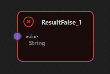

# Chatbot Example

## Overview

The Chatbot Example demonstrates how to build an interactive chatbot application using NodeLink's visual node-based programming system. Unlike traditional chatbots that rely on hardcoded logic, this example shows how to create a rule-based chatbot using regular expressions (Regex) and visual node connections. Users can define conversation patterns visually by connecting nodes, making it easy to design and modify chatbot behavior without writing complex code.


---

## a. Purpose and Use Cases

### Purpose

The Chatbot Example demonstrates:

1. **Visual Rule-Based Chatbots**: Shows how to create chatbots using visual node graphs instead of traditional programming approaches.

2. **Pattern Matching with Regex**: Illustrates how to use regular expressions to match user input and trigger appropriate responses.

3. **Conditional Response Logic**: Demonstrates branching logic where different responses are triggered based on pattern matching results.

4. **Interactive User Interface**: Combines a node-based editor with a real-time chat interface, allowing users to see their chatbot in action.

5. **Real-Time Data Flow**: Shows how user input flows through the node graph, gets processed, and generates responses in real-time.

6. **Dual Output Nodes**: Demonstrates nodes with multiple output ports for conditional branching (true/false paths).

### Use Cases

- **Educational Tool**: Learn how to build rule-based chatbots and understand pattern matching concepts
- **Prototyping**: Quickly prototype chatbot logic and test conversation flows
- **Visual Bot Builder**: Create chatbots without writing code, ideal for non-programmers
- **Pattern Testing**: Test regular expressions and see their effects immediately
- **Framework Demonstration**: Showcase NodeLink's capabilities for building interactive applications
- **Custom Application Foundation**: Use as a starting point for building more complex conversational interfaces

### Example Scenarios

- **Simple Greeting Bot**: Respond to greetings like "hello", "hi", "hey" with friendly messages
- **Keyword-Based Responses**: Trigger responses based on specific keywords in user messages
- **Pattern Recognition**: Match complex patterns like email addresses, phone numbers, or custom formats
- **Multi-Path Conversations**: Create branching conversations that respond differently based on input patterns
- **Interactive Testing**: Test chatbot behavior in real-time while building the node graph

### Real-World Applications

- **Customer Support Bots**: Create simple rule-based support chatbots
- **FAQ Systems**: Build question-answering systems based on pattern matching
- **Form Validation**: Use regex patterns to validate user input
- **Content Filtering**: Filter or categorize messages based on patterns
- **Educational Games**: Create interactive learning experiences with pattern-based responses

 <!-- TODO: Insert diagram showing different use cases -->

---

## b. Node Types Explained

The Chatbot Example implements four distinct node types, each serving a specific role in the chatbot's decision-making process.

### 1. Source Node (`SourceNode`)

**Purpose**: Receives and stores user input messages from the chat interface.

**Type ID**: `CSpecs.NodeType.Source` (0)

**Properties**:
- Contains a single output port named "value"
- Receives text input from the chat interface
- Acts as the entry point for all user messages
- Can be manually edited for testing purposes

**Ports**:
- **Output Port**: "value" (Right side) - Emits the user's message text

**Behavior**:
- Automatically receives messages when users type in the chat box
- The message text is stored in `nodeData.data`
- When data changes, it triggers the scene's `updateData()` function
- Can be manually edited by clicking on the node and typing

**Visual Appearance**:
- Icon: Document/Text icon (Font Awesome)
- Color: Gray (#444)
- Size: 150x100 pixels

**Usage Example**:
- User types "hello world" in chat → Source node receives "hello world"
- Source node outputs "hello world" to connected nodes

 <!-- TODO: Insert screenshot of Source node -->

---

### 2. Regex Node (`RegexNode`)

**Purpose**: Matches user input against a regular expression pattern and routes the result through two different output ports.

**Type ID**: `CSpecs.NodeType.Regex` (1)

**Properties**:
- Has one input port and two output ports
- Contains a regular expression pattern in `nodeData.data`
- Performs case-insensitive pattern matching
- Routes results through "output 1" (match found) or "output 2" (no match)

**Ports**:
- **Input Port**: "input" (Left side) - Receives text to match against the pattern
- **Output Port 1**: "output 1" (Right side) - Emits when pattern matches (FOUND)
- **Output Port 2**: "output 2" (Right side) - Emits when pattern doesn't match (NOT_FOUND)

**Properties**:
- `inputFirst`: Stores the input text to match
- `matchedPattern`: Contains "FOUND" or "NOT_FOUND" based on match result
- `nodeData.data`: Contains the regular expression pattern (e.g., "hello|hi|hey")

**Behavior**:
1. Receives input text from the connected upstream node
2. Creates a case-insensitive RegExp from `nodeData.data`
3. Tests the input against the pattern
4. Sets `matchedPattern` to "FOUND" or "NOT_FOUND"
5. Routes the result through the appropriate output port

**Regular Expression Examples**:
- `"hello|hi|hey"` - Matches any of these greetings
- `"\\d+"` - Matches one or more digits
- `"[a-zA-Z]+"` - Matches one or more letters
- `"^hello"` - Matches "hello" at the start of the string
- `"world$"` - Matches "world" at the end of the string

**Visual Appearance**:
- Icon: Search icon (Font Awesome \uf002)
- Color: Brown/Tan (#C69C6D)
- Size: 150x100 pixels

**Usage Example**:
- Pattern: `"hello|hi"`
- Input: "hello world" → Matches → `matchedPattern = "FOUND"` → Routes to output 1
- Input: "goodbye" → No match → `matchedPattern = "NOT_FOUND"` → Routes to output 2

 <!-- TODO: Insert screenshot of Regex node with pattern and connections -->

**Code Implementation**:
```qml
function updataData() {
    if (!inputFirst) {
        return
    }
    var re = new RegExp(nodeData.data, "i")  // 'i' flag for case-insensitive
    var found = re.test(inputFirst)
    matchedPattern = found ? "FOUND" : "NOT_FOUND"
}
```

---

### 3. Result True Node (`ResultTrueNode`)

**Purpose**: Displays a response message when a pattern match is found (FOUND).

**Type ID**: `CSpecs.NodeType.ResultTrue` (2)

**Properties**:
- Contains a single input port
- Displays response text when triggered
- Automatically sends the response to the chat interface
- Read-only (cannot be edited directly)

**Ports**:
- **Input Port**: "value" (Left side) - Receives data from Regex node's output 1

**Behavior**:
- Should be connected to Regex node's "output 1" port
- When triggered, checks if the upstream Regex node has `matchedPattern === "FOUND"`
- If true, sets `nodeData.data` to "HI ..." (or custom response)
- Emits `botResponse` signal to display the message in the chat box
- If the pattern didn't match, sets data to empty string

**Visual Appearance**:
- Icon: Checkmark/Circle icon (Font Awesome \uf058)
- Color: Green (#4caf50) - indicates positive/successful match
- Size: 150x100 pixels

**Usage Example**:
- Regex node matches "hello" → Routes to ResultTrue node
- ResultTrue node displays "HI ..." in chat
- User sees the bot's response

 <!-- TODO: Insert screenshot of ResultTrue node -->

**Code Implementation**:
```qml
// In ChatbotScene.qml
case CSpecs.NodeType.ResultTrue: {
    downStreamNode.nodeData.data = (upstreamNode.matchedPattern === "FOUND") ? "HI ..." : "";
    botResponse(downStreamNode.nodeData.data)
} break;
```

---

### 4. Result False Node (`ResultFalseNode`)

**Purpose**: Displays a response message when a pattern match is not found (NOT_FOUND).

**Type ID**: `CSpecs.NodeType.ResultFalse` (3)

**Properties**:
- Contains a single input port
- Displays response text when no pattern matches
- Automatically sends the response to the chat interface
- Read-only (cannot be edited directly)

**Ports**:
- **Input Port**: "value" (Left side) - Receives data from Regex node's output 2

**Behavior**:
- Should be connected to Regex node's "output 2" port
- When triggered, checks if the upstream Regex node has `matchedPattern === "NOT_FOUND"`
- If true, sets `nodeData.data` to " :( " (or custom response)
- Emits `botResponse` signal to display the message in the chat box
- If the pattern matched, sets data to empty string

**Visual Appearance**:
- Icon: X-mark/Circle icon (Font Awesome \uf057)
- Color: Red (#f44336) - indicates no match/failure
- Size: 150x100 pixels

**Usage Example**:
- Regex node doesn't match user input → Routes to ResultFalse node
- ResultFalse node displays " :( " in chat
- User sees the bot's "I don't understand" response

 <!-- TODO: Insert screenshot of ResultFalse node -->

**Code Implementation**:
```qml
// In ChatbotScene.qml
case CSpecs.NodeType.ResultFalse: {
    downStreamNode.nodeData.data = (upstreamNode.matchedPattern === "NOT_FOUND") ? " :( " : "";
    botResponse(downStreamNode.nodeData.data)
} break;
```

---

### Node Type Summary Table

| Node Type | Type ID | Input Ports | Output Ports | Purpose | Color |
|-----------|---------|-------------|--------------|---------|-------|
| Source | 0 | 0 | 1 | Receives user input | Gray (#444) |
| Regex | 1 | 1 | 2 | Pattern matching | Brown (#C69C6D) |
| ResultTrue | 2 | 1 | 0 | Response on match | Green (#4caf50) |
| ResultFalse | 3 | 1 | 0 | Response on no match | Red (#f44336) |

---

### Data Flow Architecture

The chatbot follows a simple but powerful data flow pattern:

```
User Input (Chat Box)
    ↓
Source Node (stores message)
    ↓
Regex Node (pattern matching)
    ├─→ [Match Found] → ResultTrue Node → Chat Response ("HI ...")
    └─→ [No Match] → ResultFalse Node → Chat Response (" :( ")
```

 <!-- TODO: Insert diagram showing data flow through nodes -->

---

## c. Step-by-Step Building Guide

This guide will walk you through building the Chatbot Example from scratch, explaining each component and how they work together.

### Prerequisites

- Qt 6.2.4 or later (Qt 6.10.0 recommended)
- CMake 3.1.0 or later
- C++ compiler with C++14 support (MSVC 2019/2022 on Windows)
- NodeLink framework built and installed
- QtQuickStream module built and installed
- Basic understanding of regular expressions (helpful but not required)

### Step 1: Project Setup

#### 1.1 Create Project Structure

Create the following directory structure:

```
chatbot/
├── CMakeLists.txt
├── main.cpp
├── main.qml
└── resources/
    ├── Core/
    ├── View/
    └── fonts/
```

#### 1.2 Configure CMakeLists.txt

Create `CMakeLists.txt` with the following configuration:

```cmake
cmake_minimum_required(VERSION 3.1.0)

set(CMAKE_AUTOMOC ON)
set(CMAKE_CXX_STANDARD_REQUIRED ON)

# Configure Qt
find_package(QT NAMES Qt6 Qt5 COMPONENTS Core Gui QuickControls2 REQUIRED)
find_package(Qt${QT_VERSION_MAJOR} COMPONENTS Core Gui QuickControls2 REQUIRED)

list(APPEND QML_IMPORT_PATH ${CMAKE_BINARY_DIR}/qml)

# Create executable
qt_add_executable(Chatbot main.cpp)

# Set CSpecs as singleton
set_source_files_properties(
    resources/Core/CSpecs.qml
    PROPERTIES
        QT_QML_SINGLETON_TYPE True
)

# Define QML module
qt_add_qml_module(Chatbot
    URI "Chatbot"
    VERSION 1.0
    QML_FILES
        main.qml
        resources/Core/CSpecs.qml
        resources/Core/ChatbotScene.qml
        resources/Core/SourceNode.qml
        resources/Core/RegexNode.qml
        resources/Core/ResultTrueNode.qml
        resources/Core/ResultFalseNode.qml
        resources/Core/OperationNode.qml
        resources/Core/OperationNodeData.qml
        resources/Core/Chatbox.qml
        resources/View/ChatbotView.qml
        resources/View/ChatbotNodeView.qml
    RESOURCES
        resources/fonts/Font\ Awesome\ 6\ Pro-Thin-100.otf
        resources/fonts/Font\ Awesome\ 6\ Pro-Solid-900.otf
        resources/fonts/Font\ Awesome\ 6\ Pro-Regular-400.otf
        resources/fonts/Font\ Awesome\ 6\ Pro-Light-300.otf
)

target_include_directories(Chatbot PUBLIC
    Qt${QT_VERSION_MAJOR}::QuickControls2)

target_link_libraries(Chatbot PRIVATE
    Qt${QT_VERSION_MAJOR}::Core
    Qt${QT_VERSION_MAJOR}::Gui
    Qt${QT_VERSION_MAJOR}::QuickControls2
    NodeLinkplugin
    QtQuickStreamplugin
)
```

**Key Points**:
- Links to `NodeLinkplugin` and `QtQuickStreamplugin`
- Sets `CSpecs.qml` as a singleton for global access
- Includes Font Awesome fonts for icons
- Includes `Chatbox.qml` for the chat interface

---

### Step 2: Create Specifications (CSpecs.qml)

Create `resources/Core/CSpecs.qml` - a singleton that defines node type constants:

```qml
pragma Singleton

import QtQuick

QtObject {
    enum NodeType {
        Source       = 0,
        Regex        = 1,
        ResultTrue   = 2,
        ResultFalse  = 3,
        Unknown      = 99
    }

    enum OperationType {
        Operation    = 0,
        Regex        = 1,
        Unknown      = 99
    }
}
```

**Purpose**: Provides type-safe constants for node types used throughout the application.

---

### Step 3: Create Node Data Models

#### 3.1 OperationNodeData.qml

Create `resources/Core/OperationNodeData.qml` - data model for operation nodes:

```qml
import QtQuick
import NodeLink

I_NodeData {
    property var inputFirst: null
}
```

**Purpose**: Extends `I_NodeData` to store input value for regex operations.

---

### Step 4: Create Base Node Types

#### 4.1 SourceNode.qml

Create `resources/Core/SourceNode.qml`:

```qml
import QtQuick
import NodeLink

Node {
    type: CSpecs.NodeType.Source
    nodeData: I_NodeData {}
    guiConfig.width: 150
    guiConfig.height: 100

    Component.onCompleted: addPorts();

    function addPorts() {
        let _port1 = NLCore.createPort();
        _port1.portType = NLSpec.PortType.Output
        _port1.portSide = NLSpec.PortPositionSide.Right
        _port1.title    = "value";
        addPort(_port1);
    }
}
```

**Key Features**:
- Single output port on the right side
- Receives user messages from the chat interface
- Fixed size node (150x100)

---

#### 4.2 RegexNode.qml

Create `resources/Core/RegexNode.qml` - the core pattern matching node:

```qml
import QtQuick
import NodeLink
import Chatbot

Node {
    type: CSpecs.NodeType.Regex
    nodeData: I_NodeData {}
    property var inputFirst: null
    property var matchedPattern: null
    guiConfig.width: 150
    guiConfig.height: 100

    Component.onCompleted: addPorts();

    function addPorts() {
        let _port1 = NLCore.createPort();
        let _port2 = NLCore.createPort();
        let _port3 = NLCore.createPort();

        _port1.portType = NLSpec.PortType.Input
        _port1.portSide = NLSpec.PortPositionSide.Left
        _port1.enable   = false;
        _port1.title    = "input";

        _port2.portType = NLSpec.PortType.Output
        _port2.portSide = NLSpec.PortPositionSide.Right
        _port2.title    = "output 1";

        _port3.portType = NLSpec.PortType.Output
        _port3.portSide = NLSpec.PortPositionSide.Right
        _port3.title    = "output 2";

        addPort(_port1);
        addPort(_port2);
        addPort(_port3);
    }

    function updataData() {
        if (!inputFirst) {
            return
        }

        var re = new RegExp(nodeData.data, "i")  // Case-insensitive
        var found = re.test(inputFirst)
        matchedPattern = found ? "FOUND" : "NOT_FOUND"
    }
}
```

**Key Features**:
- One input port (left) and two output ports (right)
- Stores regex pattern in `nodeData.data`
- Performs case-insensitive matching
- Sets `matchedPattern` property for downstream nodes to check

---

#### 4.3 ResultTrueNode.qml

Create `resources/Core/ResultTrueNode.qml`:

```qml
import QtQuick
import NodeLink

Node {
    type: CSpecs.NodeType.ResultTrue
    nodeData: I_NodeData {}
    guiConfig.width: 150
    guiConfig.height: 100

    Component.onCompleted: addPorts();

    onCloneFrom: function (baseNode) {
        nodeData.data = null;
    }

    function addPorts() {
        let _port1 = NLCore.createPort();
        _port1.portType = NLSpec.PortType.Input
        _port1.portSide = NLSpec.PortPositionSide.Left
        _port1.enable   = false;
        _port1.title    = "value";
        addPort(_port1);
    }
}
```

**Key Features**:
- Single input port (left side)
- Connected to Regex node's "output 1"
- Resets data when cloned

---

#### 4.4 ResultFalseNode.qml

Create `resources/Core/ResultFalseNode.qml`:

```qml
import QtQuick
import NodeLink

Node {
    type: CSpecs.NodeType.ResultFalse
    nodeData: I_NodeData {}
    guiConfig.width: 150
    guiConfig.height: 100

    Component.onCompleted: addPorts();

    onCloneFrom: function (baseNode) {
        nodeData.data = null;
    }

    function addPorts() {
        let _port1 = NLCore.createPort();
        _port1.portType = NLSpec.PortType.Input
        _port1.portSide = NLSpec.PortPositionSide.Left
        _port1.enable   = false;
        _port1.title    = "value";
        addPort(_port1);
    }
}
```

**Key Features**:
- Single input port (left side)
- Connected to Regex node's "output 2"
- Resets data when cloned

---

### Step 5: Create the Chat Interface

#### 5.1 Chatbox.qml

Create `resources/Core/Chatbox.qml` - the chat interface component:

```qml
import QtQuick
import QtQuick.Controls
import QtQuick.Layouts

Item {
    id: chatBox
    width: parent ? parent.width : 400
    height: parent ? parent.height : 300

    signal userMessageSent(string message)

    ListModel {
        id: messagesModel
    }

    ColumnLayout {
        anchors.fill: parent
        spacing: 12

        // Message list with scroll view
        ScrollView {
            id: scrollView
            Layout.fillWidth: true
            Layout.fillHeight: true
            clip: true

            Column {
                id: messageList
                width: scrollView.width
                spacing: 10

                Repeater {
                    model: messagesModel

                    delegate: Item {
                        width: parent.width
                        implicitHeight: bubble.implicitHeight + dynamicSpacing
                        property int dynamicSpacing: Math.max(36, messageText.lineCount * 24)

                        Row {
                            width: parent.width
                            spacing: 6
                            anchors.margins: 8
                            layoutDirection: model.isUser ? Qt.RightToLeft : Qt.LeftToRight

                            // Avatar
                            Rectangle {
                                width: 28
                                height: 28
                                radius: 14
                                color: model.isUser ? "#3A7AFE" : "#C69C6D"
                                anchors.verticalCenter: parent.verticalCenter

                                Text {
                                    anchors.centerIn: parent
                                    text: model.isUser ? "U" : "B"
                                    color: "white"
                                    font.bold: true
                                    font.pointSize: 10
                                }
                            }

                            // Message bubble
                            Rectangle {
                                id: bubble
                                color: model.isUser ? "#3A7AFE" : "#C69C6D"
                                radius: 12
                                width: Math.min(parent.width * 0.7, messageText.implicitWidth + 24)
                                height: messageText.paintedHeight + 20

                                Text {
                                    id: messageText
                                    text: model.text
                                    color: "white"
                                    wrapMode: Text.WordWrap
                                    font.pointSize: 11
                                    anchors.margins: 10
                                    anchors.fill: parent
                                    width: bubble.width - 20
                                }
                            }
                        }
                    }
                }
            }
        }

        // Input field and send button
        RowLayout {
            Layout.fillWidth: true
            spacing: 6

            TextField {
                id: inputField
                Layout.fillWidth: true
                placeholderText: "Type your message..."
                font.pointSize: 10
                onAccepted: sendMessage()
            }

            Button {
                text: "Send"
                onClicked: sendMessage()
            }
        }
    }

    Component.onCompleted: {
        // Welcome messages
        messagesModel.append({ text: "Hello there! I'm a chatbot based on visual programming and built using the NodeLink.", isUser: false })
        messagesModel.append({ text: "You can send me any message, and I'll check it using Regex nodes.", isUser: false })
        messagesModel.append({ text: "Type something like:   hello world :)   ", isUser: false })
        Qt.callLater(scrollToBottom)
    }

    function scrollToBottom() {
        if (scrollView.flickableItem) {
            scrollView.flickableItem.contentY =
                Math.max(0, scrollView.flickableItem.contentHeight - scrollView.flickableItem.height);
        }
    }

    function sendMessage() {
        if (inputField.text.trim().length === 0)
            return

        let msg = inputField.text.trim()
        inputField.text = ""

        messagesModel.append({ text: msg, isUser: true })
        chatBox.userMessageSent(msg)
        Qt.callLater(scrollToBottom)
    }

    function addMessage(text, fromUser) {
        if (text && text.trim() !== "") {
            messagesModel.append({ text: text, isUser: fromUser })
            Qt.callLater(scrollToBottom)
        }
    }
}
```

**Key Features**:
- **Message List**: Displays chat history with user and bot messages
- **Scroll View**: Auto-scrolls to bottom when new messages arrive
- **Input Field**: Text field for user input with Enter key support
- **Send Button**: Button to send messages
- **Welcome Messages**: Shows introductory messages on startup
- **Signal**: Emits `userMessageSent` signal when user sends a message

 <!-- TODO: Insert screenshot of the chat interface -->

---

### Step 6: Create the Scene

#### 6.1 ChatbotScene.qml

Create `resources/Core/ChatbotScene.qml` - the main scene that manages nodes, links, and bot responses:

```qml
import QtQuick
import QtQuick.Controls
import NodeLink
import Chatbot

I_Scene {
    id: scene

    nodeRegistry: NLNodeRegistry {
        _qsRepo: scene._qsRepo
        imports: ["Chatbot"]
        defaultNode: CSpecs.NodeType.Source
        
        nodeTypes: [
            CSpecs.NodeType.Source      = "SourceNode",
            CSpecs.NodeType.Regex       = "RegexNode",
            CSpecs.NodeType.ResultTrue  = "ResultTrueNode",
            CSpecs.NodeType.ResultFalse = "ResultFalseNode"
        ];
        
        nodeNames: [
            CSpecs.NodeType.Source      = "Source",
            CSpecs.NodeType.Regex       = "Regex",
            CSpecs.NodeType.ResultTrue  = "ResultTrue",
            CSpecs.NodeType.ResultFalse = "ResultFalse"
        ];
        
        nodeIcons: [
            CSpecs.NodeType.Source      = "\ue4e2",
            CSpecs.NodeType.Regex       = "\uf002",
            CSpecs.NodeType.ResultTrue  = "\uf058",
            CSpecs.NodeType.ResultFalse = "\uf057"
        ];
        
        nodeColors: [
            CSpecs.NodeType.Source      = "#444",
            CSpecs.NodeType.Regex       = "#C69C6D",
            CSpecs.NodeType.ResultTrue  = "#4caf50",
            CSpecs.NodeType.ResultFalse = "#f44336"
        ];
    }

    selectionModel: SelectionModel {
        existObjects: [...Object.keys(nodes), ...Object.keys(links)]
    }

    property UndoCore _undoCore: UndoCore {
        scene: scene
    }

    // Update node data when links/nodes change
    onLinkRemoved: _upateDataTimer.start();
    onNodeRemoved: _upateDataTimer.start();
    onLinkAdded:   updateData();

    property Timer _upateDataTimer: Timer {
        repeat: false
        running: false
        interval: 1
        onTriggered: scene.updateData();
    }

    // Signal to send bot response to chat
    signal botResponse(string text)

    // Create a node with specific type and position
    function createCustomizeNode(nodeType: int, xPos: real, yPos: real): string {
        var title = nodeRegistry.nodeNames[nodeType] + "_" + 
                   (Object.values(scene.nodes).filter(node => node.type === nodeType).length + 1);
        return createSpecificNode(nodeRegistry.imports, nodeType,
                                 nodeRegistry.nodeTypes[nodeType],
                                 nodeRegistry.nodeColors[nodeType],
                                 title, xPos, yPos);
    }

    // Link validation and creation (similar to Calculator example)
    function linkNodes(portA: string, portB: string) {
        if (!canLinkNodes(portA, portB)) {
            console.error("[Scene] Cannot link Nodes");
            return;
        }
        let link = Object.values(links).find(conObj =>
            conObj.inputPort._qsUuid === portA &&
            conObj.outputPort._qsUuid === portB);
        if (link === undefined)
            createLink(portA, portB);
    }

    function canLinkNodes(portA: string, portB: string): bool {
        // Validation logic (same as Calculator example)
        // ... (see source file for full implementation)
        return true;
    }

    // Update all node data based on connections
    function updateData() {
        var notReadyLinks = [];
        
        // Initialize result nodes
        Object.values(nodes).forEach(node => {
            switch (node.type) {
                case CSpecs.NodeType.ResultTrue:
                case CSpecs.NodeType.ResultFalse: {
                    node.nodeData.data = null;
                } break;
            }
        });

        // Process links and update data
        Object.values(links).forEach(link => {
            var portA = link.inputPort._qsUuid;
            var portB = link.outputPort._qsUuid;

            var upstreamNode   = findNode(portA);
            var downStreamNode = findNode(portB);

            // Find nodes with valid data that connected to upstreamNode
            var upstreamNodeLinks = Object.values(links).filter(linkObj => {
                var node = findNode(linkObj.outputPort._qsUuid);
                var inputNode = findNode(linkObj.inputPort._qsUuid);
                if (node._qsUuid === upstreamNode._qsUuid) {
                    if(inputNode.nodeData.data) {
                        return linkObj
                    }
                }
            });

            if (!upstreamNode.nodeData.data &&
                upstreamNode.type !== CSpecs.NodeType.Source) {
                if (upstreamNodeLinks.length > 1)
                    notReadyLinks.push(link);
                return;
            }

            upadateNodeData(upstreamNode, downStreamNode);
        });

        // Handle nodes waiting for multiple inputs
        while (notReadyLinks.length > 0) {
            notReadyLinks.forEach((link, index) => {
                var portA = link.inputPort._qsUuid;
                var portB = link.outputPort._qsUuid;

                var upstreamNode   = findNode(portA);
                var downStreamNode = findNode(portB);

                var upstreamNodeLinks = Object.values(links).filter(linkObj => 
                    findNodeId(linkObj.outputPort._qsUuid) === upstreamNode._qsUuid);

                if (upstreamNode.nodeData.data) {
                    notReadyLinks.splice(index, 1);
                }

                upadateNodeData(upstreamNode, downStreamNode);
            });
        }
    }

    // Update specific node data
    function upadateNodeData(upstreamNode: Node, downStreamNode: Node) {
        switch (downStreamNode.type) {
            case CSpecs.NodeType.Regex: {
                downStreamNode.inputFirst = upstreamNode.nodeData.data;
                downStreamNode.updataData();
            } break;

            case CSpecs.NodeType.ResultTrue: {
                downStreamNode.nodeData.data = (upstreamNode.matchedPattern === "FOUND") ? "HI ..." : "";
                botResponse(downStreamNode.nodeData.data)
            } break;
            
            case CSpecs.NodeType.ResultFalse: {
                downStreamNode.nodeData.data = (upstreamNode.matchedPattern === "NOT_FOUND") ? " :( " : "";
                botResponse(downStreamNode.nodeData.data)
            } break;
        }
    }
}
```

**Key Features**:
- **Node Registry**: Defines all available node types with colors and icons
- **Link Validation**: Ensures valid connections
- **Data Propagation**: Automatically updates node values when connections change
- **Bot Response Signal**: Emits `botResponse` signal to send messages to chat
- **Conditional Logic**: Checks `matchedPattern` to determine which response to send

**Data Flow Logic**:
1. User sends message → Source node receives it
2. Source node outputs to Regex node
3. Regex node matches pattern and sets `matchedPattern`
4. ResultTrue/ResultFalse nodes check `matchedPattern`
5. Appropriate response is sent via `botResponse` signal
6. Chat interface displays the response

 <!-- TODO: Insert diagram showing scene structure -->

---

### Step 7: Create Views

#### 7.1 ChatbotNodeView.qml

Create `resources/View/ChatbotNodeView.qml` - custom view for displaying nodes:

```qml
import QtQuick
import QtQuick.Controls
import NodeLink
import Chatbot

NodeView {
    id: nodeView

    contentItem: Item {
        id: mainContentItem
        property bool iconOnly: ((node?.operationType ?? -1) > -1) ||
                                nodeView.isNodeMinimal
        
        // Header with icon and title
        Item {
            id: titleItem
            anchors.left: parent.left
            anchors.right: parent.right
            anchors.top: parent.top
            anchors.margins: 12
            visible: !mainContentItem.iconOnly
            height: 20

            Text {
                id: iconText
                font.family: NLStyle.fontType.font6Pro
                font.pixelSize: 20
                anchors.left: parent.left
                anchors.verticalCenter: parent.verticalCenter
                text: scene.nodeRegistry.nodeIcons[node.type]
                color: node.guiConfig.color
            }

            NLTextArea {
                id: titleTextArea
                anchors.right: parent.right
                anchors.left: iconText.right
                anchors.verticalCenter: parent.verticalCenter
                anchors.leftMargin: 5
                height: 40
                readOnly: !nodeView.edit
                placeholderText: qsTr("Enter title")
                color: NLStyle.primaryTextColor
                text: node.title
                onTextChanged: {
                    if (node && node.title !== text)
                        node.title = text;
                }
            }
        }

        // Value display/input field
        NLTextField {
            id: textArea
            anchors.top: titleItem.bottom
            anchors.right: parent.right
            anchors.bottom: parent.bottom
            anchors.left: parent.left
            anchors.margins: 12
            anchors.topMargin: 5
            visible: !mainContentItem.iconOnly
            placeholderText: qsTr("String")
            color: NLStyle.primaryTextColor
            text: node?.nodeData?.data
            readOnly: !nodeView.edit || 
                     (node.type === CSpecs.NodeType.ResultTrue) || 
                     (node.type === CSpecs.NodeType.ResultFalse)
            wrapMode: TextEdit.WrapAnywhere
            onTextChanged: {
                if (node && (node.nodeData?.data ?? "") !== text) {
                    if (node.type === CSpecs.NodeType.Source || 
                        node.type === CSpecs.NodeType.Regex) {
                        node.nodeData.data = text;
                        scene.updateData();
                    }
                }
            }
        }

        // Minimal view (icon only at low zoom)
        Rectangle {
            id: minimalRectangle
            anchors.fill: parent
            anchors.margins: 10
            color: mainContentItem.iconOnly ? "#282828" : "transparent"
            radius: NLStyle.radiusAmount.nodeView

            Text {
                font.family: NLStyle.fontType.font6Pro
                font.pixelSize: 60
                anchors.centerIn: parent
                text: scene.nodeRegistry.nodeIcons[node.type]
                color: node.guiConfig.color
                visible: mainContentItem.iconOnly
            }
        }
    }
}
```

**Key Features**:
- **Editable Title**: Users can rename nodes
- **Value Display**: Shows node data (editable for Source/Regex, read-only for Results)
- **Minimal Mode**: Shows icon only when zoomed out
- **String Input**: Accepts text input for Source and Regex nodes

---

#### 7.2 ChatbotView.qml

Create `resources/View/ChatbotView.qml` - main view container:

```qml
import QtQuick
import QtQuick.Controls
import NodeLink
import QtQuickStream
import Chatbot

Item {
    id: view
    property ChatbotScene scene

    property SceneSession sceneSession: SceneSession {
        enabledOverview: false;
        doNodesNeedImage: false
    }

    // Nodes Scene (flickable canvas)
    NodesScene {
        id: nodesScene
        anchors.fill: parent
        scene: view.scene
        sceneSession: view.sceneSession
        sceneContent: NodesRect {
            scene: view.scene
            sceneSession: view.sceneSession
            nodeViewComponent: Qt.createComponent("ChatbotNodeView.qml")
        }
    }

    // Side menu for adding nodes
    SideMenu {
        scene: view.scene
        sceneSession: view.sceneSession
        anchors.right: parent.right
        anchors.rightMargin: 45
        anchors.top: parent.top
        anchors.topMargin: 50
    }
}
```

**Key Features**:
- **NodesScene**: Provides the scrollable canvas for nodes
- **SideMenu**: Allows users to add new nodes to the scene
- **SceneSession**: Manages view state and interactions

---

### Step 8: Create Main Application

#### 8.1 main.cpp

Create `main.cpp`:

```cpp
#include <QtGui/QGuiApplication>
#include <QQmlApplicationEngine>
#include <QQuickStyle>

int main(int argc, char* argv[])
{
    QGuiApplication app(argc, argv);
    QQmlApplicationEngine engine;

    // Set Material style
    QQuickStyle::setStyle("Material");

    // Import all items into QML engine
    engine.addImportPath(":/");

    const QUrl url(u"qrc:/Chatbot/main.qml"_qs);
    QObject::connect(&engine, &QQmlApplicationEngine::objectCreated,
                     &app, [url](QObject *obj, const QUrl &objUrl) {
        if (!obj && url == objUrl)
            QCoreApplication::exit(-1);
    }, Qt::QueuedConnection);
    engine.load(url);

    return app.exec();
}
```

---

#### 8.2 main.qml

Create `main.qml`:

```qml
import QtQuick
import QtQuick.Dialogs
import QtQuick.Controls
import QtQuick.Layouts

import QtQuickStream
import NodeLink
import Chatbot

Window {
    id: window
    property ChatbotScene scene: null

    width: 1280
    height: 960
    visible: true
    title: qsTr("Chatbot Example")
    color: "#1e1e1e"

    Material.theme: Material.Dark
    Material.accent: "#4890e2"

    Component.onCompleted: {
        // Create root object
        NLCore.defaultRepo = NLCore.createDefaultRepo(["QtQuickStream", "Chatbot"])
        NLCore.defaultRepo.initRootObject("ChatbotScene");
        window.scene = Qt.binding(function() { 
            return NLCore.defaultRepo.qsRootObject;
        });

        // Connect bot response signal to chat box
        Qt.callLater(() => {
            if (window.scene) {
                window.scene.botResponse.connect(function(msg) {
                    chatBox.addMessage(msg, false)
                })
            }
        })
    }

    // Load Font Awesome fonts
    FontLoader { source: "qrc:/Chatbot/resources/fonts/Font Awesome 6 Pro-Thin-100.otf" }
    FontLoader { source: "qrc:/Chatbot/resources/fonts/Font Awesome 6 Pro-Solid-900.otf" }
    FontLoader { source: "qrc:/Chatbot/resources/fonts/Font Awesome 6 Pro-Regular-400.otf" }
    FontLoader { source: "qrc:/Chatbot/resources/fonts/Font Awesome 6 Pro-Light-300.otf" }

    // Main layout: Node view (left) and Chat box (right)
    RowLayout {
        anchors.fill: parent
        spacing: 4
        anchors.margins: 4

        // Node-based view (left)
        ChatbotView {
            id: view
            scene: window.scene
            Layout.fillWidth: true
            Layout.fillHeight: true
        }

        // Chat box (right)
        Chatbox {
            id: chatBox
            Layout.preferredWidth: 400
            Layout.fillHeight: true
            onUserMessageSent: {
                // Find Source node and update it with user message
                let sourceNode = Object.values(window.scene.nodes).find(n => n.type === 0)
                if (sourceNode) {
                    sourceNode.nodeData.data = message
                    window.scene.updateData()
                }
            }
        }
    }
}
```

**Key Features**:
- **Dark Theme**: Material Dark theme with custom accent color
- **Scene Initialization**: Creates the ChatbotScene using QtQuickStream
- **Signal Connection**: Connects bot response signal to chat box
- **Split Layout**: Node editor on left, chat interface on right
- **Message Handling**: Updates Source node when user sends a message


---

### Step 9: Build and Run

#### 9.1 Configure Build

1. Create a build directory:
   ```bash
   mkdir build
   cd build
   ```

2. Configure with CMake:
   ```bash
   cmake .. -DCMAKE_PREFIX_PATH=<Qt_Install_Path>
   ```

3. Build the project:
   ```bash
   cmake --build .
   ```

#### 9.2 Run the Application

Run the executable:
```bash
./Chatbot  # Linux/Mac
Chatbot.exe  # Windows
```

---

### Step 10: Using the Chatbot

#### Basic Usage

1. **Add Nodes**: 
   - Click the side menu to add nodes
   - You'll need at least: 1 Source, 1 Regex, 1 ResultTrue, 1 ResultFalse

2. **Configure Regex Node**:
   - Click on the Regex node
   - Type a regular expression pattern (e.g., `"hello|hi|hey"`)
   - Press Enter or click outside

3. **Connect Nodes**:
   - Connect Source output → Regex input
   - Connect Regex "output 1" → ResultTrue input
   - Connect Regex "output 2" → ResultFalse input

4. **Test the Chatbot**:
   - Type a message in the chat box (right side)
   - If the message matches the regex pattern, you'll see "HI ..."
   - If it doesn't match, you'll see " :( "

 <!-- TODO: Insert screenshot showing connected nodes -->

#### Example: Greeting Bot

**Setup**:
1. Add a Source node
2. Add a Regex node, set pattern to: `"hello|hi|hey|greetings"`
3. Add a ResultTrue node
4. Add a ResultFalse node

**Connections**:
- Source → Regex (input)
- Regex (output 1) → ResultTrue
- Regex (output 2) → ResultFalse

**Test**:
- User: "hello" → Bot: "HI ..."
- User: "hi there" → Bot: "HI ..."
- User: "goodbye" → Bot: " :( "

#### Example: Number Detection

**Setup**:
1. Add a Source node
2. Add a Regex node, set pattern to: `"\\d+"` (matches one or more digits)
3. Add ResultTrue and ResultFalse nodes
4. Connect as above

**Test**:
- User: "123" → Bot: "HI ..."
- User: "abc" → Bot: " :( "
- User: "I have 5 apples" → Bot: "HI ..." (contains digits)

#### Example: Email Pattern

**Setup**:
1. Regex pattern: `"[a-zA-Z0-9._%+-]+@[a-zA-Z0-9.-]+\\.[a-zA-Z]{2,}"`

**Test**:
- User: "test@example.com" → Bot: "HI ..."
- User: "not an email" → Bot: " :( "


---

## Architecture Overview

### Component Hierarchy

```
ChatbotScene (I_Scene)
├── NodeRegistry (defines node types)
├── SelectionModel (manages selection)
├── UndoCore (undo/redo support)
└── Nodes & Links
    ├── SourceNode (user input)
    ├── RegexNode (pattern matching)
    ├── ResultTrueNode (match response)
    └── ResultFalseNode (no-match response)

Main Window
├── ChatbotView (left side)
│   ├── NodesScene (canvas)
│   │   └── NodesRect (renders nodes)
│   │       └── ChatbotNodeView (custom node UI)
│   └── SideMenu (add nodes)
└── Chatbox (right side)
    ├── Message List (scrollable)
    └── Input Field + Send Button
```

### Data Flow

```
User Types Message
    ↓
Chatbox emits userMessageSent signal
    ↓
Source Node receives message (nodeData.data)
    ↓
Source Node outputs to Regex Node
    ↓
Regex Node matches pattern
    ├─→ [Match] → matchedPattern = "FOUND" → ResultTrue → "HI ..."
    └─→ [No Match] → matchedPattern = "NOT_FOUND" → ResultFalse → " :( "
    ↓
botResponse signal emitted
    ↓
Chatbox displays response
```

 <!-- TODO: Insert comprehensive architecture diagram -->

---

## Key Concepts

### Regular Expressions (Regex)

Regular expressions are patterns used to match character combinations in strings. The chatbot uses JavaScript's RegExp object.

**Common Patterns**:
- `"hello"` - Exact match
- `"hello|hi"` - Matches "hello" OR "hi"
- `"\\d+"` - One or more digits
- `"[a-z]+"` - One or more lowercase letters
- `"^start"` - Starts with "start"
- `"end$"` - Ends with "end"
- `".*"` - Any characters (wildcard)

**Flags**:
- `"i"` - Case-insensitive (used in the chatbot)

### Dual Output Ports

The Regex node has two output ports to enable conditional branching:
- **Output 1**: Triggered when pattern matches
- **Output 2**: Triggered when pattern doesn't match

This allows the chatbot to respond differently based on whether the pattern matched.

### Signal-Based Communication

The chatbot uses Qt signals to communicate between components:
- `userMessageSent`: Chatbox → Source Node
- `botResponse`: Scene → Chatbox

This decouples the components and makes the system more flexible.

---

## Extending the Chatbot

### Adding Custom Response Messages

Modify `ChatbotScene.qml` to change response messages:

```qml
case CSpecs.NodeType.ResultTrue: {
    downStreamNode.nodeData.data = (upstreamNode.matchedPattern === "FOUND") 
        ? "Great! I understood that!" : "";
    botResponse(downStreamNode.nodeData.data)
} break;
```

### Adding Multiple Regex Patterns

You can chain multiple Regex nodes:

1. Source → Regex1 (pattern: "hello")
2. Regex1 (output 1) → Regex2 (pattern: "world")
3. Regex2 (output 1) → ResultTrue

This creates an AND condition: message must match both patterns.

### Adding New Node Types

To add a new node type (e.g., "KeywordNode"):

1. **Add to CSpecs.qml**:
   ```qml
   enum NodeType {
       // ... existing
       Keyword = 4
   }
   ```

2. **Create KeywordNode.qml**:
   ```qml
   Node {
       type: CSpecs.NodeType.Keyword
       // ... implementation
   }
   ```

3. **Register in ChatbotScene.qml**:
   ```qml
   nodeTypes: [
       // ... existing
       CSpecs.NodeType.Keyword = "KeywordNode"
   ]
   ```

### Customizing Chat Interface

Modify `Chatbox.qml` to:
- Change colors and styling
- Add emoji support
- Add message timestamps
- Add user avatars
- Add typing indicators

---

## Troubleshooting

### Common Issues

1. **No Response from Bot**:
   - Check that nodes are properly connected
   - Verify Regex pattern is correct
   - Ensure Source node receives the message

2. **Regex Not Matching**:
   - Test your regex pattern in an online regex tester
   - Remember the pattern is case-insensitive
   - Check for special characters that need escaping

3. **Multiple Responses**:
   - Ensure only one Source node is connected
   - Check that Result nodes are connected to correct Regex outputs

4. **Chat Not Updating**:
   - Verify `botResponse` signal is connected
   - Check that `addMessage` function is called

### Debug Tips

- Enable console logging in `ChatbotScene.qml`
- Check node data: `console.log(node.nodeData.data)`
- Verify pattern matching: `console.log(regexNode.matchedPattern)`
- Check signal connections: `console.log("Signal connected:", scene.botResponse)`

---

## Regular Expression Reference

### Basic Patterns

| Pattern | Matches | Example |
|---------|---------|---------|
| `"hello"` | Exact string | "hello" |
| `"hello\|hi"` | Either string | "hello" or "hi" |
| `"\\d"` | Single digit | "5" |
| `"\\d+"` | One or more digits | "123" |
| `"[a-z]"` | Single lowercase letter | "a" |
| `"[A-Z]+"` | One or more uppercase letters | "HELLO" |
| `"."` | Any single character | "a", "1", "!" |
| `".*"` | Any characters | "anything" |

### Special Characters

| Character | Meaning |
|-----------|---------|
| `^` | Start of string |
| `$` | End of string |
| `\|` | OR operator |
| `+` | One or more |
| `*` | Zero or more |
| `?` | Zero or one |
| `\\` | Escape character |

### Common Use Cases

- **Email**: `"[a-zA-Z0-9._%+-]+@[a-zA-Z0-9.-]+\\.[a-zA-Z]{2,}"`
- **Phone**: `"\\d{3}-\\d{3}-\\d{4}"`
- **URL**: `"https?://[^\\s]+"`
- **Greeting**: `"hello\|hi\|hey\|greetings"`

---

## Conclusion

The Chatbot Example demonstrates how to build interactive, rule-based chatbots using NodeLink's visual programming system. Key takeaways:

- **Visual Rule Definition**: Create chatbot logic without writing complex code
- **Pattern Matching**: Use regular expressions for flexible input matching
- **Conditional Logic**: Branch responses based on pattern matching results
- **Real-Time Interaction**: See chatbot responses immediately as you build
- **Extensible Design**: Easy to add new node types and behaviors

This example serves as a foundation for building more sophisticated conversational interfaces, such as:
- Multi-turn conversations
- Context-aware responses
- Natural language processing integration
- Database-backed responses
- Multi-language support

For more examples, see the other examples in the NodeLink repository.


