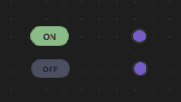
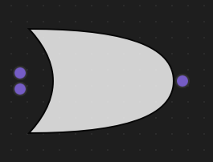

# Logic Circuit Example

## Overview

The Logic Circuit Example demonstrates how to build a visual digital logic circuit simulator using NodeLink. This example allows users to create, connect, and test digital logic gates (AND, OR, NOT) in a visual node-based interface. Users can toggle input switches and observe how signals propagate through the circuit in real-time, making it an excellent tool for learning digital logic, designing circuits, and understanding boolean algebra.


---

## a. Purpose and Use Cases

### Purpose

The Logic Circuit Example demonstrates:

1. **Visual Circuit Design**: Create digital logic circuits using a visual node-based interface without writing code.

2. **Real-Time Signal Propagation**: Observe how boolean signals (true/false) flow through gates and update outputs instantly.

3. **Standard Logic Gates**: Implement fundamental logic gates (AND, OR, NOT) with their standard symbols and truth tables.

4. **Interactive Input/Output**: Toggle input switches and see immediate results on output indicators.

5. **Educational Tool**: Learn digital logic concepts, boolean algebra, and circuit design principles visually.

6. **Gate Symbol Rendering**: Display logic gates using standard digital circuit symbols drawn with Canvas.

### Use Cases

- **Educational Tool**: Teach digital logic, boolean algebra, and circuit design to students
- **Circuit Prototyping**: Quickly prototype and test logic circuits before implementation
- **Learning Tool**: Understand how logic gates work and how signals propagate
- **Truth Table Verification**: Test and verify truth tables for various gate combinations
- **Circuit Design**: Design and test combinational logic circuits
- **Framework Demonstration**: Showcase NodeLink's capabilities for building interactive simulators

### Example Scenarios

- **Basic Gate Testing**: Test individual gates (AND, OR, NOT) with different input combinations
- **Combinational Circuits**: Build circuits like half-adders, full-adders, or multiplexers
- **Boolean Expression Implementation**: Convert boolean expressions into visual circuits
- **Signal Propagation**: Observe how signals flow through complex circuits
- **Interactive Learning**: Experiment with different circuit configurations and see results immediately

### Real-World Applications

- **Digital Electronics Education**: Teach students about digital circuits and logic gates
- **Circuit Design Tools**: Prototype logic circuits before hardware implementation
- **Boolean Logic Visualization**: Visualize boolean expressions and their evaluation
- **Hardware Design**: Design and test logic for FPGAs, microcontrollers, or custom chips
- **Troubleshooting**: Debug logic circuits by visualizing signal flow

 <!-- TODO: Insert diagram showing different use cases -->

---

## b. Node Types Explained

The Logic Circuit Example implements five distinct node types, each representing a fundamental component of digital logic circuits.

### 1. Input Node (`InputNode`)

**Purpose**: Provides boolean input values (ON/OFF) to the circuit through an interactive toggle switch.

**Type ID**: `LSpecs.NodeType.Input` (0)

**Properties**:
- Contains a single output port
- Has an interactive toggle switch that can be clicked
- Outputs `true` (ON) or `false` (OFF) boolean values
- Acts as the starting point for all signals in the circuit

**Ports**:
- **Output Port**: (Right side) - Emits the current state (true/false)

**Properties**:
- `nodeData.currentState`: Boolean value representing ON (true) or OFF (false)
- `nodeData.output`: Output value (same as currentState)
- `nodeData.displayValue`: String representation ("ON" or "OFF")

**Behavior**:
- Initializes to OFF (false) state
- Clicking the switch toggles between ON and OFF
- When toggled, updates the circuit by calling `scene.updateLogic()`
- Visual indicator shows green for ON, gray for OFF

**Visual Appearance**:
- Icon: Lightning bolt (⚡)
- Toggle Switch: Rounded rectangle with ON/OFF text
- Color: Green (#A6E3A1) when ON, Gray (#585B70) when OFF
- Interactive: Clickable to toggle state

**Usage Example**:
- Click Input node → Toggles from OFF to ON
- Output port emits `true`
- Connected gates receive the signal

 <!-- TODO: Insert screenshot of Input node with toggle switch -->

**Truth Table**:
| Input State | Output |
|-------------|--------|
| OFF | false |
| ON | true |

---

### 2. AND Gate (`AndNode`)

**Purpose**: Performs logical AND operation - output is true only when both inputs are true.

**Type ID**: `LSpecs.NodeType.AND` (1)

**Properties**:
- Has two input ports and one output port
- Implements boolean AND logic: `output = inputA && inputB`
- Uses standard AND gate symbol (flat left side, curved right side)

**Ports**:
- **Input Port A**: (Left side, top)
- **Input Port B**: (Left side, bottom)
- **Output Port**: (Right side)

**Properties**:
- `nodeData.inputA`: First input value (boolean or null)
- `nodeData.inputB`: Second input value (boolean or null)
- `nodeData.output`: Result of AND operation (boolean or null)

**Behavior**:
- Waits for both inputs to be connected and have valid values
- Calculates: `output = inputA && inputB`
- Output is `null` if either input is missing
- Updates automatically when inputs change

**Visual Appearance**:
- Icon: AND symbol (∧)
- Gate Symbol: Standard AND gate shape (flat left, curved right)
- Drawn using Canvas with white fill and black border
- Color: Black border (#000000)

**Usage Example**:
- Input A: true, Input B: true → Output: true
- Input A: true, Input B: false → Output: false
- Input A: false, Input B: true → Output: false
- Input A: false, Input B: false → Output: false

 <!-- TODO: Insert screenshot of AND gate with connections -->

**Truth Table**:
| Input A | Input B | Output |
|---------|---------|--------|
| false | false | false |
| false | true | false |
| true | false | false |
| true | true | true |

**Code Implementation**:
```qml
function updateData() {
    if (nodeData.inputA !== null && nodeData.inputB !== null) {
        nodeData.output = nodeData.inputA && nodeData.inputB;
    } else {
        nodeData.output = null;
    }
}
```

---

### 3. OR Gate (`OrNode`)

**Purpose**: Performs logical OR operation - output is true when at least one input is true.

**Type ID**: `LSpecs.NodeType.OR` (2)

**Properties**:
- Has two input ports and one output port
- Implements boolean OR logic: `output = inputA || inputB`
- Uses standard OR gate symbol (curved shape on both sides)

**Ports**:
- **Input Port A**: (Left side, top)
- **Input Port B**: (Left side, bottom)
- **Output Port**: (Right side)

**Properties**:
- `nodeData.inputA`: First input value (boolean or null)
- `nodeData.inputB`: Second input value (boolean or null)
- `nodeData.output`: Result of OR operation (boolean or null)

**Behavior**:
- Waits for both inputs to be connected and have valid values
- Calculates: `output = inputA || inputB`
- Output is `null` if either input is missing
- Updates automatically when inputs change

**Visual Appearance**:
- Icon: OR symbol (∨)
- Gate Symbol: Standard OR gate shape (curved on both sides)
- Drawn using Canvas with white fill and black border
- Color: Black border (#000000)

**Usage Example**:
- Input A: true, Input B: true → Output: true
- Input A: true, Input B: false → Output: true
- Input A: false, Input B: true → Output: true
- Input A: false, Input B: false → Output: false

 <!-- TODO: Insert screenshot of OR gate with connections -->

**Truth Table**:
| Input A | Input B | Output |
|---------|---------|--------|
| false | false | false |
| false | true | true |
| true | false | true |
| true | true | true |

**Code Implementation**:
```qml
function updateData() {
    if (nodeData.inputA !== null && nodeData.inputB !== null) {
        nodeData.output = nodeData.inputA || nodeData.inputB;
    } else {
        nodeData.output = null;
    }
}
```

---

### 4. NOT Gate (`NotNode`)

**Purpose**: Performs logical NOT operation (inversion) - output is the opposite of the input.

**Type ID**: `LSpecs.NodeType.NOT` (3)

**Properties**:
- Has one input port and one output port
- Implements boolean NOT logic: `output = !inputA`
- Uses standard NOT gate symbol (triangle with bubble)

**Ports**:
- **Input Port**: (Left side)
- **Output Port**: (Right side)

**Properties**:
- `nodeData.inputA`: Input value (boolean or null)
- `nodeData.output`: Result of NOT operation (boolean or null)

**Behavior**:
- Waits for input to be connected and have a valid value
- Calculates: `output = !inputA`
- Output is `null` if input is missing
- Updates automatically when input changes

**Visual Appearance**:
- Icon: NOT symbol (~)
- Gate Symbol: Triangle pointing right with a bubble (circle) on the output
- Drawn using Canvas with white fill and black border
- Color: Black border (#000000)

**Usage Example**:
- Input: true → Output: false
- Input: false → Output: true

 <!-- TODO: Insert screenshot of NOT gate with connections -->

**Truth Table**:
| Input | Output |
|-------|--------|
| false | true |
| true | false |

**Code Implementation**:
```qml
function updateData() {
    if (nodeData.inputA !== null) {
        nodeData.output = !nodeData.inputA;
    } else {
        nodeData.output = null;
    }
}
```

---

### 5. Output Node (`OutputNode`)

**Purpose**: Displays the final result of the logic circuit as a visual indicator (lamp).

**Type ID**: `LSpecs.NodeType.Output` (4)

**Properties**:
- Contains a single input port
- Displays the boolean value received from connected gates
- Shows visual indicator: Green (ON), Red (OFF), or Gray (UNDEFINED)

**Ports**:
- **Input Port**: (Left side) - Receives the calculated result

**Properties**:
- `nodeData.inputA`: Input value from connected gate (boolean or null)
- `nodeData.displayValue`: String representation ("ON", "OFF", or "UNDEFINED")
- `nodeData.statusColor`: Color for the indicator (green, red, or gray)

**Behavior**:
- Receives input from connected gate or node
- Displays "ON" (green) when input is `true`
- Displays "OFF" (red) when input is `false`
- Displays "UNDEFINED" (gray) when input is `null` or not connected
- Updates automatically when input changes

**Visual Appearance**:
- Icon: Circle (○)
- Indicator: Circular lamp with colored inner circle
- Colors:
  - Green (#4CAF50) for ON (true)
  - Red (#F44336) for OFF (false)
  - Gray (#9E9E9E) for UNDEFINED (null)
- Smooth color transitions when state changes

**Usage Example**:
- Connected to AND gate output → Shows result of AND operation
- Connected to OR gate output → Shows result of OR operation
- Not connected → Shows "UNDEFINED" (gray)

 <!-- TODO: Insert screenshot of Output node showing different states -->

**Display States**:
| Input Value | Display | Color |
|-------------|---------|-------|
| true | "ON" | Green (#4CAF50) |
| false | "OFF" | Red (#F44336) |
| null | "UNDEFINED" | Gray (#9E9E9E) |

**Code Implementation**:
```qml
function updateDisplay(value) {
    if (value === null) {
        nodeData.displayValue = "UNDEFINED";
    } else {
        nodeData.displayValue = value ? "ON" : "OFF";
    }
    nodeData.statusColor = getStatusColor(value);
}

function getStatusColor(value) {
    if (value === null) return "#9E9E9E"; // Gray
    return value ? "#4CAF50" : "#F44336"; // Green or Red
}
```

---

### Node Type Summary Table

| Node Type | Type ID | Input Ports | Output Ports | Operation | Symbol |
|-----------|---------|-------------|--------------|-----------|--------|
| Input | 0 | 0 | 1 | Provides boolean input | ⚡ |
| AND | 1 | 2 | 1 | Logical AND (∧) | ∧ |
| OR | 2 | 2 | 1 | Logical OR (∨) | ∨ |
| NOT | 3 | 1 | 1 | Logical NOT (~) | ~ |
| Output | 4 | 1 | 0 | Displays result | ○ |

---

### Data Flow Architecture

The logic circuit follows a signal propagation pattern:

```
Input Node (ON/OFF)
    ↓
Logic Gates (AND/OR/NOT)
    ↓
Output Node (Visual Indicator)
```

Signals propagate through the circuit in real-time, updating all downstream gates and outputs automatically.

 <!-- TODO: Insert diagram showing signal propagation through gates -->

---

## c. Step-by-Step Building Guide

This guide will walk you through building the Logic Circuit Example from scratch, explaining each component and how they work together.

### Prerequisites

- Qt 6.2.4 or later (Qt 6.10.0 recommended)
- CMake 3.1.0 or later
- C++ compiler with C++14 support (MSVC 2019/2022 on Windows)
- NodeLink framework built and installed
- QtQuickStream module built and installed
- Basic understanding of boolean logic (helpful but not required)

### Step 1: Project Setup

#### 1.1 Create Project Structure

Create the following directory structure:

```
logicCircuit/
├── CMakeLists.txt
├── main.cpp
├── main.qml
└── resources/
    ├── Core/
    ├── View/
    └── fonts/
```

#### 1.2 Configure CMakeLists.txt

Create `CMakeLists.txt` with the following configuration:

```cmake
cmake_minimum_required(VERSION 3.1.0)

set(MODULE_NAME LogicCircuit)

set(CMAKE_AUTOMOC ON)
set(CMAKE_CXX_STANDARD_REQUIRED ON)

# Configure Qt
find_package(QT NAMES Qt6 Qt5 COMPONENTS Core Gui QuickControls2 REQUIRED)
find_package(Qt${QT_VERSION_MAJOR} COMPONENTS Core Gui QuickControls2 REQUIRED)

list(APPEND QML_IMPORT_PATH ${CMAKE_BINARY_DIR}/qml)

# Create executable
qt_add_executable(${MODULE_NAME} main.cpp)

# Set LSpecs as singleton
set_source_files_properties(
    resources/Core/LSpecs.qml
    PROPERTIES
        QT_QML_SINGLETON_TYPE True
)

# Define QML module
qt_add_qml_module(${MODULE_NAME}
    URI "LogicCircuit"
    VERSION 1.0
    QML_FILES
        main.qml
        resources/Core/LSpecs.qml
        resources/Core/LogicCircuitScene.qml
        resources/Core/InputNode.qml
        resources/Core/LogicNode.qml
        resources/Core/AndNode.qml
        resources/Core/OrNode.qml
        resources/Core/NotNode.qml
        resources/Core/OutputNode.qml
        resources/Core/LogicNodeData.qml
        resources/View/LogicCircuitView.qml
        resources/View/LogicCircuitNodeView.qml
    RESOURCES
        resources/fonts/Font\ Awesome\ 6\ Pro-Thin-100.otf
        resources/fonts/Font\ Awesome\ 6\ Pro-Solid-900.otf
        resources/fonts/Font\ Awesome\ 6\ Pro-Regular-400.otf
        resources/fonts/Font\ Awesome\ 6\ Pro-Light-300.otf
)

target_include_directories(${MODULE_NAME} PUBLIC
    Qt${QT_VERSION_MAJOR}::QuickControls2)

target_link_libraries(${MODULE_NAME} PRIVATE
    Qt${QT_VERSION_MAJOR}::Core
    Qt${QT_VERSION_MAJOR}::Gui
    Qt${QT_VERSION_MAJOR}::QuickControls2
    NodeLinkplugin
    QtQuickStreamplugin
)
```

**Key Points**:
- Links to `NodeLinkplugin` and `QtQuickStreamplugin`
- Sets `LSpecs.qml` as a singleton for global access
- Includes Font Awesome fonts for icons
- Includes `LogicNode.qml` as a base class

---

### Step 2: Create Specifications (LSpecs.qml)

Create `resources/Core/LSpecs.qml` - a singleton that defines node type constants:

```qml
pragma Singleton
import QtQuick

QtObject {
    enum NodeType {
        Input   = 0,
        AND     = 1,
        OR      = 2,
        NOT     = 3,
        Output  = 4,
        Logic   = 5,
        Unknown = 99
    }

    enum OperationType {
        AND     = 0,
        OR      = 1,
        NOT     = 2,
        Unknown = 99
    }

    enum BooleanState {
        FALSE = 0,
        TRUE  = 1,
        UNDEFINED = 2
    }
}
```

**Purpose**: Provides type-safe constants for node types, operations, and boolean states.

---

### Step 3: Create Node Data Models

#### 3.1 LogicNodeData.qml

Create `resources/Core/LogicNodeData.qml` - data model for logic nodes:

```qml
import QtQuick
import NodeLink

I_NodeData {
    // Input values for logic gates
    property var inputA: null
    property var inputB: null

    // Output value
    property var output: null

    // For InputNode: current state (true=ON, false=OFF)
    property bool currentState: false

    // For display purposes
    property string displayValue: "OFF"

    // Status color for visualization (used by OutputNode)
    property color statusColor: "#9E9E9E"
}
```

**Purpose**: Extends `I_NodeData` to store input/output values and display information for logic gates.

---

### Step 4: Create Base Node Type

#### 4.1 LogicNode.qml

Create `resources/Core/LogicNode.qml` - base class for all logic nodes:

```qml
import QtQuick
import NodeLink
import LogicCircuit

Node {
    id: root
    property int nodeType: LSpecs.NodeType.AND

    type: LSpecs.NodeType.Logic
    nodeData: LogicNodeData {}

    property var logicScene: null

    guiConfig.autoSize: false
    guiConfig.minWidth: 20
    guiConfig.minHeight: 20

    Component.onCompleted: {
        addPorts();
    }

    function addPorts() {
        if (nodeType == LSpecs.NodeType.OR || nodeType == LSpecs.NodeType.AND) {
            addPortsInput();
            addPortsInput();
            addPortsOutput();
        } else if (nodeType == LSpecs.NodeType.Input) {
            addPortsOutput();
        } else if (nodeType == LSpecs.NodeType.Output) {
            addPortsInput();
        } else if (nodeType == LSpecs.NodeType.NOT) {
            addPortsInput();
            addPortsOutput();
        }
    }

    function addPortsInput() {
        let inputPort = NLCore.createPort();
        inputPort.portType = NLSpec.PortType.Input;
        inputPort.portSide = NLSpec.PortPositionSide.Left;
        inputPort.title = "";
        addPort(inputPort);
    }

    function addPortsOutput() {
        let outputPort = NLCore.createPort();
        outputPort.portType = NLSpec.PortType.Output;
        outputPort.portSide = NLSpec.PortPositionSide.Right;
        outputPort.title = "";
        addPort(outputPort);
    }
}
```

**Key Features**:
- Base class for all logic nodes
- Dynamically adds ports based on node type
- AND/OR gates: 2 inputs, 1 output
- NOT gate: 1 input, 1 output
- Input node: 1 output
- Output node: 1 input

---

### Step 5: Create Specific Node Types

#### 5.1 InputNode.qml

Create `resources/Core/InputNode.qml`:

```qml
import QtQuick
import NodeLink
import LogicCircuit

LogicNode {
    nodeType: LSpecs.NodeType.Input

    Component.onCompleted: {
        nodeData.currentState = false;
        nodeData.output = false;
        nodeData.displayValue = "OFF";
    }

    function toggleState() {
        nodeData.currentState = !nodeData.currentState;
        nodeData.output = nodeData.currentState;
        nodeData.displayValue = nodeData.currentState ? "ON" : "OFF";

        // Update the entire circuit
        var mainScene = _qsRepo ? _qsRepo.qsRootObject : null;
        if (mainScene && mainScene.updateLogic) {
            mainScene.updateLogic();
        }
    }
}
```

**Key Features**:
- Toggleable switch for ON/OFF state
- Updates circuit when toggled
- Initializes to OFF state

---

#### 5.2 AndNode.qml

Create `resources/Core/AndNode.qml`:

```qml
import QtQuick
import NodeLink
import LogicCircuit

LogicNode {
    nodeType: LSpecs.NodeType.AND

    function updateData() {
        if (nodeData.inputA !== null && nodeData.inputB !== null) {
            nodeData.output = nodeData.inputA && nodeData.inputB;
        } else {
            nodeData.output = null;
        }
    }
}
```

**Key Features**:
- Implements AND logic: `output = inputA && inputB`
- Returns null if inputs are incomplete

---

#### 5.3 OrNode.qml

Create `resources/Core/OrNode.qml`:

```qml
import QtQuick
import NodeLink
import LogicCircuit

LogicNode {
    nodeType: LSpecs.NodeType.OR

    function updateData() {
        if (nodeData.inputA !== null && nodeData.inputB !== null) {
            nodeData.output = nodeData.inputA || nodeData.inputB;
        } else {
            nodeData.output = null;
        }
    }
}
```

**Key Features**:
- Implements OR logic: `output = inputA || inputB`
- Returns null if inputs are incomplete

---

#### 5.4 NotNode.qml

Create `resources/Core/NotNode.qml`:

```qml
import QtQuick
import NodeLink
import LogicCircuit

LogicNode {
    nodeType: LSpecs.NodeType.NOT

    function updateData() {
        if (nodeData.inputA !== null) {
            nodeData.output = !nodeData.inputA;
        } else {
            nodeData.output = null;
        }
    }
}
```

**Key Features**:
- Implements NOT logic: `output = !inputA`
- Returns null if input is missing

---

#### 5.5 OutputNode.qml

Create `resources/Core/OutputNode.qml`:

```qml
import QtQuick
import NodeLink
import LogicCircuit

LogicNode {
    nodeType: LSpecs.NodeType.Output

    property color undefinedColor: "#9E9E9E"
    property color offColor: "#F44336"
    property color onColor: "#4CAF50"

    Component.onCompleted: {
        guiConfig.color = "#2A2A2A";
        updateDisplay(nodeData.inputA);
    }

    function updateDisplay(value) {
        if (value === null) {
            nodeData.displayValue = "UNDEFINED";
        } else {
            nodeData.displayValue = value ? "ON" : "OFF";
        }
        nodeData.statusColor = getStatusColor(value);
    }

    function getStatusColor(value) {
        if (value === null) return undefinedColor;
        return value ? onColor : offColor;
    }

    function updateData() {
        updateDisplay(nodeData.inputA);
    }
}
```

**Key Features**:
- Displays input value as colored indicator
- Green for ON, Red for OFF, Gray for UNDEFINED
- Smooth color transitions

---

### Step 6: Create the Scene

#### 6.1 LogicCircuitScene.qml

Create `resources/Core/LogicCircuitScene.qml` - the main scene that manages nodes, links, and signal propagation:

```qml
import QtQuick
import QtQuick.Controls
import NodeLink
import LogicCircuit

I_Scene {
    id: scene

    property color borderColor: "#000000"

    nodeRegistry: NLNodeRegistry {
        _qsRepo: scene._qsRepo
        imports: ["LogicCircuit"]
        defaultNode: LSpecs.NodeType.Input
        
        nodeTypes: [
            LSpecs.NodeType.Input   = "InputNode",
            LSpecs.NodeType.AND     = "AndNode",
            LSpecs.NodeType.OR      = "OrNode",
            LSpecs.NodeType.NOT     = "NotNode",
            LSpecs.NodeType.Output  = "OutputNode"
        ]
        
        nodeNames: [
            LSpecs.NodeType.Input   = "Input",
            LSpecs.NodeType.AND     = "AND Gate",
            LSpecs.NodeType.OR      = "OR Gate",
            LSpecs.NodeType.NOT     = "NOT Gate",
            LSpecs.NodeType.Output  = "Output"
        ]
        
        nodeIcons: [
            LSpecs.NodeType.Input   = "⚡",
            LSpecs.NodeType.AND     = "∧",
            LSpecs.NodeType.OR      = "∨",
            LSpecs.NodeType.NOT     = "~",
            LSpecs.NodeType.Output  = "○"
        ]
        
        nodeColors: [
            LSpecs.NodeType.Input   = borderColor,
            LSpecs.NodeType.AND     = borderColor,
            LSpecs.NodeType.OR      = borderColor,
            LSpecs.NodeType.NOT     = borderColor,
            LSpecs.NodeType.Output  = borderColor
        ]
    }

    selectionModel: SelectionModel {
        existObjects: [...Object.keys(nodes), ...Object.keys(links)]
    }

    property UndoCore _undoCore: UndoCore {
        scene: scene
    }

    // Update logic when connections change
    onLinkRemoved: updateLogic();
    onNodeRemoved: updateLogic();
    onLinkAdded: updateLogic();

    function createCustomizeNode(nodeType, xPos, yPos) {
        var title = nodeRegistry.nodeNames[nodeType] + "_" +
                   (Object.values(scene.nodes).filter(node => node.type === nodeType).length + 1);
        return createSpecificNode(nodeRegistry.imports, nodeType,
                                 nodeRegistry.nodeTypes[nodeType],
                                 nodeRegistry.nodeColors[nodeType],
                                 title, xPos, yPos);
    }

    // Update all logic in the circuit
    function updateLogic() {
        // Reset all operation nodes
        Object.values(nodes).forEach(node => {
            if (node.type === LSpecs.NodeType.AND ||
                node.type === LSpecs.NodeType.OR ||
                node.type === LSpecs.NodeType.NOT) {
                node.nodeData.inputA = null;
                node.nodeData.inputB = null;
                node.nodeData.output = null;
            }
            if (node.type === LSpecs.NodeType.Output) {
                node.nodeData.inputA = null;
                node.nodeData.displayValue = "UNDEFINED";
            }
        });

        // Track connections to prevent same upstream node connecting to multiple inputs
        var connectionMap = {};

        // Propagate values through the circuit (iterative approach)
        var maxIterations = 999;
        var changed = true;

        for (var i = 0; i < maxIterations && changed; i++) {
            changed = false;

            Object.values(links).forEach(link => {
                var upstreamNode = findNode(link.inputPort._qsUuid);
                var downstreamNode = findNode(link.outputPort._qsUuid);

                if (upstreamNode && downstreamNode && upstreamNode.nodeData.output !== null) {
                    var connectionKey = downstreamNode._qsUuid + "_" + upstreamNode._qsUuid;

                    // Handle 2-input gates (AND, OR)
                    if (downstreamNode.type === LSpecs.NodeType.AND ||
                        downstreamNode.type === LSpecs.NodeType.OR) {
                        
                        if (downstreamNode.nodeData.inputA === null && !connectionMap[connectionKey + "_A"]) {
                            downstreamNode.nodeData.inputA = upstreamNode.nodeData.output;
                            connectionMap[connectionKey + "_A"] = true;
                            changed = true;
                        } else if (downstreamNode.nodeData.inputB === null && !connectionMap[connectionKey + "_B"]) {
                            // Ensure inputB comes from a different node than inputA
                            var inputAUpstream = null;
                            Object.keys(connectionMap).forEach(key => {
                                if (key.startsWith(downstreamNode._qsUuid) && key.endsWith("_A")) {
                                    var upstreamId = key.split("_")[1];
                                    inputAUpstream = upstreamId;
                                }
                            });

                            if (inputAUpstream !== upstreamNode._qsUuid) {
                                downstreamNode.nodeData.inputB = upstreamNode.nodeData.output;
                                connectionMap[connectionKey + "_B"] = true;
                                changed = true;
                            }
                        }

                    // Handle single-input gates (NOT, Output)
                    } else if (downstreamNode.type === LSpecs.NodeType.NOT ||
                              downstreamNode.type === LSpecs.NodeType.Output) {
                        if (downstreamNode.nodeData.inputA === null) {
                            downstreamNode.nodeData.inputA = upstreamNode.nodeData.output;
                            changed = true;
                        }
                    }

                    // Update downstream node if it has all required inputs
                    if (downstreamNode.updateData) {
                        var canUpdate = false;
                        switch(downstreamNode.type) {
                            case LSpecs.NodeType.AND:
                            case LSpecs.NodeType.OR:
                                canUpdate = (downstreamNode.nodeData.inputA !== null &&
                                           downstreamNode.nodeData.inputB !== null);
                                break;
                            case LSpecs.NodeType.NOT:
                            case LSpecs.NodeType.Output:
                                canUpdate = (downstreamNode.nodeData.inputA !== null);
                                break;
                        }

                        if (canUpdate) {
                            downstreamNode.updateData();
                        }
                    }
                }
            });
        }
    }

    // Link validation
    function linkNodes(portA, portB) {
        if (canLinkNodes(portA, portB)) {
            createLink(portA, portB);
            updateLogic();
        }
    }

    function canLinkNodes(portA, portB) {
        if (portA.length === 0 || portB.length === 0) return false;

        var portAObj = findPort(portA);
        var portBObj = findPort(portB);

        if (portAObj.portType !== NLSpec.PortType.Output) return false;
        if (portBObj.portType !== NLSpec.PortType.Input) return false;

        // Prevent duplicate links
        var sameLinks = Object.values(links).filter(link =>
            link.inputPort._qsUuid === portA && link.outputPort._qsUuid === portB);
        if (sameLinks.length > 0) return false;

        // Input port can only have one connection
        var portBObjLinks = Object.values(links).filter(link =>
            link.outputPort._qsUuid === portB);
        if (portBObjLinks.length > 0) return false;

        // Prevent self-connection
        var nodeA = findNodeId(portA);
        var nodeB = findNodeId(portB);
        if (nodeA === nodeB) return false;

        return true;
    }
}
```

**Key Features**:
- **Node Registry**: Defines all gate types with symbols and colors
- **Signal Propagation**: Iterative algorithm that propagates signals through the circuit
- **Connection Management**: Prevents same upstream node from connecting to multiple inputs of same gate
- **Real-Time Updates**: Updates all gates when connections or inputs change

**Signal Propagation Algorithm**:
1. Reset all gate inputs/outputs
2. Iteratively propagate signals from inputs to outputs
3. For each link, if upstream has output, set downstream input
4. Update downstream gate if all inputs are ready
5. Repeat until no more changes occur (or max iterations)

 <!-- TODO: Insert diagram showing scene structure and signal propagation -->

---

### Step 7: Create Views

#### 7.1 LogicCircuitNodeView.qml

Create `resources/View/LogicCircuitNodeView.qml` - custom view that renders gate symbols:

```qml
import QtQuick
import QtQuick.Controls
import NodeLink
import LogicCircuit

NodeView {
    id: nodeView

    // Remove default rectangle background
    color: "transparent"
    border.width: 0
    radius: 0
    isResizable: false

    contentItem: Item {
        // Input Node: Toggle switch
        Rectangle {
            anchors.centerIn: parent
            visible: node.type === LSpecs.NodeType.Input
            width: Math.min(44, parent.width * 0.8)
            height: Math.min(22, parent.height * 0.4)
            radius: height / 2
            color: node.nodeData.currentState ? "#A6E3A1" : "#585B70"
            border.color: Qt.darker(color, 1.2)
            border.width: 1

            Text {
                anchors.centerIn: parent
                text: node.nodeData.currentState ? "ON" : "OFF"
                color: "#1E1E2E"
                font.bold: true
                font.pixelSize: Math.max(8, parent.height * 0.4)
            }

            MouseArea {
                anchors.fill: parent
                cursorShape: Qt.PointingHandCursor
                onClicked: node.toggleState && node.toggleState()
            }
        }

        // Output Node: Lamp indicator
        Rectangle {
            anchors.centerIn: parent
            visible: node.type === LSpecs.NodeType.Output
            width: Math.min(30, parent.width * 0.6)
            height: Math.min(30, parent.height * 0.6)
            radius: width / 2
            color: "white"
            border.color: "#2A2A2A"
            border.width: 2

            Rectangle {
                anchors.centerIn: parent
                width: parent.width * 0.6
                height: parent.height * 0.6
                radius: width / 2
                color: node.nodeData ? node.nodeData.statusColor : "#9E9E9E"

                Behavior on color {
                    ColorAnimation { duration: 200 }
                }
            }
        }

        // Gate symbols (AND, OR, NOT) using Canvas
        Loader {
            id: gateLoader
            anchors.fill: parent
            sourceComponent: {
                switch (node.type) {
                case LSpecs.NodeType.AND:  return andGate
                case LSpecs.NodeType.OR:   return orGate
                case LSpecs.NodeType.NOT:  return notGate
                default: return null
                }
            }
        }

        // AND Gate Component
        Component {
            id: andGate
            Canvas {
                anchors.fill: parent
                onPaint: {
                    var ctx = getContext("2d");
                    ctx.reset();
                    ctx.clearRect(0, 0, width, height);

                    ctx.fillStyle = "white";
                    ctx.strokeStyle = "black";
                    ctx.lineWidth = 2;

                    var margin = width * 0.05;
                    var leftX = margin;
                    var topY = margin;
                    var bottomY = height - margin;
                    var centerY = height / 2;
                    var radius = (height - 2 * margin) / 2;
                    var flatRightX = width - margin - radius;

                    ctx.beginPath();
                    ctx.moveTo(leftX, topY);
                    ctx.lineTo(flatRightX, topY);
                    ctx.arc(flatRightX, centerY, radius, -Math.PI/2, Math.PI/2, false);
                    ctx.lineTo(leftX, bottomY);
                    ctx.closePath();
                    ctx.fill();
                    ctx.stroke();
                }
                onWidthChanged: requestPaint()
                onHeightChanged: requestPaint()
            }
        }

        // OR Gate Component
        Component {
            id: orGate
            Canvas {
                anchors.fill: parent
                onPaint: {
                    var ctx = getContext("2d");
                    ctx.reset();
                    ctx.clearRect(0, 0, width, height);

                    ctx.fillStyle = "white";
                    ctx.strokeStyle = "black";
                    ctx.lineWidth = 2;

                    var margin = width * 0.05;
                    var leftX = margin;
                    var rightX = width - margin;
                    var topY = margin;
                    var bottomY = height - margin;
                    var midY = height / 2;

                    ctx.beginPath();
                    ctx.moveTo(leftX, topY);
                    ctx.quadraticCurveTo(rightX, topY, rightX, midY);
                    ctx.quadraticCurveTo(rightX, bottomY, leftX, bottomY);
                    ctx.quadraticCurveTo(leftX + (width * 0.3), midY, leftX, topY);
                    ctx.closePath();
                    ctx.fill();
                    ctx.stroke();
                }
                onWidthChanged: requestPaint()
                onHeightChanged: requestPaint()
            }
        }

        // NOT Gate Component
        Component {
            id: notGate
            Canvas {
                anchors.fill: parent
                onPaint: {
                    var ctx = getContext("2d");
                    ctx.reset();
                    ctx.clearRect(0, 0, width, height);

                    ctx.fillStyle = "white";
                    ctx.strokeStyle = "black";
                    ctx.lineWidth = 2;

                    var margin = width * 0.05;
                    var leftX = margin;
                    var topY = margin;
                    var bottomY = height - margin;
                    var midY = height / 2;
                    var triangleRight = width - margin - (width * 0.2);
                    var bubbleRadius = Math.min(6, height * 0.1);

                    // Triangle
                    ctx.beginPath();
                    ctx.moveTo(leftX, topY);
                    ctx.lineTo(triangleRight, midY);
                    ctx.lineTo(leftX, bottomY);
                    ctx.closePath();
                    ctx.fill();
                    ctx.stroke();

                    // Bubble
                    ctx.beginPath();
                    ctx.arc(triangleRight + bubbleRadius * 1.5, midY, bubbleRadius, 0, Math.PI * 2);
                    ctx.fill();
                    ctx.stroke();
                }
                onWidthChanged: requestPaint()
                onHeightChanged: requestPaint()
            }
        }
    }
}
```

**Key Features**:
- **Gate Symbols**: Renders standard logic gate symbols using Canvas
- **Input Switch**: Interactive toggle switch for Input nodes
- **Output Lamp**: Colored indicator for Output nodes
- **No Background**: Transparent background to show only gate symbols

 <!-- TODO: Insert screenshot showing all gate symbols -->

---

#### 7.2 LogicCircuitView.qml

Create `resources/View/LogicCircuitView.qml` - main view container:

```qml
import QtQuick
import QtQuick.Controls
import NodeLink
import QtQuickStream
import LogicCircuit

Item {
    id: view
    property LogicCircuitScene scene

    property SceneSession sceneSession: SceneSession {
        enabledOverview: false
        doNodesNeedImage: false
    }

    // Nodes Scene (flickable canvas)
    NodesScene {
        id: nodesScene
        anchors.fill: parent
        scene: view.scene
        sceneSession: view.sceneSession
        sceneContent: NodesRect {
            scene: view.scene
            sceneSession: view.sceneSession
            nodeViewComponent: Qt.createComponent("LogicCircuitNodeView.qml")
        }
    }

    // Side menu for adding nodes
    SideMenu {
        scene: view.scene
        sceneSession: view.sceneSession
        anchors.right: parent.right
        anchors.rightMargin: 45
        anchors.top: parent.top
        anchors.topMargin: 50
    }
}
```

**Key Features**:
- **NodesScene**: Provides the scrollable canvas for gates
- **SideMenu**: Allows users to add new gates to the circuit
- **SceneSession**: Manages view state and interactions

---

### Step 8: Create Main Application

#### 8.1 main.cpp

Create `main.cpp`:

```cpp
#include <QtGui/QGuiApplication>
#include <QQmlApplicationEngine>
#include <QQuickStyle>

int main(int argc, char* argv[])
{
    QGuiApplication app(argc, argv);
    QQmlApplicationEngine engine;

    QQuickStyle::setStyle("Material");
    engine.addImportPath(":/");

    const QUrl url(u"qrc:/LogicCircuit/main.qml"_qs);
    QObject::connect(&engine, &QQmlApplicationEngine::objectCreated,
                     &app, [url](QObject *obj, const QUrl &objUrl) {
        if (!obj && url == objUrl)
            QCoreApplication::exit(-1);
    }, Qt::QueuedConnection);
    engine.load(url);

    return app.exec();
}
```

---

#### 8.2 main.qml

Create `main.qml`:

```qml
import QtQuick
import QtQuick.Dialogs
import QtQuick.Controls

import QtQuickStream
import NodeLink
import LogicCircuit

Window {
    id: window
    property LogicCircuitScene scene: null

    width: 1280
    height: 960
    visible: true
    title: qsTr("Logic Circuit Example")
    color: "#1e1e1e"

    Material.theme: Material.Dark
    Material.accent: "#4890e2"

    Component.onCompleted: {
        NLCore.defaultRepo = NLCore.createDefaultRepo(["QtQuickStream", "LogicCircuit"])
        NLCore.defaultRepo.initRootObject("LogicCircuitScene");
        window.scene = Qt.binding(function() { 
            return NLCore.defaultRepo.qsRootObject;
        });
    }

    // Load Font Awesome fonts
    FontLoader { source: "qrc:/LogicCircuit/resources/fonts/Font Awesome 6 Pro-Thin-100.otf" }
    FontLoader { source: "qrc:/LogicCircuit/resources/fonts/Font Awesome 6 Pro-Solid-900.otf" }
    FontLoader { source: "qrc:/LogicCircuit/resources/fonts/Font Awesome 6 Pro-Regular-400.otf" }
    FontLoader { source: "qrc:/LogicCircuit/resources/fonts/Font Awesome 6 Pro-Light-300.otf" }

    // Main view
    LogicCircuitView {
        id: view
        scene: window.scene
        anchors.fill: parent
    }
}
```

**Key Features**:
- **Dark Theme**: Material Dark theme with custom accent color
- **Scene Initialization**: Creates the LogicCircuitScene using QtQuickStream
- **Full-Screen View**: LogicCircuitView fills the window


---

### Step 9: Build and Run

#### 9.1 Configure Build

1. Create a build directory:
   ```bash
   mkdir build
   cd build
   ```

2. Configure with CMake:
   ```bash
   cmake .. -DCMAKE_PREFIX_PATH=<Qt_Install_Path>
   ```

3. Build the project:
   ```bash
   cmake --build .
   ```

#### 9.2 Run the Application

Run the executable:
```bash
./LogicCircuit  # Linux/Mac
LogicCircuit.exe  # Windows
```

---

### Step 10: Using the Logic Circuit

#### Basic Usage

1. **Add Nodes**: 
   - Click the side menu to add gates
   - You'll need: Input nodes, Logic gates (AND/OR/NOT), Output nodes

2. **Connect Gates**:
   - Click and drag from an output port (right side)
   - Release on an input port (left side)
   - A link will be created if the connection is valid

3. **Toggle Inputs**:
   - Click on Input nodes to toggle between ON and OFF
   - The circuit updates automatically

4. **Observe Outputs**:
   - Output nodes show the result:
     - Green = ON (true)
     - Red = OFF (false)
     - Gray = UNDEFINED (not connected or invalid)

 <!-- TODO: Insert screenshot showing connected gates -->

#### Example: Simple AND Circuit

**Setup**:
1. Add two Input nodes
2. Add one AND gate
3. Add one Output node

**Connections**:
- Input 1 → AND (input A)
- Input 2 → AND (input B)
- AND → Output

**Test**:
- Both Inputs ON → Output: Green (ON)
- One Input OFF → Output: Red (OFF)
- Both Inputs OFF → Output: Red (OFF)

#### Example: OR Circuit

**Setup**:
1. Add two Input nodes
2. Add one OR gate
3. Add one Output node

**Connections**:
- Input 1 → OR (input A)
- Input 2 → OR (input B)
- OR → Output

**Test**:
- At least one Input ON → Output: Green (ON)
- Both Inputs OFF → Output: Red (OFF)

#### Example: NOT Circuit

**Setup**:
1. Add one Input node
2. Add one NOT gate
3. Add one Output node

**Connections**:
- Input → NOT
- NOT → Output

**Test**:
- Input ON → Output: Red (OFF) - inverted
- Input OFF → Output: Green (ON) - inverted

#### Example: Complex Circuit (A AND (B OR C))

**Setup**:
1. Add three Input nodes (A, B, C)
2. Add one OR gate
3. Add one AND gate
4. Add one Output node

**Connections**:
- Input B → OR (input A)
- Input C → OR (input B)
- Input A → AND (input A)
- OR → AND (input B)
- AND → Output

**Test**:
- A=ON, B=ON, C=OFF → Output: Green (ON)
- A=ON, B=OFF, C=ON → Output: Green (ON)
- A=OFF, B=ON, C=ON → Output: Red (OFF)
- A=ON, B=OFF, C=OFF → Output: Red (OFF)


---

## Architecture Overview

### Component Hierarchy

```
LogicCircuitScene (I_Scene)
├── NodeRegistry (defines gate types)
├── SelectionModel (manages selection)
├── UndoCore (undo/redo support)
└── Nodes & Links
    ├── InputNode (toggle switches)
    ├── Logic Gates (AND, OR, NOT)
    └── OutputNode (visual indicators)

LogicCircuitView
├── NodesScene (canvas)
│   └── NodesRect (renders gates)
│       └── LogicCircuitNodeView (custom gate UI)
└── SideMenu (add gates)
```

### Signal Propagation

The circuit uses an iterative propagation algorithm:

1. **Reset Phase**: All gate inputs/outputs are reset to null
2. **Propagation Phase**: 
   - For each link, if upstream has output, set downstream input
   - Update downstream gate if all inputs are ready
   - Repeat until no more changes occur
3. **Update Phase**: All gates calculate their outputs based on inputs

This ensures signals propagate correctly through the circuit, even with complex topologies.

 <!-- TODO: Insert comprehensive architecture diagram -->

---

## Key Concepts

### Boolean Logic

The circuit implements fundamental boolean operations:

- **AND**: Output is true only when both inputs are true
- **OR**: Output is true when at least one input is true
- **NOT**: Output is the inverse of the input

### Signal Propagation

Signals flow from Input nodes through gates to Output nodes:
- Input nodes provide boolean values (true/false)
- Gates process inputs and produce outputs
- Output nodes display the final result

### Gate Symbols

Gates are rendered using standard digital circuit symbols:
- **AND**: Flat left side, curved right side
- **OR**: Curved on both sides
- **NOT**: Triangle with bubble on output

### Connection Rules

- Each input port can only have one connection
- Output ports can connect to multiple inputs
- Cannot create cycles (prevents infinite loops)
- Cannot connect a node to itself

---

## Extending the Logic Circuit

### Adding New Gates

To add a new gate (e.g., NAND, NOR, XOR):

1. **Add to LSpecs.qml**:
   ```qml
   enum NodeType {
       // ... existing
       NAND = 5,
       NOR = 6,
       XOR = 7
   }
   ```

2. **Create NandNode.qml**:
   ```qml
   import QtQuick
   import NodeLink
   import LogicCircuit

   LogicNode {
       nodeType: LSpecs.NodeType.NAND

       function updateData() {
           if (nodeData.inputA !== null && nodeData.inputB !== null) {
               nodeData.output = !(nodeData.inputA && nodeData.inputB);
           } else {
               nodeData.output = null;
           }
       }
   }
   ```

3. **Add Canvas Component** in LogicCircuitNodeView.qml for the symbol

4. **Register in LogicCircuitScene.qml**

### Customizing Gate Appearance

- Modify Canvas drawing code in `LogicCircuitNodeView.qml`
- Change colors in `OutputNode.qml`
- Adjust sizes in `LogicNode.qml` guiConfig

### Adding Truth Table Display

Create a component that shows the truth table for selected gates:
- Display all input combinations
- Show corresponding outputs
- Update in real-time as inputs change

---

## Troubleshooting

### Common Issues

1. **Output Shows UNDEFINED**:
   - Check that all inputs are connected
   - Verify gates have all required inputs
   - Ensure Input nodes are toggled ON/OFF

2. **Signals Not Propagating**:
   - Check for cycles in the circuit
   - Verify connections are valid
   - Ensure gates have all inputs connected

3. **Gate Not Updating**:
   - Toggle an Input node to trigger update
   - Check that connections are properly established
   - Verify gate has all required inputs

4. **Visual Issues**:
   - Gate symbols not rendering: Check Canvas code
   - Colors not updating: Verify statusColor property
   - Ports not visible: Check port creation code

### Debug Tips

- Enable console logging in `LogicCircuitScene.qml`
- Check node data: `console.log(node.nodeData.output)`
- Verify connections: `console.log(link.inputPort, link.outputPort)`
- Monitor signal propagation: Add logs in `updateLogic()`

---

## Truth Tables Reference

### AND Gate
| A | B | Output |
|---|---|--------|
| 0 | 0 | 0 |
| 0 | 1 | 0 |
| 1 | 0 | 0 |
| 1 | 1 | 1 |

### OR Gate
| A | B | Output |
|---|---|--------|
| 0 | 0 | 0 |
| 0 | 1 | 1 |
| 1 | 0 | 1 |
| 1 | 1 | 1 |

### NOT Gate
| A | Output |
|---|--------|
| 0 | 1 |
| 1 | 0 |

### Common Combinations

**NAND (NOT AND)**: `!(A && B)`
| A | B | Output |
|---|---|--------|
| 0 | 0 | 1 |
| 0 | 1 | 1 |
| 1 | 0 | 1 |
| 1 | 1 | 0 |

**NOR (NOT OR)**: `!(A || B)`
| A | B | Output |
|---|---|--------|
| 0 | 0 | 1 |
| 0 | 1 | 0 |
| 1 | 0 | 0 |
| 1 | 1 | 0 |

**XOR (Exclusive OR)**: `(A && !B) || (!A && B)`
| A | B | Output |
|---|---|--------|
| 0 | 0 | 0 |
| 0 | 1 | 1 |
| 1 | 0 | 1 |
| 1 | 1 | 0 |

---

## Conclusion

The Logic Circuit Example demonstrates how to build an interactive digital logic simulator using NodeLink. Key takeaways:

- **Visual Circuit Design**: Create logic circuits without writing code
- **Real-Time Simulation**: See signal propagation instantly
- **Standard Symbols**: Use industry-standard gate symbols
- **Educational Value**: Learn digital logic concepts visually
- **Extensible Design**: Easy to add new gates and features

This example serves as a foundation for building more sophisticated circuit simulators, such as:
- Sequential logic circuits (flip-flops, registers)
- Arithmetic circuits (adders, multipliers)
- Memory circuits
- Complex digital systems

For more examples, see the other examples in the NodeLink repository.


