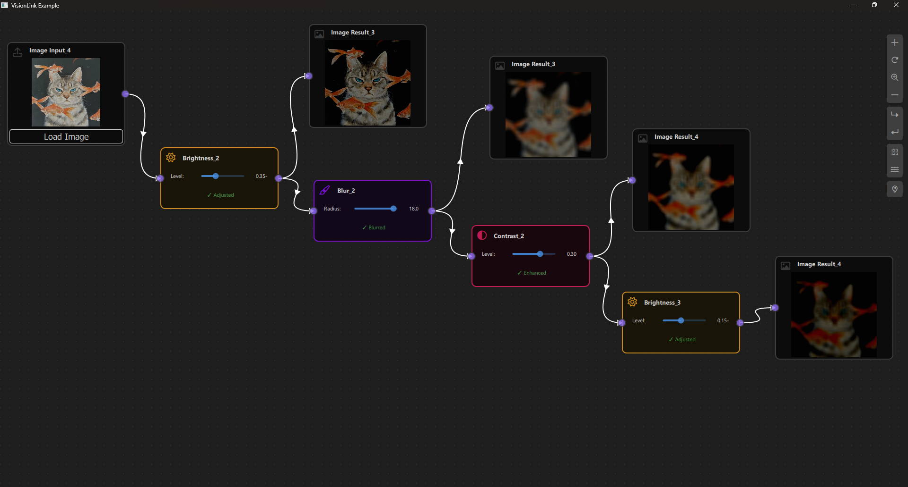

# VisionLink Example

## Overview

The VisionLink Example demonstrates how to build a visual image processing application using NodeLink. This example allows users to create image processing pipelines by connecting nodes that load, process, and display images. It showcases how to integrate C++ image processing code with QML nodes, handle image data flow through the node graph, and create interactive controls for real-time image manipulation. Perfect for learning how to build domain-specific node-based applications with custom data types and processing logic.


---

## a. Purpose and Use Cases

### Purpose

The VisionLink Example demonstrates:

1. **Image Processing Pipelines**: Create visual pipelines for processing images using connected nodes.

2. **C++/QML Integration**: Shows how to integrate C++ image processing code with QML node-based interfaces.

3. **Custom Data Types**: Demonstrates handling complex data types (images) through the node graph.

4. **Real-Time Processing**: Process images in real-time as parameters change or images are loaded.

5. **Interactive Controls**: Provides sliders and controls for adjusting processing parameters interactively.

6. **Image Visualization**: Displays images directly in nodes for visual feedback.

7. **Data Flow Management**: Handles complex data propagation through processing chains.

### Use Cases

- **Image Editing Tools**: Build custom image editing applications with visual workflows
- **Photo Processing**: Create photo processing pipelines for batch operations
- **Computer Vision**: Prototype computer vision algorithms visually
- **Educational Tool**: Learn image processing concepts through visual programming
- **Prototyping**: Quickly prototype image processing workflows
- **Custom Filters**: Create and test custom image filters and effects

### Example Scenarios

- **Basic Image Processing**: Load an image, apply blur, adjust brightness, and view the result
- **Multi-Step Pipelines**: Chain multiple operations (blur → brightness → contrast)
- **Parameter Tuning**: Adjust processing parameters in real-time and see immediate results
- **Image Comparison**: Process the same image with different parameters side-by-side
- **Workflow Design**: Design reusable image processing workflows

### Real-World Applications

- **Photo Editing Software**: Build custom photo editing tools
- **Image Filter Apps**: Create Instagram-like filter applications
- **Scientific Image Processing**: Process microscopy or medical images
- **Artistic Tools**: Create digital art processing tools
- **Quality Control**: Automated image quality enhancement pipelines

 <!-- TODO: Insert diagram showing different use cases -->

---

## b. Node Types Explained

The VisionLink Example implements five node types, each serving a specific role in the image processing pipeline.

### 1. Image Input Node (`ImageInputNode`)

**Purpose**: Loads image files from disk and provides them to the processing pipeline.

**Type ID**: `CSpecs.NodeType.ImageInput` (0)

**Properties**:
- Contains a single output port
- Loads images from file system
- Displays image preview in the node
- Acts as the starting point for image processing pipelines

**Ports**:
- **Output Port**: (Right side) - Emits the loaded image data

**Properties**:
- `imagePath`: String path to the loaded image file
- `nodeData.data`: QImage object containing the loaded image

**Behavior**:
- Click "Load Image" button to open file dialog
- Supports common image formats (PNG, JPG, JPEG, BMP)
- Displays image preview in the node
- When image is loaded, triggers scene update to propagate to connected nodes
- Image data is stored as QImage object

**Visual Appearance**:
- Icon: Upload icon (Font Awesome \uf093)
- Color: Gray (#444)
- Size: 250x220 pixels
- Shows image preview when loaded
- "Load Image" button at the bottom

**Usage Example**:
- Click "Load Image" → Select image file → Image loads and displays
- Image is available at output port for connected nodes

 <!-- TODO: Insert screenshot of ImageInputNode with loaded image -->

**Code Implementation**:
```qml
function loadImage(path) {
    imagePath = path;
    var loadedImage = ImageProcessor.loadImage(path);
    if (ImageProcessor.isValidImage(loadedImage)) {
        nodeData.data = loadedImage;
    } else {
        nodeData.data = null;
    }
}
```

---

### 2. Blur Operation Node (`BlurOperationNode`)

**Purpose**: Applies blur effect to input images using a configurable blur radius.

**Type ID**: `CSpecs.NodeType.Blur` (2)

**Properties**:
- Has one input port and one output port
- Applies box blur algorithm to images
- Configurable blur radius (0.0 to 20.0)

**Ports**:
- **Input Port**: (Left side) - Receives image to blur
- **Output Port**: (Right side) - Emits blurred image

**Properties**:
- `blurRadius`: Real value (0.0 to 20.0) controlling blur intensity
- `nodeData.input`: Input image data
- `nodeData.data`: Processed blurred image

**Behavior**:
- Waits for input image to be connected
- Applies blur using box blur algorithm (implemented in C++)
- Updates output when blur radius changes
- Shows status indicator (✓ Blurred or Waiting...)

**Visual Appearance**:
- Icon: Blur icon (Font Awesome \uf1fc)
- Color: Purple (#9013FE)
- Size: 250x70 pixels (expands based on content)
- Slider control for blur radius
- Status text showing processing state

**Usage Example**:
- Connect ImageInput output → Blur input
- Adjust blur radius slider (0-20)
- Output shows blurred image

 <!-- TODO: Insert screenshot of BlurOperationNode with controls -->

**Code Implementation**:
```qml
function updataData() {
    if (!nodeData.input) {
        nodeData.data = null;
        return;
    }
    var inputImage = nodeData.input;
    if (!ImageProcessor.isValidImage(inputImage)) {
        nodeData.data = null;
        return;
    }
    var blurredImage = ImageProcessor.applyBlur(inputImage, blurRadius);
    nodeData.data = blurredImage;
}
```

---

### 3. Brightness Operation Node (`BrightnessOperationNode`)

**Purpose**: Adjusts the brightness of input images.

**Type ID**: `CSpecs.NodeType.Brightness` (3)

**Properties**:
- Has one input port and one output port
- Adjusts image brightness by adding/subtracting from pixel values
- Configurable brightness level (-1.0 to 1.0)

**Ports**:
- **Input Port**: (Left side) - Receives image to adjust
- **Output Port**: (Right side) - Emits brightness-adjusted image

**Properties**:
- `brightnessLevel`: Real value (-1.0 to 1.0) where 0 = normal, negative = darker, positive = brighter
- `nodeData.input`: Input image data
- `nodeData.data`: Processed image with adjusted brightness

**Behavior**:
- Waits for input image to be connected
- Adjusts brightness by modifying RGB values
- Updates output when brightness level changes
- Shows status indicator (✓ Adjusted or Waiting...)

**Visual Appearance**:
- Icon: Sun/Brightness icon (Font Awesome \uf185)
- Color: Orange (#F5A623)
- Size: 250x70 pixels (expands based on content)
- Slider control for brightness level (-1.0 to 1.0)
- Status text showing processing state

**Usage Example**:
- Connect ImageInput output → Brightness input
- Adjust brightness slider (-1.0 to 1.0)
- Output shows brighter or darker image

 <!-- TODO: Insert screenshot of BrightnessOperationNode with controls -->

**Code Implementation**:
```qml
function updataData() {
    if (!nodeData.input) {
        nodeData.data = null;
        return;
    }
    var inputImage = nodeData.input;
    if (!ImageProcessor.isValidImage(inputImage)) {
        nodeData.data = null;
        return;
    }
    var processedImage = ImageProcessor.applyBrightness(inputImage, brightnessLevel);
    nodeData.data = processedImage;
}
```

---

### 4. Contrast Operation Node (`ContrastOperationNode`)

**Purpose**: Adjusts the contrast of input images.

**Type ID**: `CSpecs.NodeType.Contrast` (4)

**Properties**:
- Has one input port and one output port
- Adjusts image contrast by scaling pixel values around midpoint
- Configurable contrast level (-1.0 to 1.0)

**Ports**:
- **Input Port**: (Left side) - Receives image to adjust
- **Output Port**: (Right side) - Emits contrast-adjusted image

**Properties**:
- `contrastLevel`: Real value (-1.0 to 1.0) where 0 = normal, negative = less contrast, positive = more contrast
- `nodeData.input`: Input image data
- `nodeData.data`: Processed image with adjusted contrast

**Behavior**:
- Waits for input image to be connected
- Adjusts contrast using formula: `newValue = factor * (oldValue - 128) + 128`
- Updates output when contrast level changes
- Shows status indicator (✓ Enhanced or Waiting...)

**Visual Appearance**:
- Icon: Contrast/Eye icon (Font Awesome \uf042)
- Color: Pink (#E91E63)
- Size: 250x70 pixels (expands based on content)
- Slider control for contrast level (-1.0 to 1.0)
- Status text showing processing state

**Usage Example**:
- Connect ImageInput output → Contrast input
- Adjust contrast slider (-1.0 to 1.0)
- Output shows image with adjusted contrast

 <!-- TODO: Insert screenshot of ContrastOperationNode with controls -->

**Code Implementation**:
```qml
function updataData() {
    if (!nodeData.input) {
        nodeData.data = null;
        return;
    }
    var inputImage = nodeData.input;
    if (!ImageProcessor.isValidImage(inputImage)) {
        nodeData.data = null;
        return;
    }
    var processedImage = ImageProcessor.applyContrast(inputImage, contrastLevel);
    nodeData.data = processedImage;
}
```

---

### 5. Image Result Node (`ImageResultNode`)

**Purpose**: Displays the final processed image result.

**Type ID**: `CSpecs.NodeType.ImageResult` (1)

**Properties**:
- Contains a single input port
- Displays processed images for visual feedback
- Read-only display node

**Ports**:
- **Input Port**: (Left side) - Receives processed image to display

**Properties**:
- `nodeData.data`: QImage object to display

**Behavior**:
- Receives image from connected operation node
- Converts QImage to data URL for display
- Updates automatically when input image changes
- Shows "No Image" when no input is connected

**Visual Appearance**:
- Icon: Image/Photo icon (Font Awesome \uf03e)
- Color: Gray (#444)
- Size: 250x220 pixels
- Displays image preview with aspect ratio preserved
- Shows status text when no image is available

**Usage Example**:
- Connect any operation node output → ImageResult input
- ImageResult displays the processed image
- Useful for viewing final results or intermediate steps

 <!-- TODO: Insert screenshot of ImageResultNode displaying processed image -->

**Display Behavior**:
- Converts QImage to base64 data URL
- Displays image using QML Image component
- Preserves aspect ratio
- Shows loading/error states

---

### Node Type Summary Table

| Node Type | Type ID | Input Ports | Output Ports | Operation | Color |
|-----------|---------|-------------|--------------|-----------|-------|
| ImageInput | 0 | 0 | 1 | Load image from file | Gray (#444) |
| ImageResult | 1 | 1 | 0 | Display image | Gray (#444) |
| Blur | 2 | 1 | 1 | Apply blur effect | Purple (#9013FE) |
| Brightness | 3 | 1 | 1 | Adjust brightness | Orange (#F5A623) |
| Contrast | 4 | 1 | 1 | Adjust contrast | Pink (#E91E63) |

---

### Data Flow Architecture

The image processing follows a pipeline pattern:

```
Image Input Node (loads image)
    ↓
Operation Nodes (Blur/Brightness/Contrast)
    ↓
Image Result Node (displays result)
```

Images flow through the pipeline as QImage objects, processed by C++ code for performance.

 <!-- TODO: Insert diagram showing image data flow through nodes -->

---

## c. Step-by-Step Building Guide

This guide will walk you through building the VisionLink Example from scratch, explaining each component and how they work together.

### Prerequisites

- Qt 6.2.4 or later (Qt 6.10.0 recommended)
- CMake 3.1.0 or later
- C++ compiler with C++14 support (MSVC 2019/2022 on Windows)
- NodeLink framework built and installed
- QtQuickStream module built and installed
- Basic understanding of C++/QML integration

### Step 1: Project Setup

#### 1.1 Create Project Structure

Create the following directory structure:

```
visionLink/
├── CMakeLists.txt
├── main.cpp
├── main.qml
├── ImageProcessor.h
├── ImageProcessor.cpp
└── resources/
    ├── Core/
    ├── View/
    └── fonts/
```

#### 1.2 Configure CMakeLists.txt

Create `CMakeLists.txt` with the following configuration:

```cmake
cmake_minimum_required(VERSION 3.1.0)

set(CMAKE_AUTOMOC ON)
set(CMAKE_CXX_STANDARD_REQUIRED ON)

# Configure Qt
find_package(QT NAMES Qt6 Qt5 COMPONENTS Core Gui QuickControls2 REQUIRED)
find_package(Qt${QT_VERSION_MAJOR} COMPONENTS Core Gui QuickControls2 REQUIRED)

list(APPEND QML_IMPORT_PATH ${CMAKE_BINARY_DIR}/qml)

# Create executable
qt_add_executable(VisionLink main.cpp)

# Set singletons
set_source_files_properties(
    resources/Core/CSpecs.qml
    resources/Core/ImageProcessor.qml
    PROPERTIES
        QT_QML_SINGLETON_TYPE True
)

# Define QML module
qt_add_qml_module(VisionLink
    URI "VisionLink"
    VERSION 1.0
    QML_FILES
        main.qml
        resources/Core/CSpecs.qml
        resources/Core/ImageProcessor.qml
        resources/Core/VisionLinkScene.qml
        resources/Core/ImageInputNode.qml
        resources/Core/ImageResultNode.qml
        resources/Core/OperationNode.qml
        resources/Core/OperationNodeData.qml
        resources/Core/BlurOperationNode.qml
        resources/Core/BrightnessOperationNode.qml
        resources/Core/ContrastOperationNode.qml
        resources/View/VisionLinkView.qml
        resources/View/VisionLinkNodeView.qml
    SOURCES
        ImageProcessor.h
        ImageProcessor.cpp
    RESOURCES
        resources/fonts/Font\ Awesome\ 6\ Pro-Thin-100.otf
        resources/fonts/Font\ Awesome\ 6\ Pro-Solid-900.otf
        resources/fonts/Font\ Awesome\ 6\ Pro-Regular-400.otf
        resources/fonts/Font\ Awesome\ 6\ Pro-Light-300.otf
)

target_include_directories(VisionLink PUBLIC
    Qt${QT_VERSION_MAJOR}::QuickControls2)

target_link_libraries(VisionLink PRIVATE
    Qt${QT_VERSION_MAJOR}::Core
    Qt${QT_VERSION_MAJOR}::Gui
    Qt${QT_VERSION_MAJOR}::QuickControls2
    NodeLinkplugin
    QtQuickStreamplugin
)
```

**Key Points**:
- Links to `NodeLinkplugin` and `QtQuickStreamplugin`
- Sets `CSpecs.qml` and `ImageProcessor.qml` as singletons
- Includes C++ source files for image processing
- Includes Font Awesome fonts for icons

---

### Step 2: Create C++ Image Processor

#### 2.1 ImageProcessor.h

Create `ImageProcessor.h` - C++ header for image processing:

```cpp
#ifndef IMAGEPROCESSOR_H
#define IMAGEPROCESSOR_H

#include <QObject>
#include <QImage>
#include <QString>
#include <QUrl>
#include <QVariant>
#include <QQmlEngine>
#include <QJSEngine>

class ImageProcessor : public QObject
{
    Q_OBJECT
    QML_NAMED_ELEMENT(ImageProcessorCPP)
    QML_SINGLETON

public:
    explicit ImageProcessor(QObject *parent = nullptr);
    
    static ImageProcessor* create(QQmlEngine *qmlEngine, QJSEngine *jsEngine)
    {
        Q_UNUSED(jsEngine);
        return new ImageProcessor(qmlEngine);
    }

    Q_INVOKABLE QVariant loadImage(const QString &path);
    Q_INVOKABLE QVariant applyBlur(const QVariant &imageData, qreal radius);
    Q_INVOKABLE QVariant applyBrightness(const QVariant &imageData, qreal level);
    Q_INVOKABLE QVariant applyContrast(const QVariant &imageData, qreal level);
    Q_INVOKABLE QString saveToDataUrl(const QVariant &imageData);
    Q_INVOKABLE bool isValidImage(const QVariant &imageData) const;

private:
    QImage variantToImage(const QVariant &imageData) const;
    QVariant imageToVariant(const QImage &image) const;
    QImage boxBlur(const QImage &source, int radius);
    QImage adjustBrightness(const QImage &source, qreal level);
    QImage adjustContrast(const QImage &source, qreal level);
};

#endif // IMAGEPROCESSOR_H
```

**Key Features**:
- QML singleton accessible from QML
- Methods for loading and processing images
- Helper methods for QVariant/QImage conversion
- Image processing algorithms (blur, brightness, contrast)

---

#### 2.2 ImageProcessor.cpp

Create `ImageProcessor.cpp` - C++ implementation (see source file for full implementation).

**Key Algorithms**:

1. **Box Blur**: Two-pass blur (horizontal then vertical) for performance
2. **Brightness**: Adds/subtracts value from RGB channels
3. **Contrast**: Scales pixel values around midpoint (128)

**Key Features**:
- Handles file:// URL cleanup
- Ensures detached image copies for memory safety
- Converts images to data URLs for QML display
- Validates image data

---

### Step 3: Create QML Image Processor Wrapper

#### 3.1 ImageProcessor.qml

Create `resources/Core/ImageProcessor.qml` - QML wrapper for C++ processor:

```qml
pragma Singleton

import QtQuick
import VisionLink

QtObject {
    function loadImage(path) {
        return ImageProcessorCPP.loadImage(path);
    }
    
    function applyBlur(imageData, radius) {
        return ImageProcessorCPP.applyBlur(imageData, radius);
    }
    
    function applyBrightness(imageData, level) {
        return ImageProcessorCPP.applyBrightness(imageData, level);
    }
    
    function applyContrast(imageData, level) {
        return ImageProcessorCPP.applyContrast(imageData, level);
    }
    
    function saveToDataUrl(imageData) {
        return ImageProcessorCPP.saveToDataUrl(imageData);
    }
    
    function isValidImage(imageData) {
        return ImageProcessorCPP.isValidImage(imageData);
    }
}
```

**Purpose**: Provides a clean QML interface to C++ image processing functions.

---

### Step 4: Create Specifications

#### 4.1 CSpecs.qml

Create `resources/Core/CSpecs.qml`:

```qml
pragma Singleton
import QtQuick

QtObject {
    enum NodeType {
        ImageInput      = 0,
        ImageResult     = 1,
        Blur            = 2,
        Brightness      = 3,
        Contrast        = 4,
        Operation       = 5,
        Unknown         = 99
    }

    enum OperationType {
        Blur            = 0,
        Brightness      = 1,
        Contrast        = 2,
        Unknown         = 99
    }
}
```

---

### Step 5: Create Node Data Models

#### 5.1 OperationNodeData.qml

Create `resources/Core/OperationNodeData.qml`:

```qml
import QtQuick
import NodeLink

I_NodeData {
    property var input: null
}
```

**Purpose**: Stores input image data for operation nodes.

---

### Step 6: Create Base Node Types

#### 6.1 OperationNode.qml

Create `resources/Core/OperationNode.qml` - base class for operation nodes:

```qml
import QtQuick
import NodeLink

Node {
    property int operationType: CSpecs.OperationType.Blur
    
    type: CSpecs.NodeType.Operation
    nodeData: OperationNodeData {}
    
    guiConfig.width: 250
    guiConfig.height: 70

    Component.onCompleted: addPorts();

    function addPorts() {
        let _port1 = NLCore.createPort();
        let _port2 = NLCore.createPort();

        _port1.portType = NLSpec.PortType.Input
        _port1.portSide = NLSpec.PortPositionSide.Left
        _port1.enable = false;

        _port2.portType = NLSpec.PortType.Output
        _port2.portSide = NLSpec.PortPositionSide.Right

        addPort(_port1);
        addPort(_port2);
    }
}
```

---

### Step 7: Create Specific Operation Nodes

#### 7.1 BlurOperationNode.qml

Create `resources/Core/BlurOperationNode.qml`:

```qml
import QtQuick
import NodeLink
import VisionLink

OperationNode {
    operationType: CSpecs.OperationType.Blur
    type: CSpecs.NodeType.Blur
    
    property real blurRadius: 5.0

    function updataData() {
        if (!nodeData.input) {
            nodeData.data = null;
            return;
        }
        var inputImage = nodeData.input;
        if (!ImageProcessor.isValidImage(inputImage)) {
            nodeData.data = null;
            return;
        }
        var blurredImage = ImageProcessor.applyBlur(inputImage, blurRadius);
        nodeData.data = blurredImage;
    }
}
```

---

#### 7.2 BrightnessOperationNode.qml

Create `resources/Core/BrightnessOperationNode.qml`:

```qml
import QtQuick
import NodeLink
import VisionLink

OperationNode {
    operationType: CSpecs.OperationType.Brightness
    type: CSpecs.NodeType.Brightness
    
    property real brightnessLevel: 0.0

    function updataData() {
        if (!nodeData.input) {
            nodeData.data = null;
            return;
        }
        var inputImage = nodeData.input;
        if (!ImageProcessor.isValidImage(inputImage)) {
            nodeData.data = null;
            return;
        }
        var processedImage = ImageProcessor.applyBrightness(inputImage, brightnessLevel);
        nodeData.data = processedImage;
    }
}
```

---

#### 7.3 ContrastOperationNode.qml

Create `resources/Core/ContrastOperationNode.qml`:

```qml
import QtQuick
import NodeLink
import VisionLink

OperationNode {
    operationType: CSpecs.OperationType.Contrast
    type: CSpecs.NodeType.Contrast
    
    property real contrastLevel: 0.0

    function updataData() {
        if (!nodeData.input) {
            nodeData.data = null;
            return;
        }
        var inputImage = nodeData.input;
        if (!ImageProcessor.isValidImage(inputImage)) {
            nodeData.data = null;
            return;
        }
        var processedImage = ImageProcessor.applyContrast(inputImage, contrastLevel);
        nodeData.data = processedImage;
    }
}
```

---

### Step 8: Create Input and Result Nodes

#### 8.1 ImageInputNode.qml

Create `resources/Core/ImageInputNode.qml`:

```qml
import QtQuick
import NodeLink

Node {
    type: CSpecs.NodeType.ImageInput
    nodeData: I_NodeData {}
    
    guiConfig.width: 250
    guiConfig.height: 220
    
    property string imagePath: ""

    Component.onCompleted: addPorts();

    onCloneFrom: function (baseNode) {
        nodeData.data = null;
        imagePath = "";
    }

    function addPorts() {
        let _port1 = NLCore.createPort();
        _port1.portType = NLSpec.PortType.Output
        _port1.portSide = NLSpec.PortPositionSide.Right
        addPort(_port1);
    }

    function loadImage(path) {
        imagePath = path;
        var loadedImage = ImageProcessor.loadImage(path);
        if (ImageProcessor.isValidImage(loadedImage)) {
            nodeData.data = loadedImage;
        } else {
            nodeData.data = null;
        }
    }
}
```

---

#### 8.2 ImageResultNode.qml

Create `resources/Core/ImageResultNode.qml`:

```qml
import QtQuick
import NodeLink

Node {
    type: CSpecs.NodeType.ImageResult
    nodeData: I_NodeData {}
    
    guiConfig.width: 250
    guiConfig.height: 220

    Component.onCompleted: addPorts();

    onCloneFrom: function (baseNode) {
        nodeData.data = null;
    }

    function addPorts() {
        let _port1 = NLCore.createPort();
        _port1.portType = NLSpec.PortType.Input
        _port1.portSide = NLSpec.PortPositionSide.Left
        addPort(_port1);
    }
}
```

---

### Step 9: Create the Scene

#### 9.1 VisionLinkScene.qml

Create `resources/Core/VisionLinkScene.qml` - the main scene with image data propagation:

```qml
import QtQuick
import QtQuick.Controls
import NodeLink
import VisionLink

I_Scene {
    id: scene

    nodeRegistry: NLNodeRegistry {
        _qsRepo: scene._qsRepo
        imports: ["VisionLink"]
        defaultNode: CSpecs.NodeType.ImageInput
        
        nodeTypes: [
            CSpecs.NodeType.ImageInput = "ImageInputNode",
            CSpecs.NodeType.ImageResult = "ImageResultNode",
            CSpecs.NodeType.Blur = "BlurOperationNode",
            CSpecs.NodeType.Brightness = "BrightnessOperationNode",
            CSpecs.NodeType.Contrast = "ContrastOperationNode"
        ];
        
        nodeNames: [
            CSpecs.NodeType.ImageInput = "Image Input",
            CSpecs.NodeType.ImageResult = "Image Result",
            CSpecs.NodeType.Blur = "Blur",
            CSpecs.NodeType.Brightness = "Brightness",
            CSpecs.NodeType.Contrast = "Contrast"
        ];
        
        nodeIcons: [
            CSpecs.NodeType.ImageInput = "\uf093",
            CSpecs.NodeType.ImageResult = "\uf03e",
            CSpecs.NodeType.Blur = "\uf1fc",
            CSpecs.NodeType.Brightness = "\uf185",
            CSpecs.NodeType.Contrast = "\uf042"
        ];
        
        nodeColors: [
            CSpecs.NodeType.ImageInput = "#444",
            CSpecs.NodeType.ImageResult = "#444",
            CSpecs.NodeType.Blur = "#9013FE",
            CSpecs.NodeType.Brightness = "#F5A623",
            CSpecs.NodeType.Contrast = "#E91E63"
        ];
    }

    selectionModel: SelectionModel {
        existObjects: [...Object.keys(nodes), ...Object.keys(links)]
    }

    property UndoCore _undoCore: UndoCore {
        scene: scene
    }

    onLinkRemoved: _upateDataTimer.start();
    onNodeRemoved: _upateDataTimer.start();
    onLinkAdded: updateData();

    property Timer _upateDataTimer: Timer {
        repeat: false
        running: false
        interval: 1
        onTriggered: scene.updateData();
    }

    function createCustomizeNode(nodeType, xPos, yPos) {
        var title = nodeRegistry.nodeNames[nodeType] + "_" + 
                   (Object.values(scene.nodes).filter(node => node.type === nodeType).length + 1);
        return createSpecificNode(nodeRegistry.imports, nodeType,
                                 nodeRegistry.nodeTypes[nodeType],
                                 nodeRegistry.nodeColors[nodeType],
                                 title, xPos, yPos);
    }

    // Update all node data with iterative propagation
    function updateData() {
        // Reset operation and result nodes
        Object.values(nodes).forEach(node => {
            switch (node.type) {
                case CSpecs.NodeType.Blur:
                case CSpecs.NodeType.Brightness:
                case CSpecs.NodeType.Contrast: {
                    node.nodeData.data = null;
                    node.nodeData.input = null;
                } break;
                case CSpecs.NodeType.ImageResult: {
                    node.nodeData.data = null;
                } break;
            }
        });

        // Iterative propagation algorithm
        var allLinks = Object.values(links);
        var remainingLinks = allLinks.slice();
        var maxIterations = 100;
        var iteration = 0;
        
        while (remainingLinks.length > 0 && iteration < maxIterations) {
            iteration++;
            var linksProcessedThisIteration = [];
            var linksStillWaiting = [];
            
            remainingLinks.forEach(function(link) {
                var portA = link.inputPort._qsUuid;
                var portB = link.outputPort._qsUuid;
                var upstreamNode = findNode(portA);
                var downStreamNode = findNode(portB);
                
                var upstreamHasData = upstreamNode.nodeData.data !== null && 
                                     upstreamNode.nodeData.data !== undefined;
                
                if (upstreamNode.type === CSpecs.NodeType.ImageInput) {
                    upstreamHasData = true;
                }
                
                if (upstreamHasData) {
                    upadateNodeData(upstreamNode, downStreamNode);
                    linksProcessedThisIteration.push(link);
                } else {
                    linksStillWaiting.push(link);
                }
            });
            
            remainingLinks = linksStillWaiting;
            
            if (linksProcessedThisIteration.length === 0) {
                break;
            }
        }
    }

    // Update data from a specific node (for parameter changes)
    function updateDataFromNode(startingNode) {
        if (startingNode.type === CSpecs.NodeType.Blur ||
            startingNode.type === CSpecs.NodeType.Brightness ||
            startingNode.type === CSpecs.NodeType.Contrast) {
            startingNode.updataData();
        }
        
        // Propagate to downstream nodes
        var nodesToUpdate = [startingNode];
        var processedNodes = [];
        var maxIterations = 100;
        var iteration = 0;
        
        while (nodesToUpdate.length > 0 && iteration < maxIterations) {
            iteration++;
            var currentNode = nodesToUpdate.shift();
            processedNodes.push(currentNode._qsUuid);
            
            var downstreamLinks = Object.values(links).filter(function(link) {
                var upstreamNodeId = findNodeId(link.inputPort._qsUuid);
                return upstreamNodeId === currentNode._qsUuid;
            });
                        
            downstreamLinks.forEach(function(link) {
                var portB = link.outputPort._qsUuid;
                var downStreamNode = findNode(portB);
                upadateNodeData(currentNode, downStreamNode);
                
                if (processedNodes.indexOf(downStreamNode._qsUuid) === -1) {
                    nodesToUpdate.push(downStreamNode);
                }
            });
        }
    }

    // Update specific node data
    function upadateNodeData(upstreamNode, downStreamNode) {
        switch (downStreamNode.type) {
            case CSpecs.NodeType.Blur:
            case CSpecs.NodeType.Brightness:
            case CSpecs.NodeType.Contrast: {
                downStreamNode.nodeData.input = upstreamNode.nodeData.data;
                downStreamNode.updataData();
            } break;
            case CSpecs.NodeType.ImageResult: {
                downStreamNode.nodeData.data = upstreamNode.nodeData.data;
            } break;
        }
    }

    // Link validation (same as other examples)
    function linkNodes(portA, portB) {
        if (!canLinkNodes(portA, portB)) {
            console.error("[Scene] Cannot link Nodes");
            return;
        }
        let link = Object.values(links).find(conObj =>
            conObj.inputPort._qsUuid === portA &&
            conObj.outputPort._qsUuid === portB);
        if (link === undefined)
            createLink(portA, portB);
    }

    function canLinkNodes(portA, portB) {
        // Validation logic (see source file)
        return true;
    }
}
```

**Key Features**:
- **Iterative Propagation**: Handles complex image data flow
- **Parameter Updates**: `updateDataFromNode()` for real-time parameter changes
- **Image Data Handling**: Properly propagates QImage objects through the graph

 <!-- TODO: Insert diagram showing scene structure and data flow -->

---

### Step 10: Create Views

#### 10.1 VisionLinkNodeView.qml

Create `resources/View/VisionLinkNodeView.qml` - custom view with image display and controls (see source file for full implementation).

**Key Features**:
- **Dynamic Components**: Different views for each node type
- **Image Display**: Shows image previews in ImageInput and ImageResult nodes
- **Interactive Controls**: Sliders for operation parameters
- **Status Indicators**: Shows processing state
- **Minimal Mode**: Icon-only view when zoomed out

---

#### 10.2 VisionLinkView.qml

Create `resources/View/VisionLinkView.qml`:

```qml
import QtQuick
import QtQuick.Controls
import NodeLink
import QtQuickStream
import VisionLink

Item {
    id: view
    property VisionLinkScene scene

    property SceneSession sceneSession: SceneSession {
        enabledOverview: false;
        doNodesNeedImage: false
    }

    NodesScene {
        id: nodesScene
        anchors.fill: parent
        scene: view.scene
        sceneSession: view.sceneSession
        sceneContent: NodesRect {
            scene: view.scene
            sceneSession: view.sceneSession
            nodeViewComponent: Qt.createComponent("VisionLinkNodeView.qml")
        }
    }

    SideMenu {
        scene: view.scene
        sceneSession: view.sceneSession
        anchors.right: parent.right
        anchors.rightMargin: 45
        anchors.top: parent.top
        anchors.topMargin: 50
    }
}
```

---

### Step 11: Create Main Application

#### 11.1 main.cpp

Create `main.cpp`:

```cpp
#include <QtGui/QGuiApplication>
#include <QQmlApplicationEngine>
#include <QQuickStyle>

int main(int argc, char* argv[])
{
    QGuiApplication app(argc, argv);
    QQmlApplicationEngine engine;

    QQuickStyle::setStyle("Material");
    engine.addImportPath(":/");

    const QUrl url(u"qrc:/VisionLink/main.qml"_qs);
    QObject::connect(&engine, &QQmlApplicationEngine::objectCreated,
                     &app, [url](QObject *obj, const QUrl &objUrl) {
        if (!obj && url == objUrl)
            QCoreApplication::exit(-1);
    }, Qt::QueuedConnection);
    engine.load(url);

    return app.exec();
}
```

---

#### 11.2 main.qml

Create `main.qml`:

```qml
import QtQuick
import QtQuick.Dialogs
import QtQuick.Controls
import QtQuickStream
import NodeLink
import VisionLink

Window {
    id: window
    property VisionLinkScene scene: null

    width: 1280
    height: 960
    visible: true
    title: qsTr("VisionLink Example")
    color: "#1e1e1e"

    Material.theme: Material.Dark
    Material.accent: "#4890e2"

    Component.onCompleted: {
        NLCore.defaultRepo = NLCore.createDefaultRepo(["QtQuickStream", "VisionLink"])
        NLCore.defaultRepo.initRootObject("VisionLinkScene");
        window.scene = Qt.binding(function() { 
            return NLCore.defaultRepo.qsRootObject;
        });
    }

    FontLoader { source: "qrc:/VisionLink/resources/fonts/Font Awesome 6 Pro-Thin-100.otf" }
    FontLoader { source: "qrc:/VisionLink/resources/fonts/Font Awesome 6 Pro-Solid-900.otf" }
    FontLoader { source: "qrc:/VisionLink/resources/fonts/Font Awesome 6 Pro-Regular-400.otf" }
    FontLoader { source: "qrc:/VisionLink/resources/fonts/Font Awesome 6 Pro-Light-300.otf" }

    VisionLinkView {
        id: view
        scene: window.scene
        anchors.fill: parent
    }
}
```


---

### Step 12: Build and Run

#### 12.1 Configure Build

1. Create a build directory:
   ```bash
   mkdir build
   cd build
   ```

2. Configure with CMake:
   ```bash
   cmake .. -DCMAKE_PREFIX_PATH=<Qt_Install_Path>
   ```

3. Build the project:
   ```bash
   cmake --build .
   ```

#### 12.2 Run the Application

Run the executable:
```bash
./VisionLink  # Linux/Mac
VisionLink.exe  # Windows
```

---

### Step 13: Using VisionLink

#### Basic Usage

1. **Load Image**:
   - Add an ImageInput node
   - Click "Load Image" button
   - Select an image file

2. **Apply Operations**:
   - Add operation nodes (Blur, Brightness, Contrast)
   - Connect ImageInput output → Operation input
   - Adjust sliders to change parameters
   - See real-time updates

3. **View Results**:
   - Add ImageResult node
   - Connect operation output → ImageResult input
   - View processed image

#### Example: Blur Pipeline

**Setup**:
1. Add ImageInput node → Load image
2. Add Blur node
3. Add ImageResult node

**Connections**:
- ImageInput → Blur
- Blur → ImageResult

**Usage**:
- Adjust blur radius slider
- See blurred result in ImageResult node

#### Example: Multi-Step Pipeline

**Setup**:
1. ImageInput → Blur → Brightness → Contrast → ImageResult

**Usage**:
- Adjust any operation parameter
- See final result in ImageResult
- All downstream nodes update automatically


---

## Architecture Overview

### Component Hierarchy

```
VisionLinkScene (I_Scene)
├── NodeRegistry (defines node types)
├── SelectionModel (manages selection)
├── UndoCore (undo/redo support)
└── Nodes & Links
    ├── ImageInputNode (loads images)
    ├── OperationNodes (Blur, Brightness, Contrast)
    └── ImageResultNode (displays results)

ImageProcessor (C++ Singleton)
├── loadImage() (loads from file)
├── applyBlur() (box blur algorithm)
├── applyBrightness() (brightness adjustment)
├── applyContrast() (contrast adjustment)
└── saveToDataUrl() (converts to base64)

Main Window
├── VisionLinkView
│   ├── NodesScene (canvas)
│   │   └── NodesRect (renders nodes)
│   │       └── VisionLinkNodeView (custom node UI)
│   └── SideMenu (add nodes)
```

### Data Flow

```
Image File
    ↓
ImageInputNode (loads QImage)
    ↓
OperationNode (processes QImage)
    ↓
ImageResultNode (displays QImage)
```

Images flow as QImage objects through the pipeline, processed by C++ for performance.

 <!-- TODO: Insert comprehensive architecture diagram -->

---

## Key Concepts

### C++/QML Integration

- **QML Singleton**: C++ class registered as QML singleton
- **QVariant Transfer**: Images transferred as QVariant containing QImage
- **Memory Management**: Detached copies ensure proper memory handling
- **Data URLs**: Images converted to base64 data URLs for QML display

### Image Processing

- **Box Blur**: Two-pass blur algorithm (horizontal + vertical)
- **Brightness**: Adds/subtracts value from RGB channels
- **Contrast**: Scales pixel values around midpoint

### Data Propagation

- **Iterative Algorithm**: Handles complex processing chains
- **Parameter Updates**: Real-time updates when parameters change
- **Validation**: Checks for valid images before processing

---

## Extending VisionLink

### Adding New Operations

To add a new operation (e.g., Grayscale):

1. **Add to CSpecs.qml**:
   ```qml
   enum NodeType {
       // ... existing
       Grayscale = 5
   }
   ```

2. **Add C++ Method** in ImageProcessor:
   ```cpp
   Q_INVOKABLE QVariant applyGrayscale(const QVariant &imageData);
   ```

3. **Create GrayscaleOperationNode.qml**:
   ```qml
   OperationNode {
       operationType: CSpecs.OperationType.Grayscale
       type: CSpecs.NodeType.Grayscale
       function updataData() {
           // Implementation
       }
   }
   ```

4. **Register in VisionLinkScene.qml**

5. **Add View Component** in VisionLinkNodeView.qml

### Performance Optimization

- Use C++ for heavy processing
- Cache processed images when possible
- Optimize blur algorithm (use GPU if available)
- Reduce image resolution for previews

---

## Troubleshooting

### Common Issues

1. **Images Not Loading**:
   - Check file path format
   - Verify image format is supported
   - Check file permissions

2. **Processing Slow**:
   - Large images take longer
   - Consider downscaling for preview
   - Optimize C++ algorithms

3. **Images Not Displaying**:
   - Check data URL conversion
   - Verify QImage is valid
   - Check console for errors

4. **Parameters Not Updating**:
   - Verify `updateDataFromNode()` is called
   - Check slider value changes
   - Ensure scene update is triggered

### Debug Tips

- Enable console logging
- Check image validity: `ImageProcessor.isValidImage()`
- Verify data propagation: `console.log(node.nodeData.data)`
- Monitor memory usage with large images

---

## Conclusion

The VisionLink Example demonstrates how to build sophisticated image processing applications with NodeLink. Key takeaways:

- **C++ Integration**: Use C++ for performance-critical operations
- **Complex Data Types**: Handle images and other complex data through nodes
- **Real-Time Processing**: Update results as parameters change
- **Visual Feedback**: Display images directly in nodes
- **Extensible Design**: Easy to add new operations and effects

This example serves as a foundation for building:
- Professional image editing tools
- Computer vision applications
- Scientific image processing
- Artistic image manipulation tools
- Automated image processing pipelines

For more examples, see the other examples in the NodeLink repository.


